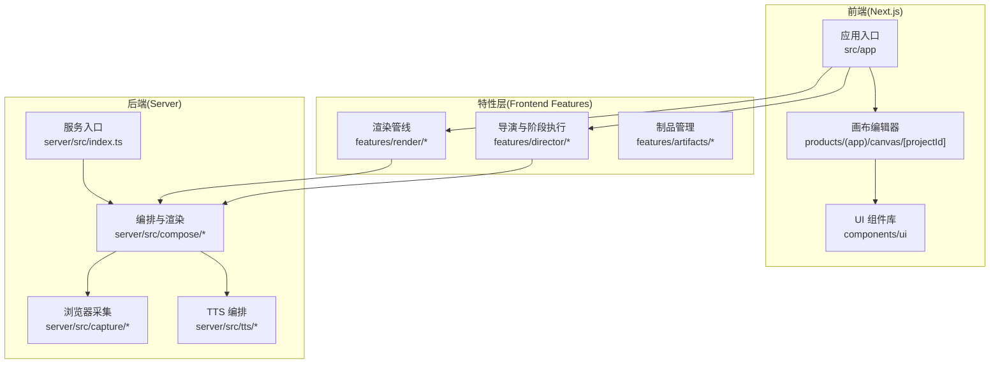
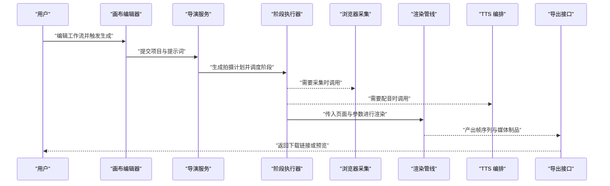
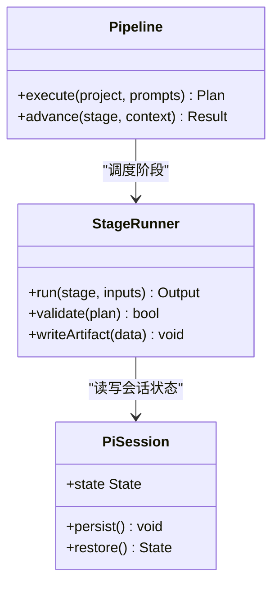
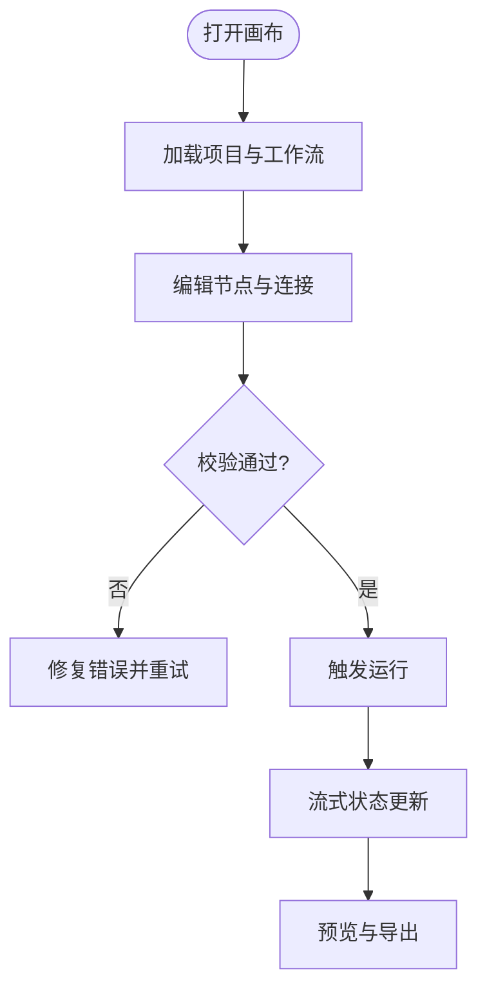
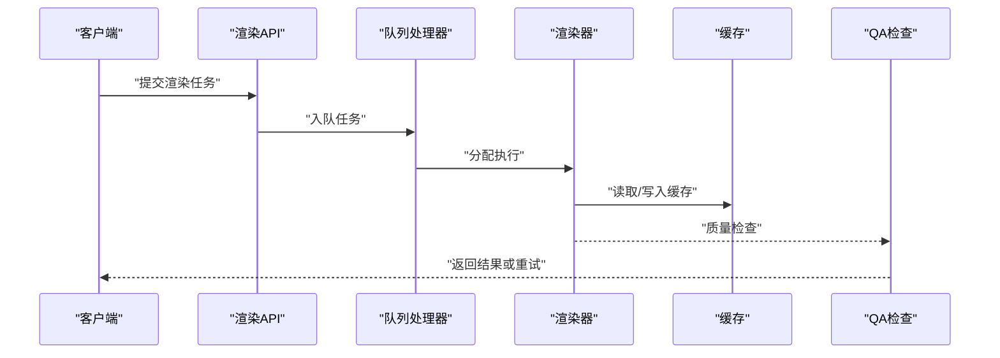
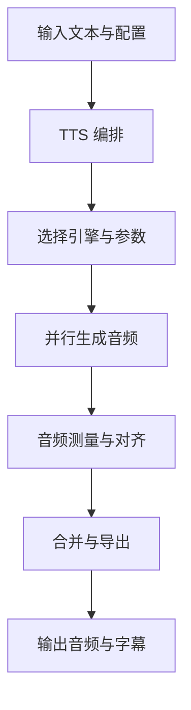
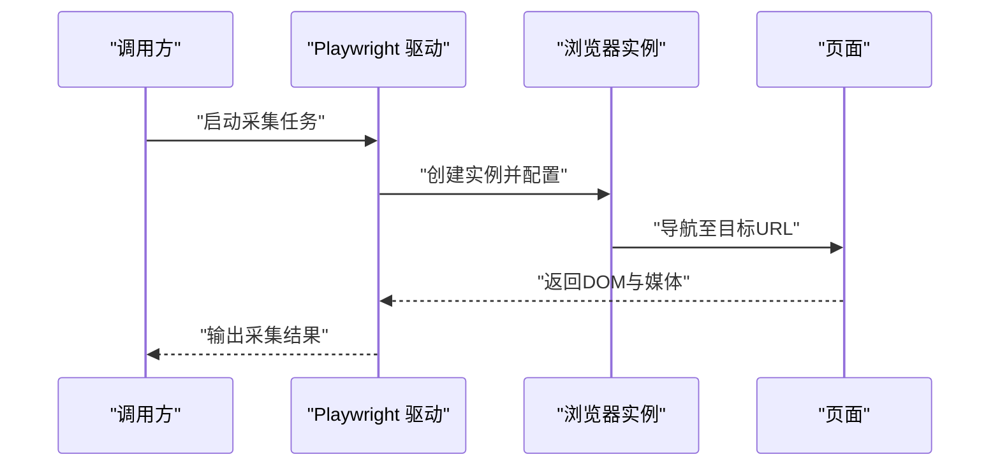
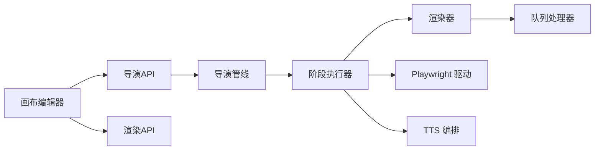

# 核心功能特性

<cite>
**本文引用的文件**   
- [server/src/index.ts](file://server/src/index.ts)
- [server/src/compose/run-pipeline.ts](file://server/src/compose/run-pipeline.ts)
- [server/src/compose/render.ts](file://server/src/compose/render.ts)
- [server/src/capture/playwright-driver.ts](file://server/src/capture/playwright-driver.ts)
- [server/src/tts/orchestrate.ts](file://server/src/tts/orchestrate.ts)
- [src/features/director/pipeline.ts](file://src/features/director/pipeline.ts)
- [src/features/director/stage-runner.ts](file://src/features/director/stage-runner.ts)
- [src/features/render/renderer.ts](file://src/features/render/renderer.ts)
- [src/features/render/queue-handler.ts](file://src/features/render/queue-handler.ts)
- [src/app/api/director/pipeline/route.ts](file://src/app/api/director/pipeline/route.ts)
- [src/app/api/render/route.ts](file://src/app/api/render/route.ts)
- [src/app/products/(app)/canvas/[projectId]/page.tsx](file://src/app/products/(app)/canvas/[projectId]/page.tsx)
- [src/components/ui/node/stage-node.tsx](file://src/components/ui/node/stage-node.tsx)
- [config/tts.env.example](file://config/tts.env.example)
</cite>

## 目录
1. [简介](#简介)
2. [项目结构](#项目结构)
3. [核心组件](#核心组件)
4. [架构总览](#架构总览)
5. [详细组件分析](#详细组件分析)
6. [依赖关系分析](#依赖关系分析)
7. [性能考量](#性能考量)
8. [故障排查指南](#故障排查指南)
9. [结论](#结论)
10. [附录](#附录)

## 简介
PurpleInk 是一个以 AI 驱动的内容生成与可视化工作流为核心的平台。它提供：
- AI 驱动的内容生成：通过编排式“导演”系统，将自然语言或结构化输入转化为可执行的拍摄计划、分镜与素材清单。
- 可视化工作流编辑器：基于画布与节点的工作流编辑界面，支持拖拽、连接与实时预览。
- 自动化渲染管道：从页面渲染、帧捕获到视频合成的一体化流水线，具备队列化与并发控制能力。
- TTS 语音合成：多引擎适配的文本转语音服务，支持并行生成与结果合并。
- 浏览器自动化：基于 Playwright 的网页抓取与交互，支撑内容采集与截图。

本章节为后续各模块的详细说明提供背景与概览。

## 项目结构
PurpleInk 采用前后端分离与模块化组织：
- server 目录包含后端服务、渲染与采集、TTS 编排等核心逻辑。
- src 目录包含 Next.js 前端应用、业务特性（AI、渲染、工作流、路由等）与 UI 组件。
- config 与 deploy 提供环境配置与部署模板。
- docs 与 tests 提供设计文档与测试用例。

**图表来源** 
- [server/src/index.ts](file://server/src/index.ts)
- [src/app/products/(app)/canvas/[projectId]/page.tsx](file://src/app/products/(app)/canvas/[projectId]/page.tsx)
- [src/features/director/pipeline.ts](file://src/features/director/pipeline.ts)
- [src/features/render/renderer.ts](file://src/features/render/renderer.ts)
- [server/src/compose/render.ts](file://server/src/compose/render.ts)
- [server/src/capture/playwright-driver.ts](file://server/src/capture/playwright-driver.ts)
- [server/src/tts/orchestrate.ts](file://server/src/tts/orchestrate.ts)

**章节来源**
- [server/src/index.ts](file://server/src/index.ts)
- [src/app/products/(app)/canvas/[projectId]/page.tsx](file://src/app/products/(app)/canvas/[projectId]/page.tsx)

## 核心组件
- 导演与阶段执行：负责解析用户意图、生成拍摄计划、调度阶段任务并维护会话状态。
- 渲染管线：负责页面渲染、帧捕获、编码与导出，具备缓存与 QA 检查。
- 浏览器采集：使用 Playwright 驱动浏览器进行页面访问、数据抓取与截图。
- TTS 编排：统一接入多种语音合成引擎，处理音频测量、字幕生成与合并。
- API 路由：暴露 REST 接口供前端调用，包括导演、渲染、导出与设置等。

**章节来源**
- [src/features/director/pipeline.ts](file://src/features/director/pipeline.ts)
- [src/features/director/stage-runner.ts](file://src/features/director/stage-runner.ts)
- [src/features/render/renderer.ts](file://src/features/render/renderer.ts)
- [src/features/render/queue-handler.ts](file://src/features/render/queue-handler.ts)
- [server/src/capture/playwright-driver.ts](file://server/src/capture/playwright-driver.ts)
- [server/src/tts/orchestrate.ts](file://server/src/tts/orchestrate.ts)
- [src/app/api/director/pipeline/route.ts](file://src/app/api/director/pipeline/route.ts)
- [src/app/api/render/route.ts](file://src/app/api/render/route.ts)

## 架构总览
PurpleInk 的整体流程如下：用户在画布中编辑工作流，触发导演生成计划；导演按阶段执行，必要时调用浏览器采集与 TTS；渲染管线将页面渲染为帧序列并输出媒体制品；最终通过导出接口交付成品。

**图表来源** 
- [src/app/products/(app)/canvas/[projectId]/page.tsx](file://src/app/products/(app)/canvas/[projectId]/page.tsx)
- [src/features/director/pipeline.ts](file://src/features/director/pipeline.ts)
- [src/features/director/stage-runner.ts](file://src/features/director/stage-runner.ts)
- [server/src/capture/playwright-driver.ts](file://server/src/capture/playwright-driver.ts)
- [server/src/tts/orchestrate.ts](file://server/src/tts/orchestrate.ts)
- [src/features/render/renderer.ts](file://src/features/render/renderer.ts)
- [src/app/api/render/route.ts](file://src/app/api/render/route.ts)

## 详细组件分析

### AI 驱动的内容生成（导演与阶段执行）
- 用途：将用户输入转化为可执行的拍摄计划，并按阶段推进内容生产。
- 工作原理：
  - 接收项目上下文与提示词，生成结构化计划。
  - 阶段执行器根据计划逐项执行，支持工具调用与产物写入。
  - 维护会话状态，确保跨阶段一致性。
- 使用场景：脚本生成、分镜规划、素材清单构建、自动化工单派发。
- 协作关系：与渲染管线、浏览器采集、TTS 编排协同，形成端到端内容生产链。

**图表来源** 
- [src/features/director/pipeline.ts](file://src/features/director/pipeline.ts)
- [src/features/director/stage-runner.ts](file://src/features/director/stage-runner.ts)

**章节来源**
- [src/features/director/pipeline.ts](file://src/features/director/pipeline.ts)
- [src/features/director/stage-runner.ts](file://src/features/director/stage-runner.ts)

### 可视化工作流编辑器（画布与节点）
- 用途：以可视化方式编排内容生产流程，支持节点类型扩展与实时反馈。
- 工作原理：
  - 画布页面承载编辑器，节点组件定义行为与属性。
  - 节点间通过边连接，传递数据与事件。
  - 前端状态与后端 API 同步，实现远程执行与结果回写。
- 使用场景：复杂内容流水线编排、多模态素材组合、动态分支与条件执行。

**图表来源** 
- [src/app/products/(app)/canvas/[projectId]/page.tsx](file://src/app/products/(app)/canvas/[projectId]/page.tsx)
- [src/components/ui/node/stage-node.tsx](file://src/components/ui/node/stage-node.tsx)

**章节来源**
- [src/app/products/(app)/canvas/[projectId]/page.tsx](file://src/app/products/(app)/canvas/[projectId]/page.tsx)
- [src/components/ui/node/stage-node.tsx](file://src/components/ui/node/stage-node.tsx)

### 自动化渲染管道
- 用途：将页面渲染为高质量帧序列，并进行编码与导出。
- 工作原理：
  - 渲染器接收页面与参数，执行渲染与帧捕获。
  - 队列处理器管理并发与重试，保障稳定性。
  - 缓存机制减少重复计算，QA 检查保证质量。
- 使用场景：长视频生成、批量截图、动态页面录制、媒体制品导出。

**图表来源** 
- [src/features/render/renderer.ts](file://src/features/render/renderer.ts)
- [src/features/render/queue-handler.ts](file://src/features/render/queue-handler.ts)
- [src/app/api/render/route.ts](file://src/app/api/render/route.ts)

**章节来源**
- [src/features/render/renderer.ts](file://src/features/render/renderer.ts)
- [src/features/render/queue-handler.ts](file://src/features/render/queue-handler.ts)
- [src/app/api/render/route.ts](file://src/app/api/render/route.ts)

### TTS 语音合成
- 用途：将文本转换为语音，支持多引擎与并行处理。
- 工作原理：
  - 编排器协调多个 TTS 引擎，选择最优策略。
  - 音频测量与字幕生成确保时间轴对齐。
  - 结果合并与持久化便于后续合成。
- 使用场景：旁白生成、多语言配音、字幕同步、音频后期处理。

**图表来源** 
- [server/src/tts/orchestrate.ts](file://server/src/tts/orchestrate.ts)
- [config/tts.env.example](file://config/tts.env.example)

**章节来源**
- [server/src/tts/orchestrate.ts](file://server/src/tts/orchestrate.ts)
- [config/tts.env.example](file://config/tts.env.example)

### 浏览器自动化（采集与截图）
- 用途：通过真实浏览器访问网页，完成数据采集、截图与交互。
- 工作原理：
  - Playwright 驱动浏览器实例，执行导航与操作。
  - 支持凭证注入与反爬策略应对。
  - 捕获页面内容与媒体资源，供后续处理。
- 使用场景：竞品监控、内容抓取、页面快照、自动化测试。

**图表来源** 
- [server/src/capture/playwright-driver.ts](file://server/src/capture/playwright-driver.ts)

**章节来源**
- [server/src/capture/playwright-driver.ts](file://server/src/capture/playwright-driver.ts)

## 依赖关系分析
- 前端特性层依赖后端服务接口，通过 REST 与流式通信获取执行状态与结果。
- 导演与阶段执行器依赖渲染管线与外部服务（TTS、浏览器采集）。
- 渲染管线依赖队列处理器与缓存，确保高并发与稳定性。
- TTS 编排依赖环境变量配置与多引擎 SDK。

**图表来源** 
- [src/app/products/(app)/canvas/[projectId]/page.tsx](file://src/app/products/(app)/canvas/[projectId]/page.tsx)
- [src/app/api/director/pipeline/route.ts](file://src/app/api/director/pipeline/route.ts)
- [src/app/api/render/route.ts](file://src/app/api/render/route.ts)
- [src/features/director/pipeline.ts](file://src/features/director/pipeline.ts)
- [src/features/director/stage-runner.ts](file://src/features/director/stage-runner.ts)
- [src/features/render/renderer.ts](file://src/features/render/renderer.ts)
- [src/features/render/queue-handler.ts](file://src/features/render/queue-handler.ts)
- [server/src/capture/playwright-driver.ts](file://server/src/capture/playwright-driver.ts)
- [server/src/tts/orchestrate.ts](file://server/src/tts/orchestrate.ts)

**章节来源**
- [src/app/api/director/pipeline/route.ts](file://src/app/api/director/pipeline/route.ts)
- [src/app/api/render/route.ts](file://src/app/api/render/route.ts)
- [src/features/director/pipeline.ts](file://src/features/director/pipeline.ts)
- [src/features/director/stage-runner.ts](file://src/features/director/stage-runner.ts)
- [src/features/render/renderer.ts](file://src/features/render/renderer.ts)
- [src/features/render/queue-handler.ts](file://src/features/render/queue-handler.ts)
- [server/src/capture/playwright-driver.ts](file://server/src/capture/playwright-driver.ts)
- [server/src/tts/orchestrate.ts](file://server/src/tts/orchestrate.ts)

## 性能考量
- 并发与队列：渲染队列处理器应合理设置并发度，避免资源争用与内存溢出。
- 缓存策略：对重复渲染任务启用缓存，减少计算开销与延迟。
- 流式传输：前端通过流式接口获取执行状态，提升用户体验。
- 资源限制：对浏览器实例与 TTS 并发进行上限控制，防止过载。
- 异步处理：长耗时任务应异步执行，并提供进度与取消机制。

[本节为通用指导，不直接分析具体文件]

## 故障排查指南
- 常见问题定位：
  - 渲染失败：检查队列状态、缓存命中与 QA 检查结果。
  - 采集异常：验证网络连通性、反爬策略与凭证配置。
  - TTS 错误：核对环境变量与引擎密钥，检查音频格式与时长。
- 调试建议：
  - 启用详细日志，记录关键步骤与异常堆栈。
  - 使用最小复现用例隔离问题。
  - 逐步验证每个依赖服务的可用性。

**章节来源**
- [src/features/render/queue-handler.ts](file://src/features/render/queue-handler.ts)
- [server/src/capture/playwright-driver.ts](file://server/src/capture/playwright-driver.ts)
- [server/src/tts/orchestrate.ts](file://server/src/tts/orchestrate.ts)

## 结论
PurpleInk 通过 AI 驱动的导演系统、可视化工作流编辑器、自动化渲染管道、TTS 语音合成与浏览器自动化，构建了完整的内容生产闭环。各模块之间松耦合、高内聚，具备良好的可扩展性与稳定性。建议在生产环境中合理配置并发与缓存，结合流式反馈与日志追踪，以获得最佳的用户体验与系统性能。

[本节为总结性内容，不直接分析具体文件]

## 附录
- 最佳实践：
  - 在画布中明确节点职责与数据契约，避免隐式依赖。
  - 为渲染任务设置超时与重试策略，提高鲁棒性。
  - 对 TTS 引擎进行灰度发布与 A/B 测试，评估效果与成本。
  - 定期清理缓存与临时文件，释放存储空间。
- 参考示例：
  - 使用导演 API 提交项目与提示词，观察阶段执行状态。
  - 在画布中拖拽节点并连接，触发渲染并查看预览。
  - 配置 TTS 环境变量后，调用合成接口获取音频与字幕。

[本节为补充信息，不直接分析具体文件]