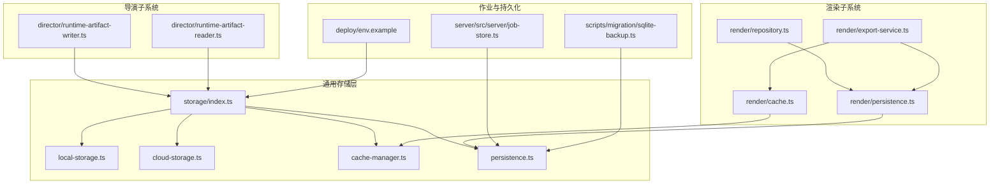
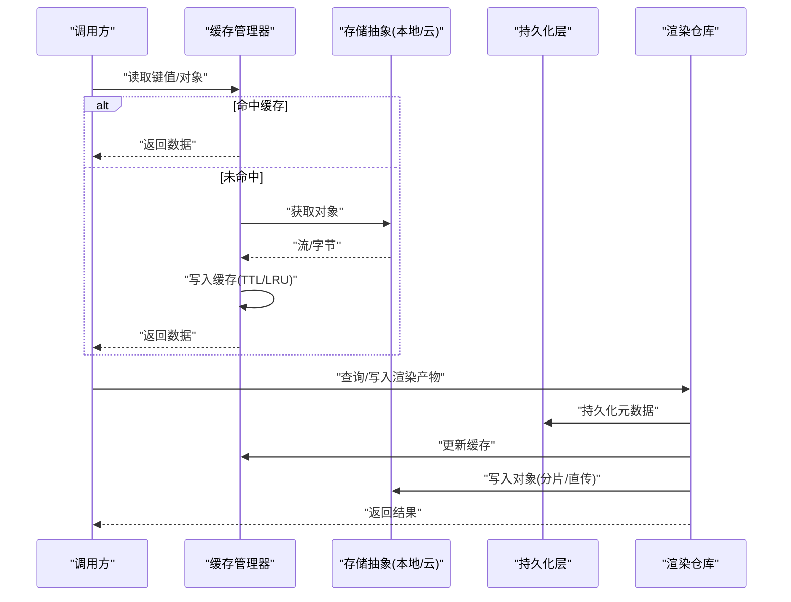
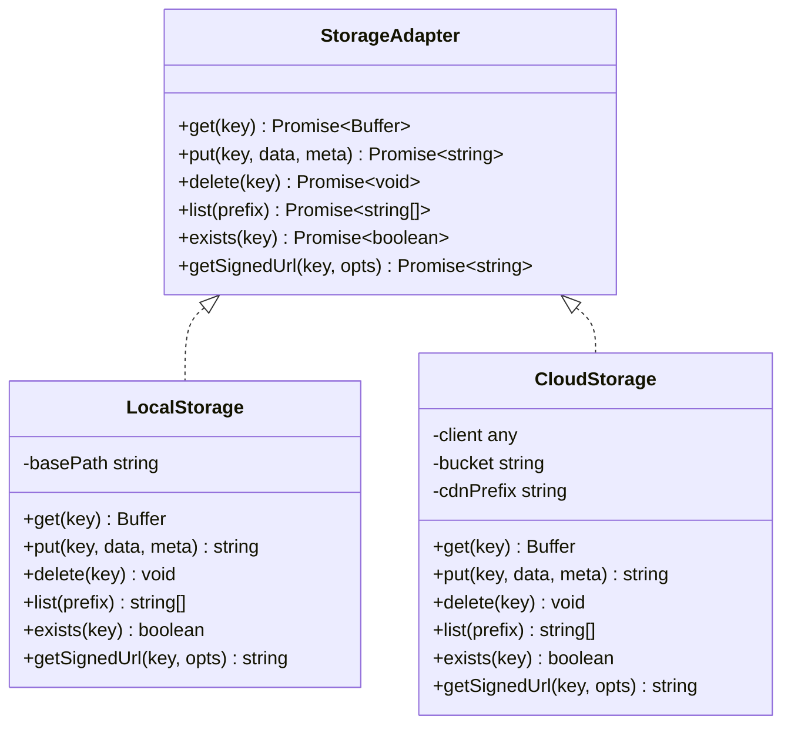
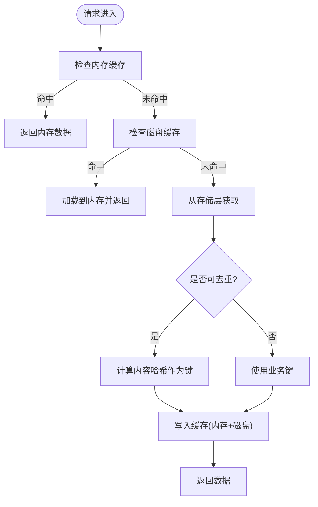
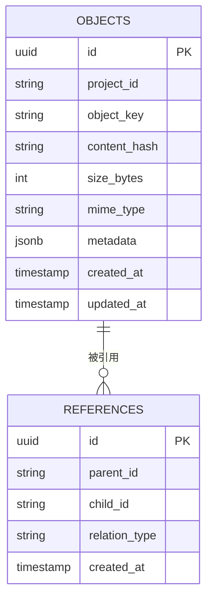
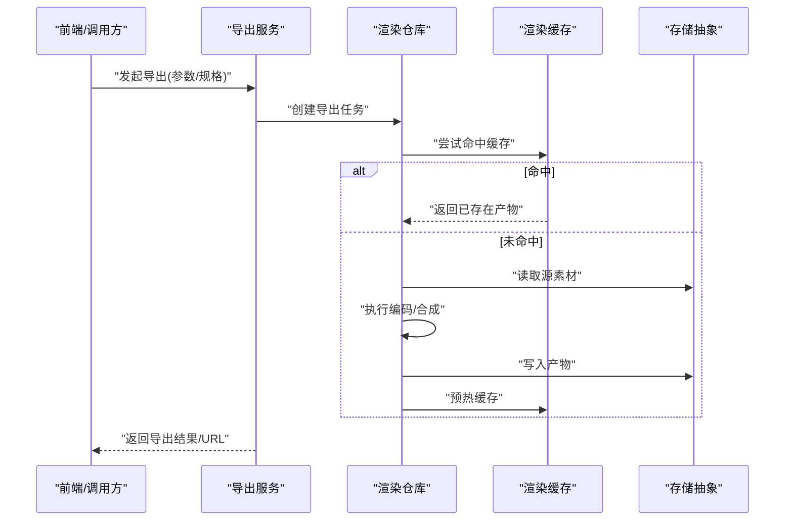
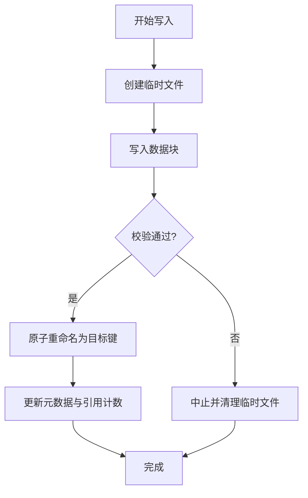
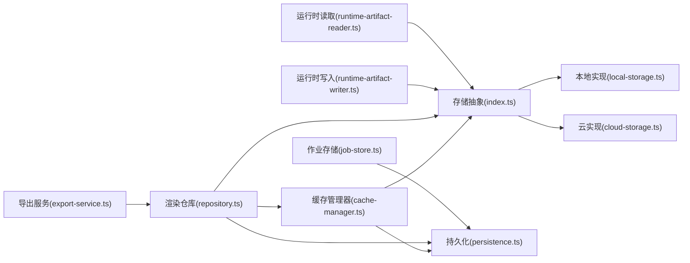

# 存储管理与缓存

<cite>
**本文引用的文件**   
- [src/lib/storage/index.ts](file://src/lib/storage/index.ts)
- [src/lib/storage/local-storage.ts](file://src/lib/storage/local-storage.ts)
- [src/lib/storage/cloud-storage.ts](file://src/lib/storage/cloud-storage.ts)
- [src/lib/storage/cache-manager.ts](file://src/lib/storage/cache-manager.ts)
- [src/lib/storage/persistence.ts](file://src/lib/storage/persistence.ts)
- [src/features/render/cache.ts](file://src/features/render/cache.ts)
- [src/features/render/persistence.ts](file://src/features/render/persistence.ts)
- [src/features/render/repository.ts](file://src/features/render/repository.ts)
- [src/features/render/export-service.ts](file://src/features/render/export-service.ts)
- [src/features/director/runtime-artifact-writer.ts](file://src/features/director/runtime-artifact-writer.ts)
- [src/features/director/runtime-artifact-reader.ts](file://src/features/director/runtime-artifact-reader.ts)
- [scripts/migration/sqlite-backup.ts](file://scripts/migration/sqlite-backup.ts)
- [deploy/env.example](file://deploy/env.example)
- [server/src/server/job-store.ts](file://server/src/server/job-store.ts)
</cite>

## 目录
1. [简介](#简介)
2. [项目结构](#项目结构)
3. [核心组件](#核心组件)
4. [架构总览](#架构总览)
5. [详细组件分析](#详细组件分析)
6. [依赖关系分析](#依赖关系分析)
7. [性能考量](#性能考量)
8. [故障排查指南](#故障排查指南)
9. [结论](#结论)
10. [附录](#附录)

## 简介
本技术文档面向 PurpleInK 平台的存储管理系统，聚焦以下目标：
- 文件存储策略与生命周期管理（本地、云存储、CDN）
- 缓存机制设计（失效策略、去重、增量更新）
- 数据持久化与一致性保障
- 备份恢复与灾难恢复方案
- 监控指标与清理策略
- 配置示例与优化建议（存储空间、访问速度、一致性）

## 项目结构
存储与缓存相关代码主要分布在以下模块：
- 通用存储抽象与实现：src/lib/storage
- 渲染产物与缓存：src/features/render
- 导演运行时产物读写：src/features/director
- 作业持久化：server/src/server/job-store.ts
- 迁移与备份脚本：scripts/migration
- 部署与环境变量：deploy/env.example

图表来源 
- [src/lib/storage/index.ts](file://src/lib/storage/index.ts)
- [src/lib/storage/local-storage.ts](file://src/lib/storage/local-storage.ts)
- [src/lib/storage/cloud-storage.ts](file://src/lib/storage/cloud-storage.ts)
- [src/lib/storage/cache-manager.ts](file://src/lib/storage/cache-manager.ts)
- [src/lib/storage/persistence.ts](file://src/lib/storage/persistence.ts)
- [src/features/render/cache.ts](file://src/features/render/cache.ts)
- [src/features/render/persistence.ts](file://src/features/render/persistence.ts)
- [src/features/render/repository.ts](file://src/features/render/repository.ts)
- [src/features/render/export-service.ts](file://src/features/render/export-service.ts)
- [src/features/director/runtime-artifact-writer.ts](file://src/features/director/runtime-artifact-writer.ts)
- [src/features/director/runtime-artifact-reader.ts](file://src/features/director/runtime-artifact-reader.ts)
- [server/src/server/job-store.ts](file://server/src/server/job-store.ts)
- [scripts/migration/sqlite-backup.ts](file://scripts/migration/sqlite-backup.ts)
- [deploy/env.example](file://deploy/env.example)

章节来源
- [src/lib/storage/index.ts](file://src/lib/storage/index.ts)
- [src/lib/storage/local-storage.ts](file://src/lib/storage/local-storage.ts)
- [src/lib/storage/cloud-storage.ts](file://src/lib/storage/cloud-storage.ts)
- [src/lib/storage/cache-manager.ts](file://src/lib/storage/cache-manager.ts)
- [src/lib/storage/persistence.ts](file://src/lib/storage/persistence.ts)
- [src/features/render/cache.ts](file://src/features/render/cache.ts)
- [src/features/render/persistence.ts](file://src/features/render/persistence.ts)
- [src/features/render/repository.ts](file://src/features/render/repository.ts)
- [src/features/render/export-service.ts](file://src/features/render/export-service.ts)
- [src/features/director/runtime-artifact-writer.ts](file://src/features/director/runtime-artifact-writer.ts)
- [src/features/director/runtime-artifact-reader.ts](file://src/features/director/runtime-artifact-reader.ts)
- [server/src/server/job-store.ts](file://server/src/server/job-store.ts)
- [scripts/migration/sqlite-backup.ts](file://scripts/migration/sqlite-backup.ts)
- [deploy/env.example](file://deploy/env.example)

## 核心组件
- 存储抽象与路由：统一封装本地与云存储接口，提供路径映射、分片上传、断点续传、签名直传等能力。
- 缓存管理器：内存/磁盘多级缓存，支持 TTL、LRU、按命名空间隔离、键前缀与版本化。
- 持久化层：结构化元数据落库（SQLite/Postgres），事务性写入与幂等控制。
- 渲染缓存与仓库：渲染产物缓存、缩略图生成、导出队列与结果持久化。
- 导演运行时产物读写：中间产物与最终产物的原子写入与读取，保证流水线一致性。
- 作业存储：任务状态、进度与重试记录持久化。
- 备份与迁移：数据库快照、增量备份与回滚流程。

章节来源
- [src/lib/storage/index.ts](file://src/lib/storage/index.ts)
- [src/lib/storage/cache-manager.ts](file://src/lib/storage/cache-manager.ts)
- [src/lib/storage/persistence.ts](file://src/lib/storage/persistence.ts)
- [src/features/render/cache.ts](file://src/features/render/cache.ts)
- [src/features/render/repository.ts](file://src/features/render/repository.ts)
- [src/features/director/runtime-artifact-writer.ts](file://src/features/director/runtime-artifact-writer.ts)
- [src/features/director/runtime-artifact-reader.ts](file://src/features/director/runtime-artifact-reader.ts)
- [server/src/server/job-store.ts](file://server/src/server/job-store.ts)
- [scripts/migration/sqlite-backup.ts](file://scripts/migration/sqlite-backup.ts)

## 架构总览
存储系统采用“抽象层 + 多后端实现”的架构，上层通过统一接口访问本地或云存储；缓存层位于应用进程内与磁盘之间，减少 I/O 压力；持久化层负责元数据与索引；导出与渲染子系统通过仓库模式协调缓存与存储。

图表来源 
- [src/lib/storage/cache-manager.ts](file://src/lib/storage/cache-manager.ts)
- [src/lib/storage/index.ts](file://src/lib/storage/index.ts)
- [src/lib/storage/persistence.ts](file://src/lib/storage/persistence.ts)
- [src/features/render/repository.ts](file://src/features/render/repository.ts)

## 详细组件分析

### 存储抽象与后端实现
- 统一接口：提供 get、put、delete、list、exists、getSignedUrl 等方法，屏蔽本地与云差异。
- 本地存储：基于文件系统，支持目录分区、软链接与硬链接去重、并发安全锁。
- 云存储：支持 S3/OSS/MinIO 等，具备分片上传、断点续传、服务端加密、预签名 URL、CDN 回源。
- CDN 集成：通过域名前缀与缓存头控制，结合签名 URL 实现鉴权与时效控制。
- 权限控制：基于租户/项目维度的路径前缀与 ACL，配合云存储桶策略与 IAM。

图表来源 
- [src/lib/storage/index.ts](file://src/lib/storage/index.ts)
- [src/lib/storage/local-storage.ts](file://src/lib/storage/local-storage.ts)
- [src/lib/storage/cloud-storage.ts](file://src/lib/storage/cloud-storage.ts)

章节来源
- [src/lib/storage/index.ts](file://src/lib/storage/index.ts)
- [src/lib/storage/local-storage.ts](file://src/lib/storage/local-storage.ts)
- [src/lib/storage/cloud-storage.ts](file://src/lib/storage/cloud-storage.ts)

### 缓存管理器
- 多级缓存：内存 LRU + 磁盘缓存（可选），按命名空间隔离。
- 失效策略：TTL、被动过期扫描、主动失效（版本号/哈希）。
- 去重与增量：基于内容哈希的键生成，避免重复写入；支持增量块合并。
- 并发与一致性：读放大保护、写时替换、事务性更新。

图表来源 
- [src/lib/storage/cache-manager.ts](file://src/lib/storage/cache-manager.ts)

章节来源
- [src/lib/storage/cache-manager.ts](file://src/lib/storage/cache-manager.ts)

### 持久化层
- 元数据存储：SQLite/Postgres，表结构包含对象元信息、引用计数、版本、标签。
- 事务与幂等：写入采用事务包裹，失败自动回滚；幂等键避免重复提交。
- 索引与查询：按项目/类型/时间范围索引，支持分页与聚合统计。
- 迁移与兼容：版本化 schema，滚动升级与回滚。

图表来源 
- [src/lib/storage/persistence.ts](file://src/lib/storage/persistence.ts)

章节来源
- [src/lib/storage/persistence.ts](file://src/lib/storage/persistence.ts)

### 渲染缓存与仓库
- 渲染缓存：缩略图、帧序列、导出中间件缓存，支持按分辨率/格式维度键。
- 仓库模式：统一查询/写入渲染产物，协调缓存与存储，处理失败重试。
- 导出服务：队列驱动，支持并发限制、优先级、超时与补偿。

图表来源 
- [src/features/render/export-service.ts](file://src/features/render/export-service.ts)
- [src/features/render/repository.ts](file://src/features/render/repository.ts)
- [src/features/render/cache.ts](file://src/features/render/cache.ts)
- [src/lib/storage/index.ts](file://src/lib/storage/index.ts)

章节来源
- [src/features/render/cache.ts](file://src/features/render/cache.ts)
- [src/features/render/repository.ts](file://src/features/render/repository.ts)
- [src/features/render/export-service.ts](file://src/features/render/export-service.ts)

### 导演运行时产物读写
- 原子写入：临时文件 + 原子重命名，确保读取不看到半写状态。
- 版本化：每次写入生成新版本键，旧版本保留以便回滚。
- 读取校验：校验哈希与大小，失败触发重建。

图表来源 
- [src/features/director/runtime-artifact-writer.ts](file://src/features/director/runtime-artifact-writer.ts)
- [src/features/director/runtime-artifact-reader.ts](file://src/features/director/runtime-artifact-reader.ts)

章节来源
- [src/features/director/runtime-artifact-writer.ts](file://src/features/director/runtime-artifact-writer.ts)
- [src/features/director/runtime-artifact-reader.ts](file://src/features/director/runtime-artifact-reader.ts)

### 作业存储
- 作业状态：入队、运行中、成功、失败、重试次数、错误码。
- 持久化：SQLite/Postgres，支持按项目/阶段筛选与审计日志。
- 可靠性：幂等键、死信队列、告警与人工干预入口。

章节来源
- [server/src/server/job-store.ts](file://server/src/server/job-store.ts)

### 备份与恢复
- 全量/增量备份：定时快照、WAL 归档、对象存储同步。
- 恢复流程：校验备份完整性，按时间点恢复，验证一致性。
- 演练计划：定期恢复演练，记录 RTO/RPO。

章节来源
- [scripts/migration/sqlite-backup.ts](file://scripts/migration/sqlite-backup.ts)

## 依赖关系分析
- 存储抽象对本地与云实现解耦，上层仅依赖接口。
- 缓存管理器依赖存储抽象与持久化层（用于持久化缓存元数据）。
- 渲染仓库依赖缓存与存储抽象，并通过持久化层维护索引。
- 导演运行时读写依赖存储抽象，确保产物一致性。
- 作业存储独立于存储抽象，但共享持久化层。

图表来源 
- [src/lib/storage/index.ts](file://src/lib/storage/index.ts)
- [src/lib/storage/local-storage.ts](file://src/lib/storage/local-storage.ts)
- [src/lib/storage/cloud-storage.ts](file://src/lib/storage/cloud-storage.ts)
- [src/lib/storage/cache-manager.ts](file://src/lib/storage/cache-manager.ts)
- [src/lib/storage/persistence.ts](file://src/lib/storage/persistence.ts)
- [src/features/render/repository.ts](file://src/features/render/repository.ts)
- [src/features/render/export-service.ts](file://src/features/render/export-service.ts)
- [src/features/director/runtime-artifact-writer.ts](file://src/features/director/runtime-artifact-writer.ts)
- [src/features/director/runtime-artifact-reader.ts](file://src/features/director/runtime-artifact-reader.ts)
- [server/src/server/job-store.ts](file://server/src/server/job-store.ts)

章节来源
- [src/lib/storage/index.ts](file://src/lib/storage/index.ts)
- [src/lib/storage/cache-manager.ts](file://src/lib/storage/cache-manager.ts)
- [src/lib/storage/persistence.ts](file://src/lib/storage/persistence.ts)
- [src/features/render/repository.ts](file://src/features/render/repository.ts)
- [src/features/render/export-service.ts](file://src/features/render/export-service.ts)
- [src/features/director/runtime-artifact-writer.ts](file://src/features/director/runtime-artifact-writer.ts)
- [src/features/director/runtime-artifact-reader.ts](file://src/features/director/runtime-artifact-reader.ts)
- [server/src/server/job-store.ts](file://server/src/server/job-store.ts)

## 性能考量
- 缓存命中率优化：合理设置 TTL、LRU 容量、键粒度与命名空间隔离。
- 分片与并行：大文件分片上传/下载，提升吞吐与稳定性。
- 压缩与转码：按需启用，权衡 CPU 与带宽。
- 冷热点分离：热数据常驻内存，冷数据下沉至对象存储。
- 连接池与限流：数据库与云 SDK 连接池调优，避免雪崩。
- CDN 缓存策略：利用浏览器与边缘缓存，缩短首字节时间。

[本节为通用指导，无需特定文件来源]

## 故障排查指南
- 常见问题定位：
  - 缓存未命中：检查键生成逻辑、TTL 与命名空间隔离。
  - 写入失败：确认存储后端可达、权限与配额。
  - 一致性异常：核查原子写入与版本化策略。
  - 作业堆积：查看队列长度、重试次数与错误码。
- 诊断工具：
  - 启用详细日志与指标上报（I/O 耗时、命中率、错误率）。
  - 健康检查端点与慢查询分析。
- 恢复步骤：
  - 从最近备份恢复元数据与索引。
  - 校验对象哈希与引用计数，修复不一致。
  - 重新构建损坏的缓存与缩略图。

章节来源
- [server/src/server/job-store.ts](file://server/src/server/job-store.ts)
- [scripts/migration/sqlite-backup.ts](file://scripts/migration/sqlite-backup.ts)

## 结论
PurpleInK 存储管理系统通过统一的存储抽象、多级缓存与事务化持久化，实现了高可用、可扩展且一致的文件与元数据管理。结合 CDN、分片上传与原子写入，能够在大规模场景下保持高性能与稳定性。完善的备份恢复与监控清理策略，进一步保障了数据安全与服务连续性。

[本节为总结，无需特定文件来源]

## 附录

### 配置示例与优化建议
- 环境变量要点（参考 deploy/env.example）：
  - 存储后端选择与凭据（本地路径、云桶名、密钥、区域）
  - CDN 域名与缓存头策略
  - 缓存容量、TTL、LRU 上限
  - 数据库连接串与迁移开关
- 存储优化：
  - 开启对象去重与硬链接，降低重复存储
  - 冷热分层：热数据内存缓存，冷数据对象存储
  - 合理分片大小与并发度
- 访问速度优化：
  - 启用 CDN 与浏览器缓存
  - 预签名 URL 直传，减少代理转发
  - 缩略图与预览按需生成
- 一致性保障：
  - 原子写入与版本化
  - 幂等键与事务包裹
  - 定期一致性校验与修复

章节来源
- [deploy/env.example](file://deploy/env.example)