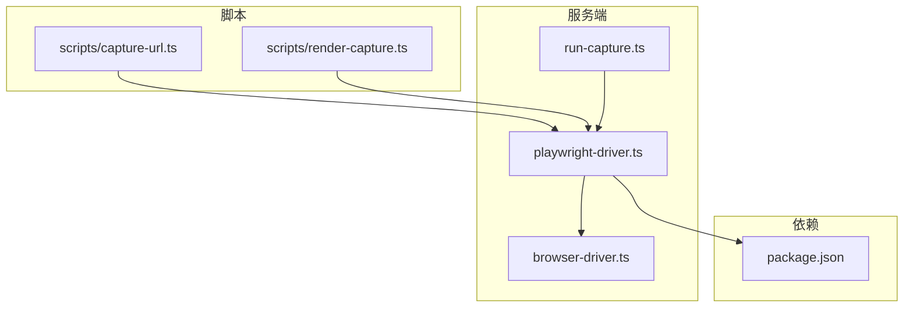
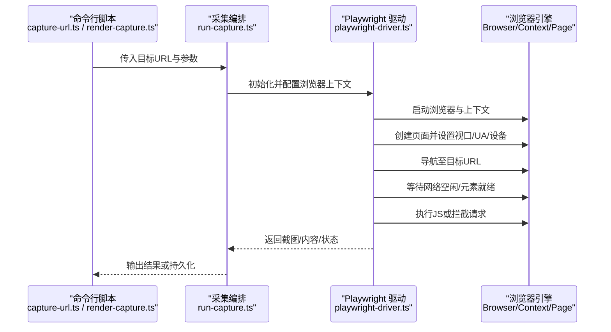
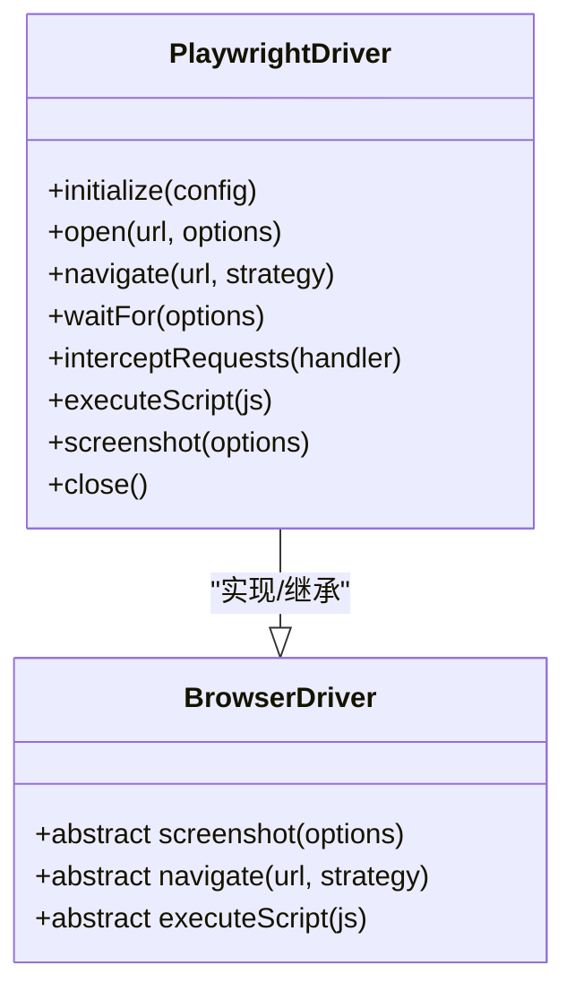
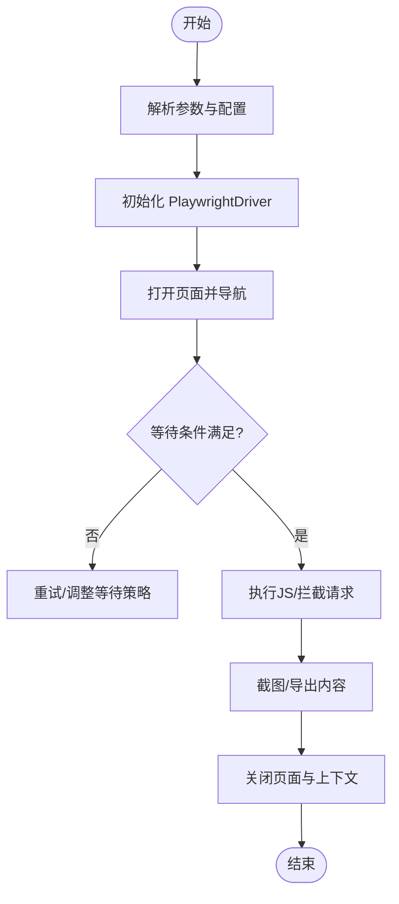
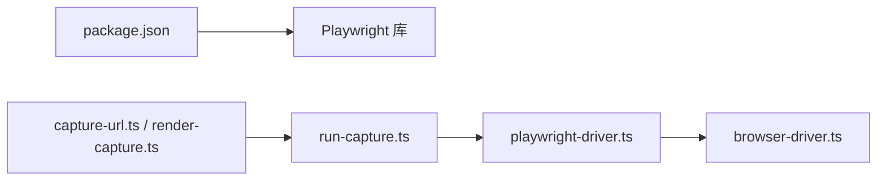

# Playwright 驱动实现

<cite>
**本文引用的文件**   
- [playwright-driver.ts](file://server/src/capture/playwright-driver.ts)
- [browser-driver.ts](file://server/src/capture/browser-driver.ts)
- [run-capture.ts](file://server/src/capture/run-capture.ts)
- [capture-url.ts](file://server/scripts/capture-url.ts)
- [render-capture.ts](file://server/scripts/render-capture.ts)
- [package.json](file://server/package.json)
</cite>

## 目录
1. [简介](#简介)
2. [项目结构](#项目结构)
3. [核心组件](#核心组件)
4. [架构总览](#架构总览)
5. [详细组件分析](#详细组件分析)
6. [依赖关系分析](#依赖关系分析)
7. [性能考量](#性能考量)
8. [故障排查指南](#故障排查指南)
9. [结论](#结论)
10. [附录：使用示例与最佳实践](#附录使用示例与最佳实践)

## 简介
本技术文档聚焦于 PurpleInK 平台的 Playwright 驱动实现，围绕 PlaywrightDriver 类展开，系统阐述浏览器实例的创建与管理、页面生命周期控制、导航策略与等待机制。同时覆盖浏览器配置参数、视口设置、设备模拟与用户代理定制；解释网络请求拦截、资源加载控制与缓存策略；并提供初始化浏览器、打开页面、执行 JavaScript 与获取截图的具体示例路径。最后给出错误处理、超时配置与资源清理的最佳实践建议。

## 项目结构
Playwright 驱动位于 server 子项目的 capture 模块中，关键文件包括：
- playwright-driver.ts：Playwright 驱动的封装与核心逻辑
- browser-driver.ts：浏览器抽象与通用能力（如截图、导航）
- run-capture.ts：采集流程编排与调度
- scripts/capture-url.ts 与 scripts/render-capture.ts：命令行脚本，演示如何调用驱动进行 URL 抓取与渲染

图表来源
- [playwright-driver.ts](file://server/src/capture/playwright-driver.ts)
- [browser-driver.ts](file://server/src/capture/browser-driver.ts)
- [run-capture.ts](file://server/src/capture/run-capture.ts)
- [capture-url.ts](file://server/scripts/capture-url.ts)
- [render-capture.ts](file://server/scripts/render-capture.ts)
- [package.json](file://server/package.json)

章节来源
- [playwright-driver.ts](file://server/src/capture/playwright-driver.ts)
- [browser-driver.ts](file://server/src/capture/browser-driver.ts)
- [run-capture.ts](file://server/src/capture/run-capture.ts)
- [capture-url.ts](file://server/scripts/capture-url.ts)
- [render-capture.ts](file://server/scripts/render-capture.ts)
- [package.json](file://server/package.json)

## 核心组件
- PlaywrightDriver：封装 Playwright 的 Browser/BrowserContext/Page 生命周期管理，提供统一的导航、等待、截图、JavaScript 执行等能力。
- BrowserDriver：定义浏览器相关能力的抽象接口或基类，便于扩展不同后端或替换实现。
- RunCapture：编排采集任务，协调 PlaywrightDriver 完成页面加载、交互、数据提取与输出。

章节来源
- [playwright-driver.ts](file://server/src/capture/playwright-driver.ts)
- [browser-driver.ts](file://server/src/capture/browser-driver.ts)
- [run-capture.ts](file://server/src/capture/run-capture.ts)

## 架构总览
下图展示从脚本到驱动再到浏览器的整体调用链与职责划分。

图表来源
- [capture-url.ts](file://server/scripts/capture-url.ts)
- [render-capture.ts](file://server/scripts/render-capture.ts)
- [run-capture.ts](file://server/src/capture/run-capture.ts)
- [playwright-driver.ts](file://server/src/capture/playwright-driver.ts)

## 详细组件分析

### PlaywrightDriver 类分析
- 浏览器实例管理
  - 负责创建与复用 Browser 与 BrowserContext，支持多实例隔离与并发控制。
  - 通过统一入口方法初始化上下文，避免重复启动带来的开销。
- 页面生命周期控制
  - 提供 open/close/reuse 页面能力，确保在任务完成后释放资源。
  - 对页面事件（如 load、navigated、close）进行监听与清理。
- 导航策略与等待机制
  - 支持多种导航模式：首次加载、刷新、跳转；可配置 waitUntil 策略。
  - 内置等待策略：网络空闲、DOMContentLoaded、指定选择器可见性、自定义超时。
- 浏览器配置与设备模拟
  - 支持视口尺寸、像素比、设备缩放、移动端 UA、地理定位、时区等。
  - 可通过参数注入 Cookie、LocalStorage、环境变量等。
- 网络请求拦截与资源控制
  - 提供请求拦截钩子，允许修改请求头、重定向、阻断特定资源类型。
  - 支持禁用图片/字体/媒体等资源以加速加载。
- 截图与 JS 执行
  - 提供全页/可视区域截图、PDF 导出、Canvas 捕获等能力。
  - 支持在页面上下文中执行任意 JS，并安全地回传结果。

图表来源
- [playwright-driver.ts](file://server/src/capture/playwright-driver.ts)
- [browser-driver.ts](file://server/src/capture/browser-driver.ts)

章节来源
- [playwright-driver.ts](file://server/src/capture/playwright-driver.ts)
- [browser-driver.ts](file://server/src/capture/browser-driver.ts)

### 运行编排与脚本集成
- run-capture.ts：编排采集任务，接收外部参数，调用 PlaywrightDriver 完成页面抓取与输出。
- capture-url.ts：命令行入口，用于直接抓取指定 URL 的内容或截图。
- render-capture.ts：渲染场景下的抓取脚本，常用于批量生成缩略图或预览。

图表来源
- [run-capture.ts](file://server/src/capture/run-capture.ts)
- [capture-url.ts](file://server/scripts/capture-url.ts)
- [render-capture.ts](file://server/scripts/render-capture.ts)
- [playwright-driver.ts](file://server/src/capture/playwright-driver.ts)

章节来源
- [run-capture.ts](file://server/src/capture/run-capture.ts)
- [capture-url.ts](file://server/scripts/capture-url.ts)
- [render-capture.ts](file://server/scripts/render-capture.ts)

## 依赖关系分析
- 内部依赖
  - PlaywrightDriver 依赖 BrowserDriver 抽象，保证能力解耦与可扩展性。
  - run-capture 作为编排层，仅与驱动接口交互，不直接操作底层 API。
- 外部依赖
  - package.json 声明了 Playwright 及相关依赖版本，确保环境一致性。
  - 脚本依赖 Node.js 运行时与命令行工具链。

图表来源
- [package.json](file://server/package.json)
- [capture-url.ts](file://server/scripts/capture-url.ts)
- [render-capture.ts](file://server/scripts/render-capture.ts)
- [run-capture.ts](file://server/src/capture/run-capture.ts)
- [playwright-driver.ts](file://server/src/capture/playwright-driver.ts)
- [browser-driver.ts](file://server/src/capture/browser-driver.ts)

章节来源
- [package.json](file://server/package.json)
- [capture-url.ts](file://server/scripts/capture-url.ts)
- [render-capture.ts](file://server/scripts/render-capture.ts)
- [run-capture.ts](file://server/src/capture/run-capture.ts)
- [playwright-driver.ts](file://server/src/capture/playwright-driver.ts)
- [browser-driver.ts](file://server/src/capture/browser-driver.ts)

## 性能考量
- 浏览器实例复用：尽量复用 BrowserContext，减少启动开销。
- 资源过滤：禁用不必要的资源（图片、字体、媒体）以提升加载速度。
- 并发控制：限制并发页面数，避免内存峰值过高。
- 等待策略优化：优先使用网络空闲与关键选择器可见性，避免过度等待。
- 截图优化：按需选择可视区域截图，降低 IO 压力。

[本节为通用指导，无需引用具体文件]

## 故障排查指南
- 常见错误
  - 超时错误：检查导航与等待超时配置是否合理。
  - 资源加载失败：确认网络拦截规则与资源白名单。
  - 内存泄漏：确保页面与上下文正确关闭，避免悬挂句柄。
- 调试建议
  - 启用日志与追踪，记录导航与等待过程。
  - 使用 headless 模式快速验证，再切换有头模式定位 UI 问题。
  - 针对复杂页面，逐步缩小范围，先抓首屏再逐步增加交互。

章节来源
- [playwright-driver.ts](file://server/src/capture/playwright-driver.ts)
- [run-capture.ts](file://server/src/capture/run-capture.ts)

## 结论
PlaywrightDriver 为 PurpleInK 平台提供了稳定、可扩展的浏览器自动化能力。通过清晰的职责划分与良好的生命周期管理，能够高效完成页面抓取、截图与 JS 执行等任务。结合合理的等待策略与资源控制，可在保证质量的同时提升性能与稳定性。

[本节为总结性内容，无需引用具体文件]

## 附录：使用示例与最佳实践
- 初始化浏览器
  - 参考路径：[playwright-driver.ts](file://server/src/capture/playwright-driver.ts)
  - 要点：集中配置视口、UA、设备模拟与网络拦截。
- 打开页面与导航
  - 参考路径：[run-capture.ts](file://server/src/capture/run-capture.ts)、[capture-url.ts](file://server/scripts/capture-url.ts)
  - 要点：选择合适的 waitUntil 策略，必要时添加选择器等待。
- 执行 JavaScript
  - 参考路径：[playwright-driver.ts](file://server/src/capture/playwright-driver.ts)
  - 要点：在安全的页面上下文中执行，注意返回值序列化。
- 获取截图
  - 参考路径：[render-capture.ts](file://server/scripts/render-capture.ts)、[playwright-driver.ts](file://server/src/capture/playwright-driver.ts)
  - 要点：根据需求选择全页或可视区域截图，控制压缩与格式。
- 错误处理与超时配置
  - 参考路径：[playwright-driver.ts](file://server/src/capture/playwright-driver.ts)
  - 要点：统一捕获异常，区分网络、超时与业务错误，提供重试与降级策略。
- 资源清理
  - 参考路径：[run-capture.ts](file://server/src/capture/run-capture.ts)
  - 要点：确保 finally 块中关闭页面与上下文，避免资源泄露。

章节来源
- [playwright-driver.ts](file://server/src/capture/playwright-driver.ts)
- [run-capture.ts](file://server/src/capture/run-capture.ts)
- [capture-url.ts](file://server/scripts/capture-url.ts)
- [render-capture.ts](file://server/scripts/render-capture.ts)