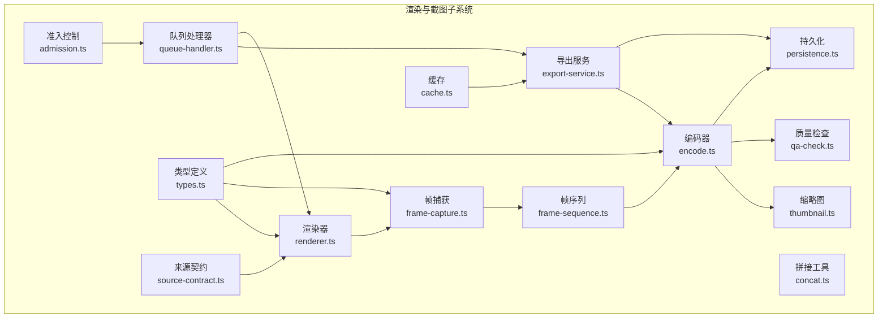
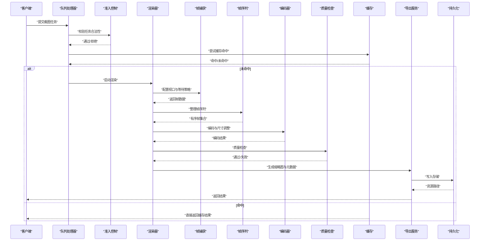
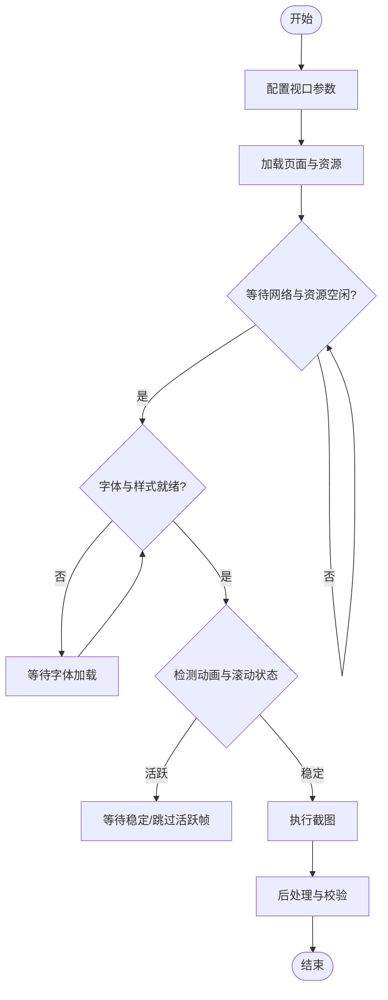
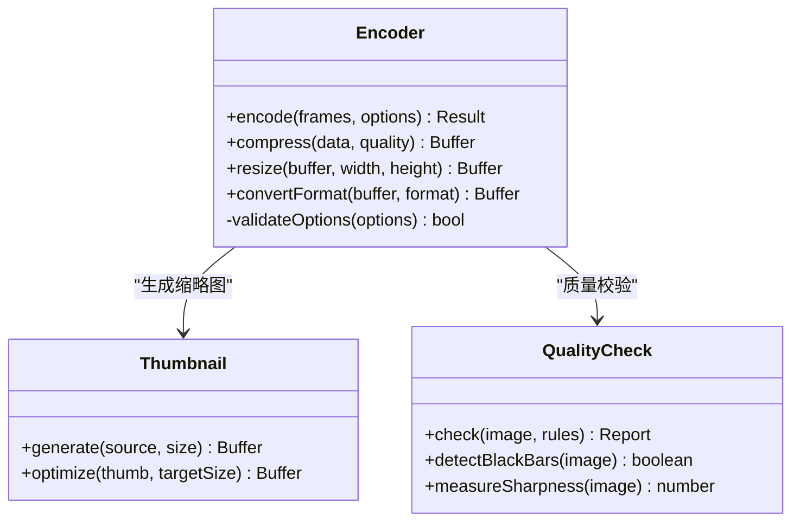
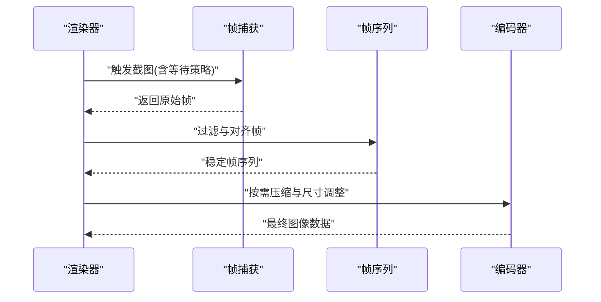
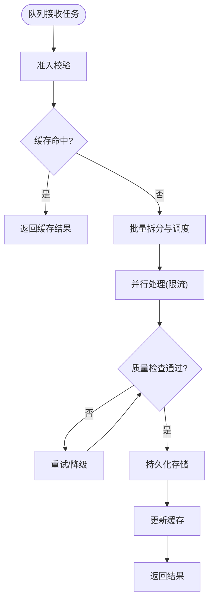
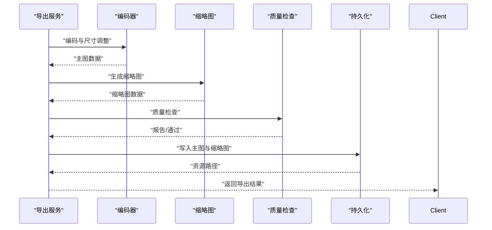
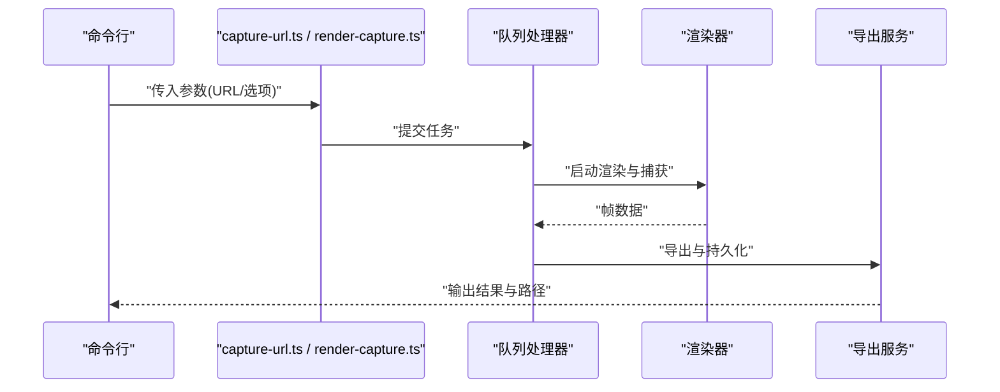
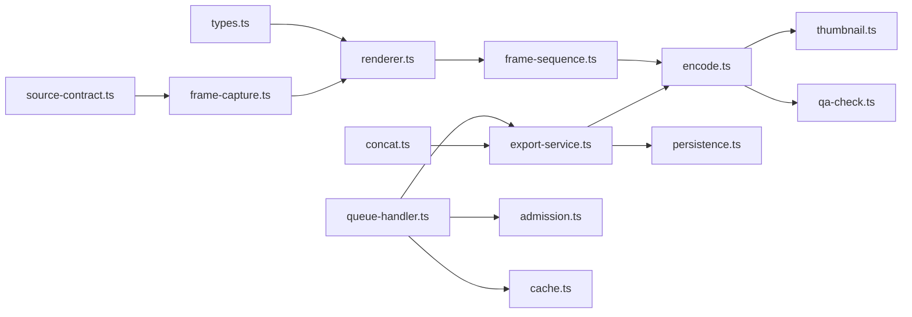

# 截图处理与优化

<cite>
**本文引用的文件**   
- [frame-capture.ts](file://src/features/render/frame-capture.ts)
- [frame-sequence.ts](file://src/features/render/frame-sequence.ts)
- [encode.ts](file://src/features/render/encode.ts)
- [thumbnail.ts](file://src/features/render/thumbnail.ts)
- [qa-check.ts](file://src/features/render/qa-check.ts)
- [cache.ts](file://src/features/render/cache.ts)
- [export-service.ts](file://src/features/render/export-service.ts)
- [render.ts](file://src/features/render/renderer.ts)
- [persistence.ts](file://src/features/render/persistence.ts)
- [queue-handler.ts](file://src/features/render/queue-handler.ts)
- [admission.ts](file://src/features/render/admission.ts)
- [concat.ts](file://src/features/render/concat.ts)
- [types.ts](file://src/features/render/types.ts)
- [source-contract.ts](file://src/features/render/source-contract.ts)
- [capture-url.ts](file://server/scripts/capture-url.ts)
- [render-capture.ts](file://server/scripts/render-capture.ts)
</cite>

## 目录
1. [简介](#简介)
2. [项目结构](#项目结构)
3. [核心组件](#核心组件)
4. [架构总览](#架构总览)
5. [详细组件分析](#详细组件分析)
6. [依赖关系分析](#依赖关系分析)
7. [性能考量](#性能考量)
8. [故障排查指南](#故障排查指南)
9. [结论](#结论)
10. [附录](#附录)

## 简介
本技术文档聚焦 PurpleInK 平台的截图处理系统，围绕帧捕获、渲染时机控制、内容等待策略、截图质量优化（压缩、格式转换、尺寸调整）、动态内容与动画处理、批量处理、缓存策略与质量检查等关键主题展开。文档以代码级分析为基础，提供架构图、流程图与调用序列图，帮助读者快速理解并高效使用该系统。

## 项目结构
截图处理相关能力集中在 src/features/render 目录中，包含帧捕获、帧序列管理、编码、缩略图生成、质量检查、缓存、导出服务、渲染器、持久化、队列处理器、准入控制、拼接工具与类型定义等模块。服务端脚本 capture-url.ts 与 render-capture.ts 提供命令行入口，用于 URL 截图与渲染截图流程的端到端验证。

**图表来源** 
- [renderer.ts](file://src/features/render/renderer.ts)
- [frame-capture.ts](file://src/features/render/frame-capture.ts)
- [frame-sequence.ts](file://src/features/render/frame-sequence.ts)
- [encode.ts](file://src/features/render/encode.ts)
- [thumbnail.ts](file://src/features/render/thumbnail.ts)
- [qa-check.ts](file://src/features/render/qa-check.ts)
- [cache.ts](file://src/features/render/cache.ts)
- [export-service.ts](file://src/features/render/export-service.ts)
- [persistence.ts](file://src/features/render/persistence.ts)
- [queue-handler.ts](file://src/features/render/queue-handler.ts)
- [admission.ts](file://src/features/render/admission.ts)
- [concat.ts](file://src/features/render/concat.ts)
- [types.ts](file://src/features/render/types.ts)
- [source-contract.ts](file://src/features/render/source-contract.ts)

**章节来源**
- [renderer.ts](file://src/features/render/renderer.ts)
- [frame-capture.ts](file://src/features/render/frame-capture.ts)
- [frame-sequence.ts](file://src/features/render/frame-sequence.ts)
- [encode.ts](file://src/features/render/encode.ts)
- [thumbnail.ts](file://src/features/render/thumbnail.ts)
- [qa-check.ts](file://src/features/render/qa-check.ts)
- [cache.ts](file://src/features/render/cache.ts)
- [export-service.ts](file://src/features/render/export-service.ts)
- [persistence.ts](file://src/features/render/persistence.ts)
- [queue-handler.ts](file://src/features/render/queue-handler.ts)
- [admission.ts](file://src/features/render/admission.ts)
- [concat.ts](file://src/features/render/concat.ts)
- [types.ts](file://src/features/render/types.ts)
- [source-contract.ts](file://src/features/render/source-contract.ts)

## 核心组件
- 渲染器：协调页面加载、视口配置、渲染时机与资源就绪，驱动帧捕获流水线。
- 帧捕获：基于浏览器驱动执行截图，支持视口设置、滚动与等待策略，确保内容稳定后再捕获。
- 帧序列：对多帧进行排序、去重、时间对齐与裁剪，保证输出序列的连续性与一致性。
- 编码器：将位图转换为目标格式（如 PNG/JPEG/WebP），支持压缩级别、色彩空间与尺寸调整。
- 缩略图：从原始帧或视频流生成缩略图，便于预览与列表展示。
- 质量检查：对截图进行清晰度、对比度、黑边检测与异常判定，保障输出质量。
- 缓存：按输入参数哈希命中缓存，避免重复计算，提升吞吐与降低成本。
- 导出服务：编排编码、缩略图、质量检查与持久化，提供统一的导出接口。
- 持久化：将结果写入对象存储或本地文件系统，返回可访问的资源路径。
- 队列处理器：接收任务、限流并发、重试与失败回滚，保障稳定性。
- 准入控制：校验任务合法性、配额与依赖，防止非法请求进入流水线。
- 拼接工具：将多个片段合并为完整媒体文件，支持顺序与时间线拼接。
- 类型定义：统一数据结构与契约，减少运行时错误。
- 来源契约：抽象不同来源（URL、HTML、Canvas）的数据接入方式。

**章节来源**
- [renderer.ts](file://src/features/render/renderer.ts)
- [frame-capture.ts](file://src/features/render/frame-capture.ts)
- [frame-sequence.ts](file://src/features/render/frame-sequence.ts)
- [encode.ts](file://src/features/render/encode.ts)
- [thumbnail.ts](file://src/features/render/thumbnail.ts)
- [qa-check.ts](file://src/features/render/qa-check.ts)
- [cache.ts](file://src/features/render/cache.ts)
- [export-service.ts](file://src/features/render/export-service.ts)
- [persistence.ts](file://src/features/render/persistence.ts)
- [queue-handler.ts](file://src/features/render/queue-handler.ts)
- [admission.ts](file://src/features/render/admission.ts)
- [concat.ts](file://src/features/render/concat.ts)
- [types.ts](file://src/features/render/types.ts)
- [source-contract.ts](file://src/features/render/source-contract.ts)

## 架构总览
截图处理采用“渲染器驱动 + 帧捕获 + 编码 + 质量检查 + 持久化”的分层架构。渲染器负责页面生命周期与渲染时机；帧捕获在稳定的视口与内容状态下抓取帧；帧序列保证时序正确；编码器完成格式与尺寸转换；质量检查拦截低质量输出；缓存与队列提升吞吐与稳定性；导出服务对外暴露统一 API。

**图表来源** 
- [queue-handler.ts](file://src/features/render/queue-handler.ts)
- [admission.ts](file://src/features/render/admission.ts)
- [cache.ts](file://src/features/render/cache.ts)
- [renderer.ts](file://src/features/render/renderer.ts)
- [frame-capture.ts](file://src/features/render/frame-capture.ts)
- [frame-sequence.ts](file://src/features/render/frame-sequence.ts)
- [encode.ts](file://src/features/render/encode.ts)
- [qa-check.ts](file://src/features/render/qa-check.ts)
- [export-service.ts](file://src/features/render/export-service.ts)
- [persistence.ts](file://src/features/render/persistence.ts)

## 详细组件分析

### 帧捕获与渲染时机控制
- 视口配置：根据目标设备与布局需求设置宽度、高度、像素比与方向，确保响应式布局正确渲染。
- 渲染时机控制：等待网络空闲、字体加载、动画结束与 DOM 稳定，避免截到中间态。
- 内容等待策略：监听关键事件（如路由切换、懒加载完成、第三方脚本初始化），必要时延时或轮询检测。
- 动态内容与动画：针对滚动、轮播、SVG 动画与 CSS 过渡，采用快照点与帧间隔策略，确保捕捉到关键帧。

**图表来源** 
- [frame-capture.ts](file://src/features/render/frame-capture.ts)
- [renderer.ts](file://src/features/render/renderer.ts)

**章节来源**
- [frame-capture.ts](file://src/features/render/frame-capture.ts)
- [renderer.ts](file://src/features/render/renderer.ts)

### 截图质量优化：压缩、格式转换与尺寸调整
- 压缩算法：根据目标平台选择最优压缩策略（如 WebP 高压缩、JPEG 平衡、PNG 无损）。
- 格式转换：统一输出为指定格式，兼容不同消费端解码能力。
- 尺寸调整：按比例缩放、裁切与填充，适配不同屏幕密度与展示场景。
- 色彩空间：确保 sRGB 一致性，避免色差与亮度异常。

**图表来源** 
- [encode.ts](file://src/features/render/encode.ts)
- [thumbnail.ts](file://src/features/render/thumbnail.ts)
- [qa-check.ts](file://src/features/render/qa-check.ts)

**章节来源**
- [encode.ts](file://src/features/render/encode.ts)
- [thumbnail.ts](file://src/features/render/thumbnail.ts)
- [qa-check.ts](file://src/features/render/qa-check.ts)

### 动态内容、动画效果与响应式布局处理
- 动态内容：识别懒加载与异步数据注入，等待关键节点出现后再截图。
- 动画效果：对轮播、进度条、粒子效果等，采用关键帧采样与去抖策略，避免模糊或半截帧。
- 响应式布局：依据断点与容器尺寸动态调整渲染视口，确保在不同设备上呈现一致。

**图表来源** 
- [frame-sequence.ts](file://src/features/render/frame-sequence.ts)
- [encode.ts](file://src/features/render/encode.ts)
- [frame-capture.ts](file://src/features/render/frame-capture.ts)

**章节来源**
- [frame-sequence.ts](file://src/features/render/frame-sequence.ts)
- [encode.ts](file://src/features/render/encode.ts)
- [frame-capture.ts](file://src/features/render/frame-capture.ts)

### 批量处理、缓存策略与质量检查
- 批量处理：队列处理器支持并发限制、任务拆分与合并，提高吞吐与容错。
- 缓存策略：基于输入参数哈希命中缓存，避免重复渲染与编码，降低延迟与成本。
- 质量检查：规则化校验（清晰度、黑边、过曝/欠曝），失败则回退或重试。

**图表来源** 
- [queue-handler.ts](file://src/features/render/queue-handler.ts)
- [admission.ts](file://src/features/render/admission.ts)
- [cache.ts](file://src/features/render/cache.ts)
- [qa-check.ts](file://src/features/render/qa-check.ts)
- [persistence.ts](file://src/features/render/persistence.ts)

**章节来源**
- [queue-handler.ts](file://src/features/render/queue-handler.ts)
- [admission.ts](file://src/features/render/admission.ts)
- [cache.ts](file://src/features/render/cache.ts)
- [qa-check.ts](file://src/features/render/qa-check.ts)
- [persistence.ts](file://src/features/render/persistence.ts)

### 导出服务与持久化
- 导出服务：编排编码、缩略图生成、质量检查与元数据组装，提供统一导出接口。
- 持久化：将结果写入对象存储或本地文件系统，返回可访问路径与元信息。
- 拼接工具：将多个片段按时间线拼接为完整媒体文件，支持顺序与条件拼接。

**图表来源** 
- [export-service.ts](file://src/features/render/export-service.ts)
- [encode.ts](file://src/features/render/encode.ts)
- [thumbnail.ts](file://src/features/render/thumbnail.ts)
- [qa-check.ts](file://src/features/render/qa-check.ts)
- [persistence.ts](file://src/features/render/persistence.ts)
- [concat.ts](file://src/features/render/concat.ts)

**章节来源**
- [export-service.ts](file://src/features/render/export-service.ts)
- [persistence.ts](file://src/features/render/persistence.ts)
- [concat.ts](file://src/features/render/concat.ts)

### 命令行入口与端到端验证
- capture-url.ts：通过 URL 发起截图任务，用于测试与调试。
- render-capture.ts：执行渲染与截图流程，输出结果与日志，便于回归验证。

**图表来源** 
- [capture-url.ts](file://server/scripts/capture-url.ts)
- [render-capture.ts](file://server/scripts/render-capture.ts)
- [queue-handler.ts](file://src/features/render/queue-handler.ts)
- [renderer.ts](file://src/features/render/renderer.ts)
- [export-service.ts](file://src/features/render/export-service.ts)

**章节来源**
- [capture-url.ts](file://server/scripts/capture-url.ts)
- [render-capture.ts](file://server/scripts/render-capture.ts)
- [queue-handler.ts](file://src/features/render/queue-handler.ts)
- [renderer.ts](file://src/features/render/renderer.ts)
- [export-service.ts](file://src/features/render/export-service.ts)

## 依赖关系分析
截图子系统内部模块职责清晰、耦合适度，主要依赖关系如下：
- 渲染器依赖帧捕获与类型定义。
- 帧捕获依赖来源契约与类型定义。
- 编码器依赖缩略图与质量检查。
- 导出服务依赖编码器、缩略图、质量检查与持久化。
- 队列处理器依赖准入控制、缓存与导出服务。
- 拼接工具被导出服务调用以组合片段。

**图表来源** 
- [types.ts](file://src/features/render/types.ts)
- [source-contract.ts](file://src/features/render/source-contract.ts)
- [frame-capture.ts](file://src/features/render/frame-capture.ts)
- [renderer.ts](file://src/features/render/renderer.ts)
- [frame-sequence.ts](file://src/features/render/frame-sequence.ts)
- [encode.ts](file://src/features/render/encode.ts)
- [thumbnail.ts](file://src/features/render/thumbnail.ts)
- [qa-check.ts](file://src/features/render/qa-check.ts)
- [export-service.ts](file://src/features/render/export-service.ts)
- [persistence.ts](file://src/features/render/persistence.ts)
- [queue-handler.ts](file://src/features/render/queue-handler.ts)
- [admission.ts](file://src/features/render/admission.ts)
- [cache.ts](file://src/features/render/cache.ts)
- [concat.ts](file://src/features/render/concat.ts)

**章节来源**
- [types.ts](file://src/features/render/types.ts)
- [source-contract.ts](file://src/features/render/source-contract.ts)
- [frame-capture.ts](file://src/features/render/frame-capture.ts)
- [renderer.ts](file://src/features/render/renderer.ts)
- [frame-sequence.ts](file://src/features/render/frame-sequence.ts)
- [encode.ts](file://src/features/render/encode.ts)
- [thumbnail.ts](file://src/features/render/thumbnail.ts)
- [qa-check.ts](file://src/features/render/qa-check.ts)
- [export-service.ts](file://src/features/render/export-service.ts)
- [persistence.ts](file://src/features/render/persistence.ts)
- [queue-handler.ts](file://src/features/render/queue-handler.ts)
- [admission.ts](file://src/features/render/admission.ts)
- [cache.ts](file://src/features/render/cache.ts)
- [concat.ts](file://src/features/render/concat.ts)

## 性能考量
- 并发与限流：队列处理器合理设置并发上限，避免内存与 CPU 峰值过高。
- 缓存命中率：优化键空间设计，覆盖更多输入变体，提升命中率。
- 编码策略：根据目标尺寸与质量阈值选择合适压缩级别，减少体积与解码开销。
- 帧序列优化：去重与裁剪减少冗余帧，缩短后续处理时间。
- I/O 优化：持久化采用流式写入与分片上传，降低阻塞与失败影响。

[本节为通用指导，不直接分析具体文件]

## 故障排查指南
- 渲染超时：检查网络与资源加载策略，增加等待时间或放宽稳定条件。
- 质量不达标：调整质量检查规则与编码参数，必要时启用重试与降级。
- 缓存失效：核对键生成逻辑与输入差异，确保相同语义输入命中同一缓存。
- 队列堆积：监控队列长度与处理时长，扩容并发或优化任务拆分。
- 存储失败：检查权限与路径配置，实现重试与告警机制。

**章节来源**
- [qa-check.ts](file://src/features/render/qa-check.ts)
- [cache.ts](file://src/features/render/cache.ts)
- [queue-handler.ts](file://src/features/render/queue-handler.ts)
- [persistence.ts](file://src/features/render/persistence.ts)

## 结论
PurpleInK 的截图处理系统通过清晰的模块化设计与稳健的流水线编排，实现了高质量的帧捕获与优化输出。结合视口配置、渲染时机控制与内容等待策略，系统能够可靠地处理动态内容与响应式布局。编码、缩略图与质量检查形成闭环，配合缓存与队列机制，显著提升吞吐与稳定性。建议在生产环境中持续监控关键指标，并根据业务需求调优参数与策略。

[本节为总结性内容，不直接分析具体文件]

## 附录
- 配置示例：参考命令行脚本与导出服务的参数说明，合理设置视口、格式、质量与尺寸。
- 最佳实践：优先使用 WebP 以获得更优压缩比；对高分屏设备适当提升像素比；对动画页面增加稳定等待。
- 扩展建议：引入视觉相似度检测与 A/B 质量评估，进一步优化输出质量与用户体验。

[本节为补充信息，不直接分析具体文件]