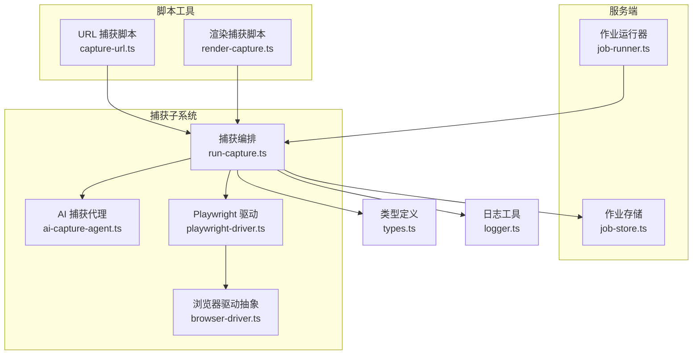
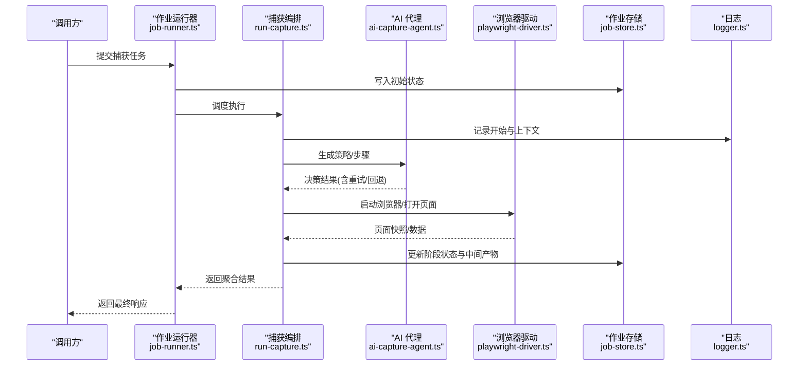
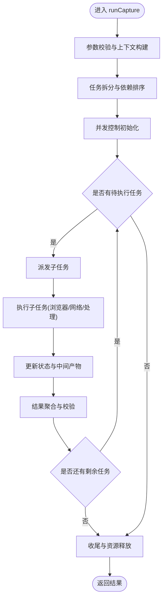
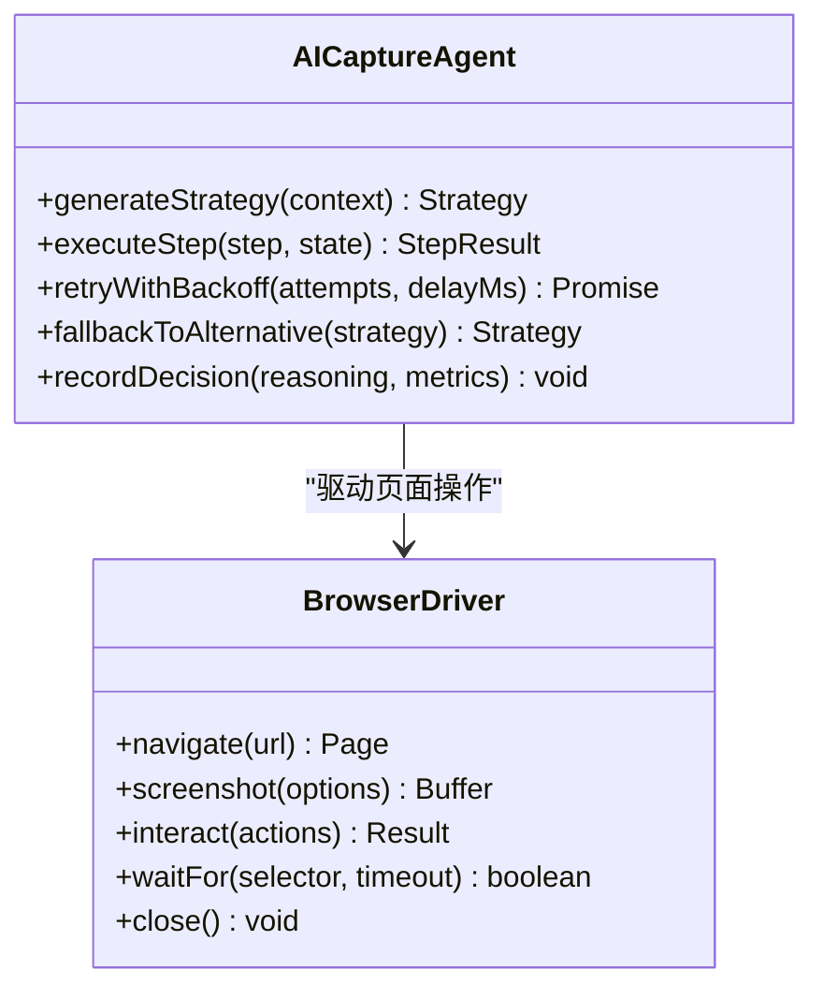
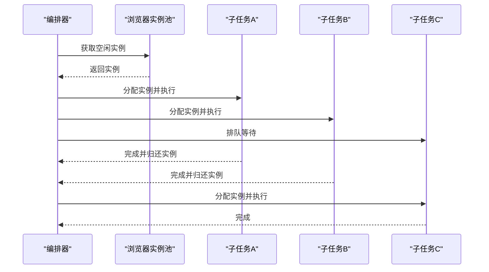
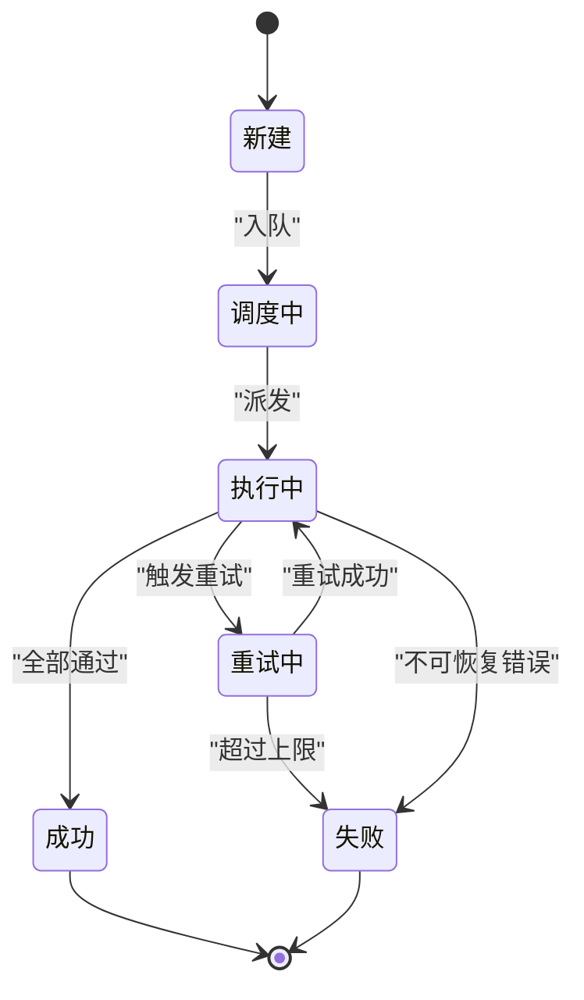
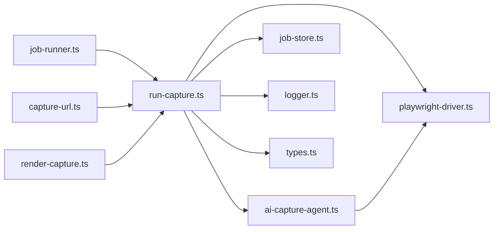

# 捕获编排流程

<cite>
**本文引用的文件**   
- [run-capture.ts](file://server/src/capture/run-capture.ts)
- [ai-capture-agent.ts](file://server/src/capture/ai-capture-agent.ts)
- [playwright-driver.ts](file://server/src/capture/playwright-driver.ts)
- [browser-driver.ts](file://server/src/capture/browser-driver.ts)
- [job-runner.ts](file://server/src/server/job-runner.ts)
- [job-store.ts](file://server/src/server/job-store.ts)
- [capture-url.ts](file://server/scripts/capture-url.ts)
- [render-capture.ts](file://server/scripts/render-capture.ts)
- [types.ts](file://server/src/types/capture.ts)
- [logger.ts](file://server/src/lib/logger.ts)
</cite>

## 目录
1. [简介](#简介)
2. [项目结构](#项目结构)
3. [核心组件](#核心组件)
4. [架构总览](#架构总览)
5. [详细组件分析](#详细组件分析)
6. [依赖关系分析](#依赖关系分析)
7. [性能考量](#性能考量)
8. [故障排查指南](#故障排查指南)
9. [结论](#结论)
10. [附录](#附录)

## 简介
本技术文档聚焦 PurpleInK 平台的“捕获编排系统”，围绕 runCapture 函数的完整工作流程展开，涵盖任务调度、并发控制、状态管理与结果聚合。同时深入解析 AI 捕获代理的实现原理（智能决策、重试与错误恢复），并说明如何协调多个浏览器实例、处理异步任务与优化资源利用率。文末提供配置示例、监控与日志记录方法以及常见问题的排查思路。

## 项目结构
与捕获编排相关的核心代码位于 server/src/capture 与 server/src/server 目录：
- capture 子模块负责浏览器驱动、AI 代理、凭证与 IMAP 邮件等能力；
- server 子模块提供作业运行器与持久化存储；
- scripts 目录包含用于演示与验证的命令行脚本；
- types 定义捕获相关的数据模型。

图表来源 
- [job-runner.ts](file://server/src/server/job-runner.ts)
- [job-store.ts](file://server/src/server/job-store.ts)
- [run-capture.ts](file://server/src/capture/run-capture.ts)
- [ai-capture-agent.ts](file://server/src/capture/ai-capture-agent.ts)
- [playwright-driver.ts](file://server/src/capture/playwright-driver.ts)
- [browser-driver.ts](file://server/src/capture/browser-driver.ts)
- [capture-url.ts](file://server/scripts/capture-url.ts)
- [render-capture.ts](file://server/scripts/render-capture.ts)
- [types.ts](file://server/src/types/capture.ts)
- [logger.ts](file://server/src/lib/logger.ts)

章节来源
- [run-capture.ts](file://server/src/capture/run-capture.ts)
- [ai-capture-agent.ts](file://server/src/capture/ai-capture-agent.ts)
- [playwright-driver.ts](file://server/src/capture/playwright-driver.ts)
- [browser-driver.ts](file://server/src/capture/browser-driver.ts)
- [job-runner.ts](file://server/src/server/job-runner.ts)
- [job-store.ts](file://server/src/server/job-store.ts)
- [capture-url.ts](file://server/scripts/capture-url.ts)
- [render-capture.ts](file://server/scripts/render-capture.ts)
- [types.ts](file://server/src/types/capture.ts)
- [logger.ts](file://server/src/lib/logger.ts)

## 核心组件
- 捕获编排器（run-capture）：统一入口，负责参数校验、任务拆分、并发控制、状态跟踪、结果聚合与异常兜底。
- AI 捕获代理（ai-capture-agent）：基于 LLM 的智能决策层，生成导航策略、交互步骤与判定条件，支持重试与回退。
- 浏览器驱动（playwright-driver / browser-driver）：封装 Playwright 操作，管理页面生命周期、截图、录制与资源清理。
- 作业运行器（job-runner）：队列消费与执行调度，保证幂等与可观测性。
- 作业存储（job-store）：持久化任务状态、中间产物与最终结果，支撑断点续跑与回溯。
- 类型定义（types）：规范输入输出契约，确保跨模块一致性。
- 日志（logger）：结构化日志输出，便于追踪与排障。

章节来源
- [run-capture.ts](file://server/src/capture/run-capture.ts)
- [ai-capture-agent.ts](file://server/src/capture/ai-capture-agent.ts)
- [playwright-driver.ts](file://server/src/capture/playwright-driver.ts)
- [browser-driver.ts](file://server/src/capture/browser-driver.ts)
- [job-runner.ts](file://server/src/server/job-runner.ts)
- [job-store.ts](file://server/src/server/job-store.ts)
- [types.ts](file://server/src/types/capture.ts)
- [logger.ts](file://server/src/lib/logger.ts)

## 架构总览
下图展示从请求到捕获完成的端到端流程，包括作业调度、AI 决策、浏览器执行、状态持久化与结果返回。

图表来源 
- [job-runner.ts](file://server/src/server/job-runner.ts)
- [run-capture.ts](file://server/src/capture/run-capture.ts)
- [ai-capture-agent.ts](file://server/src/capture/ai-capture-agent.ts)
- [playwright-driver.ts](file://server/src/capture/playwright-driver.ts)
- [job-store.ts](file://server/src/server/job-store.ts)
- [logger.ts](file://server/src/lib/logger.ts)

## 详细组件分析

### runCapture 函数工作流
- 参数校验与上下文构建：对 URL、目标元素、截图/录制选项、并发限制等进行校验，构造标准化上下文。
- 任务拆分与调度：将复杂页面拆解为若干子任务（如按区域或路由分片），按优先级与依赖顺序组织。
- 并发控制：通过限流与队列实现可控并发，避免浏览器与网络资源耗尽。
- 状态管理：在关键节点写入作业状态（进行中、等待、成功、失败），支持中断恢复。
- 结果聚合：合并各子任务产物（截图、元数据、文本、视频片段），进行去重与校验。
- 异常与兜底：捕获超时、网络异常、页面崩溃等，触发重试或降级策略。

图表来源 
- [run-capture.ts](file://server/src/capture/run-capture.ts)

章节来源
- [run-capture.ts](file://server/src/capture/run-capture.ts)

### AI 捕获代理实现原理
- 智能决策逻辑：根据页面结构与目标，生成导航路径、点击/输入序列、等待条件与断言规则。
- 重试机制：对易错步骤（网络延迟、动态加载、验证码）实施指数退避与最大重试次数限制。
- 错误恢复策略：遇到不可预期状态时，自动回退到上一稳定状态或采用备选策略（如换源、切换选择器）。
- 可观测性：输出决策依据、命中规则与失败原因，便于审计与调优。

图表来源 
- [ai-capture-agent.ts](file://server/src/capture/ai-capture-agent.ts)
- [playwright-driver.ts](file://server/src/capture/playwright-driver.ts)

章节来源
- [ai-capture-agent.ts](file://server/src/capture/ai-capture-agent.ts)
- [playwright-driver.ts](file://server/src/capture/playwright-driver.ts)

### 多浏览器实例协调与异步任务处理
- 实例池管理：维护有限数量的浏览器实例，按需创建与回收，避免资源泄漏。
- 任务隔离：每个子任务绑定独立上下文（Cookie、缓存、指纹），防止相互污染。
- 异步编排：使用 Promise.allSettled 或自定义调度器，确保部分失败不影响整体进度。
- 资源优化：启用无头模式、禁用不必要插件、合理设置视口与带宽限制。

图表来源 
- [run-capture.ts](file://server/src/capture/run-capture.ts)
- [playwright-driver.ts](file://server/src/capture/playwright-driver.ts)

章节来源
- [run-capture.ts](file://server/src/capture/run-capture.ts)
- [playwright-driver.ts](file://server/src/capture/playwright-driver.ts)

### 状态管理与结果聚合
- 状态机：定义任务生命周期（新建、调度中、执行中、成功、失败、重试中），并在关键节点持久化。
- 中间产物：保存每步的截图、DOM 快照、网络日志与指标，便于回放与分析。
- 聚合规则：按时间线或空间区域合并产物，进行去重、裁剪与格式统一。
- 一致性保障：使用事务或幂等键，避免重复写入与数据不一致。

图表来源 
- [run-capture.ts](file://server/src/capture/run-capture.ts)
- [job-store.ts](file://server/src/server/job-store.ts)

章节来源
- [run-capture.ts](file://server/src/capture/run-capture.ts)
- [job-store.ts](file://server/src/server/job-store.ts)

### 作业运行器与存储
- 作业运行器：消费队列任务，设置超时与重试，记录执行轨迹，保证幂等。
- 作业存储：持久化任务元数据、阶段状态、产物位置与指标，支持查询与回溯。
- 扩展点：支持插件式处理器与回调钩子，便于接入第三方服务。

章节来源
- [job-runner.ts](file://server/src/server/job-runner.ts)
- [job-store.ts](file://server/src/server/job-store.ts)

### 脚本工具与使用示例
- capture-url：快速对指定 URL 执行一次捕获，适合单页验证与调试。
- render-capture：批量渲染与导出，适用于生产流水线集成。

章节来源
- [capture-url.ts](file://server/scripts/capture-url.ts)
- [render-capture.ts](file://server/scripts/render-capture.ts)

## 依赖关系分析
- 内聚性：run-capture 作为编排中枢，低耦合地调用 AI 代理与浏览器驱动。
- 外部依赖：Playwright 用于页面自动化；LLM 用于策略生成；数据库用于状态持久化。
- 潜在循环：应避免在驱动层反向依赖编排器，保持单向调用链。
- 接口契约：通过 types.ts 明确输入输出，降低集成风险。

图表来源 
- [run-capture.ts](file://server/src/capture/run-capture.ts)
- [ai-capture-agent.ts](file://server/src/capture/ai-capture-agent.ts)
- [playwright-driver.ts](file://server/src/capture/playwright-driver.ts)
- [job-store.ts](file://server/src/server/job-store.ts)
- [logger.ts](file://server/src/lib/logger.ts)
- [job-runner.ts](file://server/src/server/job-runner.ts)
- [capture-url.ts](file://server/scripts/capture-url.ts)
- [render-capture.ts](file://server/scripts/render-capture.ts)
- [types.ts](file://server/src/types/capture.ts)

章节来源
- [run-capture.ts](file://server/src/capture/run-capture.ts)
- [ai-capture-agent.ts](file://server/src/capture/ai-capture-agent.ts)
- [playwright-driver.ts](file://server/src/capture/playwright-driver.ts)
- [job-store.ts](file://server/src/server/job-store.ts)
- [logger.ts](file://server/src/lib/logger.ts)
- [job-runner.ts](file://server/src/server/job-runner.ts)
- [capture-url.ts](file://server/scripts/capture-url.ts)
- [render-capture.ts](file://server/scripts/render-capture.ts)
- [types.ts](file://server/src/types/capture.ts)

## 性能考量
- 并发度调优：根据 CPU、内存与 I/O 瓶颈调整并发上限，避免过度竞争。
- 浏览器优化：启用无头模式、禁用图片/字体加载、限制带宽与并发连接数。
- 缓存与复用：复用已登录会话与静态资源缓存，减少重复加载。
- 批处理与流水线：将大任务拆分为小批次，结合背压与节流提升吞吐。
- 监控指标：采集任务时长、成功率、重试率、浏览器实例占用与 GC 频率。

[本节为通用指导，不直接分析具体文件]

## 故障排查指南
- 常见问题定位：
  - 页面加载超时：检查网络、DNS、CDN 与反爬策略；增加等待与重试。
  - 选择器失效：使用更稳健的定位策略（文本、属性组合），并记录 DOM 快照。
  - 内存泄漏：确认浏览器实例关闭与资源释放，避免全局变量累积。
  - 并发冲突：降低并发度，隔离上下文，避免共享状态污染。
- 日志与追踪：
  - 开启结构化日志，记录关键步骤、错误堆栈与指标。
  - 为每个任务分配唯一 ID，贯穿全链路追踪。
- 恢复与回滚：
  - 利用作业存储的状态与中间产物，支持断点续跑与局部重试。
  - 对不可恢复错误，记录根因并告警。

章节来源
- [logger.ts](file://server/src/lib/logger.ts)
- [job-store.ts](file://server/src/server/job-store.ts)
- [run-capture.ts](file://server/src/capture/run-capture.ts)

## 结论
runCapture 作为捕获编排的核心，通过清晰的职责划分与模块化设计，实现了高可靠、可扩展的页面捕获流水线。AI 捕获代理增强了自适应与自愈能力，配合浏览器驱动与作业系统，形成完整的端到端解决方案。建议在生产环境中结合监控与日志，持续优化并发与资源使用，确保稳定性与性能。

[本节为总结性内容，不直接分析具体文件]

## 附录
- 配置示例要点（以路径引用代替代码片段）：
  - 捕获参数：URL、视口尺寸、截图格式、录制开关、超时与重试次数。参考 [types.ts](file://server/src/types/capture.ts)。
  - 处理规则：选择器策略、等待条件、断言规则、去重与合并策略。参考 [run-capture.ts](file://server/src/capture/run-capture.ts)。
  - 自定义回调：前置准备、后置处理、错误回调、指标上报。参考 [job-runner.ts](file://server/src/server/job-runner.ts) 与 [job-store.ts](file://server/src/server/job-store.ts)。
- 监控与日志：
  - 结构化日志字段：任务 ID、阶段、耗时、错误码、浏览器实例 ID。参考 [logger.ts](file://server/src/lib/logger.ts)。
  - 指标采集：QPS、P95/P99 延迟、失败率、重试率、资源占用。参考 [job-runner.ts](file://server/src/server/job-runner.ts)。
- 脚本使用：
  - 单页捕获：参考 [capture-url.ts](file://server/scripts/capture-url.ts)。
  - 批量渲染：参考 [render-capture.ts](file://server/scripts/render-capture.ts)。

章节来源
- [types.ts](file://server/src/types/capture.ts)
- [run-capture.ts](file://server/src/capture/run-capture.ts)
- [job-runner.ts](file://server/src/server/job-runner.ts)
- [job-store.ts](file://server/src/server/job-store.ts)
- [logger.ts](file://server/src/lib/logger.ts)
- [capture-url.ts](file://server/scripts/capture-url.ts)
- [render-capture.ts](file://server/scripts/render-capture.ts)