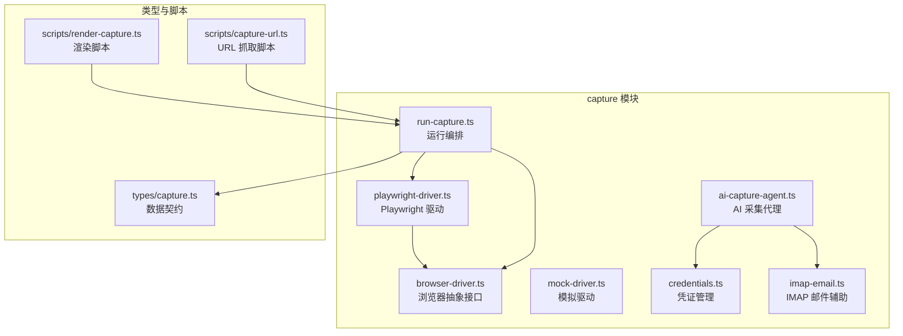
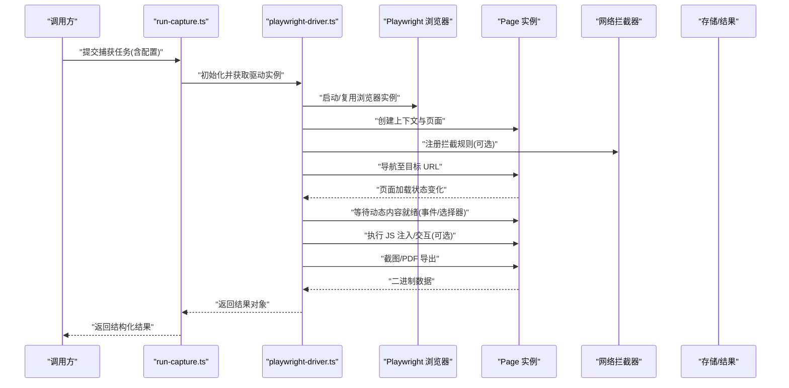
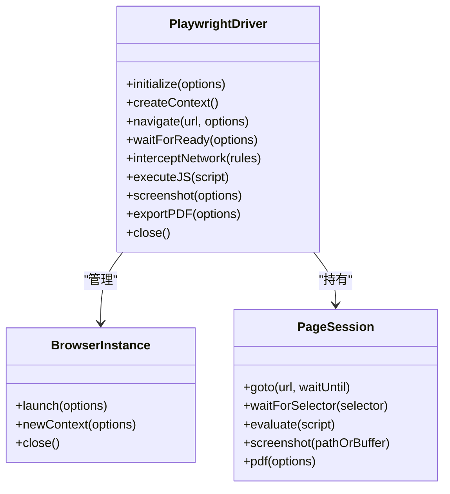
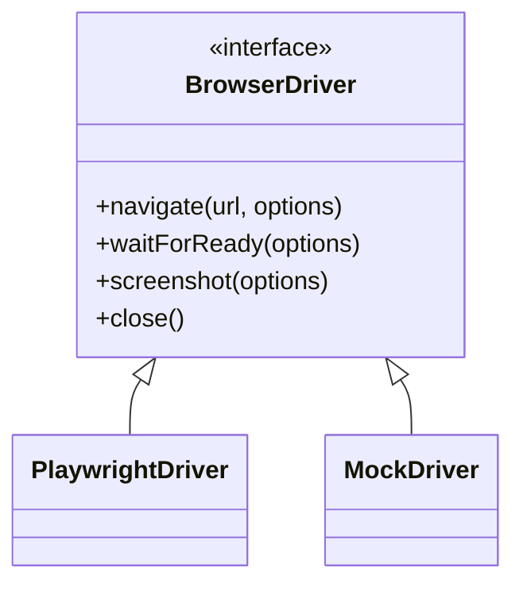
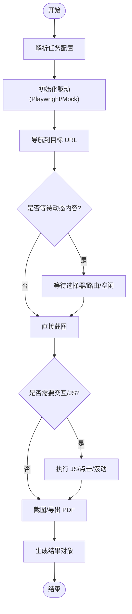
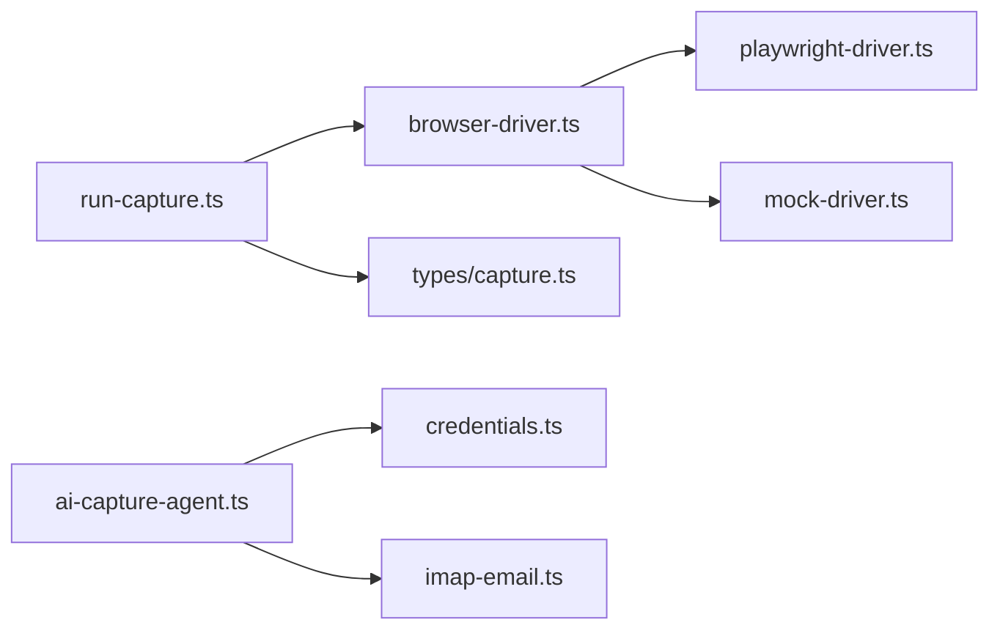

# 浏览器自动化捕获

<cite>
**本文引用的文件**   
- [server/src/capture/playwright-driver.ts](file://server/src/capture/playwright-driver.ts)
- [server/src/capture/browser-driver.ts](file://server/src/capture/browser-driver.ts)
- [server/src/capture/run-capture.ts](file://server/src/capture/run-capture.ts)
- [server/src/capture/mock-driver.ts](file://server/src/capture/mock-driver.ts)
- [server/src/capture/ai-capture-agent.ts](file://server/src/capture/ai-capture-agent.ts)
- [server/src/capture/credentials.ts](file://server/src/capture/credentials.ts)
- [server/src/capture/imap-email.ts](file://server/src/capture/imap-email.ts)
- [server/src/types/capture.ts](file://server/src/types/capture.ts)
- [server/scripts/render-capture.ts](file://server/scripts/render-capture.ts)
- [server/scripts/capture-url.ts](file://server/scripts/capture-url.ts)
- [server/package.json](file://server/package.json)
</cite>

## 目录
1. [简介](#简介)
2. [项目结构](#项目结构)
3. [核心组件](#核心组件)
4. [架构总览](#架构总览)
5. [详细组件分析](#详细组件分析)
6. [依赖关系分析](#依赖关系分析)
7. [性能考量](#性能考量)
8. [故障排查指南](#故障排查指南)
9. [结论](#结论)
10. [附录](#附录)

## 简介
本技术文档面向 PurpleInK 平台的浏览器自动化捕获子系统，聚焦于基于 Playwright 的驱动实现、浏览器实例管理、页面加载策略与截图捕获流程。文档同时覆盖动态内容渲染、JavaScript 执行环境、网络请求拦截与资源优化、截图质量控制、视口配置、设备模拟与响应式适配，并提供自定义浏览器参数、渲染性能优化与并发任务处理的配置示例。此外，还包含错误处理机制、超时控制与资源清理策略的实践建议。

## 项目结构
浏览器自动化捕获相关代码集中在 server/src/capture 目录，配合类型定义与脚本入口形成完整的采集管线：
- capture 模块：Playwright 驱动、通用浏览器抽象、运行编排、凭证与邮件辅助等
- types/capture.ts：捕获任务与结果的数据契约
- scripts：命令行工具用于触发 URL 抓取与渲染验证

**图表来源** 
- [server/src/capture/playwright-driver.ts](file://server/src/capture/playwright-driver.ts)
- [server/src/capture/browser-driver.ts](file://server/src/capture/browser-driver.ts)
- [server/src/capture/run-capture.ts](file://server/src/capture/run-capture.ts)
- [server/src/capture/mock-driver.ts](file://server/src/capture/mock-driver.ts)
- [server/src/capture/ai-capture-agent.ts](file://server/src/capture/ai-capture-agent.ts)
- [server/src/capture/credentials.ts](file://server/src/capture/credentials.ts)
- [server/src/capture/imap-email.ts](file://server/src/capture/imap-email.ts)
- [server/src/types/capture.ts](file://server/src/types/capture.ts)
- [server/scripts/render-capture.ts](file://server/scripts/render-capture.ts)
- [server/scripts/capture-url.ts](file://server/scripts/capture-url.ts)

**章节来源**
- [server/src/capture/playwright-driver.ts](file://server/src/capture/playwright-driver.ts)
- [server/src/capture/browser-driver.ts](file://server/src/capture/browser-driver.ts)
- [server/src/capture/run-capture.ts](file://server/src/capture/run-capture.ts)
- [server/src/types/capture.ts](file://server/src/types/capture.ts)
- [server/scripts/render-capture.ts](file://server/scripts/render-capture.ts)
- [server/scripts/capture-url.ts](file://server/scripts/capture-url.ts)

## 核心组件
- Playwright 驱动（playwright-driver.ts）：封装浏览器启动、上下文创建、页面导航、等待策略、截图与 PDF 导出、网络拦截与 JS 注入等能力
- 浏览器抽象（browser-driver.ts）：统一浏览器操作接口，便于替换为 Mock 或不同引擎
- 运行编排（run-capture.ts）：将任务输入转换为浏览器动作序列，协调截图、滚动、交互与结果输出
- 模拟驱动（mock-driver.ts）：在无头或测试环境下提供稳定返回，便于断言与回归
- AI 采集代理（ai-capture-agent.ts）：结合 LLM 决策进行智能导航、登录与内容定位
- 凭证与邮件（credentials.ts, imap-email.ts）：支持凭据注入与 IMAP 读取以完成认证流程
- 类型契约（types/capture.ts）：定义任务、配置、结果的结构与约束

**章节来源**
- [server/src/capture/playwright-driver.ts](file://server/src/capture/playwright-driver.ts)
- [server/src/capture/browser-driver.ts](file://server/src/capture/browser-driver.ts)
- [server/src/capture/run-capture.ts](file://server/src/capture/run-capture.ts)
- [server/src/capture/mock-driver.ts](file://server/src/capture/mock-driver.ts)
- [server/src/capture/ai-capture-agent.ts](file://server/src/capture/ai-capture-agent.ts)
- [server/src/capture/credentials.ts](file://server/src/capture/credentials.ts)
- [server/src/capture/imap-email.ts](file://server/src/capture/imap-email.ts)
- [server/src/types/capture.ts](file://server/src/types/capture.ts)

## 架构总览
整体流程从上层调用进入 run-capture，选择具体驱动（默认 Playwright），按策略导航到目标 URL，等待动态内容就绪后执行截图或导出，最终返回结构化结果。

**图表来源** 
- [server/src/capture/run-capture.ts](file://server/src/capture/run-capture.ts)
- [server/src/capture/playwright-driver.ts](file://server/src/capture/playwright-driver.ts)

**章节来源**
- [server/src/capture/run-capture.ts](file://server/src/capture/run-capture.ts)
- [server/src/capture/playwright-driver.ts](file://server/src/capture/playwright-driver.ts)

## 详细组件分析

### Playwright 驱动（playwright-driver.ts）
职责与要点：
- 浏览器实例管理：支持进程内复用与隔离上下文，避免跨站点污染
- 页面生命周期：创建 Context/Page、设置视口、设备模型、语言与时区
- 加载策略：优先使用网络空闲与 DOMContentLoaded，再根据选择器等待关键元素
- 动态内容：监听路由变化、懒加载图片、IntersectionObserver 触发的渲染
- 网络拦截：拦截静态资源（图片、字体、统计脚本）以提升加载速度
- JS 执行：在页面上下文中注入脚本，修改行为或增强可观测性
- 截图质量：分辨率、缩放、裁剪区域、格式（PNG/JPEG）、去背景
- 设备模拟：移动端/桌面端预设，触控与像素密度模拟
- 错误处理：超时、网络异常、页面崩溃、截图失败的重试与降级

**图表来源** 
- [server/src/capture/playwright-driver.ts](file://server/src/capture/playwright-driver.ts)

**章节来源**
- [server/src/capture/playwright-driver.ts](file://server/src/capture/playwright-driver.ts)

### 浏览器抽象（browser-driver.ts）
职责与要点：
- 定义统一的浏览器操作接口，屏蔽底层实现差异
- 提供最小必要方法：导航、等待、截图、关闭
- 便于切换驱动（如 Mock 驱动）或在不同环境中运行

**图表来源** 
- [server/src/capture/browser-driver.ts](file://server/src/capture/browser-driver.ts)
- [server/src/capture/playwright-driver.ts](file://server/src/capture/playwright-driver.ts)
- [server/src/capture/mock-driver.ts](file://server/src/capture/mock-driver.ts)

**章节来源**
- [server/src/capture/browser-driver.ts](file://server/src/capture/browser-driver.ts)
- [server/src/capture/mock-driver.ts](file://server/src/capture/mock-driver.ts)

### 运行编排（run-capture.ts）
职责与要点：
- 解析任务配置，选择驱动并初始化
- 编排导航、等待、交互、截图与导出步骤
- 聚合结果，记录耗时与错误信息
- 支持重试与降级策略

**图表来源** 
- [server/src/capture/run-capture.ts](file://server/src/capture/run-capture.ts)

**章节来源**
- [server/src/capture/run-capture.ts](file://server/src/capture/run-capture.ts)

### 模拟驱动（mock-driver.ts）
职责与要点：
- 在无头或测试场景下返回固定结果，确保稳定性
- 模拟导航、等待与截图，便于断言与回归测试

**章节来源**
- [server/src/capture/mock-driver.ts](file://server/src/capture/mock-driver.ts)

### AI 采集代理（ai-capture-agent.ts）
职责与要点：
- 结合 LLM 进行智能决策：识别登录流程、验证码、弹窗处理
- 动态调整导航策略与等待条件
- 与凭证模块协作，自动填充表单或调用 API

**章节来源**
- [server/src/capture/ai-capture-agent.ts](file://server/src/capture/ai-capture-agent.ts)
- [server/src/capture/credentials.ts](file://server/src/capture/credentials.ts)
- [server/src/capture/imap-email.ts](file://server/src/capture/imap-email.ts)

### 类型契约（types/capture.ts）
职责与要点：
- 定义任务输入（URL、视口、设备、等待策略、截图选项）
- 定义结果输出（截图路径/缓冲、PDF、元数据、错误信息）
- 规范配置项与校验规则

**章节来源**
- [server/src/types/capture.ts](file://server/src/types/capture.ts)

### 脚本入口（render-capture.ts, capture-url.ts）
职责与要点：
- render-capture.ts：批量渲染与验证，常用于基准测试与回归
- capture-url.ts：单 URL 抓取，便于快速调试与验证

**章节来源**
- [server/scripts/render-capture.ts](file://server/scripts/render-capture.ts)
- [server/scripts/capture-url.ts](file://server/scripts/capture-url.ts)

## 依赖关系分析
- 运行时依赖：Playwright 作为浏览器自动化引擎，通过 driver 层抽象被编排模块调用
- 类型依赖：capture 类型贯穿任务与结果，保证一致性
- 外部集成：IMAP 用于邮件验证码读取；凭证模块用于登录态注入

**图表来源** 
- [server/src/capture/run-capture.ts](file://server/src/capture/run-capture.ts)
- [server/src/capture/browser-driver.ts](file://server/src/capture/browser-driver.ts)
- [server/src/capture/playwright-driver.ts](file://server/src/capture/playwright-driver.ts)
- [server/src/capture/mock-driver.ts](file://server/src/capture/mock-driver.ts)
- [server/src/types/capture.ts](file://server/src/types/capture.ts)
- [server/src/capture/ai-capture-agent.ts](file://server/src/capture/ai-capture-agent.ts)
- [server/src/capture/credentials.ts](file://server/src/capture/credentials.ts)
- [server/src/capture/imap-email.ts](file://server/src/capture/imap-email.ts)

**章节来源**
- [server/package.json](file://server/package.json)
- [server/src/capture/run-capture.ts](file://server/src/capture/run-capture.ts)
- [server/src/capture/browser-driver.ts](file://server/src/capture/browser-driver.ts)
- [server/src/capture/playwright-driver.ts](file://server/src/capture/playwright-driver.ts)
- [server/src/capture/mock-driver.ts](file://server/src/capture/mock-driver.ts)
- [server/src/types/capture.ts](file://server/src/types/capture.ts)
- [server/src/capture/ai-capture-agent.ts](file://server/src/capture/ai-capture-agent.ts)
- [server/src/capture/credentials.ts](file://server/src/capture/credentials.ts)
- [server/src/capture/imap-email.ts](file://server/src/capture/imap-email.ts)

## 性能考量
- 浏览器实例复用：减少启动开销，合理设置最大上下文数与页面数
- 资源拦截：屏蔽非关键资源（广告、统计、字体），缩短首屏时间
- 等待策略：优先使用路由空闲与选择器存在，避免硬编码 sleep
- 截图优化：按需裁剪视口、降低分辨率与压缩率，平衡质量与体积
- 并发控制：限制并行任务数，避免内存峰值过高导致 OOM
- 缓存与复用：对静态资源启用浏览器缓存，减少重复下载

[本节为通用指导，不直接分析具体文件]

## 故障排查指南
常见问题与处理：
- 页面未完全渲染：检查等待策略与选择器，增加路由空闲等待
- 截图模糊或缺失：确认视口尺寸、缩放比例与裁剪区域
- 网络超时：调整超时阈值，检查 DNS 与代理设置
- 登录失败：核对凭证注入顺序与表单字段映射
- 内存泄漏：及时关闭上下文与页面，避免长驻进程累积

**章节来源**
- [server/src/capture/playwright-driver.ts](file://server/src/capture/playwright-driver.ts)
- [server/src/capture/run-capture.ts](file://server/src/capture/run-capture.ts)

## 结论
PurpleInK 的浏览器自动化捕获系统通过 Playwright 驱动实现了高可用、可扩展的页面渲染与截图能力。借助统一的浏览器抽象与编排层，系统能够灵活应对动态内容、复杂交互与多设备场景。合理的等待策略、网络拦截与并发控制是保障性能与稳定性的关键。未来可进一步引入更细粒度的资源级缓存与自适应等待算法，提升大规模批处理的吞吐与可靠性。

[本节为总结性内容，不直接分析具体文件]

## 附录
- 配置示例（概念性说明）：
  - 自定义浏览器参数：禁用 GPU 加速、启用无头模式、设置代理
  - 视口与设备：指定宽度/高度、像素密度、UA 字符串
  - 等待策略：DOM 就绪、网络空闲、选择器可见
  - 截图质量：格式、质量系数、裁剪区域
  - 并发任务：最大并行度、队列长度、超时与重试
- 参考脚本：
  - render-capture.ts：批量渲染与验证
  - capture-url.ts：单 URL 抓取

[本节为补充说明，不直接分析具体文件]