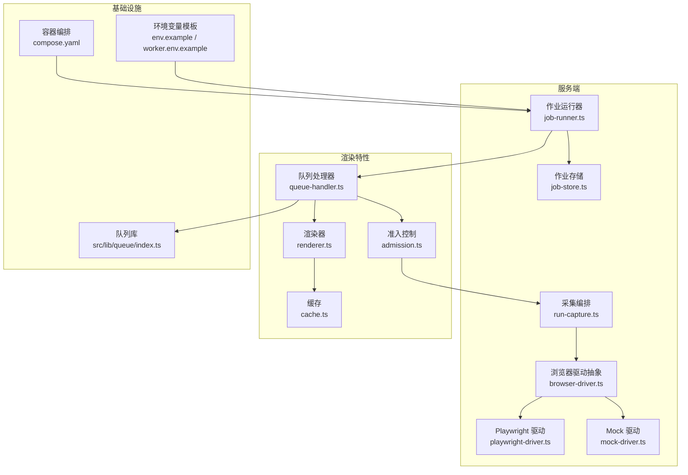
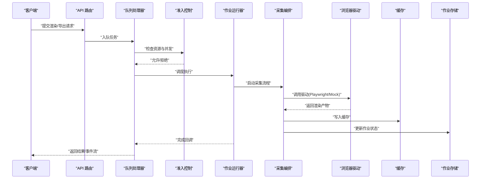
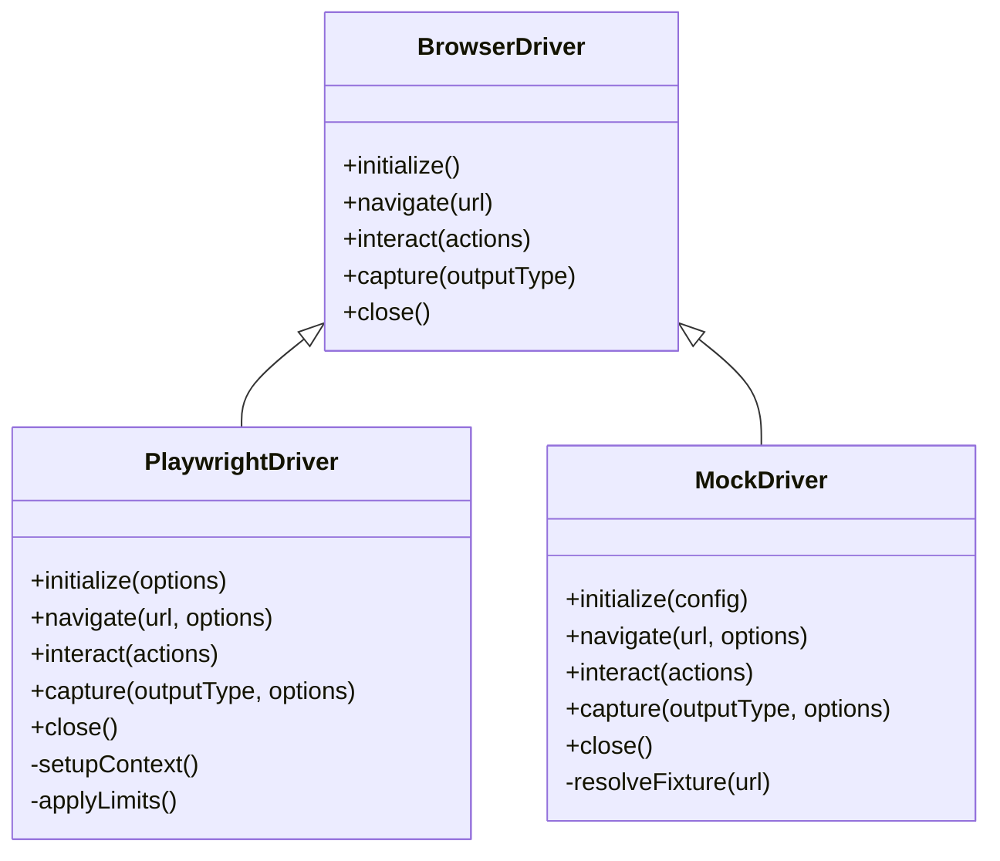
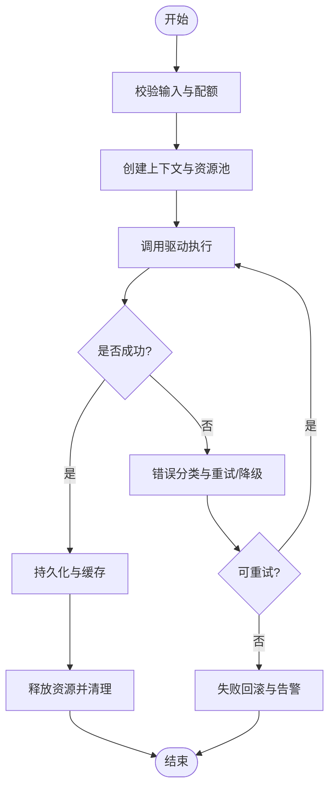
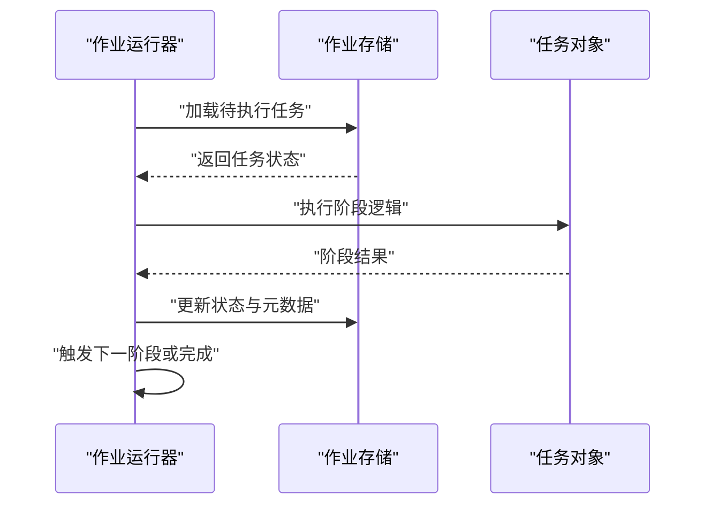
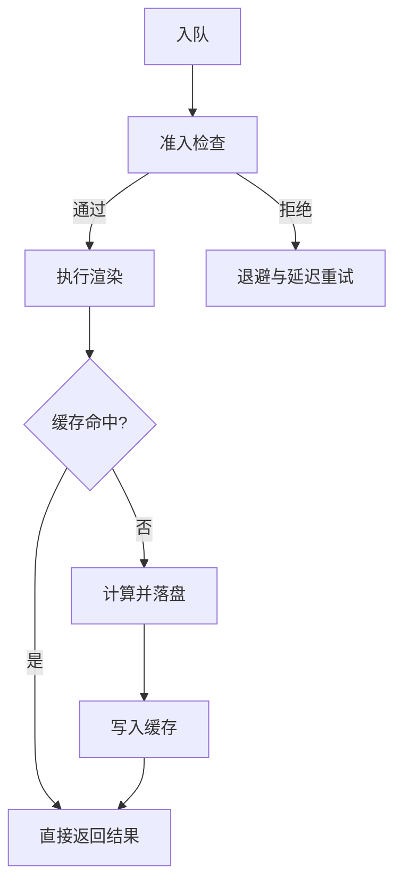
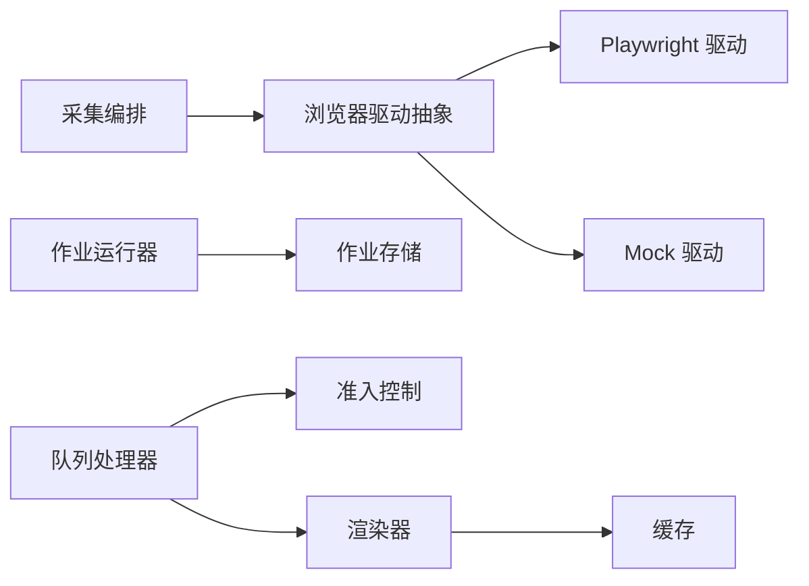

# 资源管理与优化

<cite>
**本文引用的文件**
- [server/src/capture/browser-driver.ts](file://server/src/capture/browser-driver.ts)
- [server/src/capture/mock-driver.ts](file://server/src/capture/mock-driver.ts)
- [server/src/capture/playwright-driver.ts](file://server/src/capture/playwright-driver.ts)
- [server/src/capture/run-capture.ts](file://server/src/capture/run-capture.ts)
- [server/src/server/job-runner.ts](file://server/src/server/job-runner.ts)
- [server/src/server/job-store.ts](file://server/src/server/job-store.ts)
- [src/features/render/renderer.ts](file://src/features/render/renderer.ts)
- [src/features/render/queue-handler.ts](file://src/features/render/queue-handler.ts)
- [src/features/render/admission.ts](file://src/features/render/admission.ts)
- [src/features/render/cache.ts](file://src/features/render/cache.ts)
- [src/features/render/types.ts](file://src/features/render/types.ts)
- [src/lib/queue/index.ts](file://src/lib/queue/index.ts)
- [deploy/compose.yaml](file://deploy/compose.yaml)
- [deploy/env.example](file://deploy/env.example)
- [deploy/worker.env.example](file://deploy/worker.env.example)
- [config/tts.env.example](file://config/tts.env.example)
</cite>

## 目录
1. [简介](#简介)
2. [项目结构](#项目结构)
3. [核心组件](#核心组件)
4. [架构总览](#架构总览)
5. [详细组件分析](#详细组件分析)
6. [依赖关系分析](#依赖关系分析)
7. [性能考量](#性能考量)
8. [故障排查指南](#故障排查指南)
9. [结论](#结论)
10. [附录](#附录)

## 简介
本技术文档聚焦 PurpleInK 平台的浏览器资源管理系统，围绕以下目标展开：
- 资源分配策略：内存管理、CPU 使用控制与并发限制
- Mock 驱动实现原理：用于测试环境与性能优化场景
- 公共访问保护机制：防止未授权的资源访问
- 配置示例：设置资源上限、监控使用情况、处理资源耗尽
- 性能调优与稳定性：垃圾回收与资源泄漏检测最佳实践

## 项目结构
本项目采用前后端分离与多进程协作的架构。服务端负责渲染任务调度、浏览器实例生命周期管理、队列与缓存；前端提供控制台与可视化能力。关键目录说明：
- server/src/capture：浏览器驱动抽象、Playwright 实现、Mock 驱动、采集流程编排
- server/src/server：作业运行器与持久化存储
- src/features/render：渲染管线、队列处理器、准入控制、缓存
- src/lib/queue：通用队列基础设施
- deploy：容器编排与环境变量模板

**图表来源**
- [server/src/server/job-runner.ts](file://server/src/server/job-runner.ts)
- [server/src/server/job-store.ts](file://server/src/server/job-store.ts)
- [server/src/capture/run-capture.ts](file://server/src/capture/run-capture.ts)
- [server/src/capture/browser-driver.ts](file://server/src/capture/browser-driver.ts)
- [server/src/capture/playwright-driver.ts](file://server/src/capture/playwright-driver.ts)
- [server/src/capture/mock-driver.ts](file://server/src/capture/mock-driver.ts)
- [src/features/render/renderer.ts](file://src/features/render/renderer.ts)
- [src/features/render/queue-handler.ts](file://src/features/render/queue-handler.ts)
- [src/features/render/admission.ts](file://src/features/render/admission.ts)
- [src/features/render/cache.ts](file://src/features/render/cache.ts)
- [src/lib/queue/index.ts](file://src/lib/queue/index.ts)
- [deploy/compose.yaml](file://deploy/compose.yaml)
- [deploy/env.example](file://deploy/env.example)
- [deploy/worker.env.example](file://deploy/worker.env.example)

**章节来源**
- [server/src/server/job-runner.ts](file://server/src/server/job-runner.ts)
- [server/src/server/job-store.ts](file://server/src/server/job-store.ts)
- [server/src/capture/run-capture.ts](file://server/src/capture/run-capture.ts)
- [server/src/capture/browser-driver.ts](file://server/src/capture/browser-driver.ts)
- [server/src/capture/playwright-driver.ts](file://server/src/capture/playwright-driver.ts)
- [server/src/capture/mock-driver.ts](file://server/src/capture/mock-driver.ts)
- [src/features/render/renderer.ts](file://src/features/render/renderer.ts)
- [src/features/render/queue-handler.ts](file://src/features/render/queue-handler.ts)
- [src/features/render/admission.ts](file://src/features/render/admission.ts)
- [src/features/render/cache.ts](file://src/features/render/cache.ts)
- [src/lib/queue/index.ts](file://src/lib/queue/index.ts)
- [deploy/compose.yaml](file://deploy/compose.yaml)
- [deploy/env.example](file://deploy/env.example)
- [deploy/worker.env.example](file://deploy/worker.env.example)

## 核心组件
- 浏览器驱动抽象层：统一接口屏蔽不同后端（Playwright/Mock），便于切换与扩展
- Playwright 驱动：基于真实浏览器执行页面渲染、截图或导出
- Mock 驱动：在测试与性能优化场景中模拟浏览器行为，降低外部依赖与资源消耗
- 采集编排：协调驱动、输入输出、错误恢复与超时控制
- 作业运行器与存储：负责任务调度、状态持久化与重试
- 渲染器与队列处理器：将渲染任务纳入队列，实施准入控制与缓存命中
- 准入控制：根据系统负载与资源配额决定是否接纳新任务
- 缓存：减少重复计算与 IO，提升吞吐
- 队列库：提供并发控制、背压与限流能力

**章节来源**
- [server/src/capture/browser-driver.ts](file://server/src/capture/browser-driver.ts)
- [server/src/capture/playwright-driver.ts](file://server/src/capture/playwright-driver.ts)
- [server/src/capture/mock-driver.ts](file://server/src/capture/mock-driver.ts)
- [server/src/capture/run-capture.ts](file://server/src/capture/run-capture.ts)
- [server/src/server/job-runner.ts](file://server/src/server/job-runner.ts)
- [server/src/server/job-store.ts](file://server/src/server/job-store.ts)
- [src/features/render/renderer.ts](file://src/features/render/renderer.ts)
- [src/features/render/queue-handler.ts](file://src/features/render/queue-handler.ts)
- [src/features/render/admission.ts](file://src/features/render/admission.ts)
- [src/features/render/cache.ts](file://src/features/render/cache.ts)
- [src/lib/queue/index.ts](file://src/lib/queue/index.ts)

## 架构总览
下图展示了从请求进入、任务入队、准入控制、渲染执行到结果落盘与缓存的全链路。

**图表来源**
- [src/features/render/queue-handler.ts](file://src/features/render/queue-handler.ts)
- [src/features/render/admission.ts](file://src/features/render/admission.ts)
- [server/src/server/job-runner.ts](file://server/src/server/job-runner.ts)
- [server/src/capture/run-capture.ts](file://server/src/capture/run-capture.ts)
- [server/src/capture/browser-driver.ts](file://server/src/capture/browser-driver.ts)
- [src/features/render/cache.ts](file://src/features/render/cache.ts)
- [server/src/server/job-store.ts](file://server/src/server/job-store.ts)

## 详细组件分析

### 浏览器驱动抽象与实现
- 抽象层定义统一的驱动接口，包括初始化、导航、交互、截图/导出、关闭等能力
- Playwright 驱动实现真实浏览器操作，支持无头模式、视口配置、网络拦截与资源限制
- Mock 驱动通过预置数据与快速路径模拟浏览器行为，适用于单元测试、集成测试与性能基准

**图表来源**
- [server/src/capture/browser-driver.ts](file://server/src/capture/browser-driver.ts)
- [server/src/capture/playwright-driver.ts](file://server/src/capture/playwright-driver.ts)
- [server/src/capture/mock-driver.ts](file://server/src/capture/mock-driver.ts)

**章节来源**
- [server/src/capture/browser-driver.ts](file://server/src/capture/browser-driver.ts)
- [server/src/capture/playwright-driver.ts](file://server/src/capture/playwright-driver.ts)
- [server/src/capture/mock-driver.ts](file://server/src/capture/mock-driver.ts)

### 采集编排与资源控制
- 采集编排负责参数校验、上下文创建、驱动调用、超时与重试、错误分类与上报
- 资源控制点包括：
  - 内存限制：通过运行时选项与上下文隔离限制单任务内存峰值
  - CPU 使用控制：限制并发任务数、启用无头模式、禁用不必要插件
  - 并发限制：队列并发度、每进程最大浏览器实例数、全局速率限制

**图表来源**
- [server/src/capture/run-capture.ts](file://server/src/capture/run-capture.ts)
- [server/src/capture/browser-driver.ts](file://server/src/capture/browser-driver.ts)

**章节来源**
- [server/src/capture/run-capture.ts](file://server/src/capture/run-capture.ts)

### 作业运行器与存储
- 作业运行器负责任务生命周期管理、状态机推进、重试与补偿
- 作业存储提供持久化能力，确保崩溃恢复与审计追踪

**图表来源**
- [server/src/server/job-runner.ts](file://server/src/server/job-runner.ts)
- [server/src/server/job-store.ts](file://server/src/server/job-store.ts)

**章节来源**
- [server/src/server/job-runner.ts](file://server/src/server/job-runner.ts)
- [server/src/server/job-store.ts](file://server/src/server/job-store.ts)

### 渲染管线与准入控制
- 渲染器封装渲染逻辑，与队列处理器协同工作
- 准入控制依据当前系统指标（CPU、内存、队列长度）决定是否接纳新任务
- 缓存层对相同输入进行去重，避免重复计算

**图表来源**
- [src/features/render/queue-handler.ts](file://src/features/render/queue-handler.ts)
- [src/features/render/admission.ts](file://src/features/render/admission.ts)
- [src/features/render/renderer.ts](file://src/features/render/renderer.ts)
- [src/features/render/cache.ts](file://src/features/render/cache.ts)

**章节来源**
- [src/features/render/queue-handler.ts](file://src/features/render/queue-handler.ts)
- [src/features/render/admission.ts](file://src/features/render/admission.ts)
- [src/features/render/renderer.ts](file://src/features/render/renderer.ts)
- [src/features/render/cache.ts](file://src/features/render/cache.ts)

### 公共访问保护机制
- 针对公共资源访问，应在 API 层实施鉴权与权限校验，确保仅授权用户或角色可访问敏感资源
- 建议措施：
  - 统一鉴权中间件：验证令牌、签名或会话状态
  - 资源级 ACL：按项目/用户维度控制访问
  - 速率限制与防抖：防止滥用与扫描
  - 审计日志：记录访问与操作轨迹

[本节为概念性说明，不直接分析具体文件]

## 依赖关系分析
- 组件耦合：
  - 采集编排依赖浏览器驱动抽象，解耦具体实现
  - 作业运行器依赖作业存储，保证状态一致性
  - 渲染管线依赖队列与准入控制，保障系统稳定
- 外部依赖：
  - Playwright：浏览器自动化引擎
  - 存储后端：持久化作业与结果
  - 缓存后端：加速重复请求

**图表来源**
- [server/src/capture/run-capture.ts](file://server/src/capture/run-capture.ts)
- [server/src/capture/browser-driver.ts](file://server/src/capture/browser-driver.ts)
- [server/src/capture/playwright-driver.ts](file://server/src/capture/playwright-driver.ts)
- [server/src/capture/mock-driver.ts](file://server/src/capture/mock-driver.ts)
- [server/src/server/job-runner.ts](file://server/src/server/job-runner.ts)
- [server/src/server/job-store.ts](file://server/src/server/job-store.ts)
- [src/features/render/queue-handler.ts](file://src/features/render/queue-handler.ts)
- [src/features/render/admission.ts](file://src/features/render/admission.ts)
- [src/features/render/renderer.ts](file://src/features/render/renderer.ts)
- [src/features/render/cache.ts](file://src/features/render/cache.ts)

**章节来源**
- [server/src/capture/run-capture.ts](file://server/src/capture/run-capture.ts)
- [server/src/capture/browser-driver.ts](file://server/src/capture/browser-driver.ts)
- [server/src/capture/playwright-driver.ts](file://server/src/capture/playwright-driver.ts)
- [server/src/capture/mock-driver.ts](file://server/src/capture/mock-driver.ts)
- [server/src/server/job-runner.ts](file://server/src/server/job-runner.ts)
- [server/src/server/job-store.ts](file://server/src/server/job-store.ts)
- [src/features/render/queue-handler.ts](file://src/features/render/queue-handler.ts)
- [src/features/render/admission.ts](file://src/features/render/admission.ts)
- [src/features/render/renderer.ts](file://src/features/render/renderer.ts)
- [src/features/render/cache.ts](file://src/features/render/cache.ts)

## 性能考量
- 内存管理
  - 限制单任务内存上限，避免 OOM 影响整体服务
  - 及时释放浏览器上下文与句柄，避免内存泄漏
  - 使用对象池与连接池复用资源
- CPU 使用控制
  - 合理设置并发度与线程池大小
  - 启用无头模式与最小化插件，降低开销
  - 对长耗时任务进行分片与异步处理
- 并发限制
  - 队列并发度与速率限制结合，平滑峰值流量
  - 分级限流：全局、租户、用户维度
- 缓存与去重
  - 对相同输入进行缓存，减少重复计算
  - 缓存失效策略与版本化，避免脏读
- 垃圾回收与泄漏检测
  - 定期触发 GC，观察堆快照与增长趋势
  - 使用诊断工具定位未释放引用与闭包泄漏
  - 建立健康检查与自动重启策略

[本节为通用指导，不直接分析具体文件]

## 故障排查指南
- 常见问题
  - 任务被拒绝：检查准入控制阈值与系统负载
  - 渲染超时：调整超时时间、网络与驱动配置
  - 内存不足：降低并发、增加内存限制、排查泄漏
  - 缓存未命中：确认键生成规则与失效策略
- 诊断步骤
  - 查看作业状态与错误码，定位失败阶段
  - 收集驱动日志与浏览器控制台输出
  - 监控指标：CPU、内存、队列长度、命中率
  - 回放用例与对比基线，定位回归问题

**章节来源**
- [server/src/server/job-runner.ts](file://server/src/server/job-runner.ts)
- [server/src/capture/run-capture.ts](file://server/src/capture/run-capture.ts)
- [src/features/render/admission.ts](file://src/features/render/admission.ts)
- [src/features/render/cache.ts](file://src/features/render/cache.ts)

## 结论
PurpleInK 的浏览器资源管理系统通过抽象驱动、编排采集、作业调度与准入控制，实现了高可用与高性能的渲染流水线。配合合理的资源配置、缓存策略与监控诊断，可在测试与生产环境中稳定运行。建议在部署时严格设定资源上限与并发限制，持续监控与优化，确保系统在负载波动下保持稳健。

[本节为总结性内容，不直接分析具体文件]

## 附录

### 配置示例与最佳实践
- 资源上限设置
  - 设置最大并发任务数与每进程浏览器实例上限
  - 配置单任务内存与 CPU 配额，防止资源争用
- 监控使用情况
  - 暴露关键指标：队列长度、成功率、平均耗时、缓存命中率
  - 接入日志与告警，及时发现异常
- 资源耗尽处理
  - 实施退避与降级策略，优先保障核心任务
  - 动态扩缩容与弹性伸缩，应对突发流量
- 垃圾回收与泄漏检测
  - 定期采样堆快照，识别持续增长的对象
  - 引入泄漏检测工具，自动化发现潜在问题

**章节来源**
- [deploy/compose.yaml](file://deploy/compose.yaml)
- [deploy/env.example](file://deploy/env.example)
- [deploy/worker.env.example](file://deploy/worker.env.example)
- [config/tts.env.example](file://config/tts.env.example)