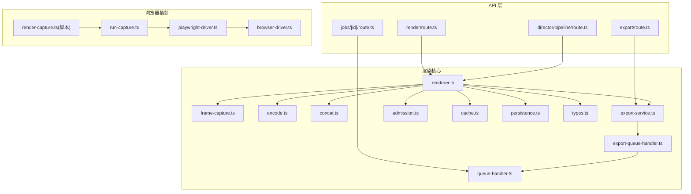
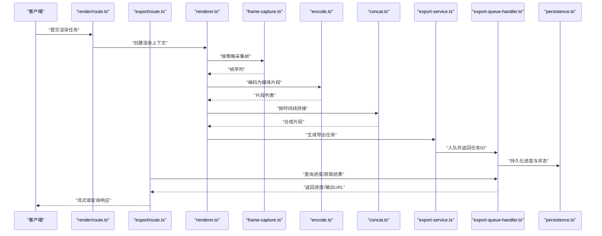
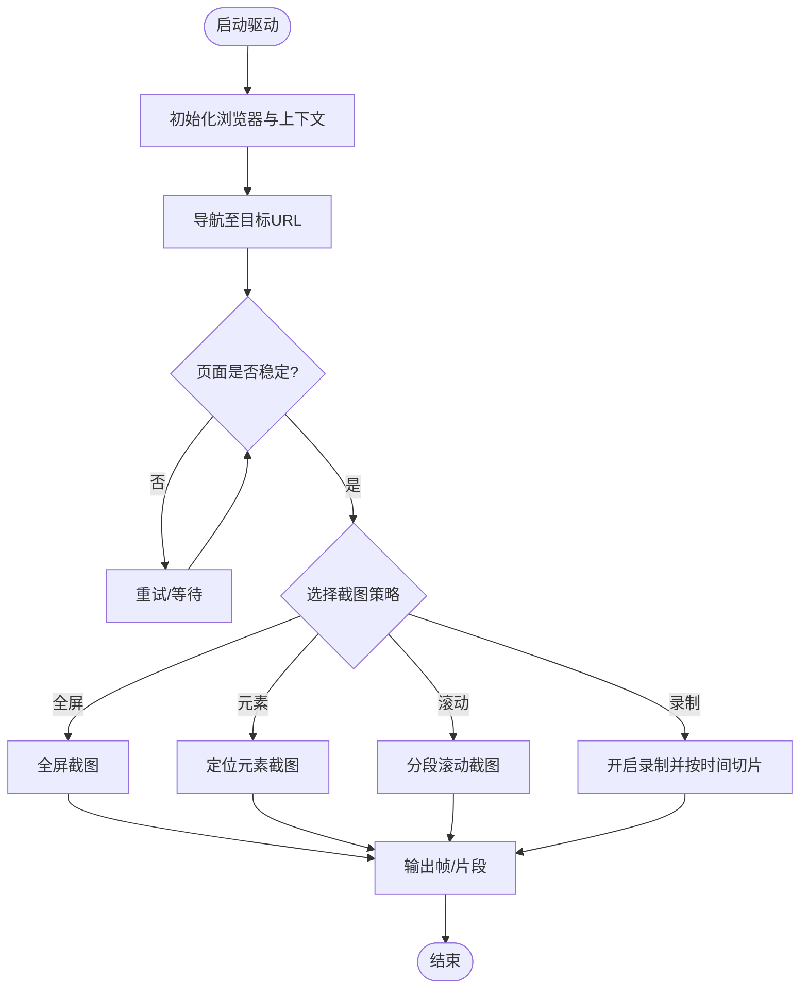
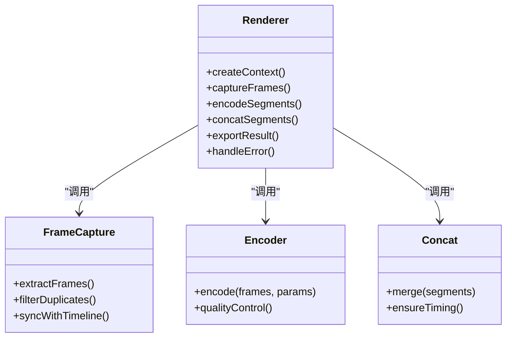
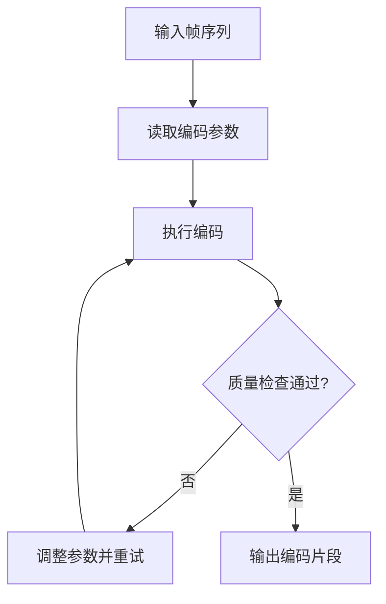
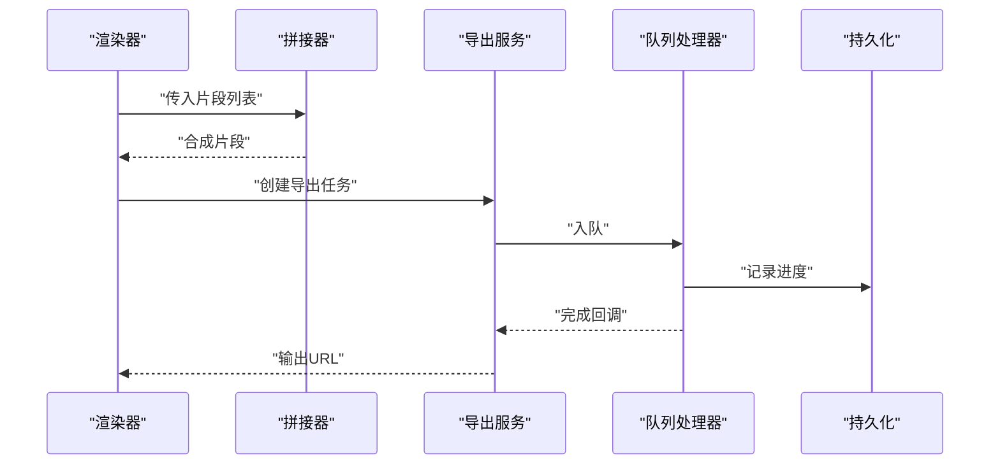
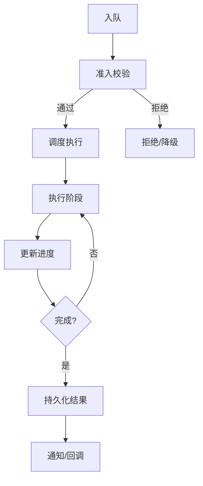
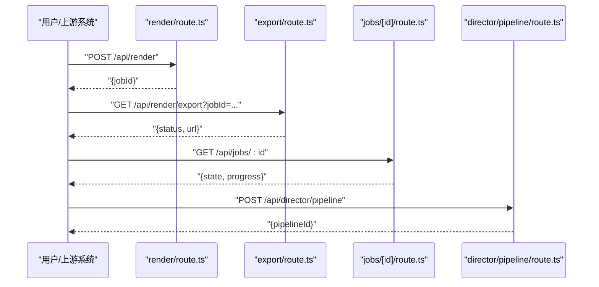
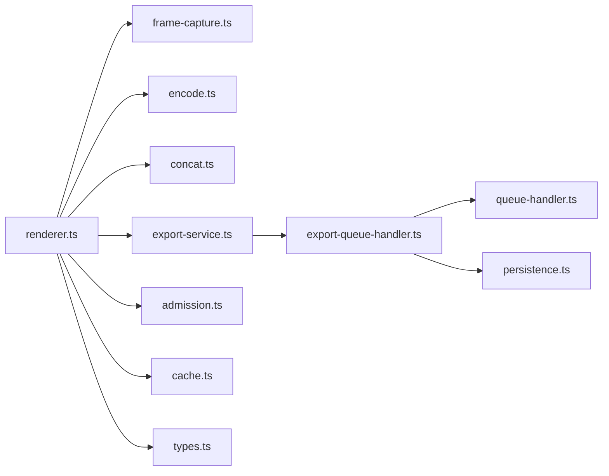

# 渲染引擎

<cite>
**本文引用的文件**   
- [server/src/capture/playwright-driver.ts](file://server/src/capture/playwright-driver.ts)
- [server/src/capture/browser-driver.ts](file://server/src/capture/browser-driver.ts)
- [server/src/capture/run-capture.ts](file://server/src/capture/run-capture.ts)
- [src/features/render/renderer.ts](file://src/features/render/renderer.ts)
- [src/features/render/frame-capture.ts](file://src/features/render/frame-capture.ts)
- [src/features/render/encode.ts](file://src/features/render/encode.ts)
- [src/features/render/concat.ts](file://src/features/render/concat.ts)
- [src/features/render/export-service.ts](file://src/features/render/export-service.ts)
- [src/features/render/export-queue-handler.ts](file://src/features/render/export-queue-handler.ts)
- [src/features/render/queue-handler.ts](file://src/features/render/queue-handler.ts)
- [src/features/render/admission.ts](file://src/features/render/admission.ts)
- [src/features/render/cache.ts](file://src/features/render/cache.ts)
- [src/features/render/persistence.ts](file://src/features/render/persistence.ts)
- [src/features/render/types.ts](file://src/features/render/types.ts)
- [src/app/api/render/route.ts](file://src/app/api/render/route.ts)
- [src/app/api/render/export/route.ts](file://src/app/api/render/export/route.ts)
- [src/app/api/director/pipeline/route.ts](file://src/app/api/director/pipeline/route.ts)
- [src/app/api/jobs/[id]/route.ts](file://src/app/api/jobs/[id]/route.ts)
- [server/scripts/render-capture.ts](file://server/scripts/render-capture.ts)
</cite>

## 目录
1. [简介](#简介)
2. [项目结构](#项目结构)
3. [核心组件](#核心组件)
4. [架构总览](#架构总览)
5. [详细组件分析](#详细组件分析)
6. [依赖关系分析](#依赖关系分析)
7. [性能考量](#性能考量)
8. [故障诊断指南](#故障诊断指南)
9. [结论](#结论)
10. [附录](#附录)

## 简介
本技术文档面向 PurpleInK 平台的渲染引擎，聚焦以下关键能力：
- 浏览器自动化捕获与截图策略（Playwright 驱动）
- 视频帧提取、媒体组装与格式转换流程
- 渲染队列管理、任务调度、进度跟踪与错误恢复
- 可配置化渲染参数、性能优化与大规模批量处理
- 监控指标与故障诊断方法

该引擎通过“导演编排 + 渲染执行”的分层设计，将页面渲染、帧采集、编码封装、拼接导出等步骤解耦，并以队列与持久化保障高吞吐与可恢复性。

## 项目结构
渲染相关代码主要分布在两个区域：
- server 侧：浏览器驱动与捕获脚本（Playwright 驱动、运行器）
- src/features/render：渲染管线核心（帧采集、编码、拼接、导出服务、队列与持久化）
- src/app/api：对外 API 入口（渲染、导出、作业状态查询）

图表来源
- [src/app/api/render/route.ts](file://src/app/api/render/route.ts)
- [src/app/api/render/export/route.ts](file://src/app/api/render/export/route.ts)
- [src/app/api/jobs/[id]/route.ts](file://src/app/api/jobs/[id]/route.ts)
- [src/app/api/director/pipeline/route.ts](file://src/app/api/director/pipeline/route.ts)
- [src/features/render/renderer.ts](file://src/features/render/renderer.ts)
- [src/features/render/frame-capture.ts](file://src/features/render/frame-capture.ts)
- [src/features/render/encode.ts](file://src/features/render/encode.ts)
- [src/features/render/concat.ts](file://src/features/render/concat.ts)
- [src/features/render/export-service.ts](file://src/features/render/export-service.ts)
- [src/features/render/export-queue-handler.ts](file://src/features/render/export-queue-handler.ts)
- [src/features/render/queue-handler.ts](file://src/features/render/queue-handler.ts)
- [src/features/render/admission.ts](file://src/features/render/admission.ts)
- [src/features/render/cache.ts](file://src/features/render/cache.ts)
- [src/features/render/persistence.ts](file://src/features/render/persistence.ts)
- [src/features/render/types.ts](file://src/features/render/types.ts)
- [server/src/capture/playwright-driver.ts](file://server/src/capture/playwright-driver.ts)
- [server/src/capture/browser-driver.ts](file://server/src/capture/browser-driver.ts)
- [server/src/capture/run-capture.ts](file://server/src/capture/run-capture.ts)
- [server/scripts/render-capture.ts](file://server/scripts/render-capture.ts)

章节来源
- [src/app/api/render/route.ts](file://src/app/api/render/route.ts)
- [src/app/api/render/export/route.ts](file://src/app/api/render/export/route.ts)
- [src/app/api/jobs/[id]/route.ts](file://src/app/api/jobs/[id]/route.ts)
- [src/app/api/director/pipeline/route.ts](file://src/app/api/director/pipeline/route.ts)
- [src/features/render/renderer.ts](file://src/features/render/renderer.ts)
- [src/features/render/frame-capture.ts](file://src/features/render/frame-capture.ts)
- [src/features/render/encode.ts](file://src/features/render/encode.ts)
- [src/features/render/concat.ts](file://src/features/render/concat.ts)
- [src/features/render/export-service.ts](file://src/features/render/export-service.ts)
- [src/features/render/export-queue-handler.ts](file://src/features/render/export-queue-handler.ts)
- [src/features/render/queue-handler.ts](file://src/features/render/queue-handler.ts)
- [src/features/render/admission.ts](file://src/features/render/admission.ts)
- [src/features/render/cache.ts](file://src/features/render/cache.ts)
- [src/features/render/persistence.ts](file://src/features/render/persistence.ts)
- [src/features/render/types.ts](file://src/features/render/types.ts)
- [server/src/capture/playwright-driver.ts](file://server/src/capture/playwright-driver.ts)
- [server/src/capture/browser-driver.ts](file://server/src/capture/browser-driver.ts)
- [server/src/capture/run-capture.ts](file://server/src/capture/run-capture.ts)
- [server/scripts/render-capture.ts](file://server/scripts/render-capture.ts)

## 核心组件
- Playwright 浏览器驱动：负责启动无头浏览器、导航到目标 URL、等待页面稳定、按策略截取帧或录制视频片段。
- 渲染器：编排“页面渲染 → 帧采集 → 编码 → 拼接 → 导出”的完整流水线，支持并发控制、缓存命中与失败重试。
- 帧采集：基于时间轴或关键帧策略从渲染上下文提取图像序列。
- 编码器：将帧序列编码为指定容器与编码参数（码率、分辨率、帧率、质量）。
- 拼接器：将多段媒体按顺序合并，保证时序一致与无缝衔接。
- 导出服务与队列处理器：接收导出请求，入队并异步执行，提供进度与结果回调。
- 准入与缓存：限制并发、校验资源配额；利用缓存避免重复计算。
- 持久化：保存任务元数据、中间产物与最终输出，支持断点续跑。

章节来源
- [src/features/render/renderer.ts](file://src/features/render/renderer.ts)
- [src/features/render/frame-capture.ts](file://src/features/render/frame-capture.ts)
- [src/features/render/encode.ts](file://src/features/render/encode.ts)
- [src/features/render/concat.ts](file://src/features/render/concat.ts)
- [src/features/render/export-service.ts](file://src/features/render/export-service.ts)
- [src/features/render/export-queue-handler.ts](file://src/features/render/export-queue-handler.ts)
- [src/features/render/queue-handler.ts](file://src/features/render/queue-handler.ts)
- [src/features/render/admission.ts](file://src/features/render/admission.ts)
- [src/features/render/cache.ts](file://src/features/render/cache.ts)
- [src/features/render/persistence.ts](file://src/features/render/persistence.ts)
- [src/features/render/types.ts](file://src/features/render/types.ts)
- [server/src/capture/playwright-driver.ts](file://server/src/capture/playwright-driver.ts)
- [server/src/capture/browser-driver.ts](file://server/src/capture/browser-driver.ts)
- [server/src/capture/run-capture.ts](file://server/src/capture/run-capture.ts)

## 架构总览
渲染引擎采用“API 入口 → 渲染器 → 子阶段（采集/编码/拼接/导出）→ 队列与持久化”的分层架构。浏览器捕获作为独立子系统，通过驱动抽象与渲染器协作。

图表来源
- [src/app/api/render/route.ts](file://src/app/api/render/route.ts)
- [src/app/api/render/export/route.ts](file://src/app/api/render/export/route.ts)
- [src/features/render/renderer.ts](file://src/features/render/renderer.ts)
- [src/features/render/frame-capture.ts](file://src/features/render/frame-capture.ts)
- [src/features/render/encode.ts](file://src/features/render/encode.ts)
- [src/features/render/concat.ts](file://src/features/render/concat.ts)
- [src/features/render/export-service.ts](file://src/features/render/export-service.ts)
- [src/features/render/export-queue-handler.ts](file://src/features/render/export-queue-handler.ts)
- [src/features/render/persistence.ts](file://src/features/render/persistence.ts)

## 详细组件分析

### Playwright 浏览器驱动与截图策略
- 驱动职责：初始化浏览器实例、设置视口与网络拦截、加载页面、等待稳定、执行截图或录制。
- 截图策略：支持全屏、元素定位、滚动分段、延迟等待与重试机制，确保动态内容渲染完成。
- 视频录制：在需要时启用录制模式，按时间片切分片段，便于后续拼接。

图表来源
- [server/src/capture/playwright-driver.ts](file://server/src/capture/playwright-driver.ts)
- [server/src/capture/browser-driver.ts](file://server/src/capture/browser-driver.ts)
- [server/src/capture/run-capture.ts](file://server/src/capture/run-capture.ts)
- [server/scripts/render-capture.ts](file://server/scripts/render-capture.ts)

章节来源
- [server/src/capture/playwright-driver.ts](file://server/src/capture/playwright-driver.ts)
- [server/src/capture/browser-driver.ts](file://server/src/capture/browser-driver.ts)
- [server/src/capture/run-capture.ts](file://server/src/capture/run-capture.ts)
- [server/scripts/render-capture.ts](file://server/scripts/render-capture.ts)

### 渲染器与帧采集
- 渲染器：协调各阶段，维护任务生命周期、并发度与错误恢复。
- 帧采集：根据时间轴或事件触发点抽取帧，支持去抖与去重，减少冗余帧。

图表来源
- [src/features/render/renderer.ts](file://src/features/render/renderer.ts)
- [src/features/render/frame-capture.ts](file://src/features/render/frame-capture.ts)
- [src/features/render/encode.ts](file://src/features/render/encode.ts)
- [src/features/render/concat.ts](file://src/features/render/concat.ts)

章节来源
- [src/features/render/renderer.ts](file://src/features/render/renderer.ts)
- [src/features/render/frame-capture.ts](file://src/features/render/frame-capture.ts)

### 编码与质量控制
- 编码参数：分辨率、帧率、码率、质量等级、色彩空间、容器格式。
- 质量控制：自适应码率、峰值质量阈值、丢帧保护、异常检测（黑帧/卡顿）。

图表来源
- [src/features/render/encode.ts](file://src/features/render/encode.ts)
- [src/features/render/types.ts](file://src/features/render/types.ts)

章节来源
- [src/features/render/encode.ts](file://src/features/render/encode.ts)
- [src/features/render/types.ts](file://src/features/render/types.ts)

### 媒体拼接与导出
- 拼接：按时间线顺序合并片段，处理边界对齐与过渡效果。
- 导出：生成最终媒体文件，上传至存储并提供访问链接。

图表来源
- [src/features/render/concat.ts](file://src/features/render/concat.ts)
- [src/features/render/export-service.ts](file://src/features/render/export-service.ts)
- [src/features/render/export-queue-handler.ts](file://src/features/render/export-queue-handler.ts)
- [src/features/render/persistence.ts](file://src/features/render/persistence.ts)

章节来源
- [src/features/render/concat.ts](file://src/features/render/concat.ts)
- [src/features/render/export-service.ts](file://src/features/render/export-service.ts)
- [src/features/render/export-queue-handler.ts](file://src/features/render/export-queue-handler.ts)
- [src/features/render/persistence.ts](file://src/features/render/persistence.ts)

### 渲染队列管理与任务调度
- 队列处理器：负责任务入队、出队、重试、超时与取消。
- 准入控制：限制并发、资源配额与优先级策略。
- 进度跟踪：持久化任务状态，支持外部查询与回调。

图表来源
- [src/features/render/export-queue-handler.ts](file://src/features/render/export-queue-handler.ts)
- [src/features/render/queue-handler.ts](file://src/features/render/queue-handler.ts)
- [src/features/render/admission.ts](file://src/features/render/admission.ts)
- [src/features/render/persistence.ts](file://src/features/render/persistence.ts)

章节来源
- [src/features/render/export-queue-handler.ts](file://src/features/render/export-queue-handler.ts)
- [src/features/render/queue-handler.ts](file://src/features/render/queue-handler.ts)
- [src/features/render/admission.ts](file://src/features/render/admission.ts)
- [src/features/render/persistence.ts](file://src/features/render/persistence.ts)

### API 入口与作业状态
- render/route.ts：接收渲染请求，创建任务并返回 ID。
- export/route.ts：查询导出进度与下载链接。
- jobs/[id]/route.ts：通用作业状态查询接口。
- director/pipeline/route.ts：导演编排入口，触发渲染流水线。

图表来源
- [src/app/api/render/route.ts](file://src/app/api/render/route.ts)
- [src/app/api/render/export/route.ts](file://src/app/api/render/export/route.ts)
- [src/app/api/jobs/[id]/route.ts](file://src/app/api/jobs/[id]/route.ts)
- [src/app/api/director/pipeline/route.ts](file://src/app/api/director/pipeline/route.ts)

章节来源
- [src/app/api/render/route.ts](file://src/app/api/render/route.ts)
- [src/app/api/render/export/route.ts](file://src/app/api/render/export/route.ts)
- [src/app/api/jobs/[id]/route.ts](file://src/app/api/jobs/[id]/route.ts)
- [src/app/api/director/pipeline/route.ts](file://src/app/api/director/pipeline/route.ts)

## 依赖关系分析
- 渲染器依赖帧采集、编码、拼接与导出服务，形成清晰的数据管道。
- 队列处理器与持久化模块贯穿整个生命周期，保障可靠性。
- 浏览器驱动与渲染器解耦，可通过驱动抽象替换实现。

图表来源
- [src/features/render/renderer.ts](file://src/features/render/renderer.ts)
- [src/features/render/frame-capture.ts](file://src/features/render/frame-capture.ts)
- [src/features/render/encode.ts](file://src/features/render/encode.ts)
- [src/features/render/concat.ts](file://src/features/render/concat.ts)
- [src/features/render/export-service.ts](file://src/features/render/export-service.ts)
- [src/features/render/export-queue-handler.ts](file://src/features/render/export-queue-handler.ts)
- [src/features/render/queue-handler.ts](file://src/features/render/queue-handler.ts)
- [src/features/render/admission.ts](file://src/features/render/admission.ts)
- [src/features/render/cache.ts](file://src/features/render/cache.ts)
- [src/features/render/persistence.ts](file://src/features/render/persistence.ts)
- [src/features/render/types.ts](file://src/features/render/types.ts)

章节来源
- [src/features/render/renderer.ts](file://src/features/render/renderer.ts)
- [src/features/render/export-service.ts](file://src/features/render/export-service.ts)
- [src/features/render/export-queue-handler.ts](file://src/features/render/export-queue-handler.ts)
- [src/features/render/queue-handler.ts](file://src/features/render/queue-handler.ts)
- [src/features/render/admission.ts](file://src/features/render/admission.ts)
- [src/features/render/cache.ts](file://src/features/render/cache.ts)
- [src/features/render/persistence.ts](file://src/features/render/persistence.ts)
- [src/features/render/types.ts](file://src/features/render/types.ts)

## 性能考量
- 并发与限流：通过准入控制限制同时运行的渲染任务数，避免资源争用。
- 缓存命中：对相同输入与参数的渲染结果进行缓存，降低重复计算。
- 编码优化：合理设置码率与分辨率，使用硬件加速（如可用），减少 CPU 占用。
- 帧去重：在采集阶段去除冗余帧，缩短编码与拼接时间。
- 批处理：将多个任务聚合为批次，提高吞吐并减少上下文切换开销。
- 内存管理：及时释放中间产物，避免内存泄漏。

[本节为通用指导，不直接分析具体文件]

## 故障诊断指南
- 常见问题
  - 页面加载超时：检查网络与资源加载策略，增加等待与重试。
  - 编码失败：验证编码参数合法性，查看质量阈值与异常检测日志。
  - 拼接错位：确认时间线对齐与片段时长一致性。
  - 队列堆积：评估并发上限与消费者数量，调整准入策略。
- 诊断方法
  - 通过作业状态接口查询进度与错误信息。
  - 查看持久化中的中间产物与日志。
  - 使用浏览器驱动的调试模式捕获更多上下文。

章节来源
- [src/app/api/jobs/[id]/route.ts](file://src/app/api/jobs/[id]/route.ts)
- [src/features/render/persistence.ts](file://src/features/render/persistence.ts)
- [server/src/capture/playwright-driver.ts](file://server/src/capture/playwright-driver.ts)

## 结论
PurpleInK 渲染引擎以清晰的模块化设计与可靠的队列/持久化机制，实现了从浏览器自动化捕获到媒体导出的端到端流程。通过可配置的编码参数、质量控制与性能优化策略，能够支撑大规模批量任务。结合完善的监控与诊断手段，可在生产环境中稳定运行。

[本节为总结，不直接分析具体文件]

## 附录
- 配置示例要点
  - 渲染参数：分辨率、帧率、码率、质量等级、颜色空间、容器格式。
  - 队列参数：最大并发、重试次数、超时时间、优先级策略。
  - 缓存策略：键生成规则、过期时间与清理策略。
  - 浏览器驱动：视口大小、网络拦截、截图策略、录制开关。
- 监控指标建议
  - 任务吞吐、平均耗时、失败率、队列长度、CPU/内存占用、编码速度、存储 IO。
- 最佳实践
  - 渐进式参数调优，先小批量验证再扩大规模。
  - 建立灰度发布与回滚机制，确保稳定性。
  - 定期清理中间产物，保持存储健康。

[本节为通用指导，不直接分析具体文件]