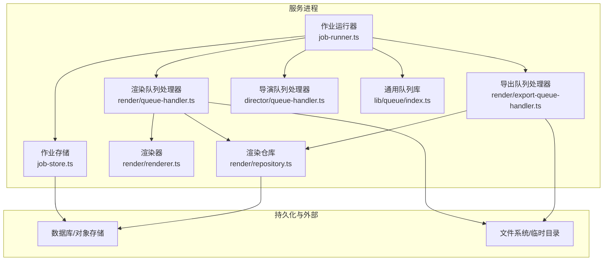
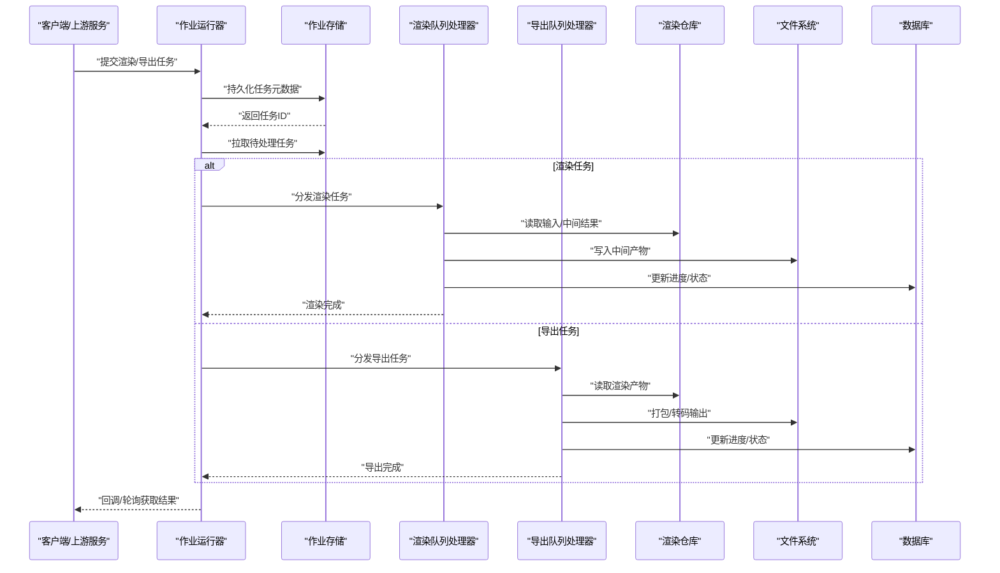
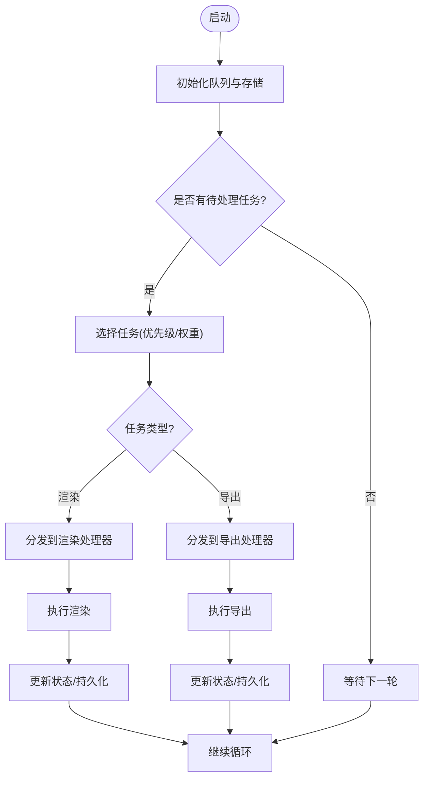
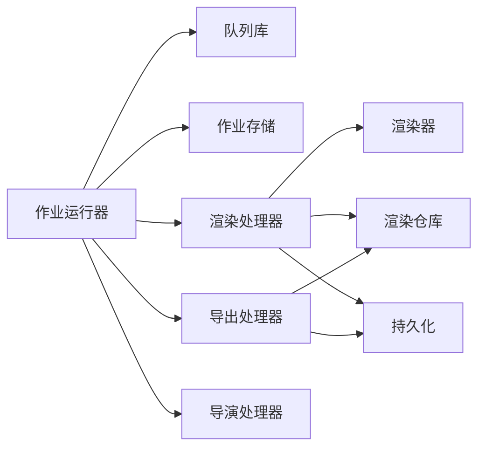

# 渲染队列管理

<cite>
**本文引用的文件**   
- [server/src/server/job-runner.ts](file://server/src/server/job-runner.ts)
- [server/src/server/job-store.ts](file://server/src/server/job-store.ts)
- [src/features/render/queue-handler.ts](file://src/features/render/queue-handler.ts)
- [src/features/render/export-queue-handler.ts](file://src/features/render/export-queue-handler.ts)
- [src/features/render/admission.ts](file://src/features/render/admission.ts)
- [src/features/render/persistence.ts](file://src/features/render/persistence.ts)
- [src/features/render/renderer.ts](file://src/features/render/renderer.ts)
- [src/features/render/repository.ts](file://src/features/render/repository.ts)
- [src/features/director/queue-handler.ts](file://src/features/director/queue-handler.ts)
- [src/lib/queue/index.ts](file://src/lib/queue/index.ts)
- [deploy/compose.yaml](file://deploy/compose.yaml)
- [deploy/env.example](file://deploy/env.example)
- [deploy/worker.env.example](file://deploy/worker.env.example)
- [docs/designs/ISSUE-004-queue-concurrency-lanes.md](file://docs/designs/ISSUE-004-queue-concurrency-lanes.md)
</cite>

## 目录
1. [简介](#简介)
2. [项目结构](#项目结构)
3. [核心组件](#核心组件)
4. [架构总览](#架构总览)
5. [详细组件分析](#详细组件分析)
6. [依赖关系分析](#依赖关系分析)
7. [性能考量](#性能考量)
8. [故障排查指南](#故障排查指南)
9. [结论](#结论)
10. [附录](#附录)

## 简介
本技术文档聚焦 PurpleInK 平台的渲染队列管理系统，围绕任务调度算法、优先级管理、负载均衡与并发控制机制展开。文档同时覆盖队列持久化、任务状态跟踪、重试策略与失败补偿、任务准入控制、资源限制、内存管理与磁盘空间监控，并提供配置示例以优化吞吐量和应对高负载场景。最后给出监控指标、日志记录与故障诊断工具建议，帮助运维与研发高效定位问题并提升系统稳定性。

## 项目结构
渲染队列相关代码主要分布在以下模块：
- 服务端作业执行器与存储：job-runner.ts、job-store.ts
- 渲染队列处理器与导出队列处理器：queue-handler.ts、export-queue-handler.ts
- 渲染器与仓库：renderer.ts、repository.ts
- 准入控制与持久化：admission.ts、persistence.ts
- 导演（Director）队列处理器：director/queue-handler.ts
- 通用队列库：lib/queue/index.ts
- 部署与环境变量：compose.yaml、env.example、worker.env.example
- 设计文档：ISSUE-004-queue-concurrency-lanes.md

图表来源 
- [server/src/server/job-runner.ts](file://server/src/server/job-runner.ts)
- [server/src/server/job-store.ts](file://server/src/server/job-store.ts)
- [src/features/render/queue-handler.ts](file://src/features/render/queue-handler.ts)
- [src/features/render/export-queue-handler.ts](file://src/features/render/export-queue-handler.ts)
- [src/features/render/renderer.ts](file://src/features/render/renderer.ts)
- [src/features/render/repository.ts](file://src/features/render/repository.ts)
- [src/features/director/queue-handler.ts](file://src/features/director/queue-handler.ts)
- [src/lib/queue/index.ts](file://src/lib/queue/index.ts)

章节来源
- [server/src/server/job-runner.ts](file://server/src/server/job-runner.ts)
- [server/src/server/job-store.ts](file://server/src/server/job-store.ts)
- [src/features/render/queue-handler.ts](file://src/features/render/queue-handler.ts)
- [src/features/render/export-queue-handler.ts](file://src/features/render/export-queue-handler.ts)
- [src/features/render/renderer.ts](file://src/features/render/renderer.ts)
- [src/features/render/repository.ts](file://src/features/render/repository.ts)
- [src/features/director/queue-handler.ts](file://src/features/director/queue-handler.ts)
- [src/lib/queue/index.ts](file://src/lib/queue/index.ts)

## 核心组件
- 作业运行器（Job Runner）：负责拉取待处理任务、分发给具体处理器，协调生命周期与错误恢复。
- 作业存储（Job Store）：提供任务的持久化、状态更新与查询能力。
- 渲染队列处理器（Render Queue Handler）：实现渲染任务的消费逻辑，包括帧捕获、编码、合成等。
- 导出队列处理器（Export Queue Handler）：处理导出类任务，如打包、转码、归档。
- 渲染器（Renderer）：封装渲染执行细节，调用底层引擎或浏览器驱动完成画面生成。
- 渲染仓库（Repository）：统一访问渲染产物与中间结果，保证一致性。
- 准入控制（Admission）：基于资源与配额进行任务准入判断，防止过载。
- 持久化（Persistence）：确保任务状态、进度与中间结果的可靠落盘。
- 通用队列库（Queue Library）：提供队列抽象、优先级、并发控制与重试策略。
- 导演队列处理器（Director Queue Handler）：编排导演流程中的子任务，协同渲染与导出。

章节来源
- [server/src/server/job-runner.ts](file://server/src/server/job-runner.ts)
- [server/src/server/job-store.ts](file://server/src/server/job-store.ts)
- [src/features/render/queue-handler.ts](file://src/features/render/queue-handler.ts)
- [src/features/render/export-queue-handler.ts](file://src/features/render/export-queue-handler.ts)
- [src/features/render/renderer.ts](file://src/features/render/renderer.ts)
- [src/features/render/repository.ts](file://src/features/render/repository.ts)
- [src/features/render/admission.ts](file://src/features/render/admission.ts)
- [src/features/render/persistence.ts](file://src/features/render/persistence.ts)
- [src/lib/queue/index.ts](file://src/lib/queue/index.ts)
- [src/features/director/queue-handler.ts](file://src/features/director/queue-handler.ts)

## 架构总览
渲染队列采用“作业运行器 + 多处理器”的解耦架构。作业运行器从队列中拉取任务，依据任务类型路由到对应处理器；处理器在执行过程中通过仓库与持久化层读写数据，并通过准入控制与资源限制保障系统稳定。

图表来源 
- [server/src/server/job-runner.ts](file://server/src/server/job-runner.ts)
- [server/src/server/job-store.ts](file://server/src/server/job-store.ts)
- [src/features/render/queue-handler.ts](file://src/features/render/queue-handler.ts)
- [src/features/render/export-queue-handler.ts](file://src/features/render/export-queue-handler.ts)
- [src/features/render/repository.ts](file://src/features/render/repository.ts)

## 详细组件分析

### 作业运行器（Job Runner）
- 职责：周期性拉取任务、按类型路由至处理器、维护任务生命周期、处理异常与重试。
- 并发控制：通过队列库提供的并发上限与通道限流，避免处理器过载。
- 错误恢复：对可重试错误进行指数退避重试，不可重试错误进入死信队列或告警。

图表来源 
- [server/src/server/job-runner.ts](file://server/src/server/job-runner.ts)
- [src/lib/queue/index.ts](file://src/lib/queue/index.ts)

章节来源
- [server/src/server/job-runner.ts](file://server/src/server/job-runner.ts)
- [src/lib/queue/index.ts](file://src/lib/queue/index.ts)

### 作业存储（Job Store）
- 职责：任务元数据的增删改查、状态机推进、事务性更新。
- 持久化策略：使用数据库作为主存储，结合本地缓存提高读性能。
- 一致性：通过乐观锁或版本号避免并发写冲突。

章节来源
- [server/src/server/job-store.ts](file://server/src/server/job-store.ts)

### 渲染队列处理器（Render Queue Handler）
- 职责：消费渲染任务，协调帧捕获、编码、合成步骤，更新进度与产物。
- 资源限制：根据任务规格动态分配内存与CPU配额，防止单任务占用过多资源。
- 重试策略：对网络抖动或临时I/O错误进行有限次重试，失败后降级或回滚。

章节来源
- [src/features/render/queue-handler.ts](file://src/features/render/queue-handler.ts)

### 导出队列处理器（Export Queue Handler）
- 职责：消费导出任务，聚合渲染产物，执行转码、打包、归档。
- 磁盘监控：在导出前检查可用空间，不足时触发扩容或排队等待。
- 失败补偿：导出中断后支持断点续传与增量重导。

章节来源
- [src/features/render/export-queue-handler.ts](file://src/features/render/export-queue-handler.ts)

### 渲染器（Renderer）
- 职责：封装渲染执行细节，调用浏览器驱动或渲染引擎，产出帧序列与媒体文件。
- 内存管理：控制渲染上下文生命周期，及时释放大对象与句柄。
- 可观测性：输出关键指标（耗时、帧率、内存峰值）供监控采集。

章节来源
- [src/features/render/renderer.ts](file://src/features/render/renderer.ts)

### 渲染仓库（Repository）
- 职责：统一访问渲染产物与中间结果，提供版本化与校验能力。
- 一致性：读写操作具备幂等性与原子性，避免部分成功导致的数据不一致。

章节来源
- [src/features/render/repository.ts](file://src/features/render/repository.ts)

### 准入控制（Admission）
- 职责：基于当前系统负载、资源水位与任务优先级决定是否接纳新任务。
- 策略：加权公平队列（WFQ）与令牌桶结合，保障高优先级任务优先执行。
- 自适应：根据历史吞吐与延迟动态调整阈值，平滑突发流量。

章节来源
- [src/features/render/admission.ts](file://src/features/render/admission.ts)

### 持久化（Persistence）
- 职责：任务状态、进度与中间结果的可靠落盘，支持崩溃恢复。
- 策略：先写日志再更新状态，确保顺序一致；定期快照减少恢复时间。

章节来源
- [src/features/render/persistence.ts](file://src/features/render/persistence.ts)

### 通用队列库（Queue Library）
- 职责：提供队列抽象、优先级、并发控制、重试与背压。
- 扩展点：支持插件式处理器注册与拦截器链。

章节来源
- [src/lib/queue/index.ts](file://src/lib/queue/index.ts)

### 导演队列处理器（Director Queue Handler）
- 职责：编排导演流程中的子任务，协调渲染与导出阶段，保证阶段间数据流转正确。
- 状态机：严格推进阶段状态，失败时回滚或补偿。

章节来源
- [src/features/director/queue-handler.ts](file://src/features/director/queue-handler.ts)

## 依赖关系分析
- 低耦合：作业运行器仅依赖队列库与作业存储，处理器之间无直接依赖。
- 明确边界：处理器通过仓库与持久化层交互，避免跨层调用。
- 可扩展：新增任务类型只需注册处理器并实现接口。

图表来源 
- [server/src/server/job-runner.ts](file://server/src/server/job-runner.ts)
- [src/lib/queue/index.ts](file://src/lib/queue/index.ts)
- [server/src/server/job-store.ts](file://server/src/server/job-store.ts)
- [src/features/render/queue-handler.ts](file://src/features/render/queue-handler.ts)
- [src/features/render/export-queue-handler.ts](file://src/features/render/export-queue-handler.ts)
- [src/features/render/renderer.ts](file://src/features/render/renderer.ts)
- [src/features/render/repository.ts](file://src/features/render/repository.ts)
- [src/features/render/persistence.ts](file://src/features/render/persistence.ts)

章节来源
- [server/src/server/job-runner.ts](file://server/src/server/job-runner.ts)
- [src/lib/queue/index.ts](file://src/lib/queue/index.ts)
- [server/src/server/job-store.ts](file://server/src/server/job-store.ts)
- [src/features/render/queue-handler.ts](file://src/features/render/queue-handler.ts)
- [src/features/render/export-queue-handler.ts](file://src/features/render/export-queue-handler.ts)
- [src/features/render/renderer.ts](file://src/features/render/renderer.ts)
- [src/features/render/repository.ts](file://src/features/render/repository.ts)
- [src/features/render/persistence.ts](file://src/features/render/persistence.ts)

## 性能考量
- 并发控制：合理设置队列并发上限与处理器线程数，避免上下文切换开销过大。
- 优先级调度：为高价值任务配置更高权重，缩短关键路径延迟。
- 背压与限流：在导入/导出阶段启用令牌桶，防止下游存储拥塞。
- 内存管理：限制单次渲染最大内存，及时回收大对象，避免GC抖动。
- I/O优化：批量写入与异步I/O结合，减少磁盘瓶颈。
- 缓存命中：对重复渲染请求利用缓存降低计算压力。

[本节为通用指导，不直接分析具体文件]

## 故障排查指南
- 常见问题
  - 任务堆积：检查队列拉取频率、处理器并发与资源水位。
  - 频繁重试：查看错误类型是否为可重试，调整退避策略。
  - 内存溢出：监控内存峰值，调小渲染分辨率或批大小。
  - 磁盘不足：导出前检查可用空间，配置自动清理策略。
- 诊断工具
  - 指标采集：暴露队列长度、处理延迟、错误率、内存/CPU使用率。
  - 日志追踪：为每个任务生成唯一追踪ID，串联各阶段日志。
  - 健康检查：处理器心跳与存活探针，快速发现异常节点。
- 恢复策略
  - 断点续传：导出任务支持从中断点继续。
  - 死信队列：不可重试任务进入死信队列人工干预。
  - 快照恢复：定期快照减少崩溃恢复时间。

章节来源
- [src/features/render/admission.ts](file://src/features/render/admission.ts)
- [src/features/render/persistence.ts](file://src/features/render/persistence.ts)
- [src/features/render/export-queue-handler.ts](file://src/features/render/export-queue-handler.ts)

## 结论
PurpleInK 渲染队列管理系统通过清晰的职责划分与解耦架构，实现了高吞吐、低延迟与强一致的渲染任务处理。借助准入控制、优先级调度、并发限制与持久化保障，系统在复杂负载下仍能保持稳定。配合完善的监控与诊断手段，可有效提升运维效率与用户体验。

[本节为总结性内容，不直接分析具体文件]

## 附录

### 配置示例与参数调优
- 并发与队列
  - 设置队列最大并发数与处理器线程池大小，平衡吞吐与资源占用。
  - 配置优先级权重与公平调度策略，保障关键任务优先。
- 资源限制
  - 限制单任务最大内存与CPU份额，防止资源争用。
  - 设置磁盘阈值，低于阈值时暂停导入或触发扩容。
- 重试与超时
  - 配置重试次数与退避间隔，区分可重试与不可重试错误。
  - 设置任务超时与心跳检测，及时释放卡住的任务。
- 监控与日志
  - 暴露Prometheus指标端点，采集队列长度、延迟分布、错误率。
  - 结构化日志包含任务ID、阶段、耗时与错误堆栈。

章节来源
- [deploy/compose.yaml](file://deploy/compose.yaml)
- [deploy/env.example](file://deploy/env.example)
- [deploy/worker.env.example](file://deploy/worker.env.example)

### 并发车道设计参考
- 设计要点
  - 将不同任务类型划分到独立车道，避免相互干扰。
  - 为高优先级车道预留容量，保障SLA。
- 实施建议
  - 使用多队列或多通道实现隔离。
  - 动态调整车道容量，响应负载变化。

章节来源
- [docs/designs/ISSUE-004-queue-concurrency-lanes.md](file://docs/designs/ISSUE-004-queue-concurrency-lanes.md)