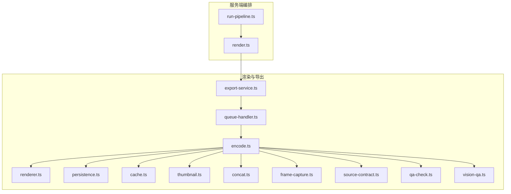
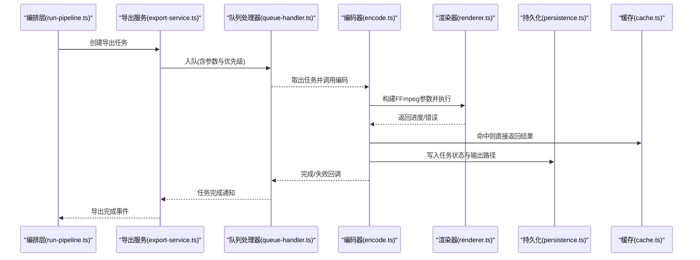
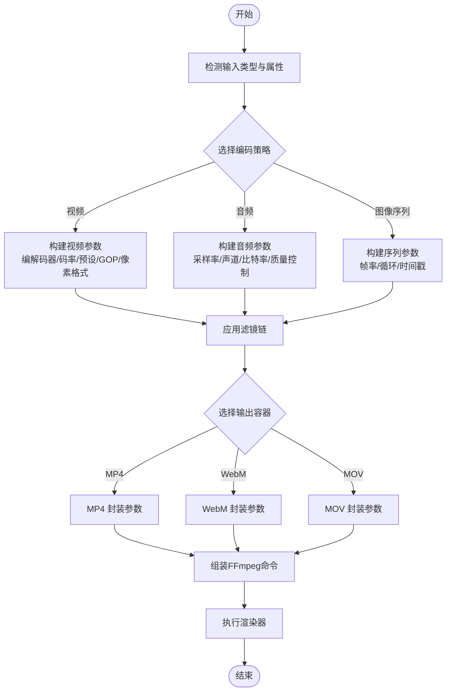
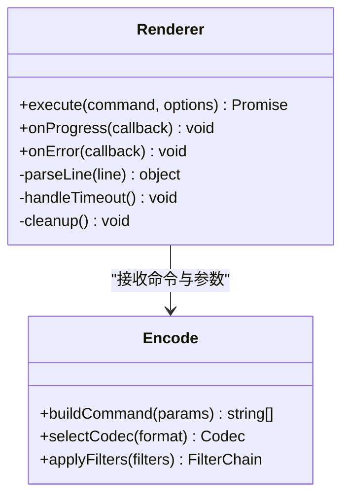
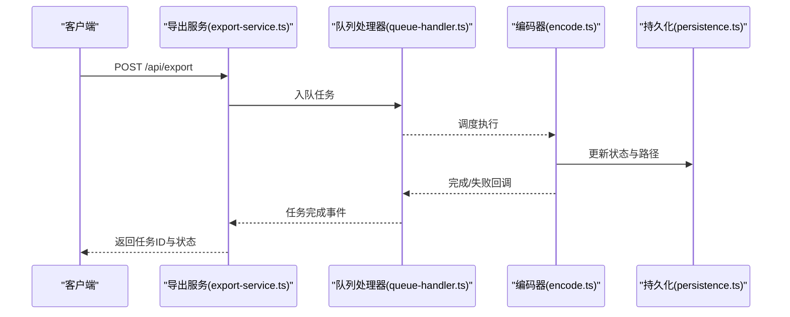
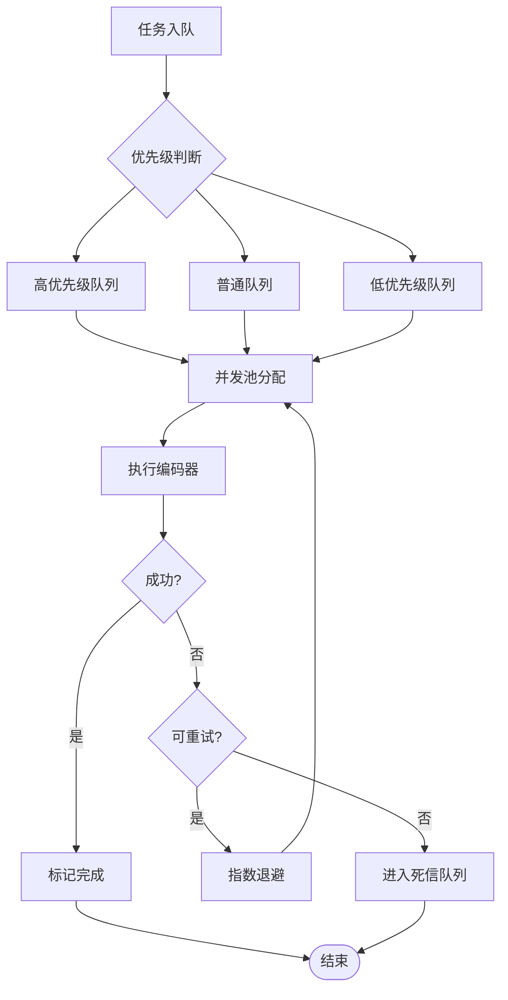
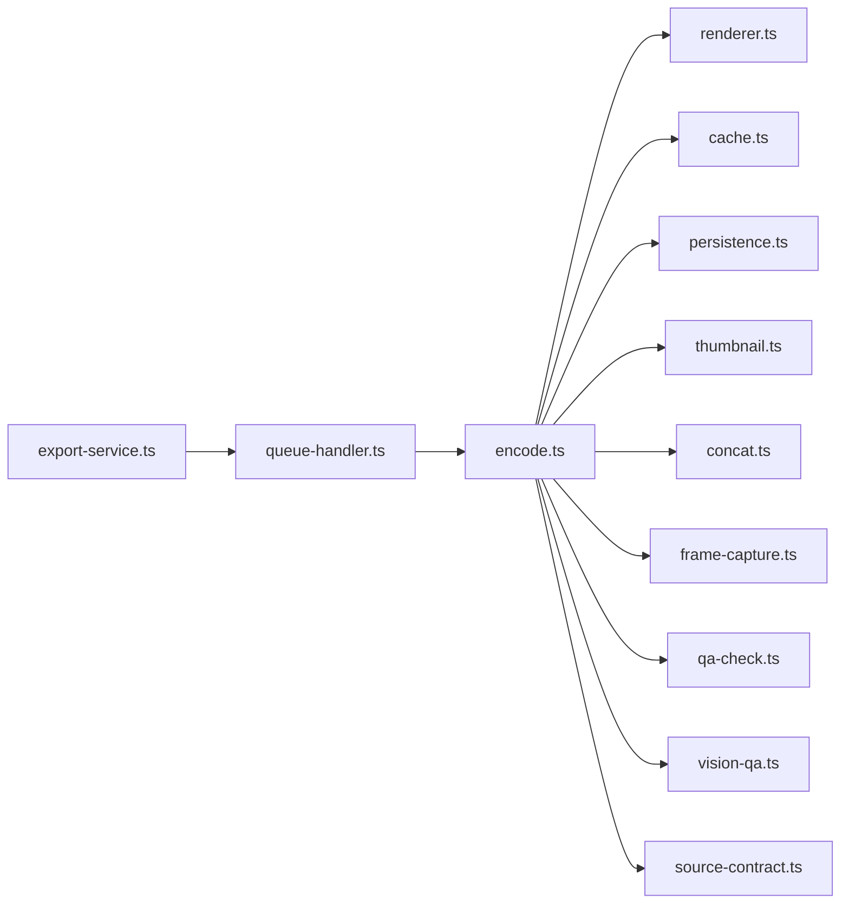

# FFmpeg 集成与配置

<cite>
**本文引用的文件**   
- [server/src/compose/run-pipeline.ts](file://server/src/compose/run-pipeline.ts)
- [server/src/compose/render.ts](file://server/src/compose/render.ts)
- [src/features/render/encode.ts](file://src/features/render/encode.ts)
- [src/features/render/renderer.ts](file://src/features/render/renderer.ts)
- [src/features/render/export-service.ts](file://src/features/render/export-service.ts)
- [src/features/render/queue-handler.ts](file://src/features/render/queue-handler.ts)
- [src/features/render/types.ts](file://src/features/render/types.ts)
- [src/features/render/persistence.ts](file://src/features/render/persistence.ts)
- [src/features/render/cache.ts](file://src/features/render/cache.ts)
- [src/features/render/thumbnail.ts](file://src/features/render/thumbnail.ts)
- [src/features/render/concat.ts](file://src/features/render/concat.ts)
- [src/features/render/frame-capture.ts](file://src/features/render/frame-capture.ts)
- [src/features/render/source-contract.ts](file://src/features/render/source-contract.ts)
- [src/features/render/qa-check.ts](file://src/features/render/qa-check.ts)
- [src/features/render/vision-qa.ts](file://src/features/render/vision-qa.ts)
- [src/lib/logger.ts](file://src/lib/logger.ts)
- [deploy/env.example](file://deploy/env.example)
- [deploy/worker.env.example](file://deploy/worker.env.example)
</cite>

## 目录
1. [简介](#简介)
2. [项目结构](#项目结构)
3. [核心组件](#核心组件)
4. [架构总览](#架构总览)
5. [详细组件分析](#详细组件分析)
6. [依赖关系分析](#依赖关系分析)
7. [性能考量](#性能考量)
8. [故障排查指南](#故障排查指南)
9. [结论](#结论)
10. [附录](#附录)

## 简介
本技术文档聚焦 PurpleInK 平台的 FFmpeg 集成系统，围绕以下目标展开：
- FFmpeg 命令行参数构建、编码器配置与媒体处理管道设置
- 不同视频格式（MP4、WebM、MOV 等）的编码参数、质量预设与压缩选项
- 音频编解码器配置、采样率转换与声道处理
- 自定义编码器设置、批量处理与并行编码的配置示例
- 错误处理、日志记录与性能监控方法

说明：本文基于仓库中的渲染与导出模块进行分析，重点覆盖 encode.ts、renderer.ts、export-service.ts、queue-handler.ts、persistence.ts、cache.ts、thumbnail.ts、concat.ts、frame-capture.ts、source-contract.ts、qa-check.ts、vision-qa.ts 等关键实现。

## 项目结构
与 FFmpeg 集成相关的代码主要分布在 server 层（编排与调度）与 src/features/render（渲染与导出）两个区域：
- server/src/compose 下的 run-pipeline.ts、render.ts 负责流水线编排与渲染任务触发
- src/features/render 下包含编码、队列、持久化、缓存、缩略图、拼接、帧捕获、源契约、QA 检查等能力

图表来源 
- [server/src/compose/run-pipeline.ts](file://server/src/compose/run-pipeline.ts)
- [server/src/compose/render.ts](file://server/src/compose/render.ts)
- [src/features/render/export-service.ts](file://src/features/render/export-service.ts)
- [src/features/render/queue-handler.ts](file://src/features/render/queue-handler.ts)
- [src/features/render/encode.ts](file://src/features/render/encode.ts)
- [src/features/render/renderer.ts](file://src/features/render/renderer.ts)
- [src/features/render/persistence.ts](file://src/features/render/persistence.ts)
- [src/features/render/cache.ts](file://src/features/render/cache.ts)
- [src/features/render/thumbnail.ts](file://src/features/render/thumbnail.ts)
- [src/features/render/concat.ts](file://src/features/render/concat.ts)
- [src/features/render/frame-capture.ts](file://src/features/render/frame-capture.ts)
- [src/features/render/source-contract.ts](file://src/features/render/source-contract.ts)
- [src/features/render/qa-check.ts](file://src/features/render/qa-check.ts)
- [src/features/render/vision-qa.ts](file://src/features/render/vision-qa.ts)

章节来源
- [server/src/compose/run-pipeline.ts](file://server/src/compose/run-pipeline.ts)
- [server/src/compose/render.ts](file://server/src/compose/render.ts)
- [src/features/render/export-service.ts](file://src/features/render/export-service.ts)
- [src/features/render/queue-handler.ts](file://src/features/render/queue-handler.ts)
- [src/features/render/encode.ts](file://src/features/render/encode.ts)
- [src/features/render/renderer.ts](file://src/features/render/renderer.ts)

## 核心组件
- 编码器（encode.ts）：负责根据输入类型与目标格式生成 FFmpeg 命令参数，管理视频/音频编解码器、码率、预设、滤镜链、输出容器等
- 渲染器（renderer.ts）：封装 FFmpeg 执行流程，包括进程启动、流式读取、进度回调、超时控制与错误传播
- 导出服务（export-service.ts）：对外暴露导出接口，协调队列、并发、重试、状态更新与结果落盘
- 队列处理器（queue-handler.ts）：消费导出任务，按并发限制调度编码器执行，支持优先级与失败重试
- 持久化（persistence.ts）：保存任务元数据、中间产物路径、最终输出路径与状态
- 缓存（cache.ts）：对相同输入与参数的编码结果进行去重，提升重复导出效率
- 缩略图（thumbnail.ts）：从视频或帧序列中抽取缩略图，复用 FFmpeg 能力
- 拼接（concat.ts）：将多段媒体按顺序合并，处理时间戳与编解码一致性
- 帧捕获（frame-capture.ts）：按时间点或间隔提取关键帧，用于预览或 QA
- 源契约（source-contract.ts）：统一输入源的抽象，适配本地文件、URL、内存流等
- QA 检查（qa-check.ts、vision-qa.ts）：对输出进行基础校验与视觉质量检测

章节来源
- [src/features/render/encode.ts](file://src/features/render/encode.ts)
- [src/features/render/renderer.ts](file://src/features/render/renderer.ts)
- [src/features/render/export-service.ts](file://src/features/render/export-service.ts)
- [src/features/render/queue-handler.ts](file://src/features/render/queue-handler.ts)
- [src/features/render/persistence.ts](file://src/features/render/persistence.ts)
- [src/features/render/cache.ts](file://src/features/render/cache.ts)
- [src/features/render/thumbnail.ts](file://src/features/render/thumbnail.ts)
- [src/features/render/concat.ts](file://src/features/render/concat.ts)
- [src/features/render/frame-capture.ts](file://src/features/render/frame-capture.ts)
- [src/features/render/source-contract.ts](file://src/features/render/source-contract.ts)
- [src/features/render/qa-check.ts](file://src/features/render/qa-check.ts)
- [src/features/render/vision-qa.ts](file://src/features/render/vision-qa.ts)

## 架构总览
整体采用“编排—导出—队列—编码—后处理”的分层架构：
- 编排层（run-pipeline.ts、render.ts）负责任务创建与阶段推进
- 导出服务（export-service.ts）提供统一的导出入口，管理并发与重试
- 队列处理器（queue-handler.ts）解耦生产与消费，保障稳定性
- 编码器（encode.ts）集中管理 FFmpeg 参数构建与编码器策略
- 渲染器（renderer.ts）执行 FFmpeg 并收集进度与错误
- 辅助模块（persistence、cache、thumbnail、concat、frame-capture、source-contract、qa-check、vision-qa）提供支撑能力

图表来源 
- [server/src/compose/run-pipeline.ts](file://server/src/compose/run-pipeline.ts)
- [server/src/compose/render.ts](file://server/src/compose/render.ts)
- [src/features/render/export-service.ts](file://src/features/render/export-service.ts)
- [src/features/render/queue-handler.ts](file://src/features/render/queue-handler.ts)
- [src/features/render/encode.ts](file://src/features/render/encode.ts)
- [src/features/render/renderer.ts](file://src/features/render/renderer.ts)
- [src/features/render/persistence.ts](file://src/features/render/persistence.ts)
- [src/features/render/cache.ts](file://src/features/render/cache.ts)

## 详细组件分析

### 编码器（encode.ts）
职责与要点：
- 根据输入类型（视频、音频、图像序列）与目标格式（MP4、WebM、MOV 等）选择编码器与参数集
- 视频编码：H.264/H.265/VP9/AV1，码率模式（CBR/VBR/CRF），预设（ultrafast 到 veryslow），GOP、B帧、参考帧、像素格式、色彩空间
- 音频编码：AAC/Opus/FLAC，采样率转换（如 48kHz→44.1kHz）、声道数（立体声/单声道）、比特率与质量控制
- 滤镜链：缩放、裁剪、旋转、去隔行、降噪、色彩校正、字幕叠加、水印
- 输出容器：MP4（H.264+AAC）、WebM（VP9/AV1+Opus）、MOV（ProRes/H.264+AAC）
- 进度与诊断：解析 FFmpeg 输出，统计帧率、时长、码率、丢帧、错误码

图表来源 
- [src/features/render/encode.ts](file://src/features/render/encode.ts)
- [src/features/render/renderer.ts](file://src/features/render/renderer.ts)

章节来源
- [src/features/render/encode.ts](file://src/features/render/encode.ts)
- [src/features/render/renderer.ts](file://src/features/render/renderer.ts)

### 渲染器（renderer.ts）
职责与要点：
- 启动 FFmpeg 子进程，传递标准输入/输出/错误流
- 实时解析输出行，提取进度百分比、当前帧、码率、耗时
- 支持超时、信号中断、优雅退出
- 错误分类：参数错误、设备不可用、权限不足、磁盘空间不足、网络超时等

图表来源 
- [src/features/render/renderer.ts](file://src/features/render/renderer.ts)
- [src/features/render/encode.ts](file://src/features/render/encode.ts)

章节来源
- [src/features/render/renderer.ts](file://src/features/render/renderer.ts)

### 导出服务（export-service.ts）
职责与要点：
- 对外 API：创建导出任务、查询状态、取消任务、下载结果
- 并发控制：限制同时运行的编码任务数量，避免资源争用
- 重试机制：针对可恢复错误进行指数退避重试
- 状态机：pending → running → completed/failed/cancelled

图表来源 
- [src/features/render/export-service.ts](file://src/features/render/export-service.ts)
- [src/features/render/queue-handler.ts](file://src/features/render/queue-handler.ts)
- [src/features/render/encode.ts](file://src/features/render/encode.ts)
- [src/features/render/persistence.ts](file://src/features/render/persistence.ts)

章节来源
- [src/features/render/export-service.ts](file://src/features/render/export-service.ts)
- [src/features/render/queue-handler.ts](file://src/features/render/queue-handler.ts)

### 队列处理器（queue-handler.ts）
职责与要点：
- 任务优先级与公平调度
- 并发池管理，动态扩缩容
- 失败重试与死信队列
- 健康检查与背压

图表来源 
- [src/features/render/queue-handler.ts](file://src/features/render/queue-handler.ts)

章节来源
- [src/features/render/queue-handler.ts](file://src/features/render/queue-handler.ts)

### 其他辅助模块
- 持久化（persistence.ts）：任务元数据、中间产物、输出路径、状态变更审计
- 缓存（cache.ts）：基于输入哈希与参数指纹的去重，减少重复编码
- 缩略图（thumbnail.ts）：从首帧或指定时间点抽取缩略图，支持尺寸与格式定制
- 拼接（concat.ts）：多段媒体合并，确保编解码一致性与时间戳连续
- 帧捕获（frame-capture.ts）：按时间或间隔提取帧，用于预览与 QA
- 源契约（source-contract.ts）：统一输入源抽象，支持本地、HTTP、S3、内存流
- QA 检查（qa-check.ts、vision-qa.ts）：基础指标（时长、分辨率、码率）与视觉质量（PSNR/SSIM）

章节来源
- [src/features/render/persistence.ts](file://src/features/render/persistence.ts)
- [src/features/render/cache.ts](file://src/features/render/cache.ts)
- [src/features/render/thumbnail.ts](file://src/features/render/thumbnail.ts)
- [src/features/render/concat.ts](file://src/features/render/concat.ts)
- [src/features/render/frame-capture.ts](file://src/features/render/frame-capture.ts)
- [src/features/render/source-contract.ts](file://src/features/render/source-contract.ts)
- [src/features/render/qa-check.ts](file://src/features/render/qa-check.ts)
- [src/features/render/vision-qa.ts](file://src/features/render/vision-qa.ts)

## 依赖关系分析
- 编码器依赖渲染器执行 FFmpeg；导出服务依赖队列处理器进行调度；队列处理器依赖编码器与持久化
- 缓存与持久化贯穿整个生命周期，保证幂等与可追溯
- QA 检查在输出完成后进行，确保质量基线

图表来源 
- [src/features/render/export-service.ts](file://src/features/render/export-service.ts)
- [src/features/render/queue-handler.ts](file://src/features/render/queue-handler.ts)
- [src/features/render/encode.ts](file://src/features/render/encode.ts)
- [src/features/render/renderer.ts](file://src/features/render/renderer.ts)
- [src/features/render/cache.ts](file://src/features/render/cache.ts)
- [src/features/render/persistence.ts](file://src/features/render/persistence.ts)
- [src/features/render/thumbnail.ts](file://src/features/render/thumbnail.ts)
- [src/features/render/concat.ts](file://src/features/render/concat.ts)
- [src/features/render/frame-capture.ts](file://src/features/render/frame-capture.ts)
- [src/features/render/qa-check.ts](file://src/features/render/qa-check.ts)
- [src/features/render/vision-qa.ts](file://src/features/render/vision-qa.ts)
- [src/features/render/source-contract.ts](file://src/features/render/source-contract.ts)

章节来源
- [src/features/render/export-service.ts](file://src/features/render/export-service.ts)
- [src/features/render/queue-handler.ts](file://src/features/render/queue-handler.ts)
- [src/features/render/encode.ts](file://src/features/render/encode.ts)
- [src/features/render/renderer.ts](file://src/features/render/renderer.ts)

## 性能考量
- 编码器参数优化
  - 使用合适的预设（如 medium/fast）平衡质量与速度
  - 合理设置 CRF/CQP 与目标码率，避免过高导致体积膨胀
  - 启用硬件加速（如 NVENC、QSV、VAAPI）以提升吞吐
- 并发与资源
  - 根据 CPU/GPU 核数调整并发上限，避免上下文切换开销
  - 使用队列优先级与背压控制，防止雪崩
- I/O 与缓存
  - 利用缓存命中减少重复编码
  - 使用高速存储（NVMe）存放中间产物与输出
- 监控与诊断
  - 采集 FFmpeg 输出中的关键指标（帧率、码率、丢帧、耗时）
  - 记录错误码与堆栈，便于定位问题

[本节为通用指导，不直接分析具体文件]

## 故障排查指南
常见问题与处理方法：
- 参数错误：检查输入分辨率、像素格式、色彩空间是否兼容；确认容器支持的编解码器
- 设备不可用：验证硬件加速驱动与权限；回退到软件编码
- 权限与路径：确保输出目录可写；检查磁盘空间与配额
- 网络超时：对远程输入增加重试与超时策略；使用本地缓存
- 内存不足：降低并发、减小分辨率或码率；启用分块处理

日志与监控建议：
- 使用结构化日志记录任务 ID、输入摘要、参数指纹、进度与错误
- 采集关键指标（CPU、内存、I/O、GPU 利用率）
- 定期巡检失败任务，建立告警阈值

章节来源
- [src/lib/logger.ts](file://src/lib/logger.ts)

## 结论
PurpleInK 的 FFmpeg 集成通过清晰的模块化设计，实现了灵活的编码器配置、稳定的队列调度与完善的后处理能力。建议在部署时结合硬件能力与业务需求，选择合适的编码策略与并发模型，并通过缓存与监控提升整体效率与可观测性。

[本节为总结，不直接分析具体文件]

## 附录

### 环境变量与部署配置
- deploy/env.example：服务器运行所需的环境变量（数据库、存储、队列等）
- deploy/worker.env.example：工作进程相关配置（并发、超时、重试策略）

章节来源
- [deploy/env.example](file://deploy/env.example)
- [deploy/worker.env.example](file://deploy/worker.env.example)

### 配置示例（概念性）
- 自定义编码器设置
  - 视频：选择 H.264，CRF 23，preset fast，GOP 250，pix_fmt yuv420p，colorspace bt709
  - 音频：AAC，48kHz，立体声，128kbps
  - 滤镜：scale=1920:1080，format=yuv420p，subtitles=srt 文件
- 批量处理
  - 使用队列优先级区分紧急任务；设置最大并发为 CPU 核数×2
  - 失败任务自动重试 3 次，指数退避
- 并行编码
  - 按项目维度拆分队列，避免跨项目竞争
  - 使用缓存键包含输入哈希与参数指纹，提高命中率

[本节为概念性内容，不直接分析具体文件]