# 帧序列处理

<cite>
**本文引用的文件**   
- [frame-capture.ts](file://src/features/render/frame-capture.ts)
- [frame-sequence.ts](file://src/features/render/frame-sequence.ts)
- [encode.ts](file://src/features/render/encode.ts)
- [concat.ts](file://src/features/render/concat.ts)
- [thumbnail.ts](file://src/features/render/thumbnail.ts)
- [renderer.ts](file://src/features/render/renderer.ts)
- [render-shot-repository.ts](file://src/features/render/render-shot-repository.ts)
- [persistence.ts](file://src/features/render/persistence.ts)
- [export-service.ts](file://src/features/render/export-service.ts)
- [queue-handler.ts](file://src/features/render/queue-handler.ts)
- [admission.ts](file://src/features/render/admission.ts)
- [qa-check.ts](file://src/features/render/qa-check.ts)
- [vision-qa.ts](file://src/features/render/vision-qa.ts)
- [types.ts](file://src/features/render/types.ts)
- [source-contract.ts](file://src/features/render/source-contract.ts)
- [cache.ts](file://src/features/render/cache.ts)
- [shot-player.tsx](file://src/app/products/(app)/canvas/[projectId]/shot-player.tsx)
- [export-view-model.ts](file://src/app/products/(app)/export/[projectId]/export-view-model.ts)
</cite>

## 目录
1. [简介](#简介)
2. [项目结构](#项目结构)
3. [核心组件](#核心组件)
4. [架构总览](#架构总览)
5. [详细组件分析](#详细组件分析)
6. [依赖关系分析](#依赖关系分析)
7. [性能考量](#性能考量)
8. [故障排查指南](#故障排查指南)
9. [结论](#结论)
10. [附录](#附录)

## 简介
本技术文档聚焦 PurpleInK 平台的帧序列处理系统，围绕视频帧的提取、处理与合成流程展开。内容涵盖：
- 帧捕获机制、时间戳管理与帧率控制
- 帧缓冲策略、内存优化与磁盘 I/O 优化
- 高分辨率视频处理、实时预览与帧级编辑
- 帧质量控制、去隔行处理与色彩空间转换
- 渲染管线中的队列调度、缓存与持久化

## 项目结构
与帧序列处理相关的核心代码位于 src/features/render 目录，主要模块包括：
- 帧捕获与序列管理：frame-capture.ts、frame-sequence.ts
- 编码与拼接：encode.ts、concat.ts
- 缩略图生成：thumbnail.ts
- 渲染编排与仓库：renderer.ts、render-shot-repository.ts
- 持久化与缓存：persistence.ts、cache.ts
- 导出服务与队列：export-service.ts、queue-handler.ts
- 准入控制与质量检查：admission.ts、qa-check.ts、vision-qa.ts
- 类型与源契约：types.ts、source-contract.ts

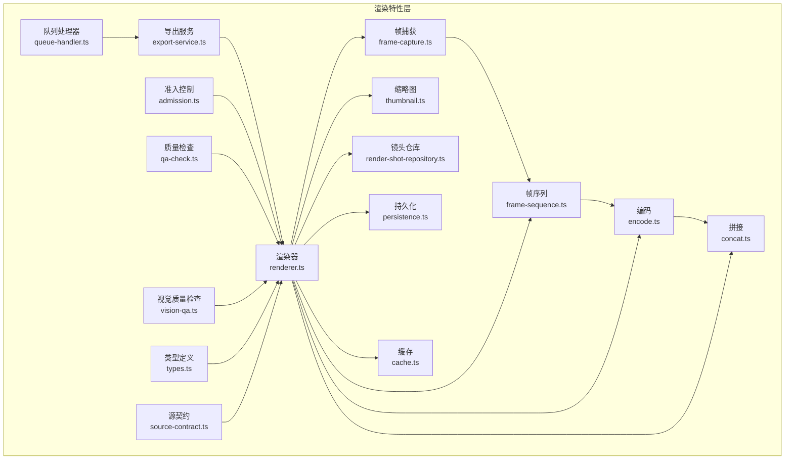

**图表来源** 
- [frame-capture.ts](file://src/features/render/frame-capture.ts)
- [frame-sequence.ts](file://src/features/render/frame-sequence.ts)
- [encode.ts](file://src/features/render/encode.ts)
- [concat.ts](file://src/features/render/concat.ts)
- [thumbnail.ts](file://src/features/render/thumbnail.ts)
- [renderer.ts](file://src/features/render/renderer.ts)
- [render-shot-repository.ts](file://src/features/render/render-shot-repository.ts)
- [persistence.ts](file://src/features/render/persistence.ts)
- [cache.ts](file://src/features/render/cache.ts)
- [export-service.ts](file://src/features/render/export-service.ts)
- [queue-handler.ts](file://src/features/render/queue-handler.ts)
- [admission.ts](file://src/features/render/admission.ts)
- [qa-check.ts](file://src/features/render/qa-check.ts)
- [vision-qa.ts](file://src/features/render/vision-qa.ts)
- [types.ts](file://src/features/render/types.ts)
- [source-contract.ts](file://src/features/render/source-contract.ts)

**章节来源**
- [frame-capture.ts](file://src/features/render/frame-capture.ts)
- [frame-sequence.ts](file://src/features/render/frame-sequence.ts)
- [encode.ts](file://src/features/render/encode.ts)
- [concat.ts](file://src/features/render/concat.ts)
- [thumbnail.ts](file://src/features/render/thumbnail.ts)
- [renderer.ts](file://src/features/render/renderer.ts)
- [render-shot-repository.ts](file://src/features/render/render-shot-repository.ts)
- [persistence.ts](file://src/features/render/persistence.ts)
- [cache.ts](file://src/features/render/cache.ts)
- [export-service.ts](file://src/features/render/export-service.ts)
- [queue-handler.ts](file://src/features/render/queue-handler.ts)
- [admission.ts](file://src/features/render/admission.ts)
- [qa-check.ts](file://src/features/render/qa-check.ts)
- [vision-qa.ts](file://src/features/render/vision-qa.ts)
- [types.ts](file://src/features/render/types.ts)
- [source-contract.ts](file://src/features/render/source-contract.ts)

## 核心组件
- 帧捕获（Frame Capture）
  - 负责从媒体源按时间戳抽取帧，支持分辨率适配、颜色空间选择与去隔行开关
  - 提供帧率控制与丢帧策略，确保稳定吞吐
- 帧序列（Frame Sequence）
  - 维护有序帧集合，支持时间轴对齐、插值与裁剪
  - 实现帧级编辑接口（插入、删除、替换），并保证时间戳一致性
- 编码（Encode）
  - 将帧序列编码为视频容器格式，支持码率控制、关键帧间隔与质量参数
- 拼接（Concat）
  - 合并多段片段，处理边界帧重复与时间戳连续性
- 缩略图（Thumbnail）
  - 基于关键帧或中间帧生成缩略图，用于预览与列表展示
- 渲染器（Renderer）
  - 编排捕获、序列、编码、拼接与质量检查等步骤，驱动整体流水线
- 镜头仓库（Render Shot Repository）
  - 存取镜头元数据与输出产物路径，协调任务状态
- 持久化（Persistence）
  - 将中间结果与最终产物落盘，支持断点续传与回滚
- 缓存（Cache）
  - 对重算代价高的中间产物进行缓存，提升重复渲染效率
- 导出服务（Export Service）
  - 对外暴露导出 API，封装渲染任务提交与进度查询
- 队列处理器（Queue Handler）
  - 管理并发度、优先级与重试策略，保障高负载下的稳定性
- 准入控制（Admission）
  - 校验输入合法性、资源配额与依赖完整性
- 质量检查（QA / Vision QA）
  - 执行帧级与视觉级质量检查，如黑场、过曝、抖动检测

**章节来源**
- [frame-capture.ts](file://src/features/render/frame-capture.ts)
- [frame-sequence.ts](file://src/features/render/frame-sequence.ts)
- [encode.ts](file://src/features/render/encode.ts)
- [concat.ts](file://src/features/render/concat.ts)
- [thumbnail.ts](file://src/features/render/thumbnail.ts)
- [renderer.ts](file://src/features/render/renderer.ts)
- [render-shot-repository.ts](file://src/features/render/render-shot-repository.ts)
- [persistence.ts](file://src/features/render/persistence.ts)
- [cache.ts](file://src/features/render/cache.ts)
- [export-service.ts](file://src/features/render/export-service.ts)
- [queue-handler.ts](file://src/features/render/queue-handler.ts)
- [admission.ts](file://src/features/render/admission.ts)
- [qa-check.ts](file://src/features/render/qa-check.ts)
- [vision-qa.ts](file://src/features/render/vision-qa.ts)

## 架构总览
渲染管线以“捕获→序列→编码→拼接→质量检查”为主线，由渲染器统一编排；导出服务通过队列处理器异步调度任务；持久化与缓存贯穿全链路，确保可恢复性与高性能。

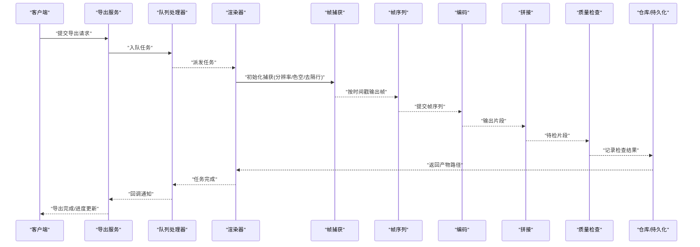

**图表来源** 
- [export-service.ts](file://src/features/render/export-service.ts)
- [queue-handler.ts](file://src/features/render/queue-handler.ts)
- [renderer.ts](file://src/features/render/renderer.ts)
- [frame-capture.ts](file://src/features/render/frame-capture.ts)
- [frame-sequence.ts](file://src/features/render/frame-sequence.ts)
- [encode.ts](file://src/features/render/encode.ts)
- [concat.ts](file://src/features/render/concat.ts)
- [qa-check.ts](file://src/features/render/qa-check.ts)
- [render-shot-repository.ts](file://src/features/render/render-shot-repository.ts)
- [persistence.ts](file://src/features/render/persistence.ts)

## 详细组件分析

### 帧捕获（Frame Capture）
- 功能要点
  - 从媒体源按目标帧率抽取帧，支持分辨率缩放与色彩空间转换
  - 可选去隔行处理，提升隔行扫描源的观感
  - 时间戳管理：保持原始时间戳或归一化为固定步长
- 关键设计
  - 流式读取，避免一次性加载大文件到内存
  - 丢帧策略：当解码延迟超过阈值时丢弃非关键帧
  - 错误恢复：网络或磁盘异常时自动重试与降级

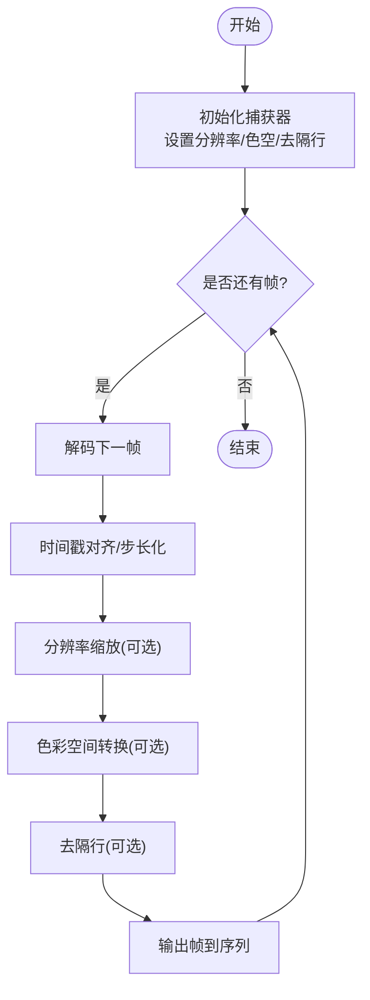

**图表来源** 
- [frame-capture.ts](file://src/features/render/frame-capture.ts)

**章节来源**
- [frame-capture.ts](file://src/features/render/frame-capture.ts)

### 帧序列（Frame Sequence）
- 功能要点
  - 维护有序帧集合，支持时间轴对齐、裁剪与插值
  - 帧级编辑：插入、删除、替换，自动修正时间戳
- 关键设计
  - 双缓冲：读写分离，减少锁竞争
  - 惰性计算：按需生成中间帧，降低峰值内存
  - 一致性校验：写入前校验时间戳单调性

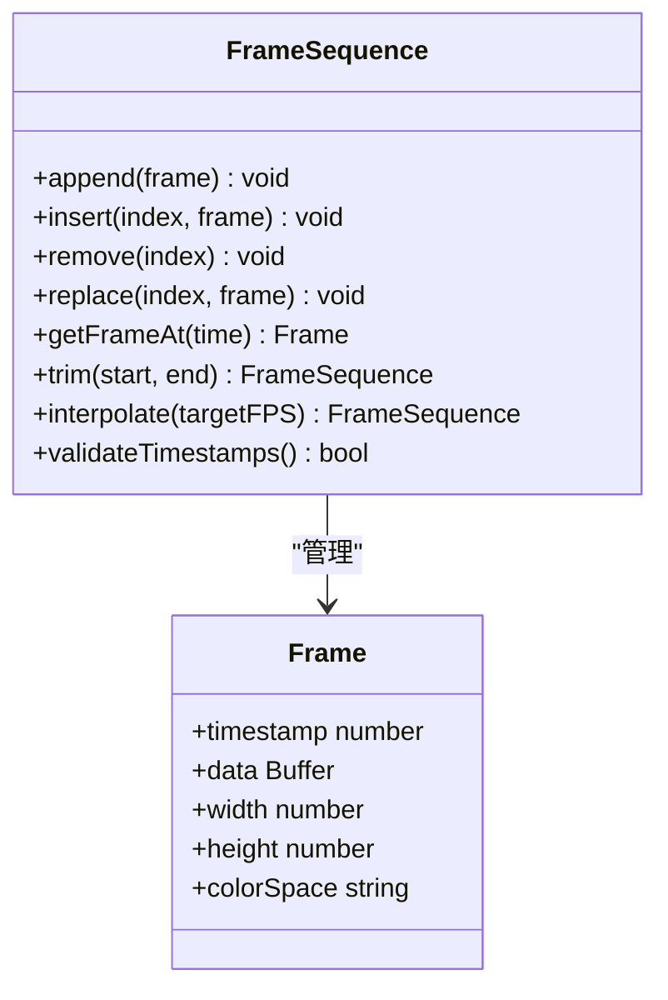

**图表来源** 
- [frame-sequence.ts](file://src/features/render/frame-sequence.ts)

**章节来源**
- [frame-sequence.ts](file://src/features/render/frame-sequence.ts)

### 编码（Encode）
- 功能要点
  - 将帧序列编码为指定容器与编码格式
  - 支持码率控制、关键帧间隔、质量参数与硬件加速开关
- 关键设计
  - 分块编码：按窗口大小切分，限制内存占用
  - 增量写入：边编边写，降低磁盘峰值
  - 失败回滚：编码中断时清理部分产物

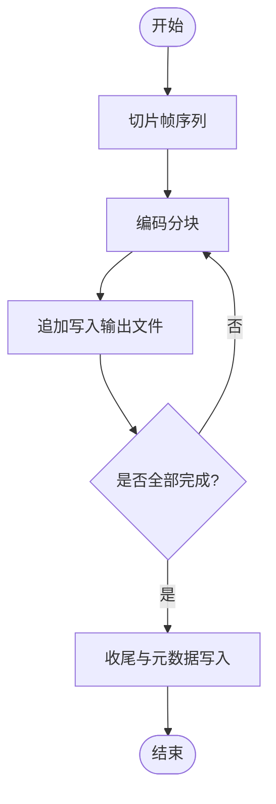

**图表来源** 
- [encode.ts](file://src/features/render/encode.ts)

**章节来源**
- [encode.ts](file://src/features/render/encode.ts)

### 拼接（Concat）
- 功能要点
  - 合并多个片段，处理边界帧重复与时间戳连续性
- 关键设计
  - 边界对齐：根据帧率与关键帧位置对齐
  - 去重策略：去除相邻片段重叠帧
  - 流式合并：避免全量加载

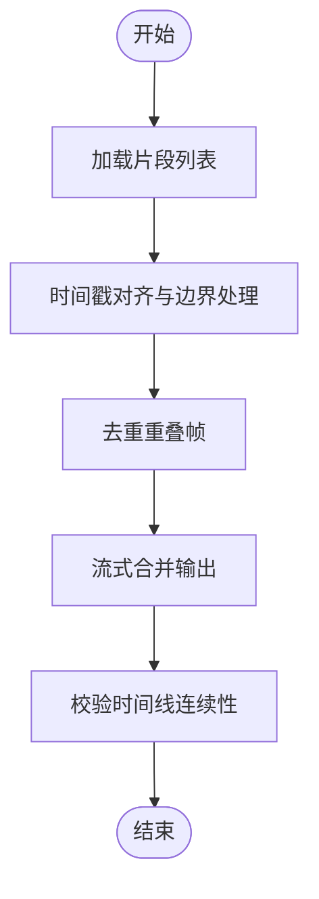

**图表来源** 
- [concat.ts](file://src/features/render/concat.ts)

**章节来源**
- [concat.ts](file://src/features/render/concat.ts)

### 缩略图（Thumbnail）
- 功能要点
  - 基于关键帧或中间帧生成缩略图，用于预览与列表展示
- 关键设计
  - 快速路径：优先使用已存在的关键帧
  - 尺寸自适应：按显示需求缩放
  - 缓存命中：相同输入直接返回缓存

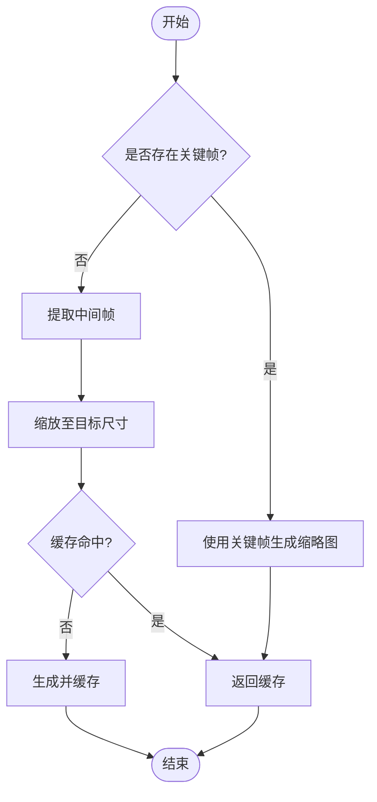

**图表来源** 
- [thumbnail.ts](file://src/features/render/thumbnail.ts)

**章节来源**
- [thumbnail.ts](file://src/features/render/thumbnail.ts)

### 渲染器（Renderer）
- 功能要点
  - 编排捕获、序列、编码、拼接与质量检查等步骤
  - 管理任务生命周期、进度上报与错误处理
- 关键设计
  - 阶段化执行：每阶段可独立重试
  - 资源隔离：每个任务独立的临时目录与句柄
  - 监控指标：吞吐、延迟、错误率

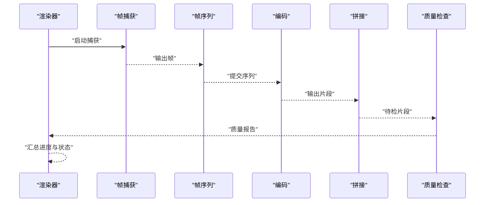

**图表来源** 
- [renderer.ts](file://src/features/render/renderer.ts)

**章节来源**
- [renderer.ts](file://src/features/render/renderer.ts)

### 镜头仓库（Render Shot Repository）
- 功能要点
  - 存取镜头元数据与输出产物路径，协调任务状态
- 关键设计
  - 幂等写入：同一任务多次提交不产生重复记录
  - 状态机：待处理→进行中→已完成/失败
  - 事务性：状态变更与产物写入原子性

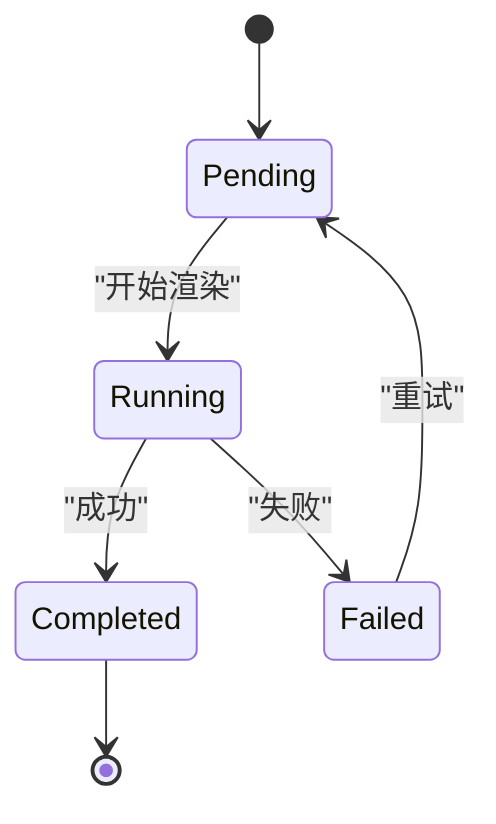

**图表来源** 
- [render-shot-repository.ts](file://src/features/render/render-shot-repository.ts)

**章节来源**
- [render-shot-repository.ts](file://src/features/render/render-shot-repository.ts)

### 持久化（Persistence）
- 功能要点
  - 将中间结果与最终产物落盘，支持断点续传与回滚
- 关键设计
  - 原子写入：先写临时文件再原子替换
  - 校验和：写入后校验完整性
  - 清理策略：过期产物自动回收

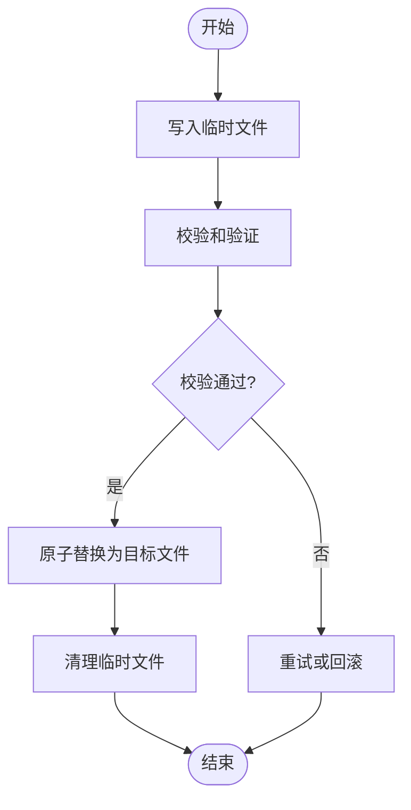

**图表来源** 
- [persistence.ts](file://src/features/render/persistence.ts)

**章节来源**
- [persistence.ts](file://src/features/render/persistence.ts)

### 缓存（Cache）
- 功能要点
  - 对重算代价高的中间产物进行缓存，提升重复渲染效率
- 关键设计
  - 键生成：基于输入哈希与参数指纹
  - 淘汰策略：LRU 或 TTL
  - 一致性：跨进程共享与失效通知

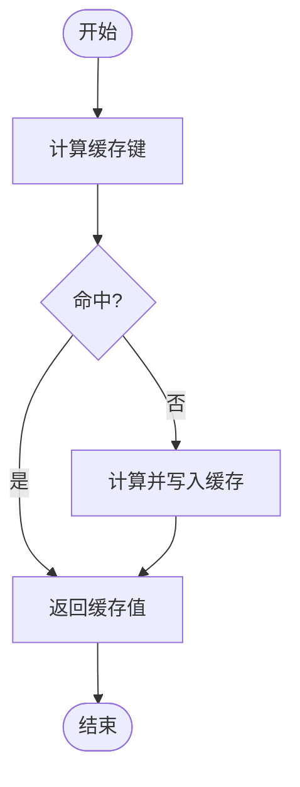

**图表来源** 
- [cache.ts](file://src/features/render/cache.ts)

**章节来源**
- [cache.ts](file://src/features/render/cache.ts)

### 导出服务（Export Service）
- 功能要点
  - 对外暴露导出 API，封装渲染任务提交与进度查询
- 关键设计
  - 异步任务：通过队列处理器调度
  - 进度事件：推送阶段性进度与结果
  - 错误映射：统一错误码与消息

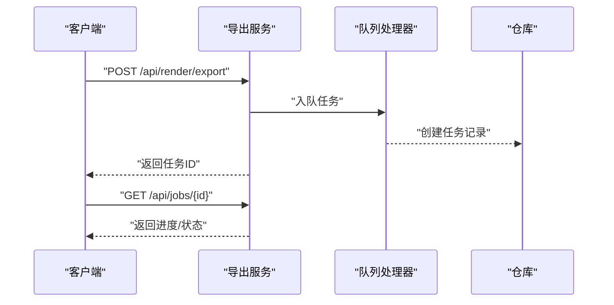

**图表来源** 
- [export-service.ts](file://src/features/render/export-service.ts)
- [queue-handler.ts](file://src/features/render/queue-handler.ts)
- [render-shot-repository.ts](file://src/features/render/render-shot-repository.ts)

**章节来源**
- [export-service.ts](file://src/features/render/export-service.ts)
- [queue-handler.ts](file://src/features/render/queue-handler.ts)
- [render-shot-repository.ts](file://src/features/render/render-shot-repository.ts)

### 队列处理器（Queue Handler）
- 功能要点
  - 管理并发度、优先级与重试策略，保障高负载下的稳定性
- 关键设计
  - 限流：令牌桶或滑动窗口
  - 优先级：按任务类型与截止时间排序
  - 重试：指数退避与死信队列

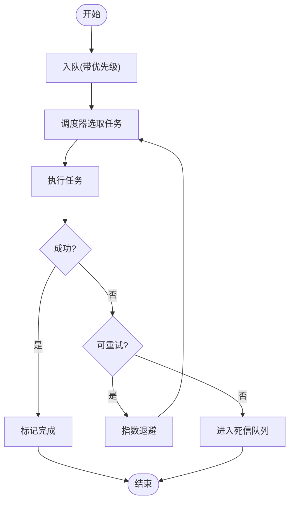

**图表来源** 
- [queue-handler.ts](file://src/features/render/queue-handler.ts)

**章节来源**
- [queue-handler.ts](file://src/features/render/queue-handler.ts)

### 准入控制（Admission）
- 功能要点
  - 校验输入合法性、资源配额与依赖完整性
- 关键设计
  - 前置检查：文件格式、分辨率、时长、可用存储
  - 依赖检查：编码器可用性、硬件加速能力
  - 拒绝策略：明确错误原因与修复建议

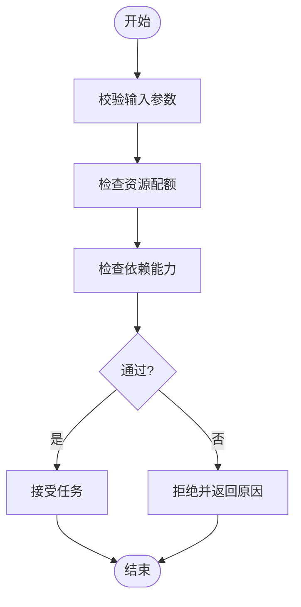

**图表来源** 
- [admission.ts](file://src/features/render/admission.ts)

**章节来源**
- [admission.ts](file://src/features/render/admission.ts)

### 质量检查（QA / Vision QA）
- 功能要点
  - 执行帧级与视觉级质量检查，如黑场、过曝、抖动检测
- 关键设计
  - 规则引擎：可配置的质量阈值与规则集
  - 抽样策略：关键帧与随机帧混合抽样
  - 报告生成：结构化质量报告与问题定位

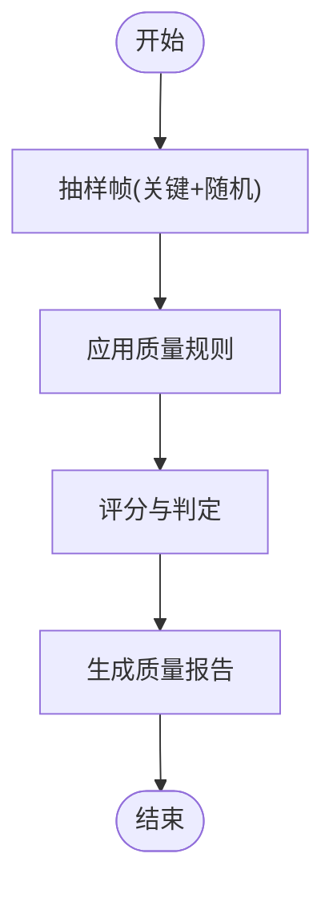

**图表来源** 
- [qa-check.ts](file://src/features/render/qa-check.ts)
- [vision-qa.ts](file://src/features/render/vision-qa.ts)

**章节来源**
- [qa-check.ts](file://src/features/render/qa-check.ts)
- [vision-qa.ts](file://src/features/render/vision-qa.ts)

### 类型与源契约（Types & Source Contract）
- 功能要点
  - 统一定义帧、序列、任务、产物等数据结构
  - 规范媒体源接入接口，便于扩展新源类型
- 关键设计
  - 强类型约束：编译期检查与运行时校验
  - 版本兼容：字段演进与向后兼容策略

**章节来源**
- [types.ts](file://src/features/render/types.ts)
- [source-contract.ts](file://src/features/render/source-contract.ts)

## 依赖关系分析
渲染器作为中心编排者，依赖捕获、序列、编码、拼接、质量检查等模块；导出服务与队列处理器负责任务调度；仓库与持久化提供状态与产物存取；缓存提升重复渲染效率。

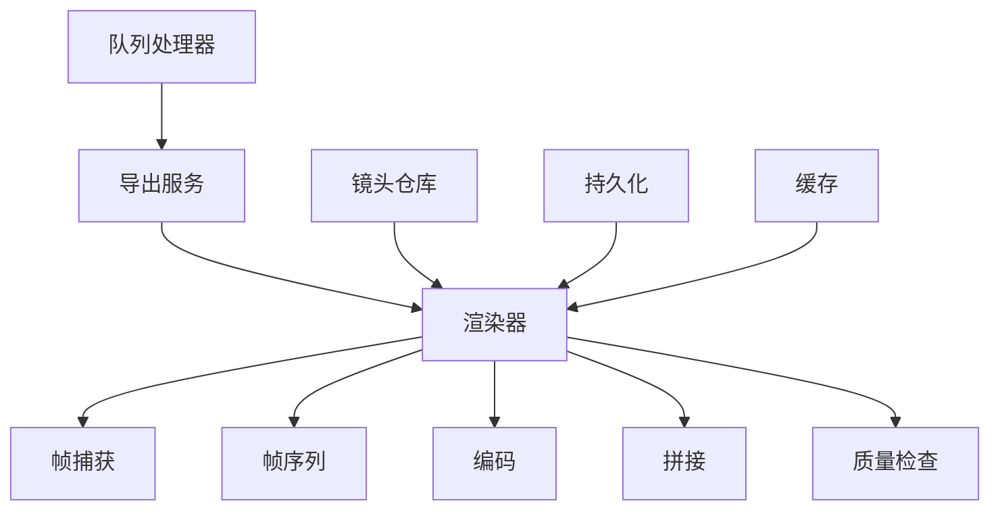

**图表来源** 
- [renderer.ts](file://src/features/render/renderer.ts)
- [export-service.ts](file://src/features/render/export-service.ts)
- [queue-handler.ts](file://src/features/render/queue-handler.ts)
- [render-shot-repository.ts](file://src/features/render/render-shot-repository.ts)
- [persistence.ts](file://src/features/render/persistence.ts)
- [cache.ts](file://src/features/render/cache.ts)

**章节来源**
- [renderer.ts](file://src/features/render/renderer.ts)
- [export-service.ts](file://src/features/render/export-service.ts)
- [queue-handler.ts](file://src/features/render/queue-handler.ts)
- [render-shot-repository.ts](file://src/features/render/render-shot-repository.ts)
- [persistence.ts](file://src/features/render/persistence.ts)
- [cache.ts](file://src/features/render/cache.ts)

## 性能考量
- 帧捕获
  - 流式解码与分块读取，避免大文件内存峰值
  - 合理设置分辨率与色彩空间，减少不必要的转换
  - 去隔行仅在必要时启用，降低 CPU 开销
- 帧序列
  - 双缓冲与惰性计算，降低内存占用
  - 时间戳步长化以减少浮点误差累积
- 编码与拼接
  - 分块编码与增量写入，平滑 I/O 峰值
  - 关键帧间隔与码率自适应，平衡画质与体积
- 缓存与持久化
  - 缓存命中率优化，减少重复计算
  - 原子写入与校验和，确保数据一致性与可恢复性
- 队列与并发
  - 令牌桶限流与优先级调度，避免过载
  - 指数退避重试，提高鲁棒性

[本节为通用指导，不直接分析具体文件]

## 故障排查指南
- 常见问题
  - 解码失败：检查媒体格式与编码器兼容性
  - 时间戳错乱：确认步长化与对齐逻辑
  - 内存溢出：降低分辨率或启用分块处理
  - 磁盘 I/O 瓶颈：调整写入策略与缓存大小
- 诊断方法
  - 查看质量检查报告，定位问题帧
  - 检查队列日志与任务状态，追踪失败原因
  - 使用缩略图快速验证关键帧是否正确

**章节来源**
- [qa-check.ts](file://src/features/render/qa-check.ts)
- [vision-qa.ts](file://src/features/render/vision-qa.ts)
- [queue-handler.ts](file://src/features/render/queue-handler.ts)
- [thumbnail.ts](file://src/features/render/thumbnail.ts)

## 结论
PurpleInK 的帧序列处理系统通过模块化设计与严格的时序控制，实现了高效、稳定的视频帧提取、处理与合成。借助缓存、持久化与队列调度，系统在高分辨率与实时场景下仍保持良好性能与可扩展性。未来可进一步引入硬件加速与更精细的质量模型，以提升整体体验。

[本节为总结，不直接分析具体文件]

## 附录
- 实时预览示例
  - 使用播放器组件加载缩略图与关键帧，实现低延迟预览
- 帧级编辑示例
  - 在帧序列中插入或删除帧，重新计算时间戳并触发增量渲染
- 高分辨率处理示例
  - 启用分块解码与渐进式编码，降低内存与 I/O 压力

**章节来源**
- [shot-player.tsx](file://src/app/products/(app)/canvas/[projectId]/shot-player.tsx)
- [export-view-model.ts](file://src/app/products/(app)/export/[projectId]/export-view-model.ts)
- [frame-sequence.ts](file://src/features/render/frame-sequence.ts)
- [encode.ts](file://src/features/render/encode.ts)