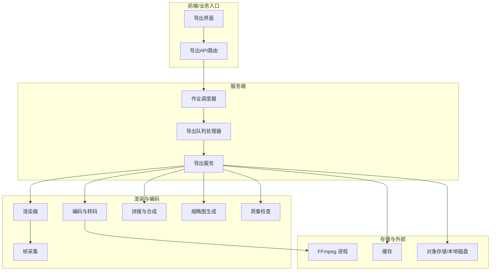
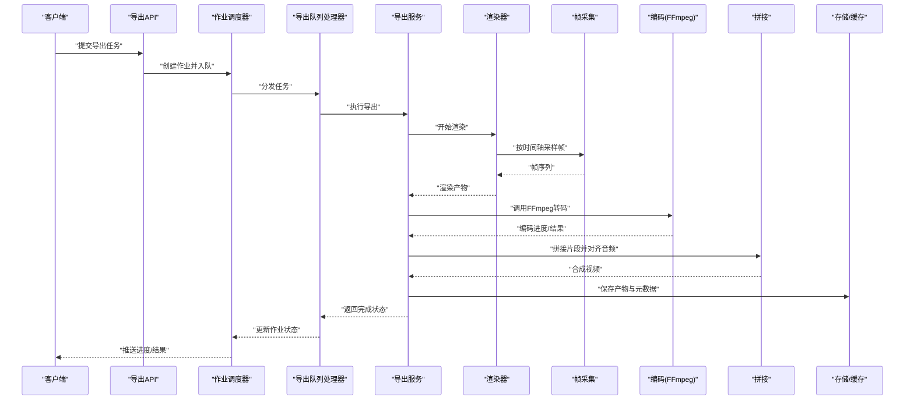
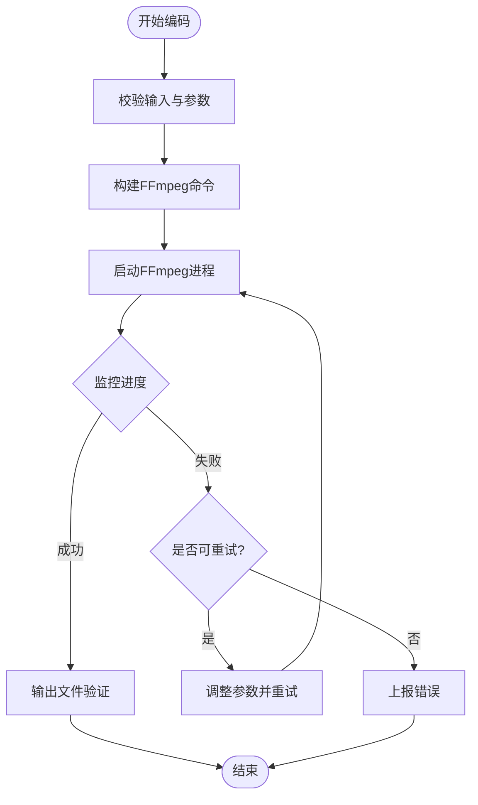
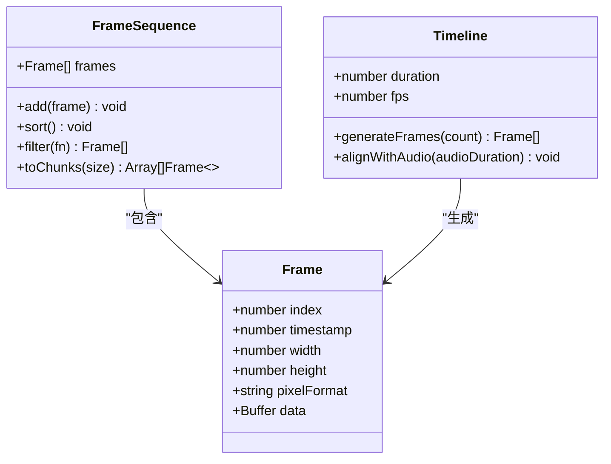
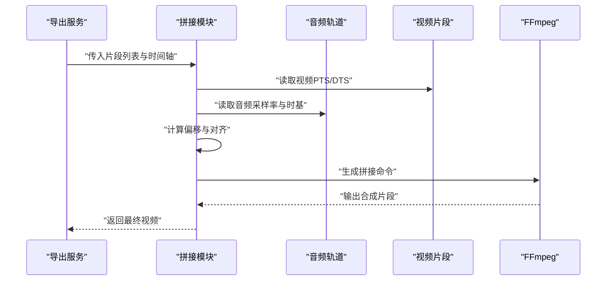
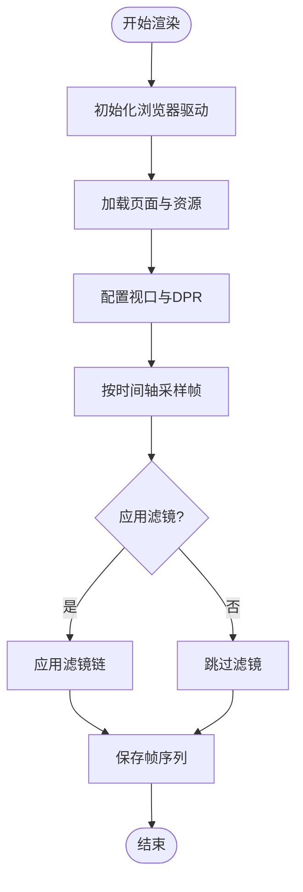
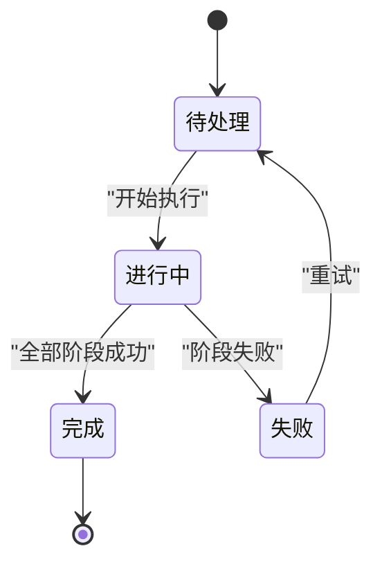
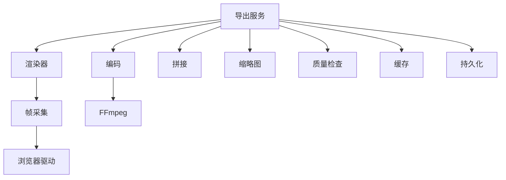

# 视频处理与编码

<cite>
**本文引用的文件**   
- [src/features/render/encode.ts](file://src/features/render/encode.ts)
- [src/features/render/concat.ts](file://src/features/render/concat.ts)
- [src/features/render/frame-capture.ts](file://src/features/render/frame-capture.ts)
- [src/features/render/frame-sequence.ts](file://src/features/render/frame-sequence.ts)
- [src/features/render/export-service.ts](file://src/features/render/export-service.ts)
- [src/features/render/export-queue-handler.ts](file://src/features/render/export-queue-handler.ts)
- [src/features/render/renderer.ts](file://src/features/render/renderer.ts)
- [src/features/render/types.ts](file://src/features/render/types.ts)
- [src/features/render/persistence.ts](file://src/features/render/persistence.ts)
- [src/features/render/cache.ts](file://src/features/render/cache.ts)
- [src/features/render/thumbnail.ts](file://src/features/render/thumbnail.ts)
- [src/features/render/qa-check.ts](file://src/features/render/qa-check.ts)
- [src/features/render/vision-qa.ts](file://src/features/render/vision-qa.ts)
- [server/src/capture/run-capture.ts](file://server/src/capture/run-capture.ts)
- [server/src/capture/browser-driver.ts](file://server/src/capture/browser驱动.ts)
- [server/src/capture/playwright-driver.ts](file://server/src/capture/playwright-driver.ts)
- [server/src/capture/mock-driver.ts](file://server/src/capture/mock-driver.ts)
- [server/src/server/job-runner.ts](file://server/src/server/job-runner.ts)
- [server/src/server/job-store.ts](file://server/src/server/job-store.ts)
- [server/package.json](file://server/package.json)
</cite>

## 目录
1. [简介](#简介)
2. [项目结构](#项目结构)
3. [核心组件](#核心组件)
4. [架构总览](#架构总览)
5. [详细组件分析](#详细组件分析)
6. [依赖关系分析](#依赖关系分析)
7. [性能考量](#性能考量)
8. [故障排查指南](#故障排查指南)
9. [结论](#结论)
10. [附录](#附录)

## 简介
本技术文档面向 PurpleInK 平台的视频处理与编码子系统，聚焦 FFmpeg 集成、视频编码参数配置、格式转换流程与质量优化策略。文档覆盖帧序列处理、视频拼接算法、音频同步与时间轴对齐；说明不同输出格式的编码参数、压缩比控制与文件大小优化；并提供自定义编码器设置、批量处理与并行编码的配置示例思路。同时给出进度监控、错误恢复与性能调优方法，帮助读者在生产环境中稳定高效地运行视频导出流水线。

## 项目结构
视频处理与编码能力主要分布在以下模块：
- 渲染与导出服务层：负责编排渲染、转码、拼接、缩略图生成与质量检查等任务
- 队列与作业调度：将导出任务入队、消费并持久化状态
- 浏览器捕获与帧采集：通过 Playwright 或 Mock 驱动进行页面渲染与截图
- 存储与缓存：中间产物与最终输出的落盘与缓存命中策略
- 类型与契约：统一的数据结构与接口定义

图表来源
- [src/features/render/export-service.ts](file://src/features/render/export-service.ts)
- [src/features/render/export-queue-handler.ts](file://src/features/render/export-queue-handler.ts)
- [src/features/render/renderer.ts](file://src/features/render/renderer.ts)
- [src/features/render/frame-capture.ts](file://src/features/render/frame-capture.ts)
- [src/features/render/encode.ts](file://src/features/render/encode.ts)
- [src/features/render/concat.ts](file://src/features/render/concat.ts)
- [src/features/render/thumbnail.ts](file://src/features/render/thumbnail.ts)
- [src/features/render/qa-check.ts](file://src/features/render/qa-check.ts)
- [src/features/render/cache.ts](file://src/features/render/cache.ts)
- [server/src/server/job-runner.ts](file://server/src/server/job-runner.ts)

章节来源
- [src/features/render/export-service.ts](file://src/features/render/export-service.ts)
- [src/features/render/export-queue-handler.ts](file://src/features/render/export-queue-handler.ts)
- [src/features/render/renderer.ts](file://src/features/render/renderer.ts)
- [src/features/render/types.ts](file://src/features/render/types.ts)

## 核心组件
- 导出服务（ExportService）：编排整个导出生命周期，协调渲染、编码、拼接、缩略图与质量检查，管理并发与重试
- 导出队列处理器（ExportQueueHandler）：从队列拉取任务，调用导出服务执行，更新作业状态与进度
- 渲染器（Renderer）：驱动浏览器捕获页面内容，生成帧序列或媒体片段
- 帧采集（FrameCapture）：按时间轴采样帧，支持分辨率缩放、裁剪、滤镜链
- 编码（Encode）：封装 FFmpeg 调用，支持多格式输出、码率控制、预设选择、进度回调
- 拼接（Concat）：基于时间轴对齐与音频同步，合并多个片段为完整视频
- 缩略图（Thumbnail）：抽取关键帧生成预览图
- 质量检查（QA/VisionQA）：对输出进行基础指标校验与视觉一致性检测
- 缓存（Cache）：对中间产物与结果进行缓存，提升重复导出效率
- 持久化（Persistence）：记录作业、阶段、产物与元数据

章节来源
- [src/features/render/export-service.ts](file://src/features/render/export-service.ts)
- [src/features/render/export-queue-handler.ts](file://src/features/render/export-queue-handler.ts)
- [src/features/render/renderer.ts](file://src/features/render/renderer.ts)
- [src/features/render/frame-capture.ts](file://src/features/render/frame-capture.ts)
- [src/features/render/encode.ts](file://src/features/render/encode.ts)
- [src/features/render/concat.ts](file://src/features/render/concat.ts)
- [src/features/render/thumbnail.ts](file://src/features/render/thumbnail.ts)
- [src/features/render/qa-check.ts](file://src/features/render/qa-check.ts)
- [src/features/render/vision-qa.ts](file://src/features/render/vision-qa.ts)
- [src/features/render/cache.ts](file://src/features/render/cache.ts)
- [src/features/render/persistence.ts](file://src/features/render/persistence.ts)

## 架构总览
导出流水线采用“服务编排 + 队列消费”的架构：
- 前端发起导出请求，后端创建作业并进入队列
- 队列处理器拉取作业，调用导出服务执行各阶段
- 渲染器驱动浏览器捕获帧序列，编码模块调用 FFmpeg 完成转码
- 拼接模块根据时间轴对齐音视频，生成最终输出
- 缩略图与质量检查作为可选阶段增强用户体验与可靠性
- 所有中间产物与最终结果写入缓存与持久化存储

图表来源
- [src/features/render/export-service.ts](file://src/features/render/export-service.ts)
- [src/features/render/export-queue-handler.ts](file://src/features/render/export-queue-handler.ts)
- [src/features/render/renderer.ts](file://src/features/render/renderer.ts)
- [src/features/render/frame-capture.ts](file://src/features/render/frame-capture.ts)
- [src/features/render/encode.ts](file://src/features/render/encode.ts)
- [src/features/render/concat.ts](file://src/features/render/concat.ts)
- [src/features/render/persistence.ts](file://src/features/render/persistence.ts)
- [server/src/server/job-runner.ts](file://server/src/server/job-runner.ts)

## 详细组件分析

### 编码与转码（FFmpeg 集成）
- 功能要点
  - 封装 FFmpeg 命令行或库调用，支持 H.264/H.265、AAC、MP4、MKV、WebM 等常见格式
  - 提供码率控制（CBR/VBR）、预设（fast/medium/slow）、调色与滤镜链
  - 支持进度回调、错误码解析与重试策略
- 关键实现点
  - 输入源：帧序列或中间片段
  - 输出目标：指定容器与编码参数
  - 资源限制：CPU/GPU 使用上限、线程数、内存占用
  - 失败恢复：断点续传、分段重试、回退到更低质量参数

图表来源
- [src/features/render/encode.ts](file://src/features/render/encode.ts)

章节来源
- [src/features/render/encode.ts](file://src/features/render/encode.ts)

### 帧序列处理与时间轴对齐
- 功能要点
  - 按时间轴均匀采样帧，支持变速、裁剪、缩放与滤镜
  - 帧序号与时间戳映射，确保与音频轨道严格对齐
  - 异常帧过滤与插值补帧策略
- 关键实现点
  - 帧序列数据结构：包含时间戳、分辨率、像素格式
  - 对齐算法：基于 PTS/DTS 或样本计数对齐
  - 容错机制：丢帧告警、自动补偿

图表来源
- [src/features/render/frame-sequence.ts](file://src/features/render/frame-sequence.ts)
- [src/features/render/frame-capture.ts](file://src/features/render/frame-capture.ts)

章节来源
- [src/features/render/frame-sequence.ts](file://src/features/render/frame-sequence.ts)
- [src/features/render/frame-capture.ts](file://src/features/render/frame-capture.ts)

### 视频拼接与音频同步
- 功能要点
  - 将多个片段按顺序拼接，处理边界过渡与黑场插入
  - 音频重采样、延迟补偿与音画同步
  - 支持多轨混音与静音段裁剪
- 关键实现点
  - 拼接表生成：基于时间戳与时长计算偏移
  - 同步策略：以音频为基准对齐视频 PTS
  - 质量保障：无缝切换、避免跳帧与爆音

图表来源
- [src/features/render/concat.ts](file://src/features/render/concat.ts)

章节来源
- [src/features/render/concat.ts](file://src/features/render/concat.ts)

### 渲染与帧采集
- 功能要点
  - 通过浏览器驱动渲染页面，截取帧序列
  - 支持分辨率、DPR、视口尺寸与滚动区域控制
  - 可选滤镜链（模糊、锐化、色彩校正）
- 关键实现点
  - 驱动选择：Playwright/Mock，便于测试与离线环境
  - 采样策略：固定间隔或事件触发式采样
  - 资源管理：会话复用、内存回收

图表来源
- [src/features/render/renderer.ts](file://src/features/render/renderer.ts)
- [src/features/render/frame-capture.ts](file://src/features/render/frame-capture.ts)
- [server/src/capture/playwright-driver.ts](file://server/src/capture/playwright-driver.ts)
- [server/src/capture/mock-driver.ts](file://server/src/capture/mock-driver.ts)

章节来源
- [src/features/render/renderer.ts](file://src/features/render/renderer.ts)
- [src/features/render/frame-capture.ts](file://src/features/render/frame-capture.ts)
- [server/src/capture/playwright-driver.ts](file://server/src/capture/playwright-driver.ts)
- [server/src/capture/mock-driver.ts](file://server/src/capture/mock-driver.ts)

### 导出服务与队列处理
- 功能要点
  - 导出服务编排各阶段，管理并发与重试
  - 队列处理器拉取任务、更新状态、持久化进度
- 关键实现点
  - 阶段划分：渲染、编码、拼接、缩略图、质量检查
  - 并发控制：限制并行度，避免资源争用
  - 状态机：待处理、进行中、完成、失败、重试

图表来源
- [src/features/render/export-service.ts](file://src/features/render/export-service.ts)
- [src/features/render/export-queue-handler.ts](file://src/features/render/export-queue-handler.ts)
- [server/src/server/job-runner.ts](file://server/src/server/job-runner.ts)

章节来源
- [src/features/render/export-service.ts](file://src/features/render/export-service.ts)
- [src/features/render/export-queue-handler.ts](file://src/features/render/export-queue-handler.ts)
- [server/src/server/job-runner.ts](file://server/src/server/job-runner.ts)

### 缩略图与质量检查
- 功能要点
  - 抽取关键帧生成缩略图，加速预览
  - 基础质量检查：分辨率、时长、码率、音频通道
  - 视觉一致性检查：对比参考帧或历史版本
- 关键实现点
  - 缩略图策略：首帧、中帧、随机帧
  - 检查规则：阈值判定与告警
  - 报告输出：结构化质量报告

章节来源
- [src/features/render/thumbnail.ts](file://src/features/render/thumbnail.ts)
- [src/features/render/qa-check.ts](file://src/features/render/qa-check.ts)
- [src/features/render/vision-qa.ts](file://src/features/render/vision-qa.ts)

### 缓存与持久化
- 功能要点
  - 中间产物与最终结果缓存，减少重复计算
  - 作业状态、阶段产物与元数据持久化
- 关键实现点
  - 缓存键：基于输入哈希与参数指纹
  - 失效策略：TTL、LRU、手动清理
  - 持久化：数据库或对象存储

章节来源
- [src/features/render/cache.ts](file://src/features/render/cache.ts)
- [src/features/render/persistence.ts](file://src/features/render/persistence.ts)

## 依赖关系分析
- 内部依赖
  - 导出服务依赖渲染器、编码、拼接、缩略图、质量检查、缓存与持久化
  - 渲染器依赖帧采集与浏览器驱动
  - 编码模块依赖 FFmpeg 进程或库
- 外部依赖
  - FFmpeg：视频编解码与转码
  - Playwright：浏览器自动化与截图
  - 存储系统：对象存储或本地文件系统

图表来源
- [src/features/render/export-service.ts](file://src/features/render/export-service.ts)
- [src/features/render/renderer.ts](file://src/features/render/renderer.ts)
- [src/features/render/encode.ts](file://src/features/render/encode.ts)
- [src/features/render/concat.ts](file://src/features/render/concat.ts)
- [src/features/render/thumbnail.ts](file://src/features/render/thumbnail.ts)
- [src/features/render/qa-check.ts](file://src/features/render/qa-check.ts)
- [src/features/render/cache.ts](file://src/features/render/cache.ts)
- [src/features/render/persistence.ts](file://src/features/render/persistence.ts)
- [src/features/render/frame-capture.ts](file://src/features/render/frame-capture.ts)
- [server/src/capture/playwright-driver.ts](file://server/src/capture/playwright-driver.ts)

章节来源
- [src/features/render/export-service.ts](file://src/features/render/export-service.ts)
- [src/features/render/types.ts](file://src/features/render/types.ts)

## 性能考量
- 并行编码
  - 合理设置并发度，避免 CPU 饱和与上下文切换开销
  - 使用硬件加速（NVENC/QSV）时注意驱动与资源隔离
- 码率与质量平衡
  - 优先使用 VBR+CRF 组合，兼顾质量与体积
  - 针对静态画面较多的场景降低码率，动态场景适当提高
- 缓存命中
  - 对相同输入与参数命中缓存，显著缩短导出时间
  - 定期清理过期缓存，释放存储空间
- I/O 优化
  - 使用高速磁盘或网络存储，避免瓶颈
  - 分块读写与流式处理，降低内存峰值
- 资源监控
  - 监控 CPU、内存、I/O 与 GPU 利用率
  - 设置超时与熔断，防止长时间阻塞

[本节为通用指导，不直接分析具体文件]

## 故障排查指南
- 常见问题
  - FFmpeg 进程崩溃：检查输入合法性、参数冲突与资源不足
  - 音画不同步：核对时间基、PTS/DTS 与重采样参数
  - 输出文件损坏：验证容器与编码兼容性，启用完整性校验
  - 内存溢出：降低并发、减小帧尺寸或启用分块处理
- 调试手段
  - 启用详细日志与 FFmpeg 输出
  - 使用 ffprobe 分析输入与输出媒体信息
  - 逐步禁用阶段定位问题
- 恢复策略
  - 断点续传与分段重试
  - 回退到更低质量参数或替代编码器
  - 自动重试与人工干预结合

章节来源
- [src/features/render/encode.ts](file://src/features/render/encode.ts)
- [src/features/render/concat.ts](file://src/features/render/concat.ts)
- [src/features/render/export-queue-handler.ts](file://src/features/render/export-queue-handler.ts)

## 结论
PurpleInK 的视频处理与编码系统通过模块化设计与队列化调度，实现了高可靠、可扩展的导出流水线。借助 FFmpeg 的强大能力与灵活的参数配置，平台能够支持多种输出格式与质量需求。通过帧序列处理、时间轴对齐与音频同步，确保输出的一致性与专业性。配合缓存、持久化与质量检查，系统在性能与稳定性之间取得良好平衡。建议在生产环境中结合硬件加速与资源监控，进一步优化吞吐与成本。

[本节为总结性内容，不直接分析具体文件]

## 附录
- 配置示例思路
  - 自定义编码器设置：在编码模块中扩展参数模板，支持 CRF、预设、滤镜链与硬件加速开关
  - 批量处理：通过导出服务批量提交任务，利用队列并发执行
  - 并行编码：根据 CPU 核数与 GPU 资源动态调整并发度
- 最佳实践
  - 输入标准化：统一分辨率、帧率与像素格式
  - 参数模板化：按场景预设编码参数，简化配置
  - 监控与告警：建立关键指标看板与异常通知
  - 灰度发布：新参数或小范围验证后再全量上线

[本节为补充信息，不直接分析具体文件]