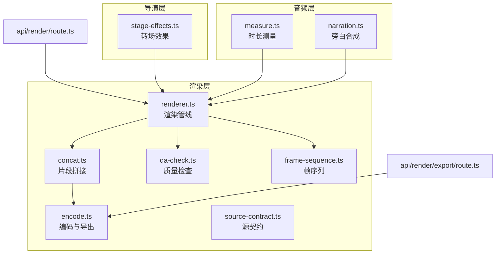
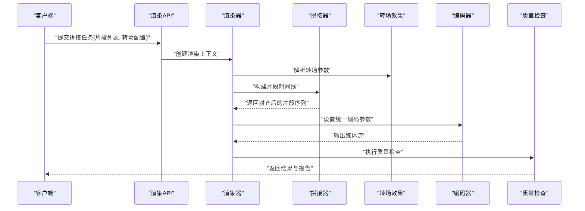
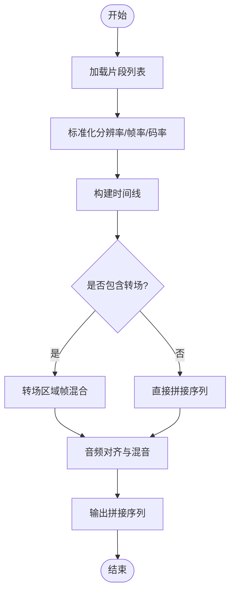
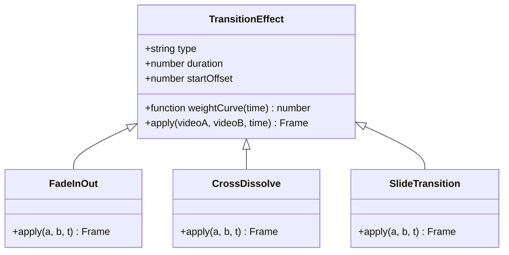
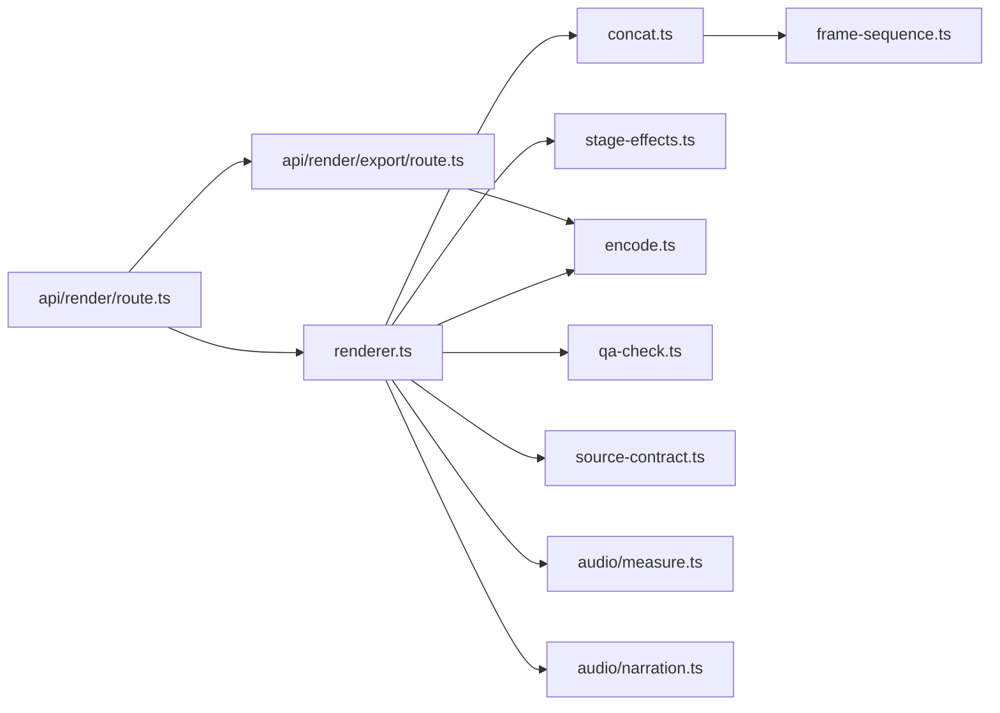

# 视频拼接与合并

<cite>
**本文引用的文件**   
- [src/features/render/concat.ts](file://src/features/render/concat.ts)
- [src/features/render/encode.ts](file://src/features/render/encode.ts)
- [src/features/render/renderer.ts](file://src/features/render/renderer.ts)
- [src/features/render/export-service.ts](file://src/features/render/export-service.ts)
- [src/features/render/qa-check.ts](file://src/features/render/qa-check.ts)
- [src/features/render/frame-sequence.ts](file://src/features/render/frame-sequence.ts)
- [src/features/render/source-contract.ts](file://src/features/render/source-contract.ts)
- [src/features/director/stage-effects.ts](file://src/features/director/stage-effects.ts)
- [src/features/audio/measure.ts](file://src/features/audio/measure.ts)
- [src/features/audio/narration.ts](file://src/features/audio/narration.ts)
- [src/app/api/render/route.ts](file://src/app/api/render/route.ts)
- [src/app/api/render/export/route.ts](file://src/app/api/render/export/route.ts)
</cite>

## 目录
1. [简介](#简介)
2. [项目结构](#项目结构)
3. [核心组件](#核心组件)
4. [架构总览](#架构总览)
5. [详细组件分析](#详细组件分析)
6. [依赖分析](#依赖分析)
7. [性能考虑](#性能考虑)
8. [故障排查指南](#故障排查指南)
9. [结论](#结论)
10. [附录](#附录)

## 简介
本技术文档面向 PurpleInK 平台的视频拼接系统，聚焦多段视频的无缝拼接算法、转场效果与过渡处理。内容涵盖：
- 视频流合并、音频同步与时间轴对齐
- 不同格式兼容性、码率匹配与分辨率统一
- 淡入淡出、交叉溶解、滑动等转场的配置示例
- 拼接质量检查、元数据保留与性能优化策略

## 项目结构
与视频拼接相关的能力主要分布在渲染（render）、导演（director）与音频（audio）三大模块中：
- 渲染层负责帧序列组织、编码导出、质量检查与源契约校验
- 导演层定义转场效果与阶段编排
- 音频层提供时长测量与旁白合成能力，支撑音画同步

图表来源
- [src/features/render/concat.ts](file://src/features/render/concat.ts)
- [src/features/render/encode.ts](file://src/features/render/encode.ts)
- [src/features/render/renderer.ts](file://src/features/render/renderer.ts)
- [src/features/render/qa-check.ts](file://src/features/render/qa-check.ts)
- [src/features/render/frame-sequence.ts](file://src/features/render/frame-sequence.ts)
- [src/features/render/source-contract.ts](file://src/features/render/source-contract.ts)
- [src/features/director/stage-effects.ts](file://src/features/director/stage-effects.ts)
- [src/features/audio/measure.ts](file://src/features/audio/measure.ts)
- [src/features/audio/narration.ts](file://src/features/audio/narration.ts)
- [src/app/api/render/route.ts](file://src/app/api/render/route.ts)
- [src/app/api/render/export/route.ts](file://src/app/api/render/export/route.ts)

章节来源
- [src/features/render/concat.ts](file://src/features/render/concat.ts)
- [src/features/render/encode.ts](file://src/features/render/encode.ts)
- [src/features/render/renderer.ts](file://src/features/render/renderer.ts)
- [src/features/render/qa-check.ts](file://src/features/render/qa-check.ts)
- [src/features/render/frame-sequence.ts](file://src/features/render/frame-sequence.ts)
- [src/features/render/source-contract.ts](file://src/features/render/source-contract.ts)
- [src/features/director/stage-effects.ts](file://src/features/director/stage-effects.ts)
- [src/features/audio/measure.ts](file://src/features/audio/measure.ts)
- [src/features/audio/narration.ts](file://src/features/audio/narration.ts)
- [src/app/api/render/route.ts](file://src/app/api/render/route.ts)
- [src/app/api/render/export/route.ts](file://src/app/api/render/export/route.ts)

## 核心组件
- 片段拼接器（Concat）：将多个视频片段按时间线顺序合并，支持转场参数注入与边界对齐
- 编码器（Encode）：统一输出编码参数，确保码率、分辨率、容器格式一致
- 渲染器（Renderer）：编排帧序列、转场、音频同步与导出流程
- 质量检查（QA Check）：对输出进行完整性、时长、关键帧、音画同步等检查
- 帧序列（Frame Sequence）：管理帧的读取、裁剪、缩放与时间戳对齐
- 源契约（Source Contract）：约束输入源的格式、分辨率、帧率、声道数等
- 转场效果（Stage Effects）：定义淡入淡出、交叉溶解、滑动等过渡算法
- 音频测量（Audio Measure）：精确测量音频时长与采样率，辅助时间轴对齐
- 旁白合成（Narration）：将旁白与背景音混合并嵌入最终视频

章节来源
- [src/features/render/concat.ts](file://src/features/render/concat.ts)
- [src/features/render/encode.ts](file://src/features/render/encode.ts)
- [src/features/render/renderer.ts](file://src/features/render/renderer.ts)
- [src/features/render/qa-check.ts](file://src/features/render/qa-check.ts)
- [src/features/render/frame-sequence.ts](file://src/features/render/frame-sequence.ts)
- [src/features/render/source-contract.ts](file://src/features/render/source-contract.ts)
- [src/features/director/stage-effects.ts](file://src/features/director/stage-effects.ts)
- [src/features/audio/measure.ts](file://src/features/audio/measure.ts)
- [src/features/audio/narration.ts](file://src/features/audio/narration.ts)

## 架构总览
视频拼接系统采用“编排+执行”的分层架构：API 层接收请求，渲染器编排帧序列与转场，拼接器合并片段，编码器生成最终媒体，质量检查保障输出一致性。

图表来源
- [src/app/api/render/route.ts](file://src/app/api/render/route.ts)
- [src/features/render/renderer.ts](file://src/features/render/renderer.ts)
- [src/features/render/concat.ts](file://src/features/render/concat.ts)
- [src/features/director/stage-effects.ts](file://src/features/director/stage-effects.ts)
- [src/features/render/encode.ts](file://src/features/render/encode.ts)
- [src/features/render/qa-check.ts](file://src/features/render/qa-check.ts)

## 详细组件分析

### 片段拼接器（Concat）
- 功能：按时间线顺序合并多段视频，处理片段间的转场区域，保证时间戳连续
- 关键点：
  - 片段裁剪与边界对齐，避免黑边或跳帧
  - 转场区域的帧插值与权重混合
  - 音频片段的淡入淡出与交叉溶解
- 复杂度：线性扫描片段列表，转场区域为常数级额外计算

图表来源
- [src/features/render/concat.ts](file://src/features/render/concat.ts)
- [src/features/render/frame-sequence.ts](file://src/features/render/frame-sequence.ts)

章节来源
- [src/features/render/concat.ts](file://src/features/render/concat.ts)
- [src/features/render/frame-sequence.ts](file://src/features/render/frame-sequence.ts)

### 转场效果（Stage Effects）
- 支持的转场类型：
  - 淡入淡出：基于时间权重的透明度渐变
  - 交叉溶解：两段视频在重叠区间内像素加权混合
  - 滑动：通过平移矩阵实现位移过渡
- 配置要点：
  - 持续时间、起始偏移、权重曲线（线性/缓动）
  - 音频侧同步淡入淡出与音量包络

图表来源
- [src/features/director/stage-effects.ts](file://src/features/director/stage-effects.ts)

章节来源
- [src/features/director/stage-effects.ts](file://src/features/director/stage-effects.ts)

### 编码器（Encode）
- 目标：统一输出编码参数，确保跨片段一致性
- 关键参数：
  - 容器格式（如 MP4/MKV）
  - 视频编码（H.264/H.265）
  - 码率控制（CBR/VBR）
  - 分辨率与帧率归一化
  - 音频采样率与声道布局

章节来源
- [src/features/render/encode.ts](file://src/features/render/encode.ts)

### 渲染器（Renderer）
- 职责：编排帧序列、转场应用、音频同步与导出
- 流程：
  - 初始化渲染上下文
  - 解析转场配置并注入到拼接器
  - 调用编码器生成输出
  - 触发质量检查

章节来源
- [src/features/render/renderer.ts](file://src/features/render/renderer.ts)

### 质量检查（QA Check）
- 检查项：
  - 输出时长与预期时长偏差
  - 关键帧间隔合理性
  - 音画同步误差阈值
  - 比特率波动范围
- 输出：结构化报告，便于定位问题片段

章节来源
- [src/features/render/qa-check.ts](file://src/features/render/qa-check.ts)

### 帧序列（Frame Sequence）
- 功能：管理帧的读取、裁剪、缩放与时间戳对齐
- 特性：
  - 支持多分辨率输入的统一缩放
  - 帧率转换与丢帧/插帧策略
  - 时间戳连续性保证

章节来源
- [src/features/render/frame-sequence.ts](file://src/features/render/frame-sequence.ts)

### 源契约（Source Contract）
- 约束输入源：
  - 格式白名单（MP4, MOV, MKV 等）
  - 分辨率上限/下限
  - 帧率范围
  - 音频声道数与采样率

章节来源
- [src/features/render/source-contract.ts](file://src/features/render/source-contract.ts)

### 音频测量与旁白合成
- 音频测量：精确获取片段时长与采样率，用于时间轴对齐
- 旁白合成：将旁白轨道与背景音乐混合，保持音量平衡与相位一致

章节来源
- [src/features/audio/measure.ts](file://src/features/audio/measure.ts)
- [src/features/audio/narration.ts](file://src/features/audio/narration.ts)

## 依赖分析
各组件之间的依赖关系如下：

图表来源
- [src/app/api/render/route.ts](file://src/app/api/render/route.ts)
- [src/features/render/renderer.ts](file://src/features/render/renderer.ts)
- [src/features/render/concat.ts](file://src/features/render/concat.ts)
- [src/features/director/stage-effects.ts](file://src/features/director/stage-effects.ts)
- [src/features/render/encode.ts](file://src/features/render/encode.ts)
- [src/features/render/qa-check.ts](file://src/features/render/qa-check.ts)
- [src/features/render/frame-sequence.ts](file://src/features/render/frame-sequence.ts)
- [src/features/render/source-contract.ts](file://src/features/render/source-contract.ts)
- [src/features/audio/measure.ts](file://src/features/audio/measure.ts)
- [src/features/audio/narration.ts](file://src/features/audio/narration.ts)
- [src/app/api/render/export/route.ts](file://src/app/api/render/export/route.ts)

章节来源
- [src/app/api/render/route.ts](file://src/app/api/render/route.ts)
- [src/features/render/renderer.ts](file://src/features/render/renderer.ts)
- [src/features/render/concat.ts](file://src/features/render/concat.ts)
- [src/features/director/stage-effects.ts](file://src/features/director/stage-effects.ts)
- [src/features/render/encode.ts](file://src/features/render/encode.ts)
- [src/features/render/qa-check.ts](file://src/features/render/qa-check.ts)
- [src/features/render/frame-sequence.ts](file://src/features/render/frame-sequence.ts)
- [src/features/render/source-contract.ts](file://src/features/render/source-contract.ts)
- [src/features/audio/measure.ts](file://src/features/audio/measure.ts)
- [src/features/audio/narration.ts](file://src/features/audio/narration.ts)
- [src/app/api/render/export/route.ts](file://src/app/api/render/export/route.ts)

## 性能考虑
- 并行处理：对独立片段进行并行解码与预处理，减少整体耗时
- 内存管理：使用流式读写，避免全量帧驻留内存
- 编码优化：启用硬件加速（如适用），合理设置 GOP 与 B 帧
- 转场开销：限制转场区域长度，避免过度插帧
- I/O 优化：SSD 存储与预读缓冲，降低磁盘瓶颈

[本节为通用指导，不直接分析具体文件]

## 故障排查指南
- 常见问题：
  - 音画不同步：检查音频测量精度与时间戳对齐逻辑
  - 转场闪烁：确认权重曲线与帧边界对齐
  - 输出卡顿：检查码率设置与关键帧间隔
  - 格式不兼容：核对源契约白名单与编码器支持
- 诊断步骤：
  - 查看质量检查报告，定位异常片段
  - 回放转场区域，观察帧混合效果
  - 对比原始片段与输出片段的元数据差异

章节来源
- [src/features/render/qa-check.ts](file://src/features/render/qa-check.ts)
- [src/features/render/source-contract.ts](file://src/features/render/source-contract.ts)

## 结论
PurpleInK 的视频拼接系统通过分层架构与模块化设计，实现了高效、稳定的多段视频无缝拼接。结合转场效果、音频同步与质量检查，能够满足高质量视频生产需求。未来可进一步优化并行度与硬件加速支持，提升大规模任务处理能力。

[本节为总结性内容，不直接分析具体文件]

## 附录
- 配置示例（概念性说明）：
  - 淡入淡出：设置转场类型为 fade，持续时间为 1 秒，权重曲线为线性
  - 交叉溶解：设置转场类型为 cross-dissolve，重叠区间为 0.5 秒，权重曲线为缓动
  - 滑动：设置转场类型为 slide，方向为水平，移动距离为画面宽度
- 最佳实践：
  - 统一输入分辨率与帧率，减少运行时转换开销
  - 使用恒定码率或自适应码率策略，平衡质量与体积
  - 定期更新源契约与编码器支持列表，确保兼容性

[本节为概念性内容，不直接分析具体文件]