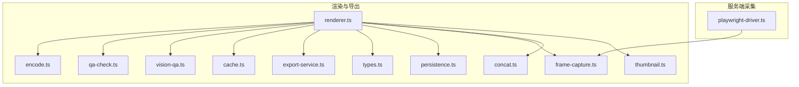
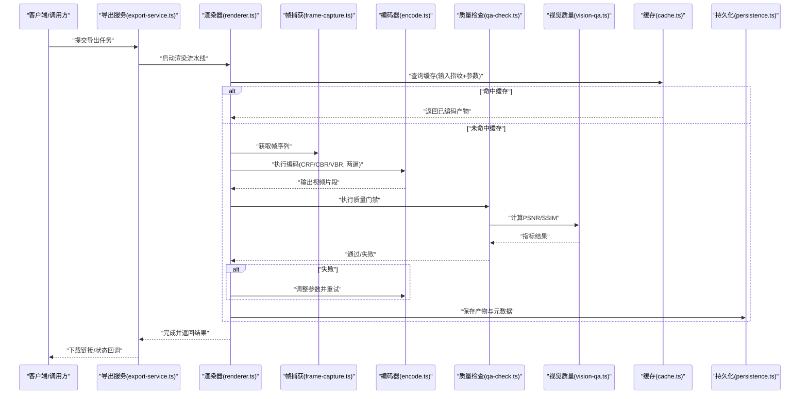
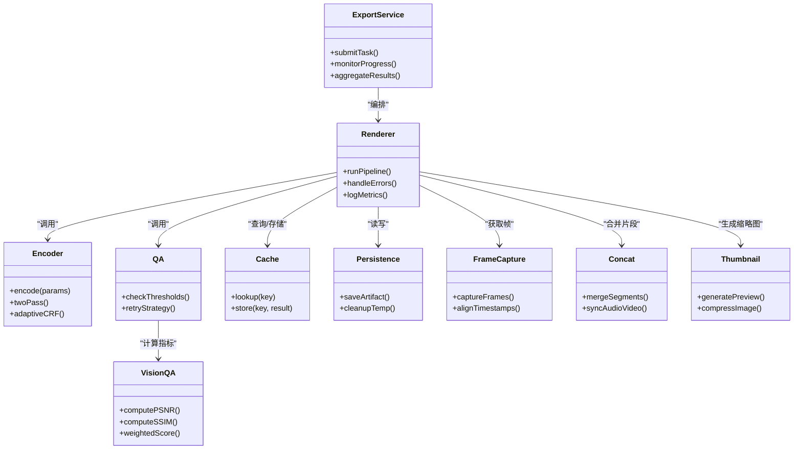

# 质量优化与压缩

<cite>
**本文引用的文件**   
- [src/features/render/encode.ts](file://src/features/render/encode.ts)
- [src/features/render/qa-check.ts](file://src/features/render/qa-check.ts)
- [src/features/render/vision-qa.ts](file://src/features/render/vision-qa.ts)
- [src/features/render/cache.ts](file://src/features/render/cache.ts)
- [src/features/render/export-service.ts](file://src/features/render/export-service.ts)
- [src/features/render/renderer.ts](file://src/features/render/renderer.ts)
- [src/features/render/types.ts](file://src/features/render/types.ts)
- [src/features/render/persistence.ts](file://src/features/render/persistence.ts)
- [src/features/render/frame-capture.ts](file://src/features/render/frame-capture.ts)
- [src/features/render/concat.ts](file://src/features/render/concat.ts)
- [src/features/render/thumbnail.ts](file://src/features/render/thumbnail.ts)
- [server/src/capture/playwright-driver.ts](file://server/src/capture/playwright-driver.ts)
</cite>

## 目录
1. [简介](#简介)
2. [项目结构](#项目结构)
3. [核心组件](#核心组件)
4. [架构总览](#架构总览)
5. [详细组件分析](#详细组件分析)
6. [依赖关系分析](#依赖关系分析)
7. [性能考量](#性能考量)
8. [故障排查指南](#故障排查指南)
9. [结论](#结论)
10. [附录](#附录)

## 简介
本技术文档聚焦 PurpleInK 平台的质量优化系统，围绕视频压缩算法选择、比特率控制与文件大小优化展开。文档详细说明视觉质量评估方法（PSNR、SSIM）的计算流程，解释自适应编码、CRF 模式与两遍编码策略的实现思路，并提供面向不同平台的优化配置示例。同时涵盖自动化质量检查、批量优化与缓存策略，帮助读者在质量与体积之间取得最佳平衡。

## 项目结构
质量优化相关代码主要位于前端特性模块 src/features/render 中，包含编码、质量检查、缓存、导出服务、渲染器、类型定义等关键文件。服务端 Playwright 驱动负责浏览器端截图与帧捕获，为视频生成提供高质量源帧序列。

图表来源 
- [src/features/render/renderer.ts](file://src/features/render/renderer.ts)
- [src/features/render/encode.ts](file://src/features/render/encode.ts)
- [src/features/render/qa-check.ts](file://src/features/render/qa-check.ts)
- [src/features/render/vision-qa.ts](file://src/features/render/vision-qa.ts)
- [src/features/render/cache.ts](file://src/features/render/cache.ts)
- [src/features/render/export-service.ts](file://src/features/render/export-service.ts)
- [src/features/render/types.ts](file://src/features/render/types.ts)
- [src/features/render/persistence.ts](file://src/features/render/persistence.ts)
- [src/features/render/frame-capture.ts](file://src/features/render/frame-capture.ts)
- [src/features/render/concat.ts](file://src/features/render/concat.ts)
- [src/features/render/thumbnail.ts](file://src/features/render/thumbnail.ts)
- [server/src/capture/playwright-driver.ts](file://server/src/capture/playwright-driver.ts)

章节来源
- [src/features/render/renderer.ts](file://src/features/render/renderer.ts)
- [src/features/render/types.ts](file://src/features/render/types.ts)

## 核心组件
- 编码器 encode.ts：封装视频编码参数、码率控制策略（CBR/VBR/CRF）、两遍编码流程、输出格式与容器设置。
- 质量检查 qa-check.ts：执行自动化质量门禁，包括指标阈值校验、失败回退与重试策略。
- 视觉质量 vision-qa.ts：计算 PSNR、SSIM 等视觉指标，支持采样帧对比与加权评分。
- 缓存 cache.ts：基于输入指纹与编码参数的结果缓存，避免重复编码。
- 导出服务 export-service.ts：编排导出任务，协调渲染、编码、质量检查与持久化。
- 渲染器 renderer.ts：调度各阶段（帧捕获、编码、拼接、缩略图生成），管理并发与状态。
- 类型 types.ts：统一编码参数、质量指标、任务状态的数据模型。
- 持久化 persistence.ts：存储中间产物与最终结果，支持断点续传与恢复。
- 帧捕获 frame-capture.ts：从渲染管线或浏览器驱动获取帧序列。
- 拼接 concat.ts：将片段合并为完整视频，处理时间轴对齐与转场。
- 缩略图 thumbnail.ts：生成预览图与封面，用于快速预览与列表展示。

章节来源
- [src/features/render/encode.ts](file://src/features/render/encode.ts)
- [src/features/render/qa-check.ts](file://src/features/render/qa-check.ts)
- [src/features/render/vision-qa.ts](file://src/features/render/vision-qa.ts)
- [src/features/render/cache.ts](file://src/features/render/cache.ts)
- [src/features/render/export-service.ts](file://src/features/render/export-service.ts)
- [src/features/render/renderer.ts](file://src/features/render/renderer.ts)
- [src/features/render/types.ts](file://src/features/render/types.ts)
- [src/features/render/persistence.ts](file://src/features/render/persistence.ts)
- [src/features/render/frame-capture.ts](file://src/features/render/frame-capture.ts)
- [src/features/render/concat.ts](file://src/features/render/concat.ts)
- [src/features/render/thumbnail.ts](file://src/features/render/thumbnail.ts)

## 架构总览
整体流程由渲染器驱动，依次完成帧捕获、编码、质量检查与结果持久化。导出服务作为编排层，协调并发与重试；缓存层减少重复计算；质量检查确保输出满足阈值要求。

图表来源 
- [src/features/render/export-service.ts](file://src/features/render/export-service.ts)
- [src/features/render/renderer.ts](file://src/features/render/renderer.ts)
- [src/features/render/frame-capture.ts](file://src/features/render/frame-capture.ts)
- [src/features/render/encode.ts](file://src/features/render/encode.ts)
- [src/features/render/qa-check.ts](file://src/features/render/qa-check.ts)
- [src/features/render/vision-qa.ts](file://src/features/render/vision-qa.ts)
- [src/features/render/cache.ts](file://src/features/render/cache.ts)
- [src/features/render/persistence.ts](file://src/features/render/persistence.ts)

## 详细组件分析

### 编码器 encode.ts
- 功能要点
  - 支持多种编码参数：分辨率、帧率、像素格式、音频编解码器、容器格式。
  - 码率控制：CBR（固定码率）、VBR（可变码率）、CRF（恒定质量因子）。
  - 两遍编码：第一遍统计场景复杂度，第二遍根据统计结果优化码率分配。
  - 自适应编码：根据输入内容动态调整 CRF 或目标码率，平衡质量与体积。
  - 错误处理：编码失败时自动降级参数或触发重试。
- 复杂度与优化
  - 两遍编码增加 CPU 开销但显著提升主观质量与码率效率。
  - CRF 模式适合主观质量优先场景；CBR/VBR 适合带宽受限的流媒体。
- 配置建议
  - Web 播放：H.264 + AAC，CRF 18–23，开启 B 帧与参考帧优化。
  - 移动端：H.264/H.265 双输出，按设备能力选择；限制最大分辨率与码率。
  - 存档备份：无损或近无损（低 CRF），保留原始像素格式。

章节来源
- [src/features/render/encode.ts](file://src/features/render/encode.ts)

### 质量检查 qa-check.ts
- 功能要点
  - 自动化质量门禁：对输出视频进行指标检测（PSNR、SSIM、峰值亮度、黑帧比例等）。
  - 阈值策略：可配置最小 PSNR/SSIM 阈值，低于阈值触发重编码或告警。
  - 重试与回退：失败时自动降低质量参数或切换编码策略。
- 流程说明
  - 抽取样本帧 → 计算指标 → 判定是否通过 → 记录日志与元数据。

章节来源
- [src/features/render/qa-check.ts](file://src/features/render/qa-check.ts)

### 视觉质量 vision-qa.ts
- 功能要点
  - PSNR 计算：基于像素误差的客观质量度量，适用于平滑区域与噪声敏感场景。
  - SSIM 计算：结构相似性指数，更贴近人眼感知，适合纹理与边缘丰富的画面。
  - 采样策略：随机或均匀采样帧，避免全量计算带来的性能压力。
  - 加权评分：结合多指标与权重，输出综合质量分数。
- 复杂度分析
  - PSNR 线性复杂度 O(N)，SSIM 需滑动窗口计算，复杂度更高但感知更准确。
- 使用建议
  - 短片段优先使用 SSIM；长片段可混合 PSNR/SSIM 并设置权重。

章节来源
- [src/features/render/vision-qa.ts](file://src/features/render/vision-qa.ts)

### 缓存 cache.ts
- 功能要点
  - 基于输入指纹（内容哈希）与编码参数生成缓存键。
  - 命中则直接返回已编码产物，避免重复编码。
  - 支持过期策略与容量限制，防止缓存膨胀。
- 适用场景
  - 相同内容与参数的批量导出、回归测试与 CI 流水线。

章节来源
- [src/features/render/cache.ts](file://src/features/render/cache.ts)

### 导出服务 export-service.ts
- 功能要点
  - 编排导出任务：接收请求、解析参数、调度渲染器与编码器。
  - 并发控制：限制并行任务数，避免资源争用。
  - 状态管理：跟踪任务进度、错误与重试次数。
  - 结果聚合：合并多个片段、生成缩略图与元数据。

章节来源
- [src/features/render/export-service.ts](file://src/features/render/export-service.ts)

### 渲染器 renderer.ts
- 功能要点
  - 阶段调度：帧捕获 → 编码 → 拼接 → 缩略图 → 质量检查。
  - 错误恢复：阶段失败时回滚中间产物并尝试修复。
  - 监控与日志：记录每阶段耗时与资源占用。

章节来源
- [src/features/render/renderer.ts](file://src/features/render/renderer.ts)

### 帧捕获 frame-capture.ts
- 功能要点
  - 从渲染管线或浏览器驱动获取帧序列。
  - 支持分辨率缩放、色彩空间转换与时间戳对齐。

章节来源
- [src/features/render/frame-capture.ts](file://src/features/render/frame-capture.ts)

### 拼接 concat.ts
- 功能要点
  - 将分段编码的视频合并为完整文件。
  - 处理时间轴偏移、转场效果与音画同步。

章节来源
- [src/features/render/concat.ts](file://src/features/render/concat.ts)

### 缩略图 thumbnail.ts
- 功能要点
  - 生成预览图与封面，支持尺寸裁剪与质量压缩。
  - 缓存缩略图以减少重复生成。

章节来源
- [src/features/render/thumbnail.ts](file://src/features/render/thumbnail.ts)

### 类型定义 types.ts
- 功能要点
  - 统一编码参数、质量指标、任务状态的数据模型。
  - 提供类型约束与默认值，确保一致性。

章节来源
- [src/features/render/types.ts](file://src/features/render/types.ts)

### 持久化 persistence.ts
- 功能要点
  - 存储中间产物与最终结果，支持断点续传。
  - 清理临时文件与归档历史产物。

章节来源
- [src/features/render/persistence.ts](file://src/features/render/persistence.ts)

### 服务端采集 playwright-driver.ts
- 功能要点
  - 通过 Playwright 控制浏览器，截取页面帧序列。
  - 支持视口大小、滚动、交互模拟与网络拦截。

章节来源
- [server/src/capture/playwright-driver.ts](file://server/src/capture/playwright-driver.ts)

## 依赖关系分析
渲染器为核心调度器，依赖编码器、质量检查、缓存、持久化等模块。导出服务作为入口，协调渲染器与其他子系统。帧捕获依赖服务端 Playwright 驱动。

图表来源 
- [src/features/render/export-service.ts](file://src/features/render/export-service.ts)
- [src/features/render/renderer.ts](file://src/features/render/renderer.ts)
- [src/features/render/encode.ts](file://src/features/render/encode.ts)
- [src/features/render/qa-check.ts](file://src/features/render/qa-check.ts)
- [src/features/render/vision-qa.ts](file://src/features/render/vision-qa.ts)
- [src/features/render/cache.ts](file://src/features/render/cache.ts)
- [src/features/render/persistence.ts](file://src/features/render/persistence.ts)
- [src/features/render/frame-capture.ts](file://src/features/render/frame-capture.ts)
- [src/features/render/concat.ts](file://src/features/render/concat.ts)
- [src/features/render/thumbnail.ts](file://src/features/render/thumbnail.ts)

## 性能考量
- 两遍编码提升质量但增加 CPU 消耗，建议在离线导出或高价值内容中使用。
- CRF 模式主观质量稳定，适合通用场景；CBR/VBR 更适合实时或带宽受限环境。
- 缓存命中率直接影响吞吐，建议对重复内容进行指纹去重。
- 质量检查应采样而非全量计算，以降低延迟。
- 并发控制避免资源争用，合理设置线程池与队列长度。

## 故障排查指南
- 编码失败
  - 检查输入帧序列完整性与时间戳连续性。
  - 验证编码器参数（分辨率、像素格式、容器兼容性）。
  - 查看日志中的错误码与降级策略是否生效。
- 质量不达标
  - 调整 CRF 或目标码率，观察 PSNR/SSIM 变化。
  - 检查采样帧是否具有代表性，避免极端帧导致误判。
  - 确认质量阈值设置是否过于严格。
- 缓存失效
  - 核对输入指纹与编码参数是否一致。
  - 检查缓存存储可用性与容量限制。
- 内存与磁盘不足
  - 监控中间产物大小，及时清理临时文件。
  - 分块处理大视频，避免一次性加载全部帧。

章节来源
- [src/features/render/encode.ts](file://src/features/render/encode.ts)
- [src/features/render/qa-check.ts](file://src/features/render/qa-check.ts)
- [src/features/render/vision-qa.ts](file://src/features/render/vision-qa.ts)
- [src/features/render/cache.ts](file://src/features/render/cache.ts)
- [src/features/render/persistence.ts](file://src/features/render/persistence.ts)

## 结论
PurpleInK 的质量优化系统通过模块化设计实现了灵活的编码策略、严格的自动化质量门禁与高效的缓存机制。针对不同平台与场景，可通过调整 CRF、码率控制与两遍编码策略，在质量与体积间取得平衡。建议在生产环境中结合业务需求定制阈值与策略，并持续监控指标以优化体验。

## 附录
- 配置示例（概念性）
  - Web 播放：H.264 + AAC，CRF 20，B 帧 3，参考帧 4，分辨率上限 1080p。
  - 移动端：H.265 主输出，H.264 兼容备用，CRF 22，限制码率 2Mbps。
  - 存档备份：H.264 无损近似，CRF 12，保留原始像素格式。
- 质量阈值建议
  - PSNR ≥ 35dB，SSIM ≥ 0.95，黑帧比例 ≤ 5%。
- 批量优化
  - 使用缓存键去重，优先处理高频内容。
  - 分批次提交任务，避免队列拥塞。
- 自动化检查
  - CI 流水线集成质量门禁，失败阻断发布。
  - 定期回归测试，更新阈值与策略。