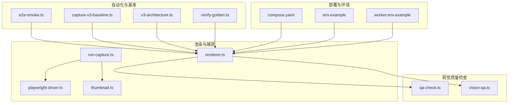
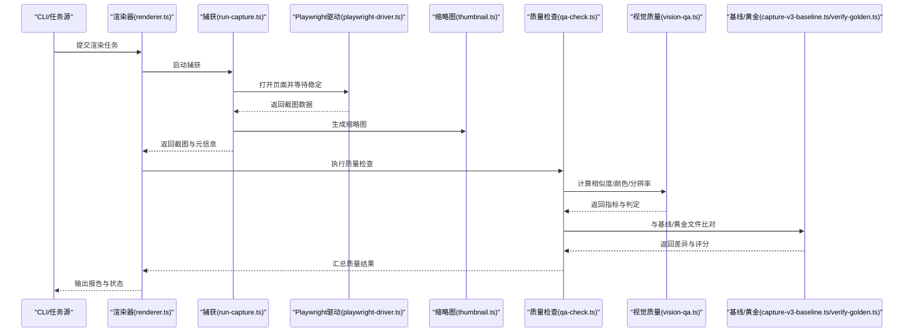
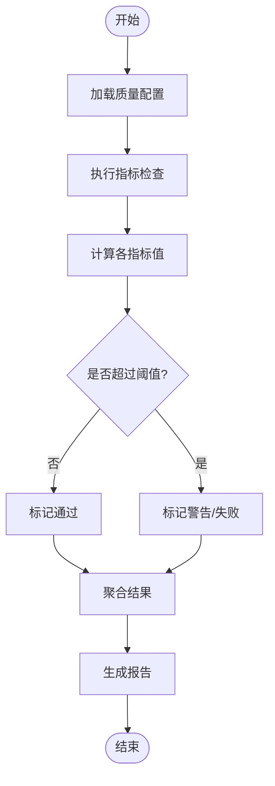
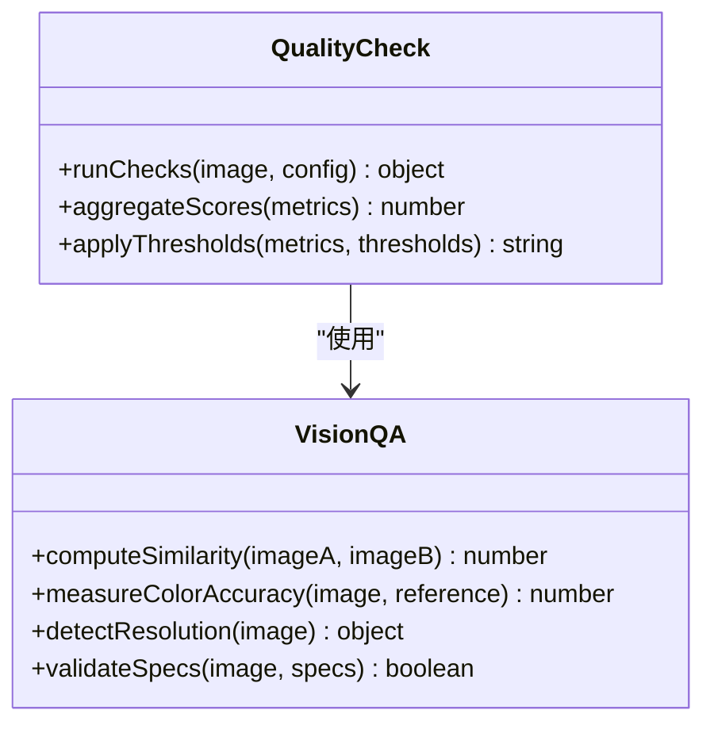
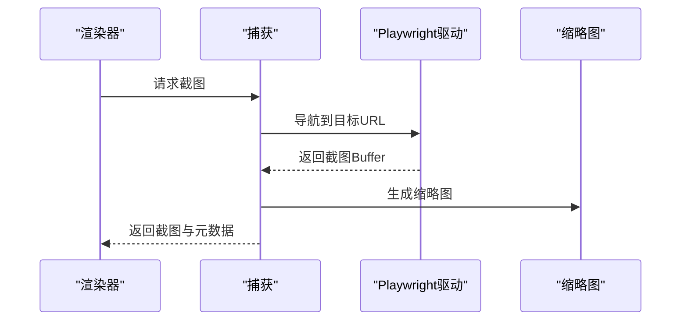
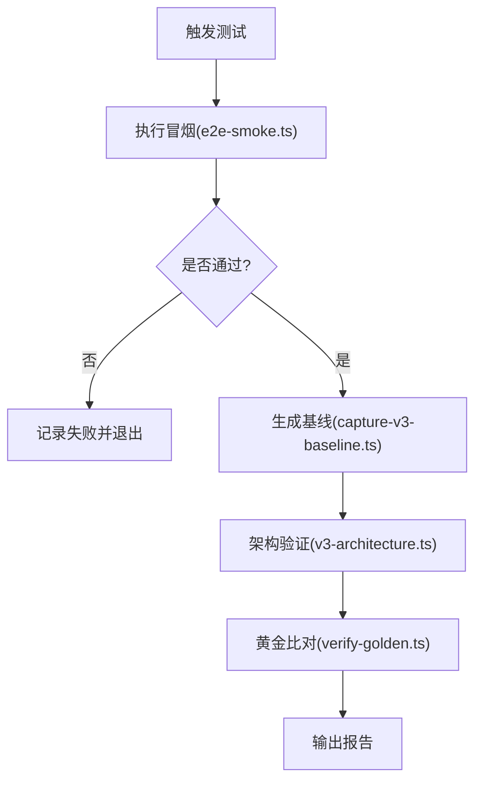
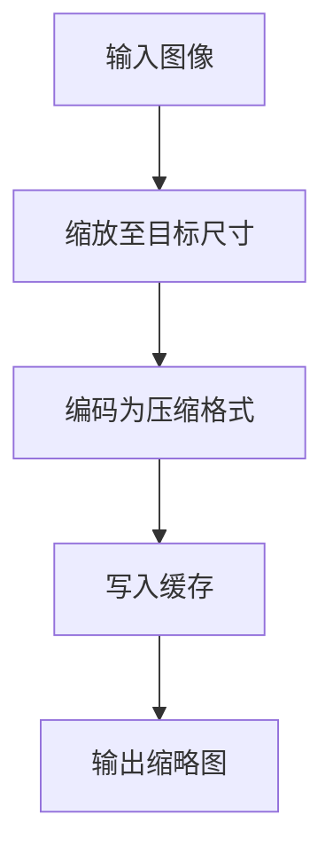
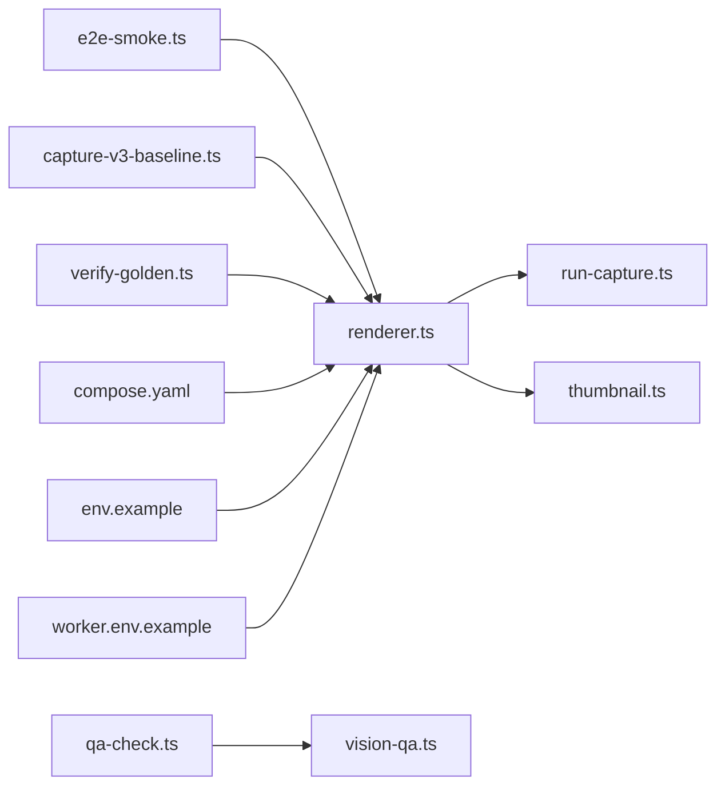

# 质量控制与验证

<cite>
**本文引用的文件**   
- [server/src/capture/playwright-driver.ts](file://server/src/capture/playwright-driver.ts)
- [server/src/capture/run-capture.ts](file://server/src/capture/run-capture.ts)
- [src/features/render/qa-check.ts](file://src/features/render/qa-check.ts)
- [src/features/render/vision-qa.ts](file://src/features/render/vision-qa.ts)
- [src/features/render/thumbnail.ts](file://src/features/render/thumbnail.ts)
- [src/features/render/cache.ts](file://src/features/render/cache.ts)
- [src/features/render/renderer.ts](file://src/features/render/renderer.ts)
- [scripts/verify/e2e-smoke.ts](file://scripts/verify/e2e-smoke.ts)
- [scripts/verify/capture-v3-baseline.ts](file://scripts/verify/capture-v3-baseline.ts)
- [scripts/verify/v3-architecture.ts](file://scripts/verify/v3-architecture.ts)
- [server/scripts/verify-golden.ts](file://server/scripts/verify-golden.ts)
- [server/scripts/render-capture.ts](file://server/scripts/render-capture.ts)
- [deploy/compose.yaml](file://deploy/compose.yaml)
- [deploy/env.example](file://deploy/env.example)
- [deploy/worker.env.example](file://deploy/worker.env.example)
</cite>

## 目录
1. [简介](#简介)
2. [项目结构](#项目结构)
3. [核心组件](#核心组件)
4. [架构总览](#架构总览)
5. [详细组件分析](#详细组件分析)
6. [依赖关系分析](#依赖关系分析)
7. [性能考虑](#性能考虑)
8. [故障排查指南](#故障排查指南)
9. [结论](#结论)
10. [附录](#附录)

## 简介
本技术文档面向 PurpleInK 平台的质量控制系统，聚焦视觉质量检查算法、图像相似度比较、色彩准确性验证与分辨率检测。文档同时覆盖自动化测试流程、基准对比、异常检测与报告生成；解释质量阈值配置、自定义规则定义与批量验证策略；并提供配置示例以展示如何设置质量标准、集成第三方工具与扩展验证规则。最后给出性能优化、缓存策略与结果存储方案建议。

## 项目结构
质量相关能力主要分布在以下模块：
- 渲染与捕获：负责页面渲染、截图采集与缩略图生成
- 视觉质量检查：提供图像相似度、颜色与分辨率等指标计算与判定
- 自动化测试与基准：端到端冒烟脚本、基线捕获与比对
- 部署与环境：容器编排与环境变量模板，支撑批处理与并行执行

图表来源
- [src/features/render/renderer.ts](file://src/features/render/renderer.ts)
- [server/src/capture/run-capture.ts](file://server/src/capture/run-capture.ts)
- [server/src/capture/playwright-driver.ts](file://server/src/capture/playwright-driver.ts)
- [src/features/render/thumbnail.ts](file://src/features/render/thumbnail.ts)
- [src/features/render/qa-check.ts](file://src/features/render/qa-check.ts)
- [src/features/render/vision-qa.ts](file://src/features/render/vision-qa.ts)
- [scripts/verify/e2e-smoke.ts](file://scripts/verify/e2e-smoke.ts)
- [scripts/verify/capture-v3-baseline.ts](file://scripts/verify/capture-v3-baseline.ts)
- [scripts/verify/v3-architecture.ts](file://scripts/verify/v3-architecture.ts)
- [server/scripts/verify-golden.ts](file://server/scripts/verify-golden.ts)
- [deploy/compose.yaml](file://deploy/compose.yaml)
- [deploy/env.example](file://deploy/env.example)
- [deploy/worker.env.example](file://deploy/worker.env.example)

章节来源
- [src/features/render/renderer.ts](file://src/features/render/renderer.ts)
- [server/src/capture/run-capture.ts](file://server/src/capture/run-capture.ts)
- [server/src/capture/playwright-driver.ts](file://server/src/capture/playwright-driver.ts)
- [src/features/render/thumbnail.ts](file://src/features/render/thumbnail.ts)
- [src/features/render/qa-check.ts](file://src/features/render/qa-check.ts)
- [src/features/render/vision-qa.ts](file://src/features/render/vision-qa.ts)
- [scripts/verify/e2e-smoke.ts](file://scripts/verify/e2e-smoke.ts)
- [scripts/verify/capture-v3-baseline.ts](file://scripts/verify/capture-v3-baseline.ts)
- [scripts/verify/v3-architecture.ts](file://scripts/verify/v3-architecture.ts)
- [server/scripts/verify-golden.ts](file://server/scripts/verify-golden.ts)
- [deploy/compose.yaml](file://deploy/compose.yaml)
- [deploy/env.example](file://deploy/env.example)
- [deploy/worker.env.example](file://deploy/worker.env.example)

## 核心组件
- 渲染器（renderer.ts）：协调页面渲染、截图与后续质量检查的入口，封装任务调度与结果聚合。
- 捕获驱动（playwright-driver.ts, run-capture.ts）：基于 Playwright 的浏览器驱动与运行器，负责实际截图与资源加载控制。
- 缩略图（thumbnail.ts）：生成预览缩略图，用于快速浏览与回归对比。
- 质量检查（qa-check.ts）：统一的质量校验编排，支持多指标组合与阈值判定。
- 视觉质量（vision-qa.ts）：实现图像相似度、颜色分布与分辨率等视觉指标的计算与评估。
- 自动化与基准（e2e-smoke.ts, capture-v3-baseline.ts, v3-architecture.ts, verify-golden.ts）：端到端冒烟、基线捕获与黄金文件比对。

章节来源
- [src/features/render/renderer.ts](file://src/features/render/renderer.ts)
- [server/src/capture/playwright-driver.ts](file://server/src/capture/playwright-driver.ts)
- [server/src/capture/run-capture.ts](file://server/src/capture/run-capture.ts)
- [src/features/render/thumbnail.ts](file://src/features/render/thumbnail.ts)
- [src/features/render/qa-check.ts](file://src/features/render/qa-check.ts)
- [src/features/render/vision-qa.ts](file://src/features/render/vision-qa.ts)
- [scripts/verify/e2e-smoke.ts](file://scripts/verify/e2e-smoke.ts)
- [scripts/verify/capture-v3-baseline.ts](file://scripts/verify/capture-v3-baseline.ts)
- [scripts/verify/v3-architecture.ts](file://scripts/verify/v3-architecture.ts)
- [server/scripts/verify-golden.ts](file://server/scripts/verify-golden.ts)

## 架构总览
质量控制的总体流程如下：
- 输入：待测页面或渲染任务
- 渲染与截图：通过 Playwright 驱动进行页面渲染与截图
- 质量检查：对截图执行视觉质量检查（相似度、颜色、分辨率等）
- 基准对比：与基线或黄金文件进行比对
- 结果输出：生成报告与指标，供后续分析与决策

图表来源
- [src/features/render/renderer.ts](file://src/features/render/renderer.ts)
- [server/src/capture/run-capture.ts](file://server/src/capture/run-capture.ts)
- [server/src/capture/playwright-driver.ts](file://server/src/capture/playwright-driver.ts)
- [src/features/render/thumbnail.ts](file://src/features/render/thumbnail.ts)
- [src/features/render/qa-check.ts](file://src/features/render/qa-check.ts)
- [src/features/render/vision-qa.ts](file://src/features/render/vision-qa.ts)
- [scripts/verify/capture-v3-baseline.ts](file://scripts/verify/capture-v3-baseline.ts)
- [server/scripts/verify-golden.ts](file://server/scripts/verify-golden.ts)

## 详细组件分析

### 视觉质量检查（qa-check.ts）
- 职责：编排各项质量指标的检查流程，支持阈值配置与规则组合，输出结构化结果。
- 关键能力：
  - 指标聚合：将相似度、颜色偏差、分辨率等指标合并为统一质量分数
  - 阈值判定：根据配置决定通过/警告/失败
  - 可扩展规则：允许注入自定义检查逻辑
- 典型流程：
  - 接收截图与元数据
  - 调用视觉质量模块计算指标
  - 应用阈值与规则
  - 生成质量报告

图表来源
- [src/features/render/qa-check.ts](file://src/features/render/qa-check.ts)
- [src/features/render/vision-qa.ts](file://src/features/render/vision-qa.ts)

章节来源
- [src/features/render/qa-check.ts](file://src/features/render/qa-check.ts)
- [src/features/render/vision-qa.ts](file://src/features/render/vision-qa.ts)

### 视觉质量算法（vision-qa.ts）
- 职责：实现图像相似度比较、色彩准确性验证与分辨率检测。
- 关键能力：
  - 图像相似度：支持像素级与感知哈希等方法，输出相似度分数
  - 色彩准确性：统计直方图与色差指标，评估颜色偏移
  - 分辨率检测：读取图像尺寸与 DPI，判断是否符合目标规格
- 输出：结构化指标对象，便于 qa-check 进行阈值判定

图表来源
- [src/features/render/vision-qa.ts](file://src/features/render/vision-qa.ts)
- [src/features/render/qa-check.ts](file://src/features/render/qa-check.ts)

章节来源
- [src/features/render/vision-qa.ts](file://src/features/render/vision-qa.ts)
- [src/features/render/qa-check.ts](file://src/features/render/qa-check.ts)

### 渲染与捕获（renderer.ts, run-capture.ts, playwright-driver.ts）
- 职责：协调页面渲染、截图与缩略图生成，为质量检查提供输入。
- 关键点：
  - 渲染器负责任务编排与结果聚合
  - 捕获驱动基于 Playwright 管理浏览器生命周期与截图
  - 缩略图用于快速预览与回归对比

图表来源
- [src/features/render/renderer.ts](file://src/features/render/renderer.ts)
- [server/src/capture/run-capture.ts](file://server/src/capture/run-capture.ts)
- [server/src/capture/playwright-driver.ts](file://server/src/capture/playwright-driver.ts)
- [src/features/render/thumbnail.ts](file://src/features/render/thumbnail.ts)

章节来源
- [src/features/render/renderer.ts](file://src/features/render/renderer.ts)
- [server/src/capture/run-capture.ts](file://server/src/capture/run-capture.ts)
- [server/src/capture/playwright-driver.ts](file://server/src/capture/playwright-driver.ts)
- [src/features/render/thumbnail.ts](file://src/features/render/thumbnail.ts)

### 自动化测试与基准（e2e-smoke.ts, capture-v3-baseline.ts, v3-architecture.ts, verify-golden.ts）
- 端到端冒烟（e2e-smoke.ts）：快速验证关键路径可用性
- 基线捕获（capture-v3-baseline.ts）：生成基准截图与元数据
- 架构验证（v3-architecture.ts）：针对特定架构场景的验证脚本
- 黄金文件比对（verify-golden.ts）：与黄金文件进行严格比对，确保回归稳定性

图表来源
- [scripts/verify/e2e-smoke.ts](file://scripts/verify/e2e-smoke.ts)
- [scripts/verify/capture-v3-baseline.ts](file://scripts/verify/capture-v3-baseline.ts)
- [scripts/verify/v3-architecture.ts](file://scripts/verify/v3-architecture.ts)
- [server/scripts/verify-golden.ts](file://server/scripts/verify-golden.ts)

章节来源
- [scripts/verify/e2e-smoke.ts](file://scripts/verify/e2e-smoke.ts)
- [scripts/verify/capture-v3-baseline.ts](file://scripts/verify/capture-v3-baseline.ts)
- [scripts/verify/v3-architecture.ts](file://scripts/verify/v3-architecture.ts)
- [server/scripts/verify-golden.ts](file://server/scripts/verify-golden.ts)

### 缩略图与缓存（thumbnail.ts, cache.ts）
- 缩略图：生成轻量预览图，提升交互与对比效率
- 缓存：对渲染结果与中间产物进行缓存，减少重复计算

图表来源
- [src/features/render/thumbnail.ts](file://src/features/render/thumbnail.ts)
- [src/features/render/cache.ts](file://src/features/render/cache.ts)

章节来源
- [src/features/render/thumbnail.ts](file://src/features/render/thumbnail.ts)
- [src/features/render/cache.ts](file://src/features/render/cache.ts)

## 依赖关系分析
质量控制系统的关键依赖包括：
- 渲染器依赖捕获驱动与缩略图生成
- 质量检查依赖视觉质量算法
- 自动化脚本依赖渲染器与基线/黄金文件
- 部署环境通过容器编排与环境变量配置支撑并行与隔离

图表来源
- [src/features/render/renderer.ts](file://src/features/render/renderer.ts)
- [server/src/capture/run-capture.ts](file://server/src/capture/run-capture.ts)
- [src/features/render/thumbnail.ts](file://src/features/render/thumbnail.ts)
- [src/features/render/qa-check.ts](file://src/features/render/qa-check.ts)
- [src/features/render/vision-qa.ts](file://src/features/render/vision-qa.ts)
- [scripts/verify/e2e-smoke.ts](file://scripts/verify/e2e-smoke.ts)
- [scripts/verify/capture-v3-baseline.ts](file://scripts/verify/capture-v3-baseline.ts)
- [server/scripts/verify-golden.ts](file://server/scripts/verify-golden.ts)
- [deploy/compose.yaml](file://deploy/compose.yaml)
- [deploy/env.example](file://deploy/env.example)
- [deploy/worker.env.example](file://deploy/worker.env.example)

章节来源
- [src/features/render/renderer.ts](file://src/features/render/renderer.ts)
- [server/src/capture/run-capture.ts](file://server/src/capture/run-capture.ts)
- [src/features/render/thumbnail.ts](file://src/features/render/thumbnail.ts)
- [src/features/render/qa-check.ts](file://src/features/render/qa-check.ts)
- [src/features/render/vision-qa.ts](file://src/features/render/vision-qa.ts)
- [scripts/verify/e2e-smoke.ts](file://scripts/verify/e2e-smoke.ts)
- [scripts/verify/capture-v3-baseline.ts](file://scripts/verify/capture-v3-baseline.ts)
- [server/scripts/verify-golden.ts](file://server/scripts/verify-golden.ts)
- [deploy/compose.yaml](file://deploy/compose.yaml)
- [deploy/env.example](file://deploy/env.example)
- [deploy/worker.env.example](file://deploy/worker.env.example)

## 性能考虑
- 渲染与截图：
  - 合理设置浏览器并发与超时，避免资源争用
  - 启用网络与资源预加载，缩短首帧时间
- 图像处理：
  - 缩略图采用有损压缩与固定尺寸，降低内存与CPU占用
  - 相似度计算优先使用感知哈希或降采样策略
- 缓存策略：
  - 对渲染结果与中间产物进行键控缓存，避免重复计算
  - 结合失效策略（TTL、LRU）平衡命中率与一致性
- 结果存储：
  - 指标与报告持久化至数据库或对象存储，便于检索与分析
  - 大文件（截图）采用分片与压缩存储

[本节为通用指导，不直接分析具体文件]

## 故障排查指南
- 渲染失败：
  - 检查浏览器驱动与页面加载状态
  - 确认网络与资源可达性
- 质量检查异常：
  - 核对阈值配置与指标计算逻辑
  - 查看中间产物与日志定位问题
- 基准比对失败：
  - 确认基线与黄金文件版本一致
  - 检查图像尺寸与编码格式差异

章节来源
- [server/src/capture/playwright-driver.ts](file://server/src/capture/playwright-driver.ts)
- [server/src/capture/run-capture.ts](file://server/src/capture/run-capture.ts)
- [src/features/render/qa-check.ts](file://src/features/render/qa-check.ts)
- [src/features/render/vision-qa.ts](file://src/features/render/vision-qa.ts)
- [scripts/verify/capture-v3-baseline.ts](file://scripts/verify/capture-v3-baseline.ts)
- [server/scripts/verify-golden.ts](file://server/scripts/verify-golden.ts)

## 结论
PurpleInK 平台的质量控制系统围绕渲染、截图、视觉质量检查与基准比对构建，具备可配置的阈值与可扩展的规则体系。通过合理的性能优化、缓存策略与结果存储方案，可实现高效稳定的质量保障。建议在持续集成中集成自动化测试与基准对比，确保每次变更的可追溯性与回归稳定性。

[本节为总结性内容，不直接分析具体文件]

## 附录
- 配置示例要点：
  - 质量阈值：在质量检查配置中定义各指标的上下限
  - 自定义规则：在质量检查模块中注册新的检查函数
  - 批量验证：通过任务队列与并发控制执行大规模验证
  - 第三方工具：在视觉质量模块中集成外部库（如图像处理SDK）
- 部署与环境：
  - 使用 compose.yaml 编排服务与资源限制
  - 通过 env.example 与 worker.env.example 管理环境变量

章节来源
- [src/features/render/qa-check.ts](file://src/features/render/qa-check.ts)
- [src/features/render/vision-qa.ts](file://src/features/render/vision-qa.ts)
- [deploy/compose.yaml](file://deploy/compose.yaml)
- [deploy/env.example](file://deploy/env.example)
- [deploy/worker.env.example](file://deploy/worker.env.example)