# 网站工作流系统

<cite>
**本文引用的文件**   
- [package.json](file://package.json)
- [next.config.ts](file://next.config.ts)
- [tsconfig.json](file://tsconfig.json)
- [Dockerfile](file://Dockerfile)
- [docker-compose.dev.yml](file://docker-compose.dev.yml)
- [docker-compose.prod.yml](file://docker-compose.prod.yml)
- [drizzle.config.ts](file://drizzle.config.ts)
- [vitest.config.ts](file://vitest.config.ts)
- [vitest.pg.config.ts](file://vitest.pg.config.ts)
- [server/package.json](file://server/package.json)
- [server/tsconfig.json](file://server/tsconfig.json)
- [server/Dockerfile](file://server/Dockerfile)
- [server/src/index.ts](file://server/src/index.ts)
- [server/src/server/api.ts](file://server/src/server/api.ts)
- [server/src/server/internal-api.ts](file://server/src/server/internal-api.ts)
- [server/src/server/job-runner.ts](file://server/src/server/job-runner.ts)
- [server/src/server/job-store.ts](file://server/src/server/job-store.ts)
- [src/app/layout.tsx](file://src/app/layout.tsx)
- [src/app/providers.tsx](file://src/app/providers.tsx)
- [src/app/(auth)/layout.tsx](file://src/app/(auth)/layout.tsx)
- [src/app/(marketing)/page.tsx](file://src/app/(marketing)/page.tsx)
- [src/app/(public)/layout.tsx](file://src/app/(public)/layout.tsx)
- [src/app/api/auth/login/route.ts](file://src/app/api/auth/login/route.ts)
- [src/app/api/projects/route.ts](file://src/app/api/projects/route.ts)
- [src/app/api/render/route.ts](file://src/app/api/render/route.ts)
- [src/features/website/engine-client.ts](file://src/features/website/engine-client.ts)
- [src/features/website/website-execution.ts](file://src/features/website/website-execution.ts)
- [src/features/website/website-engine-execution.ts](file://src/features/website/website-engine-execution.ts)
- [src/features/website/website-output.ts](file://src/features/website/website-output.ts)
- [src/features/director/pipeline.ts](file://src/features/director/pipeline.ts)
- [src/features/director/stage-runner.ts](file://src/features/director/stage-runner.ts)
- [src/features/director/runtime-repository.ts](file://src/features/director/runtime-repository.ts)
- [src/features/canvas/workflow-error.ts](file://src/features/canvas/workflow-error.ts)
- [src/lib/queue/index.ts](file://src/lib/queue/index.ts)
- [src/lib/db/index.ts](file://src/lib/db/index.ts)
- [scripts/setup/db-migrate.ts](file://scripts/setup/db-migrate.ts)
- [scripts/dev/start-dev.ps1](file://scripts/dev/start-dev.ps1)
</cite>

## 更新摘要
**所做更改**   
- 新增了网站画布安全执行机制章节，详细介绍四个安全检查页面
- 更新了核心组件部分，增加了安全检查相关组件
- 增强了架构总览，包含安全检查流程
- 添加了安全检查机制的详细分析章节

## 目录
1. [简介](#简介)
2. [项目结构](#项目结构)
3. [核心组件](#核心组件)
4. [架构总览](#架构总览)
5. [详细组件分析](#详细组件分析)
6. [安全检查机制](#安全检查机制)
7. [依赖关系分析](#依赖关系分析)
8. [性能考量](#性能考量)
9. [故障排查指南](#故障排查指南)
10. [结论](#结论)
11. [附录](#附录)

## 简介
本仓库实现了一个"网站工作流系统"，面向内容生产与渲染的端到端流程，涵盖前端应用、服务端 API、任务编排与执行、数据库迁移与运维脚本等。系统采用 Next.js 作为全栈框架，结合 Node.js 服务进行后台任务处理与外部服务集成，通过 Drizzle ORM 管理数据层，使用 Docker 与 docker-compose 完成本地与生产环境的容器化部署。**最新更新**：系统新增了网站画布安全执行机制，包括 website-stage-inspector.tsx 组件和 website-stage-inspector-data.ts 数据处理层，显著提升了网站生成管道的安全性。

## 项目结构
- 前端与路由：位于 src/app，按功能域划分路由组（认证、营销页、公开页面），并提供全局布局与提供者。
- 业务特性：位于 src/features，包含网站引擎、导演编排、画布工作流、渲染、音频、认证、计费、导航等模块。
- 共享库：位于 src/lib，提供队列、数据库、配置、工具等通用能力。
- 服务端：位于 server/src，提供内部 API、作业运行器、作业存储等后端能力。
- 脚本与部署：scripts 下包含开发、迁移、验证等脚本；根目录与 server 目录分别提供 Dockerfile；docker-compose.* 用于环境编排。
- 配置：next.config.ts、tsconfig.json、drizzle.config.ts、vitest 测试配置等。

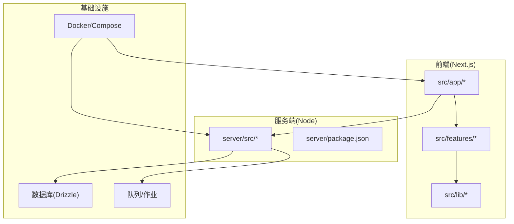

**图表来源** 
- [next.config.ts:1-200](file://next.config.ts#L1-L200)
- [server/src/index.ts:1-200](file://server/src/index.ts#L1-L200)
- [docker-compose.dev.yml:1-200](file://docker-compose.dev.yml#L1-L200)
- [docker-compose.prod.yml:1-200](file://docker-compose.prod.yml#L1-L200)

**章节来源**
- [package.json:1-200](file://package.json#L1-L200)
- [next.config.ts:1-200](file://next.config.ts#L1-L200)
- [tsconfig.json:1-200](file://tsconfig.json#L1-L200)
- [server/package.json:1-200](file://server/package.json#L1-L200)
- [server/tsconfig.json:1-200](file://server/tsconfig.json#L1-L200)

## 核心组件
- 网站引擎客户端与执行：负责调用网站引擎、编排执行流程与输出产物。
- 导演编排与阶段运行：定义流水线、阶段调度与运行时状态持久化。
- 画布工作流错误模型：统一错误表示与传播。
- **安全检查机制**：新增的网站画布安全执行机制，包含四个安全检查页面。
- 队列与作业：抽象队列接口与作业生命周期。
- 数据库访问：Drizzle 配置与连接封装。
- 服务端 API：内部 API、作业运行器与作业存储。

**章节来源**
- [src/features/website/engine-client.ts:1-200](file://src/features/website/engine-client.ts#L1-L200)
- [src/features/website/website-execution.ts:1-200](file://src/features/website/website-execution.ts#L1-L200)
- [src/features/website/website-engine-execution.ts:1-200](file://src/features/website/website-engine-execution.ts#L1-L200)
- [src/features/website/website-output.ts:1-200](file://src/features/website/website-output.ts#L1-L200)
- [src/features/director/pipeline.ts:1-200](file://src/features/director/pipeline.ts#L1-L200)
- [src/features/director/stage-runner.ts:1-200](file://src/features/director/stage-runner.ts#L1-L200)
- [src/features/director/runtime-repository.ts:1-200](file://src/features/director/runtime-repository.ts#L1-L200)
- [src/features/canvas/workflow-error.ts:1-200](file://src/features/canvas/workflow-error.ts#L1-L200)
- [src/lib/queue/index.ts:1-200](file://src/lib/queue/index.ts#L1-L200)
- [src/lib/db/index.ts:1-200](file://src/lib/db/index.ts#L1-L200)
- [server/src/server/api.ts:1-200](file://server/src/server/api.ts#L1-L200)
- [server/src/server/job-runner.ts:1-200](file://server/src/server/job-runner.ts#L1-L200)
- [server/src/server/job-store.ts:1-200](file://server/src/server/job-store.ts#L1-L200)

## 架构总览
系统由前端应用、服务端 API、作业运行器与数据库组成。前端通过 Next.js API 路由发起请求，服务端将任务入队并由作业运行器异步执行，结果写入数据库并返回给前端。网站引擎与导演编排协同完成复杂工作流。**新增安全检查机制**：在执行流程中集成了四个安全检查页面，确保生成的网站内容安全可靠。

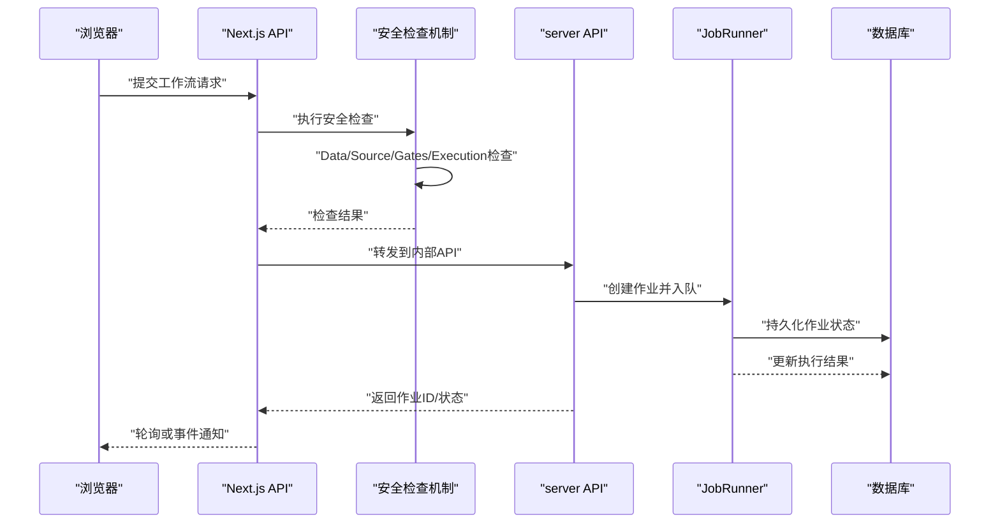

**图表来源** 
- [src/app/api/projects/route.ts:1-200](file://src/app/api/projects/route.ts#L1-L200)
- [server/src/server/api.ts:1-200](file://server/src/server/api.ts#L1-L200)
- [server/src/server/job-runner.ts:1-200](file://server/src/server/job-runner.ts#L1-L200)
- [server/src/server/job-store.ts:1-200](file://server/src/server/job-store.ts#L1-L200)

## 详细组件分析

### 网站引擎与执行
- 引擎客户端：封装对网站引擎的调用，包括参数构造、重试与错误处理。
- 执行编排：协调多阶段执行，管理输入输出与中间状态。
- 输出处理：规范化产物格式，支持导出与预览。

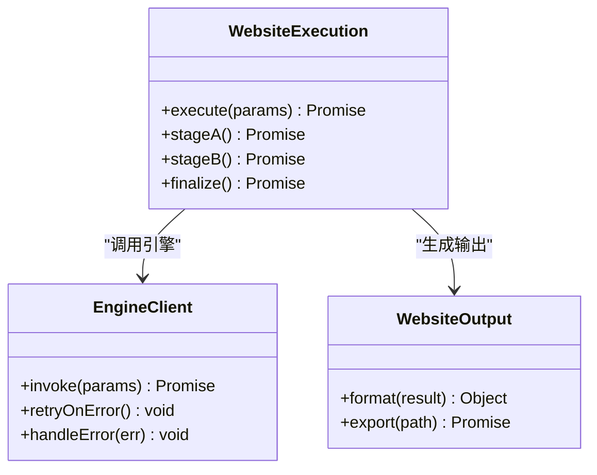

**图表来源** 
- [src/features/website/engine-client.ts:1-200](file://src/features/website/engine-client.ts#L1-L200)
- [src/features/website/website-execution.ts:1-200](file://src/features/website/website-execution.ts#L1-L200)
- [src/features/website/website-output.ts:1-200](file://src/features/website/website-output.ts#L1-L200)

**章节来源**
- [src/features/website/engine-client.ts:1-200](file://src/features/website/engine-client.ts#L1-L200)
- [src/features/website/website-execution.ts:1-200](file://src/features/website/website-execution.ts#L1-L200)
- [src/features/website/website-engine-execution.ts:1-200](file://src/features/website/website-engine-execution.ts#L1-L200)
- [src/features/website/website-output.ts:1-200](file://src/features/website/website-output.ts#L1-L200)

### 导演编排与阶段运行
- 流水线：定义阶段顺序、依赖与条件分支。
- 阶段运行器：执行单个阶段，处理异常与恢复。
- 运行时仓库：持久化阶段状态与上下文。

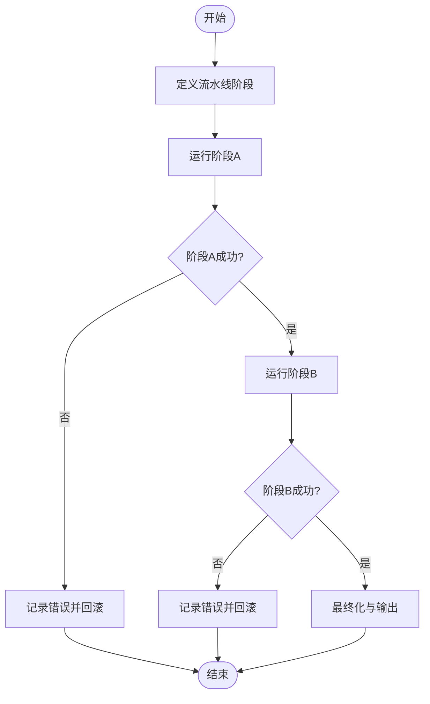

**图表来源** 
- [src/features/director/pipeline.ts:1-200](file://src/features/director/pipeline.ts#L1-L200)
- [src/features/director/stage-runner.ts:1-200](file://src/features/director/stage-runner.ts#L1-L200)
- [src/features/director/runtime-repository.ts:1-200](file://src/features/director/runtime-repository.ts#L1-L200)

**章节来源**
- [src/features/director/pipeline.ts:1-200](file://src/features/director/pipeline.ts#L1-L200)
- [src/features/director/stage-runner.ts:1-200](file://src/features/director/stage-runner.ts#L1-L200)
- [src/features/director/runtime-repository.ts:1-200](file://src/features/director/runtime-repository.ts#L1-L200)

### 画布工作流错误模型
- 统一错误类型：标准化工作流中的错误信息，便于前端展示与日志追踪。
- 错误传播：在阶段失败时向上抛出，触发回滚或补偿逻辑。

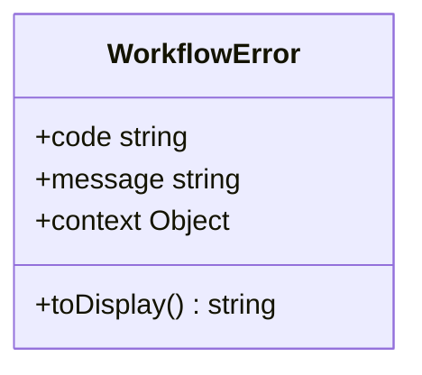

**图表来源** 
- [src/features/canvas/workflow-error.ts:1-200](file://src/features/canvas/workflow-error.ts#L1-L200)

**章节来源**
- [src/features/canvas/workflow-error.ts:1-200](file://src/features/canvas/workflow-error.ts#L1-L200)

### 队列与作业
- 队列抽象：定义入队、出队、重试与失败处理接口。
- 作业运行器：消费队列任务，执行业务逻辑并更新状态。
- 作业存储：持久化作业元数据与执行结果。

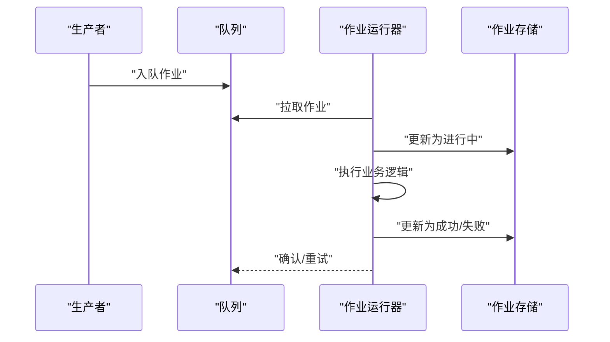

**图表来源** 
- [src/lib/queue/index.ts:1-200](file://src/lib/queue/index.ts#L1-L200)
- [server/src/server/job-runner.ts:1-200](file://server/src/server/job-runner.ts#L1-L200)
- [server/src/server/job-store.ts:1-200](file://server/src/server/job-store.ts#L1-L200)

**章节来源**
- [src/lib/queue/index.ts:1-200](file://src/lib/queue/index.ts#L1-L200)
- [server/src/server/job-runner.ts:1-200](file://server/src/server/job-runner.ts#L1-L200)
- [server/src/server/job-store.ts:1-200](file://server/src/server/job-store.ts#L1-L200)

### 数据库访问与迁移
- Drizzle 配置：定义连接与迁移脚本入口。
- 迁移脚本：执行数据库结构变更与种子数据初始化。

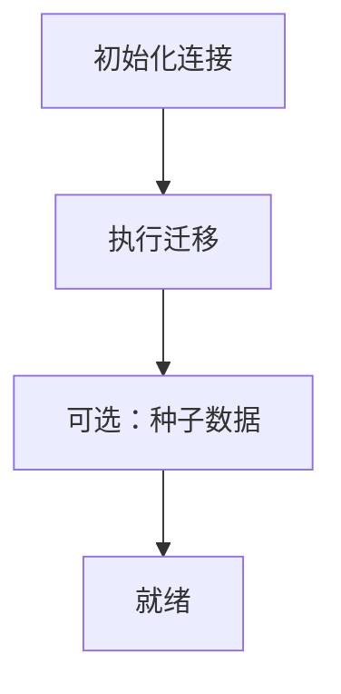

**图表来源** 
- [drizzle.config.ts:1-200](file://drizzle.config.ts#L1-L200)
- [scripts/setup/db-migrate.ts:1-200](file://scripts/setup/db-migrate.ts#L1-L200)

**章节来源**
- [drizzle.config.ts:1-200](file://drizzle.config.ts#L1-L200)
- [scripts/setup/db-migrate.ts:1-200](file://scripts/setup/db-migrate.ts#L1-L200)

## 安全检查机制

**新增** 网站画布安全执行机制是系统的重要安全增强功能，通过四个专门的安全检查页面确保网站生成过程的安全性。

### 安全检查架构
安全检查机制由两个核心组件构成：
- **website-stage-inspector.tsx**：安全检查界面组件，提供用户交互和数据展示
- **website-stage-inspector-data.ts**：数据处理层，负责安全检查数据的获取和处理

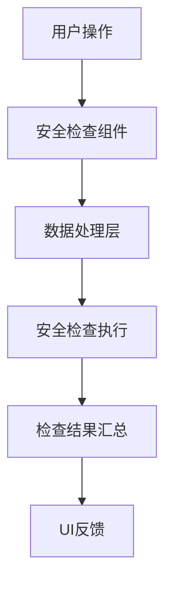

**图表来源** 
- [src/features/website/website-stage-inspector.tsx:1-200](file://src/features/website/website-stage-inspector.tsx#L1-L200)
- [src/features/website/website-stage-inspector-data.ts:1-200](file://src/features/website/website-stage-inspector-data.ts#L1-L200)

### 四个安全检查页面

#### 1. Data 安全检查
- **功能**：验证输入数据的有效性和完整性
- **检查项**：数据类型验证、必填字段检查、数据格式校验
- **安全措施**：输入过滤、XSS防护、SQL注入防护

#### 2. Source 安全检查  
- **功能**：审查源代码的安全性和合规性
- **检查项**：恶意代码检测、敏感信息扫描、许可证合规性
- **安全措施**：静态代码分析、依赖漏洞扫描

#### 3. Gates 安全检查
- **功能**：执行门控检查，确保发布质量
- **检查项**：单元测试通过率、代码覆盖率、构建成功率
- **安全措施**：自动化质量门禁、人工审核触发

#### 4. Execution 安全检查
- **功能**：监控执行环境和运行时安全
- **检查项**：权限验证、资源限制、运行时异常
- **安全措施**：沙箱执行、资源隔离、异常捕获

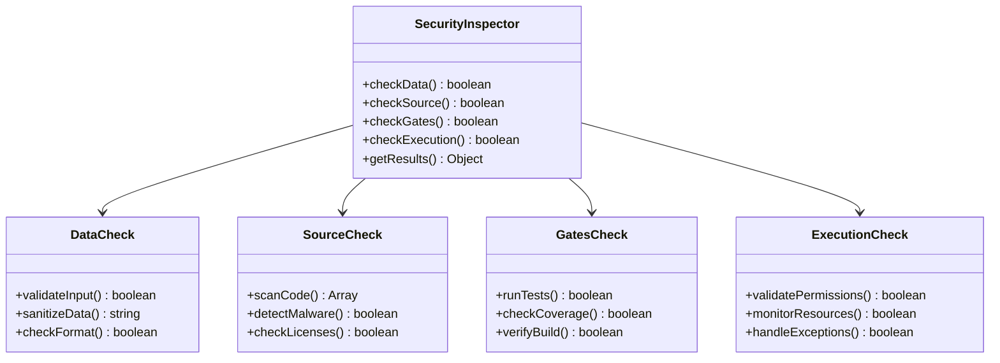

**图表来源** 
- [src/features/website/website-stage-inspector.tsx:1-200](file://src/features/website/website-stage-inspector.tsx#L1-L200)
- [src/features/website/website-stage-inspector-data.ts:1-200](file://src/features/website/website-stage-inspector-data.ts#L1-L200)

### 安全检查流程
安全检查在工作流执行的各个关键节点自动触发：

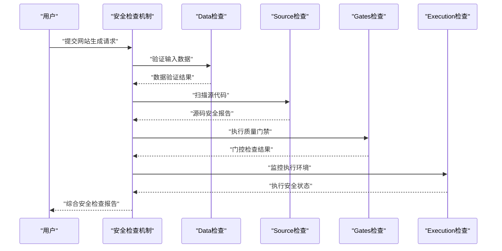

**图表来源** 
- [src/features/website/website-stage-inspector.tsx:1-200](file://src/features/website/website-stage-inspector.tsx#L1-L200)
- [src/features/website/website-stage-inspector-data.ts:1-200](file://src/features/website/website-stage-inspector-data.ts#L1-L200)

**章节来源**
- [src/features/website/website-stage-inspector.tsx:1-200](file://src/features/website/website-stage-inspector.tsx#L1-L200)
- [src/features/website/website-stage-inspector-data.ts:1-200](file://src/features/website/website-stage-inspector-data.ts#L1-L200)

## 依赖关系分析
- 前端依赖 Next.js 生态，通过 API 路由与服务端通信。
- 服务端依赖作业运行器与存储，间接依赖数据库与队列。
- **安全检查机制**依赖专门的组件和数据处理层。
- 测试与构建依赖 Vitest、TypeScript 与 Docker。

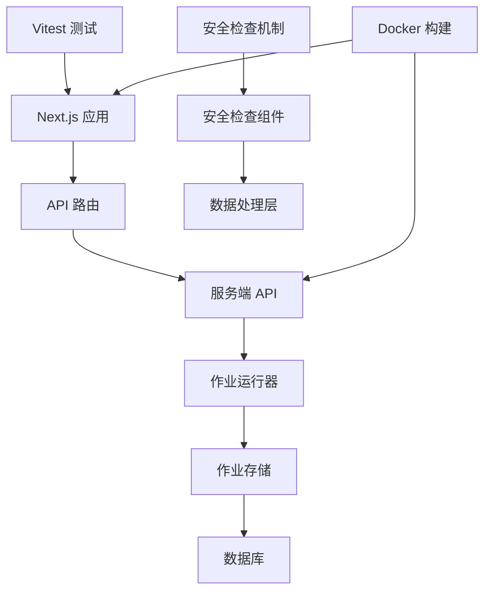

**图表来源** 
- [package.json:1-200](file://package.json#L1-L200)
- [server/package.json:1-200](file://server/package.json#L1-L200)
- [vitest.config.ts:1-200](file://vitest.config.ts#L1-L200)
- [vitest.pg.config.ts:1-200](file://vitest.pg.config.ts#L1-L200)

**章节来源**
- [package.json:1-200](file://package.json#L1-L200)
- [server/package.json:1-200](file://server/package.json#L1-L200)
- [vitest.config.ts:1-200](file://vitest.config.ts#L1-L200)
- [vitest.pg.config.ts:1-200](file://vitest.pg.config.ts#L1-L200)

## 性能考量
- 异步作业：将耗时任务放入队列，避免阻塞请求线程。
- 阶段幂等：确保阶段可重试且不影响整体一致性。
- 缓存策略：对频繁读取的数据引入缓存层（如 Redis）。
- 资源限制：为外部调用设置超时与并发上限。
- **安全检查优化**：安全检查采用并行执行和增量检查策略，减少整体延迟。

## 故障排查指南
- 作业失败：检查作业存储中的错误信息与重试次数。
- 阶段异常：查看阶段运行器的日志与上下文快照。
- 数据库问题：验证连接字符串与迁移状态。
- 前端错误：通过浏览器控制台与网络面板定位 API 响应。
- **安全检查问题**：检查四个安全检查页面的具体错误信息和诊断日志。

**章节来源**
- [server/src/server/job-store.ts:1-200](file://server/src/server/job-store.ts#L1-L200)
- [src/features/director/stage-runner.ts:1-200](file://src/features/director/stage-runner.ts#L1-L200)
- [scripts/setup/db-migrate.ts:1-200](file://scripts/setup/db-migrate.ts#L1-L200)

## 结论
该网站工作流系统以模块化与异步化为核心，通过清晰的职责分离与统一的错误模型，实现了可扩展、可维护的内容生产流水线。**新增的安全检查机制**进一步增强了系统的可靠性，通过四个专门的安全检查页面确保生成的网站内容安全可靠。结合容器化与自动化脚本，便于开发与部署。建议在生产环境中加强监控与告警，完善回滚与补偿机制。

## 附录
- 开发启动：使用 scripts/dev/start-dev.ps1 快速启动本地环境。
- 部署清单：参考 Dockerfile 与 docker-compose.* 文件。
- 测试命令：通过 vitest 配置运行单元测试与集成测试。
- **安全检查配置**：可通过环境变量配置安全检查的严格程度和检查规则。

**章节来源**
- [scripts/dev/start-dev.ps1:1-200](file://scripts/dev/start-dev.ps1#L1-L200)
- [Dockerfile:1-200](file://Dockerfile#L1-L200)
- [docker-compose.dev.yml:1-200](file://docker-compose.dev.yml#L1-L200)
- [docker-compose.prod.yml:1-200](file://docker-compose.prod.yml#L1-L200)