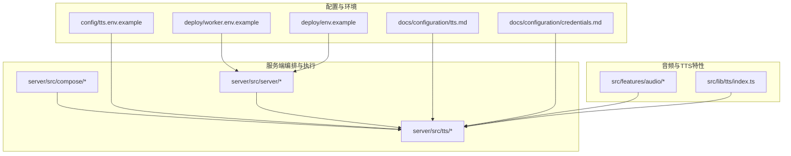
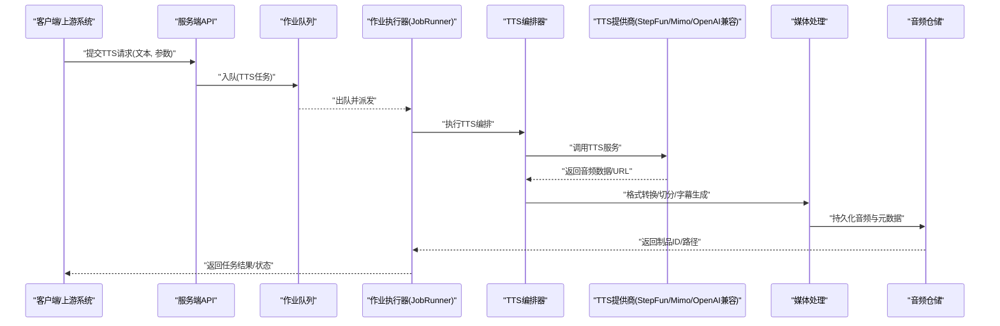
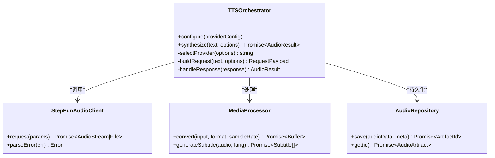
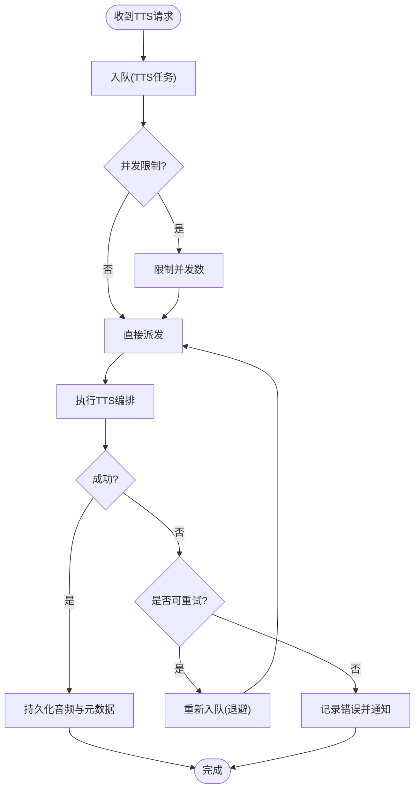
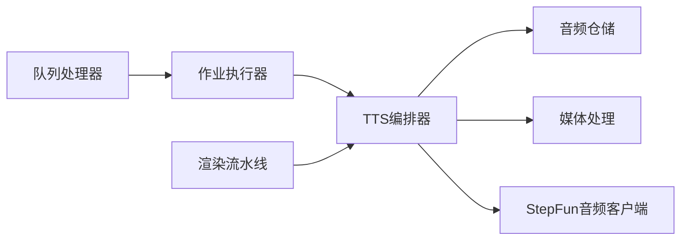

# TTS 语音合成

<cite>
**本文引用的文件**   
- [tts.env.example](file://config/tts.env.example)
- [tts.md](file://docs/configuration/tts.md)
- [credentials.md](file://docs/configuration/credentials.md)
- [queue-handler.ts](file://src/features/director/queue-handler.ts)
- [export-queue-handler.ts](file://src/features/render/export-queue-handler.ts)
- [narration.ts](file://src/features/audio/narration.ts)
- [repository.ts](file://src/features/audio/repository.ts)
- [runtime-repository.ts](file://src/features/audio/runtime-repository.ts)
- [stepfun-audio-client.ts](file://src/features/audio/stepfun-audio-client.ts)
- [subtitle.ts](file://src/features/audio/subtitle.ts)
- [score.ts](file://src/features/audio/score.ts)
- [measure.ts](file://src/features/audio/measure.ts)
- [sfx.ts](file://src/features/audio/sfx.ts)
- [types.ts](file://src/features/audio/types.ts)
- [index.ts](file://src/features/audio/index.ts)
- [lib-tts-index.ts](file://src/lib/tts/index.ts)
- [job-runner.ts](file://server/src/server/job-runner.ts)
- [job-store.ts](file://server/src/server/job-store.ts)
- [api.ts](file://server/src/server/api.ts)
- [compose-run-pipeline.ts](file://server/src/compose/run-pipeline.ts)
- [compose-model.ts](file://server/src/compose/model.ts)
- [compose-render.ts](file://server/src/compose/render.ts)
- [compose-project.ts](file://server/src/compose/project.ts)
- [compose-chapters-generate.ts](file://server/src/compose/chapters/generate.ts)
- [compose-chapters-split.ts](file://server/src/compose/chapters/split.ts)
- [compose-chapters-types.ts](file://server/src/compose/chapters/types.ts)
- [compose-chapters-validate.ts](file://server/src/compose/chapters/validate.ts)
- [compose-chapters-template-fallback.ts](file://server/src/compose/chapters/template-fallback.ts)
- [compose-chapters-page-cam.ts](file://server/src/compose/chapters/page-cam.ts)
- [compose-chapters-prompts.ts](file://server/src/compose/chapters/prompts.ts)
- [compose-root-html.ts](file://server/src/compose/chapters/root-html.ts)
- [compose-template.ts](file://server/src/compose/template.ts)
- [orchestrate.ts](file://server/src/tts/orchestrate.ts)
- [listenhub.ts](file://server/src/tts/listenhub.ts)
- [media.ts](file://server/src/tts/media.ts)
- [narration.ts](file://server/src/tts/narration.ts)
- [worker.env.example](file://deploy/worker.env.example)
- [env.example](file://deploy/env.example)
- [tts-config.test.ts](file://tests/tts-config.test.ts)
- [tts-narration.test.ts](file://tests/tts-narration.test.ts)
- [tts-orchestration.test.ts](file://tests/tts-orchestration.test.ts)
- [tts-pipeline-integration.test.ts](file://tests/tts-pipeline-integration.test.ts)
- [tts-runtime.test.ts](file://tests/tts-runtime.test.ts)
</cite>

## 目录
1. [简介](#简介)
2. [项目结构](#项目结构)
3. [核心组件](#核心组件)
4. [架构总览](#架构总览)
5. [详细组件分析](#详细组件分析)
6. [依赖关系分析](#依赖关系分析)
7. [性能与质量优化](#性能与质量优化)
8. [故障排查指南](#故障排查指南)
9. [结论](#结论)
10. [附录：配置与示例](#附录配置与示例)

## 简介
本文件面向 PurpleInk 平台的 TTS（文本转语音）语音合成功能，系统性阐述其核心架构、多服务提供商集成（Mimo、StepFun、OpenAI Compatible）、队列处理机制、音频格式与采样率设置、音质优化选项与语言支持。文档同时提供可操作的配置指引、请求处理流程说明、资源管理策略以及常见问题解决方案，帮助开发者快速落地并调优 TTS 能力。

## 项目结构
TTS 功能横跨前端特性模块、服务端编排与 Worker 执行层，主要涉及以下目录与文件：
- 配置与环境变量
  - config/tts.env.example：TTS 相关环境变量模板
  - deploy/worker.env.example、deploy/env.example：Worker 与服务端运行环境示例
  - docs/configuration/tts.md、docs/configuration/credentials.md：TTS 与凭据配置文档
- 音频与 TTS 特性模块
  - src/features/audio/*：音频制品、字幕、评分、测量、SFX、仓储与类型定义
  - src/lib/tts/index.ts：TTS 库入口（对外暴露统一接口）
- 服务端编排与任务执行
  - server/src/tts/*：TTS 编排、媒体处理、旁白生成等
  - server/src/compose/*：章节生成、渲染流水线、模型与项目组装
  - server/src/server/*：作业调度器、API 与持久化存储
- 测试用例
  - tests/*：覆盖 TTS 配置、编排、运行时与集成链路

图表来源
- [tts.env.example](file://config/tts.env.example)
- [worker.env.example](file://deploy/worker.env.example)
- [env.example](file://deploy/env.example)
- [tts.md](file://docs/configuration/tts.md)
- [credentials.md](file://docs/configuration/credentials.md)
- [index.ts](file://src/features/audio/index.ts)
- [lib-tts-index.ts](file://src/lib/tts/index.ts)
- [orchestrate.ts](file://server/src/tts/orchestrate.ts)
- [run-pipeline.ts](file://server/src/compose/run-pipeline.ts)
- [job-runner.ts](file://server/src/server/job-runner.ts)

章节来源
- [tts.env.example](file://config/tts.env.example)
- [worker.env.example](file://deploy/worker.env.example)
- [env.example](file://deploy/env.example)
- [tts.md](file://docs/configuration/tts.md)
- [credentials.md](file://docs/configuration/credentials.md)
- [index.ts](file://src/features/audio/index.ts)
- [lib-tts-index.ts](file://src/lib/tts/index.ts)
- [orchestrate.ts](file://server/src/tts/orchestrate.ts)
- [run-pipeline.ts](file://server/src/compose/run-pipeline.ts)
- [job-runner.ts](file://server/src/server/job-runner.ts)

## 核心组件
- TTS 编排器（Orchestrator）
  - 负责解析输入文本、选择 TTS 提供商、构造请求参数、调用外部服务、合并结果与落盘。
- 音频仓储与运行时仓储
  - 负责音频制品的元数据、状态与二进制数据的持久化与访问。
- 音频处理工具
  - 包括字幕生成、时长测量、质量评分、音效合成等。
- 作业调度与队列
  - 将 TTS 任务入队、并发消费、重试与失败处理。
- 配置与凭据
  - 通过环境变量与凭据存储管理各 TTS 服务的密钥与端点。

章节来源
- [orchestrate.ts](file://server/src/tts/orchestrate.ts)
- [repository.ts](file://src/features/audio/repository.ts)
- [runtime-repository.ts](file://src/features/audio/runtime-repository.ts)
- [subtitle.ts](file://src/features/audio/subtitle.ts)
- [measure.ts](file://src/features/audio/measure.ts)
- [score.ts](file://src/features/audio/score.ts)
- [sfx.ts](file://src/features/audio/sfx.ts)
- [types.ts](file://src/features/audio/types.ts)
- [queue-handler.ts](file://src/features/director/queue-handler.ts)
- [export-queue-handler.ts](file://src/features/render/export-queue-handler.ts)
- [job-runner.ts](file://server/src/server/job-runner.ts)
- [job-store.ts](file://server/src/server/job-store.ts)
- [api.ts](file://server/src/server/api.ts)

## 架构总览
TTS 的整体流程从用户或上游系统发起请求开始，经由 API 路由进入作业调度器，由队列处理器分发到 TTS 编排器；编排器根据配置选择具体 TTS 提供商（Mimo、StepFun、OpenAI Compatible），调用后返回音频流或文件，再由媒体处理与仓储组件完成持久化与索引，最终供播放或导出使用。

图表来源
- [api.ts](file://server/src/server/api.ts)
- [job-runner.ts](file://server/src/server/job-runner.ts)
- [job-store.ts](file://server/src/server/job-store.ts)
- [orchestrate.ts](file://server/src/tts/orchestrate.ts)
- [stepfun-audio-client.ts](file://src/features/audio/stepfun-audio-client.ts)
- [media.ts](file://server/src/tts/media.ts)
- [repository.ts](file://src/features/audio/repository.ts)

章节来源
- [api.ts](file://server/src/server/api.ts)
- [job-runner.ts](file://server/src/server/job-runner.ts)
- [job-store.ts](file://server/src/server/job-store.ts)
- [orchestrate.ts](file://server/src/tts/orchestrate.ts)
- [stepfun-audio-client.ts](file://src/features/audio/stepfun-audio-client.ts)
- [media.ts](file://server/src/tts/media.ts)
- [repository.ts](file://src/features/audio/repository.ts)

## 详细组件分析

### TTS 编排器（Orchestrator）
- 职责
  - 解析文本与参数（语言、音色、语速、采样率、格式等）
  - 选择 TTS 提供商（基于配置与可用性）
  - 构建请求体并调用外部服务
  - 处理响应（音频流/文件/错误）
  - 触发后续媒体处理与仓储写入
- 关键交互
  - 与 StepFun 音频客户端交互（示例实现）
  - 与媒体处理模块协作进行格式转换与字幕生成
  - 与仓储模块交互以持久化结果

图表来源
- [orchestrate.ts](file://server/src/tts/orchestrate.ts)
- [stepfun-audio-client.ts](file://src/features/audio/stepfun-audio-client.ts)
- [media.ts](file://server/src/tts/media.ts)
- [repository.ts](file://src/features/audio/repository.ts)

章节来源
- [orchestrate.ts](file://server/src/tts/orchestrate.ts)
- [stepfun-audio-client.ts](file://src/features/audio/stepfun-audio-client.ts)
- [media.ts](file://server/src/tts/media.ts)
- [repository.ts](file://src/features/audio/repository.ts)

### 音频仓储与运行时仓储
- 职责
  - 音频制品的创建、查询、更新与删除
  - 运行时上下文（如任务状态、进度、错误信息）的持久化
- 数据结构
  - 音频制品包含：唯一标识、原始格式、目标格式、采样率、时长、大小、语言、字幕关联、状态等
- 典型操作
  - 保存音频二进制与元数据
  - 按项目/镜头/时间线维度检索
  - 清理过期或冗余制品

章节来源
- [repository.ts](file://src/features/audio/repository.ts)
- [runtime-repository.ts](file://src/features/audio/runtime-repository.ts)
- [types.ts](file://src/features/audio/types.ts)

### 音频处理工具（字幕、测量、评分、音效）
- 字幕生成
  - 根据音频与语言生成 SRT/VTT 等字幕，支持时间轴对齐
- 时长测量
  - 对音频进行帧级或分段测量，用于剪辑与同步
- 质量评分
  - 基于信噪比、失真度、响度等指标评估音频质量
- 音效合成
  - 为特定场景合成基础音效，增强叙事体验

章节来源
- [subtitle.ts](file://src/features/audio/subtitle.ts)
- [measure.ts](file://src/features/audio/measure.ts)
- [score.ts](file://src/features/audio/score.ts)
- [sfx.ts](file://src/features/audio/sfx.ts)
- [types.ts](file://src/features/audio/types.ts)

### 作业调度与队列处理
- 职责
  - 将 TTS 任务入队，限制并发，保证顺序与幂等
  - 失败重试、超时控制、死信队列
- 关键组件
  - 通用队列处理器（Director 层）
  - 导出队列处理器（Render 层）
  - 作业执行器（JobRunner）与作业存储（JobStore）

图表来源
- [queue-handler.ts](file://src/features/director/queue-handler.ts)
- [export-queue-handler.ts](file://src/features/render/export-queue-handler.ts)
- [job-runner.ts](file://server/src/server/job-runner.ts)
- [job-store.ts](file://server/src/server/job-store.ts)

章节来源
- [queue-handler.ts](file://src/features/director/queue-handler.ts)
- [export-queue-handler.ts](file://src/features/render/export-queue-handler.ts)
- [job-runner.ts](file://server/src/server/job-runner.ts)
- [job-store.ts](file://server/src/server/job-store.ts)

### 章节生成与渲染流水线（与 TTS 协同）
- 章节生成
  - 从脚本/页面内容生成章节大纲、提示词与模板
- 渲染流水线
  - 将章节与音频、画面素材组合，输出最终制品
- 与 TTS 的关系
  - TTS 作为章节旁白的生成环节，嵌入到渲染流水线中

章节来源
- [compose-chapters-generate.ts](file://server/src/compose/chapters/generate.ts)
- [compose-chapters-split.ts](file://server/src/compose/chapters/split.ts)
- [compose-chapters-types.ts](file://server/src/compose/chapters/types.ts)
- [compose-chapters-validate.ts](file://server/src/compose/chapters/validate.ts)
- [compose-chapters-template-fallback.ts](file://server/src/compose/chapters/template-fallback.ts)
- [compose-chapters-page-cam.ts](file://server/src/compose/chapters/page-cam.ts)
- [compose-chapters-prompts.ts](file://server/src/compose/chapters/prompts.ts)
- [compose-root-html.ts](file://server/src/compose/chapters/root-html.ts)
- [compose-template.ts](file://server/src/compose/template.ts)
- [run-pipeline.ts](file://server/src/compose/run-pipeline.ts)
- [model.ts](file://server/src/compose/model.ts)
- [render.ts](file://server/src/compose/render.ts)
- [project.ts](file://server/src/compose/project.ts)

## 依赖关系分析
- 内部依赖
  - TTS 编排器依赖音频仓储、媒体处理与 StepFun 音频客户端
  - 队列处理器依赖作业执行器与作业存储
  - 章节生成与渲染流水线依赖 TTS 产出作为旁白素材
- 外部依赖
  - StepFun 音频服务（示例实现）
  - Mimo 与 OpenAI Compatible（通过统一接口适配）
- 潜在风险
  - 外部服务不可用或限流导致失败
  - 音频格式不兼容导致转换失败
  - 并发过高导致资源争用

图表来源
- [orchestrate.ts](file://server/src/tts/orchestrate.ts)
- [repository.ts](file://src/features/audio/repository.ts)
- [media.ts](file://server/src/tts/media.ts)
- [stepfun-audio-client.ts](file://src/features/audio/stepfun-audio-client.ts)
- [queue-handler.ts](file://src/features/director/queue-handler.ts)
- [job-runner.ts](file://server/src/server/job-runner.ts)
- [run-pipeline.ts](file://server/src/compose/run-pipeline.ts)

章节来源
- [orchestrate.ts](file://server/src/tts/orchestrate.ts)
- [repository.ts](file://src/features/audio/repository.ts)
- [media.ts](file://server/src/tts/media.ts)
- [stepfun-audio-client.ts](file://src/features/audio/stepfun-audio-client.ts)
- [queue-handler.ts](file://src/features/director/queue-handler.ts)
- [job-runner.ts](file://server/src/server/job-runner.ts)
- [run-pipeline.ts](file://server/src/compose/run-pipeline.ts)

## 性能与质量优化
- 并发与吞吐
  - 合理设置队列并发上限，避免外部服务限流
  - 使用批量化请求（若提供商支持）降低网络开销
- 缓存与复用
  - 对相同文本与参数的结果进行缓存，减少重复调用
  - 复用已生成的音频片段，拼接长文本
- 格式与采样率
  - 根据播放场景选择合适的格式（如 MP3/AAC/WAV）与采样率（如 16kHz/44.1kHz/48kHz）
  - 在移动端优先使用压缩格式以降低带宽
- 音质优化
  - 调整语速、停顿与重音参数，提升自然度
  - 通过后处理（降噪、均衡、响度标准化）改善听感
- 监控与评估
  - 采集延迟、成功率、错误码分布
  - 使用质量评分指标（信噪比、失真度、响度）持续评估

[本节为通用指导，无需引用具体文件]

## 故障排查指南
- 常见错误
  - 提供商鉴权失败：检查凭据与端点配置
  - 请求超时：增加超时阈值或降级策略
  - 音频格式不支持：确认输入/输出格式兼容性
  - 队列积压：检查并发设置与消费者健康状态
- 定位方法
  - 查看作业执行日志与错误堆栈
  - 检查仓储中的制品状态与元数据
  - 使用测量与评分工具定位音频质量问题
- 恢复策略
  - 自动重试与退避
  - 降级到其他提供商或本地引擎
  - 人工介入修复配置或数据

章节来源
- [job-runner.ts](file://server/src/server/job-runner.ts)
- [job-store.ts](file://server/src/server/job-store.ts)
- [repository.ts](file://src/features/audio/repository.ts)
- [score.ts](file://src/features/audio/score.ts)
- [measure.ts](file://src/features/audio/measure.ts)

## 结论
PurpleInk 的 TTS 语音合成功能以编排器为核心，结合队列调度、媒体处理与仓储持久化，形成稳定可扩展的端到端流程。通过多提供商集成与丰富的音频处理能力，平台能够灵活适配不同业务场景与质量要求。建议在生产环境中加强监控、缓存与降级策略，确保高可用与高性能。

[本节为总结性内容，无需引用具体文件]

## 附录：配置与示例
- 环境变量与凭据
  - 参考 tts.env.example 配置 TTS 相关参数（如提供商、端点、密钥、默认格式与采样率）
  - 参考 credentials.md 管理凭据存储与轮换
- 配置示例（步骤）
  - 在服务端或 Worker 环境中加载 tts.env.example 的变量
  - 在 TTS 编排器初始化时注入提供商配置
  - 通过 API 提交 TTS 请求，指定文本、语言、音色与输出格式
- 处理语音生成请求（步骤）
  - 接收请求并校验参数
  - 入队并等待执行
  - 编排器选择提供商并调用
  - 媒体处理与仓储持久化
  - 返回结果与状态
- 管理音频资源（步骤）
  - 使用仓储接口查询与下载音频制品
  - 清理过期或无用文件
  - 维护字幕与元数据一致性

章节来源
- [tts.env.example](file://config/tts.env.example)
- [credentials.md](file://docs/configuration/credentials.md)
- [api.ts](file://server/src/server/api.ts)
- [job-runner.ts](file://server/src/server/job-runner.ts)
- [orchestrate.ts](file://server/src/tts/orchestrate.ts)
- [media.ts](file://server/src/tts/media.ts)
- [repository.ts](file://src/features/audio/repository.ts)