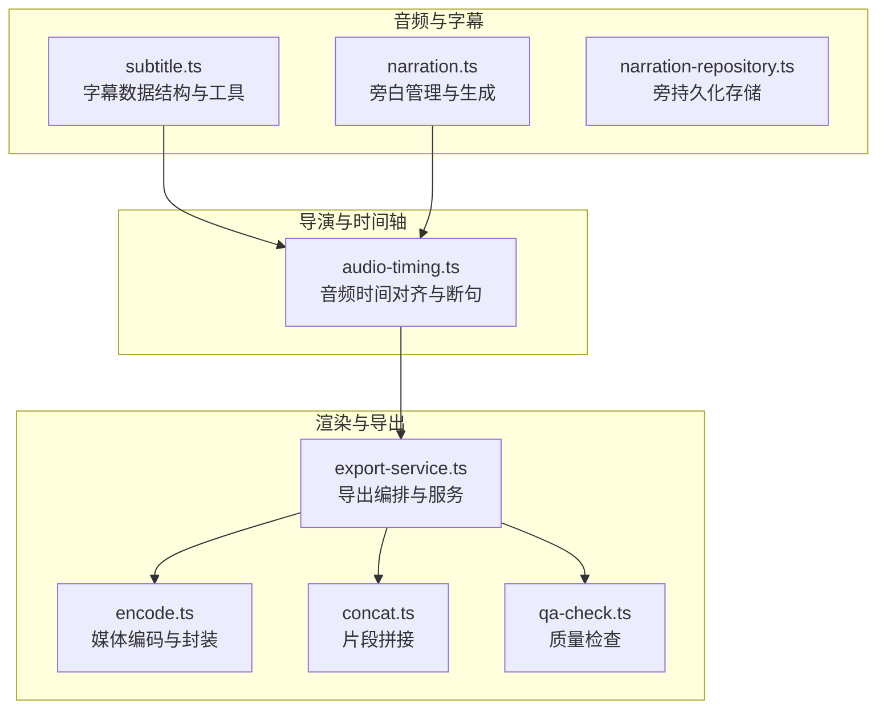
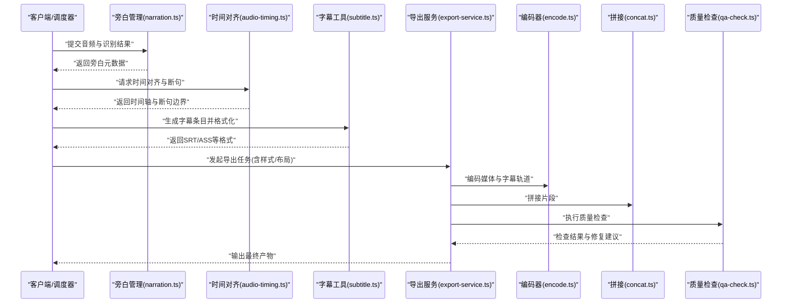
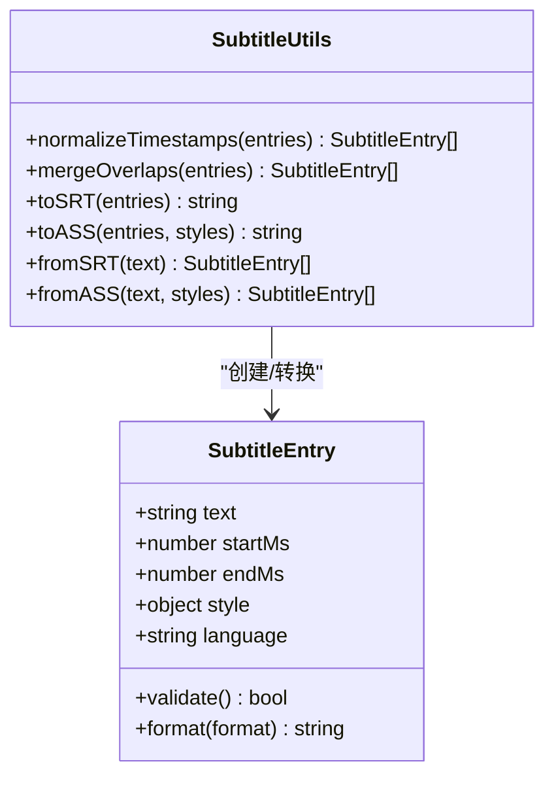
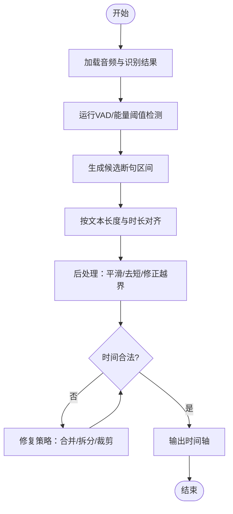
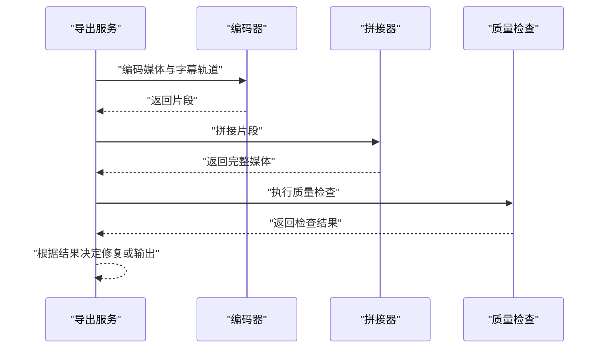
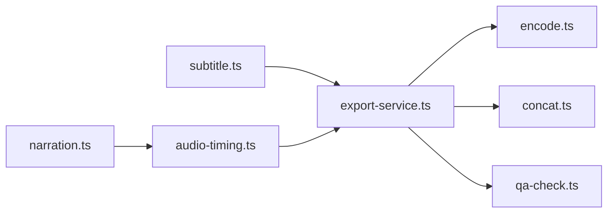

# 字幕生成

<cite>
**本文档引用的文件**   
- [subtitle.ts](file://src/features/audio/subtitle.ts)
- [subtitle.test.ts](file://src/features/audio/subtitle.test.ts)
- [narration.ts](file://src/features/audio/narration.ts)
- [narration-repository.ts](file://src/features/audio/narration-repository.ts)
- [audio-timing.ts](file://src/features/director/audio-timing.ts)
- [audio-timing.test.ts](file://src/features/director/audio-timing.test.ts)
- [export-service.ts](file://src/features/render/export-service.ts)
- [encode.ts](file://src/features/render/encode.ts)
- [concat.ts](file://src/features/render/concat.ts)
- [qa-check.ts](file://src/features/render/qa-check.ts)
- [tts-orchestration.test.ts](file://tests/tts-orchestration.test.ts)
- [tts-narration.test.ts](file://tests/tts-narration.test.ts)
- [tts-pipeline-integration.test.ts](file://tests/tts-pipeline-integration.test.ts)
- [tts-runtime.test.ts](file://tests/tts-runtime.test.ts)
</cite>

## 目录
1. [简介](#简介)
2. [项目结构](#项目结构)
3. [核心组件](#核心组件)
4. [架构总览](#架构总览)
5. [详细组件分析](#详细组件分析)
6. [依赖关系分析](#依赖关系分析)
7. [性能考虑](#性能考虑)
8. [故障排查指南](#故障排查指南)
9. [结论](#结论)
10. [附录](#附录)

## 简介
本文件面向 PurpleInk 平台的“字幕生成”能力，系统化阐述从语音识别到时间轴同步、再到样式定制与导出的完整工作流。内容覆盖：
- 自动字幕生成的端到端流程（语音识别、时间对齐、断句逻辑）
- 支持的字幕格式（ASS、SRT 等）与导出路径
- 样式配置选项与布局控制
- 多语言支持与国际化处理
- 质量检查与性能优化最佳实践
- 基于仓库代码的示例引用（以文件路径标注代替具体代码片段）

## 项目结构
与字幕生成相关的核心实现集中在以下模块：
- 音频与字幕：src/features/audio/*（字幕解析/生成、旁白管理、音频测量）
- 导演与时间轴：src/features/director/*（音频时间对齐、阶段编排）
- 渲染与导出：src/features/render/*（编码、拼接、导出服务、质量检查）
- 测试与集成：tests/*（TTS 与字幕相关集成测试）

图表来源
- [subtitle.ts:1-200](file://src/features/audio/subtitle.ts#L1-L200)
- [narration.ts:1-200](file://src/features/audio/narration.ts#L1-L200)
- [narration-repository.ts:1-200](file://src/features/audio/narration-repository.ts#L1-L200)
- [audio-timing.ts:1-200](file://src/features/director/audio-timing.ts#L1-L200)
- [export-service.ts:1-200](file://src/features/render/export-service.ts#L1-L200)
- [encode.ts:1-200](file://src/features/render/encode.ts#L1-L200)
- [concat.ts:1-200](file://src/features/render/concat.ts#L1-L200)
- [qa-check.ts:1-200](file://src/features/render/qa-check.ts#L1-L200)

章节来源
- [subtitle.ts:1-200](file://src/features/audio/subtitle.ts#L1-L200)
- [narration.ts:1-200](file://src/features/audio/narration.ts#L1-L200)
- [audio-timing.ts:1-200](file://src/features/director/audio-timing.ts#L1-L200)
- [export-service.ts:1-200](file://src/features/render/export-service.ts#L1-L200)

## 核心组件
- 字幕数据与工具（subtitle.ts）
  - 定义字幕条目结构（文本、起止时间、样式标签等），提供格式化与校验方法
  - 支持 SRT、ASS 等常见格式的序列化/反序列化
  - 提供时间戳规范化、重叠合并、空行清理等工具函数
- 旁白与字幕关联（narration.ts, narration-repository.ts）
  - 将 TTS/语音识别结果与字幕条目进行绑定
  - 持久化存储旁白元数据与字幕映射关系
- 音频时间对齐（audio-timing.ts）
  - 依据音频波形或 VAD 输出计算断句边界
  - 将识别文本片段与音频时间戳对齐，生成精确的时间轴
- 导出与渲染（export-service.ts, encode.ts, concat.ts, qa-check.ts）
  - 编排导出任务：收集字幕、样式、媒体片段，调用编码器生成最终产物
  - 执行质量检查（时长、空白段、重复、越界等）

章节来源
- [subtitle.ts:1-200](file://src/features/audio/subtitle.ts#L1-L200)
- [narration.ts:1-200](file://src/features/audio/narration.ts#L1-L200)
- [narration-repository.ts:1-200](file://src/features/audio/narration-repository.ts#L1-L200)
- [audio-timing.ts:1-200](file://src/features/director/audio-timing.ts#L1-L200)
- [export-service.ts:1-200](file://src/features/render/export-service.ts#L1-L200)
- [encode.ts:1-200](file://src/features/render/encode.ts#L1-L200)
- [concat.ts:1-200](file://src/features/render/concat.ts#L1-L200)
- [qa-check.ts:1-200](file://src/features/render/qa-check.ts#L1-L200)

## 架构总览
下图展示从输入音频到字幕输出的关键流程与组件交互：

图表来源
- [narration.ts:1-200](file://src/features/audio/narration.ts#L1-L200)
- [audio-timing.ts:1-200](file://src/features/director/audio-timing.ts#L1-L200)
- [subtitle.ts:1-200](file://src/features/audio/subtitle.ts#L1-L200)
- [export-service.ts:1-200](file://src/features/render/export-service.ts#L1-L200)
- [encode.ts:1-200](file://src/features/render/encode.ts#L1-L200)
- [concat.ts:1-200](file://src/features/render/concat.ts#L1-L200)
- [qa-check.ts:1-200](file://src/features/render/qa-check.ts#L1-L200)

## 详细组件分析

### 字幕数据与工具（subtitle.ts）
- 数据结构
  - 字幕条目包含：文本、起始时间、结束时间、样式标签（字体、颜色、位置等）、可选扩展字段（说话人、语言）
- 功能要点
  - 时间戳规范化：统一毫秒精度、去重、排序
  - 重叠合并：相邻条目按语义或阈值合并，避免碎片化
  - 格式转换：SRT、ASS 等格式的序列化和反序列化
  - 校验规则：时间范围合法性、文本非空、样式键值有效
- 复杂度分析
  - 时间戳排序 O(n log n)，合并扫描 O(n)
  - 格式转换线性于条目数

图表来源
- [subtitle.ts:1-200](file://src/features/audio/subtitle.ts#L1-L200)

章节来源
- [subtitle.ts:1-200](file://src/features/audio/subtitle.ts#L1-L200)
- [subtitle.test.ts:1-200](file://src/features/audio/subtitle.test.ts#L1-L200)

### 旁白与字幕关联（narration.ts, narration-repository.ts）
- 职责
  - 将语音识别/TTS 的输出与字幕条目建立映射
  - 持久化存储旁白元数据（说话人、语言、置信度、片段时长）
- 关键点
  - 映射策略：按时间窗口匹配、按句子边界对齐
  - 错误恢复：低置信度片段标记并提示人工校对
- 性能
  - 批量写入与事务提交，减少 I/O 开销

章节来源
- [narration.ts:1-200](file://src/features/audio/narration.ts#L1-L200)
- [narration-repository.ts:1-200](file://src/features/audio/narration-repository.ts#L1-L200)

### 音频时间对齐与断句（audio-timing.ts）
- 算法概述
  - 使用 VAD（语音活动检测）或能量阈值检测断句边界
  - 结合识别文本长度与音频时长估算每句起止时间
  - 后处理：平滑过渡、去除过短片段、修正越界
- 流程图

图表来源
- [audio-timing.ts:1-200](file://src/features/director/audio-timing.ts#L1-L200)
- [audio-timing.test.ts:1-200](file://src/features/director/audio-timing.test.ts#L1-L200)

章节来源
- [audio-timing.ts:1-200](file://src/features/director/audio-timing.ts#L1-L200)
- [audio-timing.test.ts:1-200](file://src/features/director/audio-timing.test.ts#L1-L200)

### 导出与渲染（export-service.ts, encode.ts, concat.ts, qa-check.ts）
- 导出编排
  - 收集字幕、样式、媒体片段，构建导出任务
  - 调用编码器生成视频/音频+字幕轨道
  - 拼接多个片段为完整输出
- 质量检查
  - 检查时长一致性、字幕越界、空白段过多、重复条目
  - 输出修复建议与失败原因
- 性能优化
  - 并行编码与缓存中间产物
  - 增量更新仅重编变更片段

图表来源
- [export-service.ts:1-200](file://src/features/render/export-service.ts#L1-L200)
- [encode.ts:1-200](file://src/features/render/encode.ts#L1-L200)
- [concat.ts:1-200](file://src/features/render/concat.ts#L1-L200)
- [qa-check.ts:1-200](file://src/features/render/qa-check.ts#L1-L200)

章节来源
- [export-service.ts:1-200](file://src/features/render/export-service.ts#L1-L200)
- [encode.ts:1-200](file://src/features/render/encode.ts#L1-L200)
- [concat.ts:1-200](file://src/features/render/concat.ts#L1-L200)
- [qa-check.ts:1-200](file://src/features/render/qa-check.ts#L1-L200)

### 样式配置与布局控制
- 样式维度
  - 字体族、字号、颜色、描边、阴影、透明度
  - 对齐方式（左/中/右）、位置（上/中/下）、边距
  - 动画效果（淡入淡出、滚动、逐字显示）
- 布局控制
  - 安全区域（避免遮挡 UI）、多行换行、最大宽度
  - 响应式适配（不同分辨率与画幅）
- ASS/SRT 差异
  - ASS 支持高级样式与动画；SRT 仅基础文本与时间戳
  - 导出时根据目标格式选择样式集

章节来源
- [subtitle.ts:1-200](file://src/features/audio/subtitle.ts#L1-L200)
- [export-service.ts:1-200](file://src/features/render/export-service.ts#L1-L200)

### 多语言支持与国际化处理
- 语言标识
  - 每个字幕条目可携带语言代码（如 zh-CN、en-US）
  - 多轨字幕：同一媒体内嵌多条语言轨道
- 国际化最佳实践
  - 文本分词与换行策略按语言特性调整
  - 日期/数字格式化遵循本地化规范
  - 字体回退机制确保字符渲染正确

章节来源
- [subtitle.ts:1-200](file://src/features/audio/subtitle.ts#L1-L200)
- [narration.ts:1-200](file://src/features/audio/narration.ts#L1-L200)

## 依赖关系分析
- 组件耦合
  - subtitle.ts 被 export-service.ts 与 narration.ts 依赖
  - audio-timing.ts 为 narrator 与 exporter 提供时间轴
  - export-service.ts 聚合 encode.ts、concat.ts、qa-check.ts
- 外部依赖
  - 媒体编码库（FFmpeg 或等效）
  - 数据库（持久化旁白与字幕映射）
- 潜在循环依赖
  - 通过接口抽象与事件驱动避免直接循环

图表来源
- [subtitle.ts:1-200](file://src/features/audio/subtitle.ts#L1-L200)
- [narration.ts:1-200](file://src/features/audio/narration.ts#L1-L200)
- [audio-timing.ts:1-200](file://src/features/director/audio-timing.ts#L1-L200)
- [export-service.ts:1-200](file://src/features/render/export-service.ts#L1-L200)
- [encode.ts:1-200](file://src/features/render/encode.ts#L1-L200)
- [concat.ts:1-200](file://src/features/render/concat.ts#L1-L200)
- [qa-check.ts:1-200](file://src/features/render/qa-check.ts#L1-L200)

章节来源
- [subtitle.ts:1-200](file://src/features/audio/subtitle.ts#L1-L200)
- [export-service.ts:1-200](file://src/features/render/export-service.ts#L1-L200)

## 性能考虑
- 时间对齐
  - 使用滑动窗口与阈值预过滤降低 VAD 计算量
  - 缓存中间检测结果，避免重复计算
- 字幕生成
  - 批量处理条目，减少对象创建与 GC 压力
  - 延迟序列化，仅在导出时生成字符串
- 导出与编码
  - 并行编码多轨道，利用多核 CPU
  - 增量导出：仅重编变更片段，复用缓存
- 内存管理
  - 流式读取大音频文件，避免一次性加载
  - 及时释放临时缓冲区与中间产物

[本节为通用指导，不直接分析具体文件]

## 故障排查指南
- 常见问题
  - 时间戳越界：检查对齐算法与音频时长
  - 字幕重叠：启用合并策略与最小间隔
  - 样式渲染异常：验证 ASS/SRT 语法与字体可用性
  - 导出失败：查看质量检查报告与编码器日志
- 调试步骤
  - 启用详细日志，记录关键节点输入输出
  - 使用单元测试定位问题（参考测试文件）
  - 逐步禁用功能模块隔离问题

章节来源
- [qa-check.ts:1-200](file://src/features/render/qa-check.ts#L1-L200)
- [subtitle.test.ts:1-200](file://src/features/audio/subtitle.test.ts#L1-L200)
- [audio-timing.test.ts:1-200](file://src/features/director/audio-timing.test.ts#L1-L200)

## 结论
PurpleInk 平台的字幕生成功能通过模块化设计实现了高内聚、低耦合的处理流程。从语音识别到时间对齐、样式定制与导出，各环节均有明确的职责与优化点。通过严格的质量检查与性能优化策略，平台能够稳定高效地生成高质量字幕，满足多语言与多样化样式需求。

[本节为总结性内容，不直接分析具体文件]

## 附录
- 代码示例引用（以文件路径代替具体代码）
  - 生成 SRT 字幕：[subtitle.ts:1-200](file://src/features/audio/subtitle.ts#L1-L200)
  - 生成 ASS 字幕（含样式）：[subtitle.ts:1-200](file://src/features/audio/subtitle.ts#L1-L200)
  - 自定义样式配置：[export-service.ts:1-200](file://src/features/render/export-service.ts#L1-L200)
  - 时间对齐与断句：[audio-timing.ts:1-200](file://src/features/director/audio-timing.ts#L1-L200)
  - 导出编排与质量检查：[export-service.ts:1-200](file://src/features/render/export-service.ts#L1-L200), [qa-check.ts:1-200](file://src/features/render/qa-check.ts#L1-L200)
- 测试用例参考
  - 字幕工具测试：[subtitle.test.ts:1-200](file://src/features/audio/subtitle.test.ts#L1-L200)
  - 时间对齐测试：[audio-timing.test.ts:1-200](file://src/features/director/audio-timing.test.ts#L1-L200)
  - TTS 集成测试：[tts-orchestration.test.ts:1-200](file://tests/tts-orchestration.test.ts#L1-L200), [tts-narration.test.ts:1-200](file://tests/tts-narration.test.ts#L1-L200), [tts-pipeline-integration.test.ts:1-200](file://tests/tts-pipeline-integration.test.ts#L1-L200), [tts-runtime.test.ts:1-200](file://tests/tts-runtime.test.ts#L1-L200)