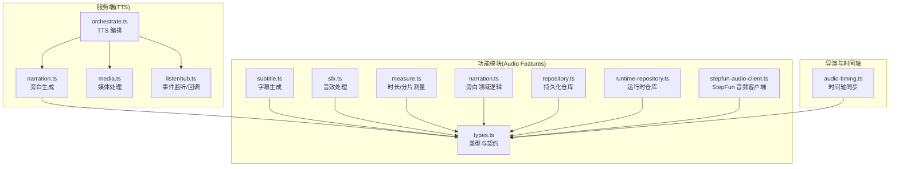
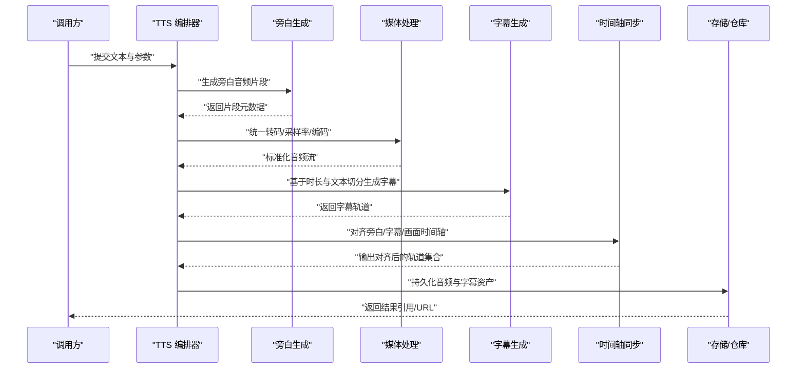
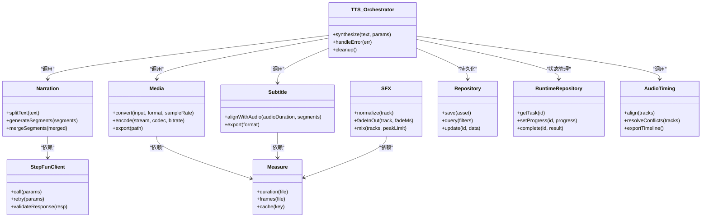

# 音频处理

<cite>
**本文引用的文件**   
- [server/src/tts/orchestrate.ts](file://server/src/tts/orchestrate.ts)
- [server/src/tts/narration.ts](file://server/src/tts/narration.ts)
- [server/src/tts/media.ts](file://server/src/tts/media.ts)
- [server/src/tts/listenhub.ts](file://server/src/tts/listenhub.ts)
- [src/features/audio/types.ts](file://src/features/audio/types.ts)
- [src/features/audio/subtitle.ts](file://src/features/audio/subtitle.ts)
- [src/features/audio/sfx.ts](file://src/features/audio/sfx.ts)
- [src/features/audio/measure.ts](file://src/features/audio/measure.ts)
- [src/features/audio/narration.ts](file://src/features/audio/narration.ts)
- [src/features/audio/repository.ts](file://src/features/audio/repository.ts)
- [src/features/audio/runtime-repository.ts](file://src/features/audio/runtime-repository.ts)
- [src/features/audio/stepfun-audio-client.ts](file://src/features/audio/stepfun-audio-client.ts)
- [src/features/director/audio-timing.ts](file://src/features/director/audio-timing.ts)
- [config/tts.env.example](file://config/tts.env.example)
- [docs/configuration/tts.md](file://docs/configuration/tts.md)
</cite>

## 目录
1. [简介](#简介)
2. [项目结构](#项目结构)
3. [核心组件](#核心组件)
4. [架构总览](#架构总览)
5. [详细组件分析](#详细组件分析)
6. [依赖关系分析](#依赖关系分析)
7. [性能与质量优化](#性能与质量优化)
8. [故障排查指南](#故障排查指南)
9. [结论](#结论)
10. [附录](#附录)

## 简介
本文件面向 PurpleInk 平台的音频处理子系统，覆盖 TTS 语音合成、音频转录（字幕生成）、音效处理（SFX）以及时间轴同步、音频切片与混音等关键能力。文档从系统架构、数据流、算法实现到配置与集成示例进行分层说明，帮助开发者快速理解并正确集成不同 TTS 服务、管理音频资源与优化输出质量。

## 项目结构
音频相关代码主要分布在两个区域：
- server 层：TTS 编排与媒体处理（服务端运行）
- features 层：音频类型定义、字幕、音效、测量、存储与客户端封装（前后端共享或 Node 环境使用）

图表来源
- [server/src/tts/orchestrate.ts](file://server/src/tts/orchestrate.ts)
- [server/src/tts/narration.ts](file://server/src/tts/narration.ts)
- [server/src/tts/media.ts](file://server/src/tts/media.ts)
- [server/src/tts/listenhub.ts](file://server/src/tts/listenhub.ts)
- [src/features/audio/types.ts](file://src/features/audio/types.ts)
- [src/features/audio/subtitle.ts](file://src/features/audio/subtitle.ts)
- [src/features/audio/sfx.ts](file://src/features/audio/sfx.ts)
- [src/features/audio/measure.ts](file://src/features/audio/measure.ts)
- [src/features/audio/narration.ts](file://src/features/audio/narration.ts)
- [src/features/audio/repository.ts](file://src/features/audio/repository.ts)
- [src/features/audio/runtime-repository.ts](file://src/features/audio/runtime-repository.ts)
- [src/features/audio/stepfun-audio-client.ts](file://src/features/audio/stepfun-audio-client.ts)
- [src/features/director/audio-timing.ts](file://src/features/director/audio-timing.ts)

章节来源
- [server/src/tts/orchestrate.ts](file://server/src/tts/orchestrate.ts)
- [server/src/tts/narration.ts](file://server/src/tts/narration.ts)
- [server/src/tts/media.ts](file://server/src/tts/media.ts)
- [server/src/tts/listenhub.ts](file://server/src/tts/listenhub.ts)
- [src/features/audio/types.ts](file://src/features/audio/types.ts)
- [src/features/audio/subtitle.ts](file://src/features/audio/subtitle.ts)
- [src/features/audio/sfx.ts](file://src/features/audio/sfx.ts)
- [src/features/audio/measure.ts](file://src/features/audio/measure.ts)
- [src/features/audio/narration.ts](file://src/features/audio/narration.ts)
- [src/features/audio/repository.ts](file://src/features/audio/repository.ts)
- [src/features/audio/runtime-repository.ts](file://src/features/audio/runtime-repository.ts)
- [src/features/audio/stepfun-audio-client.ts](file://src/features/audio/stepfun-audio-client.ts)
- [src/features/director/audio-timing.ts](file://src/features/director/audio-timing.ts)

## 核心组件
- TTS 编排器：负责调度文本到语音的生成流程，协调旁白、媒体与事件回调。
- 旁白生成：将结构化文本转换为可播放音频片段，支持分段与拼接。
- 媒体处理：统一音频格式转换、采样率设置、编码与导出。
- 字幕生成：基于音频时长与文本切分规则，产出时间轴对齐的字幕。
- 音效处理：对背景音、提示音等进行音量、淡入淡出、混音与裁剪。
- 时长测量：精确计算音频时长、帧级别信息，支撑切片与同步。
- 存储与运行时仓库：持久化与查询音频资产、元数据与任务状态。
- StepFun 音频客户端：对接外部音频服务（如 StepFun），提供统一的调用接口。
- 时间轴同步：确保旁白、字幕、画面与音效在时间轴上严格对齐。

章节来源
- [server/src/tts/orchestrate.ts](file://server/src/tts/orchestrate.ts)
- [server/src/tts/narration.ts](file://server/src/tts/narration.ts)
- [server/src/tts/media.ts](file://server/src/tts/media.ts)
- [src/features/audio/subtitle.ts](file://src/features/audio/subtitle.ts)
- [src/features/audio/sfx.ts](file://src/features/audio/sfx.ts)
- [src/features/audio/measure.ts](file://src/features/audio/measure.ts)
- [src/features/audio/repository.ts](file://src/features/audio/repository.ts)
- [src/features/audio/runtime-repository.ts](file://src/features/audio/runtime-repository.ts)
- [src/features/audio/stepfun-audio-client.ts](file://src/features/audio/stepfun-audio-client.ts)
- [src/features/director/audio-timing.ts](file://src/features/director/audio-timing.ts)

## 架构总览
下图展示了 TTS 端到端的数据流：从文本输入到音频输出，再到字幕与时间轴对齐，最终由渲染管线消费。

图表来源
- [server/src/tts/orchestrate.ts](file://server/src/tts/orchestrate.ts)
- [server/src/tts/narration.ts](file://server/src/tts/narration.ts)
- [server/src/tts/media.ts](file://server/src/tts/media.ts)
- [src/features/audio/subtitle.ts](file://src/features/audio/subtitle.ts)
- [src/features/director/audio-timing.ts](file://src/features/director/audio-timing.ts)
- [src/features/audio/repository.ts](file://src/features/audio/repository.ts)

## 详细组件分析

### TTS 编排器（Orchestrator）
- 职责：接收文本与合成参数，调度旁白生成、媒体处理、字幕生成与时间轴对齐，管理错误与重试。
- 关键点：
  - 并发控制：并行生成多个片段，限制并发度避免过载。
  - 失败回退：当某一步失败时，尝试降级策略（如切换供应商或降低音质）。
  - 资源清理：及时释放临时文件与内存缓冲。
- 集成点：与存储仓库、事件监听器、外部音频客户端交互。

章节来源
- [server/src/tts/orchestrate.ts](file://server/src/tts/orchestrate.ts)
- [server/src/tts/listenhub.ts](file://server/src/tts/listenhub.ts)

### 旁白生成（Narration）
- 职责：将结构化文本切分为适合合成的段落，调用 TTS 服务生成音频片段，合并为完整旁白。
- 关键点：
  - 文本切分：按语义边界（句子、段落）切分，保证自然停顿。
  - 片段拼接：保持采样率一致，插入静音过渡，避免爆音。
  - 元数据记录：保存每段文本、起止时间、供应商与模型信息。
- 扩展性：通过抽象接口接入不同 TTS 供应商（如 StepFun）。

章节来源
- [server/src/tts/narration.ts](file://server/src/tts/narration.ts)
- [src/features/audio/narration.ts](file://src/features/audio/narration.ts)
- [src/features/audio/types.ts](file://src/features/audio/types.ts)

### 媒体处理（Media）
- 职责：统一音频格式转换、采样率设置、编码与导出。
- 关键点：
  - 支持的格式：常见 PCM/WAV/MP3/FLAC 等（以实际实现为准）。
  - 采样率：根据目标平台与质量要求选择 16kHz/24kHz/48kHz。
  - 编码参数：比特率、声道数、压缩等级可调。
  - 流式处理：大文件采用分块读写，降低内存占用。

章节来源
- [server/src/tts/media.ts](file://server/src/tts/media.ts)
- [src/features/audio/types.ts](file://src/features/audio/types.ts)

### 字幕生成（Subtitle）
- 职责：基于音频时长与文本切分规则，生成时间轴对齐的字幕轨道。
- 关键点：
  - 切分策略：按句子/短语切分，结合停顿与呼吸节奏。
  - 时间对齐：依据旁白片段起止时间映射字幕区间。
  - 输出格式：SRT/VTT 等标准字幕格式。

章节来源
- [src/features/audio/subtitle.ts](file://src/features/audio/subtitle.ts)
- [src/features/audio/types.ts](file://src/features/audio/types.ts)

### 音效处理（SFX）
- 职责：对背景音、提示音等进行音量调节、淡入淡出、裁剪与混音。
- 关键点：
  - 音量归一化：避免动态范围过大导致失真。
  - 淡入淡出：平滑起始与结束，减少突兀感。
  - 混音算法：多轨叠加时进行峰值检测与增益分配，防止削波。

章节来源
- [src/features/audio/sfx.ts](file://src/features/audio/sfx.ts)
- [src/features/audio/types.ts](file://src/features/audio/types.ts)

### 时长测量（Measure）
- 职责：精确计算音频时长、帧级别信息与关键时间点。
- 关键点：
  - 精度：毫秒级测量，支持负偏移与重叠片段处理。
  - 缓存：对重复文件复用测量结果，提升性能。
  - 异常：损坏文件或不支持格式时给出明确错误。

章节来源
- [src/features/audio/measure.ts](file://src/features/audio/measure.ts)
- [src/features/audio/types.ts](file://src/features/audio/types.ts)

### 存储与运行时仓库（Repository & Runtime Repository）
- 职责：持久化音频资产、字幕、元数据与任务状态；提供查询与更新接口。
- 关键点：
  - 事务性：批量写入保证一致性。
  - 索引：按项目、镜头、时间戳等维度建立索引。
  - 版本控制：保留历史版本以便回溯。

章节来源
- [src/features/audio/repository.ts](file://src/features/audio/repository.ts)
- [src/features/audio/runtime-repository.ts](file://src/features/audio/runtime-repository.ts)
- [src/features/audio/types.ts](file://src/features/audio/types.ts)

### StepFun 音频客户端（StepFun Audio Client）
- 职责：封装对外部音频服务的调用，统一请求/响应格式与错误处理。
- 关键点：
  - 认证：API Key/Token 管理与自动刷新。
  - 限流：令牌桶或滑动窗口限流，避免触发配额限制。
  - 重试：指数退避与幂等键保障可靠性。

章节来源
- [src/features/audio/stepfun-audio-client.ts](file://src/features/audio/stepfun-audio-client.ts)
- [src/features/audio/types.ts](file://src/features/audio/types.ts)

### 时间轴同步（Audio Timing）
- 职责：确保旁白、字幕、画面与音效在时间轴上严格对齐。
- 关键点：
  - 基准时间：以视频帧率为基准，统一时间单位。
  - 偏移校正：补偿网络延迟与编解码耗时。
  - 冲突解决：多轨重叠时的优先级与避让策略。

章节来源
- [src/features/director/audio-timing.ts](file://src/features/director/audio-timing.ts)
- [src/features/audio/types.ts](file://src/features/audio/types.ts)

## 依赖关系分析

图表来源
- [server/src/tts/orchestrate.ts](file://server/src/tts/orchestrate.ts)
- [server/src/tts/narration.ts](file://server/src/tts/narration.ts)
- [server/src/tts/media.ts](file://server/src/tts/media.ts)
- [src/features/audio/subtitle.ts](file://src/features/audio/subtitle.ts)
- [src/features/audio/sfx.ts](file://src/features/audio/sfx.ts)
- [src/features/audio/measure.ts](file://src/features/audio/measure.ts)
- [src/features/audio/repository.ts](file://src/features/audio/repository.ts)
- [src/features/audio/runtime-repository.ts](file://src/features/audio/runtime-repository.ts)
- [src/features/audio/stepfun-audio-client.ts](file://src/features/audio/stepfun-audio-client.ts)
- [src/features/director/audio-timing.ts](file://src/features/director/audio-timing.ts)

章节来源
- [server/src/tts/orchestrate.ts](file://server/src/tts/orchestrate.ts)
- [server/src/tts/narration.ts](file://server/src/tts/narration.ts)
- [server/src/tts/media.ts](file://server/src/tts/media.ts)
- [src/features/audio/subtitle.ts](file://src/features/audio/subtitle.ts)
- [src/features/audio/sfx.ts](file://src/features/audio/sfx.ts)
- [src/features/audio/measure.ts](file://src/features/audio/measure.ts)
- [src/features/audio/repository.ts](file://src/features/audio/repository.ts)
- [src/features/audio/runtime-repository.ts](file://src/features/audio/runtime-repository.ts)
- [src/features/audio/stepfun-audio-client.ts](file://src/features/audio/stepfun-audio-client.ts)
- [src/features/director/audio-timing.ts](file://src/features/director/audio-timing.ts)

## 性能与质量优化
- 并发与限流
  - 合理设置 TTS 并发度，避免上游服务限流。
  - 对大文件启用流式处理，降低内存峰值。
- 采样率与编码
  - 根据目标平台选择合适采样率（如 16kHz 用于语音识别，48kHz 用于高质量播放）。
  - 平衡比特率与文件大小，常用 128-192kbps MP3 或无损 FLAC。
- 时间轴对齐
  - 使用高精度时钟与偏移校正，减少累积误差。
  - 对重叠片段进行峰值检测与增益分配，避免削波。
- 缓存与复用
  - 对相同文本与参数的合成结果进行缓存。
  - 复用时长测量结果，减少重复计算。
- 错误恢复
  - 指数退避重试，配合幂等键避免重复生成。
  - 失败时自动降级（如切换供应商或降低音质）。

章节来源
- [server/src/tts/orchestrate.ts](file://server/src/tts/orchestrate.ts)
- [server/src/tts/media.ts](file://server/src/tts/media.ts)
- [src/features/audio/measure.ts](file://src/features/audio/measure.ts)
- [src/features/audio/stepfun-audio-client.ts](file://src/features/audio/stepfun-audio-client.ts)
- [src/features/director/audio-timing.ts](file://src/features/director/audio-timing.ts)

## 故障排查指南
- 常见问题
  - 超时：检查上游服务健康状态与网络延迟，增加超时阈值。
  - 限流：观察速率限制日志，调整并发与重试策略。
  - 格式不支持：确认输入文件格式与编码器兼容性。
  - 时间轴错位：校验采样率与帧率一致性，检查偏移校正逻辑。
- 诊断步骤
  - 查看任务进度与错误堆栈。
  - 验证音频元数据（时长、采样率、声道数）。
  - 回放中间产物定位问题阶段。
- 修复建议
  - 启用重试与降级策略。
  - 清理临时文件与缓存。
  - 调整编码参数与混音增益。

章节来源
- [server/src/tts/orchestrate.ts](file://server/src/tts/orchestrate.ts)
- [server/src/tts/listenhub.ts](file://server/src/tts/listenhub.ts)
- [src/features/audio/repository.ts](file://src/features/audio/repository.ts)
- [src/features/audio/runtime-repository.ts](file://src/features/audio/runtime-repository.ts)

## 结论
PurpleInk 的音频处理子系统通过清晰的模块化设计与稳健的错误恢复机制，实现了高质量的 TTS 合成、字幕生成与音效处理。借助统一的时间轴同步与灵活的媒体处理能力，平台能够稳定地服务于多样化的音视频生产场景。建议在生产环境中结合监控与指标，持续优化并发、编码与对齐策略，以获得最佳的用户体验与资源利用率。

## 附录

### 支持的音频格式与采样率
- 常见格式：WAV、MP3、FLAC、PCM（以实际实现为准）
- 采样率：16kHz、24kHz、48kHz（根据用途选择）
- 编码参数：比特率、声道数、压缩等级可调

章节来源
- [server/src/tts/media.ts](file://server/src/tts/media.ts)
- [src/features/audio/types.ts](file://src/features/audio/types.ts)

### 时间轴同步与混音算法要点
- 时间基准：以视频帧率为基准，统一时间单位
- 偏移校正：补偿网络与编解码延迟
- 混音策略：峰值检测与增益分配，避免削波

章节来源
- [src/features/director/audio-timing.ts](file://src/features/director/audio-timing.ts)
- [src/features/audio/sfx.ts](file://src/features/audio/sfx.ts)

### 集成示例（路径指引）
- 集成 TTS 服务：参考编排器与旁白生成模块
  - [server/src/tts/orchestrate.ts](file://server/src/tts/orchestrate.ts)
  - [server/src/tts/narration.ts](file://server/src/tts/narration.ts)
- 处理音频文件：参考媒体处理与时长测量模块
  - [server/src/tts/media.ts](file://server/src/tts/media.ts)
  - [src/features/audio/measure.ts](file://src/features/audio/measure.ts)
- 管理音频资源：参考存储与运行时仓库模块
  - [src/features/audio/repository.ts](file://src/features/audio/repository.ts)
  - [src/features/audio/runtime-repository.ts](file://src/features/audio/runtime-repository.ts)
- 对接外部服务：参考 StepFun 音频客户端
  - [src/features/audio/stepfun-audio-client.ts](file://src/features/audio/stepfun-audio-client.ts)

### 配置与环境变量
- TTS 环境变量示例：[config/tts.env.example](file://config/tts.env.example)
- TTS 配置文档：[docs/configuration/tts.md](file://docs/configuration/tts.md)

章节来源
- [config/tts.env.example](file://config/tts.env.example)
- [docs/configuration/tts.md](file://docs/configuration/tts.md)