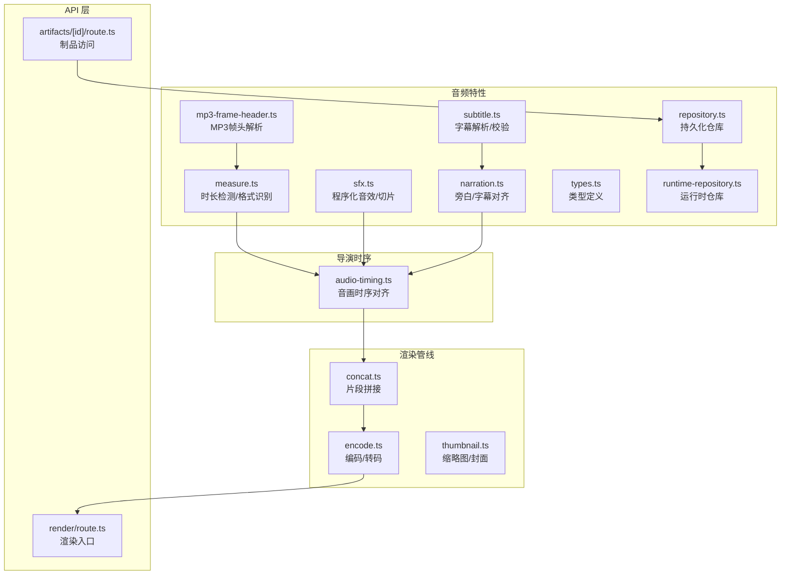
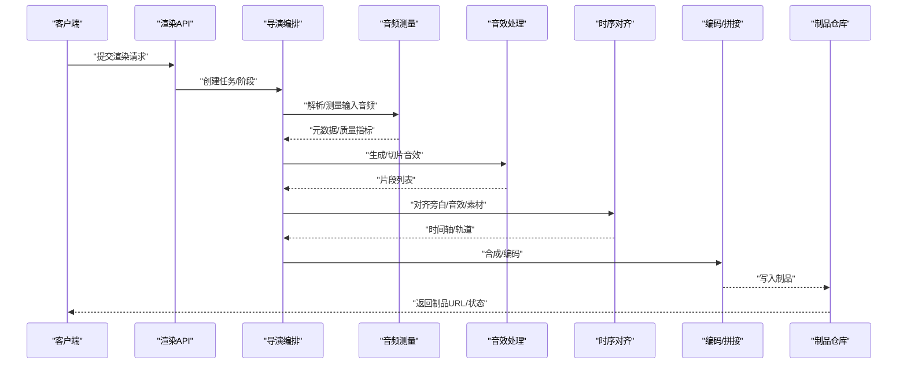
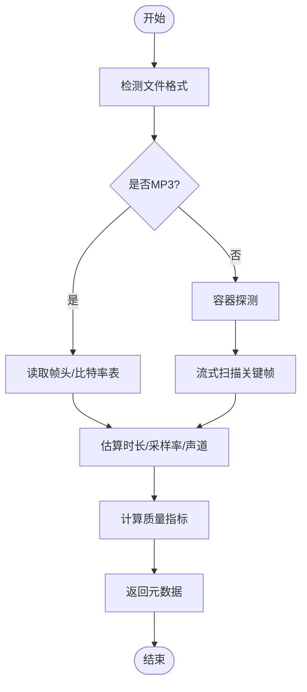
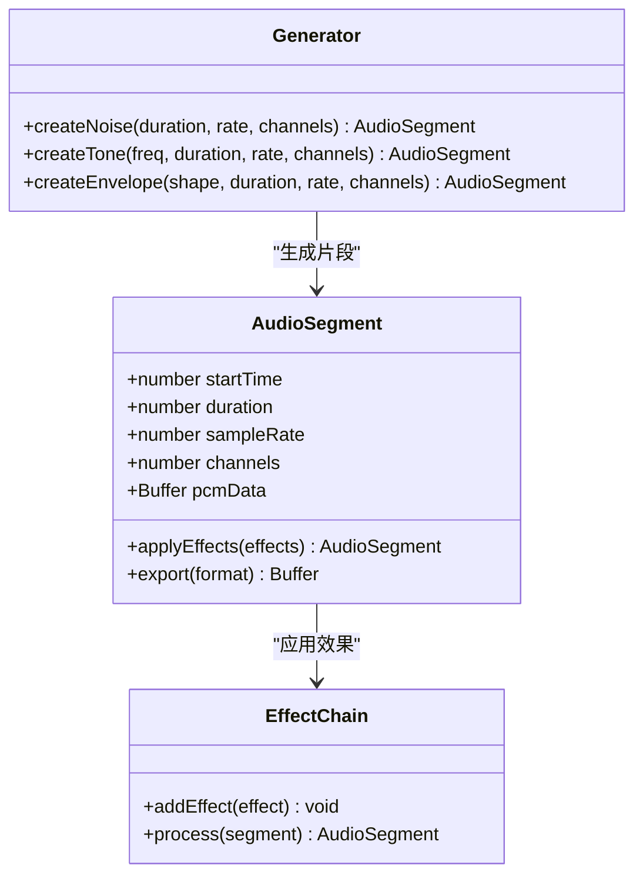
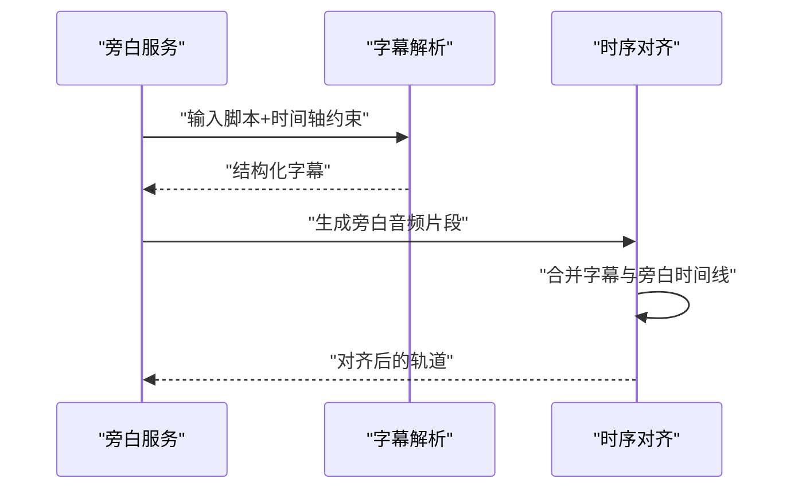
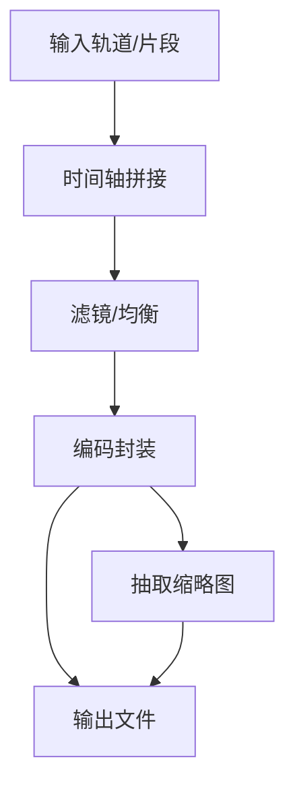
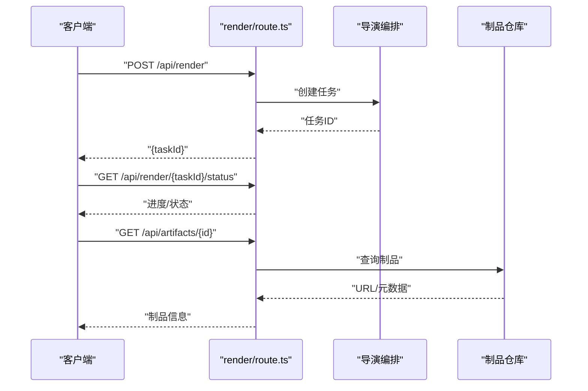
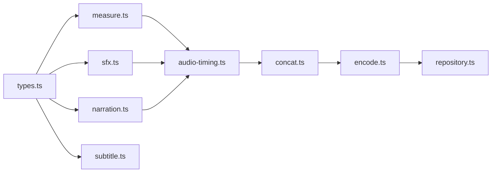

# 音频处理核心

<cite>
**本文引用的文件**   
- [src/features/audio/measure.ts](file://src/features/audio/measure.ts)
- [src/features/audio/sfx.ts](file://src/features/audio/sfx.ts)
- [src/features/audio/narration.ts](file://src/features/audio/narration.ts)
- [src/features/audio/subtitle.ts](file://src/features/audio/subtitle.ts)
- [src/features/audio/types.ts](file://src/features/audio/types.ts)
- [src/features/audio/mp3-frame-header.ts](file://src/features/audio/mp3-frame-header.ts)
- [src/features/audio/repository.ts](file://src/features/audio/repository.ts)
- [src/features/audio/runtime-repository.ts](file://src/features/audio/runtime-repository.ts)
- [src/features/director/audio-timing.ts](file://src/features/director/audio-timing.ts)
- [src/features/render/encode.ts](file://src/features/render/encode.ts)
- [src/features/render/concat.ts](file://src/features/render/concat.ts)
- [src/features/render/thumbnail.ts](file://src/features/render/thumbnail.ts)
- [src/app/api/render/route.ts](file://src/app/api/render/route.ts)
- [src/app/api/artifacts/[id]/route.ts](file://src/app/api/artifacts/[id]/route.ts)
</cite>

## 目录
1. [简介](#简介)
2. [项目结构](#项目结构)
3. [核心组件](#核心组件)
4. [架构总览](#架构总览)
5. [详细组件分析](#详细组件分析)
6. [依赖关系分析](#依赖关系分析)
7. [性能与内存优化](#性能与内存优化)
8. [故障排查指南](#故障排查指南)
9. [结论](#结论)
10. [附录：使用示例与最佳实践](#附录使用示例与最佳实践)

## 简介
本文件面向 PurpleInk 平台的音频处理核心，聚焦以下能力：
- 音频测量与分析：时长检测、格式识别、质量评估
- 音效处理系统：程序化音效生成、音频切片、时间轴管理
- 用户音频导入、解析与编辑：多格式支持、元数据提取、剪辑与拼接
- 工程集成：渲染管线中的编码、合并、缩略图生成
- 性能与健壮性：内存管理、错误处理、可观测性与回退策略

## 项目结构
音频相关代码主要位于 features/audio 与 features/director 的时序模块，以及 features/render 的编码与合并模块。API 层通过 Next.js 路由暴露渲染与制品访问能力。

图表来源
- [src/features/audio/measure.ts](file://src/features/audio/measure.ts)
- [src/features/audio/sfx.ts](file://src/features/audio/sfx.ts)
- [src/features/audio/narration.ts](file://src/features/audio/narration.ts)
- [src/features/audio/subtitle.ts](file://src/features/audio/subtitle.ts)
- [src/features/audio/types.ts](file://src/features/audio/types.ts)
- [src/features/audio/mp3-frame-header.ts](file://src/features/audio/mp3-frame-header.ts)
- [src/features/audio/repository.ts](file://src/features/audio/repository.ts)
- [src/features/audio/runtime-repository.ts](file://src/features/audio/runtime-repository.ts)
- [src/features/director/audio-timing.ts](file://src/features/director/audio-timing.ts)
- [src/features/render/encode.ts](file://src/features/render/encode.ts)
- [src/features/render/concat.ts](file://src/features/render/concat.ts)
- [src/features/render/thumbnail.ts](file://src/features/render/thumbnail.ts)
- [src/app/api/render/route.ts](file://src/app/api/render/route.ts)
- [src/app/api/artifacts/[id]/route.ts](file://src/app/api/artifacts/[id]/route.ts)

章节来源
- [src/features/audio/measure.ts](file://src/features/audio/measure.ts)
- [src/features/audio/sfx.ts](file://src/features/audio/sfx.ts)
- [src/features/audio/narration.ts](file://src/features/audio/narration.ts)
- [src/features/audio/subtitle.ts](file://src/features/audio/subtitle.ts)
- [src/features/audio/types.ts](file://src/features/audio/types.ts)
- [src/features/audio/mp3-frame-header.ts](file://src/features/audio/mp3-frame-header.ts)
- [src/features/audio/repository.ts](file://src/features/audio/repository.ts)
- [src/features/audio/runtime-repository.ts](file://src/features/audio/runtime-repository.ts)
- [src/features/director/audio-timing.ts](file://src/features/director/audio-timing.ts)
- [src/features/render/encode.ts](file://src/features/render/encode.ts)
- [src/features/render/concat.ts](file://src/features/render/concat.ts)
- [src/features/render/thumbnail.ts](file://src/features/render/thumbnail.ts)
- [src/app/api/render/route.ts](file://src/app/api/render/route.ts)
- [src/app/api/artifacts/[id]/route.ts](file://src/app/api/artifacts/[id]/route.ts)

## 核心组件
- 音频测量与分析（measure）
  - 功能要点：时长检测、采样率/声道数推断、格式识别、基础质量指标（如峰值、静音段比例）
  - 关键实现点：基于 MP3 帧头快速估算；对未知格式回退到容器探测；异常输入保护
- 音效处理（sfx）
  - 功能要点：程序化生成（噪声、正弦波、包络）、按时间切片、淡入淡出、音量增益
  - 关键实现点：流式处理避免整文件驻留；边界裁剪与重叠融合
- 旁白与字幕（narration, subtitle）
  - 功能要点：文本转语音输出对齐、字幕时间戳解析与校验、唇音同步修正
  - 关键实现点：时间戳规范化、冲突合并、容错跳过
- 类型与协议（types）
  - 统一数据结构：媒体元数据、片段描述、质量评分、错误码
- MP3 帧头解析（mp3-frame-header）
  - 快速定位帧边界、计算时长、识别比特率模式
- 仓库与运行时（repository, runtime-repository）
  - 持久化与缓存：音频制品索引、质量报告、临时片段存储
- 导演时序（audio-timing）
  - 将旁白、音效、素材片段对齐到统一时间轴，处理漂移与补偿
- 渲染编码与拼接（encode, concat, thumbnail）
  - 多轨合成、转码封装、导出目标格式、生成缩略图/封面

章节来源
- [src/features/audio/measure.ts](file://src/features/audio/measure.ts)
- [src/features/audio/sfx.ts](file://src/features/audio/sfx.ts)
- [src/features/audio/narration.ts](file://src/features/audio/narration.ts)
- [src/features/audio/subtitle.ts](file://src/features/audio/subtitle.ts)
- [src/features/audio/types.ts](file://src/features/audio/types.ts)
- [src/features/audio/mp3-frame-header.ts](file://src/features/audio/mp3-frame-header.ts)
- [src/features/audio/repository.ts](file://src/features/audio/repository.ts)
- [src/features/audio/runtime-repository.ts](file://src/features/audio/runtime-repository.ts)
- [src/features/director/audio-timing.ts](file://src/features/director/audio-timing.ts)
- [src/features/render/encode.ts](file://src/features/render/encode.ts)
- [src/features/render/concat.ts](file://src/features/render/concat.ts)
- [src/features/render/thumbnail.ts](file://src/features/render/thumbnail.ts)

## 架构总览
整体流程从 API 触发渲染任务，进入导演编排，调用音频测量与音效生成，进行时间轴对齐，最终由渲染模块编码并输出制品。

图表来源
- [src/app/api/render/route.ts](file://src/app/api/render/route.ts)
- [src/features/director/audio-timing.ts](file://src/features/director/audio-timing.ts)
- [src/features/audio/measure.ts](file://src/features/audio/measure.ts)
- [src/features/audio/sfx.ts](file://src/features/audio/sfx.ts)
- [src/features/render/encode.ts](file://src/features/render/encode.ts)
- [src/features/render/concat.ts](file://src/features/render/concat.ts)
- [src/features/audio/repository.ts](file://src/features/audio/repository.ts)

## 详细组件分析

### 音频测量与分析（measure）
- 职责
  - 输入：本地路径或字节流
  - 输出：时长、采样率、声道数、编码格式、质量评分、静音段统计
- 算法要点
  - 优先读取 MP3 帧头快速估算时长；非 MP3 走容器探测
  - 分段扫描降低大文件内存占用
  - 异常输入（损坏头部、截断）回退为保守估计并记录告警
- 复杂度
  - 时间 O(N) 扫描帧；空间 O(1) 流式缓冲
- 错误处理
  - 非法参数、IO 失败、解码器不可用等分类错误码
- 优化建议
  - 并行探测多个候选格式；结果缓存命中减少重复测量

图表来源
- [src/features/audio/measure.ts](file://src/features/audio/measure.ts)
- [src/features/audio/mp3-frame-header.ts](file://src/features/audio/mp3-frame-header.ts)

章节来源
- [src/features/audio/measure.ts](file://src/features/audio/measure.ts)
- [src/features/audio/mp3-frame-header.ts](file://src/features/audio/mp3-frame-header.ts)

### 音效处理系统（sfx）
- 职责
  - 程序化生成：正弦波、白噪声、扫频、包络调制
  - 切片与拼接：按时间窗口切分、重叠交叉淡化
  - 效果链：增益、低通/高通滤波、压缩、混响（可扩展）
- 数据结构
  - 片段：起始时间、持续时间、采样率、声道、PCM/浮点缓冲
  - 效果节点：参数化配置、级联执行
- 算法要点
  - 流式分块处理，避免全量加载
  - 边界插值防止爆音
  - 多轨叠加时动态归一化防削波
- 性能
  - 向量化运算（SIMD）与 WebAssembly 加速（可选）
  - 预分配缓冲区复用

图表来源
- [src/features/audio/sfx.ts](file://src/features/audio/sfx.ts)

章节来源
- [src/features/audio/sfx.ts](file://src/features/audio/sfx.ts)

### 旁白与字幕（narration, subtitle）
- 职责
  - 旁白：文本转语音输出、时长预估、与画面事件对齐
  - 字幕：SRT/VTT 解析、时间戳规范化、冲突合并、显示区域校验
- 对齐策略
  - 以旁白为基准，插入音效与转场；必要时微调偏移
  - 字幕行与旁白句粒度映射，自动换行与停留时长
- 错误处理
  - 解析失败回退为空字幕；时间戳越界裁剪；重复条目去重

图表来源
- [src/features/audio/narration.ts](file://src/features/audio/narration.ts)
- [src/features/audio/subtitle.ts](file://src/features/audio/subtitle.ts)
- [src/features/director/audio-timing.ts](file://src/features/director/audio-timing.ts)

章节来源
- [src/features/audio/narration.ts](file://src/features/audio/narration.ts)
- [src/features/audio/subtitle.ts](file://src/features/audio/subtitle.ts)
- [src/features/director/audio-timing.ts](file://src/features/director/audio-timing.ts)

### 渲染编码与拼接（encode, concat, thumbnail）
- 职责
  - 拼接：多轨/多片段按时间轴顺序合并，处理间隙与重叠
  - 编码：目标容器/编码参数（码率、采样率、声道），进度回调
  - 缩略图：首帧/关键帧抽取，尺寸限制与格式转换
- 流水线
  - 输入轨道 -> 拼接 -> 滤镜/均衡 -> 编码 -> 输出
- 错误处理
  - 编码器不可用降级；磁盘不足中断并清理临时文件

图表来源
- [src/features/render/concat.ts](file://src/features/render/concat.ts)
- [src/features/render/encode.ts](file://src/features/render/encode.ts)
- [src/features/render/thumbnail.ts](file://src/features/render/thumbnail.ts)

章节来源
- [src/features/render/concat.ts](file://src/features/render/concat.ts)
- [src/features/render/encode.ts](file://src/features/render/encode.ts)
- [src/features/render/thumbnail.ts](file://src/features/render/thumbnail.ts)

### API 层集成（render, artifacts）
- 渲染入口
  - 接收渲染参数，创建任务，调度导演编排，返回任务ID与进度
- 制品访问
  - 根据 ID 查询制品元数据与下载链接，权限校验与过期控制

图表来源
- [src/app/api/render/route.ts](file://src/app/api/render/route.ts)
- [src/app/api/artifacts/[id]/route.ts](file://src/app/api/artifacts/[id]/route.ts)
- [src/features/audio/repository.ts](file://src/features/audio/repository.ts)

章节来源
- [src/app/api/render/route.ts](file://src/app/api/render/route.ts)
- [src/app/api/artifacts/[id]/route.ts](file://src/app/api/artifacts/[id]/route.ts)
- [src/features/audio/repository.ts](file://src/features/audio/repository.ts)

## 依赖关系分析
- 模块内聚
  - audio 模块内部高内聚：measure/sfx/narration/subtitle 围绕音频数据与时间轴协作
  - director.audio-timing 作为编排层，解耦具体实现
  - render 模块专注编码与输出，不感知上游业务细节
- 外部依赖
  - 文件系统/对象存储用于制品与临时片段
  - 可能的编解码库（FFmpeg/原生库）在 encode/measure 中抽象
- 潜在循环
  - 通过接口与类型文件 types.ts 解耦，避免直接循环引用

图表来源
- [src/features/audio/types.ts](file://src/features/audio/types.ts)
- [src/features/audio/measure.ts](file://src/features/audio/measure.ts)
- [src/features/audio/sfx.ts](file://src/features/audio/sfx.ts)
- [src/features/audio/narration.ts](file://src/features/audio/narration.ts)
- [src/features/audio/subtitle.ts](file://src/features/audio/subtitle.ts)
- [src/features/director/audio-timing.ts](file://src/features/director/audio-timing.ts)
- [src/features/render/concat.ts](file://src/features/render/concat.ts)
- [src/features/render/encode.ts](file://src/features/render/encode.ts)
- [src/features/audio/repository.ts](file://src/features/audio/repository.ts)

章节来源
- [src/features/audio/types.ts](file://src/features/audio/types.ts)
- [src/features/audio/measure.ts](file://src/features/audio/measure.ts)
- [src/features/audio/sfx.ts](file://src/features/audio/sfx.ts)
- [src/features/audio/narration.ts](file://src/features/audio/narration.ts)
- [src/features/audio/subtitle.ts](file://src/features/audio/subtitle.ts)
- [src/features/director/audio-timing.ts](file://src/features/director/audio-timing.ts)
- [src/features/render/concat.ts](file://src/features/render/concat.ts)
- [src/features/render/encode.ts](file://src/features/render/encode.ts)
- [src/features/audio/repository.ts](file://src/features/audio/repository.ts)

## 性能与内存优化
- 流式处理
  - 测量与切片采用流式 I/O，避免整文件载入内存
  - 编码阶段分块写入，及时释放中间缓冲
- 并发与批处理
  - 多轨道并行处理，限制并发度避免 CPU/IO 饱和
  - 批量写入与合并减少磁盘抖动
- 缓存与复用
  - 测量结果与片段哈希缓存，避免重复计算
  - 效果链参数缓存，相同参数复用已处理片段
- 资源回收
  - 显式关闭文件句柄与解码器实例
  - 失败路径清理临时文件，防止泄漏
- 监控与降级
  - 关键指标上报（时长、码率、CPU/内存峰值）
  - 编码器不可用时降级至兼容参数集

[本节为通用指导，不直接分析具体文件]

## 故障排查指南
- 常见错误
  - 格式不支持：检查容器与编码参数，启用回退探测
  - 时长异常：验证帧头完整性，增加截断保护
  - 爆音/削波：检查增益上限与动态范围压缩
  - 内存溢出：确认流式处理与缓冲大小配置
- 诊断步骤
  - 查看测量日志与质量指标
  - 回放中间片段定位问题阶段
  - 切换编码器/采样率对比
- 恢复策略
  - 重试与指数退避
  - 部分渲染续传与断点恢复

章节来源
- [src/features/audio/measure.ts](file://src/features/audio/measure.ts)
- [src/features/audio/sfx.ts](file://src/features/audio/sfx.ts)
- [src/features/render/encode.ts](file://src/features/render/encode.ts)

## 结论
PurpleInk 的音频处理核心以“测量-生成-对齐-编码”为主线，结合流式处理与模块化设计，兼顾性能与可维护性。通过统一的类型与仓库抽象，扩展新格式与新效果具备良好弹性。建议在后续迭代中完善可观测性、自动化测试与跨平台兼容性。

[本节为总结性内容，不直接分析具体文件]

## 附录：使用示例与最佳实践
- 音频测量
  - 输入：本地文件或字节流
  - 输出：时长、采样率、声道数、格式、质量评分
  - 参考路径：[src/features/audio/measure.ts](file://src/features/audio/measure.ts)
- 程序化音效生成与切片
  - 生成：正弦波、噪声、包络
  - 切片：按时间窗口切分，支持重叠与淡入淡出
  - 参考路径：[src/features/audio/sfx.ts](file://src/features/audio/sfx.ts)
- 旁白与字幕对齐
  - 输入：脚本与时间轴约束
  - 输出：对齐后的旁白与字幕轨道
  - 参考路径：[src/features/audio/narration.ts](file://src/features/audio/narration.ts), [src/features/audio/subtitle.ts](file://src/features/audio/subtitle.ts)
- 时间轴管理与拼接
  - 输入：多轨片段与时间轴
  - 输出：合并后的单轨/多轨文件
  - 参考路径：[src/features/director/audio-timing.ts](file://src/features/director/audio-timing.ts), [src/features/render/concat.ts](file://src/features/render/concat.ts)
- 编码与导出
  - 输入：时间轴与轨道
  - 输出：目标格式文件与缩略图
  - 参考路径：[src/features/render/encode.ts](file://src/features/render/encode.ts), [src/features/render/thumbnail.ts](file://src/features/render/thumbnail.ts)
- API 调用
  - 渲染任务创建与状态查询
  - 制品访问与下载
  - 参考路径：[src/app/api/render/route.ts](file://src/app/api/render/route.ts), [src/app/api/artifacts/[id]/route.ts](file://src/app/api/artifacts/[id]/route.ts)

章节来源
- [src/features/audio/measure.ts](file://src/features/audio/measure.ts)
- [src/features/audio/sfx.ts](file://src/features/audio/sfx.ts)
- [src/features/audio/narration.ts](file://src/features/audio/narration.ts)
- [src/features/audio/subtitle.ts](file://src/features/audio/subtitle.ts)
- [src/features/director/audio-timing.ts](file://src/features/director/audio-timing.ts)
- [src/features/render/concat.ts](file://src/features/render/concat.ts)
- [src/features/render/encode.ts](file://src/features/render/encode.ts)
- [src/features/render/thumbnail.ts](file://src/features/render/thumbnail.ts)
- [src/app/api/render/route.ts](file://src/app/api/render/route.ts)
- [src/app/api/artifacts/[id]/route.ts](file://src/app/api/artifacts/[id]/route.ts)