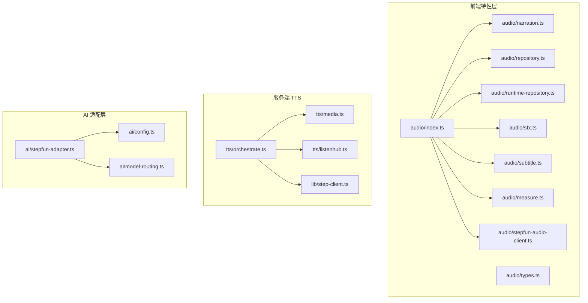
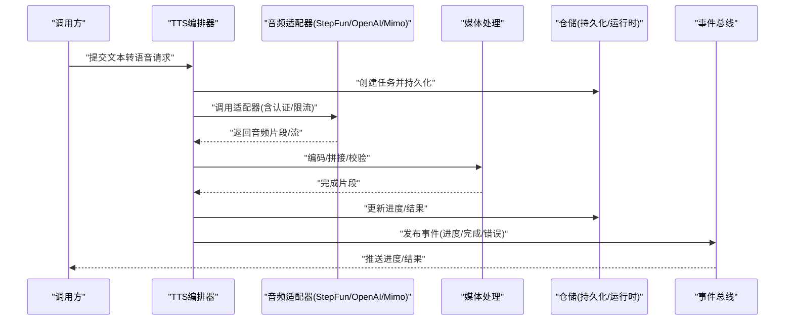
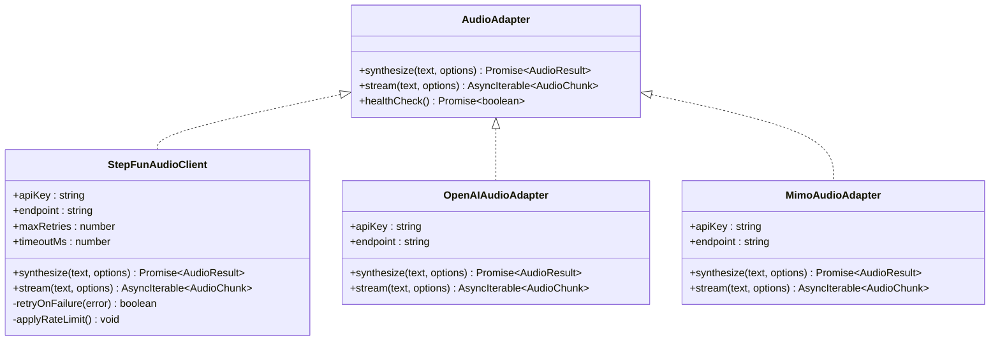
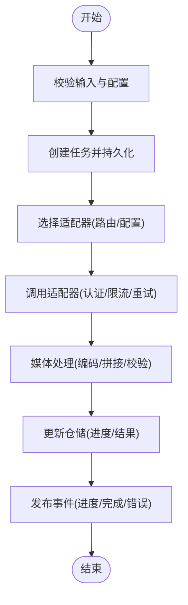
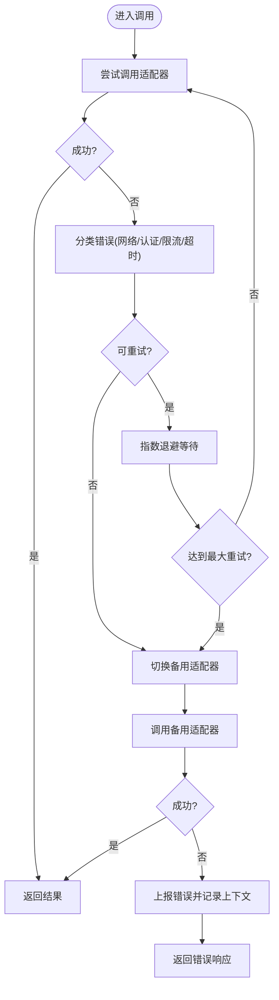
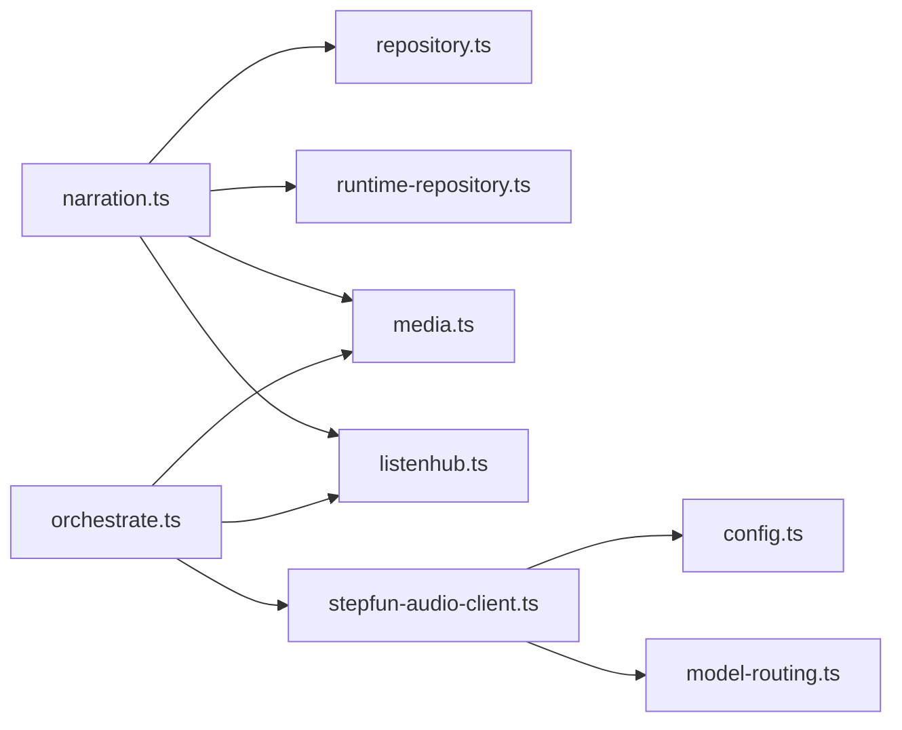

# 音频服务集成

<cite>
**本文档引用的文件**   
- [src/features/audio/index.ts](file://src/features/audio/index.ts)
- [src/features/audio/types.ts](file://src/features/audio/types.ts)
- [src/features/audio/stepfun-audio-client.ts](file://src/features/audio/stepfun-audio-client.ts)
- [src/features/audio/narration.ts](file://src/features/audio/narration.ts)
- [src/features/audio/repository.ts](file://src/features/audio/repository.ts)
- [src/features/audio/runtime-repository.ts](file://src/features/audio/runtime-repository.ts)
- [src/features/audio/sfx.ts](file://src/features/audio/sfx.ts)
- [src/features/audio/subtitle.ts](file://src/features/audio/subtitle.ts)
- [src/features/audio/measure.ts](file://src/features/audio/measure.ts)
- [server/src/tts/orchestrate.ts](file://server/src/tts/orchestrate.ts)
- [server/src/tts/media.ts](file://server/src/tts/media.ts)
- [server/src/tts/listenhub.ts](file://server/src/tts/listenhub.ts)
- [server/src/lib/step-client.ts](file://server/src/lib/step-client.ts)
- [src/features/ai/stepfun-adapter.ts](file://src/features/ai/stepfun-adapter.ts)
- [src/features/ai/config.ts](file://src/features/ai/config.ts)
- [src/features/ai/model-routing.ts](file://src/features/ai/model-routing.ts)
- [tests/tts-config.test.ts](file://tests/tts-config.test.ts)
- [tests/tts-narration.test.ts](file://tests/tts-narration.test.ts)
- [tests/tts-orchestration.test.ts](file://tests/tts-orchestration.test.ts)
- [tests/tts-pipeline-integration.test.ts](file://tests/tts-pipeline-integration.test.ts)
- [tests/tts-runtime.test.ts](file://tests/tts-runtime.test.ts)
</cite>

## 目录
1. [简介](#简介)
2. [项目结构](#项目结构)
3. [核心组件](#核心组件)
4. [架构总览](#架构总览)
5. [详细组件分析](#详细组件分析)
6. [依赖关系分析](#依赖关系分析)
7. [性能考量](#性能考量)
8. [故障排查指南](#故障排查指南)
9. [结论](#结论)
10. [附录](#附录)

## 简介
本文件面向 PurpleInk 平台的“音频服务集成”能力，聚焦与外部音频服务的适配与编排，包括 StepFun、OpenAI Compatible（兼容接口）以及 Mimo 等服务的统一接入。文档将阐述：
- 统一的服务接口设计与适配器模式
- API 调用流程、认证方式与限流策略
- 错误处理机制与重试策略
- 异步请求处理与连接池管理
- 服务切换、故障转移与性能监控方案
- 配置示例与最佳实践

## 项目结构
音频相关代码主要分布在两个区域：
- 前端特性层（src/features/audio）：定义类型、仓储、媒体处理、字幕、音效、时长测量等
- 服务端 TTS 编排（server/src/tts）：负责与外部 TTS/音频服务交互、媒体处理与事件监听
- AI 适配层（src/features/ai）：包含 StepFun 等模型的适配与路由逻辑，可复用至音频场景

图表来源
- [src/features/audio/index.ts](file://src/features/audio/index.ts)
- [server/src/tts/orchestrate.ts](file://server/src/tts/orchestrate.ts)
- [src/features/ai/stepfun-adapter.ts](file://src/features/ai/stepfun-adapter.ts)

章节来源
- [src/features/audio/index.ts](file://src/features/audio/index.ts)
- [server/src/tts/orchestrate.ts](file://server/src/tts/orchestrate.ts)
- [src/features/ai/stepfun-adapter.ts](file://src/features/ai/stepfun-adapter.ts)

## 核心组件
- 统一类型与契约：通过 types.ts 定义跨服务的通用数据结构（如文本转语音请求、响应、元数据），确保各适配器一致实现
- 叙事生成与编排：narration.ts 提供文本到语音的编排入口，协调分片、拼接、质量校验
- 仓储层：repository.ts 与 runtime-repository.ts 分别负责持久化与运行时状态管理（任务、结果、进度）
- 媒体处理：media.ts 负责音频编码、格式转换、流式传输
- 事件监听：listenhub.ts 提供对外部服务回调或流式事件的订阅与分发
- StepFun 客户端：stepfun-audio-client.ts 封装 StepFun 音频 API 的调用细节（认证、重试、限流）
- AI 适配与路由：stepfun-adapter.ts、config.ts、model-routing.ts 提供模型选择与路由策略，可扩展至 OpenAI Compatible 与 Mimo

章节来源
- [src/features/audio/types.ts](file://src/features/audio/types.ts)
- [src/features/audio/narration.ts](file://src/features/audio/narration.ts)
- [src/features/audio/repository.ts](file://src/features/audio/repository.ts)
- [src/features/audio/runtime-repository.ts](file://src/features/audio/runtime-repository.ts)
- [server/src/tts/media.ts](file://server/src/tts/media.ts)
- [server/src/tts/listenhub.ts](file://server/src/tts/listenhub.ts)
- [src/features/audio/stepfun-audio-client.ts](file://src/features/audio/stepfun-audio-client.ts)
- [src/features/ai/stepfun-adapter.ts](file://src/features/ai/stepfun-adapter.ts)
- [src/features/ai/config.ts](file://src/features/ai/config.ts)
- [src/features/ai/model-routing.ts](file://src/features/ai/model-routing.ts)

## 架构总览
整体采用“适配器 + 编排器 + 仓储”的分层架构：
- 适配器层：StepFun、OpenAI Compatible、Mimo 各自实现统一接口
- 编排层：TTS Orchestrate 负责调度、分片、重试、失败回退
- 仓储层：持久化任务与结果，支持查询与恢复
- 事件总线：ListenHub 用于流式事件与回调的统一处理

图表来源
- [server/src/tts/orchestrate.ts](file://server/src/tts/orchestrate.ts)
- [server/src/tts/media.ts](file://server/src/tts/media.ts)
- [server/src/tts/listenhub.ts](file://server/src/tts/listenhub.ts)
- [src/features/audio/repository.ts](file://src/features/audio/repository.ts)
- [src/features/audio/runtime-repository.ts](file://src/features/audio/runtime-repository.ts)

## 详细组件分析

### 统一接口与适配器设计
- 统一接口：在 types.ts 中定义统一的请求/响应契约，包括文本、音色、采样率、输出格式、超时、重试次数等字段
- 适配器实现：
  - StepFun 适配器：stepfun-audio-client.ts 封装 HTTP/流式调用、鉴权头、重试与限流
  - OpenAI Compatible 适配器：遵循 OpenAI 兼容接口规范，复用 stepfun-adapter.ts 中的通用逻辑
  - Mimo 适配器：按相同契约实现，便于后续扩展
- 路由与配置：model-routing.ts 根据配置与负载情况选择具体适配器；config.ts 集中管理密钥、端点、并发与限流参数

图表来源
- [src/features/audio/types.ts](file://src/features/audio/types.ts)
- [src/features/audio/stepfun-audio-client.ts](file://src/features/audio/stepfun-audio-client.ts)
- [src/features/ai/stepfun-adapter.ts](file://src/features/ai/stepfun-adapter.ts)

章节来源
- [src/features/audio/types.ts](file://src/features/audio/types.ts)
- [src/features/audio/stepfun-audio-client.ts](file://src/features/audio/stepfun-audio-client.ts)
- [src/features/ai/stepfun-adapter.ts](file://src/features/ai/stepfun-adapter.ts)
- [src/features/ai/config.ts](file://src/features/ai/config.ts)
- [src/features/ai/model-routing.ts](file://src/features/ai/model-routing.ts)

### 编排器与调用流程
- 编排器职责：接收请求、分片文本、选择适配器、调用、合并结果、写入仓储、发布事件
- 调用流程：
  1) 校验输入与配置
  2) 创建任务并持久化
  3) 选择适配器（基于配置与路由）
  4) 调用适配器（含认证、限流、重试）
  5) 媒体处理（编码、拼接、校验）
  6) 更新仓储并发布事件

图表来源
- [server/src/tts/orchestrate.ts](file://server/src/tts/orchestrate.ts)
- [src/features/audio/repository.ts](file://src/features/audio/repository.ts)
- [src/features/audio/runtime-repository.ts](file://src/features/audio/runtime-repository.ts)

章节来源
- [server/src/tts/orchestrate.ts](file://server/src/tts/orchestrate.ts)

### 错误处理与重试策略
- 错误分类：网络错误、认证失败、限流、服务不可用、超时、数据校验失败
- 重试策略：指数退避、最大重试次数、针对特定错误码的重试条件
- 失败回退：当主适配器失败时，自动切换到备用适配器（如从 StepFun 切换到 OpenAI Compatible）
- 监控与告警：记录错误上下文、耗时、适配器名称，便于定位问题

图表来源
- [src/features/audio/stepfun-audio-client.ts](file://src/features/audio/stepfun-audio-client.ts)
- [src/features/ai/model-routing.ts](file://src/features/ai/model-routing.ts)

章节来源
- [src/features/audio/stepfun-audio-client.ts](file://src/features/audio/stepfun-audio-client.ts)
- [src/features/ai/model-routing.ts](file://src/features/ai/model-routing.ts)

### 认证方式与限流处理
- 认证方式：API Key、Bearer Token、签名请求等，依据不同服务配置
- 限流处理：令牌桶/滑动窗口算法，限制每秒请求数与并发度
- 连接池：复用 HTTP 连接，减少握手开销，提升吞吐

章节来源
- [src/features/ai/config.ts](file://src/features/ai/config.ts)
- [src/features/audio/stepfun-audio-client.ts](file://src/features/audio/stepfun-audio-client.ts)

### 异步请求与连接池管理
- 异步请求：使用异步迭代器进行流式音频数据接收，降低内存占用
- 连接池：维护连接池大小、空闲超时、最大连接数，避免资源耗尽
- 背压控制：在流式传输中处理生产者/消费者速率差异，防止阻塞

章节来源
- [server/src/tts/media.ts](file://server/src/tts/media.ts)
- [server/src/tts/listenhub.ts](file://server/src/tts/listenhub.ts)

### 服务切换、故障转移与性能监控
- 服务切换：基于配置与路由策略动态切换适配器
- 故障转移：健康检查失败时自动降级到备用服务
- 性能监控：采集延迟、吞吐、错误率、缓存命中率等指标

章节来源
- [src/features/ai/model-routing.ts](file://src/features/ai/model-routing.ts)
- [server/src/tts/orchestrate.ts](file://server/src/tts/orchestrate.ts)

## 依赖关系分析
- 前端特性层依赖仓储与媒体处理模块
- 服务端编排器依赖适配器、媒体处理与事件总线
- AI 适配层为音频适配器提供通用逻辑与路由策略

图表来源
- [src/features/audio/narration.ts](file://src/features/audio/narration.ts)
- [src/features/audio/repository.ts](file://src/features/audio/repository.ts)
- [src/features/audio/runtime-repository.ts](file://src/features/audio/runtime-repository.ts)
- [server/src/tts/media.ts](file://server/src/tts/media.ts)
- [server/src/tts/listenhub.ts](file://server/src/tts/listenhub.ts)
- [src/features/audio/stepfun-audio-client.ts](file://src/features/audio/stepfun-audio-client.ts)
- [src/features/ai/config.ts](file://src/features/ai/config.ts)
- [src/features/ai/model-routing.ts](file://src/features/ai/model-routing.ts)
- [server/src/tts/orchestrate.ts](file://server/src/tts/orchestrate.ts)

章节来源
- [src/features/audio/narration.ts](file://src/features/audio/narration.ts)
- [server/src/tts/orchestrate.ts](file://server/src/tts/orchestrate.ts)
- [src/features/ai/model-routing.ts](file://src/features/ai/model-routing.ts)

## 性能考量
- 流式处理：优先使用流式接口，减少内存峰值
- 连接复用：启用 HTTP 连接池，提高并发能力
- 分片策略：合理切分文本，平衡延迟与吞吐
- 缓存策略：对重复请求进行缓存，降低外部服务压力
- 监控指标：延迟、吞吐、错误率、缓存命中率、连接池利用率

## 故障排查指南
- 常见问题：
  - 认证失败：检查 API Key、Token、签名是否正确
  - 限流触发：调整限流参数或增加配额
  - 超时错误：优化网络或增加超时时间
  - 数据损坏：校验音频格式与完整性
- 调试建议：
  - 启用详细日志，记录请求/响应与错误上下文
  - 使用健康检查接口验证服务可用性
  - 逐步隔离问题（适配器、媒体处理、仓储）

章节来源
- [tests/tts-config.test.ts](file://tests/tts-config.test.ts)
- [tests/tts-narration.test.ts](file://tests/tts-narration.test.ts)
- [tests/tts-orchestration.test.ts](file://tests/tts-orchestration.test.ts)
- [tests/tts-pipeline-integration.test.ts](file://tests/tts-pipeline-integration.test.ts)
- [tests/tts-runtime.test.ts](file://tests/tts-runtime.test.ts)

## 结论
PurpleInk 的音频服务集成通过统一接口与适配器模式，实现了多外部服务的无缝接入。编排器负责调度与容错，仓储与事件总线保障状态与实时性。结合认证、限流、连接池与监控，系统具备高可用与高性能特性。未来可扩展更多音频服务，保持架构一致性与可维护性。

## 附录
- 配置示例：参考 config.ts 与测试用例，了解如何设置 API Key、端点、并发与限流
- 使用示例：参考 narration.ts 与 orchestrate.ts，了解如何发起文本转语音请求
- 最佳实践：优先流式处理、合理分片、启用缓存、监控关键指标