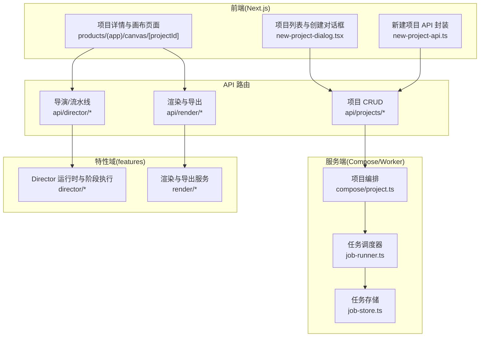
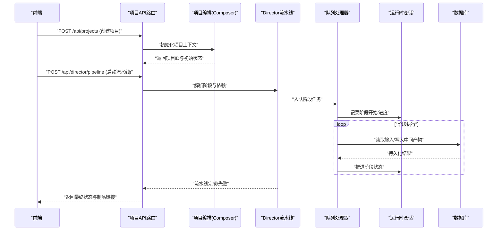
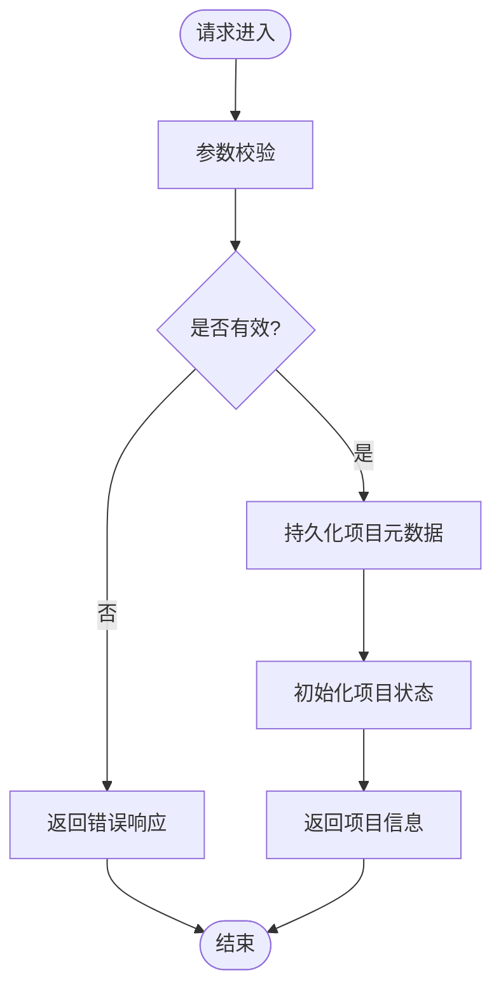
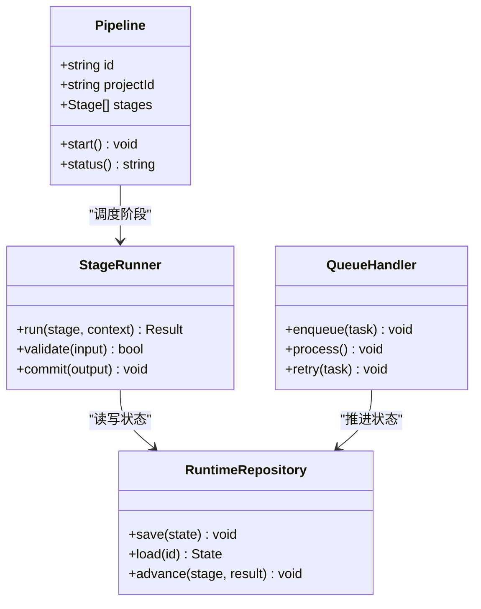
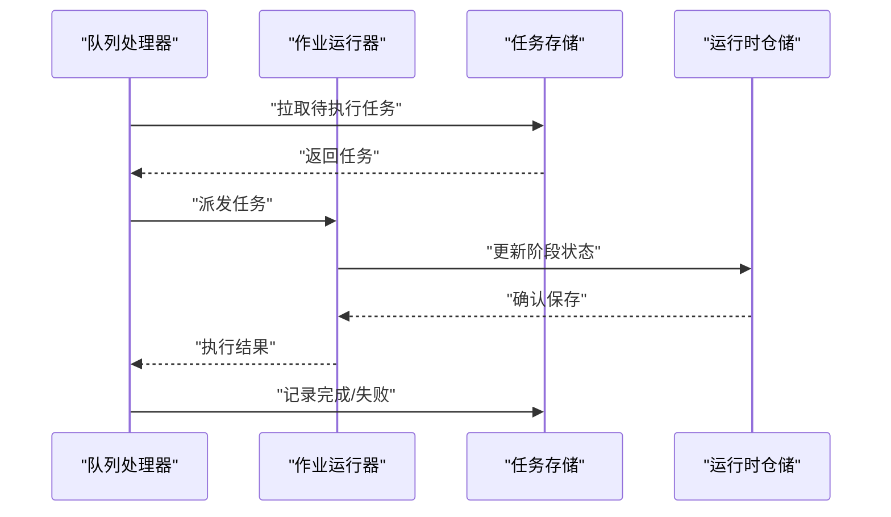
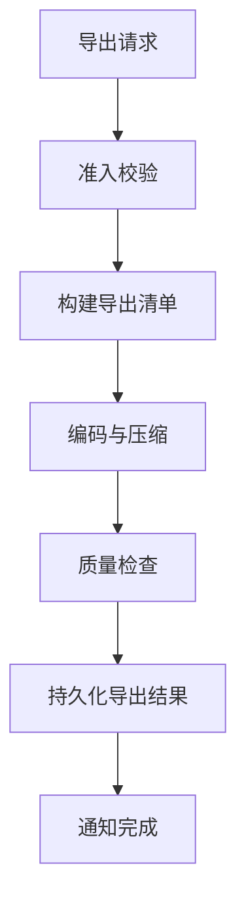
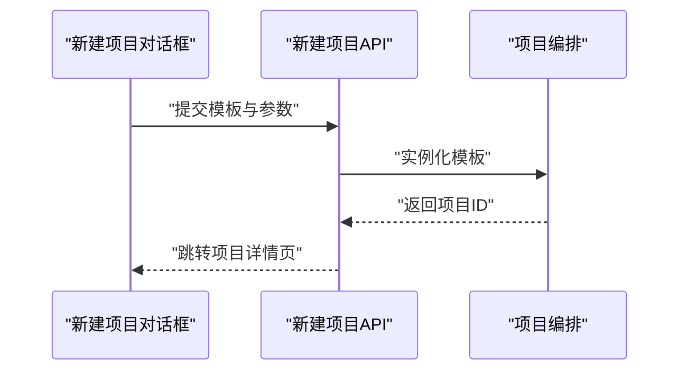
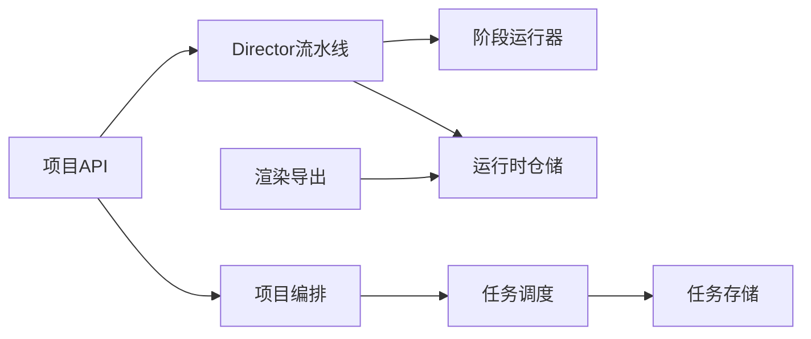

# 项目管理

<cite>
**本文引用的文件**   
- [src/app/api/projects/route.ts](file://src/app/api/projects/route.ts)
- [src/app/api/projects/[id]/route.ts](file://src/app/api/projects/[id]/route.ts)
- [src/app/(public)/release/layout.tsx](file://src/app/(public)/release/layout.tsx)
- [src/app/_components/new-project-dialog.tsx](file://src/app/_components/new-project-dialog.tsx)
- [src/app/_components/new-project-api.ts](file://src/app/_components/new-project-api.ts)
- [src/features/director/pipeline.ts](file://src/features/director/pipeline.ts)
- [src/features/director/advance.ts](file://src/features/director/advance.ts)
- [src/features/director/runtime-repository.ts](file://src/features/director/runtime-repository.ts)
- [src/features/director/stage-runner.ts](file://src/features/director/stage-runner.ts)
- [src/features/director/session-store.ts](file://src/features/director/session-store.ts)
- [src/features/director/queue-handler.ts](file://src/features/director/queue-handler.ts)
- [src/features/render/export-service.ts](file://src/features/render/export-service.ts)
- [src/features/render/repository.ts](file://src/features/render/repository.ts)
- [src/lib/db/index.ts](file://src/lib/db/index.ts)
- [scripts/migration/sqlite-backup.ts](file://scripts/migration/sqlite-backup.ts)
- [scripts/migration/import-postgres.ts](file://scripts/migration/import-postgres.ts)
- [scripts/setup/db-migrate.ts](file://scripts/setup/db-migrate.ts)
- [server/src/compose/project.ts](file://server/src/compose/project.ts)
- [server/src/server/job-runner.ts](file://server/src/server/job-runner.ts)
- [server/src/server/job-store.ts](file://server/src/server/job-store.ts)
</cite>

## 目录
1. [简介](#简介)
2. [项目结构](#项目结构)
3. [核心组件](#核心组件)
4. [架构总览](#架构总览)
5. [详细组件分析](#详细组件分析)
6. [依赖关系分析](#依赖关系分析)
7. [性能考量](#性能考量)
8. [故障排查指南](#故障排查指南)
9. [结论](#结论)
10. [附录：API 示例与最佳实践](#附录api-示例与最佳实践)

## 简介
本文件面向 PurpleInk 平台的项目管理功能，围绕项目生命周期、工作流启动与执行控制、状态同步、数据模型与版本控制、协作与权限、模板系统、导入导出与批量操作、以及备份迁移恢复等主题进行系统化说明。文档以代码仓库为依据，提供架构图、时序图与流程图，帮助读者快速理解并正确使用相关 API 与服务。

## 项目结构
PurpleInk 采用前后端分离与多模块组织方式：
- 前端 Next.js 应用负责页面路由、用户交互与 API 调用
- server 子项目承载编排、渲染、采集等后端能力
- features 层按领域划分（director、render、projects 等）
- scripts 提供数据库迁移、备份与初始化脚本

图表来源
- [src/app/_components/new-project-dialog.tsx](file://src/app/_components/new-project-dialog.tsx)
- [src/app/_components/new-project-api.ts](file://src/app/_components/new-project-api.ts)
- [src/app/api/projects/route.ts](file://src/app/api/projects/route.ts)
- [src/app/api/projects/[id]/route.ts](file://src/app/api/projects/[id]/route.ts)
- [server/src/compose/project.ts](file://server/src/compose/project.ts)
- [server/src/server/job-runner.ts](file://server/src/server/job-runner.ts)
- [server/src/server/job-store.ts](file://server/src/server/job-store.ts)
- [src/features/director/pipeline.ts](file://src/features/director/pipeline.ts)
- [src/features/render/export-service.ts](file://src/features/render/export-service.ts)

章节来源
- [src/app/api/projects/route.ts](file://src/app/api/projects/route.ts)
- [src/app/api/projects/[id]/route.ts](file://src/app/api/projects/[id]/route.ts)
- [server/src/compose/project.ts](file://server/src/compose/project.ts)
- [server/src/server/job-runner.ts](file://server/src/server/job-runner.ts)
- [server/src/server/job-store.ts](file://server/src/server/job-store.ts)

## 核心组件
- 项目生命周期管理：通过 API 路由完成项目的创建、更新、删除与查询；结合 Director 流水线驱动项目从“草稿”到“运行中”再到“完成/失败”的状态流转。
- 工作流启动与执行控制：Director 模块定义阶段（stage）、节点（node）与流水线（pipeline），由队列处理器与任务调度器协调执行。
- 状态同步：使用运行时仓储（runtime-repository）持久化阶段结果与中间产物，确保前后端一致。
- 数据模型与版本控制：项目与制品（artifact）具备版本标识与变更历史，支持回滚与对比。
- 协作与权限：基于会话与角色控制访问范围，敏感配置通过凭据信封加密存储。
- 模板系统与导入导出：内置模板用于快速生成项目骨架；导出服务支持将项目制品打包为可分发格式。
- 批量操作：通过队列与批处理处理器实现批量任务提交与进度聚合。

章节来源
- [src/app/api/projects/route.ts](file://src/app/api/projects/route.ts)
- [src/app/api/projects/[id]/route.ts](file://src/app/api/projects/[id]/route.ts)
- [src/features/director/pipeline.ts](file://src/features/director/pipeline.ts)
- [src/features/director/advance.ts](file://src/features/director/advance.ts)
- [src/features/director/runtime-repository.ts](file://src/features/director/runtime-repository.ts)
- [src/features/render/export-service.ts](file://src/features/render/export-service.ts)

## 架构总览
下图展示从前端发起项目创建到后端编排执行的端到端流程，包括 API 路由、Composer、Director 流水线、任务调度与持久化。

图表来源
- [src/app/api/projects/route.ts](file://src/app/api/projects/route.ts)
- [src/app/api/projects/[id]/route.ts](file://src/app/api/projects/[id]/route.ts)
- [server/src/compose/project.ts](file://server/src/compose/project.ts)
- [src/features/director/pipeline.ts](file://src/features/director/pipeline.ts)
- [src/features/director/queue-handler.ts](file://src/features/director/queue-handler.ts)
- [src/features/director/runtime-repository.ts](file://src/features/director/runtime-repository.ts)
- [src/lib/db/index.ts](file://src/lib/db/index.ts)

## 详细组件分析

### 项目 API 与生命周期
- 创建项目：接收名称、模板、初始设置，校验后落库并返回项目 ID。
- 更新/删除项目：支持字段级更新与软删除策略，保留审计日志。
- 查询项目：支持分页、过滤与排序，便于仪表盘与列表展示。

图表来源
- [src/app/api/projects/route.ts](file://src/app/api/projects/route.ts)
- [src/app/api/projects/[id]/route.ts](file://src/app/api/projects/[id]/route.ts)

章节来源
- [src/app/api/projects/route.ts](file://src/app/api/projects/route.ts)
- [src/app/api/projects/[id]/route.ts](file://src/app/api/projects/[id]/route.ts)

### Director 流水线与工作流执行
- 流水线定义：包含阶段（ingest、fabricate、assemble、finalize 等）及其依赖关系。
- 阶段执行：每个阶段由阶段运行器负责，读取输入、执行业务逻辑、产出中间制品。
- 状态推进：根据阶段结果推进流水线状态，支持重试、回退与补偿。

图表来源
- [src/features/director/pipeline.ts](file://src/features/director/pipeline.ts)
- [src/features/director/stage-runner.ts](file://src/features/director/stage-runner.ts)
- [src/features/director/runtime-repository.ts](file://src/features/director/runtime-repository.ts)
- [src/features/director/queue-handler.ts](file://src/features/director/queue-handler.ts)

章节来源
- [src/features/director/pipeline.ts](file://src/features/director/pipeline.ts)
- [src/features/director/advance.ts](file://src/features/director/advance.ts)
- [src/features/director/stage-runner.ts](file://src/features/director/stage-runner.ts)
- [src/features/director/runtime-repository.ts](file://src/features/director/runtime-repository.ts)
- [src/features/director/queue-handler.ts](file://src/features/director/queue-handler.ts)

### 任务调度与持久化
- 任务调度：队列处理器消费任务，分配至 Worker 或内联执行，支持并发与限流。
- 任务存储：JobStore 提供任务状态、重试次数与超时控制。
- 作业运行器：JobRunner 协调任务生命周期，保证幂等性与一致性。

图表来源
- [server/src/server/job-runner.ts](file://server/src/server/job-runner.ts)
- [server/src/server/job-store.ts](file://server/src/server/job-store.ts)
- [src/features/director/runtime-repository.ts](file://src/features/director/runtime-repository.ts)

章节来源
- [server/src/server/job-runner.ts](file://server/src/server/job-runner.ts)
- [server/src/server/job-store.ts](file://server/src/server/job-store.ts)
- [src/features/director/runtime-repository.ts](file://src/features/director/runtime-repository.ts)

### 渲染与导出
- 导出服务：聚合制品、生成缩略图、输出归档包，支持异步任务与进度回调。
- 渲染仓储：管理渲染任务、帧序列与质量检查。

图表来源
- [src/features/render/export-service.ts](file://src/features/render/export-service.ts)
- [src/features/render/repository.ts](file://src/features/render/repository.ts)

章节来源
- [src/features/render/export-service.ts](file://src/features/render/export-service.ts)
- [src/features/render/repository.ts](file://src/features/render/repository.ts)

### 项目模板与新建项目
- 模板系统：预置项目结构与默认阶段配置，支持自定义模板注册。
- 新建项目对话框：引导选择模板、填写必要参数，调用 API 创建项目。

图表来源
- [src/app/_components/new-project-dialog.tsx](file://src/app/_components/new-project-dialog.tsx)
- [src/app/_components/new-project-api.ts](file://src/app/_components/new-project-api.ts)
- [server/src/compose/project.ts](file://server/src/compose/project.ts)

章节来源
- [src/app/_components/new-project-dialog.tsx](file://src/app/_components/new-project-dialog.tsx)
- [src/app/_components/new-project-api.ts](file://src/app/_components/new-project-api.ts)
- [server/src/compose/project.ts](file://server/src/compose/project.ts)

### 版本控制与协作
- 版本控制：项目与制品维护版本号与快照，支持差异对比与回滚。
- 协作与权限：基于会话与角色控制访问，敏感凭据通过信封加密存储。

章节来源
- [src/features/artifacts/commit.ts](file://src/features/artifacts/commit.ts)
- [src/features/artifacts/service.ts](file://src/features/artifacts/service.ts)
- [src/features/credentials/credential-envelope.ts](file://src/features/credentials/credential-envelope.ts)

## 依赖关系分析
- 低耦合高内聚：API 路由仅负责协议与鉴权，业务逻辑下沉至 features 层。
- 外部依赖：数据库连接、对象存储、消息队列与第三方服务（如 AI 模型）。
- 潜在循环依赖：通过接口与事件解耦，避免直接引用。

图表来源
- [src/app/api/projects/route.ts](file://src/app/api/projects/route.ts)
- [server/src/compose/project.ts](file://server/src/compose/project.ts)
- [src/features/director/pipeline.ts](file://src/features/director/pipeline.ts)
- [src/features/director/stage-runner.ts](file://src/features/director/stage-runner.ts)
- [src/features/director/runtime-repository.ts](file://src/features/director/runtime-repository.ts)
- [server/src/server/job-runner.ts](file://server/src/server/job-runner.ts)
- [server/src/server/job-store.ts](file://server/src/server/job-store.ts)

章节来源
- [src/app/api/projects/route.ts](file://src/app/api/projects/route.ts)
- [server/src/compose/project.ts](file://server/src/compose/project.ts)
- [src/features/director/pipeline.ts](file://src/features/director/pipeline.ts)
- [server/src/server/job-runner.ts](file://server/src/server/job-runner.ts)

## 性能考量
- 流水线并行：对无依赖的阶段进行并行执行，提升吞吐。
- 缓存与复用：中间产物与缩略图缓存，减少重复计算。
- 背压与限流：队列容量与消费者并发限制，防止过载。
- 大文件处理：分块上传与流式处理，降低内存峰值。

[本节为通用指导，不直接分析具体文件]

## 故障排查指南
- 常见错误：参数校验失败、阶段执行异常、任务超时、存储写入失败。
- 诊断步骤：查看任务日志、检查运行时仓储状态、核对依赖服务健康度。
- 恢复策略：重试机制、补偿事务、回滚到上一稳定版本。

章节来源
- [src/features/director/advance.ts](file://src/features/director/advance.ts)
- [src/features/director/runtime-repository.ts](file://src/features/director/runtime-repository.ts)
- [server/src/server/job-runner.ts](file://server/src/server/job-runner.ts)

## 结论
PurpleInk 的项目管理以清晰的 API 边界、可扩展的 Director 流水线与稳健的任务调度为核心，配合完善的渲染导出与版本控制，满足复杂媒体生产场景的需求。通过模板化与批量操作，显著提升团队协作效率与交付质量。

[本节为总结性内容，不直接分析具体文件]

## 附录：API 示例与最佳实践

### 创建项目
- 方法：POST /api/projects
- 请求体：名称、模板标识、初始设置
- 响应：项目 ID、初始状态、资源链接

章节来源
- [src/app/api/projects/route.ts](file://src/app/api/projects/route.ts)

### 启动工作流
- 方法：POST /api/director/pipeline
- 请求体：项目 ID、目标阶段、参数
- 响应：流水线 ID、阶段队列、进度查询端点

章节来源
- [src/app/api/projects/[id]/route.ts](file://src/app/api/projects/[id]/route.ts)
- [src/features/director/pipeline.ts](file://src/features/director/pipeline.ts)

### 执行任务
- 方法：POST /api/jobs/{id}/execute
- 请求体：任务参数、优先级
- 响应：任务状态、预计完成时间

章节来源
- [src/features/director/queue-handler.ts](file://src/features/director/queue-handler.ts)
- [server/src/server/job-runner.ts](file://server/src/server/job-runner.ts)

### 导出项目
- 方法：POST /api/render/export
- 请求体：项目 ID、导出格式、质量选项
- 响应：导出任务 ID、下载链接（完成后）

章节来源
- [src/features/render/export-service.ts](file://src/features/render/export-service.ts)

### 数据备份、迁移与恢复最佳实践
- 备份：定期导出 SQLite 快照，校验完整性
- 迁移：使用迁移脚本将数据导入 PostgreSQL，验证一致性
- 恢复：从备份还原，重建索引与缓存

章节来源
- [scripts/migration/sqlite-backup.ts](file://scripts/migration/sqlite-backup.ts)
- [scripts/migration/import-postgres.ts](file://scripts/migration/import-postgres.ts)
- [scripts/setup/db-migrate.ts](file://scripts/setup/db-migrate.ts)
- [src/lib/db/index.ts](file://src/lib/db/index.ts)