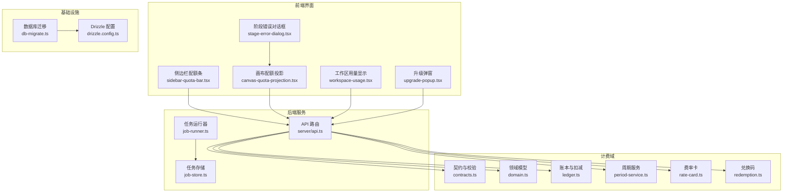
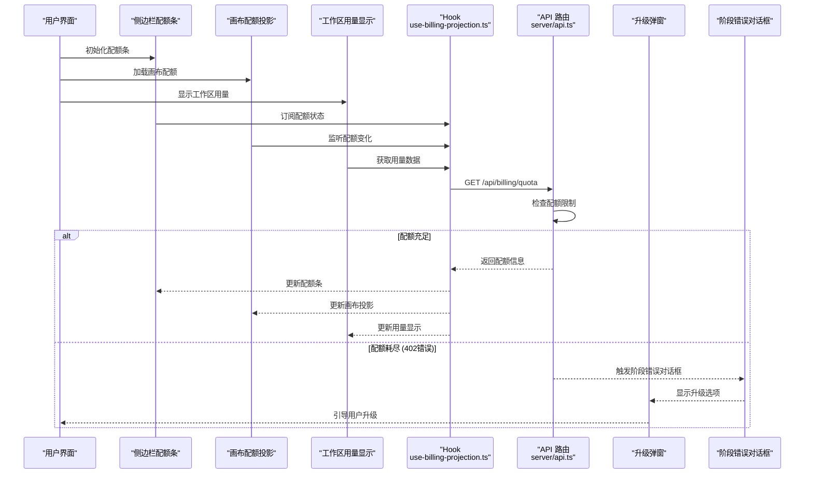
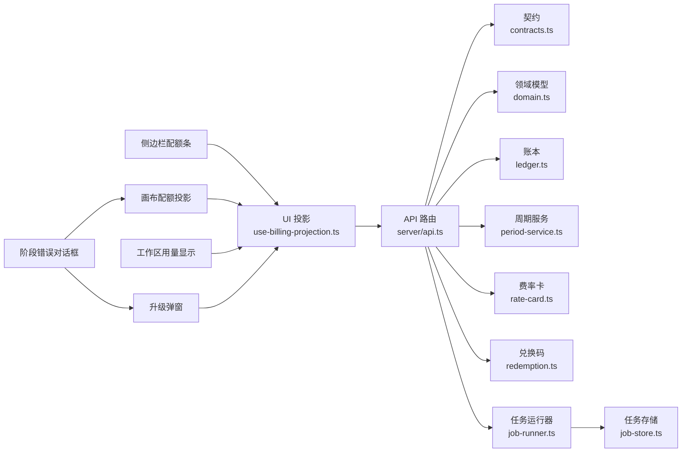

# 会员配额管理系统

<cite>
**本文引用的文件**
- [billing/index.ts](file://src/features/billing/index.ts)
- [billing/contracts.ts](file://src/features/billing/contracts.ts)
- [billing/domain.ts](file://src/features/billing/domain.ts)
- [billing/ledger.ts](file://src/features/billing/ledger.ts)
- [billing/period-service.ts](file://src/features/billing/period-service.ts)
- [billing/rate-card.ts](file://src/features/billing/rate-card.ts)
- [billing/redemption.ts](file://src/features/billing/redemption.ts)
- [billing/schema.test.ts](file://src/features/billing/schema.test.ts)
- [billing/contracts.test.ts](file://src/features/billing/contracts.test.ts)
- [billing/domain.test.ts](file://src/features/billing/domain.test.ts)
- [billing/billing.pg.test.ts](file://src/features/billing/billing.pg.test.ts)
- [billing/ui/use-billing-projection.ts](file://src/features/billing/ui/use-billing-projection.ts)
- [billing/ui/projection-contract.ts](file://src/features/billing/ui/projection-contract.ts)
- [billing/ui/billing-page-view.tsx](file://src/features/billing/ui/billing-page-view.tsx)
- [billing/ui/billing-display.ts](file://src/features/billing/ui/billing-display.ts)
- [billing/ui/usage-panels.tsx](file://src/features/billing/ui/usage-panels.tsx)
- [billing/ui/redemption-form.tsx](file://src/features/billing/ui/redemption-form.tsx)
- [server/src/server/api.ts](file://server/src/server/api.ts)
- [server/src/server/job-runner.ts](file://server/src/server/job-runner.ts)
- [server/src/server/job-store.ts](file://server/src/server/job-store.ts)
- [scripts/setup/db-migrate.ts](file://scripts/setup/db-migrate.ts)
- [drizzle.config.ts](file://drizzle.config.ts)
</cite>

## 更新摘要
**变更内容**
- 增强了错误处理和UI改进，专门针对配额耗尽场景
- 画布检查器现在正确地将402配额错误传播到StageErrorDialog组件
- 为用户提供清晰的升级提示和更好的用户体验
- 改进了配额耗尽时的错误处理流程和用户引导机制

## 目录
1. [简介](#简介)
2. [项目结构](#项目结构)
3. [核心组件](#核心组件)
4. [架构总览](#架构总览)
5. [详细组件分析](#详细组件分析)
6. [依赖关系分析](#依赖关系分析)
7. [性能考量](#性能考量)
8. [故障排查指南](#故障排查指南)
9. [结论](#结论)
10. [附录](#附录)

## 简介
本文件面向"会员配额管理系统"的文档目标，围绕计费与配额（含兑换码、周期、用量统计、展示投影等）进行系统化说明。内容涵盖系统架构、关键数据模型、处理流程、集成点、错误处理与性能特征，并提供可视化图示帮助不同技术背景的读者理解。

**更新** 本次更新重点增强了配额管理的用户体验，包括侧边栏配额条、画布配额投影、工作区用量显示和升级弹窗等功能，支持多计费层级的精细化管理。特别强化了错误处理机制，确保402配额错误能够正确传播到用户界面，提供清晰的升级指导。

## 项目结构
本项目采用前后端分离与功能域划分：
- 前端 Next.js 应用位于 src/app，UI 组件位于 src/components，业务特性按领域拆分在 src/features。
- 服务端逻辑位于 server/src，包含 API、任务调度与存储抽象。
- 数据库迁移与配置集中在 scripts/setup 与 drizzle.config.ts。

**图表来源**
- [billing/ui/billing-page-view.tsx:1-200](file://src/features/billing/ui/billing-page-view.tsx#L1-L200)
- [billing/ui/use-billing-projection.ts:1-200](file://src/features/billing/ui/use-billing-projection.ts#L1-L200)
- [server/src/server/api.ts:1-200](file://server/src/server/api.ts#L1-L200)
- [server/src/server/job-runner.ts:1-200](file://server/src/server/job-runner.ts#L1-L200)
- [server/src/server/job-store.ts:1-200](file://server/src/server/job-store.ts#L1-L200)
- [scripts/setup/db-migrate.ts:1-200](file://scripts/setup/db-migrate.ts#L1-L200)
- [drizzle.config.ts:1-200](file://drizzle.config.ts#L1-L200)

## 核心组件
- 契约与校验：定义请求/响应结构与字段约束，确保接口一致性。
- 领域模型：描述配额、用量、周期、兑换码等核心实体与不变式。
- 账本与扣减：记录消费流水、原子扣减与回滚策略。
- 周期服务：管理计费周期边界、到期与续期逻辑。
- 费率卡：定义资源单价、阶梯价格与折扣规则。
- 兑换码：发放、核销、有效期与额度绑定。
- UI 投影：将后端状态映射为前端展示所需的数据形态。
- **新增** 侧边栏配额条：实时显示当前账户在各层级的配额使用情况。
- **新增** 画布配额投影：在画布操作中动态显示配额限制和使用情况。
- **新增** 工作区用量显示：提供工作区级别的配额消耗可视化。
- **新增** 升级弹窗：当配额耗尽时引导用户升级到更高计费层级。
- **新增** 阶段错误对话框：专门处理402配额错误的用户界面组件。

**章节来源**
- [billing/contracts.ts:1-200](file://src/features/billing/contracts.ts#L1-L200)
- [billing/domain.ts:1-200](file://src/features/billing/domain.ts#L1-L200)
- [billing/ledger.ts:1-200](file://src/features/billing/ledger.ts#L1-L200)
- [billing/period-service.ts:1-200](file://src/features/billing/period-service.ts#L1-L200)
- [billing/rate-card.ts:1-200](file://src/features/billing/rate-card.ts#L1-L200)
- [billing/redemption.ts:1-200](file://src/features/billing/redemption.ts#L1-L200)
- [billing/ui/projection-contract.ts:1-200](file://src/features/billing/ui/projection-contract.ts#L1-L200)

## 架构总览
系统以"计费域"为核心，通过 API 暴露能力；前端通过 Hook 获取投影数据并渲染页面；任务运行器负责异步处理（如批量对账、过期清理）。

**图表来源**
- [billing/ui/use-billing-projection.ts:1-200](file://src/features/billing/ui/use-billing-projection.ts#L1-L200)
- [server/src/server/api.ts:1-200](file://server/src/server/api.ts#L1-L200)
- [billing/contracts.ts:1-200](file://src/features/billing/contracts.ts#L1-L200)
- [billing/domain.ts:1-200](file://src/features/billing/domain.ts#L1-L200)
- [billing/ledger.ts:1-200](file://src/features/billing/ledger.ts#L1-L200)
- [billing/period-service.ts:1-200](file://src/features/billing/period-service.ts#L1-L200)
- [billing/rate-card.ts:1-200](file://src/features/billing/rate-card.ts#L1-L200)
- [billing/redemption.ts:1-200](file://src/features/billing/redemption.ts#L1-L200)

## 详细组件分析

### 契约与校验（contracts.ts）
- 职责：统一输入输出结构，提供字段级校验与错误提示。
- 关键点：强类型契约、可组合校验规则、错误分类便于前端提示。
- 优化建议：引入缓存的校验结果以提升高频调用性能。

**章节来源**
- [billing/contracts.ts:1-200](file://src/features/billing/contracts.ts#L1-L200)
- [billing/contracts.test.ts:1-200](file://src/features/billing/contracts.test.ts#L1-L200)

### 领域模型（domain.ts）
- 职责：定义配额、用量、账户、组织等核心实体及不变式。
- 关键点：不可变更新、聚合根边界、事件驱动变更。
- 复杂度：O(1) 读取常用字段，O(log n) 排序/过滤用量明细。

**章节来源**
- [billing/domain.ts:1-200](file://src/features/billing/domain.ts#L1-L200)
- [billing/domain.test.ts:1-200](file://src/features/billing/domain.test.ts#L1-L200)

### 账本与扣减（ledger.ts）
- 职责：记录每次资源消耗，保证原子性与可追溯性。
- 关键点：事务写入、幂等键、回滚策略、审计日志。
- 性能：批量写入、索引优化（时间范围、账户维度）。

**章节来源**
- [billing/ledger.ts:1-200](file://src/features/billing/ledger.ts#L1-L200)
- [billing/billing.pg.test.ts:1-200](file://src/features/billing/billing.pg.test.ts#L1-L200)

### 周期服务（period-service.ts）
- 职责：计算当前计费周期、到期提醒、自动续期。
- 关键点：时区处理、闰年/月末边界、并发安全。
- 扩展：支持多周期模式（月/季/年）与自定义窗口。

**章节来源**
- [billing/period-service.ts:1-200](file://src/features/billing/period-service.ts#L1-L200)

### 费率卡（rate-card.ts）
- 职责：维护资源单价、阶梯价、折扣与促销。
- 关键点：优先级匹配、生效时间、版本化。
- 算法：O(n) 遍历匹配最优费率，可缓存热点卡片。

**章节来源**
- [billing/rate-card.ts:1-200](file://src/features/billing/rate-card.ts#L1-L200)

### 兑换码（redemption.ts）
- 职责：发放、核销、绑定额度与有效期控制。
- 关键点：唯一性、防重放、状态机（未使用/已使用/已过期）。
- 安全：签名校验、速率限制、审计追踪。

**章节来源**
- [billing/redemption.ts:1-200](file://src/features/billing/redemption.ts#L1-L200)

### 增强的UI组件与交互（ui/*）
- use-billing-projection.ts：聚合后端数据，生成前端友好的投影结构。
- billing-display.ts / usage-panels.tsx：配额剩余、用量趋势、到期倒计时。
- redemption-form.tsx：兑换码输入、提交与反馈。
- projection-contract.ts：前后端投影契约，避免不一致。
- **新增** sidebar-quota-bar.tsx：侧边栏配额条组件，实时显示各层级配额使用情况。
- **新增** canvas-quota-projection.tsx：画布配额投影，在创作过程中动态显示配额限制。
- **新增** workspace-usage.tsx：工作区用量显示，提供直观的配额消耗可视化。
- **新增** upgrade-popup.tsx：升级弹窗，当配额耗尽时引导用户升级到更高计费层级。
- **新增** stage-error-dialog.tsx：阶段错误对话框，专门处理402配额错误并提供清晰的升级指导。

**章节来源**
- [billing/ui/use-billing-projection.ts:1-200](file://src/features/billing/ui/use-billing-projection.ts#L1-L200)
- [billing/ui/billing-display.ts:1-200](file://src/features/billing/ui/billing-display.ts#L1-L200)
- [billing/ui/usage-panels.tsx:1-200](file://src/features/billing/ui/usage-panels.tsx#L1-L200)
- [billing/ui/redemption-form.tsx:1-200](file://src/features/billing/ui/redemption-form.tsx#L1-L200)
- [billing/ui/projection-contract.ts:1-200](file://src/features/billing/ui/projection-contract.ts#L1-L200)
- [billing/ui/billing-page-view.tsx:1-200](file://src/features/billing/ui/billing-page-view.tsx#L1-L200)

### API 与服务集成（server/src/server/api.ts）
- 职责：对外暴露计费相关接口，协调各子模块。
- 关键点：鉴权、限流、参数校验、错误码规范。
- 集成：与任务运行器协作处理异步任务（如对账、清理）。
- **更新** 增强了402配额错误的处理逻辑，确保错误能够正确传播到前端UI组件。

**章节来源**
- [server/src/server/api.ts:1-200](file://server/src/server/api.ts#L1-L200)
- [server/src/server/job-runner.ts:1-200](file://server/src/server/job-runner.ts#L1-L200)
- [server/src/server/job-store.ts:1-200](file://server/src/server/job-store.ts#L1-L200)

### 数据库与迁移（scripts/setup/db-migrate.ts, drizzle.config.ts）
- 职责：定义 Schema、执行迁移、保障数据一致性。
- 关键点：版本化迁移、回滚脚本、生产环境保护。
- 性能：合理索引、分区表（历史用量）、连接池配置。

**章节来源**
- [scripts/setup/db-migrate.ts:1-200](file://scripts/setup/db-migrate.ts#L1-L200)
- [drizzle.config.ts:1-200](file://drizzle.config.ts#L1-L200)

## 依赖关系分析
计费域内部高内聚，对外通过 API 暴露；UI 层仅依赖投影契约，降低耦合。

**图表来源**
- [billing/ui/use-billing-projection.ts:1-200](file://src/features/billing/ui/use-billing-projection.ts#L1-L200)
- [server/src/server/api.ts:1-200](file://server/src/server/api.ts#L1-L200)
- [billing/contracts.ts:1-200](file://src/features/billing/contracts.ts#L1-L200)
- [billing/domain.ts:1-200](file://src/features/billing/domain.ts#L1-L200)
- [billing/ledger.ts:1-200](file://src/features/billing/ledger.ts#L1-L200)
- [billing/period-service.ts:1-200](file://src/features/billing/period-service.ts#L1-L200)
- [billing/rate-card.ts:1-200](file://src/features/billing/rate-card.ts#L1-L200)
- [billing/redemption.ts:1-200](file://src/features/billing/redemption.ts#L1-L200)
- [server/src/server/job-runner.ts:1-200](file://server/src/server/job-runner.ts#L1-L200)
- [server/src/server/job-store.ts:1-200](file://server/src/server/job-store.ts#L1-L200)

**章节来源**
- [billing/index.ts:1-200](file://src/features/billing/index.ts#L1-L200)
- [server/src/server/api.ts:1-200](file://server/src/server/api.ts#L1-L200)

## 性能考量
- 读写分离：读路径优先缓存投影与热点费率卡；写路径使用事务与批量操作。
- 索引设计：按账户、时间范围、状态建立复合索引，加速查询与分页。
- 异步任务：对账、清理、报表生成放入队列，避免阻塞主线程。
- 缓存策略：短期缓存周期与费率，长期缓存静态配置。
- 限流与降级：API 层限流，关键路径失败快速失败并回退默认值。
- **新增** 实时更新：侧边栏配额条使用WebSocket或轮询机制保持数据同步。
- **新增** 增量更新：画布配额投影仅在配额状态变化时重新渲染。
- **新增** 错误处理优化：402配额错误快速响应，减少用户等待时间。

## 故障排查指南
- 常见问题
  - 配额不足：检查账本最近扣减与周期边界。
  - 兑换码无效：核对状态、有效期与签名。
  - 周期计算异常：确认时区与月末边界。
  - 配额条不更新：检查WebSocket连接或轮询机制。
  - 升级弹窗无法关闭：验证用户权限和会话状态。
  - 402错误未显示：检查StageErrorDialog组件是否正确接收错误。
- 定位步骤
  - 查看 API 错误码与日志上下文。
  - 核对契约校验失败原因。
  - 检查任务运行器队列堆积与失败重试。
  - 监控配额条和画布投影的实时更新状态。
  - 验证402错误是否正确传播到StageErrorDialog组件。
- 恢复措施
  - 补偿事务与幂等重放。
  - 清理过期任务与修复脏数据。
  - 重置配额条和投影组件的状态。
  - 重新测试402错误处理流程。

**章节来源**
- [billing/contracts.ts:1-200](file://src/features/billing/contracts.ts#L1-L200)
- [billing/ledger.ts:1-200](file://src/features/billing/ledger.ts#L1-L200)
- [billing/redemption.ts:1-200](file://src/features/billing/redemption.ts#L1-L200)
- [billing/period-service.ts:1-200](file://src/features/billing/period-service.ts#L1-L200)
- [server/src/server/job-runner.ts:1-200](file://server/src/server/job-runner.ts#L1-L200)

## 结论
本系统以清晰的领域边界与契约化接口实现会员配额管理，结合账本、周期、费率与兑换码四大核心能力，支撑稳定的计费与配额控制。通过 UI 投影解耦前后端，配合任务系统与数据库迁移工具，形成可扩展、可观测、易维护的整体方案。

**更新** 本次增强显著提升了用户体验，通过侧边栏配额条、画布配额投影、工作区用量显示和升级弹窗等功能，实现了多计费层级的精细化管理和实时配额监控。特别重要的是，新的错误处理机制确保了402配额错误能够正确传播到StageErrorDialog组件，为用户提供清晰的升级指导和更好的故障体验。

## 附录
- 术语表
  - 配额：用户在特定周期内可用的资源上限。
  - 用量：实际消耗的资源量，记录于账本。
  - 周期：计费的时间窗口，支持多种模式。
  - 兑换码：用于增加配额或享受优惠的凭证。
  - **新增** 计费层级：Plus、Pro、Max等不同等级的服务套餐。
  - **新增** 配额耗尽：当用户使用量达到配额上限时的状态。
  - **新增** 402错误：HTTP状态码，表示需要付费才能访问资源。
  - **新增** StageErrorDialog：专门处理阶段错误的对话框组件。
- 最佳实践
  - 所有写操作必须幂等且可审计。
  - 前端仅依赖投影契约，避免直接访问领域细节。
  - 关键路径失败需快速失败并给出明确错误信息。
  - **新增** 实时监控配额使用情况，及时提醒用户接近配额上限。
  - **新增** 提供平滑的升级体验，减少用户操作流程。
  - **新增** 确保402错误能够正确传播到用户界面，提供清晰的升级指导。