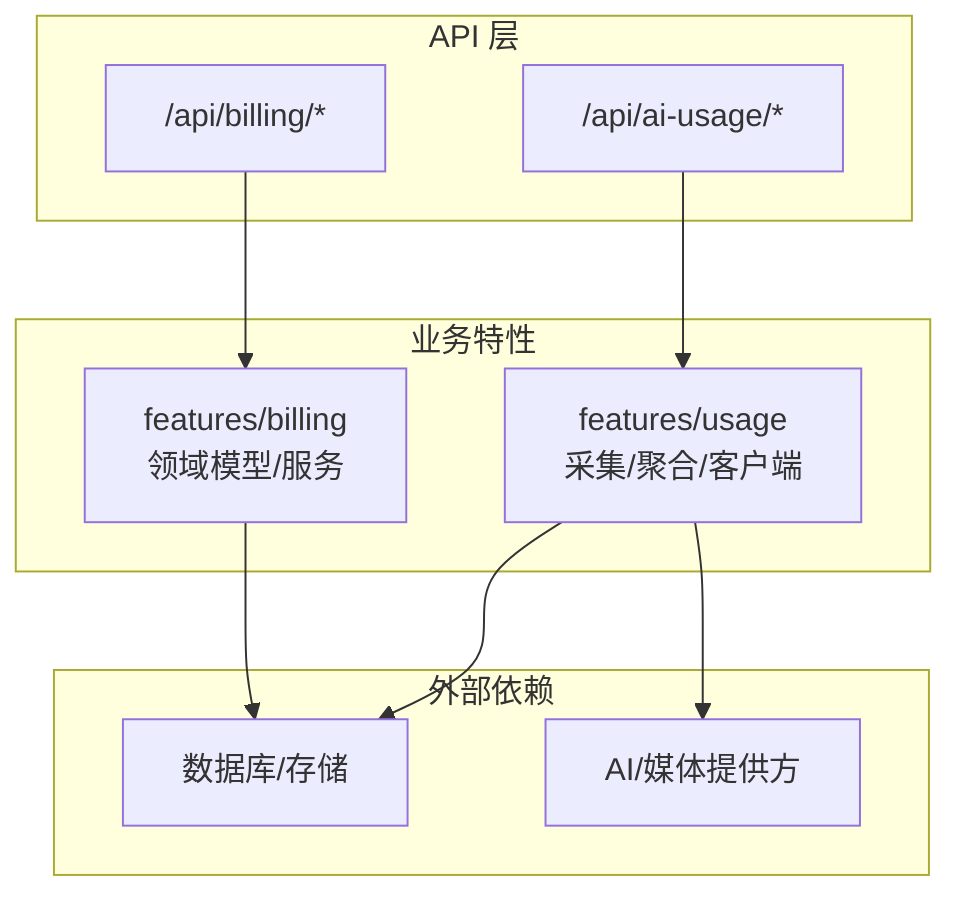
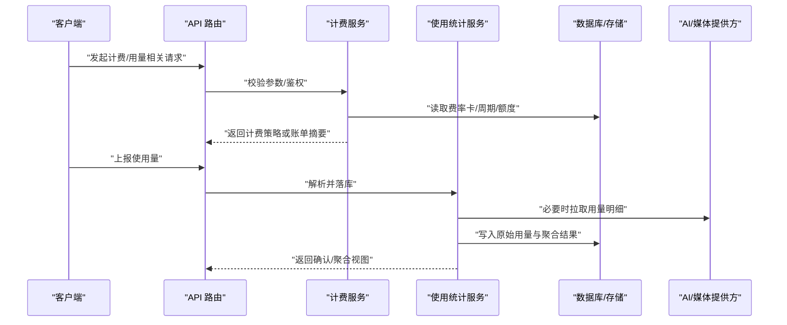
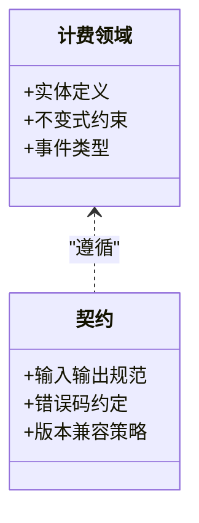
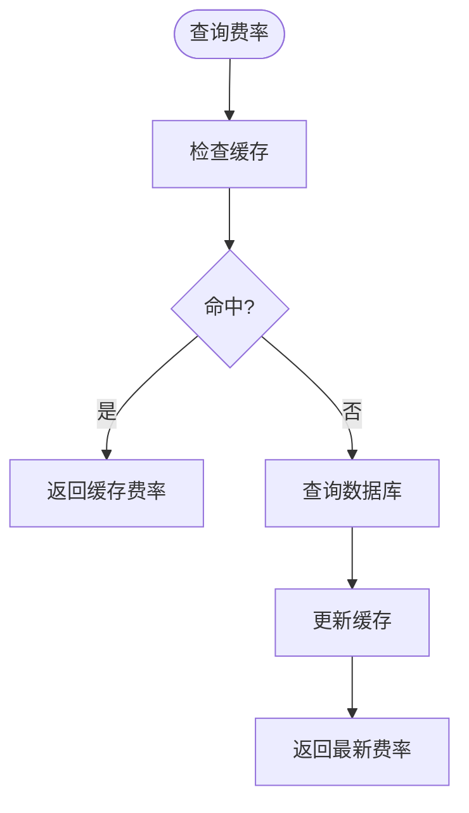
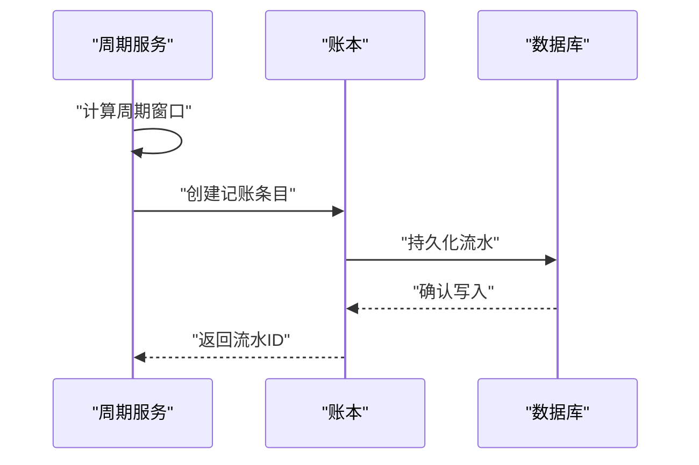
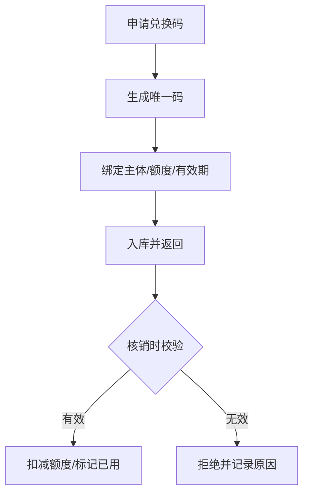
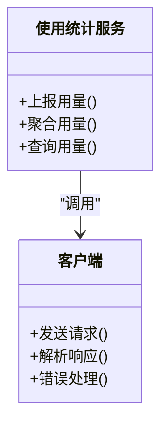
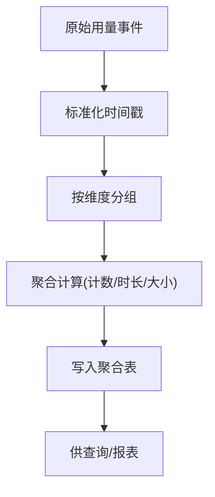
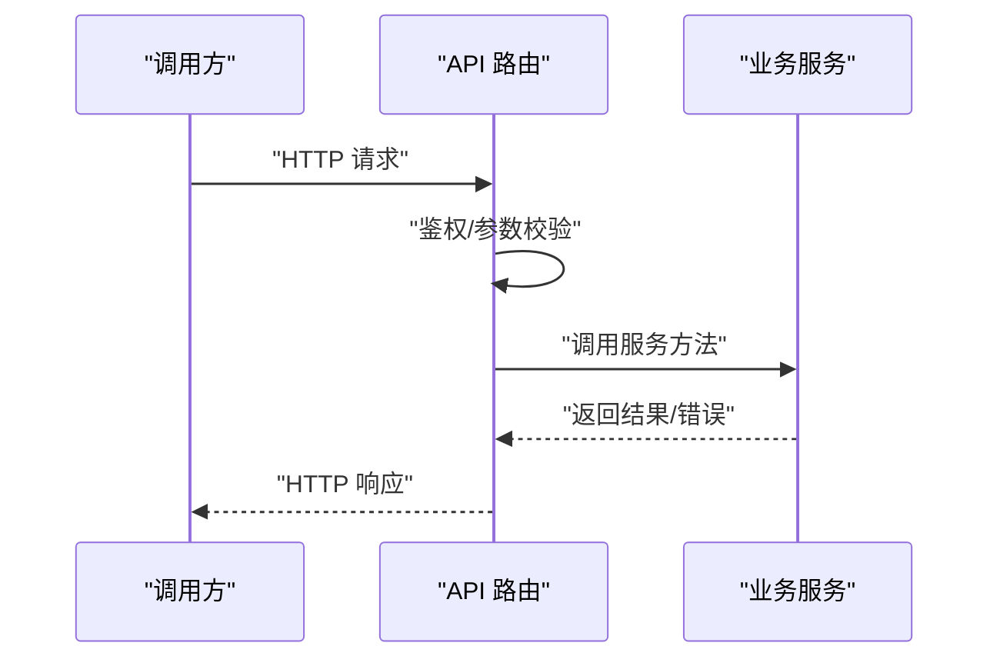
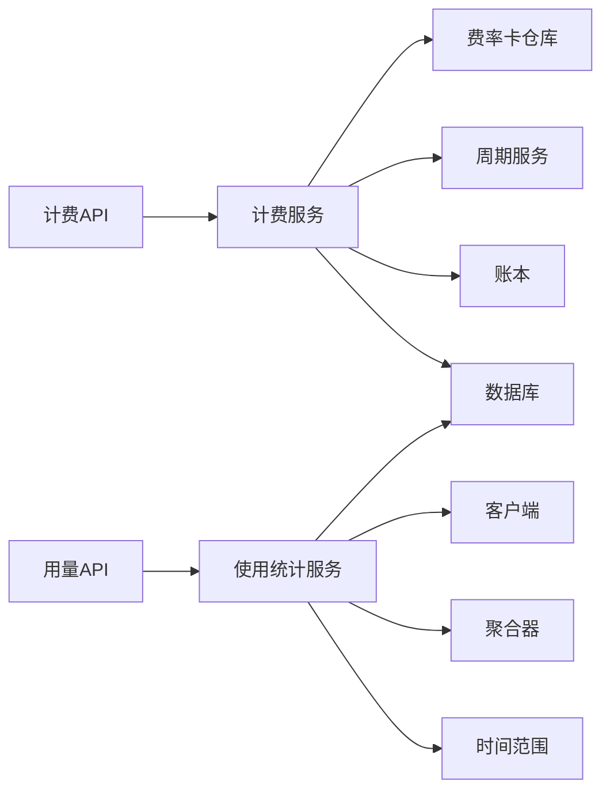

# 使用统计和计费系统

<cite>
**本文引用的文件**   
- [billing.md](file://docs/configuration/billing.md)
- [ai-usage-telemetry.md](file://docs/conventions/ai-usage-telemetry.md)
- [index.ts](file://src/features/billing/index.ts)
- [domain.ts](file://src/features/billing/domain.ts)
- [contracts.ts](file://src/features/billing/contracts.ts)
- [rate-card.ts](file://src/features/billing/rate-card.ts)
- [rate-card-repository.ts](file://src/features/billing/rate-card-repository.ts)
- [period-service.ts](file://src/features/billing/period-service.ts)
- [ledger.ts](file://src/features/billing/ledger.ts)
- [redemption.ts](file://src/features/billing/redemption.ts)
- [service.ts](file://src/features/usage/service.ts)
- [client.ts](file://src/features/usage/client.ts)
- [aggregation.ts](file://src/features/usage/aggregation.ts)
- [time-range.ts](file://src/features/usage/time-range.ts)
- [use-ai-usage-projection.ts](file://src/features/usage/use-ai-usage-projection.ts)
- [api.ts](file://src/app/api/billing/route.ts)
- [route.ts](file://src/app/api/ai-usage/route.ts)
</cite>

## 目录
1. [简介](#简介)
2. [项目结构](#项目结构)
3. [核心组件](#核心组件)
4. [架构总览](#架构总览)
5. [详细组件分析](#详细组件分析)
6. [依赖关系分析](#依赖关系分析)
7. [性能考量](#性能考量)
8. [故障排查指南](#故障排查指南)
9. [结论](#结论)
10. [附录](#附录)

## 简介
本文件面向 PurpleInk 项目的“使用统计与计费”子系统，系统性梳理其目标、边界、数据流与关键实现。该子系统围绕两大主线展开：
- 使用统计（Usage）：采集、聚合与展示 AI 及媒体资源的使用量，为运营与计费提供依据。
- 计费（Billing）：基于用量与费率卡计算费用，支持周期结算、额度与兑换码等能力。

文档以“从概念到代码”的方式组织，既帮助非技术读者理解整体设计，也为开发者提供定位与扩展的参考。

## 项目结构
与使用统计和计费相关的代码主要分布在以下位置：
- 配置与设计文档：docs/configuration/billing.md、docs/conventions/ai-usage-telemetry.md
- 计费领域模型与服务：src/features/billing/*
- 使用统计服务与客户端：src/features/usage/*
- API 路由入口：src/app/api/billing/*、src/app/api/ai-usage/*

图表来源
- [index.ts](file://src/features/billing/index.ts)
- [service.ts](file://src/features/usage/service.ts)
- [api.ts](file://src/app/api/billing/route.ts)
- [route.ts](file://src/app/api/ai-usage/route.ts)

章节来源
- [billing.md](file://docs/configuration/billing.md)
- [ai-usage-telemetry.md](file://docs/conventions/ai-usage-telemetry.md)

## 核心组件
- 计费领域（Billing Domain）
  - 领域模型与契约：定义计费实体、事件与接口契约，确保跨模块一致性。
  - 费率卡（Rate Card）：描述不同资源或模型的计价规则，支持查询与缓存。
  - 周期服务（Period Service）：管理计费周期、窗口与结算边界。
  - 账本（Ledger）：记录计费流水，保证可追溯与对账。
  - 兑换码（Redemption）：支持额度发放与核销。
- 使用统计（Usage）
  - 服务（Service）：统一接入点，负责调用采集、聚合与持久化。
  - 客户端（Client）：面向上游服务的轻量调用封装。
  - 聚合器（Aggregation）：按时间范围与维度汇总用量。
  - 时间范围（Time Range）：标准化时间窗口处理。
  - 前端投影（Use AI Usage Projection）：将服务端聚合结果映射到 UI 所需视图。

章节来源
- [index.ts](file://src/features/billing/index.ts)
- [domain.ts](file://src/features/billing/domain.ts)
- [contracts.ts](file://src/features/billing/contracts.ts)
- [rate-card.ts](file://src/features/billing/rate-card.ts)
- [rate-card-repository.ts](file://src/features/billing/rate-card-repository.ts)
- [period-service.ts](file://src/features/billing/period-service.ts)
- [ledger.ts](file://src/features/billing/ledger.ts)
- [redemption.ts](file://src/features/billing/redemption.ts)
- [service.ts](file://src/features/usage/service.ts)
- [client.ts](file://src/features/usage/client.ts)
- [aggregation.ts](file://src/features/usage/aggregation.ts)
- [time-range.ts](file://src/features/usage/time-range.ts)
- [use-ai-usage-projection.ts](file://src/features/usage/use-ai-usage-projection.ts)

## 架构总览
下图展示了从 API 请求到计费与统计处理的端到端流程，以及各模块间的职责边界。

图表来源
- [api.ts](file://src/app/api/billing/route.ts)
- [route.ts](file://src/app/api/ai-usage/route.ts)
- [service.ts](file://src/features/usage/service.ts)
- [period-service.ts](file://src/features/billing/period-service.ts)
- [rate-card-repository.ts](file://src/features/billing/rate-card-repository.ts)
- [ledger.ts](file://src/features/billing/ledger.ts)

## 详细组件分析

### 计费领域模型与契约
- 领域模型：定义计费实体（如用量项、账户、周期、账单等）及其关系，明确状态与不变式。
- 契约：对外暴露稳定的接口与数据结构，屏蔽内部实现变化，便于测试与替换。

图表来源
- [domain.ts](file://src/features/billing/domain.ts)
- [contracts.ts](file://src/features/billing/contracts.ts)

章节来源
- [domain.ts](file://src/features/billing/domain.ts)
- [contracts.ts](file://src/features/billing/contracts.ts)

### 费率卡与仓库
- 费率卡：描述不同资源/模型的单价、阶梯价、折扣与适用条件。
- 仓库：负责费率卡的读取、缓存与更新，保障高并发下的低延迟。

图表来源
- [rate-card.ts](file://src/features/billing/rate-card.ts)
- [rate-card-repository.ts](file://src/features/billing/rate-card-repository.ts)

章节来源
- [rate-card.ts](file://src/features/billing/rate-card.ts)
- [rate-card-repository.ts](file://src/features/billing/rate-card-repository.ts)

### 周期服务与账本
- 周期服务：维护计费周期（日/月/自定义），计算窗口起止时间与结算边界。
- 账本：记录每笔计费流水，支持幂等写入、回滚与审计。

图表来源
- [period-service.ts](file://src/features/billing/period-service.ts)
- [ledger.ts](file://src/features/billing/ledger.ts)

章节来源
- [period-service.ts](file://src/features/billing/period-service.ts)
- [ledger.ts](file://src/features/billing/ledger.ts)

### 兑换码（额度）
- 功能：生成、发放、核销兑换码，绑定用户或工作区，控制可用额度与有效期。
- 安全：防重放、防篡改、过期自动失效。

图表来源
- [redemption.ts](file://src/features/billing/redemption.ts)

章节来源
- [redemption.ts](file://src/features/billing/redemption.ts)

### 使用统计服务与客户端
- 服务：统一入口，协调采集、聚合、持久化与查询。
- 客户端：封装对上游系统的调用，处理重试、超时与错误映射。

图表来源
- [service.ts](file://src/features/usage/service.ts)
- [client.ts](file://src/features/usage/client.ts)

章节来源
- [service.ts](file://src/features/usage/service.ts)
- [client.ts](file://src/features/usage/client.ts)

### 聚合器与时间范围
- 聚合器：按维度（模型、资源、租户等）与时间窗口汇总用量，支持增量与全量两种模式。
- 时间范围：标准化起止时间、时区与边界处理，避免重复或遗漏。

图表来源
- [aggregation.ts](file://src/features/usage/aggregation.ts)
- [time-range.ts](file://src/features/usage/time-range.ts)

章节来源
- [aggregation.ts](file://src/features/usage/aggregation.ts)
- [time-range.ts](file://src/features/usage/time-range.ts)

### 前端投影（UI 适配）
- 作用：将后端聚合结果转换为 UI 所需的视图模型，包含趋势、占比与阈值提示。
- 特点：解耦 UI 与数据格式变更，提升可维护性。

章节来源
- [use-ai-usage-projection.ts](file://src/features/usage/use-ai-usage-projection.ts)

### API 路由（计费与用量）
- 计费路由：接收计费相关请求，校验参数、鉴权后委托计费服务处理。
- 用量路由：接收用量上报与查询，委托使用统计服务处理。

图表来源
- [api.ts](file://src/app/api/billing/route.ts)
- [route.ts](file://src/app/api/ai-usage/route.ts)

章节来源
- [api.ts](file://src/app/api/billing/route.ts)
- [route.ts](file://src/app/api/ai-usage/route.ts)

## 依赖关系分析
- 计费模块依赖：
  - 领域模型与契约：确保跨模块一致性与稳定性。
  - 费率卡仓库：高频读路径需缓存与降级。
  - 周期服务与账本：强一致写入与审计。
- 使用统计模块依赖：
  - 客户端：稳定对接上游系统，具备重试与熔断。
  - 聚合器与时间范围：准确的时间窗口与聚合逻辑。
  - 数据库：原始事件与聚合结果分离存储，读写分离优化。

图表来源
- [api.ts](file://src/app/api/billing/route.ts)
- [route.ts](file://src/app/api/ai-usage/route.ts)
- [rate-card-repository.ts](file://src/features/billing/rate-card-repository.ts)
- [period-service.ts](file://src/features/billing/period-service.ts)
- [ledger.ts](file://src/features/billing/ledger.ts)
- [service.ts](file://src/features/usage/service.ts)
- [client.ts](file://src/features/usage/client.ts)
- [aggregation.ts](file://src/features/usage/aggregation.ts)
- [time-range.ts](file://src/features/usage/time-range.ts)

章节来源
- [index.ts](file://src/features/billing/index.ts)
- [service.ts](file://src/features/usage/service.ts)

## 性能考量
- 缓存策略：费率卡与常用查询结果应引入多级缓存（内存+分布式），降低热点访问延迟。
- 批量写入：用量事件采用批处理与异步落库，减少 IO 抖动。
- 聚合窗口：合理划分时间窗口，避免超大窗口导致的内存与计算压力。
- 幂等与去重：通过唯一键与幂等写入防止重复计费与重复聚合。
- 限流与背压：在高峰期对用量上报进行限流与排队，保护下游系统。

[本节为通用指导，不直接分析具体文件]

## 故障排查指南
- 常见问题定位
  - 用量未计入：检查客户端上报链路、时间范围标准化与聚合任务是否执行。
  - 计费异常：核对费率卡版本、周期窗口与账本流水一致性。
  - 兑换码失效：验证有效期、绑定主体与核销幂等键。
- 建议排查步骤
  - 查看 API 日志与错误码，确认鉴权与参数校验。
  - 核对数据库中的原始事件与聚合结果是否匹配。
  - 检查缓存命中率与降级策略是否生效。
  - 复现问题并回放事件，定位时序与边界条件。

章节来源
- [service.ts](file://src/features/usage/service.ts)
- [ledger.ts](file://src/features/billing/ledger.ts)
- [redemption.ts](file://src/features/billing/redemption.ts)

## 结论
PurpleInk 的使用统计与计费子系统以清晰的领域模型与契约为基础，结合稳健的聚合与账本机制，实现了从数据采集到计费结算的闭环。通过模块化设计与缓存、幂等、限流等工程实践，系统在可扩展性与可靠性方面具备良好的基础。后续可进一步关注：
- 更细粒度的配额与动态定价能力
- 多租户隔离与成本分摊
- 实时计费与预警通知

[本节为总结性内容，不直接分析具体文件]

## 附录
- 配置与约定
  - 计费配置：参考 billing.md 了解环境变量与开关。
  - 使用统计约定：参考 ai-usage-telemetry.md 了解上报字段与频率。

章节来源
- [billing.md](file://docs/configuration/billing.md)
- [ai-usage-telemetry.md](file://docs/conventions/ai-usage-telemetry.md)