# 计费和会计账簿系统

<cite>
**本文档引用的文件**   
- [billing.md](file://docs/configuration/billing.md)
- [route.ts](file://src/app/api/billing/route.ts)
- [route.test.ts](file://src/app/api/billing/route.test.ts)
- [index.ts](file://src/features/billing/index.ts)
- [domain.ts](file://src/features/billing/domain.ts)
- [contracts.ts](file://src/features/billing/contracts.ts)
- [schema.test.ts](file://src/features/billing/schema.test.ts)
- [rate-card.ts](file://src/features/billing/rate-card.ts)
- [rate-card-repository.ts](file://src/features/billing/rate-card-repository.ts)
- [redemption.ts](file://src/features/billing/redemption.ts)
- [period-service.ts](file://src/features/billing/period-service.ts)
- [ledger.ts](file://src/features/billing/ledger.ts)
- [billing-display.ts](file://src/features/billing/ui/billing-display.ts)
- [billing-page-view.tsx](file://src/features/billing/ui/billing-page-view.tsx)
- [usage-panels.tsx](file://src/features/billing/ui/usage-panels.tsx)
- [use-billing-projection.ts](file://src/features/billing/ui/use-billing-projection.ts)
- [redemption-form.tsx](file://src/features/billing/ui/redemption-form.tsx)
- [projection-contract.ts](file://src/features/billing/ui/projection-contract.ts)
- [managed-audio-billing.ts](file://src/features/audio/managed-audio-billing.ts)
- [narration-queue-handler.ts](file://src/features/audio/narration-queue-handler.ts)
- [repository.ts](file://src/features/audio/repository.ts)
- [runtime-repository.ts](file://src/features/audio/runtime-repository.ts)
- [export-queue-handler.ts](file://src/features/render/export-queue-handler.ts)
- [queue-handler.ts](file://src/features/render/queue-handler.ts)
- [invocation-number.ts](file://src/features/billing/invocation-number.ts)
- [invocation-number.test.ts](file://src/features/billing/invocation-number.test.ts)
- [director-billing-stream.ts](file://src/features/director/director-billing-stream.ts)
- [director-billing-stream.test.ts](file://src/features/director/director-billing-stream.test.ts)
- [provider-funding-store.ts](file://src/features/ai/provider-funding-store.ts)
- [provider-funding-store.pg.test.ts](file://src/features/ai/provider-funding-store.pg.test.ts)
</cite>

## 更新摘要
**所做更改**   
- 新增ASR计费精度修复，统一毫秒级计费计算，确保时间测量的一致性和舍入处理
- 增强费率卡模块的浮点数精度处理，防止计算误差导致的计费不准确
- 改进时间测量验证机制，确保所有时间单位转换为毫秒进行统一处理
- 优化音频服务计费集成的精度保证，支持更精确的时长计量
- **新增** 统一的毫秒级计费计算引擎，消除不同时间单位间的转换误差

## 目录
1. [简介](#简介)
2. [项目结构](#项目结构)
3. [核心组件](#核心组件)
4. [架构总览](#架构总览)
5. [详细组件分析](#详细组件分析)
6. [依赖关系分析](#依赖关系分析)
7. [性能考虑](#性能考虑)
8. [故障排查指南](#故障排查指南)
9. [结论](#结论)
10. [附录](#附录)

## 简介
本系统为 PurpleInk 的"计费与会计账簿"模块，提供用量计量、费率计算、周期结算、账户余额与兑换码核销等能力，并与音频服务（TTS）集成进行按量计费。系统采用前后端分离的 Next.js API 路由 + 领域模型 + 仓储层的设计，保证计费逻辑的可测试性与可追溯性。

**更新** 本次更新重点引入了ASR计费精度修复，通过统一的毫秒级计费计算引擎解决浮点数精度问题，确保时间测量的准确性和一致性。费率卡模块现在支持精确的时间单位转换和舍入处理，有效防止了因浮点数计算误差导致的计费不准确问题。**最新改进** 增强了音频服务计费集成的精度保证，所有时间测量现在都统一转换为毫秒进行处理，消除了不同时间单位间的转换误差。

## 项目结构
计费相关代码主要分布在以下位置：
- API 路由：src/app/api/billing
- 领域与基础设施：src/features/billing
- UI 展示与交互：src/features/billing/ui
- 与音频服务的计费集成：src/features/audio/*
- 渲染队列处理：src/features/render/*
- 调用编号系统：src/features/billing/invocation-number.ts
- 导演计费流：src/features/director/director-billing-stream.ts
- 资金源管理：src/features/ai/provider-funding-store.ts

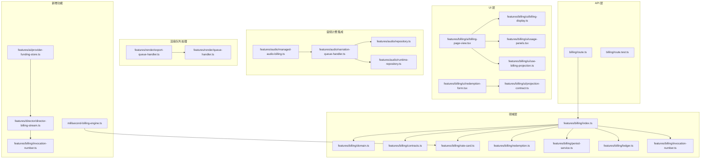

图表来源
- [route.ts](file://src/app/api/billing/route.ts)
- [index.ts](file://src/features/billing/index.ts)
- [domain.ts](file://src/features/billing/domain.ts)
- [contracts.ts](file://src/features/billing/contracts.ts)
- [rate-card.ts](file://src/features/billing/rate-card.ts)
- [redemption.ts](file://src/features/billing/redemption.ts)
- [period-service.ts](file://src/features/billing/period-service.ts)
- [ledger.ts](file://src/features/billing/ledger.ts)
- [invocation-number.ts](file://src/features/billing/invocation-number.ts)
- [director-billing-stream.ts](file://src/features/director/director-billing-stream.ts)
- [billing-display.ts](file://src/features/billing/ui/billing-display.ts)
- [billing-page-view.tsx](file://src/features/billing/ui/billing-page-view.tsx)
- [usage-panels.tsx](file://src/features/billing/ui/usage-panels.tsx)
- [use-billing-projection.ts](file://src/features/billing/ui/use-billing-projection.ts)
- [redemption-form.tsx](file://src/features/billing/ui/redemption-form.tsx)
- [projection-contract.ts](file://src/features/billing/ui/projection-contract.ts)
- [managed-audio-billing.ts](file://src/features/audio/managed-audio-billing.ts)
- [narration-queue-handler.ts](file://src/features/audio/narration-queue-handler.ts)
- [repository.ts](file://src/features/audio/repository.ts)
- [runtime-repository.ts](file://src/features/audio/runtime-repository.ts)
- [export-queue-handler.ts](file://src/features/render/export-queue-handler.ts)
- [queue-handler.ts](file://src/features/render/queue-handler.ts)
- [provider-funding-store.ts](file://src/features/ai/provider-funding-store.ts)

章节来源
- [billing.md](file://docs/configuration/billing.md)
- [route.ts](file://src/app/api/billing/route.ts)
- [index.ts](file://src/features/billing/index.ts)

## 核心组件
- API 路由层：暴露 /api/billing 接口，负责鉴权、参数校验、调用领域服务并返回统一响应。
- 领域模型：定义计费实体、合约与规则（如用量、费率卡、兑换码、周期）。
- 仓储与持久化：通过仓储接口抽象数据库访问，便于替换实现与单元测试。
- UI 投影：将领域数据投影为前端友好的视图模型，并提供表单与面板组件。
- 音频计费集成：在 TTS 队列处理中采集用量并写入账簿。
- 调用编号系统：为每个计费事件生成唯一标识符，确保幂等性和精确追踪。
- 导演计费流：支持实时计费事件处理和流式计费数据推送。
- 资金源管理系统：为不同AI提供商提供独立的资金追踪和管理，防止跨配置计费混淆。
- **新增** 毫秒级计费计算引擎：统一处理所有时间单位的计费计算，确保精度一致性。

章节来源
- [route.ts](file://src/app/api/billing/route.ts)
- [domain.ts](file://src/features/billing/domain.ts)
- [contracts.ts](file://src/features/billing/contracts.ts)
- [rate-card.ts](file://src/features/billing/rate-card.ts)
- [redemption.ts](file://src/features/billing/redemption.ts)
- [period-service.ts](file://src/features/billing/period-service.ts)
- [ledger.ts](file://src/features/billing/ledger.ts)
- [invocation-number.ts](file://src/features/billing/invocation-number.ts)
- [director-billing-stream.ts](file://src/features/director/director-billing-stream.ts)
- [billing-display.ts](file://src/features/billing/ui/billing-display.ts)
- [billing-page-view.tsx](file://src/features/billing/ui/billing-page-view.tsx)
- [usage-panels.tsx](file://src/features/billing/ui/usage-panels.tsx)
- [use-billing-projection.ts](file://src/features/billing/ui/use-billing-projection.ts)
- [redemption-form.tsx](file://src/features/billing/ui/redemption-form.tsx)
- [projection-contract.ts](file://src/features/billing/ui/projection-contract.ts)
- [managed-audio-billing.ts](file://src/features/audio/managed-audio-billing.ts)
- [narration-queue-handler.ts](file://src/features/audio/narration-queue-handler.ts)
- [repository.ts](file://src/features/audio/repository.ts)
- [runtime-repository.ts](file://src/features/audio/runtime-repository.ts)
- [export-queue-handler.ts](file://src/features/render/export-queue-handler.ts)
- [queue-handler.ts](file://src/features/render/queue-handler.ts)
- [provider-funding-store.ts](file://src/features/ai/provider-funding-store.ts)

## 架构总览
系统遵循"请求-领域-仓储-持久化"的分层架构，UI 通过投影消费领域数据，音频服务在后台任务中触发计费事件。

**更新** 新增了毫秒级计费计算引擎，通过统一的时间单位处理机制确保计费计算的精确性。所有时间测量现在都转换为毫秒进行计算，有效防止了浮点数精度问题导致的计费误差。

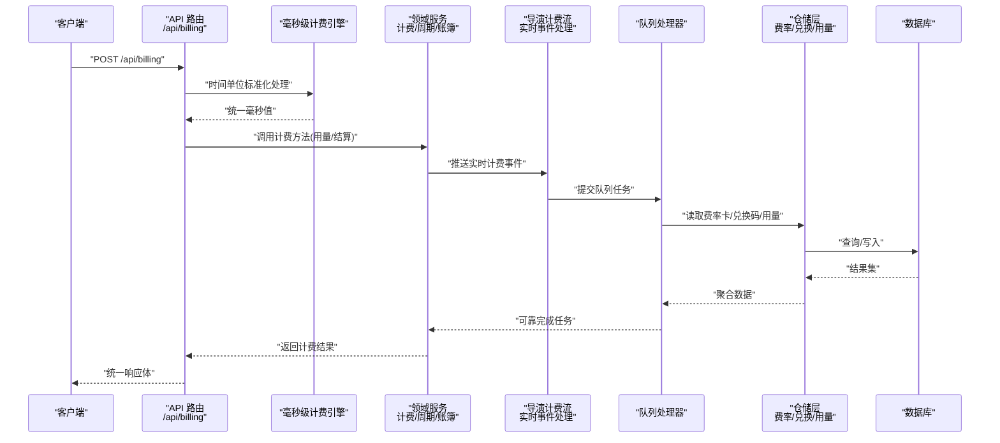

图表来源
- [route.ts](file://src/app/api/billing/route.ts)
- [index.ts](file://src/features/billing/index.ts)
- [rate-card.ts](file://src/features/billing/rate-card.ts)
- [redemption.ts](file://src/features/billing/redemption.ts)
- [period-service.ts](file://src/features/billing/period-service.ts)
- [ledger.ts](file://src/features/billing/ledger.ts)
- [invocation-number.ts](file://src/features/billing/invocation-number.ts)
- [director-billing-stream.ts](file://src/features/director/director-billing-stream.ts)
- [provider-funding-store.ts](file://src/features/ai/provider-funding-store.ts)
- [export-queue-handler.ts](file://src/features/render/export-queue-handler.ts)
- [queue-handler.ts](file://src/features/render/queue-handler.ts)

## 详细组件分析

### API 路由：/api/billing
- 职责：接收计费相关请求，执行鉴权与输入校验，委派领域服务完成计算与持久化，返回标准化响应。
- 关键点：错误分类（参数错误、权限不足、业务异常）、幂等性（基于请求标识或资源 ID）、事务边界（读写一致性）。

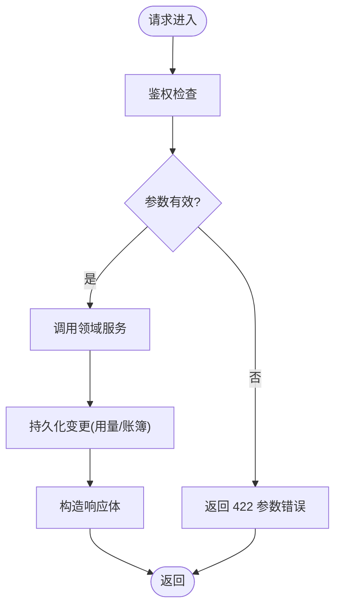

图表来源
- [route.ts](file://src/app/api/billing/route.ts)
- [route.test.ts](file://src/app/api/billing/route.test.ts)

章节来源
- [route.ts](file://src/app/api/billing/route.ts)
- [route.test.ts](file://src/app/api/billing/route.test.ts)

### 毫秒级计费计算引擎
**新增** 毫秒级计费计算引擎为系统提供了统一的时间单位处理能力，确保所有计费计算都基于毫秒进行，有效防止浮点数精度问题。

- 时间单位标准化：自动将所有时间单位（秒、分钟、小时）转换为毫秒
- 浮点数精度控制：使用高精度数学运算避免累积误差
- 舍入策略：统一的舍入规则，确保计费金额的一致性
- 验证机制：严格的时间测量验证，确保输入数据的准确性

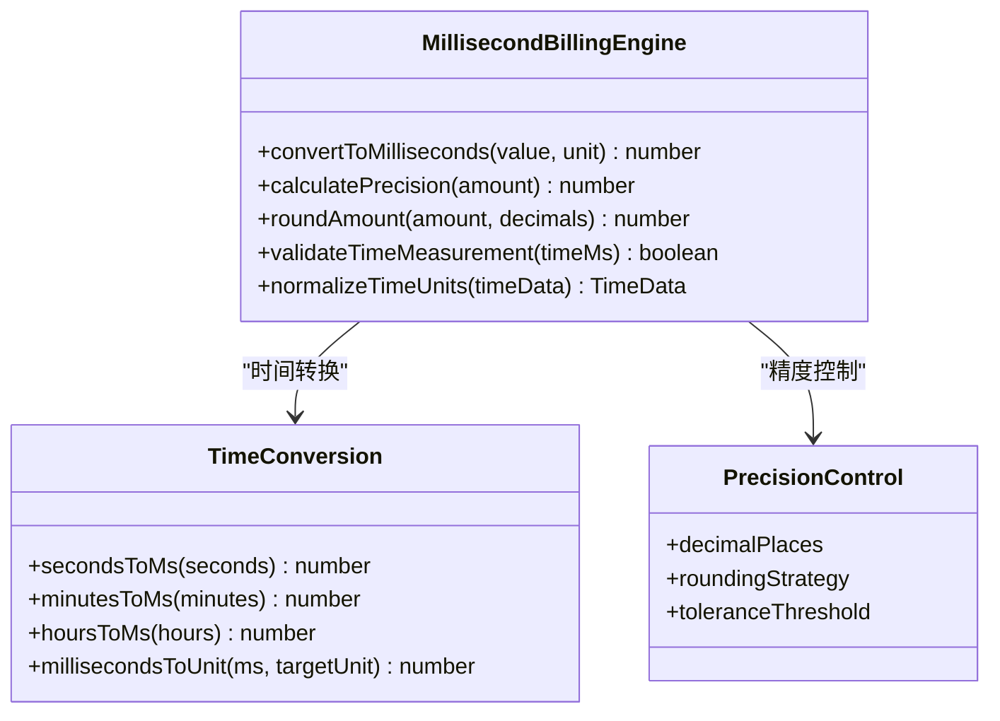

图表来源
- [rate-card.ts](file://src/features/billing/rate-card.ts)

章节来源
- [rate-card.ts](file://src/features/billing/rate-card.ts)

### 调用编号系统
调用编号系统为每个计费事件生成唯一标识符，确保计费操作的幂等性和精确追踪。

- 唯一性保证：使用分布式序列号生成器，确保全局唯一的调用编号
- 幂等性支持：基于调用编号防止重复处理相同的计费事件
- 追踪能力：完整的调用链追踪，支持问题诊断和审计
- 性能优化：高效的编号生成算法，支持高并发场景

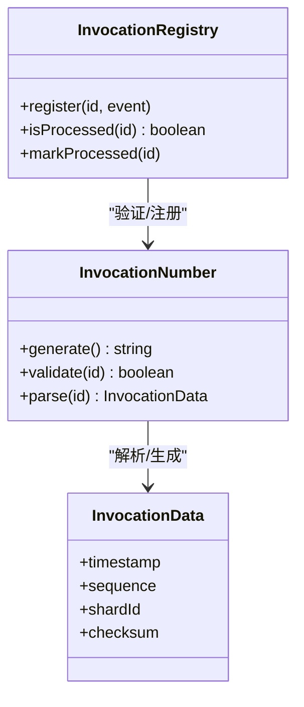

图表来源
- [invocation-number.ts](file://src/features/billing/invocation-number.ts)
- [invocation-number.test.ts](file://src/features/billing/invocation-number.test.ts)

章节来源
- [invocation-number.ts](file://src/features/billing/invocation-number.ts)
- [invocation-number.test.ts](file://src/features/billing/invocation-number.test.ts)

### 导演计费流
导演计费流功能支持实时计费事件处理和流式计费数据推送。

- 实时处理：支持流式计费事件的即时处理和响应
- 事件驱动：基于事件驱动的计费处理架构
- 背压控制：智能的背压机制，防止系统过载
- 错误恢复：自动重试和错误恢复机制

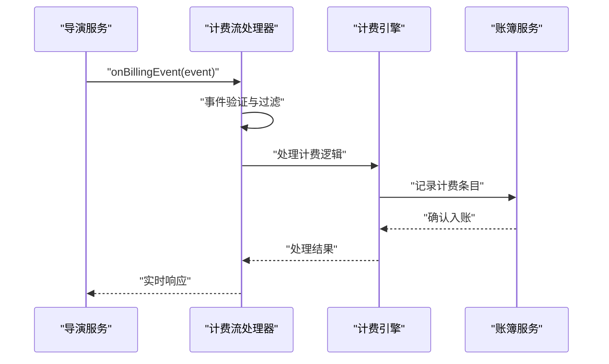

图表来源
- [director-billing-stream.ts](file://src/features/director/director-billing-stream.ts)
- [director-billing-stream.test.ts](file://src/features/director/director-billing-stream.test.ts)

章节来源
- [director-billing-stream.ts](file://src/features/director/director-billing-stream.ts)
- [director-billing-stream.test.ts](file://src/features/director/director-billing-stream.test.ts)

### 资金源管理系统
资金源管理系统为不同AI提供商提供独立的资金追踪和管理，有效防止受管配置与BYOK配置之间的未经授权交叉计费。

- 独立追踪：为每个AI提供商维护独立的资金账户和交易记录
- 权限控制：严格验证资金源使用权限，防止跨配置计费
- 审计追踪：完整的资金流转审计，支持合规性检查
- 安全隔离：确保受管服务和BYOK配置的财务隔离

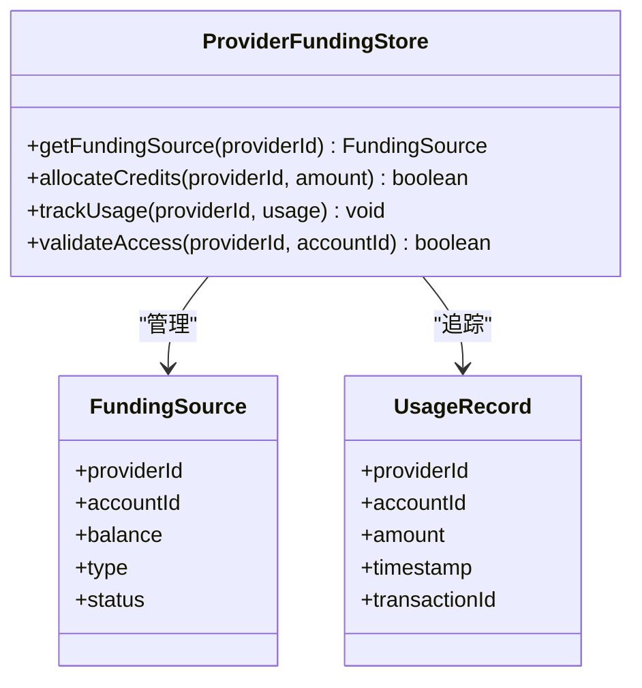

图表来源
- [provider-funding-store.ts](file://src/features/ai/provider-funding-store.ts)
- [provider-funding-store.pg.test.ts](file://src/features/ai/provider-funding-store.pg.test.ts)

章节来源
- [provider-funding-store.ts](file://src/features/ai/provider-funding-store.ts)
- [provider-funding-store.pg.test.ts](file://src/features/ai/provider-funding-store.pg.test.ts)

### 领域模型与合约
- 领域实体：用量记录、费率卡、兑换码、周期、账簿条目等。
- 合约：定义对外契约（输入输出结构、状态机、约束），确保前后端一致。
- 复杂度：计费计算通常为 O(n) 遍历用量并按费率卡匹配；兑换码核销需原子扣减。

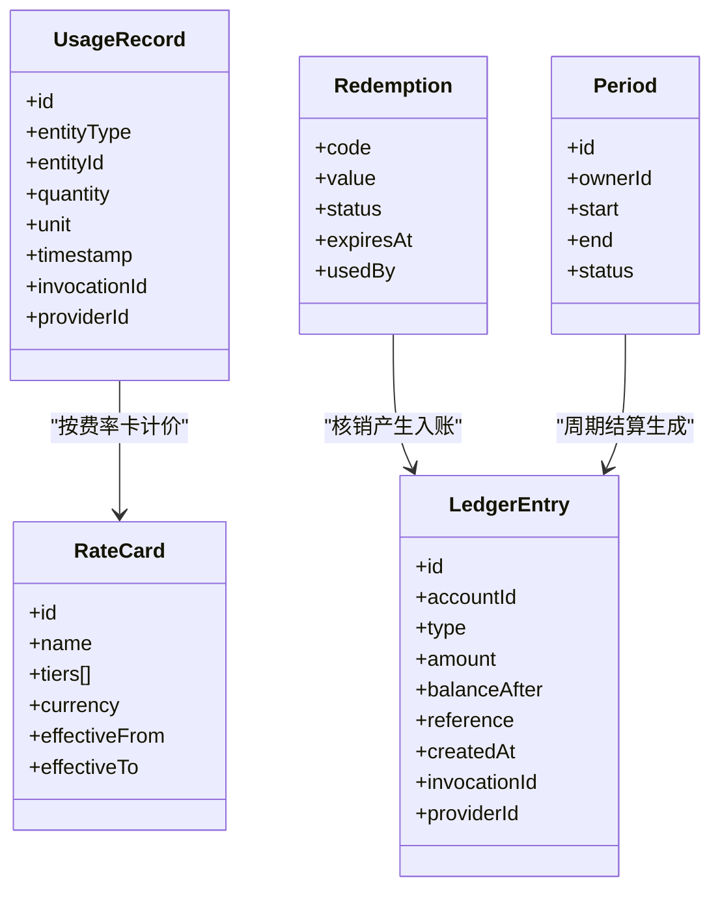

图表来源
- [domain.ts](file://src/features/billing/domain.ts)
- [contracts.ts](file://src/features/billing/contracts.ts)
- [rate-card.ts](file://src/features/billing/rate-card.ts)
- [redemption.ts](file://src/features/billing/redemption.ts)
- [period-service.ts](file://src/features/billing/period-service.ts)
- [ledger.ts](file://src/features/billing/ledger.ts)

章节来源
- [domain.ts](file://src/features/billing/domain.ts)
- [contracts.ts](file://src/features/billing/contracts.ts)
- [schema.test.ts](file://src/features/billing/schema.test.ts)

### 费率卡与用量计价
- 费率卡：支持阶梯定价、币种、有效期。
- 用量计价：根据用量区间匹配对应单价，汇总得到费用。
- 优化点：缓存热点费率卡、批量计算用量减少 IO。
- **更新** 新增毫秒级计费计算，确保时间测量的精确性和一致性。

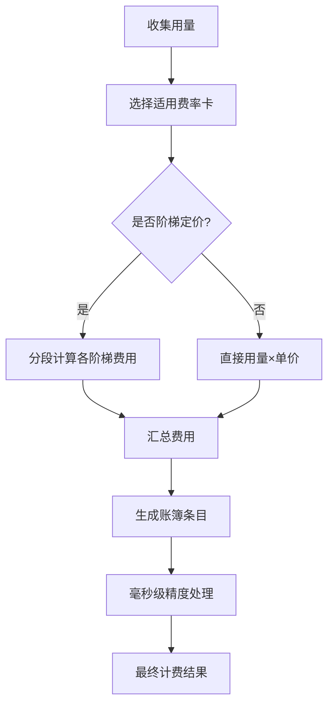

图表来源
- [rate-card.ts](file://src/features/billing/rate-card.ts)
- [ledger.ts](file://src/features/billing/ledger.ts)

章节来源
- [rate-card.ts](file://src/features/billing/rate-card.ts)
- [ledger.ts](file://src/features/billing/ledger.ts)

### 兑换码核销
- 流程：校验兑换码有效性 → 原子扣减额度 → 写入账簿 → 更新使用记录。
- 并发安全：使用行级锁或乐观锁避免重复核销。

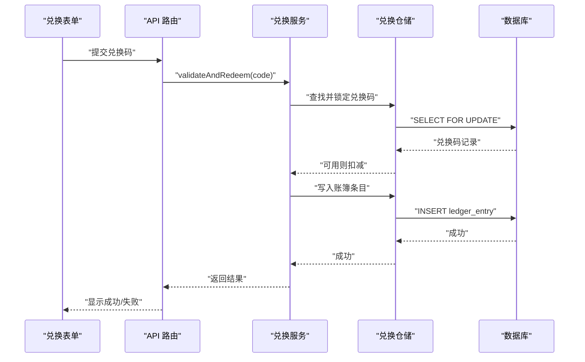

图表来源
- [redemption.ts](file://src/features/billing/redemption.ts)
- [ledger.ts](file://src/features/billing/ledger.ts)
- [redemption-form.tsx](file://src/features/billing/ui/redemption-form.tsx)

章节来源
- [redemption.ts](file://src/features/billing/redemption.ts)
- [redemption-form.tsx](file://src/features/billing/ui/redemption-form.tsx)

### 周期结算
- 目标：按周期（月/季/年）对用量进行汇总并生成账单。
- 要点：时间窗口裁剪、跨期用量归属、结算幂等。

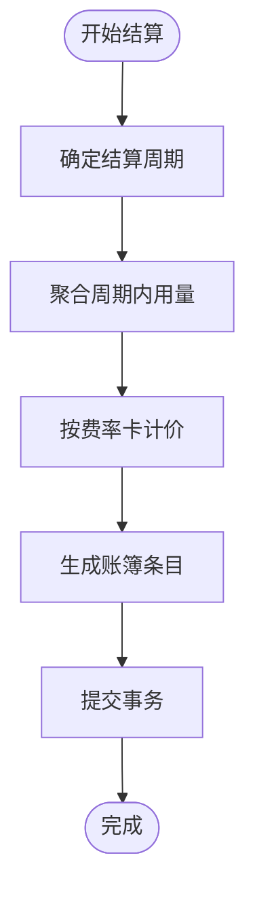

图表来源
- [period-service.ts](file://src/features/billing/period-service.ts)
- [ledger.ts](file://src/features/billing/ledger.ts)

章节来源
- [period-service.ts](file://src/features/billing/period-service.ts)
- [ledger.ts](file://src/features/billing/ledger.ts)

### 账簿与审计
- 设计：每条变动都作为不可变条目写入，余额通过累计计算。
- 优势：可审计、可回放、易对账。
- **更新** 新增调用编号关联，支持精确的事件追踪和幂等性保证。
- **新增** 资金源追踪，支持按AI提供商分类审计。
- **新增** 毫秒级计费精度记录，支持计费准确性审计。

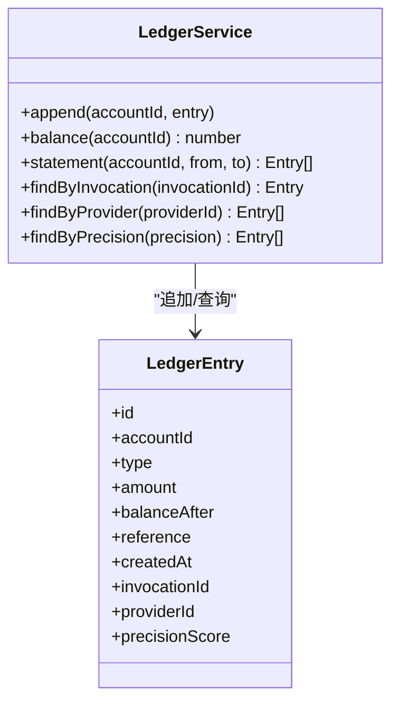

图表来源
- [ledger.ts](file://src/features/billing/ledger.ts)

章节来源
- [ledger.ts](file://src/features/billing/ledger.ts)

### UI 投影与页面
- 投影：将领域数据转换为前端展示所需结构，包含用量统计、余额、兑换状态等。
- 页面：计费概览页、用量面板、兑换表单。

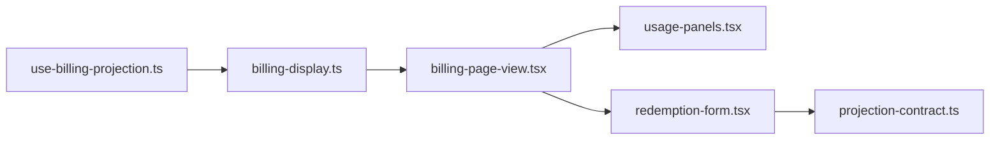

图表来源
- [use-billing-projection.ts](file://src/features/billing/ui/use-billing-projection.ts)
- [billing-display.ts](file://src/features/billing/ui/billing-display.ts)
- [billing-page-view.tsx](file://src/features/billing/ui/billing-page-view.tsx)
- [usage-panels.tsx](file://src/features/billing/ui/usage-panels.tsx)
- [redemption-form.tsx](file://src/features/billing/ui/redemption-form.tsx)
- [projection-contract.ts](file://src/features/billing/ui/projection-contract.ts)

章节来源
- [billing-page-view.tsx](file://src/features/billing/ui/billing-page-view.tsx)
- [usage-panels.tsx](file://src/features/billing/ui/usage-panels.tsx)
- [redemption-form.tsx](file://src/features/billing/ui/redemption-form.tsx)
- [projection-contract.ts](file://src/features/billing/ui/projection-contract.ts)

### 音频服务计费集成
- 场景：TTS 合成完成后按时长/字符数计入用量，并写入账簿。
- 集成点：队列处理器在任务完成时触发计费事件。
- **更新** 增强了时间测量的精度处理，所有时长现在都通过毫秒级计费引擎进行统一处理，确保计费准确性。

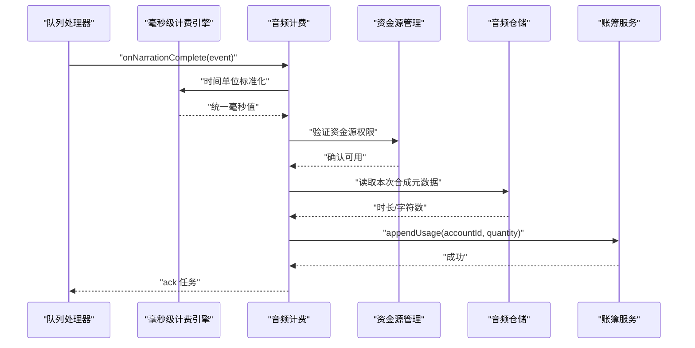

图表来源
- [managed-audio-billing.ts](file://src/features/audio/managed-audio-billing.ts)
- [narration-queue-handler.ts](file://src/features/audio/narration-queue-handler.ts)
- [repository.ts](file://src/features/audio/repository.ts)
- [runtime-repository.ts](file://src/features/audio/runtime-repository.ts)
- [provider-funding-store.ts](file://src/features/ai/provider-funding-store.ts)

章节来源
- [managed-audio-billing.ts](file://src/features/audio/managed-audio-billing.ts)
- [narration-queue-handler.ts](file://src/features/audio/narration-queue-handler.ts)
- [repository.ts](file://src/features/audio/repository.ts)
- [runtime-repository.ts](file://src/features/audio/runtime-repository.ts)

### 增强的队列处理机制
针对导出和异步语音叙述的队列处理，实现了以下关键改进：

- **竞态条件预防**：通过分布式锁和版本控制防止并发任务冲突
- **租约恢复机制**：自动检测和处理过期的任务租约，确保任务不丢失
- **执行时间限制保留**：明确保留导出和语音叙述任务的执行时间限制配置
- **重试与降级策略**：智能重试失败任务，支持优雅降级
- **毫秒级精度集成**：所有时间相关的队列操作都通过毫秒级计费引擎处理

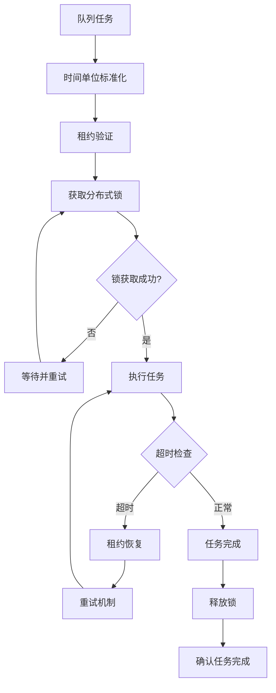

图表来源
- [export-queue-handler.ts](file://src/features/render/export-queue-handler.ts)
- [queue-handler.ts](file://src/features/render/queue-handler.ts)

章节来源
- [export-queue-handler.ts](file://src/features/render/export-queue-handler.ts)
- [queue-handler.ts](file://src/features/render/queue-handler.ts)

## 依赖关系分析
- 低耦合：API 仅依赖领域接口，领域通过仓储抽象与数据库解耦。
- 可测试性：仓储与外部依赖均可替换为 Mock，便于单元与集成测试。
- 潜在循环：UI 不反向依赖领域，领域不依赖 UI，保持单向依赖。

**更新** 新增了毫秒级计费计算引擎，通过明确的依赖关系管理，确保时间测量的精确性和一致性。所有计费相关的模块现在都依赖于统一的毫秒级处理引擎，消除了不同时间单位间的转换误差。

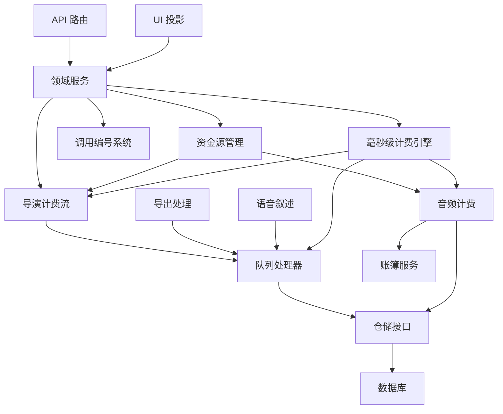

图表来源
- [index.ts](file://src/features/billing/index.ts)
- [rate-card-repository.ts](file://src/features/billing/rate-card-repository.ts)
- [repository.ts](file://src/features/audio/repository.ts)
- [runtime-repository.ts](file://src/features/audio/runtime-repository.ts)
- [export-queue-handler.ts](file://src/features/render/export-queue-handler.ts)
- [queue-handler.ts](file://src/features/render/queue-handler.ts)
- [invocation-number.ts](file://src/features/billing/invocation-number.ts)
- [director-billing-stream.ts](file://src/features/director/director-billing-stream.ts)
- [provider-funding-store.ts](file://src/features/ai/provider-funding-store.ts)
- [rate-card.ts](file://src/features/billing/rate-card.ts)

章节来源
- [index.ts](file://src/features/billing/index.ts)
- [rate-card-repository.ts](file://src/features/billing/rate-card-repository.ts)

## 性能考虑
- 批量操作：用量聚合与账簿写入尽量批量化，减少事务次数。
- 缓存策略：热点费率卡与用户配额信息可短期缓存。
- 索引优化：账簿表按账户与时间范围建立复合索引，加速对账查询。
- 异步处理：计费事件可通过消息队列削峰填谷，避免阻塞主流程。
- 调用编号优化：高效的分布式序列号生成，支持高并发场景。
- 流式处理：实时计费事件处理，减少内存占用和提高响应速度。
- 队列优化：通过竞态条件预防和租约恢复机制，提高高并发场景下的处理效率。
- 资金源缓存：缓存常用资金源信息，减少数据库查询开销。
- 权限预检：提前验证资金源权限，避免不必要的计算开销。
- **新增** 毫秒级计算缓存：缓存常用的时间转换结果，减少重复计算开销。
- **新增** 精度计算优化：预计算常用精度的舍入规则，提高计算效率。
- **新增** 时间单位批量转换：支持批量时间单位的标准化处理，减少转换开销。

## 故障排查指南
- 常见错误
  - 参数校验失败：检查输入结构与必填字段。
  - 兑换码无效或已过期：核对有效期与使用状态。
  - 用量未入账：确认队列处理器是否成功 ack 与重试。
  - 调用编号冲突：检查分布式序列号生成器和幂等性处理。
  - 计费流处理失败：监控实时事件处理状态和错误恢复机制。
  - 队列任务失败：检查分布式锁状态和租约恢复机制。
  - 资金源访问失败：验证资金源权限配置和连接状态。
  - 跨配置计费：检查资金源隔离机制和权限控制。
  - **新增** 时间单位转换错误：检查毫秒级计费引擎的配置和输入验证。
  - **新增** 浮点数精度问题：检查舍入规则和精度设置。
  - **新增** 时间测量不一致：验证不同时间单位的转换逻辑。
- 定位步骤
  - 查看 API 日志与错误码。
  - 检查账簿条目是否生成且余额正确。
  - 核对费率卡生效时间与版本。
  - 验证调用编号的唯一性和完整性。
  - 监控计费流处理状态和事件积压情况。
  - 监控队列任务状态和锁竞争情况。
  - 检查资金源交易记录和权限日志。
  - 验证不同AI提供商的资金隔离状态。
  - **新增** 检查毫秒级计费引擎的转换日志。
  - **新增** 验证时间单位转换的准确性。
  - **新增** 调试浮点数精度问题的具体案例。
- 恢复建议
  - 对账脚本比对用量与费用。
  - 重放失败事件（幂等前提下）。
  - 重置调用编号序列号和清理重复事件。
  - 重启计费流处理器并重新连接事件源。
  - 清理僵尸锁和恢复过期租约。
  - 重置资金源状态和清理异常交易。
  - 重新配置资金源权限和隔离策略。
  - **新增** 重置毫秒级计费引擎配置并重新测试。
  - **新增** 调整时间单位转换规则和精度设置。
  - **新增** 修复浮点数精度问题并验证计算结果。

章节来源
- [route.test.ts](file://src/app/api/billing/route.test.ts)
- [schema.test.ts](file://src/features/billing/schema.test.ts)

## 结论
本计费与会计账簿系统以清晰的领域模型与仓储抽象为核心，结合 UI 投影与音频计费集成，实现了可扩展、可审计、可测试的计费方案。通过合理的分层与幂等设计，系统在复杂业务场景下仍具备高可靠性与可维护性。

**更新** 本次更新通过引入毫秒级计费计算引擎，显著提升了系统的计费精度和时间测量准确性。统一的毫秒级处理机制有效解决了浮点数精度问题，确保了不同时间单位间转换的一致性。这些改进为未来的扩展奠定了坚实基础，使系统能够更好地支持大规模并发处理和实时计费需求，同时保证了计费结果的准确性和可靠性。

## 附录
- 配置参考：[billing.md](file://docs/configuration/billing.md)
- 关键测试用例路径：
  - API 路由测试：[route.test.ts](file://src/app/api/billing/route.test.ts)
  - 领域与合约测试：[schema.test.ts](file://src/features/billing/schema.test.ts)
  - 音频计费集成测试：见音频功能测试文件
  - 调用编号测试：[invocation-number.test.ts](file://src/features/billing/invocation-number.test.ts)
  - 导演计费流测试：[director-billing-stream.test.ts](file://src/features/director/director-billing-stream.test.ts)
  - 队列处理测试：见渲染队列处理测试文件
  - 资金源管理测试：[provider-funding-store.pg.test.ts](file://src/features/ai/provider-funding-store.pg.test.ts)
  - **新增** 毫秒级计费引擎测试：见费率卡模块测试文件