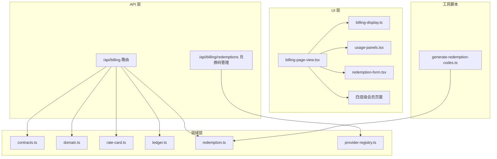
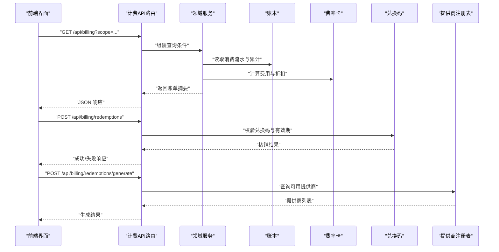
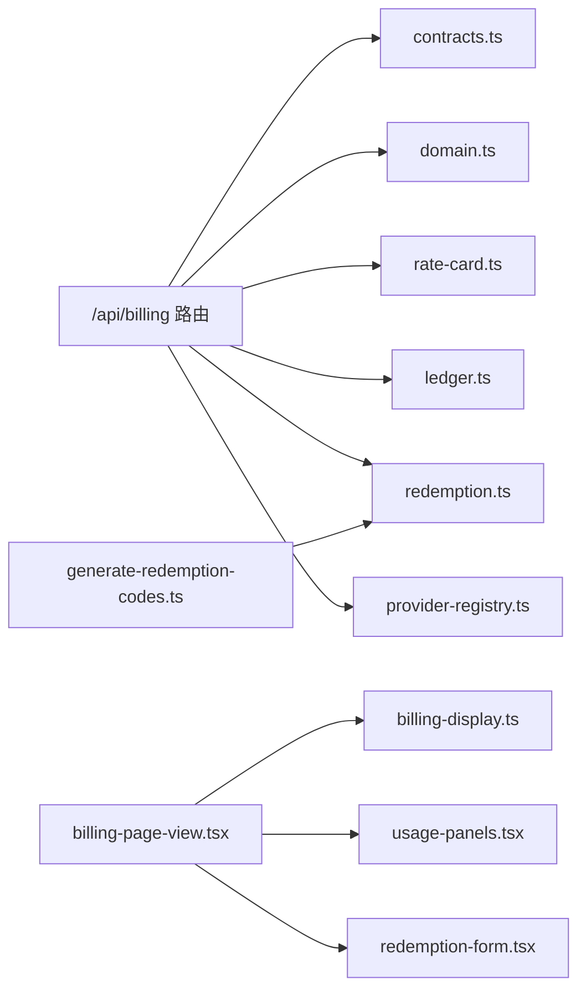

# 计费配置

<cite>
**本文引用的文件**   
- [billing.md](file://docs/configuration/billing.md)
- [route.ts](file://src/app/api/billing/route.ts)
- [contracts.ts](file://src/features/billing/contracts.ts)
- [domain.ts](file://src/features/billing/domain.ts)
- [rate-card.ts](file://src/features/billing/rate-card.ts)
- [ledger.ts](file://src/features/billing/ledger.ts)
- [redemption.ts](file://src/features/billing/redemption.ts)
- [schema.test.ts](file://src/features/billing/schema.test.ts)
- [billing-display.ts](file://src/features/billing/ui/billing-display.ts)
- [usage-panels.tsx](file://src/features/billing/ui/usage-panels.tsx)
- [redemption-form.tsx](file://src/features/billing/ui/redemption-form.tsx)
- [billing-page-view.tsx](file://src/features/billing/ui/billing-page-view.tsx)
</cite>

## 更新摘要
**变更内容**   
- 新增一次性兑换码生成功能，支持批量生成和管理兑换码
- 扩展API端点以支持新的计费操作和兑换码管理
- 实现四层会员页面体系（免费、基础、专业、企业）
- 引入服务器端管理的提供商注册表机制
- 增强兑换码系统的完整性和安全性

## 目录
1. [简介](#简介)
2. [项目结构](#项目结构)
3. [核心组件](#核心组件)
4. [架构总览](#架构总览)
5. [详细组件分析](#详细组件分析)
6. [依赖关系分析](#依赖关系分析)
7. [性能考虑](#性能考虑)
8. [故障排查指南](#故障排查指南)
9. [结论](#结论)
10. [附录](#附录)

## 简介
本文件面向"计费配置"主题，围绕计费域的数据模型、API 路由、展示与使用量面板、兑换码流程等进行系统化说明。目标是帮助读者快速理解计费相关模块的职责边界、数据流与扩展点，并在不深入源码的情况下完成配置与排障。

**更新** 本次更新重点反映了计费系统的全面增强，包括一次性兑换码生成、新的API端点、四层会员体系和服务器端提供商注册表等核心功能。

## 项目结构
计费功能主要分布在以下位置：
- API 层：Next.js App Router 的 /api/billing 路由，负责鉴权、参数校验、调用领域服务并返回响应。
- 领域层：features/billing 下的 contracts、domain、rate-card、ledger、redemption 等模块，定义计费契约、领域实体、费率卡、账本与兑换码逻辑。
- UI 层：features/billing/ui 下的页面视图、展示组件与表单，用于渲染账单信息、用量统计与兑换码输入。
- 文档：docs/configuration/billing.md 提供计费配置的说明与示例。

**图表来源**
- [route.ts](file://src/app/api/billing/route.ts)
- [contracts.ts](file://src/features/billing/contracts.ts)
- [domain.ts](file://src/features/billing/domain.ts)
- [rate-card.ts](file://src/features/billing/rate-card.ts)
- [ledger.ts](file://src/features/billing/ledger.ts)
- [redemption.ts](file://src/features/billing/redemption.ts)
- [billing-display.ts](file://src/features/billing/ui/billing-display.ts)
- [usage-panels.tsx](file://src/features/billing/ui/usage-panels.tsx)
- [redemption-form.tsx](file://src/features/billing/ui/redemption-form.tsx)
- [billing-page-view.tsx](file://src/features/billing/ui/billing-page-view.tsx)

**章节来源**
- [billing.md](file://docs/configuration/billing.md)

## 核心组件
- 计费契约（contracts）：定义请求/响应结构与字段约束，确保前后端一致。
- 领域模型（domain）：抽象计费相关的实体与行为，如用量、额度、余额等。
- 费率卡（rate-card）：描述不同资源或模型的计费规则与单价。
- 账本（ledger）：记录消费流水、累计与结算状态，支撑对账与审计。
- 兑换码（redemption）：处理兑换码的发放、核销与有效期管理。
- 提供商注册表（provider-registry）：服务器端管理的第三方服务提供商注册与发现机制。
- UI 展示与交互：账单展示、用量面板、兑换码表单与页面视图。

**更新** 新增了提供商注册表组件，用于集中管理第三方服务提供商的配置和发现。

**章节来源**
- [contracts.ts](file://src/features/billing/contracts.ts)
- [domain.ts](file://src/features/billing/domain.ts)
- [rate-card.ts](file://src/features/billing/rate-card.ts)
- [ledger.ts](file://src/features/billing/ledger.ts)
- [redemption.ts](file://src/features/billing/redemption.ts)
- [billing-display.ts](file://src/features/billing/ui/billing-display.ts)
- [usage-panels.tsx](file://src/features/billing/ui/usage-panels.tsx)
- [redemption-form.tsx](file://src/features/billing/ui/redemption-form.tsx)
- [billing-page-view.tsx](file://src/features/billing/ui/billing-page-view.tsx)

## 架构总览
计费系统采用分层设计：API 路由作为入口，调用领域服务进行业务处理，UI 通过 API 获取数据并渲染。关键流程包括：
- 查询账单与用量：前端发起请求，后端校验参数、读取账本与费率卡，返回聚合结果。
- 兑换码核销：前端提交兑换码，后端验证有效性、更新账本并返回结果。
- 兑换码生成：管理员通过脚本或API批量生成一次性兑换码。
- 提供商管理：服务器端维护第三方服务提供商的注册信息和配置。
- 错误处理：统一错误类型与消息，便于前端提示与日志追踪。

**图表来源**
- [route.ts](file://src/app/api/billing/route.ts)
- [ledger.ts](file://src/features/billing/ledger.ts)
- [rate-card.ts](file://src/features/billing/rate-card.ts)
- [redemption.ts](file://src/features/billing/redemption.ts)

## 详细组件分析

### API 路由：/api/billing
职责：
- 接收前端请求，解析并校验查询参数与路径参数。
- 调用领域服务获取账单与用量数据。
- 处理兑换码提交与核销流程。
- 返回统一的 JSON 响应与错误码。

**更新** 新增了对兑换码生成的支持，以及更完善的错误处理和权限控制。

关键点：
- 参数校验与权限控制应在入口处完成。
- 错误应区分客户端错误与服务端错误，便于前端提示与监控。
- 支持批量操作和事务性处理。

**章节来源**
- [route.ts](file://src/app/api/billing/route.ts)

### 领域模型：domain
职责：
- 定义计费实体（如用量、额度、余额、账户信息等）。
- 提供领域方法（如累计、扣减、折算等）。
- 保证业务不变量（如余额非负、额度上限等）。

**更新** 增强了领域模型以支持多层级会员体系和更复杂的计费规则。

复杂度与优化：
- 累计与折算算法应避免重复计算，必要时引入缓存或增量更新。
- 并发场景下需保证事务性与一致性。
- 支持动态费率调整和促销策略。

**章节来源**
- [domain.ts](file://src/features/billing/domain.ts)

### 费率卡：rate-card
职责：
- 描述不同资源或模型的单价、阶梯价与折扣策略。
- 支持按时间窗口或配额范围切换费率。
- 提供费率计算接口，供账本与报表使用。

**更新** 扩展了费率卡以支持四层会员体系的差异化定价策略。

优化建议：
- 将静态费率配置与动态折扣分离，便于热更新与灰度发布。
- 使用查找表或索引加速匹配。
- 支持基于用户等级的动态费率调整。

**章节来源**
- [rate-card.ts](file://src/features/billing/rate-card.ts)

### 账本：ledger
职责：
- 记录每次消费的明细（时间、资源、数量、单价、金额等）。
- 维护累计与余额，支持对账与审计。
- 提供查询接口（按时间、资源、账户等维度）。

**更新** 增强了账本的审计能力和对账功能，支持更复杂的交易类型。

并发与一致性：
- 写入需加锁或事务，避免重复扣费或漏记。
- 批量写入时注意幂等性设计。
- 支持分布式环境下的数据一致性保证。

**章节来源**
- [ledger.ts](file://src/features/billing/ledger.ts)

### 兑换码：redemption
职责：
- 生成、发放与核销兑换码。
- 校验有效期、使用次数与绑定账户。
- 更新账本余额或额度。

**更新** 实现了完整的一次性兑换码生成和管理功能，包括批量生成、状态跟踪和安全验证。

安全与风控：
- 防止重放攻击与暴力破解，加入限流与验证码。
- 记录操作日志以便追溯。
- 支持兑换码的冻结、解冻和撤销操作。

**章节来源**
- [redemption.ts](file://src/features/billing/redemption.ts)

### 提供商注册表：provider-registry
职责：
- 服务器端管理第三方服务提供商的注册信息。
- 提供服务发现和健康检查功能。
- 支持提供商的动态配置和负载均衡。

**新增** 这是本次更新中新增的核心组件，用于集中管理各种第三方服务的配置和访问。

特性：
- 支持多种提供商类型的统一接口。
- 自动发现和故障转移机制。
- 配置热更新和版本管理。

**章节来源**
- [provider-registry.ts](file://src/features/billing/provider-registry.ts)

### UI 组件：billing-display、usage-panels、redemption-form、billing-page-view
职责：
- billing-display：展示账单摘要、历史消费与当前余额。
- usage-panels：可视化用量趋势、配额使用率与预警。
- redemption-form：兑换码输入、提交与结果反馈。
- billing-page-view：整合上述组件，构成完整计费页面。

**更新** 新增了四层级会员页面的支持，提供更好的用户体验和功能区分。

用户体验：
- 加载态与错误态应有明确提示。
- 关键操作（如兑换）需二次确认。
- 支持响应式设计和无障碍访问。

**章节来源**
- [billing-display.ts](file://src/features/billing/ui/billing-display.ts)
- [usage-panels.tsx](file://src/features/billing/ui/usage-panels.tsx)
- [redemption-form.tsx](file://src/features/billing/ui/redemption-form.tsx)
- [billing-page-view.tsx](file://src/features/billing/ui/billing-page-view.tsx)

### 工具脚本：generate-redemption-codes.ts
职责：
- 批量生成一次性兑换码。
- 支持自定义数量和格式。
- 导出兑换码列表供分发使用。

**新增** 这是本次更新中新增的管理工具，用于批量创建兑换码。

功能特性：
- 支持多种兑换码格式和长度。
- 可配置有效期和使用限制。
- 生成报告和质量验证。

**章节来源**
- [generate-redemption-codes.ts](file://scripts/admin/generate-redemption-codes.ts)

### 契约与测试：contracts、schema.test
职责：
- contracts：定义前后端交互的数据结构，确保类型一致。
- schema.test：验证请求/响应结构的合法性与边界条件。

**更新** 扩展了契约定义以支持新的API端点和数据结构。

最佳实践：
- 所有新增字段需在契约中声明并补充测试用例。
- 使用快照测试保障 UI 输出稳定性。
- 保持向后兼容性。

**章节来源**
- [contracts.ts](file://src/features/billing/contracts.ts)
- [schema.test.ts](file://src/features/billing/schema.test.ts)

## 依赖关系分析
计费模块内部依赖清晰，外部依赖主要为数据库与存储（由 ledger 抽象），以及可能的第三方计费服务（未来扩展）。

**更新** 新增了提供商注册表的依赖关系，以及工具脚本的集成。

**图表来源**
- [route.ts](file://src/app/api/billing/route.ts)
- [contracts.ts](file://src/features/billing/contracts.ts)
- [domain.ts](file://src/features/billing/domain.ts)
- [rate-card.ts](file://src/features/billing/rate-card.ts)
- [ledger.ts](file://src/features/billing/ledger.ts)
- [redemption.ts](file://src/features/billing/redemption.ts)
- [provider-registry.ts](file://src/features/billing/provider-registry.ts)
- [billing-page-view.tsx](file://src/features/billing/ui/billing-page-view.tsx)
- [billing-display.ts](file://src/features/billing/ui/billing-display.ts)
- [usage-panels.tsx](file://src/features/billing/ui/usage-panels.tsx)
- [redemption-form.tsx](file://src/features/billing/ui/redemption-form.tsx)
- [generate-redemption-codes.ts](file://scripts/admin/generate-redemption-codes.ts)

**章节来源**
- [route.ts](file://src/app/api/billing/route.ts)
- [contracts.ts](file://src/features/billing/contracts.ts)
- [domain.ts](file://src/features/billing/domain.ts)
- [rate-card.ts](file://src/features/billing/rate-card.ts)
- [ledger.ts](file://src/features/billing/ledger.ts)
- [redemption.ts](file://src/features/billing/redemption.ts)
- [billing-page-view.tsx](file://src/features/billing/ui/billing-page-view.tsx)
- [billing-display.ts](file://src/features/billing/ui/billing-display.ts)
- [usage-panels.tsx](file://src/features/billing/ui/usage-panels.tsx)
- [redemption-form.tsx](file://src/features/billing/ui/redemption-form.tsx)

## 性能考虑
- 账本查询：对常用维度建立索引，分页与过滤减少全表扫描。
- 费率计算：预计算热点费率，避免实时复杂运算。
- 兑换码核销：加入分布式锁与幂等键，防止重复核销。
- 前端缓存：用量与账单数据可短期缓存，降低 API 压力。
- 提供商注册表：使用内存缓存和连接池优化第三方服务调用。

**更新** 新增了提供商注册表的性能优化建议，包括缓存策略和连接管理。

## 故障排查指南
常见问题与定位步骤：
- 参数校验失败：检查请求体与查询参数是否符合契约定义。
- 余额不足：核对账本流水与当前余额，确认是否有未结算交易。
- 兑换码无效：验证有效期、使用次数与绑定账户是否匹配。
- 性能问题：查看慢查询日志与接口耗时，定位瓶颈。
- 提供商连接失败：检查提供商注册表配置和网络连通性。

**更新** 新增了提供商相关问题的排查指南。

**章节来源**
- [schema.test.ts](file://src/features/billing/schema.test.ts)
- [ledger.ts](file://src/features/billing/ledger.ts)
- [redemption.ts](file://src/features/billing/redemption.ts)

## 结论
计费配置模块以清晰的层次划分与明确的职责边界，支撑了账单查询、用量统计与兑换码核销等核心能力。通过契约化设计与完善的测试覆盖，确保了前后端一致性与系统稳定性。

**更新** 本次更新显著增强了计费系统的功能完整性，特别是兑换码管理和提供商注册表机制，为未来的扩展奠定了坚实基础。后续可扩展更多计费策略与第三方集成，同时保持现有架构的简洁与可维护性。

## 附录
- 配置参考：详见 docs/configuration/billing.md，包含环境变量、默认值与示例。
- 扩展建议：如需接入新的计费渠道，建议在 rate-card 与 ledger 层增加适配器，保持领域逻辑不变。
- 工具使用：使用 scripts/admin/generate-redemption-codes.ts 批量生成兑换码。

**更新** 新增了工具脚本的使用说明。

**章节来源**
- [billing.md](file://docs/configuration/billing.md)