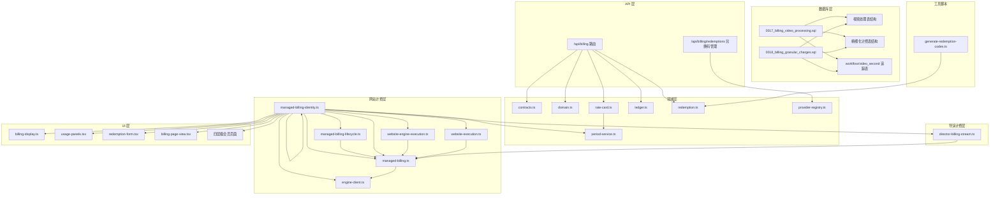
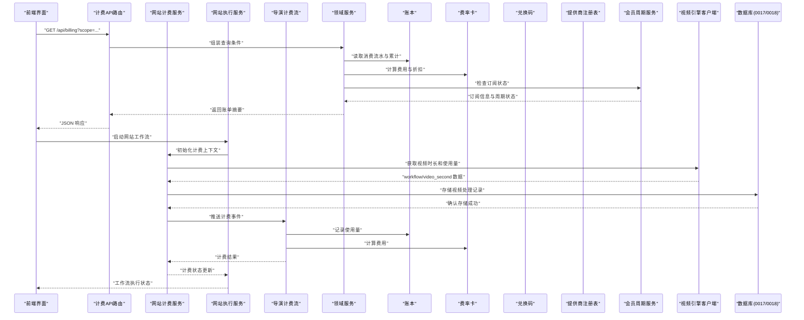
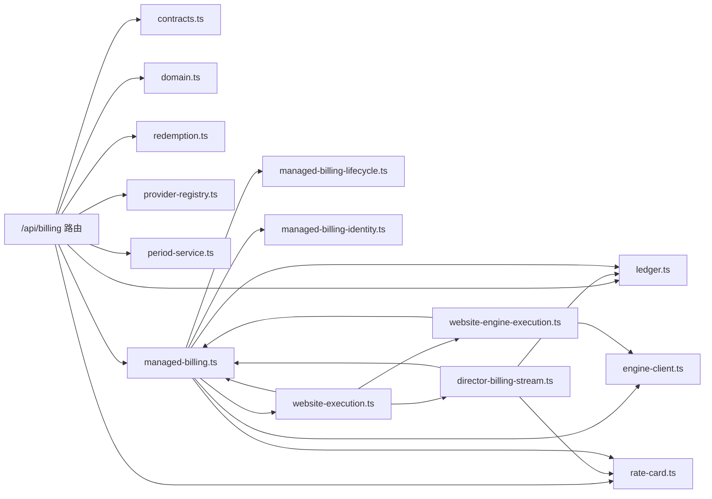

# 计费配置

<cite>
**本文引用的文件**   
- [billing.md](file://docs/configuration/billing.md)
- [route.ts](file://src/app/api/billing/route.ts)
- [contracts.ts](file://src/features/billing/contracts.ts)
- [domain.ts](file://src/features/billing/domain.ts)
- [rate-card.ts](file://src/features/billing/rate-card.ts)
- [ledger.ts](file://src/features/billing/ledger.ts)
- [redemption.ts](file://src/features/billing/redemption.ts)
- [schema.test.ts](file://src/features/billing/schema.test.ts)
- [billing-display.ts](file://src/features/billing/ui/billing-display.ts)
- [usage-panels.tsx](file://src/features/billing/ui/usage-panels.tsx)
- [redemption-form.tsx](file://src/features/billing/ui/redemption-form.tsx)
- [billing-page-view.tsx](file://src/features/billing/ui/billing-page-view.tsx)
- [managed-billing.ts](file://src/features/website/managed-billing.ts)
- [managed-billing-lifecycle.ts](file://src/features/website/managed-billing-lifecycle.ts)
- [managed-billing-identity.ts](file://src/features/website/managed-billing-identity.ts)
- [engine-client.ts](file://src/features/website/engine-client.ts)
- [website-engine-execution.ts](file://src/features/website/website-engine-execution.ts)
- [website-execution.ts](file://src/features/website/website-execution.ts)
- [director-billing-stream.ts](file://src/features/director/director-billing-stream.ts)
</cite>

## 更新摘要
**变更内容**   
- 新增网站工作流统一计费功能，支持各阶段的费用追踪
- 集成网站引擎执行与计费系统的深度整合
- 实现导演工作流的计费流式处理机制
- 增强计费系统以支持网站工作流的生命周期管理

## 目录
1. [简介](#简介)
2. [项目结构](#项目结构)
3. [核心组件](#核心组件)
4. [架构总览](#架构总览)
5. [详细组件分析](#详细组件分析)
6. [依赖关系分析](#依赖关系分析)
7. [性能考虑](#性能考虑)
8. [故障排查指南](#故障排查指南)
9. [结论](#结论)
10. [附录](#附录)

## 简介
本文件面向"计费配置"主题，围绕计费域的数据模型、API 路由、展示与使用量面板、兑换码流程等进行系统化说明。目标是帮助读者快速理解计费相关模块的职责边界、数据流与扩展点，并在不深入源码的情况下完成配置与排障。

**更新** 本次更新重点反映了网站工作流统一计费功能的集成，新增了网站引擎执行与计费系统的深度整合，以及导演工作流的计费流式处理机制。这些增强功能为网站服务的全生命周期计费提供了更强大的支撑能力。

## 项目结构
计费功能主要分布在以下位置：
- API 层：Next.js App Router 的 /api/billing 路由，负责鉴权、参数校验、调用领域服务并返回响应。
- 领域层：features/billing 下的 contracts、domain、rate-card、ledger、redemption 等模块，定义计费契约、领域实体、费率卡、账本与兑换码逻辑。
- UI 层：features/billing/ui 下的页面视图、展示组件与表单，用于渲染账单信息、用量统计与兑换码输入。
- 网站计费层：features/website 下的 managed-billing、engine-client 等模块，提供网站视频计费的专用集成。
- 网站执行层：features/website 下的 website-engine-execution 和 website-execution 模块，处理网站工作流的执行与计费集成。
- 导演计费层：features/director 下的 director-billing-stream 模块，实现导演工作流的计费流式处理。
- 数据库层：drizzle 迁移文件，特别是新增的 0017_billing_video_processing.sql 和 0018_billing_granular_charges.sql，提供视频处理和精细化计费所需的数据库结构支持。
- 文档：docs/configuration/billing.md 提供计费配置的说明与示例。

**图表来源**
- [route.ts](file://src/app/api/billing/route.ts)
- [contracts.ts](file://src/features/billing/contracts.ts)
- [domain.ts](file://src/features/billing/domain.ts)
- [rate-card.ts](file://src/features/billing/rate-card.ts)
- [ledger.ts](file://src/features/billing/ledger.ts)
- [redemption.ts](file://src/features/billing/redemption.ts)
- [period-service.ts](file://src/features/billing/period-service.ts)
- [managed-billing.ts](file://src/features/website/managed-billing.ts)
- [managed-billing-lifecycle.ts](file://src/features/website/managed-billing-lifecycle.ts)
- [managed-billing-identity.ts](file://src/features/website/managed-billing-identity.ts)
- [engine-client.ts](file://src/features/website/engine-client.ts)
- [website-engine-execution.ts](file://src/features/website/website-engine-execution.ts)
- [website-execution.ts](file://src/features/website/website-execution.ts)
- [director-billing-stream.ts](file://src/features/director/director-billing-stream.ts)
- [billing-display.ts](file://src/features/billing/ui/billing-display.ts)
- [usage-panels.tsx](file://src/features/billing/ui/usage-panels.tsx)
- [redemption-form.tsx](file://src/features/billing/ui/redemption-form.tsx)
- [billing-page-view.tsx](file://src/features/billing/ui/billing-page-view.tsx)

**章节来源**
- [billing.md](file://docs/configuration/billing.md)

## 核心组件
- 计费契约（contracts）：定义请求/响应结构与字段约束，确保前后端一致。
- 领域模型（domain）：抽象计费相关的实体与行为，如用量、额度、余额等。
- 费率卡（rate-card）：描述不同资源或模型的计费规则与单价。
- 账本（ledger）：记录消费流水、累计与结算状态，支撑对账与审计。
- 兑换码（redemption）：处理兑换码的发放、核销与有效期管理。
- 提供商注册表（provider-registry）：服务器端管理的第三方服务提供商注册与发现机制。
- 会员周期服务（period-service）：处理订阅周期、续费逻辑和状态管理。
- 网站计费管理（managed-billing）：网站视频计费的专用管理服务。
- 计费生命周期（managed-billing-lifecycle）：管理网站计费的生命周期操作。
- 幂等身份管理（managed-billing-identity）：确保计费操作的幂等性和身份一致性。
- 引擎客户端（engine-client）：与视频引擎交互的客户端接口。
- 网站引擎执行（website-engine-execution）：网站工作流执行的计费集成。
- 网站执行（website-execution）：网站工作流的整体执行管理。
- 导演计费流（director-billing-stream）：导演工作流的计费流式处理。
- UI 展示与交互：账单展示、用量面板、兑换码表单与页面视图。

**更新** 新增了网站工作流统一计费功能的核心组件，包括网站引擎执行、网站执行管理和导演计费流处理，实现了完整的网站工作流计费闭环。

**章节来源**
- [contracts.ts](file://src/features/billing/contracts.ts)
- [domain.ts](file://src/features/billing/domain.ts)
- [rate-card.ts](file://src/features/billing/rate-card.ts)
- [ledger.ts](file://src/features/billing/ledger.ts)
- [redemption.ts](file://src/features/billing/redemption.ts)
- [period-service.ts](file://src/features/billing/period-service.ts)
- [managed-billing.ts](file://src/features/website/managed-billing.ts)
- [managed-billing-lifecycle.ts](file://src/features/website/managed-billing-lifecycle.ts)
- [managed-billing-identity.ts](file://src/features/website/managed-billing-identity.ts)
- [engine-client.ts](file://src/features/website/engine-client.ts)
- [website-engine-execution.ts](file://src/features/website/website-engine-execution.ts)
- [website-execution.ts](file://src/features/website/website-execution.ts)
- [director-billing-stream.ts](file://src/features/director/director-billing-stream.ts)
- [billing-display.ts](file://src/features/billing/ui/billing-display.ts)
- [usage-panels.tsx](file://src/features/billing/ui/usage-panels.tsx)
- [redemption-form.tsx](file://src/features/billing/ui/redemption-form.tsx)
- [billing-page-view.tsx](file://src/features/billing/ui/billing-page-view.tsx)

## 架构总览
计费系统采用分层设计：API 路由作为入口，调用领域服务进行业务处理，UI 通过 API 获取数据并渲染。关键流程包括：
- 查询账单与用量：前端发起请求，后端校验参数、读取账本与费率卡，返回聚合结果。
- 兑换码核销：前端提交兑换码，后端验证有效性、更新账本并返回结果。
- 兑换码生成：管理员通过脚本或API批量生成一次性兑换码。
- 提供商管理：服务器端维护第三方服务提供商的注册信息和配置。
- 会员周期管理：处理订阅创建、续费、暂停和取消等生命周期操作。
- 网站视频计费：通过 managed-billing 服务处理 workflow/video_second 使用量追踪和精确结算。
- 网站工作流计费：通过 website-engine-execution 和 website-execution 实现完整的工作流计费集成。
- 导演计费流：通过 director-billing-stream 实现流式的计费数据处理。
- 错误处理：统一错误类型与消息，便于前端提示与日志追踪。

**图表来源**
- [route.ts](file://src/app/api/billing/route.ts)
- [managed-billing.ts](file://src/features/website/managed-billing.ts)
- [engine-client.ts](file://src/features/website/engine-client.ts)
- [website-engine-execution.ts](file://src/features/website/website-engine-execution.ts)
- [website-execution.ts](file://src/features/website/website-execution.ts)
- [director-billing-stream.ts](file://src/features/director/director-billing-stream.ts)
- [ledger.ts](file://src/features/billing/ledger.ts)
- [rate-card.ts](file://src/features/billing/rate-card.ts)
- [redemption.ts](file://src/features/billing/redemption.ts)
- [period-service.ts](file://src/features/billing/period-service.ts)

## 详细组件分析

### API 路由：/api/billing
职责：
- 接收前端请求，解析并校验查询参数与路径参数。
- 调用领域服务获取账单与用量数据。
- 处理兑换码提交与核销流程。
- 处理会员订阅的创建、更新和管理操作。
- 处理网站视频计费的专用API端点。
- 返回统一的 JSON 响应与错误码。

**更新** 新增了对网站工作流统一计费的支持，增强了API端点以支持网站执行和导演计费流的集成。

关键点：
- 参数校验与权限控制应在入口处完成。
- 错误应区分客户端错误与服务端错误，便于前端提示与监控。
- 支持批量操作和事务性处理。
- 订阅操作需要幂等性保证，防止重复创建。
- 视频计费操作需要严格的时长锁定和幂等性控制。
- 网站工作流计费需要支持完整的生命周期管理。
- 导演计费流需要支持实时流式数据处理。

**章节来源**
- [route.ts](file://src/app/api/billing/route.ts)

### 领域模型：domain
职责：
- 定义计费实体（如用量、额度、余额、账户信息等）。
- 提供领域方法（如累计、扣减、折算等）。
- 保证业务不变量（如余额非负、额度上限等）。
- 支持会员周期的状态管理和业务规则。
- 支持视频使用量的精确计量和结算。

**更新** 增强了领域模型以支持网站工作流统一计费的新增功能，包括工作流执行状态追踪、导演计费流处理和网站执行的生命周期管理。

复杂度与优化：
- 累计与折算算法应避免重复计算，必要时引入缓存或增量更新。
- 并发场景下需保证事务性与一致性。
- 支持动态费率调整和促销策略。
- 会员周期状态转换需要严格的业务规则验证。
- 视频使用量计算需要高精度时间处理和去重机制。
- 网站工作流计费需要支持复杂的状态机管理。
- 导演计费流需要高效的流式处理能力。

**章节来源**
- [domain.ts](file://src/features/billing/domain.ts)

### 网站引擎执行：website-engine-execution
职责：
- 管理网站工作流的执行生命周期。
- 集成计费系统与网站引擎的交互。
- 处理工作流各阶段的计费事件。
- 协调网站执行与计费状态的同步。
- 管理工作流执行的异常处理和恢复。

**新增** 这是本次更新中新增的核心组件，专门处理网站工作流的执行与计费集成。

特性：
- 支持网站工作流的完整生命周期管理。
- 与工作流各阶段的计费事件集成。
- 处理执行状态与计费状态的同步。
- 支持异常情况的自动恢复和处理。
- 提供执行进度和计费状态的实时监控。

**章节来源**
- [website-engine-execution.ts](file://src/features/website/website-engine-execution.ts)

### 网站执行：website-execution
职责：
- 管理网站工作流的整体执行过程。
- 协调各个执行阶段的任务调度。
- 处理工作流的数据流转和状态管理。
- 集成计费系统的状态更新。
- 提供工作流执行的监控和日志记录。

**新增** 这是本次更新中新增的核心组件，负责网站工作流的整体执行管理。

特性：
- 支持复杂工作流的多阶段执行。
- 任务调度和依赖管理。
- 数据流转的状态跟踪。
- 与计费系统的深度集成。
- 执行过程的完整监控和日志记录。

**章节来源**
- [website-execution.ts](file://src/features/website/website-execution.ts)

### 导演计费流：director-billing-stream
职责：
- 处理导演工作流的计费流式数据。
- 实现计费事件的实时处理和转发。
- 管理计费数据的流式传输和缓冲。
- 处理计费事件的顺序性和一致性。
- 提供计费处理的监控和告警。

**新增** 这是本次更新中新增的核心组件，专门处理导演工作流的计费流式处理。

特性：
- 支持高吞吐量的流式计费处理。
- 计费事件的实时处理和转发。
- 数据流的顺序性保证和一致性控制。
- 流式缓冲和背压处理。
- 计费处理的实时监控和告警机制。

**章节来源**
- [director-billing-stream.ts](file://src/features/director/director-billing-stream.ts)

### 其他核心组件
- 费率卡（rate-card）：描述不同资源或模型的单价、阶梯价与折扣策略。
- 账本（ledger）：记录每次消费的明细（时间、资源、数量、单价、金额等）。
- 兑换码（redemption）：生成、发放与核销兑换码。
- 会员周期服务（period-service）：管理会员订阅的生命周期。
- 网站计费管理（managed-billing）：管理网站视频计费的完整生命周期。
- 计费生命周期管理（managed-billing-lifecycle）：管理网站计费服务的启动、停止和重启。
- 幂等身份管理（managed-billing-identity）：生成和管理计费操作的唯一标识符。
- 引擎客户端（engine-client）：与视频引擎进行通信和数据交换。

**更新** 所有核心组件都进行了增强，以支持网站工作流统一计费的新增功能。

**章节来源**
- [rate-card.ts](file://src/features/billing/rate-card.ts)
- [ledger.ts](file://src/features/billing/ledger.ts)
- [redemption.ts](file://src/features/billing/redemption.ts)
- [period-service.ts](file://src/features/billing/period-service.ts)
- [managed-billing.ts](file://src/features/website/managed-billing.ts)
- [managed-billing-lifecycle.ts](file://src/features/website/managed-billing-lifecycle.ts)
- [managed-billing-identity.ts](file://src/features/website/managed-billing-identity.ts)
- [engine-client.ts](file://src/features/website/engine-client.ts)

## 依赖关系分析
计费模块内部依赖清晰，外部依赖主要为数据库与存储（由 ledger 抽象），以及可能的第三方计费服务（未来扩展）。

**更新** 新增了网站工作流统一计费的依赖关系，包括网站引擎执行、网站执行管理和导演计费流的集成。

**图表来源**
- [route.ts](file://src/app/api/billing/route.ts)
- [contracts.ts](file://src/features/billing/contracts.ts)
- [domain.ts](file://src/features/billing/domain.ts)
- [rate-card.ts](file://src/features/billing/rate-card.ts)
- [ledger.ts](file://src/features/billing/ledger.ts)
- [redemption.ts](file://src/features/billing/redemption.ts)
- [provider-registry.ts](file://src/features/billing/provider-registry.ts)
- [period-service.ts](file://src/features/billing/period-service.ts)
- [managed-billing.ts](file://src/features/website/managed-billing.ts)
- [managed-billing-lifecycle.ts](file://src/features/website/managed-billing-lifecycle.ts)
- [managed-billing-identity.ts](file://src/features/website/managed-billing-identity.ts)
- [engine-client.ts](file://src/features/website/engine-client.ts)
- [website-engine-execution.ts](file://src/features/website/website-engine-execution.ts)
- [website-execution.ts](file://src/features/website/website-execution.ts)
- [director-billing-stream.ts](file://src/features/director/director-billing-stream.ts)

**章节来源**
- [route.ts](file://src/app/api/billing/route.ts)
- [contracts.ts](file://src/features/billing/contracts.ts)
- [domain.ts](file://src/features/billing/domain.ts)
- [rate-card.ts](file://src/features/billing/rate-card.ts)
- [ledger.ts](file://src/features/billing/ledger.ts)
- [redemption.ts](file://src/features/billing/redemption.ts)
- [period-service.ts](file://src/features/billing/period-service.ts)
- [managed-billing.ts](file://src/features/website/managed-billing.ts)
- [managed-billing-lifecycle.ts](file://src/features/website/managed-billing-lifecycle.ts)
- [managed-billing-identity.ts](file://src/features/website/managed-billing-identity.ts)
- [engine-client.ts](file://src/features/website/engine-client.ts)
- [website-engine-execution.ts](file://src/features/website/website-engine-execution.ts)
- [website-execution.ts](file://src/features/website/website-execution.ts)
- [director-billing-stream.ts](file://src/features/director/director-billing-stream.ts)

## 性能考虑
- 账本查询：对常用维度建立索引，分页与过滤减少全表扫描。
- 费率计算：预计算热点费率，避免实时复杂运算。
- 兑换码核销：加入分布式锁与幂等键，防止重复核销。
- 前端缓存：用量与账单数据可短期缓存，降低 API 压力。
- 提供商注册表：使用内存缓存和连接池优化第三方服务调用。
- 会员周期服务：订阅状态查询需要高效的索引和缓存策略。
- 数据库迁移：确保迁移脚本的幂等性和执行效率。
- 视频计费：workflow/video_second 使用量追踪需要高性能的写入和查询优化。
- 引擎客户端：视频引擎API调用需要连接池管理和超时控制。
- 幂等性管理：唯一ID生成和检查需要高效的哈希和存储机制。
- 网站工作流计费：网站执行和引擎执行需要高效的并发处理和状态同步。
- 导演计费流：流式处理需要高效的缓冲管理和背压控制。
- 高并发处理：网站工作流场景下需要支持高并发执行和实时计费处理。

**更新** 新增了网站工作流统一计费的性能优化建议，包括网站执行的并发处理、导演计费流的流式处理优化和高并发场景下的性能保障。

## 故障排查指南
常见问题与定位步骤：
- 参数校验失败：检查请求体与查询参数是否符合契约定义。
- 余额不足：核对账本流水与当前余额，确认是否有未结算交易。
- 兑换码无效：验证有效期、使用次数与绑定账户是否匹配。
- 性能问题：查看慢查询日志与接口耗时，定位瓶颈。
- 提供商连接失败：检查提供商注册表配置和网络连通性。
- 订阅状态异常：检查会员周期服务日志和数据库状态一致性。
- 数据库迁移失败：验证迁移脚本的兼容性和执行顺序。
- 视频计费失败：检查引擎客户端连接和视频引擎API响应。
- 幂等性冲突：查看唯一ID生成和检查逻辑，确认是否存在重复操作。
- 网站工作流执行失败：检查网站执行服务和引擎执行服务的状态。
- 导演计费流异常：检查流式处理的数据顺序性和一致性。
- 计费状态不同步：检查工作流执行状态与计费状态的同步机制。
- 流式处理延迟：监控导演计费流的缓冲和吞吐量指标。

**更新** 新增了网站工作流统一计费相关问题的排查指南，包括网站执行失败、导演计费流异常和计费状态同步问题的处理方法。

**章节来源**
- [schema.test.ts](file://src/features/billing/schema.test.ts)
- [ledger.ts](file://src/features/billing/ledger.ts)
- [redemption.ts](file://src/features/billing/redemption.ts)
- [period-service.ts](file://src/features/billing/period-service.ts)
- [managed-billing.ts](file://src/features/website/managed-billing.ts)
- [engine-client.ts](file://src/features/website/engine-client.ts)
- [managed-billing-identity.ts](file://src/features/website/managed-billing-identity.ts)
- [website-engine-execution.ts](file://src/features/website/website-engine-execution.ts)
- [website-execution.ts](file://src/features/website/website-execution.ts)
- [director-billing-stream.ts](file://src/features/director/director-billing-stream.ts)

## 结论
计费配置模块以清晰的层次划分与明确的职责边界，支撑了账单查询、用量统计、兑换码核销、会员周期管理和网站视频计费管理等核心能力。通过契约化设计与完善的测试覆盖，确保了前后端一致性与系统稳定性。

**更新** 本次更新通过集成网站工作流统一计费功能，显著增强了计费系统的功能完整性。新增的网站引擎执行、网站执行管理和导演计费流处理，为网站服务的全生命周期计费提供了强大的支撑能力。这些改进使得计费系统能够更好地支持复杂的网站工作流场景，提供更精确的费用追踪和管理能力。

## 附录
- 配置参考：详见 docs/configuration/billing.md，包含环境变量、默认值与示例。
- 扩展建议：如需接入新的计费渠道，建议在 rate-card 与 ledger 层增加适配器，保持领域逻辑不变。
- 工具使用：使用 scripts/admin/generate-redemption-codes.ts 批量生成兑换码。
- 数据库迁移：部署前需执行 drizzle 迁移脚本，确保数据库结构同步。
- 会员周期配置：参考 period-service.ts 中的订阅模板和周期规则配置。
- 网站视频计费：参考 managed-billing.ts 中的视频计费配置和 engine-client.ts 中的引擎客户端设置。
- 幂等性配置：参考 managed-billing-identity.ts 中的唯一ID生成和幂等性控制配置。
- 网站工作流计费：参考 website-engine-execution.ts 和 website-execution.ts 中的工作流执行配置。
- 导演计费流：参考 director-billing-stream.ts 中的流式计费处理配置。
- 精细化计费：参考 PostgreSQL 迁移 0017 和 0018 中的视频处理和精细化计费实现。

**更新** 新增了网站工作流统一计费的相关配置指导，包括网站执行配置、导演计费流配置和工作流计费的最佳实践。

**章节来源**
- [billing.md](file://docs/configuration/billing.md)
- [period-service.ts](file://src/features/billing/period-service.ts)
- [managed-billing.ts](file://src/features/website/managed-billing.ts)
- [engine-client.ts](file://src/features/website/engine-client.ts)
- [managed-billing-identity.ts](file://src/features/website/managed-billing-identity.ts)
- [website-engine-execution.ts](file://src/features/website/website-engine-execution.ts)
- [website-execution.ts](file://src/features/website/website-execution.ts)
- [director-billing-stream.ts](file://src/features/director/director-billing-stream.ts)