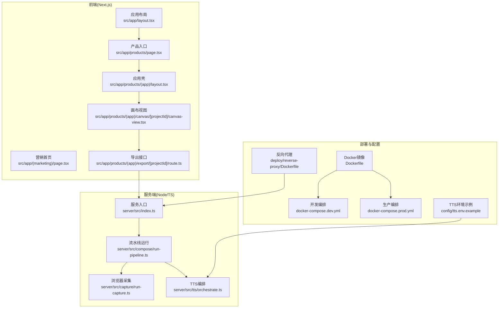
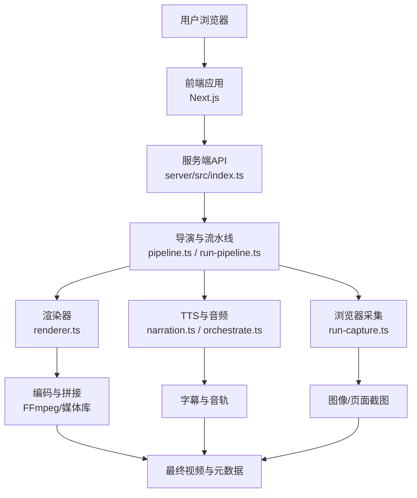
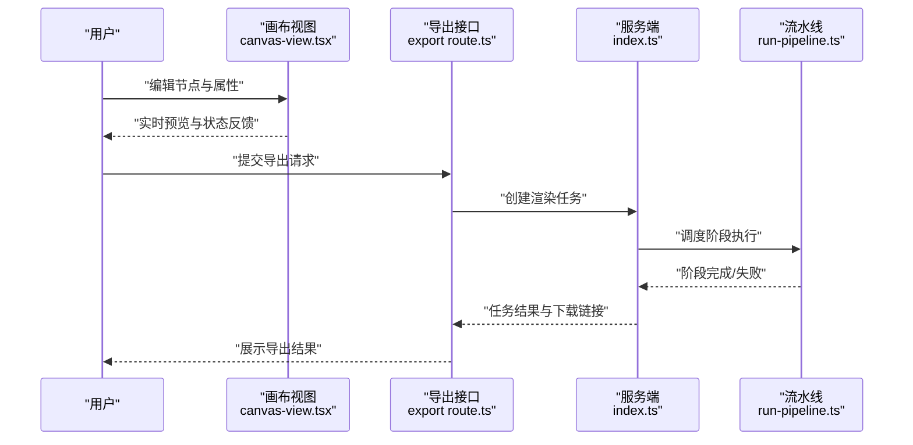
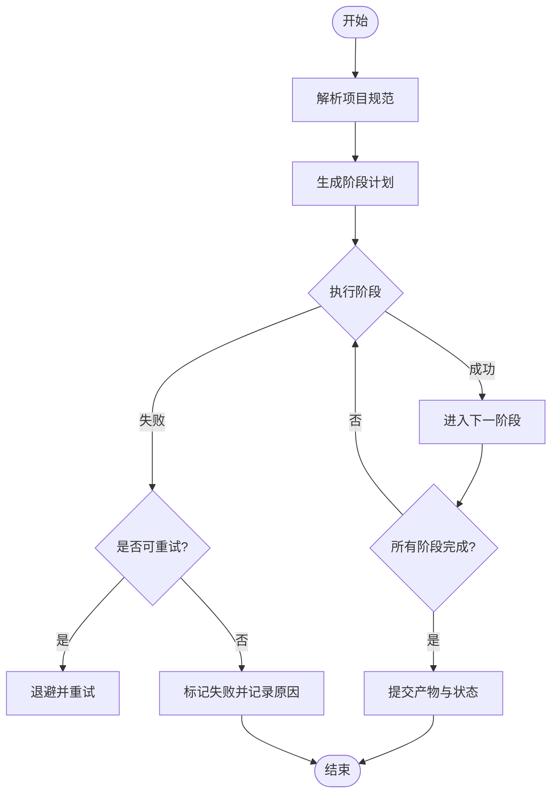
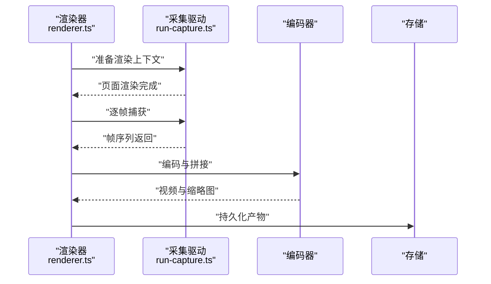
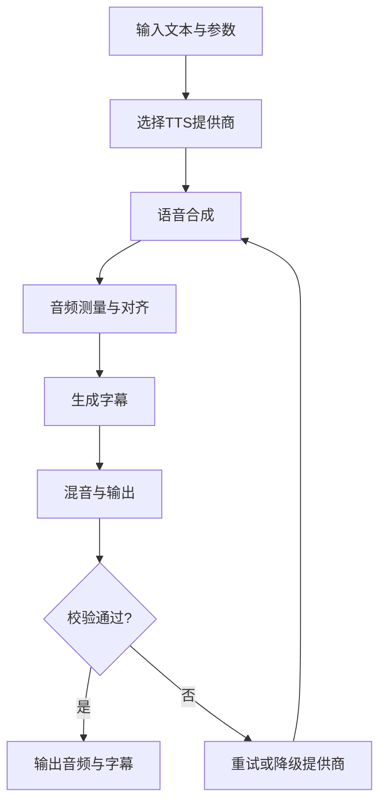
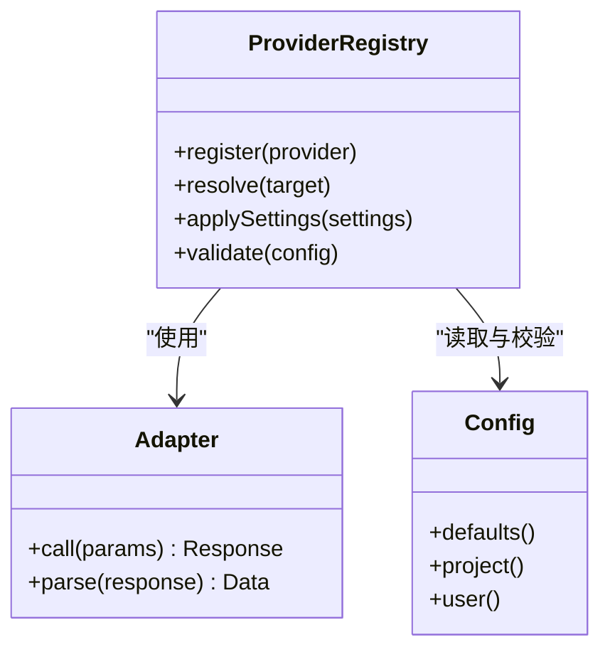
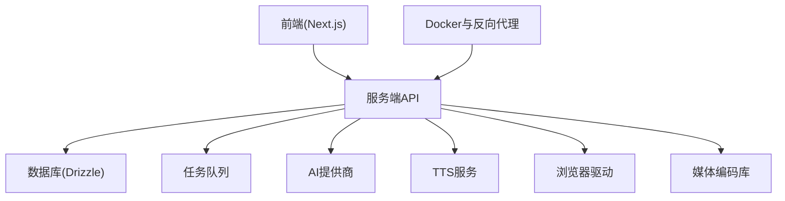

# 项目介绍

<cite>
**本文引用的文件**   
- [package.json](file://package.json)
- [next.config.ts](file://next.config.ts)
- [Dockerfile](file://Dockerfile)
- [docker-compose.dev.yml](file://docker-compose.dev.yml)
- [docker-compose.prod.yml](file://docker-compose.prod.yml)
- [drizzle.config.ts](file://drizzle.config.ts)
- [src/app/layout.tsx](file://src/app/layout.tsx)
- [src/app/(marketing)/page.tsx](file://src/app/(marketing)/page.tsx)
- [src/app/products/page.tsx](file://src/app/products/page.tsx)
- [src/app/products/(app)/layout.tsx](file://src/app/products/(app)/layout.tsx)
- [src/app/products/(app)/canvas/[projectId]/canvas-view.tsx](file://src/app/products/(app)/canvas/[projectId]/canvas-view.tsx)
- [src/app/products/(app)/export/[projectId]/route.ts](file://src/app/products/(app)/export/[projectId]/route.ts)
- [src/features/director/pipeline.ts](file://src/features/director/pipeline.ts)
- [src/features/render/renderer.ts](file://src/features/render/renderer.ts)
- [src/features/audio/narration.ts](file://src/features/audio/narration.ts)
- [src/features/ai/provider-registry.ts](file://src/features/ai/provider-registry.ts)
- [src/lib/site-config.ts](file://src/lib/site-config.ts)
- [server/src/index.ts](file://server/src/index.ts)
- [server/src/compose/run-pipeline.ts](file://server/src/compose/run-pipeline.ts)
- [server/src/capture/run-capture.ts](file://server/src/capture/run-capture.ts)
- [server/src/tts/orchestrate.ts](file://server/src/tts/orchestrate.ts)
- [config/tts.env.example](file://config/tts.env.example)
- [deploy/reverse-proxy/Dockerfile](file://deploy/reverse-proxy/Dockerfile)
- [deploy/reverse-proxy/entrypoint.sh](file://deploy/reverse-proxy/entrypoint.sh)
</cite>

## 目录
1. [简介](#简介)
2. [项目结构](#项目结构)
3. [核心组件](#核心组件)
4. [架构总览](#架构总览)
5. [详细组件分析](#详细组件分析)
6. [依赖关系分析](#依赖关系分析)
7. [性能考量](#性能考量)
8. [故障排查指南](#故障排查指南)
9. [结论](#结论)
10. [附录](#附录)

## 简介
PurpleInk AI视频制作平台是一个以人工智能为核心的视频内容创作平台，致力于通过AI技术简化从脚本到成片的完整制作流程。平台面向内容创作者、营销团队与独立开发者，提供“AI脚本生成—可视化画布编辑—自动化渲染管道—多模态输出”的一体化能力，帮助用户在更短的时间内产出高质量视频内容。

核心价值主张：
- 降低门槛：用AI辅助脚本与分镜生成，减少前期策划与文案工作。
- 提升效率：可视化画布与自动化渲染，让复杂剪辑与合成变得简单直观。
- 灵活扩展：多模型与多提供商接入，支持文本、图像、音频等多模态素材生成与处理。
- 稳定可靠：可编排的流水线与任务队列，保障大规模生产环境的稳定性与可观测性。

目标用户群体：
- 内容创作者与自媒体运营者：快速批量生产短视频、口播、知识类内容。
- 品牌与市场团队：高效产出广告片、产品宣传片、活动回顾等营销物料。
- 教育与企业培训：将课件与讲稿自动转化为视频课程或讲解视频。
- 开发者与集成商：通过API与SDK将AI视频能力嵌入自有业务系统。

与传统视频制作工具的独特优势：
- 从“手动剪辑”转向“意图驱动”的创作方式，强调以自然语言与结构化提示驱动内容生成。
- 端到端流水线覆盖脚本、分镜、配音、字幕、画面合成与导出，减少工具切换与数据流转成本。
- 可插拔的多模态模型与TTS提供商，按需选择最优能力组合，兼顾质量与成本。

愿景与使命：
- 愿景：让每个人都能轻松创作专业级视频内容。
- 使命：以AI为引擎，构建开放、可扩展、高可靠的视频创作基础设施。

## 项目结构
本项目采用前后端分离与模块化组织：
- 前端（Next.js应用）：负责页面路由、交互、画布编辑器与导出界面。
- 服务端（Node/TypeScript）：承载渲染、采集、TTS编排与流水线执行。
- 部署与运维：Docker化部署、反向代理、环境变量与密钥管理。
- 配置与文档：数据库迁移、凭证模板、设计说明与问题追踪。

图表来源
- [src/app/layout.tsx](file://src/app/layout.tsx)
- [src/app/(marketing)/page.tsx](file://src/app/(marketing)/page.tsx)
- [src/app/products/page.tsx](file://src/app/products/page.tsx)
- [src/app/products/(app)/layout.tsx](file://src/app/products/(app)/layout.tsx)
- [src/app/products/(app)/canvas/[projectId]/canvas-view.tsx](file://src/app/products/(app)/canvas/[projectId]/canvas-view.tsx)
- [src/app/products/(app)/export/[projectId]/route.ts](file://src/app/products/(app)/export/[projectId]/route.ts)
- [server/src/index.ts](file://server/src/index.ts)
- [server/src/compose/run-pipeline.ts](file://server/src/compose/run-pipeline.ts)
- [server/src/capture/run-capture.ts](file://server/src/capture/run-capture.ts)
- [server/src/tts/orchestrate.ts](file://server/src/tts/orchestrate.ts)
- [Dockerfile](file://Dockerfile)
- [docker-compose.dev.yml](file://docker-compose.dev.yml)
- [docker-compose.prod.yml](file://docker-compose.prod.yml)
- [deploy/reverse-proxy/Dockerfile](file://deploy/reverse-proxy/Dockerfile)
- [config/tts.env.example](file://config/tts.env.example)

章节来源
- [package.json](file://package.json)
- [next.config.ts](file://next.config.ts)
- [Dockerfile](file://Dockerfile)
- [docker-compose.dev.yml](file://docker-compose.dev.yml)
- [docker-compose.prod.yml](file://docker-compose.prod.yml)
- [drizzle.config.ts](file://drizzle.config.ts)

## 核心组件
- AI模型与提供商注册：统一抽象不同文本/图像/音频提供商，支持动态路由与配置注入。
- 导演与流水线：将脚本、分镜、转场、音效、配音等步骤编排为可执行的阶段化流水线。
- 渲染与采集：基于浏览器驱动的页面渲染与帧捕获，结合FFmpeg进行媒体编码与拼接。
- TTS与音频：多源语音合成、字幕生成、音频测量与混音，确保音画同步与时长对齐。
- 画布编辑器：可视化节点式编辑，支持拖拽、预览、状态反馈与版本快照。
- 导出服务：按项目规格生成缩略图、封面、多分辨率视频与字幕文件。

章节来源
- [src/features/ai/provider-registry.ts](file://src/features/ai/provider-registry.ts)
- [src/features/director/pipeline.ts](file://src/features/director/pipeline.ts)
- [src/features/render/renderer.ts](file://src/features/render/renderer.ts)
- [src/features/audio/narration.ts](file://src/features/audio/narration.ts)
- [src/app/products/(app)/canvas/[projectId]/canvas-view.tsx](file://src/app/products/(app)/canvas/[projectId]/canvas-view.tsx)
- [src/app/products/(app)/export/[projectId]/route.ts](file://src/app/products/(app)/export/[projectId]/route.ts)

## 架构总览
PurpleInk采用分层架构与事件驱动的组合模式：
- 表现层：Next.js页面与组件，提供营销页、产品入口、画布编辑器与导出界面。
- 业务层：导演、渲染、音频、AI提供商等特性模块，封装领域逻辑。
- 服务层：Node服务端暴露API，协调流水线、任务队列与外部资源。
- 基础设施层：容器化部署、反向代理、数据库与对象存储。

图表来源
- [src/app/products/(app)/canvas/[projectId]/canvas-view.tsx](file://src/app/products/(app)/canvas/[projectId]/canvas-view.tsx)
- [server/src/index.ts](file://server/src/index.ts)
- [src/features/director/pipeline.ts](file://src/features/director/pipeline.ts)
- [server/src/compose/run-pipeline.ts](file://server/src/compose/run-pipeline.ts)
- [server/src/capture/run-capture.ts](file://server/src/capture/run-capture.ts)
- [src/features/render/renderer.ts](file://src/features/render/renderer.ts)
- [src/features/audio/narration.ts](file://src/features/audio/narration.ts)
- [server/src/tts/orchestrate.ts](file://server/src/tts/orchestrate.ts)

## 详细组件分析

### 画布编辑器与项目工作流
- 功能要点：节点式编辑、实时预览、状态面板、操作历史与撤销重做。
- 关键路径：项目ID路由进入画布视图，加载项目状态与资产，用户修改触发增量更新与校验。
- 交互流程：选择节点→编辑属性→预览→保存→提交渲染任务。

图表来源
- [src/app/products/(app)/canvas/[projectId]/canvas-view.tsx](file://src/app/products/(app)/canvas/[projectId]/canvas-view.tsx)
- [src/app/products/(app)/export/[projectId]/route.ts](file://src/app/products/(app)/export/[projectId]/route.ts)
- [server/src/index.ts](file://server/src/index.ts)
- [server/src/compose/run-pipeline.ts](file://server/src/compose/run-pipeline.ts)

章节来源
- [src/app/products/(app)/canvas/[projectId]/canvas-view.tsx](file://src/app/products/(app)/canvas/[projectId]/canvas-view.tsx)
- [src/app/products/(app)/export/[projectId]/route.ts](file://src/app/products/(app)/export/[projectId]/route.ts)

### 导演与流水线编排
- 功能要点：阶段化执行、状态机推进、错误恢复与重试、产物写入与读取。
- 关键路径：解析项目规范→组装阶段→顺序/并行执行→持久化中间产物→汇总结果。
- 优化点：阶段缓存、并发控制、失败回滚与断点续跑。

图表来源
- [src/features/director/pipeline.ts](file://src/features/director/pipeline.ts)
- [server/src/compose/run-pipeline.ts](file://server/src/compose/run-pipeline.ts)

章节来源
- [src/features/director/pipeline.ts](file://src/features/director/pipeline.ts)
- [server/src/compose/run-pipeline.ts](file://server/src/compose/run-pipeline.ts)

### 渲染与采集
- 功能要点：浏览器驱动渲染页面、抓取帧序列、媒体编码与拼接、缩略图生成。
- 关键路径：准备HTML/CSS/JS→启动浏览器→渲染页面→截取帧→编码输出→生成缩略图。
- 质量保障：帧一致性检查、分辨率与码率控制、异常捕获与日志上报。

图表来源
- [src/features/render/renderer.ts](file://src/features/render/renderer.ts)
- [server/src/capture/run-capture.ts](file://server/src/capture/run-capture.ts)

章节来源
- [src/features/render/renderer.ts](file://src/features/render/renderer.ts)
- [server/src/capture/run-capture.ts](file://server/src/capture/run-capture.ts)

### TTS与音频编排
- 功能要点：多提供商语音合成、字幕生成、音频测量与混音、音画同步。
- 关键路径：文本输入→选择提供商→生成语音→提取时间轴→生成字幕→混音输出。
- 容错策略：提供商降级、重试与超时控制、音质与时长校验。

图表来源
- [src/features/audio/narration.ts](file://src/features/audio/narration.ts)
- [server/src/tts/orchestrate.ts](file://server/src/tts/orchestrate.ts)
- [config/tts.env.example](file://config/tts.env.example)

章节来源
- [src/features/audio/narration.ts](file://src/features/audio/narration.ts)
- [server/src/tts/orchestrate.ts](file://server/src/tts/orchestrate.ts)
- [config/tts.env.example](file://config/tts.env.example)

### AI提供商注册与路由
- 功能要点：统一接口抽象、提供商注册表、配置投影与校验、默认值与回退。
- 关键路径：加载配置→注册提供商→选择适配→调用API→解析响应。
- 扩展性：新增提供商只需实现适配器与配置契约。

图表来源
- [src/features/ai/provider-registry.ts](file://src/features/ai/provider-registry.ts)

章节来源
- [src/features/ai/provider-registry.ts](file://src/features/ai/provider-registry.ts)

## 依赖关系分析
- 前端依赖：Next.js框架、UI组件库、状态管理与网络请求库。
- 服务端依赖：Node运行时、数据库ORM（Drizzle）、任务队列与存储后端。
- 外部依赖：AI提供商API、TTS服务、浏览器驱动与媒体编码库。
- 部署依赖：Docker容器、反向代理、环境变量与密钥管理。

图表来源
- [package.json](file://package.json)
- [drizzle.config.ts](file://drizzle.config.ts)
- [Dockerfile](file://Dockerfile)
- [deploy/reverse-proxy/Dockerfile](file://deploy/reverse-proxy/Dockerfile)

章节来源
- [package.json](file://package.json)
- [drizzle.config.ts](file://drizzle.config.ts)
- [Dockerfile](file://Dockerfile)
- [deploy/reverse-proxy/Dockerfile](file://deploy/reverse-proxy/Dockerfile)

## 性能考量
- 渲染性能：帧捕获与编码的并发控制、内存占用监控、GPU加速可选。
- 流水线吞吐：阶段并行度、任务队列优先级、失败重试与退避策略。
- 缓存与复用：中间产物缓存、重复片段复用、CDN分发。
- 资源隔离：容器化隔离、限流与配额、热点资源预热。

[本节为通用指导，不直接分析具体文件]

## 故障排查指南
- 常见问题定位：查看任务日志、阶段状态与错误码、提供商响应与超时。
- 调试手段：启用详细日志、回放阶段输入输出、对比基线与差异。
- 恢复策略：断点续跑、回滚到上一阶段、降级提供商与备用TTS。
- 监控指标：成功率、平均耗时、失败分布、资源利用率。

章节来源
- [server/src/compose/run-pipeline.ts](file://server/src/compose/run-pipeline.ts)
- [server/src/capture/run-capture.ts](file://server/src/capture/run-capture.ts)
- [server/src/tts/orchestrate.ts](file://server/src/tts/orchestrate.ts)

## 结论
PurpleInk AI视频制作平台以AI为核心，构建了从脚本到成片的端到端创作流水线。通过可视化画布、可编排的导演与渲染、多模态输出与灵活的提供商接入，平台显著降低了视频制作的复杂度与成本，适合各类内容生产场景。未来将继续强化模型生态、渲染质量与工程可靠性，为用户提供更高效、更智能的视频创作体验。

[本节为总结性内容，不直接分析具体文件]

## 附录
- 站点配置与导航：用于定义产品入口、导航结构与主题模式。
- 部署与环境：Docker镜像构建、开发/生产编排、反向代理与TTS环境变量示例。

章节来源
- [src/lib/site-config.ts](file://src/lib/site-config.ts)
- [src/app/(marketing)/page.tsx](file://src/app/(marketing)/page.tsx)
- [src/app/products/page.tsx](file://src/app/products/page.tsx)
- [src/app/products/(app)/layout.tsx](file://src/app/products/(app)/layout.tsx)
- [docker-compose.dev.yml](file://docker-compose.dev.yml)
- [docker-compose.prod.yml](file://docker-compose.prod.yml)
- [deploy/reverse-proxy/entrypoint.sh](file://deploy/reverse-proxy/entrypoint.sh)
- [config/tts.env.example](file://config/tts.env.example)