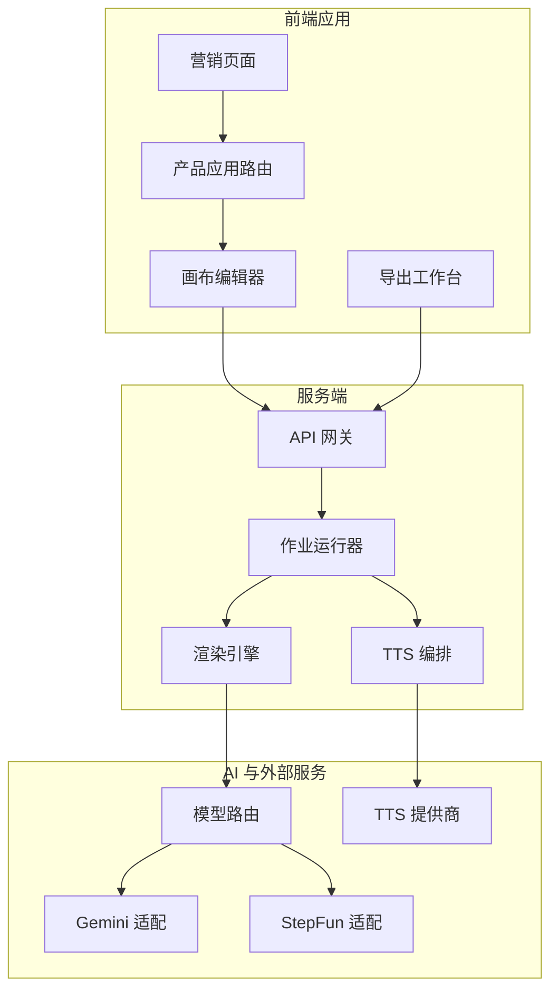
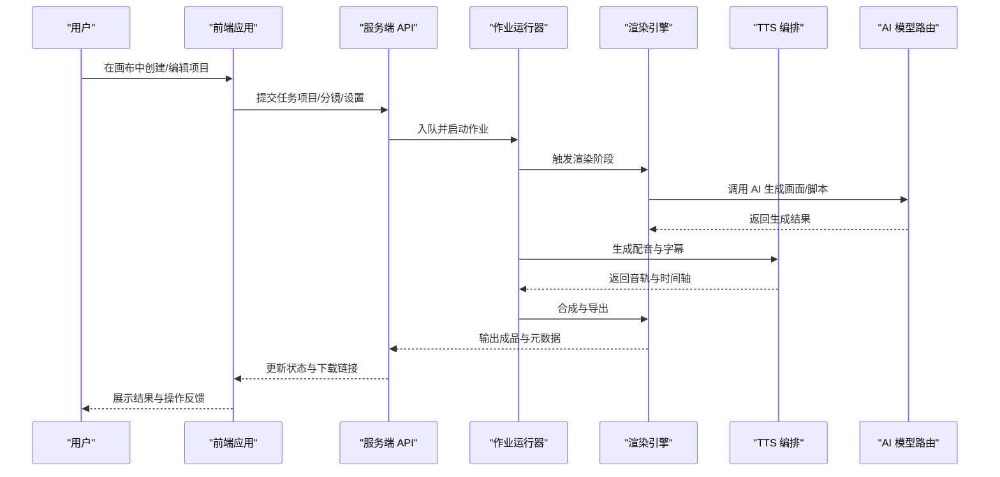
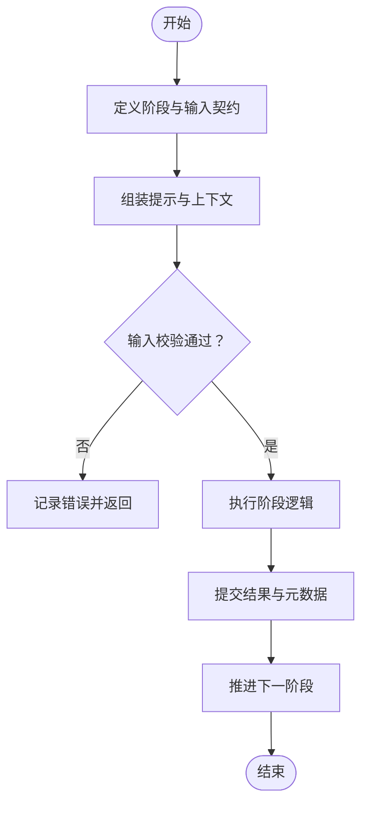
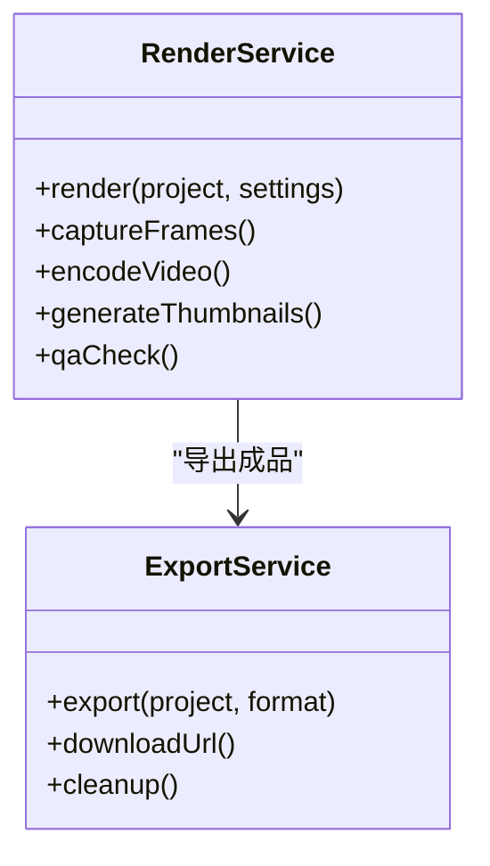
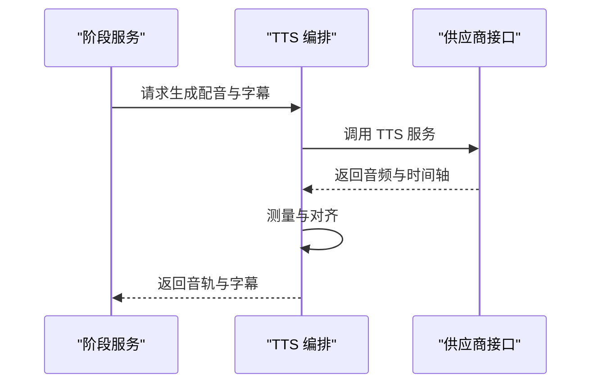
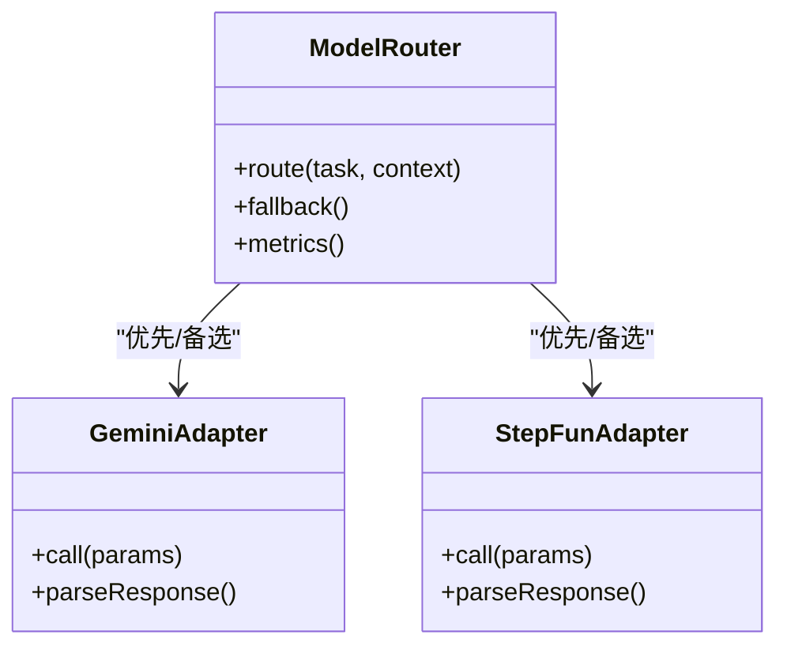
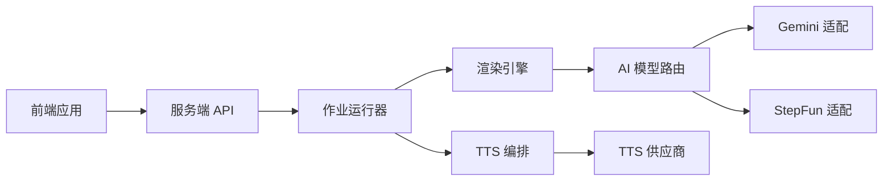

# 项目介绍与目标

<cite>
**本文引用的文件**   
- [package.json](file://package.json)
- [README.md](file://src/app/README.md)
- [compose.yaml](file://deploy/compose.yaml)
- [env.example](file://deploy/env.example)
- [worker.env.example](file://deploy/worker.env.example)
- [tts.env.example](file://config/tts.env.example)
- [index.ts](file://server/src/index.ts)
- [api.ts](file://server/src/server/api.ts)
- [job-runner.ts](file://server/src/server/job-runner.ts)
- [run-pipeline.ts](file://server/src/compose/run-pipeline.ts)
- [render.ts](file://server/src/compose/render.ts)
- [pipeline.ts](file://src/features/director/pipeline.ts)
- [stage-runner.ts](file://src/features/director/stage-runner.ts)
- [queue-handler.ts](file://src/features/director/queue-handler.ts)
- [export-service.ts](file://src/features/render/export-service.ts)
- [renderer.ts](file://src/features/render/renderer.ts)
- [narration.ts](file://src/features/audio/narration.ts)
- [orchestrate.ts](file://server/src/tts/orchestrate.ts)
- [gemini-adapter.ts](file://src/features/ai/gemini-adapter.ts)
- [stepfun-adapter.ts](file://src/features/ai/stepfun-adapter.ts)
- [model-routing.ts](file://src/features/ai/model-routing.ts)
- [canvas-view.tsx](file://src/app/products/(app)/canvas/[projectId]/canvas-view.tsx)
- [page.tsx](file://src/app/products/(app)/canvas/[projectId]/page.tsx)
- [marketing page](file://src/app/(marketing)/page.tsx)
</cite>

## 目录
1. [引言](#引言)
2. [项目结构](#项目结构)
3. [核心组件](#核心组件)
4. [架构总览](#架构总览)
5. [详细组件分析](#详细组件分析)
6. [依赖关系分析](#依赖关系分析)
7. [性能考量](#性能考量)
8. [故障排查指南](#故障排查指南)
9. [结论](#结论)
10. [附录](#附录)

## 引言
PurpleInk（紫墨水）是一个 AI 驱动的视频制作平台，面向内容创作者、视频制作团队与企业用户，提供从创意构思、分镜编排、AI 生成到渲染导出的端到端工作流。平台通过“导演式”流水线将多阶段任务（脚本、分镜、画面、配音、字幕、合成）自动化串联，显著降低创作门槛、提升产出效率与一致性。

核心价值与使命：
- 价值：以 AI 为核心生产力，把复杂的多媒体生产流程标准化、可编排、可协作，让高质量视频快速落地。
- 使命：让每个人都能用自然语言与可视化编排完成专业级视频制作，缩短从想法到成片的时间。
- 愿景：成为跨行业视频生产的“操作系统”，统一创意、执行与交付。
- 核心价值观：高效、可靠、可协作、可扩展、安全合规。

目标用户与典型场景：
- 内容创作者：短视频、知识分享、品牌故事、教程类视频的快速制作与批量生产。
- 视频制作团队：多角色协作、版本管理、质量门禁、模板复用与资产沉淀。
- 企业用户：营销素材规模化生产、多语言本地化、合规审计与集中管控。

解决的问题与独特价值：
- 解决传统视频制作中环节割裂、工具繁多、协同困难、产能瓶颈等问题。
- 提供统一的“导演式”流水线与可视化画布，结合多种 AI 模型与 TTS 能力，实现“所见即所得”的实时反馈与稳定输出。

## 项目结构
仓库采用前后端分离与模块化组织：
- 前端应用：Next.js 应用，包含营销页、产品应用路由、画布编辑器、导出工作台等。
- 服务端：Node/TypeScript 服务，负责 API、作业调度、渲染与 TTS 编排。
- 特性模块：按领域划分（AI、音频、渲染、导演流水线、画布、路由等）。
- 部署配置：Docker Compose、环境变量示例、迁移脚本与验证脚本。

图表来源
- [index.ts](file://server/src/index.ts)
- [api.ts](file://server/src/server/api.ts)
- [job-runner.ts](file://server/src/server/job-runner.ts)
- [pipeline.ts](file://src/features/director/pipeline.ts)
- [renderer.ts](file://src/features/render/renderer.ts)
- [orchestrate.ts](file://server/src/tts/orchestrate.ts)
- [model-routing.ts](file://src/features/ai/model-routing.ts)
- [gemini-adapter.ts](file://src/features/ai/gemini-adapter.ts)
- [stepfun-adapter.ts](file://src/features/ai/stepfun-adapter.ts)

章节来源
- [package.json](file://package.json)
- [README.md](file://src/app/README.md)
- [compose.yaml](file://deploy/compose.yaml)
- [env.example](file://deploy/env.example)
- [worker.env.example](file://deploy/worker.env.example)
- [tts.env.example](file://config/tts.env.example)

## 核心组件
- 导演式流水线：将创意到成片的多个阶段抽象为可编排的“阶段”，支持提示词、校验、结果提交与状态推进。
- 渲染子系统：负责帧捕获、编码、拼接、缩略图与 QA 检查，保障输出一致性与质量。
- TTS 与音频管线：文本转语音、音轨测量、音效与字幕生成，确保音视频同步。
- AI 模型路由：统一接入不同大模型与音频/图像供应商，支持动态选择与降级。
- 画布与交互：可视化编辑、实时预览、状态反馈与错误定位。
- 作业调度与队列：异步处理、并发控制、重试与幂等保证。

章节来源
- [pipeline.ts](file://src/features/director/pipeline.ts)
- [stage-runner.ts](file://src/features/director/stage-runner.ts)
- [queue-handler.ts](file://src/features/director/queue-handler.ts)
- [renderer.ts](file://src/features/render/renderer.ts)
- [export-service.ts](file://src/features/render/export-service.ts)
- [narration.ts](file://src/features/audio/narration.ts)
- [orchestrate.ts](file://server/src/tts/orchestrate.ts)
- [model-routing.ts](file://src/features/ai/model-routing.ts)
- [gemini-adapter.ts](file://src/features/ai/gemini-adapter.ts)
- [stepfun-adapter.ts](file://src/features/ai/stepfun-adapter.ts)

## 架构总览
系统由前端应用、服务端 API、作业运行器、渲染引擎、TTS 编排与 AI 路由组成。用户通过画布发起任务，服务端进行阶段编排与资源调度，渲染与 TTS 并行或串行执行，最终输出成品与元数据。

图表来源
- [api.ts](file://server/src/server/api.ts)
- [job-runner.ts](file://server/src/server/job-runner.ts)
- [run-pipeline.ts](file://server/src/compose/run-pipeline.ts)
- [render.ts](file://server/src/compose/render.ts)
- [pipeline.ts](file://src/features/director/pipeline.ts)
- [renderer.ts](file://src/features/render/renderer.ts)
- [orchestrate.ts](file://server/src/tts/orchestrate.ts)
- [model-routing.ts](file://src/features/ai/model-routing.ts)

## 详细组件分析

### 导演式流水线与阶段执行
- 职责：定义阶段、组装提示、校验输入、执行阶段逻辑、提交结果、推进状态。
- 关键点：阶段间数据契约、幂等写入、错误恢复与回滚、可观测性日志。
- 优化点：阶段缓存、增量重跑、失败重试策略、并发度控制。

图表来源
- [pipeline.ts](file://src/features/director/pipeline.ts)
- [stage-runner.ts](file://src/features/director/stage-runner.ts)
- [queue-handler.ts](file://src/features/director/queue-handler.ts)

章节来源
- [pipeline.ts](file://src/features/director/pipeline.ts)
- [stage-runner.ts](file://src/features/director/stage-runner.ts)
- [queue-handler.ts](file://src/features/director/queue-handler.ts)

### 渲染子系统
- 职责：帧捕获、编码、拼接、缩略图生成、QA 检查、持久化与导出。
- 关键点：确定性渲染、缓存命中、并发编码、错误隔离。
- 优化点：分层缓存、按需重渲染、GPU 加速、码率自适应。

图表来源
- [renderer.ts](file://src/features/render/renderer.ts)
- [export-service.ts](file://src/features/render/export-service.ts)

章节来源
- [renderer.ts](file://src/features/render/renderer.ts)
- [export-service.ts](file://src/features/render/export-service.ts)

### TTS 与音频管线
- 职责：文本转语音、音轨测量、音效叠加、字幕生成与对齐。
- 关键点：多供应商适配、时戳对齐、音量归一化、失败回退。
- 优化点：缓存音轨、并行生成、延迟优化。

图表来源
- [narration.ts](file://src/features/audio/narration.ts)
- [orchestrate.ts](file://server/src/tts/orchestrate.ts)

章节来源
- [narration.ts](file://src/features/audio/narration.ts)
- [orchestrate.ts](file://server/src/tts/orchestrate.ts)

### AI 模型路由与适配
- 职责：统一接入不同 AI 模型与供应商，动态路由、降级与限流。
- 关键点：适配器模式、配置开关、错误分类与重试。
- 优化点：智能选择、成本与延迟权衡、配额管理。

图表来源
- [model-routing.ts](file://src/features/ai/model-routing.ts)
- [gemini-adapter.ts](file://src/features/ai/gemini-adapter.ts)
- [stepfun-adapter.ts](file://src/features/ai/stepfun-adapter.ts)

章节来源
- [model-routing.ts](file://src/features/ai/model-routing.ts)
- [gemini-adapter.ts](file://src/features/ai/gemini-adapter.ts)
- [stepfun-adapter.ts](file://src/features/ai/stepfun-adapter.ts)

### 画布与交互体验
- 职责：可视化编辑、实时预览、状态反馈、错误定位与操作引导。
- 关键点：响应式布局、事件总线、状态同步、离线容错。
- 优化点：虚拟滚动、懒加载、增量更新。

章节来源
- [canvas-view.tsx](file://src/app/products/(app)/canvas/[projectId]/canvas-view.tsx)
- [page.tsx](file://src/app/products/(app)/canvas/[projectId]/page.tsx)

## 依赖关系分析
- 前端依赖 Next.js 生态与 UI 组件库，通过 API 与服务端交互。
- 服务端依赖 Node/TypeScript、数据库与对象存储、消息队列与作业调度。
- AI 与 TTS 通过适配器与路由层解耦，便于扩展与替换。
- 渲染子系统依赖 FFmpeg/浏览器内核等底层能力，强调稳定性与可观测性。

图表来源
- [index.ts](file://server/src/index.ts)
- [api.ts](file://server/src/server/api.ts)
- [job-runner.ts](file://server/src/server/job-runner.ts)
- [pipeline.ts](file://src/features/director/pipeline.ts)
- [renderer.ts](file://src/features/render/renderer.ts)
- [orchestrate.ts](file://server/src/tts/orchestrate.ts)
- [model-routing.ts](file://src/features/ai/model-routing.ts)

章节来源
- [compose.yaml](file://deploy/compose.yaml)
- [env.example](file://deploy/env.example)
- [worker.env.example](file://deploy/worker.env.example)
- [tts.env.example](file://config/tts.env.example)

## 性能考量
- 并发与吞吐：作业队列分层、阶段内并行、渲染编码线程池。
- 缓存与复用：阶段结果缓存、音轨缓存、渲染中间产物缓存。
- 资源限制：内存与 CPU 上限、超时与熔断、降级策略。
- 可观测性：结构化日志、指标采集、链路追踪与告警。

## 故障排查指南
- 常见问题：
  - 作业卡住或超时：检查队列堆积、资源不足、下游服务限流。
  - 渲染失败：查看帧捕获与编码日志、确认输入合法性与依赖环境。
  - TTS 异常：核对凭证、网络连通、供应商配额与错误码。
  - AI 调用失败：检查模型路由配置、密钥与速率限制。
- 排查步骤：
  - 定位作业 ID，拉取阶段日志与产物快照。
  - 复现实验环境与最小用例，逐步缩小范围。
  - 启用更详细的日志级别与指标上报。
  - 必要时回滚配置或切换备用供应商。

章节来源
- [job-runner.ts](file://server/src/server/job-runner.ts)
- [queue-handler.ts](file://src/features/director/queue-handler.ts)
- [renderer.ts](file://src/features/render/renderer.ts)
- [orchestrate.ts](file://server/src/tts/orchestrate.ts)
- [model-routing.ts](file://src/features/ai/model-routing.ts)

## 结论
PurpleInk 通过“导演式”流水线与可视化画布，将 AI 能力与多媒体生产深度融合，帮助创作者与团队更高效地产出高质量视频。平台以可扩展的架构、稳定的渲染与 TTS 管线、灵活的模型路由为核心竞争力，满足个人与企业的多样化需求。未来将持续完善模板生态、协作能力与合规治理，推动视频生产进入智能化新阶段。

## 附录
- 安装与部署：参考部署目录中的 Docker Compose 与环境变量示例。
- 配置说明：TTS 与凭据配置见配置文件与文档。
- 使用指引：营销页与应用入口提供新手引导与最佳实践。

章节来源
- [compose.yaml](file://deploy/compose.yaml)
- [env.example](file://deploy/env.example)
- [worker.env.example](file://deploy/worker.env.example)
- [tts.env.example](file://config/tts.env.example)
- [marketing page](file://src/app/(marketing)/page.tsx)