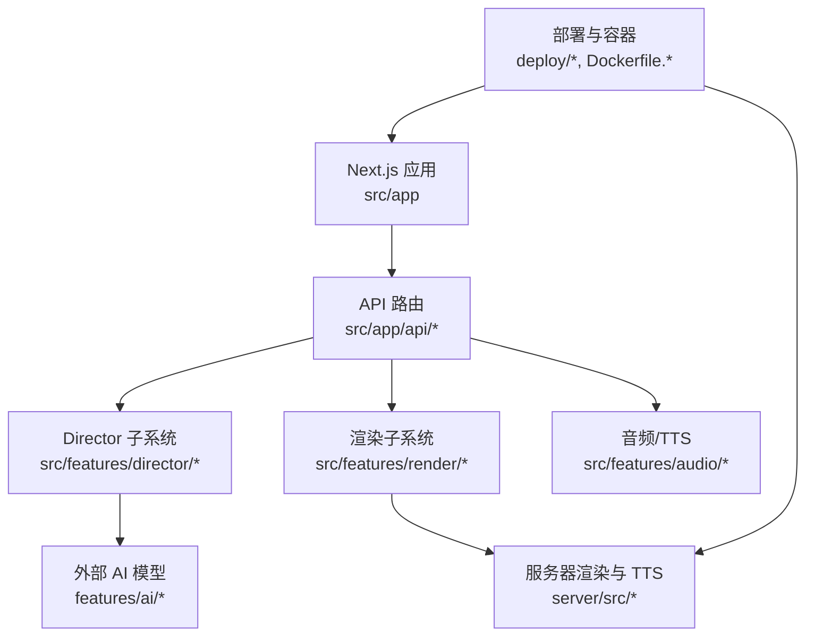
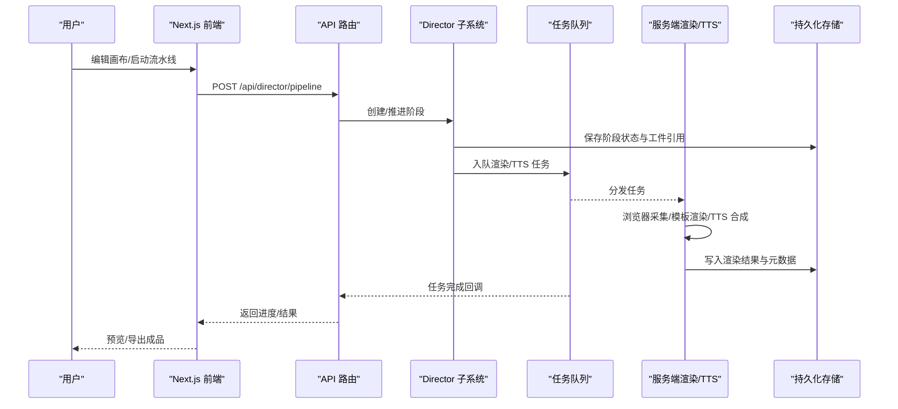
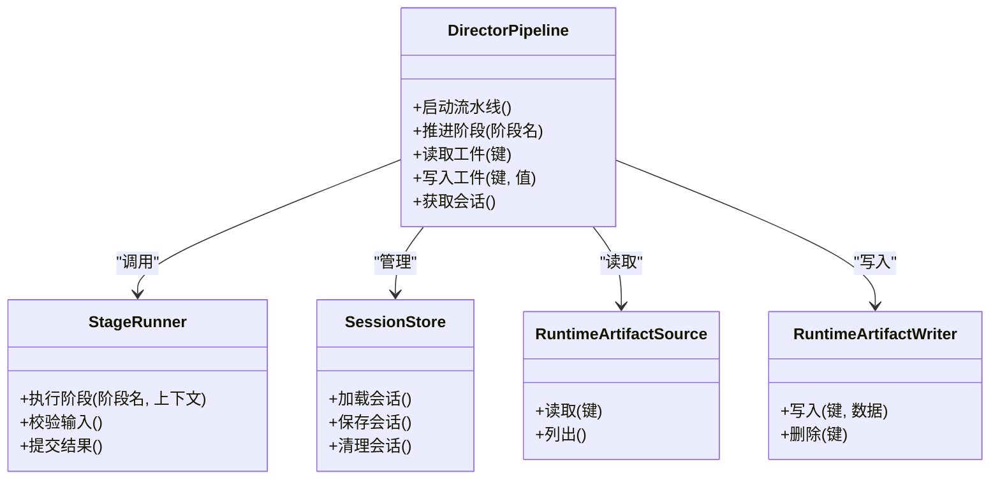
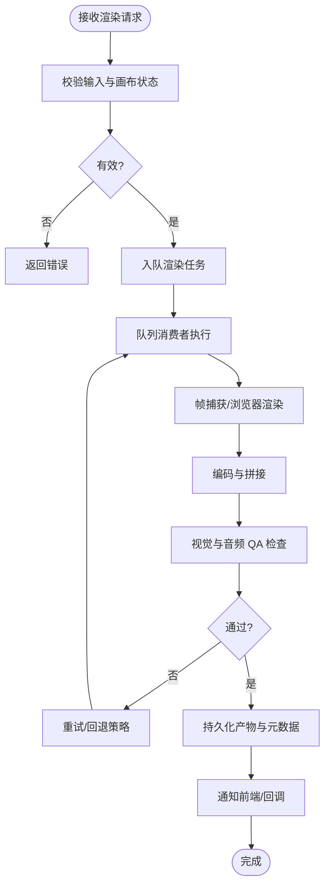
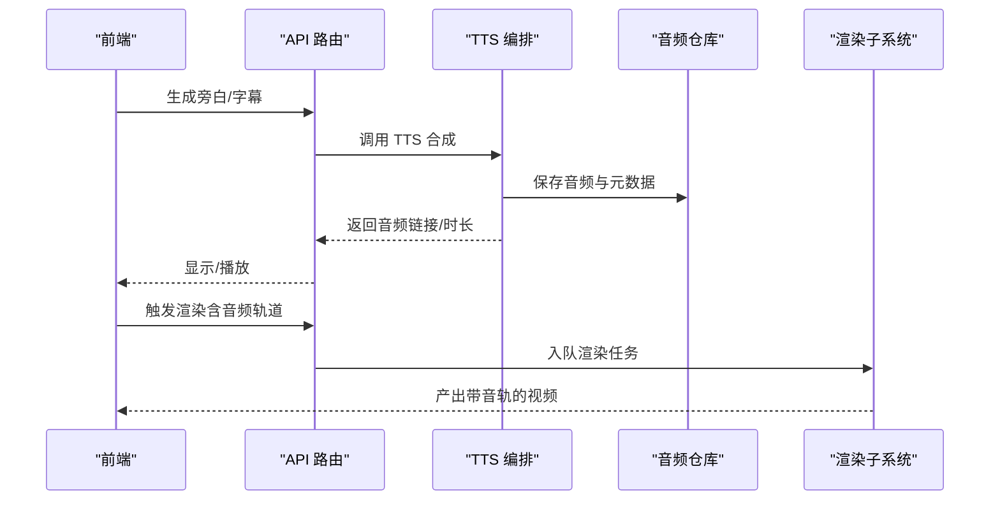
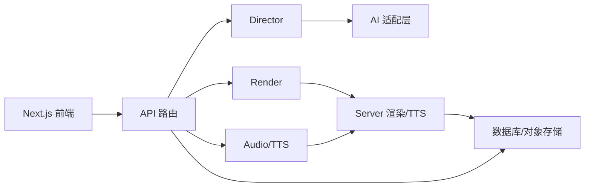

# 项目概述

<cite>
**本文引用的文件**   
- [package.json](file://package.json)
- [next.config.ts](file://next.config.ts)
- [src/app/layout.tsx](file://src/app/layout.tsx)
- [src/app/(marketing)/page.tsx](file://src/app/(marketing)/page.tsx)
- [src/app/products/(app)/layout.tsx](file://src/app/products/(app)/layout.tsx)
- [src/app/products/(app)/canvas/[projectId]/page.tsx](file://src/app/products/(app)/canvas/[projectId]/page.tsx)
- [src/app/api/director/pipeline/route.ts](file://src/app/api/director/pipeline/route.ts)
- [src/app/api/render/route.ts](file://src/app/api/render/route.ts)
- [src/features/director/index.ts](file://src/features/director/index.ts)
- [src/features/director/pipeline.ts](file://src/features/director/pipeline.ts)
- [src/features/render/renderer.ts](file://src/features/render/renderer.ts)
- [src/features/render/queue-handler.ts](file://src/features/render/queue-handler.ts)
- [src/features/audio/narration.ts](file://src/features/audio/narration.ts)
- [src/features/audio/repository.ts](file://src/features/audio/repository.ts)
- [server/src/index.ts](file://server/src/index.ts)
- [server/src/compose/run-pipeline.ts](file://server/src/compose/run-pipeline.ts)
- [server/src/tts/orchestrate.ts](file://server/src/tts/orchestrate.ts)
- [deploy/compose.yaml](file://deploy/compose.yaml)
- [Dockerfile.web](file://Dockerfile.web)
- [Dockerfile.worker](file://Dockerfile.worker)
</cite>

## 目录
1. [简介](#简介)
2. [项目结构](#项目结构)
3. [核心组件](#核心组件)
4. [架构总览](#架构总览)
5. [详细组件分析](#详细组件分析)
6. [依赖关系分析](#依赖关系分析)
7. [性能考量](#性能考量)
8. [故障排查指南](#故障排查指南)
9. [结论](#结论)
10. [附录：快速开始](#附录快速开始)

## 简介
PurpleInk 是一个基于 Next.js 构建的 AI 驱动视频制作与导演平台。它提供可视化工作流设计、自动化渲染管道与 TTS 语音合成能力，帮助创作者以“所见即所得”的方式编排镜头、生成旁白、自动合成并导出成片。平台采用前后端一体化（Next.js App Router）与可插拔 AI 模型路由的设计，支持多阶段流水线执行、队列化任务调度与持久化存储，便于在本地或云端快速部署与扩展。

核心价值
- 可视化工作流：通过画布节点编排镜头、转场、音频与导出等步骤，直观掌控制作流程。
- AI 导演与提示工程：内置导演子系统，结合 LLM 进行分镜规划、素材编排与质量校验。
- 自动化渲染：将画布状态转换为帧序列，调用编码与合成工具链输出视频。
- TTS 语音合成：文本到语音管线，支持多供应商与音色配置，自动生成旁白与字幕。
- 可扩展架构：模块化功能域（AI、渲染、音频、凭证、路由等），易于接入新模型与新服务。

设计理念
- 领域驱动与模块边界清晰：按功能域组织代码，降低耦合度。
- 事件与队列驱动：长耗时任务通过队列异步处理，提升吞吐与稳定性。
- 可观测性与可测试性：完善的日志、指标与单元测试/集成测试覆盖关键路径。
- 容器化与可移植：提供 Docker 镜像与 Compose 编排，简化部署。

## 项目结构
仓库采用 Next.js App Router 作为前端与 API 的统一入口，后端渲染与 TTS 能力由独立 server 子项目承载，并通过 API 与主应用交互。关键目录说明：
- src/app：页面、API 路由、布局与提供者（Auth、主题、导航等）。
- src/features：按领域划分的特性模块（AI、Director、Render、Audio、Canvas、Credentials、Routing 等）。
- server：渲染引擎、TTS 编排、浏览器采集、Compose 模板与运行器。
- deploy：容器编排与环境示例。
- scripts：数据库迁移、凭证初始化与验证脚本。
- tests：端到端与契约测试。

图表来源
- [next.config.ts](file://next.config.ts)
- [src/app/layout.tsx](file://src/app/layout.tsx)
- [src/app/api/director/pipeline/route.ts](file://src/app/api/director/pipeline/route.ts)
- [src/app/api/render/route.ts](file://src/app/api/render/route.ts)
- [server/src/index.ts](file://server/src/index.ts)
- [deploy/compose.yaml](file://deploy/compose.yaml)
- [Dockerfile.web](file://Dockerfile.web)
- [Dockerfile.worker](file://Dockerfile.worker)

章节来源
- [package.json](file://package.json)
- [next.config.ts](file://next.config.ts)
- [src/app/layout.tsx](file://src/app/layout.tsx)
- [src/app/(marketing)/page.tsx](file://src/app/(marketing)/page.tsx)
- [src/app/products/(app)/layout.tsx](file://src/app/products/(app)/layout.tsx)

## 核心组件
- 导演子系统（Director）：负责分镜计划、阶段推进、结果提交与工件读写，支撑 AI 驱动的自动化编排。
- 渲染子系统（Render）：将画布状态转换为帧序列，执行编码、拼接、缩略图生成与 QA 检查，并通过队列异步执行。
- 音频与 TTS：文本到语音合成、旁白管理、字幕生成与音频测量，支持多种供应商与配置。
- 画布与制品（Canvas & Artifacts）：画布状态、布局、导出设置与制品版本控制。
- 凭证与路由（Credentials & Routing）：安全存储第三方凭据，统一媒体与模型路由策略。
- 服务器端能力（Server）：浏览器采集、Compose 模板渲染、TTS 编排与作业运行器。

章节来源
- [src/features/director/index.ts](file://src/features/director/index.ts)
- [src/features/render/renderer.ts](file://src/features/render/renderer.ts)
- [src/features/audio/narration.ts](file://src/features/audio/narration.ts)
- [src/features/canvas/index.ts](file://src/features/canvas/index.ts)
- [src/features/credentials/index.ts](file://src/features/credentials/index.ts)
- [server/src/index.ts](file://server/src/index.ts)

## 架构总览
系统采用“前端 + API + 服务端渲染/TTS + 队列”的分层架构。用户通过 Next.js 界面操作画布，触发 Director 流水线；渲染与 TTS 任务进入队列，由 Worker 消费执行；最终产物通过 API 返回给前端展示与下载。

图表来源
- [src/app/api/director/pipeline/route.ts](file://src/app/api/director/pipeline/route.ts)
- [src/features/director/pipeline.ts](file://src/features/director/pipeline.ts)
- [src/app/api/render/route.ts](file://src/app/api/render/route.ts)
- [server/src/compose/run-pipeline.ts](file://server/src/compose/run-pipeline.ts)
- [server/src/tts/orchestrate.ts](file://server/src/tts/orchestrate.ts)

## 详细组件分析

### 导演子系统（Director）
职责
- 维护分镜计划与阶段状态机，驱动各阶段执行。
- 与 AI 适配器交互，生成/优化分镜与提示词。
- 管理工件读写与会话状态，确保阶段间数据一致性。

图表来源
- [src/features/director/pipeline.ts](file://src/features/director/pipeline.ts)
- [src/features/director/stage-runner.ts](file://src/features/director/stage-runner.ts)
- [src/features/director/session-store.ts](file://src/features/director/session-store.ts)
- [src/features/director/runtime-artifact-source.ts](file://src/features/director/runtime-artifact-source.ts)
- [src/features/director/runtime-artifact-writer.ts](file://src/features/director/runtime-artifact-writer.ts)

章节来源
- [src/features/director/index.ts](file://src/features/director/index.ts)
- [src/features/director/pipeline.ts](file://src/features/director/pipeline.ts)
- [src/features/director/stage-runner.ts](file://src/features/director/stage-runner.ts)
- [src/features/director/session-store.ts](file://src/features/director/session-store.ts)
- [src/features/director/runtime-artifact-source.ts](file://src/features/director/runtime-artifact-source.ts)
- [src/features/director/runtime-artifact-writer.ts](file://src/features/director/runtime-artifact-writer.ts)

### 渲染子系统（Render）
职责
- 将画布状态转换为帧序列，执行编码、拼接、缩略图生成与视觉 QA。
- 通过队列处理器协调并发与重试，保证高可用与可恢复。
- 提供导出服务与持久化存储接口。

图表来源
- [src/app/api/render/route.ts](file://src/app/api/render/route.ts)
- [src/features/render/renderer.ts](file://src/features/render/renderer.ts)
- [src/features/render/queue-handler.ts](file://src/features/render/queue-handler.ts)
- [src/features/render/frame-capture.ts](file://src/features/render/frame-capture.ts)
- [src/features/render/encode.ts](file://src/features/render/encode.ts)
- [src/features/render/vision-qa.ts](file://src/features/render/vision-qa.ts)

章节来源
- [src/app/api/render/route.ts](file://src/app/api/render/route.ts)
- [src/features/render/renderer.ts](file://src/features/render/renderer.ts)
- [src/features/render/queue-handler.ts](file://src/features/render/queue-handler.ts)
- [src/features/render/export-service.ts](file://src/features/render/export-service.ts)
- [src/features/render/cache.ts](file://src/features/render/cache.ts)

### 音频与 TTS
职责
- 文本到语音合成，支持多供应商与音色选择。
- 旁白管理与字幕生成，提供音频时长测量与对齐。
- 与渲染子系统协作，将音频轨道嵌入最终视频。

图表来源
- [src/app/api/render/route.ts](file://src/app/api/render/route.ts)
- [server/src/tts/orchestrate.ts](file://server/src/tts/orchestrate.ts)
- [src/features/audio/narration.ts](file://src/features/audio/narration.ts)
- [src/features/audio/repository.ts](file://src/features/audio/repository.ts)

章节来源
- [src/features/audio/narration.ts](file://src/features/audio/narration.ts)
- [src/features/audio/repository.ts](file://src/features/audio/repository.ts)
- [server/src/tts/orchestrate.ts](file://server/src/tts/orchestrate.ts)

### 画布与制品（Canvas & Artifacts）
职责
- 管理画布状态、布局与导出设置。
- 制品版本控制与变更追踪，保障可回溯与可复现。

章节来源
- [src/features/canvas/index.ts](file://src/features/canvas/index.ts)
- [src/features/canvas/layout.ts](file://src/features/canvas/layout.ts)
- [src/features/canvas/export-settings.ts](file://src/features/canvas/export-settings.ts)
- [src/features/artifacts/index.ts](file://src/features/artifacts/index.ts)
- [src/features/artifacts/commit.ts](file://src/features/artifacts/commit.ts)

### 服务器端能力（Server）
职责
- 浏览器采集与截图，用于预览与 QA。
- Compose 模板渲染与运行器，驱动多阶段流水线。
- TTS 编排与媒体处理，配合渲染子系统完成音视频合成。

章节来源
- [server/src/index.ts](file://server/src/index.ts)
- [server/src/compose/run-pipeline.ts](file://server/src/compose/run-pipeline.ts)
- [server/src/capture/browser-driver.ts](file://server/src/capture/browser-driver.ts)
- [server/src/tts/orchestrate.ts](file://server/src/tts/orchestrate.ts)

## 依赖关系分析
- 前端与 API：Next.js App Router 统一管理页面与 API，减少跨进程通信复杂度。
- 特性模块：Director、Render、Audio、Canvas、Credentials、Routing 等模块内聚且低耦合，通过明确接口交互。
- 服务器端：独立的渲染与 TTS 服务，通过 API 与队列与主应用解耦，便于水平扩展。
- 部署：Docker 与 Compose 提供一键部署能力，Web 与 Worker 分离，利于资源隔离与弹性伸缩。

图表来源
- [src/app/api/director/pipeline/route.ts](file://src/app/api/director/pipeline/route.ts)
- [src/app/api/render/route.ts](file://src/app/api/render/route.ts)
- [src/features/director/index.ts](file://src/features/director/index.ts)
- [src/features/render/renderer.ts](file://src/features/render/renderer.ts)
- [src/features/audio/narration.ts](file://src/features/audio/narration.ts)
- [server/src/index.ts](file://server/src/index.ts)

章节来源
- [src/app/api/director/pipeline/route.ts](file://src/app/api/director/pipeline/route.ts)
- [src/app/api/render/route.ts](file://src/app/api/render/route.ts)
- [server/src/index.ts](file://server/src/index.ts)

## 性能考量
- 队列与并发：渲染与 TTS 任务通过队列处理，支持并发限制与重试策略，避免阻塞主线程。
- 缓存与复用：渲染中间结果与制品缓存，减少重复计算与网络开销。
- 资源隔离：Web 与 Worker 分离，按需扩容，提高吞吐与稳定性。
- 可观测性：完善日志与指标，便于定位瓶颈与容量规划。

[本节为通用指导，不直接分析具体文件]

## 故障排查指南
常见问题与建议
- 流水线卡住：检查 Director 阶段状态与工件完整性，确认队列是否积压。
- 渲染失败：查看帧捕获与编码日志，确认输入画布与依赖资源有效性。
- TTS 异常：核对供应商凭据与配额，检查文本长度与格式。
- 权限与认证：确认登录态与 API 访问令牌是否正确传递。

章节来源
- [src/features/director/stage-result.ts](file://src/features/director/stage-result.ts)
- [src/features/render/queue-handler.ts](file://src/features/render/queue-handler.ts)
- [server/src/lib/logger.ts](file://server/src/lib/logger.ts)

## 结论
PurpleInk 以 Next.js 为核心，构建了从可视化工作流到自动化渲染与 TTS 的一体化视频制作平台。其清晰的领域划分、可插拔 AI 路由与队列化任务调度，使其具备高扩展性与易部署性。通过本概述，新用户可快速理解平台价值与使用方式，并在实际项目中高效落地。

[本节为总结性内容，不直接分析具体文件]

## 附录：快速开始
目标
- 在本地或云端快速启动 PurpleInk，体验可视化工作流与 AI 导演的核心能力。

前置条件
- Node.js 与包管理器（pnpm）
- Docker 与 Docker Compose（可选，用于完整部署）
- 必要的第三方凭据（如 AI 模型、TTS 供应商）

步骤
1. 克隆仓库并安装依赖
   - 在项目根目录执行包管理器安装命令，确保依赖就绪。
2. 配置环境变量
   - 复制示例环境文件，填写必要凭据（AI、TTS、存储等）。
3. 启动服务
   - 使用 Docker Compose 启动 Web 与 Worker，或分别启动 Next.js 与 Server。
4. 访问应用
   - 打开浏览器访问本地地址，注册/登录账号。
5. 创建项目与画布
   - 新建项目，进入画布编辑器，拖拽节点编排镜头、音频与导出。
6. 启动流水线
   - 点击“运行”，观察阶段推进与实时日志，等待成品输出。
7. 导出与分享
   - 在导出页面预览与下载成品，或通过分享链接分享给他人。

章节来源
- [deploy/compose.yaml](file://deploy/compose.yaml)
- [Dockerfile.web](file://Dockerfile.web)
- [Dockerfile.worker](file://Dockerfile.worker)
- [src/app/(marketing)/page.tsx](file://src/app/(marketing)/page.tsx)
- [src/app/products/(app)/canvas/[projectId]/page.tsx](file://src/app/products/(app)/canvas/[projectId]/page.tsx)