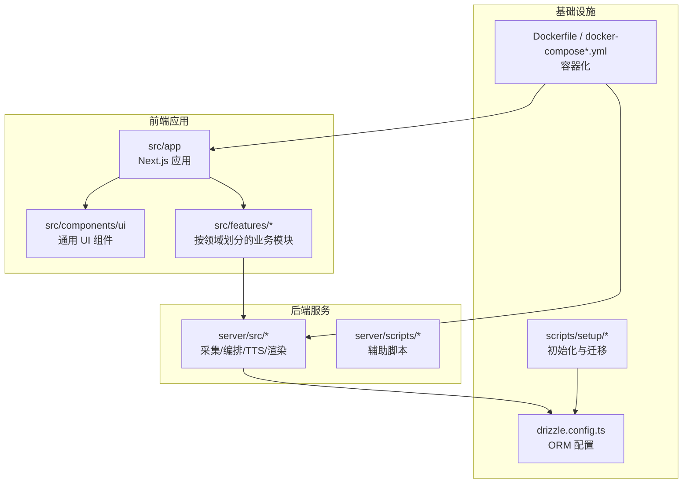
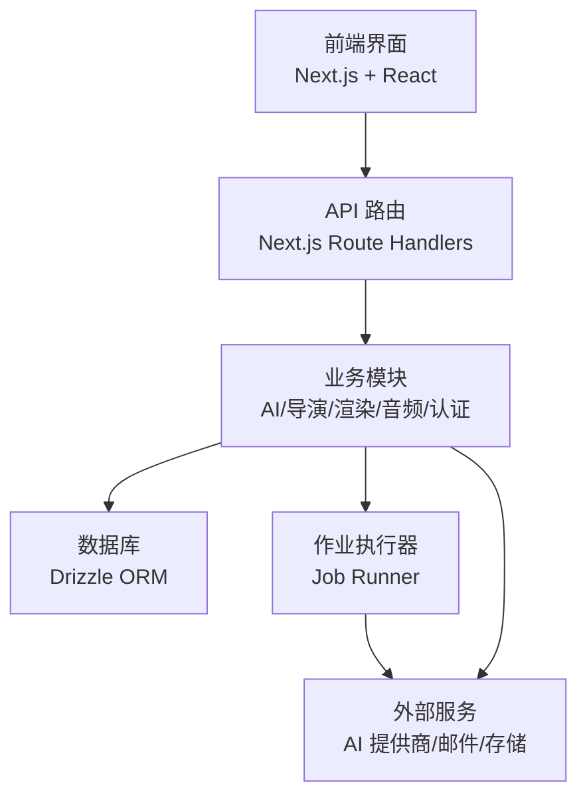
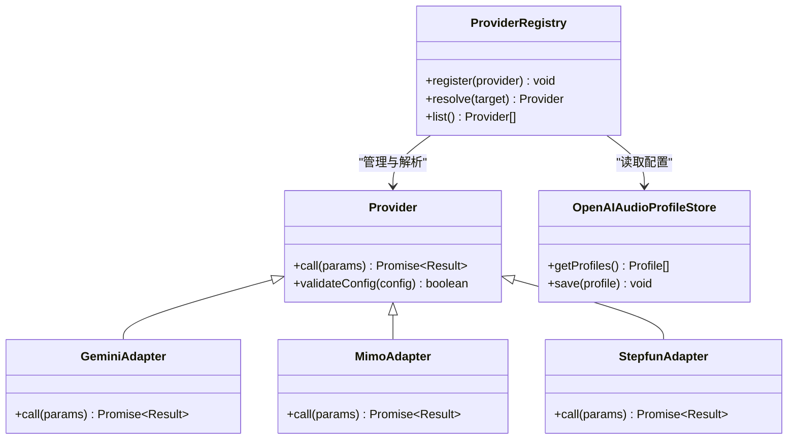
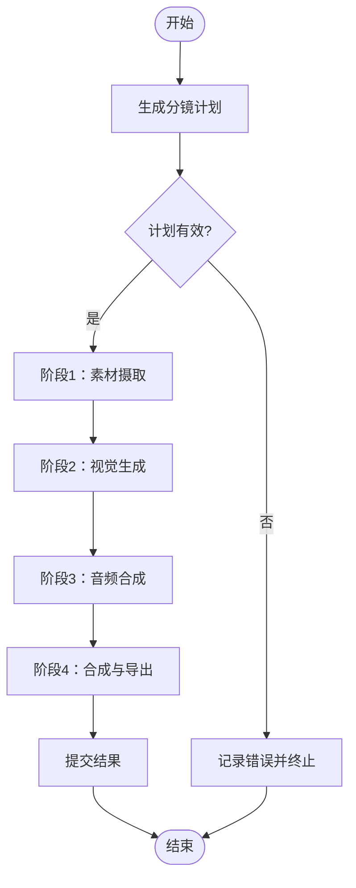
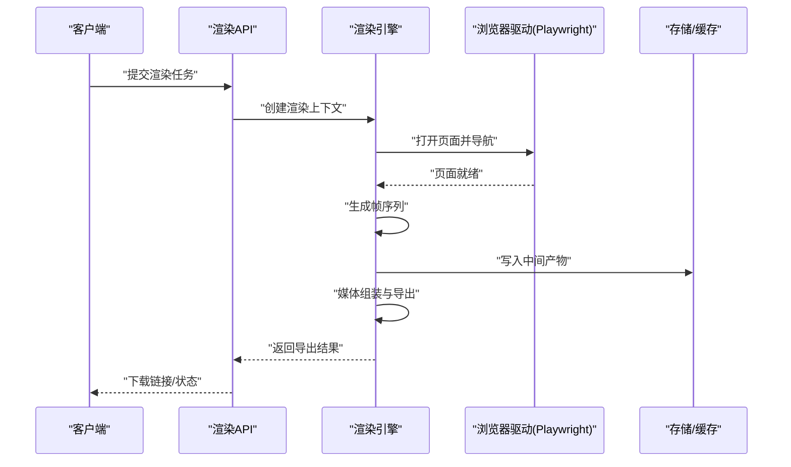
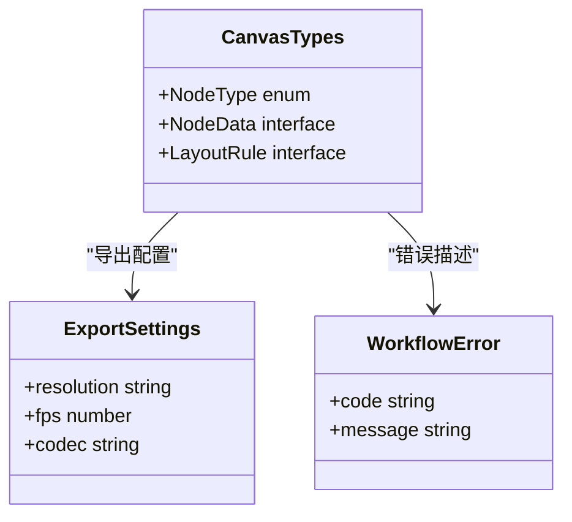
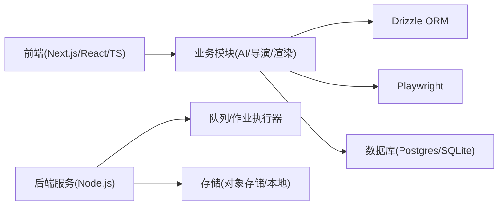

# 项目概述

<cite>
**本文档引用的文件**   
- [package.json](file://package.json)
- [next.config.ts](file://next.config.ts)
- [drizzle.config.ts](file://drizzle.config.ts)
- [tsconfig.json](file://tsconfig.json)
- [vitest.config.ts](file://vitest.config.ts)
- [docker-compose.dev.yml](file://docker-compose.dev.yml)
- [docker-compose.prod.yml](file://docker-compose.prod.yml)
- [Dockerfile](file://Dockerfile)
- [src/app/layout.tsx](file://src/app/layout.tsx)
- [src/app/providers.tsx](file://src/app/providers.tsx)
- [src/app/products/(app)/layout.tsx](file://src/app/products/(app)/layout.tsx)
- [src/features/ai/provider-registry.ts](file://src/features/ai/provider-registry.ts)
- [src/features/director/pipeline.ts](file://src/features/director/pipeline.ts)
- [src/features/render/renderer.ts](file://src/features/render/renderer.ts)
- [src/features/canvas/types.ts](file://src/features/canvas/types.ts)
- [src/lib/db/index.ts](file://src/lib/db/index.ts)
- [server/src/index.ts](file://server/src/index.ts)
- [server/src/server/job-runner.ts](file://server/src/server/job-runner.ts)
- [scripts/setup/db-migrate.ts](file://scripts/setup/db-migrate.ts)
- [scripts/dev/start-dev.cmd](file://scripts/dev/start-dev.cmd)
- [scripts/dev/start-dev.ps1](file://scripts/dev/start-dev.ps1)
</cite>

## 目录
1. [简介](#简介)
2. [项目结构](#项目结构)
3. [核心组件](#核心组件)
4. [架构总览](#架构总览)
5. [详细组件分析](#详细组件分析)
6. [依赖关系分析](#依赖关系分析)
7. [性能考量](#性能考量)
8. [故障排查指南](#故障排查指南)
9. [结论](#结论)
10. [附录：快速开始](#附录快速开始)

## 简介
PurpleInk AI 视频制作平台是一个基于 Next.js 构建的全栈 AI 驱动的视频创作与渲染平台。它支持多 AI 提供商集成、可视化画布编辑、自动化渲染管道，以及面向生产环境的部署与运维能力。平台采用模块化设计、Provider 模式与事件驱动架构，结合 TypeScript、Drizzle ORM、Playwright 等关键技术，提供从脚本到成片的一体化工作流。

## 项目结构
仓库采用前后端一体化与独立服务并存的混合结构：
- 前端应用位于 src/app，使用 Next.js App Router 组织页面与路由，UI 组件集中在 src/components/ui，业务功能按领域划分在 src/features。
- 服务端渲染与后台任务由 server 子模块承担，包含采集、编排、TTS、渲染等子系统。
- 数据库与迁移通过 Drizzle ORM 管理，配置与脚本位于根目录与 scripts 目录。
- 容器化与开发环境通过 Docker Compose 与脚本统一管理。

图表来源
- [next.config.ts:1-200](file://next.config.ts#L1-L200)
- [src/app/layout.tsx:1-200](file://src/app/layout.tsx#L1-L200)
- [server/src/index.ts:1-200](file://server/src/index.ts#L1-L200)
- [drizzle.config.ts:1-200](file://drizzle.config.ts#L1-L200)
- [Dockerfile:1-200](file://Dockerfile#L1-L200)
- [docker-compose.dev.yml:1-200](file://docker-compose.dev.yml#L1-L200)
- [docker-compose.prod.yml:1-200](file://docker-compose.prod.yml#L1-L200)

章节来源
- [package.json:1-200](file://package.json#L1-L200)
- [next.config.ts:1-200](file://next.config.ts#L1-L200)
- [tsconfig.json:1-200](file://tsconfig.json#L1-L200)
- [vitest.config.ts:1-200](file://vitest.config.ts#L1-L200)
- [docker-compose.dev.yml:1-200](file://docker-compose.dev.yml#L1-L200)
- [docker-compose.prod.yml:1-200](file://docker-compose.prod.yml#L1-L200)
- [Dockerfile:1-200](file://Dockerfile#L1-L200)

## 核心组件
- 应用壳与提供者：Next.js 应用入口与全局 Provider 负责主题、国际化、状态管理等横切关注点。
- AI 提供商注册表：统一抽象不同 AI 模型与 TTS 提供商，实现可插拔的 Provider 模式。
- 导演编排器：将分镜、素材、提示词与工具调用编排为可执行的流水线，支持阶段推进与结果提交。
- 渲染引擎：基于 Playwright 进行页面捕获、帧序列生成、媒体组装与导出。
- 数据库访问层：通过 Drizzle ORM 定义数据模型与查询，支撑项目、工件、渲染产物等持久化。

章节来源
- [src/app/layout.tsx:1-200](file://src/app/layout.tsx#L1-L200)
- [src/app/providers.tsx:1-200](file://src/app/providers.tsx#L1-L200)
- [src/features/ai/provider-registry.ts:1-200](file://src/features/ai/provider-registry.ts#L1-L200)
- [src/features/director/pipeline.ts:1-200](file://src/features/director/pipeline.ts#L1-L200)
- [src/features/render/renderer.ts:1-200](file://src/features/render/renderer.ts#L1-L200)
- [src/lib/db/index.ts:1-200](file://src/lib/db/index.ts#L1-L200)

## 架构总览
平台采用分层与模块化结合的架构：
- 表现层：Next.js 页面与组件，提供可视化画布与设置面板。
- 业务层：AI 提供商、导演编排、渲染管线、音频处理、认证与权限等。
- 数据层：Drizzle ORM 与数据库，存储项目、工件、会话、凭证等。
- 基础设施层：容器化、反向代理、队列与作业执行器。

图表来源
- [src/app/layout.tsx:1-200](file://src/app/layout.tsx#L1-L200)
- [src/app/products/(app)/layout.tsx:1-200](file://src/app/products/(app)/layout.tsx#L1-L200)
- [src/features/ai/provider-registry.ts:1-200](file://src/features/ai/provider-registry.ts#L1-L200)
- [src/features/director/pipeline.ts:1-200](file://src/features/director/pipeline.ts#L1-L200)
- [src/features/render/renderer.ts:1-200](file://src/features/render/renderer.ts#L1-L200)
- [server/src/server/job-runner.ts:1-200](file://server/src/server/job-runner.ts#L1-L200)
- [drizzle.config.ts:1-200](file://drizzle.config.ts#L1-L200)

## 详细组件分析

### AI 提供商注册表（Provider 模式）
- 目标：统一抽象多种 AI 提供商（如 OpenAI 兼容、Gemini、Mimo、Stepfun），通过注册表动态选择与调用。
- 关键点：
  - 统一的 Provider 接口与配置契约，确保可扩展性与一致性。
  - 配置校验与默认值注入，保障运行时安全。
  - 错误映射与重试策略，提升鲁棒性。

图表来源
- [src/features/ai/provider-registry.ts:1-200](file://src/features/ai/provider-registry.ts#L1-L200)
- [src/features/ai/gemini-adapter.ts:1-200](file://src/features/ai/gemini-adapter.ts#L1-L200)
- [src/features/ai/mimo-adapter.ts:1-200](file://src/features/ai/mimo-adapter.ts#L1-L200)
- [src/features/ai/stepfun-adapter.ts:1-200](file://src/features/ai/stepfun-adapter.ts#L1-L200)
- [src/features/ai/openai-compatible-audio-profile-store.ts:1-200](file://src/features/ai/openai-compatible-audio-profile-store.ts#L1-L200)

章节来源
- [src/features/ai/provider-registry.ts:1-200](file://src/features/ai/provider-registry.ts#L1-L200)
- [src/features/ai/config.ts:1-200](file://src/features/ai/config.ts#L1-L200)
- [src/features/ai/model-routing.ts:1-200](file://src/features/ai/model-routing.ts#L1-L200)

### 导演编排器（Pipeline）
- 目标：将分镜计划、提示词、工具调用与阶段推进整合为可执行的流水线，支持断点恢复与结果提交。
- 关键点：
  - 阶段定义与状态机推进，保证流程确定性。
  - 工件读写与校验，确保中间产物一致。
  - 错误恢复与回滚策略，提高容错能力。

图表来源
- [src/features/director/pipeline.ts:1-200](file://src/features/director/pipeline.ts#L1-L200)
- [src/features/director/stage-runner.ts:1-200](file://src/features/director/stage-runner.ts#L1-L200)
- [src/features/director/runtime-repository.ts:1-200](file://src/features/director/runtime-repository.ts#L1-L200)

章节来源
- [src/features/director/pipeline.ts:1-200](file://src/features/director/pipeline.ts#L1-L200)
- [src/features/director/advance.ts:1-200](file://src/features/director/advance.ts#L1-L200)
- [src/features/director/stage-result.ts:1-200](file://src/features/director/stage-result.ts#L1-L200)

### 渲染引擎（Renderer）
- 目标：基于 Playwright 进行页面捕获、帧序列生成、媒体组装与导出，支持缩略图与 QA 检查。
- 关键点：
  - 浏览器驱动与抓取策略，确保稳定输出。
  - 帧序列与时间线对齐，保证音视频同步。
  - 缓存与并发控制，提升吞吐与稳定性。

图表来源
- [src/features/render/renderer.ts:1-200](file://src/features/render/renderer.ts#L1-L200)
- [src/features/render/frame-capture.ts:1-200](file://src/features/render/frame-capture.ts#L1-L200)
- [src/features/render/media-assembly.ts:1-200](file://src/features/render/media-assembly.ts#L1-L200)
- [src/features/render/cache.ts:1-200](file://src/features/render/cache.ts#L1-L200)

章节来源
- [src/features/render/renderer.ts:1-200](file://src/features/render/renderer.ts#L1-L200)
- [src/features/render/export-service.ts:1-200](file://src/features/render/export-service.ts#L1-L200)
- [src/features/render/queue-handler.ts:1-200](file://src/features/render/queue-handler.ts#L1-L200)

### 可视化画布（Canvas）
- 目标：提供可视化画布编辑能力，包括节点类型、布局、状态与导出设置。
- 关键点：
  - 节点类型与数据结构定义，支持扩展。
  - 布局算法与交互逻辑，提升用户体验。
  - 导出设置与兼容性检查，确保输出质量。

图表来源
- [src/features/canvas/types.ts:1-200](file://src/features/canvas/types.ts#L1-L200)
- [src/features/canvas/export-settings.ts:1-200](file://src/features/canvas/export-settings.ts#L1-L200)
- [src/features/canvas/workflow-error.ts:1-200](file://src/features/canvas/workflow-error.ts#L1-L200)

章节来源
- [src/features/canvas/types.ts:1-200](file://src/features/canvas/types.ts#L1-L200)
- [src/features/canvas/layout.ts:1-200](file://src/features/canvas/layout.ts#L1-L200)
- [src/features/canvas/status.ts:1-200](file://src/features/canvas/status.ts#L1-L200)

### 数据库与迁移（Drizzle ORM）
- 目标：通过 Drizzle ORM 定义数据模型与查询，支撑项目、工件、会话、凭证等持久化。
- 关键点：
  - 迁移脚本与环境隔离，确保版本一致性。
  - 连接池与事务管理，提升可靠性。
  - 种子数据与初始化脚本，简化部署。

章节来源
- [drizzle.config.ts:1-200](file://drizzle.config.ts#L1-L200)
- [scripts/setup/db-migrate.ts:1-200](file://scripts/setup/db-migrate.ts#L1-L200)
- [src/lib/db/index.ts:1-200](file://src/lib/db/index.ts#L1-L200)

### 作业执行器（Job Runner）
- 目标：异步执行渲染、导出、TTS 等耗时任务，支持队列与重试。
- 关键点：
  - 任务调度与优先级，避免资源争用。
  - 失败重试与死信队列，提升可用性。
  - 监控与日志，便于问题定位。

章节来源
- [server/src/server/job-runner.ts:1-200](file://server/src/server/job-runner.ts#L1-L200)
- [server/src/server/job-store.ts:1-200](file://server/src/server/job-store.ts#L1-L200)

## 依赖关系分析
- 前端依赖 Next.js、React、TypeScript，组件库与样式框架用于快速构建 UI。
- 业务模块依赖 AI 提供商 SDK、Drizzle ORM、Playwright 等第三方库。
- 后端服务依赖 Node.js 运行时、数据库驱动、消息队列与存储服务。
- 容器化依赖 Docker 与反向代理配置，确保跨环境一致性。

图表来源
- [package.json:1-200](file://package.json#L1-L200)
- [tsconfig.json:1-200](file://tsconfig.json#L1-L200)
- [drizzle.config.ts:1-200](file://drizzle.config.ts#L1-L200)

章节来源
- [package.json:1-200](file://package.json#L1-L200)
- [tsconfig.json:1-200](file://tsconfig.json#L1-L200)
- [vitest.config.ts:1-200](file://vitest.config.ts#L1-L200)

## 性能考量
- 渲染并发与缓存：通过帧缓存与媒体组装优化，减少重复计算与 I/O。
- 队列与限流：作业执行器限制并发度，避免资源耗尽。
- 数据库连接池：合理配置连接数与超时，提升查询效率。
- 浏览器实例复用：Playwright 实例池降低启动开销。

[本节为通用指导，不直接分析具体文件]

## 故障排查指南
- 常见问题：
  - AI 提供商调用失败：检查配置与密钥，查看错误映射与重试日志。
  - 渲染失败：确认页面加载与元素可见性，检查帧序列与时间线对齐。
  - 数据库连接异常：验证连接字符串与权限，检查迁移状态。
- 调试建议：
  - 启用详细日志与追踪，定位调用链与状态变化。
  - 使用测试用例与快照对比，验证行为一致性。
  - 利用容器化环境复现问题，确保环境一致性。

章节来源
- [server/src/server/job-runner.ts:1-200](file://server/src/server/job-runner.ts#L1-L200)
- [src/features/render/renderer.ts:1-200](file://src/features/render/renderer.ts#L1-L200)
- [src/features/ai/provider-registry.ts:1-200](file://src/features/ai/provider-registry.ts#L1-L200)

## 结论
PurpleInk AI 视频制作平台以 Next.js 为核心，结合 Provider 模式与事件驱动架构，实现了多 AI 提供商集成、可视化画布编辑与自动化渲染管道。通过模块化设计与完善的工程化实践，平台具备良好的可扩展性与可维护性，适合快速迭代与规模化部署。

[本节为总结性内容，不直接分析具体文件]

## 附录：快速开始
- 前置条件：
  - 安装 Node.js、pnpm、Docker。
  - 准备数据库与外部服务凭据（AI 提供商、邮件、存储）。
- 启动开发环境：
  - 复制环境变量模板并填写必要配置。
  - 运行数据库迁移与种子数据。
  - 启动前端与后端服务。
- 验证安装：
  - 访问本地地址，确认登录与画布加载正常。
  - 执行一次简单渲染任务，检查导出结果。

章节来源
- [scripts/dev/start-dev.cmd:1-200](file://scripts/dev/start-dev.cmd#L1-L200)
- [scripts/dev/start-dev.ps1:1-200](file://scripts/dev/start-dev.ps1#L1-L200)
- [scripts/setup/db-migrate.ts:1-200](file://scripts/setup/db-migrate.ts#L1-L200)
- [docker-compose.dev.yml:1-200](file://docker-compose.dev.yml#L1-L200)
- [Dockerfile:1-200](file://Dockerfile#L1-L200)