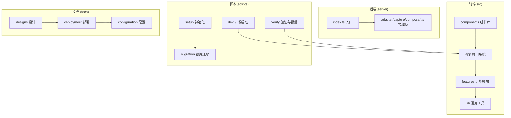
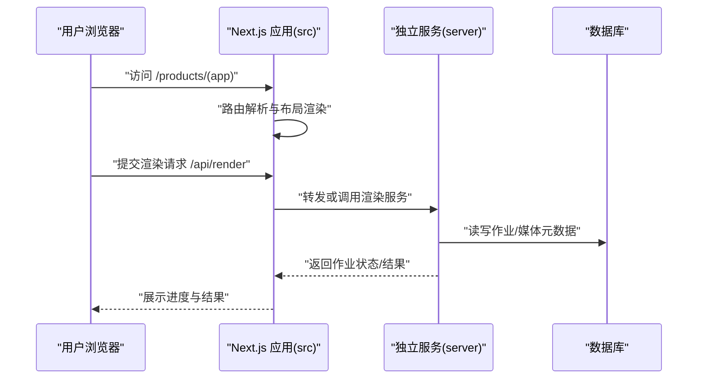
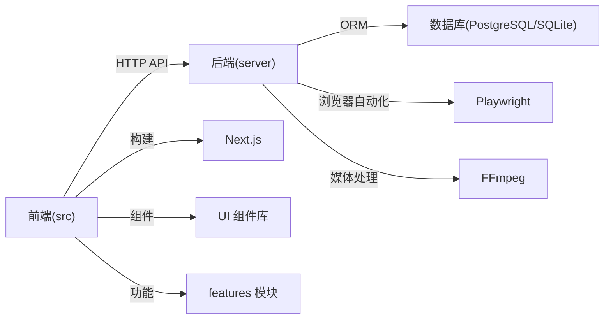

# 项目结构

<cite>
**本文引用的文件**   
- [next.config.ts](file://next.config.ts)
- [tsconfig.json](file://tsconfig.json)
- [drizzle.config.ts](file://drizzle.config.ts)
- [vitest.config.ts](file://vitest.config.ts)
- [vitest.pg.config.ts](file://vitest.pg.config.ts)
- [package.json](file://package.json)
- [Dockerfile](file://Dockerfile)
- [docker-compose.dev.yml](file://docker-compose.dev.yml)
- [docker-compose.prod.yml](file://docker-compose.prod.yml)
- [.dockerignore](file://.dockerignore)
- [src/app/layout.tsx](file://src/app/layout.tsx)
- [src/app/providers.tsx](file://src/app/providers.tsx)
- [src/app/README.md](file://src/app/README.md)
- [src/app/api/ping/route.ts](file://src/app/api/ping/route.ts)
- [src/app/api/auth/login/route.ts](file://src/app/api/auth/login/route.ts)
- [src/app/api/projects/route.ts](file://src/app/api/projects/route.ts)
- [src/app/api/render/route.ts](file://src/app/api/render/route.ts)
- [src/app/products/(app)/layout.tsx](file://src/app/products/(app)/layout.tsx)
- [src/components/ui/button.tsx](file://src/components/ui/button.tsx)
- [src/features/auth/index.ts](file://src/features/auth/index.ts)
- [src/features/director/index.ts](file://src/features/director/index.ts)
- [src/features/render/index.ts](file://src/features/render/index.ts)
- [src/lib/config/site-config.ts](file://src/lib/config/site-config.ts)
- [server/src/index.ts](file://server/src/index.ts)
- [server/package.json](file://server/package.json)
- [server/tsconfig.json](file://server/tsconfig.json)
- [server/Dockerfile](file://server/Dockerfile)
- [scripts/setup/db-migrate.ts](file://scripts/setup/db-migrate.ts)
- [scripts/setup/bootstrap-credentials.ts](file://scripts/setup/bootstrap-credentials.ts)
- [scripts/migration/export-sqlite.ts](file://scripts/migration/export-sqlite.ts)
- [scripts/migration/import-postgres.ts](file://scripts/migration/import-postgres.ts)
- [scripts/dev/start-dev.cmd](file://scripts/dev/start-dev.cmd)
- [scripts/dev/start-dev.ps1](file://scripts/dev/start-dev.ps1)
- [scripts/verify/e2e-smoke.ts](file://scripts/verify/e2e-smoke.ts)
- [docs/deployment/runbook.md](file://docs/deployment/runbook.md)
- [docs/configuration/credentials.md](file://docs/configuration/credentials.md)
- [docs/designs/README.md](file://docs/designs/README.md)
</cite>

## 目录
1. [简介](#简介)
2. [项目结构总览](#项目结构总览)
3. [核心组件与职责](#核心组件与职责)
4. [架构总览](#架构总览)
5. [详细目录分析](#详细目录分析)
6. [依赖关系分析](#依赖关系分析)
7. [性能与可维护性建议](#性能与可维护性建议)
8. [故障排查指南](#故障排查指南)
9. [结论](#结论)
10. [附录：命名约定与最佳实践](#附录命名约定与最佳实践)

## 简介
本文件为 PurpleInk 项目的“项目结构”说明，面向开发者快速理解代码组织、模块边界与运行方式。内容覆盖：
- src 目录的组织方式（路由系统、组件库、功能模块）
- server 独立服务器架构（API 路由、作业处理器、媒体服务）
- scripts 开发与运维脚本（数据库迁移、环境初始化、测试）
- docs 文档组织结构（设计、部署、配置等）
- 配置文件位置与作用（Next.js、TypeScript、Docker 等）

## 项目结构总览
PurpleInk 采用前后端分离的仓库结构：
- 前端应用位于 src 目录，基于 Next.js App Router，按路由分组与功能域划分
- 服务端逻辑位于 server 目录，提供独立的 Node.js 服务，负责渲染、采集、TTS 编排等
- scripts 目录集中管理与开发、部署、迁移相关的脚本
- docs 目录沉淀设计与运维文档
- 根级配置文件管理构建、类型检查、测试与容器化

图表来源
- [src/app/layout.tsx:1-200](file://src/app/layout.tsx#L1-L200)
- [src/app/providers.tsx:1-200](file://src/app/providers.tsx#L1-L200)
- [server/src/index.ts:1-200](file://server/src/index.ts#L1-L200)
- [scripts/setup/db-migrate.ts:1-200](file://scripts/setup/db-migrate.ts#L1-L200)
- [scripts/migration/export-sqlite.ts:1-200](file://scripts/migration/export-sqlite.ts#L1-L200)
- [scripts/dev/start-dev.cmd:1-200](file://scripts/dev/start-dev.cmd#L1-L200)
- [scripts/verify/e2e-smoke.ts:1-200](file://scripts/verify/e2e-smoke.ts#L1-L200)
- [docs/deployment/runbook.md:1-200](file://docs/deployment/runbook.md#L1-L200)
- [docs/configuration/credentials.md:1-200](file://docs/configuration/credentials.md#L1-L200)
- [docs/designs/README.md:1-200](file://docs/designs/README.md#L1-L200)

章节来源
- [package.json:1-200](file://package.json#L1-L200)
- [next.config.ts:1-200](file://next.config.ts#L1-L200)
- [tsconfig.json:1-200](file://tsconfig.json#L1-L200)
- [Dockerfile:1-200](file://Dockerfile#L1-L200)
- [docker-compose.dev.yml:1-200](file://docker-compose.dev.yml#L1-L200)
- [docker-compose.prod.yml:1-200](file://docker-compose.prod.yml#L1-L200)

## 核心组件与职责
- 前端 app 路由系统：基于 Next.js App Router，使用 (auth)、(marketing)、(public)、products/(app) 等路由组组织页面与布局；API 路由集中在 app/api 下，按领域划分如 auth、projects、render、jobs、director、artifacts、settings 等
- 组件库 components：UI 原子组件与业务组件分层，ui 子目录包含按钮、对话框、侧边栏、进度条等基础组件；marketing 与 icons 分别承载营销页与图标资源
- 功能模块 features：按业务域拆分，如 ai、artifacts、audio、auth、canvas、credentials、dashboard、director、navigation、projects、render、routing 等，每个模块内包含类型定义、服务实现、适配器与测试
- 通用库 lib：存放跨模块的工具与配置，如 site-config、theme-mode、api 封装、队列、存储、流处理、工作流等
- 后端 server：独立 Node.js 服务，入口 index.ts 加载并暴露 API；内部包含 adapter、capture、compose、tts、lib、server 等模块，负责浏览器采集、合成编排、TTS 生成与媒体处理

章节来源
- [src/app/README.md:1-200](file://src/app/README.md#L1-L200)
- [src/app/api/ping/route.ts:1-200](file://src/app/api/ping/route.ts#L1-L200)
- [src/app/api/auth/login/route.ts:1-200](file://src/app/api/auth/login/route.ts#L1-L200)
- [src/app/api/projects/route.ts:1-200](file://src/app/api/projects/route.ts#L1-L200)
- [src/app/api/render/route.ts:1-200](file://src/app/api/render/route.ts#L1-L200)
- [src/app/products/(app)/layout.tsx:1-200](file://src/app/products/(app)/layout.tsx#L1-L200)
- [src/components/ui/button.tsx:1-200](file://src/components/ui/button.tsx#L1-L200)
- [src/features/auth/index.ts:1-200](file://src/features/auth/index.ts#L1-L200)
- [src/features/director/index.ts:1-200](file://src/features/director/index.ts#L1-L200)
- [src/features/render/index.ts:1-200](file://src/features/render/index.ts#L1-L200)
- [src/lib/config/site-config.ts:1-200](file://src/lib/config/site-config.ts#L1-L200)
- [server/src/index.ts:1-200](file://server/src/index.ts#L1-L200)

## 架构总览
PurpleInk 的前后端通过 HTTP API 交互，前端负责页面渲染与用户交互，后端承担重任务（渲染、采集、TTS）。

图表来源
- [src/app/api/render/route.ts:1-200](file://src/app/api/render/route.ts#L1-L200)
- [server/src/index.ts:1-200](file://server/src/index.ts#L1-L200)

## 详细目录分析

### src 目录：前端应用
- app 路由系统
  - 路由组：(auth) 登录注册与密码重置；(marketing) 营销首页；(public) 公开页面；products/(app) 产品主应用
  - API 路由：/api 下按领域划分，如 auth、projects、render、jobs、director、artifacts、settings、ping 等
  - 全局布局与提供者：layout.tsx、providers.tsx、global-error.tsx、not-found.tsx
- components 组件库
  - ui：基础 UI 组件（按钮、卡片、对话框、侧边栏、进度条、搜索框等），每个组件通常配套 demo 与测试
  - marketing：营销页组件（头部、英雄区、定价、案例、轮播等）
  - icons：Logo 与图标组件
- features 功能模块
  - 按业务域拆分，每个模块包含类型、服务、适配器、校验与测试，例如：
    - ai：模型适配与路由、提供商设置与凭据
    - artifacts：制品提交与预览模式
    - audio：音频格式、测量、字幕、TTS 客户端与队列
    - auth：账户、会话、验证码、邮件、限流与错误
    - canvas：画布动作、布局、导出设置与工作流错误
    - credentials：凭据信封与持久化
    - director：导演流程、阶段执行、队列、恢复、产物读写
    - navigation：应用壳、侧边栏、路由上下文
    - projects：项目兼容性与列表
    - render：渲染管线、帧捕获、编码、缓存、缩略图、QA
    - routing：媒体与模型路由仓储
- lib 通用库
  - config：站点配置、主题模式
  - api：统一 API 封装
  - queue/storage/stream/workflow：队列、存储、流处理与工作流工具

章节来源
- [src/app/layout.tsx:1-200](file://src/app/layout.tsx#L1-L200)
- [src/app/providers.tsx:1-200](file://src/app/providers.tsx#L1-L200)
- [src/app/api/ping/route.ts:1-200](file://src/app/api/ping/route.ts#L1-L200)
- [src/app/api/auth/login/route.ts:1-200](file://src/app/api/auth/login/route.ts#L1-L200)
- [src/app/api/projects/route.ts:1-200](file://src/app/api/projects/route.ts#L1-L200)
- [src/app/api/render/route.ts:1-200](file://src/app/api/render/route.ts#L1-L200)
- [src/app/products/(app)/layout.tsx:1-200](file://src/app/products/(app)/layout.tsx#L1-L200)
- [src/components/ui/button.tsx:1-200](file://src/components/ui/button.tsx#L1-L200)
- [src/features/auth/index.ts:1-200](file://src/features/auth/index.ts#L1-L200)
- [src/features/director/index.ts:1-200](file://src/features/director/index.ts#L1-L200)
- [src/features/render/index.ts:1-200](file://src/features/render/index.ts#L1-L200)
- [src/lib/config/site-config.ts:1-200](file://src/lib/config/site-config.ts#L1-L200)

### server 目录：独立服务器
- 入口与路由
  - index.ts 作为服务入口，加载环境变量、初始化日志与中间件、挂载 API 路由
- 核心模块
  - adapter：构建令牌、可见文本提取、资产描述、页面令牌提取、捕获写入
  - capture：浏览器驱动（Playwright/Mock）、凭证注入、IMAP 邮件、采集调度
  - compose：章节生成、模板、渲染、流水线执行、项目与模型编排
  - tts：TTS 监听、媒体处理、旁白生成、编排器
  - lib：错误消息、LLM 响应解析、环境变量加载、日志、Step 客户端
  - server：API 聚合、作业运行器、作业存储
- 构建与运行
  - package.json 定义依赖与脚本
  - tsconfig.json 指定编译选项
  - Dockerfile 定义镜像构建步骤

章节来源
- [server/src/index.ts:1-200](file://server/src/index.ts#L1-L200)
- [server/package.json:1-200](file://server/package.json#L1-L200)
- [server/tsconfig.json:1-200](file://server/tsconfig.json#L1-L200)
- [server/Dockerfile:1-200](file://server/Dockerfile#L1-L200)

### scripts 目录：开发与运维脚本
- setup：环境初始化与数据库准备
  - db-migrate.ts：执行数据库迁移
  - bootstrap-credentials.ts：引导凭据与密钥
  - seed-owner-account.ts：创建初始所有者账户
  - postgres-init.sql：PostgreSQL 初始化脚本
- migration：数据迁移与备份
  - export-sqlite.ts：从 SQLite 导出数据
  - import-postgres.ts：导入到 PostgreSQL
  - provision-master-key.ts：主密钥配置
  - reconcile-postgres.ts：PostgreSQL 数据对齐
  - sqlite-backup.ts：SQLite 备份
- dev：开发启动
  - start-dev.cmd / start-dev.ps1：Windows 环境下启动开发服务
- verify：验证与冒烟测试
  - e2e-smoke.ts：端到端冒烟
  - 其他脚本用于截图、基线对比、探针检测等

章节来源
- [scripts/setup/db-migrate.ts:1-200](file://scripts/setup/db-migrate.ts#L1-L200)
- [scripts/setup/bootstrap-credentials.ts:1-200](file://scripts/setup/bootstrap-credentials.ts#L1-L200)
- [scripts/migration/export-sqlite.ts:1-200](file://scripts/migration/export-sqlite.ts#L1-L200)
- [scripts/migration/import-postgres.ts:1-200](file://scripts/migration/import-postgres.ts#L1-L200)
- [scripts/dev/start-dev.cmd:1-200](file://scripts/dev/start-dev.cmd#L1-L200)
- [scripts/dev/start-dev.ps1:1-200](file://scripts/dev/start-dev.ps1#L1-L200)
- [scripts/verify/e2e-smoke.ts:1-200](file://scripts/verify/e2e-smoke.ts#L1-L200)

### docs 目录：文档组织
- designs：设计文档与原型（含 README 与设计文件）
- deployment：部署手册与运行手册
- configuration：配置说明（如凭据配置）
- conventions：规范与失败模式说明
- issues/plans/reviews/superpowers：问题记录、计划、评审与增强方案

章节来源
- [docs/designs/README.md:1-200](file://docs/designs/README.md#L1-L200)
- [docs/deployment/runbook.md:1-200](file://docs/deployment/runbook.md#L1-L200)
- [docs/configuration/credentials.md:1-200](file://docs/configuration/credentials.md#L1-L200)

### 配置文件位置与作用
- 根级配置
  - next.config.ts：Next.js 应用配置（路径别名、插件、优化等）
  - tsconfig.json：TypeScript 编译与路径映射
  - drizzle.config.ts：数据库迁移配置
  - vitest.config.ts / vitest.pg.config.ts：单元测试与集成测试配置
  - package.json：依赖与脚本命令
  - Dockerfile：前端镜像构建
  - docker-compose.dev.yml / docker-compose.prod.yml：本地与生产编排
  - .dockerignore：忽略不必要的构建文件
- server 配置
  - server/package.json：服务依赖与脚本
  - server/tsconfig.json：服务 TypeScript 配置
  - server/Dockerfile：服务镜像构建

章节来源
- [next.config.ts:1-200](file://next.config.ts#L1-L200)
- [tsconfig.json:1-200](file://tsconfig.json#L1-L200)
- [drizzle.config.ts:1-200](file://drizzle.config.ts#L1-L200)
- [vitest.config.ts:1-200](file://vitest.config.ts#L1-L200)
- [vitest.pg.config.ts:1-200](file://vitest.pg.config.ts#L1-L200)
- [package.json:1-200](file://package.json#L1-L200)
- [Dockerfile:1-200](file://Dockerfile#L1-L200)
- [docker-compose.dev.yml:1-200](file://docker-compose.dev.yml#L1-L200)
- [docker-compose.prod.yml:1-200](file://docker-compose.prod.yml#L1-L200)
- [.dockerignore:1-200](file://.dockerignore#L1-L200)
- [server/package.json:1-200](file://server/package.json#L1-L200)
- [server/tsconfig.json:1-200](file://server/tsconfig.json#L1-L200)
- [server/Dockerfile:1-200](file://server/Dockerfile#L1-L200)

## 依赖关系分析
- 前端依赖
  - Next.js 框架与 App Router
  - 组件库与功能模块之间的解耦通过 features 边界与 lib 工具层实现
- 后端依赖
  - Node.js 运行时与 Express/Fastify（由入口与服务模块决定）
  - 数据库驱动（Drizzle ORM）与 PostgreSQL/SQLite
  - Playwright（浏览器自动化）、FFmpeg（媒体处理）、TTS SDK（第三方）
- 容器化依赖
  - Docker 镜像分层：Node 基础镜像、依赖安装、源码拷贝、构建产物
  - Compose 编排：前端、后端、数据库、反向代理等

图表来源
- [server/src/index.ts:1-200](file://server/src/index.ts#L1-L200)
- [drizzle.config.ts:1-200](file://drizzle.config.ts#L1-L200)
- [next.config.ts:1-200](file://next.config.ts#L1-L200)

章节来源
- [package.json:1-200](file://package.json#L1-L200)
- [server/package.json:1-200](file://server/package.json#L1-L200)

## 性能与可维护性建议
- 前端
  - 合理使用路由组与懒加载，减少首屏体积
  - 组件库保持原子化与可复用，避免在页面中重复实现
  - 将重型计算与外部调用下沉至后端服务
- 后端
  - 作业处理采用队列与并发控制，避免阻塞
  - 媒体处理使用流式处理与缓存策略，降低 IO 压力
  - 日志与错误信息结构化，便于追踪与排障
- 配置与环境
  - 敏感信息通过环境变量与密钥管理服务注入
  - 使用 Drizzle 迁移确保数据库一致性
  - 容器镜像最小化，多阶段构建减少体积

[本节为通用指导，不直接分析具体文件]

## 故障排查指南
- 常见问题定位
  - API 路由错误：检查 app/api 下的 route.ts 参数校验与错误返回
  - 认证与会话：查看 features/auth 中的会话、验证码与限流逻辑
  - 渲染与作业：检查 server 的作业运行器与存储模块
  - 数据库连接：确认 drizzle.config.ts 与数据库服务可用性
- 调试手段
  - 使用 scripts/verify 下的冒烟与探针脚本进行快速验证
  - 启用结构化日志与错误消息，结合文档中的 runbook 定位问题

章节来源
- [src/app/api/auth/login/route.ts:1-200](file://src/app/api/auth/login/route.ts#L1-L200)
- [src/features/auth/index.ts:1-200](file://src/features/auth/index.ts#L1-L200)
- [server/src/index.ts:1-200](file://server/src/index.ts#L1-L200)
- [drizzle.config.ts:1-200](file://drizzle.config.ts#L1-L200)
- [scripts/verify/e2e-smoke.ts:1-200](file://scripts/verify/e2e-smoke.ts#L1-L200)
- [docs/deployment/runbook.md:1-200](file://docs/deployment/runbook.md#L1-L200)

## 结论
PurpleInk 通过清晰的目录结构与模块化设计，实现了前后端职责分离与高内聚低耦合。遵循本文的目录说明与命名约定，开发者可以快速定位代码、扩展功能并保障系统的可维护性与可扩展性。

[本节为总结，不直接分析具体文件]

## 附录：命名约定与最佳实践
- 目录与文件命名
  - 路由：使用小写与连字符，API 路由按领域分组
  - 组件：文件名与组件名一致，后缀 .tsx/.ts
  - 功能模块：以业务域命名，内部包含 types、service、adapter、test
- 代码组织
  - 公共逻辑放入 lib，业务逻辑放入 features
  - 组件库与页面组件分离，避免交叉依赖
- 配置与环境
  - 所有敏感配置通过环境变量注入，禁止硬编码
  - 使用 Drizzle 迁移与版本化管理数据库变更
- 测试与验证
  - 单测与集成测试与源码同目录或相邻目录，便于维护
  - 使用 scripts/verify 进行冒烟与回归验证

[本节为通用指导，不直接分析具体文件]