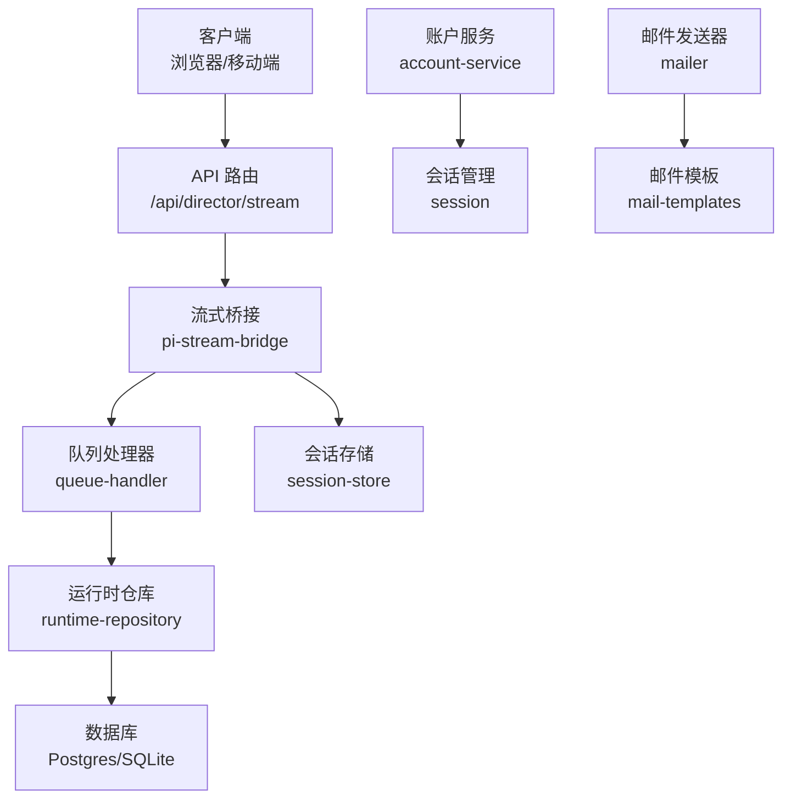
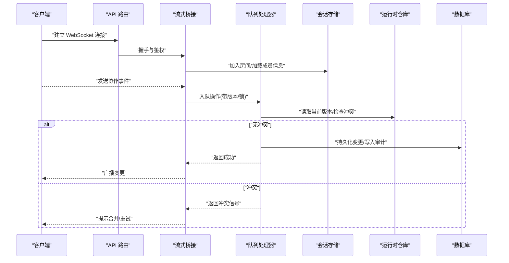
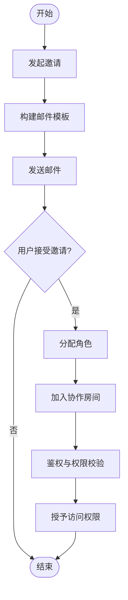
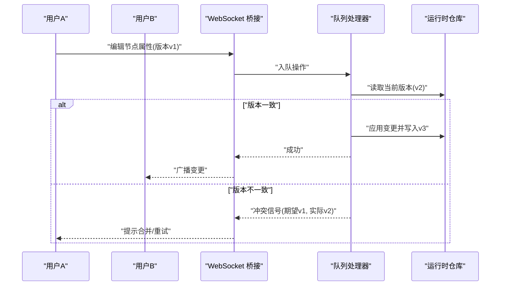
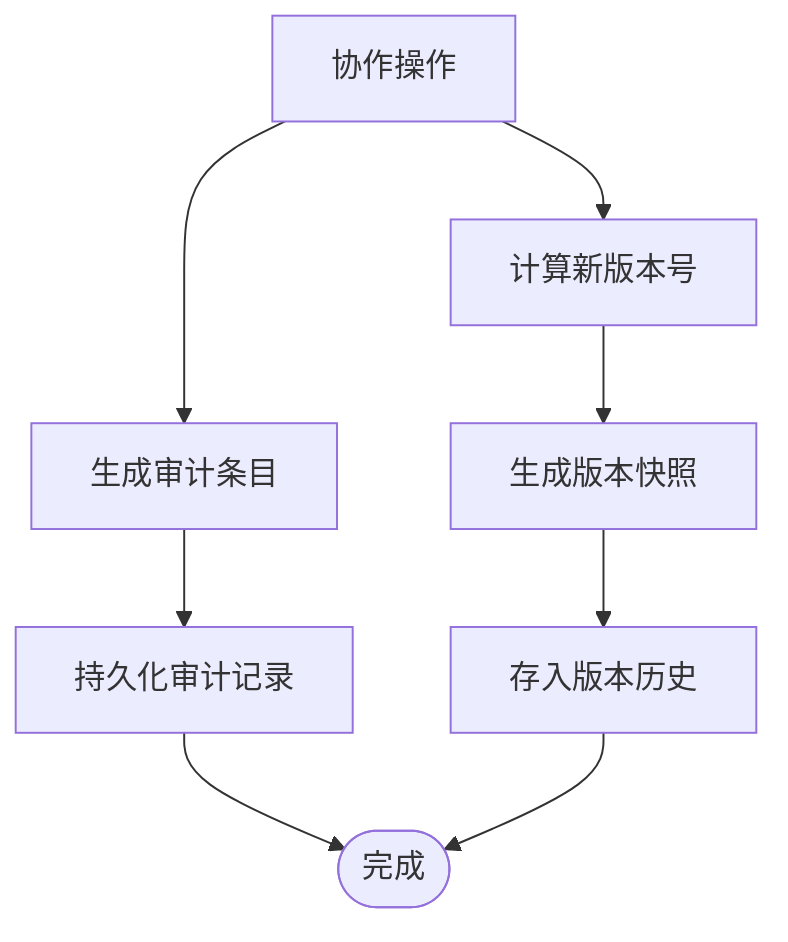
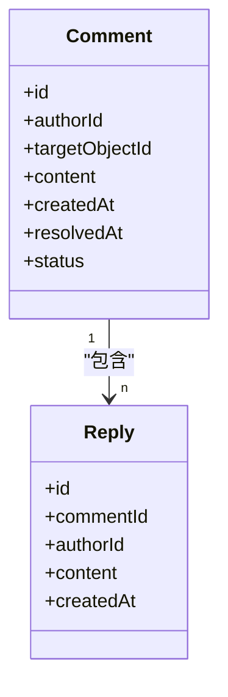
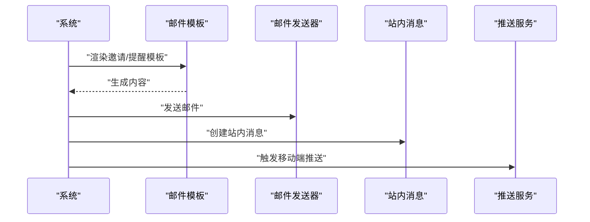
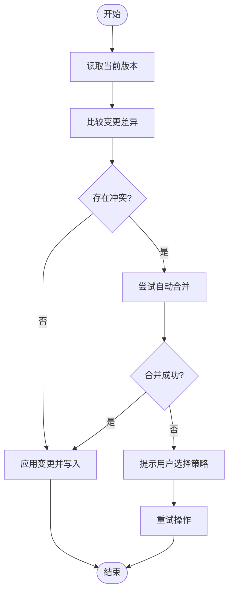
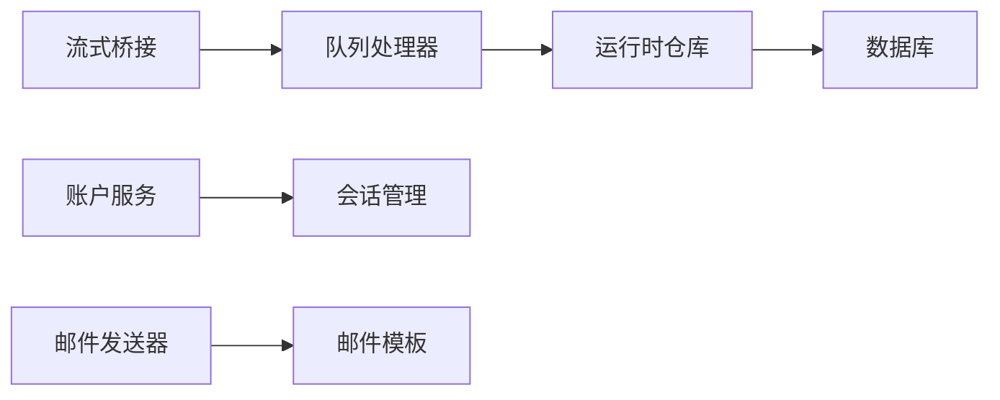

# 协作功能

<cite>
**本文引用的文件**   
- [src/app/api/director/stream/route.ts](file://src/app/api/director/stream/route.ts)
- [src/features/director/pi-stream-bridge.ts](file://src/features/director/pi-stream-bridge.ts)
- [src/features/director/queue-handler.ts](file://src/features/director/queue-handler.ts)
- [src/features/director/runtime-repository.ts](file://src/features/director/runtime-repository.ts)
- [src/features/director/stage-result-committer.ts](file://src/features/director/stage-result-committer.ts)
- [src/features/director/session-store.ts](file://src/features/director/session-store.ts)
- [src/features/auth/account-service.ts](file://src/features/auth/account-service.ts)
- [src/features/auth/session.ts](file://src/features/auth/session.ts)
- [src/features/auth/mail-templates.ts](file://src/features/auth/mail-templates.ts)
- [src/features/auth/mailer.ts](file://src/features/auth/mailer.ts)
- [src/lib/db/index.ts](file://src/lib/db/index.ts)
- [drizzle.config.ts](file://drizzle.config.ts)
</cite>

## 目录
1. [简介](#简介)
2. [项目结构](#项目结构)
3. [核心组件](#核心组件)
4. [架构总览](#架构总览)
5. [详细组件分析](#详细组件分析)
6. [依赖关系分析](#依赖关系分析)
7. [性能考量](#性能考量)
8. [故障排查指南](#故障排查指南)
9. [结论](#结论)
10. [附录](#附录)

## 简介
本文件面向 PurpleInk 的“协作功能”，围绕以下目标展开：成员管理（邀请、角色与权限）、实时协作（WebSocket 通信、冲突解决、操作同步）、变更日志（操作记录、版本历史、审计追踪）、评论与批注（添加、回复、解决状态）、通知机制（邮件、站内消息、移动端推送），以及协作冲突检测与解决策略。文档以代码为依据，提供架构图、时序图与流程图，帮助读者从高层到细节全面理解系统实现。

## 项目结构
协作相关能力分布在多个模块中：
- 实时流式协作：API 路由层负责建立 WebSocket 连接，桥接层负责事件分发与广播，队列处理器负责持久化与任务编排。
- 会话与权限：账户服务与会话管理负责鉴权、角色与访问控制。
- 存储与审计：运行时仓库与会话存储负责数据持久化与版本快照；数据库配置用于迁移与连接。
- 通知：邮件模板与发送器为邀请与协作通知提供基础能力。

图表来源
- [src/app/api/director/stream/route.ts](file://src/app/api/director/stream/route.ts)
- [src/features/director/pi-stream-bridge.ts](file://src/features/director/pi-stream-bridge.ts)
- [src/features/director/queue-handler.ts](file://src/features/director/queue-handler.ts)
- [src/features/director/session-store.ts](file://src/features/director/session-store.ts)
- [src/features/director/runtime-repository.ts](file://src/features/director/runtime-repository.ts)
- [src/features/auth/account-service.ts](file://src/features/auth/account-service.ts)
- [src/features/auth/session.ts](file://src/features/auth/session.ts)
- [src/features/auth/mailer.ts](file://src/features/auth/mailer.ts)
- [src/features/auth/mail-templates.ts](file://src/features/auth/mail-templates.ts)

章节来源
- [src/app/api/director/stream/route.ts](file://src/app/api/director/stream/route.ts)
- [src/features/director/pi-stream-bridge.ts](file://src/features/director/pi-stream-bridge.ts)
- [src/features/director/queue-handler.ts](file://src/features/director/queue-handler.ts)
- [src/features/director/session-store.ts](file://src/features/director/session-store.ts)
- [src/features/director/runtime-repository.ts](file://src/features/director/runtime-repository.ts)
- [src/features/auth/account-service.ts](file://src/features/auth/account-service.ts)
- [src/features/auth/session.ts](file://src/features/auth/session.ts)
- [src/features/auth/mailer.ts](file://src/features/auth/mailer.ts)
- [src/features/auth/mail-templates.ts](file://src/features/auth/mail-templates.ts)
- [src/lib/db/index.ts](file://src/lib/db/index.ts)
- [drizzle.config.ts](file://drizzle.config.ts)

## 核心组件
- 流式桥接（pi-stream-bridge）：维护 WebSocket 连接、房间与会话上下文，转发客户端事件至队列处理器，并将结果广播回客户端。
- 队列处理器（queue-handler）：接收并调度协作操作，执行幂等校验、并发控制、持久化与审计写入。
- 运行时仓库（runtime-repository）：对协作对象（如节点、阶段、产物）进行读写与版本快照，支持增量更新与合并。
- 会话存储（session-store）：缓存在线用户、角色、权限与房间成员列表，提供快速查询与失效策略。
- 账户服务（account-service）：用户与组织成员管理、角色分配、邀请流程与权限判定。
- 会话管理（session）：鉴权与会话生命周期，确保仅授权用户可进入协作房间。
- 邮件模板与发送器（mail-templates, mailer）：构建邀请与协作通知内容，并通过外部 SMTP/SDK 发送。

章节来源
- [src/features/director/pi-stream-bridge.ts](file://src/features/director/pi-stream-bridge.ts)
- [src/features/director/queue-handler.ts](file://src/features/director/queue-handler.ts)
- [src/features/director/runtime-repository.ts](file://src/features/director/runtime-repository.ts)
- [src/features/director/session-store.ts](file://src/features/director/session-store.ts)
- [src/features/auth/account-service.ts](file://src/features/auth/account-service.ts)
- [src/features/auth/session.ts](file://src/features/auth/session.ts)
- [src/features/auth/mailer.ts](file://src/features/auth/mailer.ts)
- [src/features/auth/mail-templates.ts](file://src/features/auth/mail-templates.ts)

## 架构总览
协作系统采用“API 路由 + 流式桥接 + 队列处理 + 仓库持久化”的分层架构。客户端通过 WebSocket 接入，服务端在桥接层完成鉴权与房间绑定，随后将操作入队，由队列处理器保证顺序与一致性，最终写入库并广播变更。

图表来源
- [src/app/api/director/stream/route.ts](file://src/app/api/director/stream/route.ts)
- [src/features/director/pi-stream-bridge.ts](file://src/features/director/pi-stream-bridge.ts)
- [src/features/director/queue-handler.ts](file://src/features/director/queue-handler.ts)
- [src/features/director/runtime-repository.ts](file://src/features/director/runtime-repository.ts)

## 详细组件分析

### 成员管理与权限控制
- 邀请成员：通过账户服务创建邀请记录，使用邮件模板生成邀请链接，经由邮件发送器发出。
- 角色分配：在加入房间时，根据账户服务返回的角色决定权限（读/写/管理员）。
- 权限控制：会话层校验用户身份与房间成员资格；桥接层限制敏感操作的执行范围。

章节来源
- [src/features/auth/account-service.ts](file://src/features/auth/account-service.ts)
- [src/features/auth/mail-templates.ts](file://src/features/auth/mail-templates.ts)
- [src/features/auth/mailer.ts](file://src/features/auth/mailer.ts)
- [src/features/auth/session.ts](file://src/features/auth/session.ts)

### 实时协作机制（WebSocket 通信、冲突解决、操作同步）
- 通信模型：客户端通过 WebSocket 发送结构化事件（如移动节点、编辑属性、新增阶段），服务端按房间广播给其他在线成员。
- 冲突解决：基于版本号与乐观锁策略，队列处理器在执行前检查冲突；若冲突则返回合并建议或要求客户端重试。
- 操作同步：持久化后，桥接层将变更事件广播，确保所有客户端视图一致。

图表来源
- [src/app/api/director/stream/route.ts](file://src/app/api/director/stream/route.ts)
- [src/features/director/pi-stream-bridge.ts](file://src/features/director/pi-stream-bridge.ts)
- [src/features/director/queue-handler.ts](file://src/features/director/queue-handler.ts)
- [src/features/director/runtime-repository.ts](file://src/features/director/runtime-repository.ts)

章节来源
- [src/app/api/director/stream/route.ts](file://src/app/api/director/stream/route.ts)
- [src/features/director/pi-stream-bridge.ts](file://src/features/director/pi-stream-bridge.ts)
- [src/features/director/queue-handler.ts](file://src/features/director/queue-handler.ts)
- [src/features/director/runtime-repository.ts](file://src/features/director/runtime-repository.ts)

### 变更日志系统（操作记录、版本历史、审计追踪）
- 操作记录：每次协作操作在队列处理器中生成审计条目，包含操作者、时间戳、目标对象与变更摘要。
- 版本历史：运行时仓库维护对象的版本链，支持回溯与对比。
- 审计追踪：持久化审计表，便于合规审查与问题定位。

章节来源
- [src/features/director/queue-handler.ts](file://src/features/director/queue-handler.ts)
- [src/features/director/runtime-repository.ts](file://src/features/director/runtime-repository.ts)

### 评论与批注功能（添加、回复、解决状态）
- 评论添加：用户在特定对象上创建评论，关联作者与时间戳。
- 回复：支持嵌套回复，形成讨论线程。
- 解决状态：评论可标记为已解决，影响协作面板展示与通知触发。

图表来源
- [src/features/director/runtime-repository.ts](file://src/features/director/runtime-repository.ts)

章节来源
- [src/features/director/runtime-repository.ts](file://src/features/director/runtime-repository.ts)

### 协作通知机制（邮件、站内消息、移动端推送）
- 邮件通知：邀请、协作提醒与审计摘要通过邮件模板与发送器发出。
- 站内消息：协作事件触发站内消息队列，供前端轮询或长连接推送。
- 移动端推送：可选集成第三方推送服务，将关键事件推送到设备端。

图表来源
- [src/features/auth/mail-templates.ts](file://src/features/auth/mail-templates.ts)
- [src/features/auth/mailer.ts](file://src/features/auth/mailer.ts)

章节来源
- [src/features/auth/mail-templates.ts](file://src/features/auth/mail-templates.ts)
- [src/features/auth/mailer.ts](file://src/features/auth/mailer.ts)

### 协作冲突检测与解决策略
- 检测策略：基于版本号与字段级差异比较，识别冲突点。
- 解决策略：优先采用自动合并（非冲突字段），冲突字段提示用户选择保留策略（本地/远端/手动合并）。
- 重试机制：客户端收到冲突信号后，拉取最新状态并重试操作。

图表来源
- [src/features/director/queue-handler.ts](file://src/features/director/queue-handler.ts)
- [src/features/director/runtime-repository.ts](file://src/features/director/runtime-repository.ts)

章节来源
- [src/features/director/queue-handler.ts](file://src/features/director/queue-handler.ts)
- [src/features/director/runtime-repository.ts](file://src/features/director/runtime-repository.ts)

## 依赖关系分析
协作子系统依赖以下关键模块：
- 鉴权与会话：确保只有授权用户参与协作。
- 存储与迁移：数据库连接与迁移脚本保障数据结构一致性。
- 通知服务：邮件与推送服务提供外部触达能力。

图表来源
- [src/features/director/pi-stream-bridge.ts](file://src/features/director/pi-stream-bridge.ts)
- [src/features/director/queue-handler.ts](file://src/features/director/queue-handler.ts)
- [src/features/director/runtime-repository.ts](file://src/features/director/runtime-repository.ts)
- [src/features/auth/account-service.ts](file://src/features/auth/account-service.ts)
- [src/features/auth/session.ts](file://src/features/auth/session.ts)
- [src/features/auth/mailer.ts](file://src/features/auth/mailer.ts)
- [src/features/auth/mail-templates.ts](file://src/features/auth/mail-templates.ts)
- [src/lib/db/index.ts](file://src/lib/db/index.ts)
- [drizzle.config.ts](file://drizzle.config.ts)

章节来源
- [src/features/director/pi-stream-bridge.ts](file://src/features/director/pi-stream-bridge.ts)
- [src/features/director/queue-handler.ts](file://src/features/director/queue-handler.ts)
- [src/features/director/runtime-repository.ts](file://src/features/director/runtime-repository.ts)
- [src/features/auth/account-service.ts](file://src/features/auth/account-service.ts)
- [src/features/auth/session.ts](file://src/features/auth/session.ts)
- [src/features/auth/mailer.ts](file://src/features/auth/mailer.ts)
- [src/features/auth/mail-templates.ts](file://src/features/auth/mail-templates.ts)
- [src/lib/db/index.ts](file://src/lib/db/index.ts)
- [drizzle.config.ts](file://drizzle.config.ts)

## 性能考量
- 并发控制：队列处理器应限制同一对象的并发写入，避免频繁冲突。
- 批量广播：对高频小变更进行聚合，减少网络开销。
- 缓存策略：会话存储与热点数据缓存提升响应速度。
- 异步持久化：将审计与版本快照写入改为异步任务，降低主路径延迟。

[本节为通用指导，不直接分析具体文件]

## 故障排查指南
- WebSocket 连接失败：检查 API 路由握手逻辑与鉴权中间件。
- 冲突频发：确认版本号传递是否正确，检查客户端是否拉取最新状态后再提交。
- 邮件未送达：验证邮件模板渲染与发送器配置，查看发送器日志。
- 审计缺失：检查队列处理器是否成功写入审计表，核对事务边界。

章节来源
- [src/app/api/director/stream/route.ts](file://src/app/api/director/stream/route.ts)
- [src/features/director/pi-stream-bridge.ts](file://src/features/director/pi-stream-bridge.ts)
- [src/features/director/queue-handler.ts](file://src/features/director/queue-handler.ts)
- [src/features/auth/mailer.ts](file://src/features/auth/mailer.ts)

## 结论
PurpleInk 的协作功能以清晰的层次化架构支撑实时协作、权限控制与审计追踪。通过 WebSocket 桥接与队列处理器，系统在并发与一致性之间取得平衡；账户服务与会话管理确保安全的成员与权限控制；邮件与通知机制完善协作体验。建议在后续迭代中增强冲突自动合并策略与移动端推送集成，以提升协作效率与用户体验。

[本节为总结性内容，不直接分析具体文件]

## 附录
- 数据库配置：参考 drizzle 配置文件与数据库连接模块，确保迁移与连接参数正确。
- 安全建议：对敏感操作增加二次确认与操作回放能力，便于审计与恢复。

章节来源
- [drizzle.config.ts](file://drizzle.config.ts)
- [src/lib/db/index.ts](file://src/lib/db/index.ts)