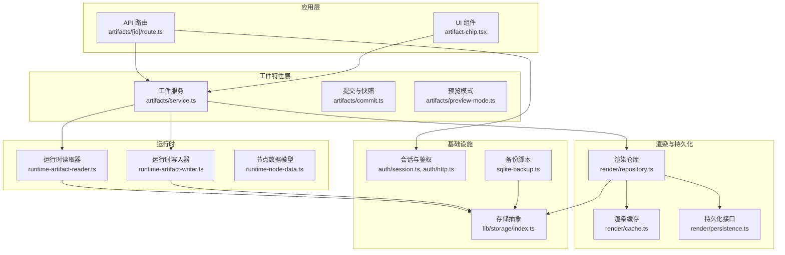
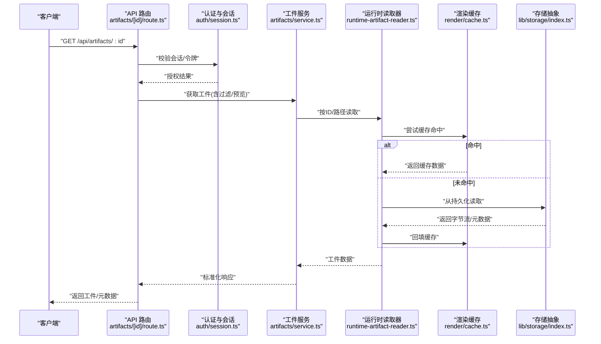
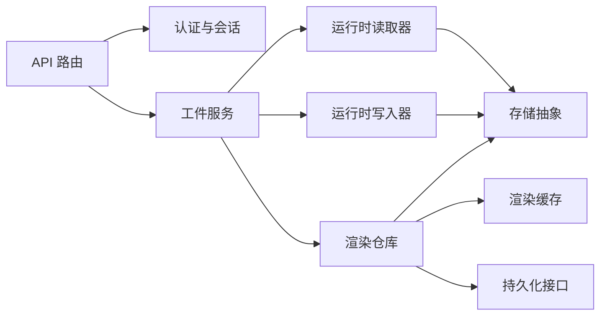

# 工件管理系统

<cite>
**本文引用的文件**   
- [src/features/artifacts/index.ts](file://src/features/artifacts/index.ts)
- [src/features/artifacts/service.ts](file://src/features/artifacts/service.ts)
- [src/features/artifacts/commit.ts](file://src/features/artifacts/commit.ts)
- [src/features/artifacts/preview-mode.ts](file://src/features/artifacts/preview-mode.ts)
- [src/app/api/artifacts/[id]/route.ts](file://src/app/api/artifacts/[id]/route.ts)
- [src/components/ui/artifact-chip.tsx](file://src/components/ui/artifact-chip.tsx)
- [src/features/director/runtime-artifact-reader.ts](file://src/features/director/runtime-artifact-reader.ts)
- [src/features/director/runtime-artifact-writer.ts](file://src/features/director/runtime-artifact-writer.ts)
- [src/features/director/runtime-node-data.ts](file://src/features/director/runtime-node-data.ts)
- [src/features/render/repository.ts](file://src/features/render/repository.ts)
- [src/features/render/cache.ts](file://src/features/render/cache.ts)
- [src/features/render/persistence.ts](file://src/features/render/persistence.ts)
- [src/lib/storage/index.ts](file://src/lib/storage/index.ts)
- [src/features/auth/session.ts](file://src/features/auth/session.ts)
- [src/features/auth/http.ts](file://src/features/auth/http.ts)
- [scripts/migration/sqlite-backup.ts](file://scripts/migration/sqlite-backup.ts)
</cite>

## 目录
1. [简介](#简介)
2. [项目结构](#项目结构)
3. [核心组件](#核心组件)
4. [架构总览](#架构总览)
5. [详细组件分析](#详细组件分析)
6. [依赖关系分析](#依赖关系分析)
7. [性能考量](#性能考量)
8. [故障排查指南](#故障排查指南)
9. [结论](#结论)
10. [附录](#附录)

## 简介
本文件为 PurpleInk 工件管理系统的权威技术文档，面向开发者与运维人员。内容覆盖：
- 工件类型定义（源代码、中间产物、最终输出等）
- 存储策略（本地、云存储、缓存）
- 版本追踪（哈希、依赖、变更追踪）
- 访问控制（权限、令牌、安全策略）
- 用户功能（搜索、过滤、下载）
- 运维能力（清理、压缩、备份）

## 项目结构
工件相关代码主要分布在以下模块：
- 工件特性层：src/features/artifacts
- 运行时工件读写：src/features/director
- 渲染产物仓库与缓存：src/features/render
- 通用存储抽象：src/lib/storage
- API 路由：src/app/api/artifacts
- UI 展示：src/components/ui/artifact-chip.tsx
- 认证与会话：src/features/auth
- 备份脚本：scripts/migration/sqlite-backup.ts

图表来源
- [src/app/api/artifacts/[id]/route.ts](file://src/app/api/artifacts/[id]/route.ts)
- [src/components/ui/artifact-chip.tsx](file://src/components/ui/artifact-chip.tsx)
- [src/features/artifacts/service.ts](file://src/features/artifacts/service.ts)
- [src/features/artifacts/commit.ts](file://src/features/artifacts/commit.ts)
- [src/features/artifacts/preview-mode.ts](file://src/features/artifacts/preview-mode.ts)
- [src/features/director/runtime-artifact-reader.ts](file://src/features/director/runtime-artifact-reader.ts)
- [src/features/director/runtime-artifact-writer.ts](file://src/features/director/runtime-artifact-writer.ts)
- [src/features/director/runtime-node-data.ts](file://src/features/director/runtime-node-data.ts)
- [src/features/render/repository.ts](file://src/features/render/repository.ts)
- [src/features/render/cache.ts](file://src/features/render/cache.ts)
- [src/features/render/persistence.ts](file://src/features/render/persistence.ts)
- [src/lib/storage/index.ts](file://src/lib/storage/index.ts)
- [src/features/auth/session.ts](file://src/features/auth/session.ts)
- [src/features/auth/http.ts](file://src/features/auth/http.ts)
- [scripts/migration/sqlite-backup.ts](file://scripts/migration/sqlite-backup.ts)

章节来源
- [src/features/artifacts/index.ts](file://src/features/artifacts/index.ts)
- [src/features/artifacts/service.ts](file://src/features/artifacts/service.ts)
- [src/features/artifacts/commit.ts](file://src/features/artifacts/commit.ts)
- [src/features/artifacts/preview-mode.ts](file://src/features/artifacts/preview-mode.ts)
- [src/app/api/artifacts/[id]/route.ts](file://src/app/api/artifacts/[id]/route.ts)
- [src/components/ui/artifact-chip.tsx](file://src/components/ui/artifact-chip.tsx)
- [src/features/director/runtime-artifact-reader.ts](file://src/features/director/runtime-artifact-reader.ts)
- [src/features/director/runtime-artifact-writer.ts](file://src/features/director/runtime-artifact-writer.ts)
- [src/features/director/runtime-node-data.ts](file://src/features/director/runtime-node-data.ts)
- [src/features/render/repository.ts](file://src/features/render/repository.ts)
- [src/features/render/cache.ts](file://src/features/render/cache.ts)
- [src/features/render/persistence.ts](file://src/features/render/persistence.ts)
- [src/lib/storage/index.ts](file://src/lib/storage/index.ts)
- [src/features/auth/session.ts](file://src/features/auth/session.ts)
- [src/features/auth/http.ts](file://src/features/auth/http.ts)
- [scripts/migration/sqlite-backup.ts](file://scripts/migration/sqlite-backup.ts)

## 核心组件
- 工件服务（Artifacts Service）
  - 职责：统一暴露工件的创建、查询、更新、删除、元数据操作；协调运行时读写器与渲染仓库。
  - 关键能力：版本化提交、预览模式切换、按项目/阶段筛选。
- 运行时工件读写器
  - 读取器：从持久化或缓存中按 ID/路径获取工件流或元数据。
  - 写入器：将中间产物或最终输出落盘，并记录依赖与哈希。
- 渲染仓库与缓存
  - 仓库：封装渲染产物的增删改查、分页与过滤。
  - 缓存：基于键值或对象缓存加速重复渲染结果命中。
- 存储抽象
  - 提供统一的存储接口，支持本地文件系统与云存储后端。
- 认证与会话
  - 提供会话校验、访问令牌验证与权限判断。

章节来源
- [src/features/artifacts/service.ts](file://src/features/artifacts/service.ts)
- [src/features/director/runtime-artifact-reader.ts](file://src/features/director/runtime-artifact-reader.ts)
- [src/features/director/runtime-artifact-writer.ts](file://src/features/director/runtime-artifact-writer.ts)
- [src/features/render/repository.ts](file://src/features/render/repository.ts)
- [src/features/render/cache.ts](file://src/features/render/cache.ts)
- [src/lib/storage/index.ts](file://src/lib/storage/index.ts)
- [src/features/auth/session.ts](file://src/features/auth/session.ts)
- [src/features/auth/http.ts](file://src/features/auth/http.ts)

## 架构总览
系统采用分层架构：API 路由作为入口，调用工件服务；工件服务通过运行时读写器与渲染仓库协作，底层由存储抽象对接具体介质；认证模块保障访问安全；备份脚本负责数据保护。

图表来源
- [src/app/api/artifacts/[id]/route.ts](file://src/app/api/artifacts/[id]/route.ts)
- [src/features/auth/session.ts](file://src/features/auth/session.ts)
- [src/features/artifacts/service.ts](file://src/features/artifacts/service.ts)
- [src/features/director/runtime-artifact-reader.ts](file://src/features/director/runtime-artifact-reader.ts)
- [src/features/render/cache.ts](file://src/features/render/cache.ts)
- [src/lib/storage/index.ts](file://src/lib/storage/index.ts)

## 详细组件分析

### 工件类型与生命周期
- 类型划分
  - 源代码类：输入素材、配置、模板等。
  - 中间产物：解析后的结构化数据、中间渲染帧、音频片段等。
  - 最终输出：可交付的视频、音频、图片、HTML/PDF 等。
- 生命周期
  - 创建：上游任务生成工件，写入器落盘并记录元数据。
  - 版本化：每次提交生成不可变快照，包含哈希与依赖图。
  - 预览：支持预览模式快速拉取轻量版或缩略信息。
  - 归档/清理：按策略保留历史版本，清理过期中间产物。

章节来源
- [src/features/artifacts/commit.ts](file://src/features/artifacts/commit.ts)
- [src/features/artifacts/preview-mode.ts](file://src/features/artifacts/preview-mode.ts)
- [src/features/director/runtime-node-data.ts](file://src/features/director/runtime-node-data.ts)

### 工件存储策略
- 本地存储
  - 以文件树形式组织，按项目/阶段/工件类型分目录。
  - 支持大文件分块写入与断点续传（由上层任务编排）。
- 云存储
  - 通过存储抽象适配不同对象存储后端，统一读写接口。
  - 支持签名 URL 与临时访问令牌。
- 缓存策略
  - 内存缓存优先，二级持久化缓存兜底。
  - 基于键值（如工件哈希+维度）命中，避免重复计算。

章节来源
- [src/lib/storage/index.ts](file://src/lib/storage/index.ts)
- [src/features/render/cache.ts](file://src/features/render/cache.ts)
- [src/features/render/persistence.ts](file://src/features/render/persistence.ts)

### 版本追踪机制
- 哈希计算
  - 对工件内容与关键元数据计算稳定哈希，用于去重与一致性校验。
- 依赖关系
  - 记录上游工件与配置依赖，构建 DAG，便于影响分析与增量重建。
- 变更追踪
  - 每次提交生成快照，支持回滚与对比；支持差异统计与审计日志。

章节来源
- [src/features/artifacts/commit.ts](file://src/features/artifacts/commit.ts)
- [src/features/director/runtime-node-data.ts](file://src/features/director/runtime-node-data.ts)

### 访问控制与安全策略
- 会话与令牌
  - 所有工件访问需携带有效会话或访问令牌。
- 权限模型
  - 基于角色/资源维度的细粒度权限，限制读/写/删除/分享等操作。
- 安全传输
  - 强制 HTTPS，敏感参数走请求体或头部加密传输。

章节来源
- [src/features/auth/session.ts](file://src/features/auth/session.ts)
- [src/features/auth/http.ts](file://src/features/auth/http.ts)
- [src/app/api/artifacts/[id]/route.ts](file://src/app/api/artifacts/[id]/route.ts)

### 用户功能：搜索、过滤、下载
- 搜索与过滤
  - 支持按项目、阶段、类型、时间范围、标签等多条件组合过滤。
  - 全文检索与模糊匹配，提升查找效率。
- 下载与预览
  - 支持直接下载与流式传输；预览模式返回缩略图或摘要。
  - 支持断点续传与并发分片下载（由前端/网关实现）。

章节来源
- [src/app/api/artifacts/[id]/route.ts](file://src/app/api/artifacts/[id]/route.ts)
- [src/components/ui/artifact-chip.tsx](file://src/components/ui/artifact-chip.tsx)
- [src/features/artifacts/service.ts](file://src/features/artifacts/service.ts)

### 运维功能：清理、压缩、备份
- 清理策略
  - 按时间、大小、使用频率自动清理中间产物与过期版本。
  - 支持手动触发清理任务与灰度清理。
- 压缩归档
  - 对冷数据执行压缩归档，降低存储成本。
  - 支持在线解压与按需读取。
- 备份恢复
  - 定期全量/增量备份，支持跨环境迁移与灾难恢复。

章节来源
- [scripts/migration/sqlite-backup.ts](file://scripts/migration/sqlite-backup.ts)
- [src/features/render/repository.ts](file://src/features/render/repository.ts)

## 依赖关系分析
工件系统各模块之间的耦合与内聚如下：
- API 路由仅依赖认证与工件服务，保持薄控制器。
- 工件服务聚合运行时读写器与渲染仓库，屏蔽底层细节。
- 渲染仓库依赖缓存与持久化接口，解耦存储实现。
- 存储抽象向上提供统一接口，向下适配多后端。
- 认证模块独立于业务逻辑，贯穿所有受保护端点。

图表来源
- [src/app/api/artifacts/[id]/route.ts](file://src/app/api/artifacts/[id]/route.ts)
- [src/features/artifacts/service.ts](file://src/features/artifacts/service.ts)
- [src/features/director/runtime-artifact-reader.ts](file://src/features/director/runtime-artifact-reader.ts)
- [src/features/director/runtime-artifact-writer.ts](file://src/features/director/runtime-artifact-writer.ts)
- [src/features/render/repository.ts](file://src/features/render/repository.ts)
- [src/features/render/cache.ts](file://src/features/render/cache.ts)
- [src/features/render/persistence.ts](file://src/features/render/persistence.ts)
- [src/lib/storage/index.ts](file://src/lib/storage/index.ts)
- [src/features/auth/session.ts](file://src/features/auth/session.ts)

章节来源
- [src/app/api/artifacts/[id]/route.ts](file://src/app/api/artifacts/[id]/route.ts)
- [src/features/artifacts/service.ts](file://src/features/artifacts/service.ts)
- [src/features/director/runtime-artifact-reader.ts](file://src/features/director/runtime-artifact-reader.ts)
- [src/features/director/runtime-artifact-writer.ts](file://src/features/director/runtime-artifact-writer.ts)
- [src/features/render/repository.ts](file://src/features/render/repository.ts)
- [src/features/render/cache.ts](file://src/features/render/cache.ts)
- [src/features/render/persistence.ts](file://src/features/render/persistence.ts)
- [src/lib/storage/index.ts](file://src/lib/storage/index.ts)
- [src/features/auth/session.ts](file://src/features/auth/session.ts)

## 性能考量
- 缓存命中率优化
  - 合理设计缓存键，避免冲突；设置合适的 TTL 与淘汰策略。
- 读写分离
  - 热点工件优先走缓存与只读副本，降低主存储压力。
- 流式处理
  - 大文件采用流式读写，减少内存峰值与 GC 压力。
- 并发控制
  - 限制并发写入与下载，避免资源争用与雪崩。
- 索引与分页
  - 对高频查询字段建立索引，分页查询避免全表扫描。

[本节为通用指导，不直接分析具体文件]

## 故障排查指南
- 常见问题定位
  - 无法访问工件：检查会话/令牌有效性、权限策略与网络连通性。
  - 读取超时：检查存储后端健康状态、缓存命中率与网络延迟。
  - 写入失败：确认存储空间、配额与权限，查看错误码与堆栈。
- 诊断手段
  - 启用调试日志，关注关键路径的耗时与异常。
  - 使用健康检查与指标监控，观察缓存命中率与错误率。
  - 通过备份与快照进行回滚与恢复。

章节来源
- [src/app/api/artifacts/[id]/route.ts](file://src/app/api/artifacts/[id]/route.ts)
- [src/features/auth/session.ts](file://src/features/auth/session.ts)
- [src/features/render/cache.ts](file://src/features/render/cache.ts)
- [scripts/migration/sqlite-backup.ts](file://scripts/migration/sqlite-backup.ts)

## 结论
PurpleInk 工件管理系统通过清晰的分层与抽象，实现了类型完备、存储灵活、版本可控、安全合规且易于扩展的工件管理能力。建议在生产环境中结合监控告警与自动化运维工具，持续优化缓存策略与存储成本，确保高可用与高性能。

[本节为总结性内容，不直接分析具体文件]

## 附录
- 术语表
  - 工件：系统中被生产、消费与管理的数字资产。
  - 快照：某时刻工件及其元数据的不可变版本。
  - 依赖图：工件间依赖关系的有向无环图。
- 最佳实践
  - 为每个工件定义清晰的类型与元数据。
  - 使用稳定的哈希算法与幂等写入。
  - 最小权限原则与最小必要数据暴露。
  - 定期备份与演练恢复流程。

[本节为补充信息，不直接分析具体文件]