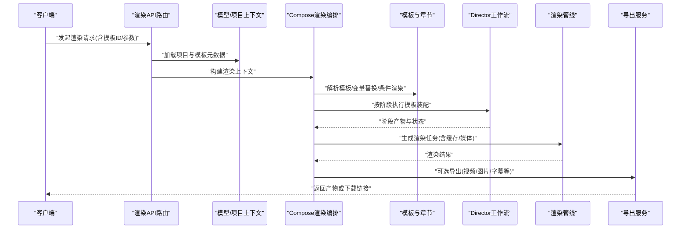
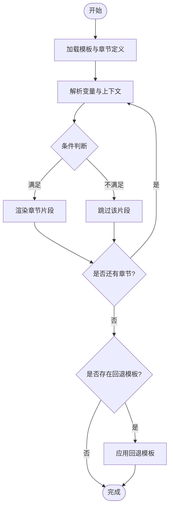
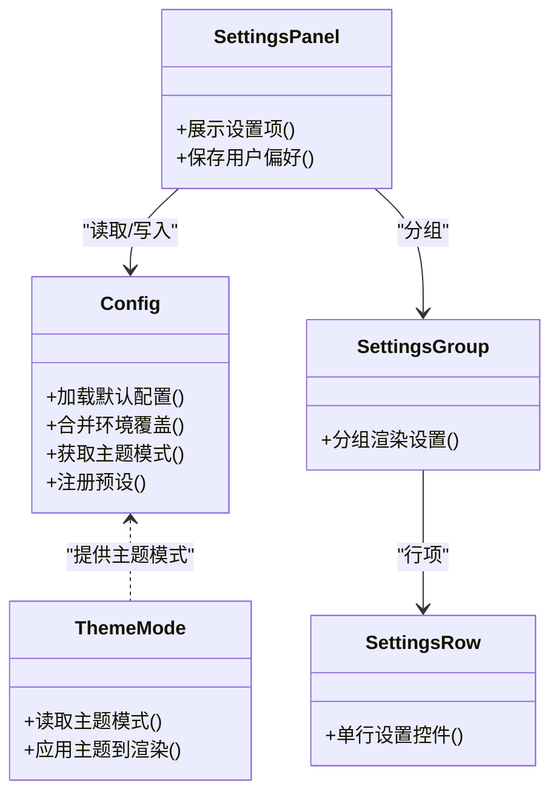
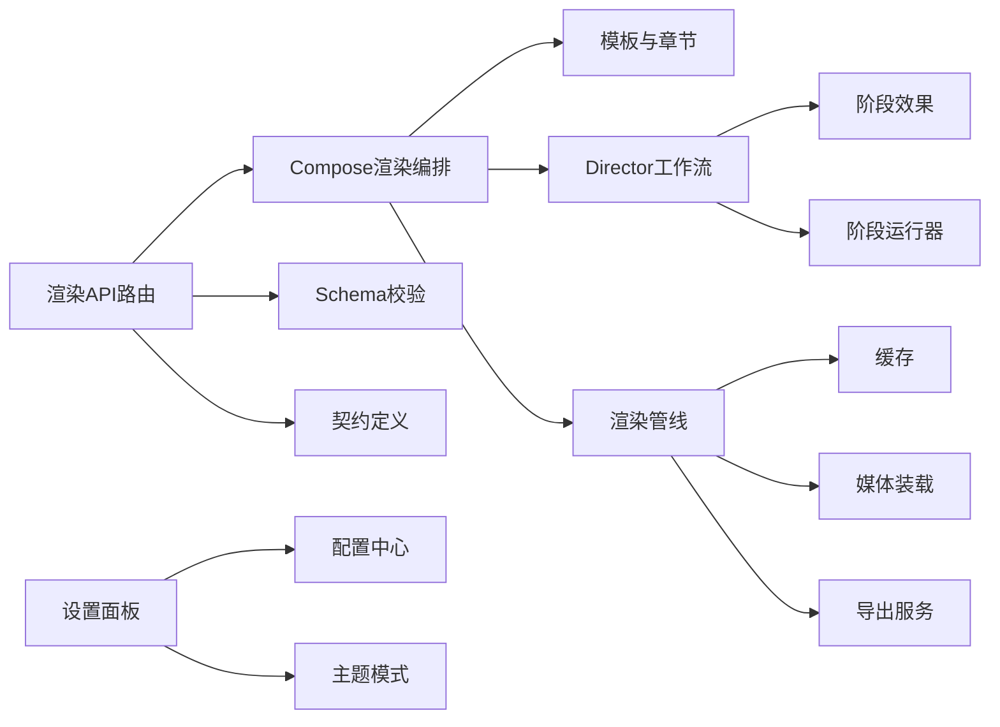

# 模板与预设

<cite>
**本文引用的文件**   
- [compose/template.ts](file://server/src/compose/template.ts)
- [compose/chapters/types.ts](file://server/src/compose/chapters/types.ts)
- [compose/chapters/template-fallback.ts](file://server/src/compose/chapters/template-fallback.ts)
- [compose/render.ts](file://server/src/compose/render.ts)
- [compose/run-pipeline.ts](file://server/src/compose/run-pipeline.ts)
- [compose/model.ts](file://server/src/compose/model.ts)
- [compose/project.ts](file://server/src/compose/project.ts)
- [app/api/render/route.ts](file://src/app/api/render/route.ts)
- [app/api/render/export/route.ts](file://src/app/api/render/export/route.ts)
- [features/canvas/contracts.ts](file://src/features/canvas/contracts.ts)
- [features/canvas/schemas.ts](file://src/features/canvas/schemas.ts)
- [features/canvas/layout.ts](file://src/features/canvas/layout.ts)
- [features/canvas/fabricate-source-contract.ts](file://src/features/canvas/fabricate-source-contract.ts)
- [features/director/stage-effects.ts](file://src/features/director/stage-effects.ts)
- [features/director/stage-runner.ts](file://src/features/director/stage-runner.ts)
- [features/director/pipeline.ts](file://src/features/director/pipeline.ts)
- [features/render/renderer.ts](file://src/features/render/renderer.ts)
- [features/render/source-contract.ts](file://src/features/render/source-contract.ts)
- [features/render/cache.ts](file://src/features/render/cache.ts)
- [features/render/media-assembly-loader.ts](file://src/features/render/media-assembly-loader.ts)
- [features/render/export-service.ts](file://src/features/render/export-service.ts)
- [features/render/queue-handler.ts](file://src/features/render/queue-handler.ts)
- [lib/config/index.ts](file://src/lib/config/index.ts)
- [lib/theme-mode.ts](file://src/lib/theme-mode.ts)
- [components/ui/settings-panel.tsx](file://src/components/ui/settings-panel.tsx)
- [components/ui/settings-group.tsx](file://src/components/ui/settings-group.tsx)
- [components/ui/settings-row.tsx](file://src/components/ui/settings-row.tsx)
</cite>

## 目录
1. [简介](#简介)
2. [项目结构](#项目结构)
3. [核心组件](#核心组件)
4. [架构总览](#架构总览)
5. [详细组件分析](#详细组件分析)
6. [依赖关系分析](#依赖关系分析)
7. [性能考量](#性能考量)
8. [故障排查指南](#故障排查指南)
9. [结论](#结论)
10. [附录](#附录)

## 简介
本文件系统性阐述 PurpleInk 的“模板与预设”体系，覆盖以下目标：
- 模板设计：模板结构、变量替换、条件渲染、章节化模板与回退策略。
- 预设配置管理：默认设置、主题预设、工作流预设及其加载与应用流程。
- 模板市场：模板分享、分类浏览、评分评价（概念性说明）。
- 自定义模板开发：模板规范、开发工具、测试方法。
- 版本管理与兼容性检查：模板版本、向后兼容、迁移策略。
- 导入导出与批量应用：模板与预设的序列化、批量装配与执行。

## 项目结构
围绕模板与预设的核心代码主要分布在服务端 compose 层、前端 API 路由、Canvas 契约与 Schema、渲染管线以及配置与主题模块中。下图给出与模板/预设相关的关键文件与职责概览。

```mermaid
graph TB
subgraph "服务端 Compose"
TPL["template.ts"]
CH_TYPES["chapters/types.ts"]
CH_FALLBACK["chapters/template-fallback.ts"]
RENDER["render.ts"]
PIPELINE["run-pipeline.ts"]
MODEL["model.ts"]
PROJECT["project.ts"]
end
subgraph "前端 API"
RND_RT["api/render/route.ts"]
EXP_RT["api/render/export/route.ts"]
end
subgraph "Canvas 契约与Schema"
C_CONTRACTS["canvas/contracts.ts"]
C_SCHEMAS["canvas/schemas.ts"]
C_LAYOUT["canvas/layout.ts"]
C_FABRICATE["canvas/fabricate-source-contract.ts"]
end
subgraph "Director 工作流"
D_STAGE_EFFECTS["director/stage-effects.ts"]
D_STAGE_RUNNER["director/stage-runner.ts"]
D_PIPELINE["director/pipeline.ts"]
end
subgraph "渲染管线"
R_RENDERER["render/renderer.ts"]
R_SOURCE["render/source-contract.ts"]
R_CACHE["render/cache.ts"]
R_MEDIA["render/media-assembly-loader.ts"]
R_EXPORT["render/export-service.ts"]
R_QUEUE["render/queue-handler.ts"]
end
subgraph "配置与主题"
L_CONFIG["lib/config/index.ts"]
L_THEME["lib/theme-mode.ts"]
UI_SP["components/ui/settings-panel.tsx"]
UI_SG["components/ui/settings-group.tsx"]
UI_SR["components/ui/settings-row.tsx"]
end
RND_RT --> RENDER
RND_RT --> PIPELINE
RND_RT --> MODEL
RND_RT --> PROJECT
RENDER --> TPL
RENDER --> CH_TYPES
RENDER --> CH_FALLBACK
PIPELINE --> D_STAGE_EFFECTS
PIPELINE --> D_STAGE_RUNNER
PIPELINE --> D_PIPELINE
RENDER --> R_RENDERER
RENDER --> R_SOURCE
RENDER --> R_CACHE
RENDER --> R_MEDIA
RENDER --> R_EXPORT
RENDER --> R_QUEUE
RND_RT --> C_CONTRACTS
RND_RT --> C_SCHEMAS
RND_RT --> C_LAYOUT
RND_RT --> C_FABRICATE
UI_SP --> L_CONFIG
UI_SG --> L_CONFIG
UI_SR --> L_CONFIG
```

图表来源 
- [compose/template.ts](file://server/src/compose/template.ts)
- [compose/chapters/types.ts](file://server/src/compose/chapters/types.ts)
- [compose/chapters/template-fallback.ts](file://server/src/compose/chapters/template-fallback.ts)
- [compose/render.ts](file://server/src/compose/render.ts)
- [compose/run-pipeline.ts](file://server/src/compose/run-pipeline.ts)
- [compose/model.ts](file://server/src/compose/model.ts)
- [compose/project.ts](file://server/src/compose/project.ts)
- [app/api/render/route.ts](file://src/app/api/render/route.ts)
- [app/api/render/export/route.ts](file://src/app/api/render/export/route.ts)
- [features/canvas/contracts.ts](file://src/features/canvas/contracts.ts)
- [features/canvas/schemas.ts](file://src/features/canvas/schemas.ts)
- [features/canvas/layout.ts](file://src/features/canvas/layout.ts)
- [features/canvas/fabricate-source-contract.ts](file://src/features/canvas/fabricate-source-contract.ts)
- [features/director/stage-effects.ts](file://src/features/director/stage-effects.ts)
- [features/director/stage-runner.ts](file://src/features/director/stage-runner.ts)
- [features/director/pipeline.ts](file://src/features/director/pipeline.ts)
- [features/render/renderer.ts](file://src/features/render/renderer.ts)
- [features/render/source-contract.ts](file://src/features/render/source-contract.ts)
- [features/render/cache.ts](file://src/features/render/cache.ts)
- [features/render/media-assembly-loader.ts](file://src/features/render/media-assembly-loader.ts)
- [features/render/export-service.ts](file://src/features/render/export-service.ts)
- [features/render/queue-handler.ts](file://src/features/render/queue-handler.ts)
- [lib/config/index.ts](file://src/lib/config/index.ts)
- [lib/theme-mode.ts](file://src/lib/theme-mode.ts)
- [components/ui/settings-panel.tsx](file://src/components/ui/settings-panel.tsx)
- [components/ui/settings-group.tsx](file://src/components/ui/settings-group.tsx)
- [components/ui/settings-row.tsx](file://src/components/ui/settings-row.tsx)

章节来源
- [compose/template.ts](file://server/src/compose/template.ts)
- [compose/chapters/types.ts](file://server/src/compose/chapters/types.ts)
- [compose/chapters/template-fallback.ts](file://server/src/compose/chapters/template-fallback.ts)
- [compose/render.ts](file://server/src/compose/render.ts)
- [compose/run-pipeline.ts](file://server/src/compose/run-pipeline.ts)
- [compose/model.ts](file://server/src/compose/model.ts)
- [compose/project.ts](file://server/src/compose/project.ts)
- [app/api/render/route.ts](file://src/app/api/render/route.ts)
- [app/api/render/export/route.ts](file://src/app/api/render/export/route.ts)
- [features/canvas/contracts.ts](file://src/features/canvas/contracts.ts)
- [features/canvas/schemas.ts](file://src/features/canvas/schemas.ts)
- [features/canvas/layout.ts](file://src/features/canvas/layout.ts)
- [features/canvas/fabricate-source-contract.ts](file://src/features/canvas/fabricate-source-contract.ts)
- [features/director/stage-effects.ts](file://src/features/director/stage-effects.ts)
- [features/director/stage-runner.ts](file://src/features/director/stage-runner.ts)
- [features/director/pipeline.ts](file://src/features/director/pipeline.ts)
- [features/render/renderer.ts](file://src/features/render/renderer.ts)
- [features/render/source-contract.ts](file://src/features/render/source-contract.ts)
- [features/render/cache.ts](file://src/features/render/cache.ts)
- [features/render/media-assembly-loader.ts](file://src/features/render/media-assembly-loader.ts)
- [features/render/export-service.ts](file://src/features/render/export-service.ts)
- [features/render/queue-handler.ts](file://src/features/render/queue-handler.ts)
- [lib/config/index.ts](file://src/lib/config/index.ts)
- [lib/theme-mode.ts](file://src/lib/theme-mode.ts)
- [components/ui/settings-panel.tsx](file://src/components/ui/settings-panel.tsx)
- [components/ui/settings-group.tsx](file://src/components/ui/settings-group.tsx)
- [components/ui/settings-row.tsx](file://src/components/ui/settings-row.tsx)

## 核心组件
- 模板引擎与章节系统：负责模板解析、变量注入、条件渲染与章节级回退。
- 渲染编排：将模板与数据组装为可渲染产物，协调章节与媒体资源。
- 工作流编排（Director）：基于阶段效果与运行器驱动模板在不同阶段的装配与执行。
- Canvas 契约与 Schema：定义模板输入输出、字段校验与布局约束。
- 渲染管线：缓存、媒体装载、导出与队列处理，保障稳定与可扩展。
- 配置与主题：提供默认设置、主题模式与设置面板集成。

章节来源
- [compose/template.ts](file://server/src/compose/template.ts)
- [compose/chapters/types.ts](file://server/src/compose/chapters/types.ts)
- [compose/chapters/template-fallback.ts](file://server/src/compose/chapters/template-fallback.ts)
- [compose/render.ts](file://server/src/compose/render.ts)
- [compose/run-pipeline.ts](file://server/src/compose/run-pipeline.ts)
- [features/canvas/contracts.ts](file://src/features/canvas/contracts.ts)
- [features/canvas/schemas.ts](file://src/features/canvas/schemas.ts)
- [features/director/stage-effects.ts](file://src/features/director/stage-effects.ts)
- [features/director/stage-runner.ts](file://src/features/director/stage-runner.ts)
- [features/render/renderer.ts](file://src/features/render/renderer.ts)
- [features/render/cache.ts](file://src/features/render/cache.ts)
- [lib/config/index.ts](file://src/lib/config/index.ts)
- [lib/theme-mode.ts](file://src/lib/theme-mode.ts)

## 架构总览
模板与预设的整体调用链从前端渲染 API 进入，经模型与项目上下文装配后，交由 Compose 层进行模板解析与渲染，再由 Director 驱动各阶段效果，最终通过渲染管线产出结果并支持导出。

图表来源 
- [app/api/render/route.ts](file://src/app/api/render/route.ts)
- [compose/model.ts](file://server/src/compose/model.ts)
- [compose/project.ts](file://server/src/compose/project.ts)
- [compose/render.ts](file://server/src/compose/render.ts)
- [compose/template.ts](file://server/src/compose/template.ts)
- [compose/chapters/types.ts](file://server/src/compose/chapters/types.ts)
- [compose/chapters/template-fallback.ts](file://server/src/compose/chapters/template-fallback.ts)
- [features/director/stage-effects.ts](file://src/features/director/stage-effects.ts)
- [features/director/stage-runner.ts](file://src/features/director/stage-runner.ts)
- [features/render/renderer.ts](file://src/features/render/renderer.ts)
- [features/render/export-service.ts](file://src/features/render/export-service.ts)

## 详细组件分析

### 模板结构与变量替换
- 模板结构：以章节为单位组织内容，每章包含标题、占位符、条件块与媒体引用。
- 变量替换：在渲染前对模板中的变量进行注入，支持嵌套对象与数组遍历。
- 条件渲染：基于布尔表达式或字段存在性控制章节/片段的显示。
- 回退策略：当模板缺失或解析失败时，使用内置回退模板保证可用性。

图表来源 
- [compose/template.ts](file://server/src/compose/template.ts)
- [compose/chapters/types.ts](file://server/src/compose/chapters/types.ts)
- [compose/chapters/template-fallback.ts](file://server/src/compose/chapters/template-fallback.ts)

章节来源
- [compose/template.ts](file://server/src/compose/template.ts)
- [compose/chapters/types.ts](file://server/src/compose/chapters/types.ts)
- [compose/chapters/template-fallback.ts](file://server/src/compose/chapters/template-fallback.ts)

### 预设配置管理（默认设置、主题预设、工作流预设）
- 默认设置：集中式配置入口，提供全局默认值与环境覆盖。
- 主题预设：统一主题模式与样式开关，影响渲染外观与界面行为。
- 工作流预设：预定义阶段效果组合，快速装配常用模板流水线。

图表来源 
- [lib/config/index.ts](file://src/lib/config/index.ts)
- [lib/theme-mode.ts](file://src/lib/theme-mode.ts)
- [components/ui/settings-panel.tsx](file://src/components/ui/settings-panel.tsx)
- [components/ui/settings-group.tsx](file://src/components/ui/settings-group.tsx)
- [components/ui/settings-row.tsx](file://src/components/ui/settings-row.tsx)

章节来源
- [lib/config/index.ts](file://src/lib/config/index.ts)
- [lib/theme-mode.ts](file://src/lib/theme-mode.ts)
- [components/ui/settings-panel.tsx](file://src/components/ui/settings-panel.tsx)
- [components/ui/settings-group.tsx](file://src/components/ui/settings-group.tsx)
- [components/ui/settings-row.tsx](file://src/components/ui/settings-row.tsx)

### 模板市场（概念性说明）
- 模板分享：允许作者上传模板包，包含模板定义、元数据与示例数据。
- 分类浏览：按类型、标签、适用场景进行分类检索与筛选。
- 评分评价：用户对模板进行评分与评论，帮助其他用户选择。
- 版本管理：每个模板维护版本号与变更日志，确保兼容性。
- 导入导出：支持一键导入模板包与导出为可共享格式。

[本节为概念性说明，不涉及具体文件]

### 自定义模板开发（规范、工具、测试）
- 模板规范：遵循章节结构、变量命名约定、条件语法与媒体引用规则。
- 开发工具：本地预览、变量调试、条件断点与错误定位。
- 测试方法：单元测试覆盖变量替换与条件分支；集成测试验证端到端渲染。
- 兼容性检查：模板版本与运行时版本对齐，自动检测破坏性变更。

章节来源
- [features/canvas/contracts.ts](file://src/features/canvas/contracts.ts)
- [features/canvas/schemas.ts](file://src/features/canvas/schemas.ts)
- [features/canvas/fabricate-source-contract.ts](file://src/features/canvas/fabricate-source-contract.ts)

### 模板版本管理与兼容性检查
- 版本语义：采用主版本/次版本/补丁号，明确破坏性与非破坏性更新。
- 兼容性矩阵：记录模板与运行时版本的兼容范围。
- 迁移脚本：提供自动迁移与降级策略，减少人工干预。
- 校验流程：在加载模板时进行 Schema 校验与字段存在性检查。

章节来源
- [features/canvas/schemas.ts](file://src/features/canvas/schemas.ts)
- [features/canvas/contracts.ts](file://src/features/canvas/contracts.ts)

### 模板导入导出与批量应用
- 导入：解析模板包，校验 Schema，注册到模板库。
- 导出：序列化模板与预设，生成可分发包。
- 批量应用：对多个项目或章节批量应用同一模板/预设，支持差异合并与冲突解决。

章节来源
- [app/api/render/export/route.ts](file://src/app/api/render/export/route.ts)
- [compose/render.ts](file://server/src/compose/render.ts)

## 依赖关系分析
模板与预设系统的依赖关系如下：
- 前端渲染 API 依赖 Compose 层进行模板解析与渲染编排。
- Compose 层依赖模板与章节定义，必要时回退到内置模板。
- Director 工作流依赖阶段效果与运行器，驱动模板装配。
- 渲染管线依赖缓存、媒体装载与导出服务，保障性能与稳定性。
- 配置与主题模块为设置面板与渲染外观提供基础能力。

图表来源 
- [app/api/render/route.ts](file://src/app/api/render/route.ts)
- [compose/render.ts](file://server/src/compose/render.ts)
- [compose/template.ts](file://server/src/compose/template.ts)
- [compose/chapters/types.ts](file://server/src/compose/chapters/types.ts)
- [features/director/stage-effects.ts](file://src/features/director/stage-effects.ts)
- [features/director/stage-runner.ts](file://src/features/director/stage-runner.ts)
- [features/render/renderer.ts](file://src/features/render/renderer.ts)
- [features/render/cache.ts](file://src/features/render/cache.ts)
- [features/render/media-assembly-loader.ts](file://src/features/render/media-assembly-loader.ts)
- [features/render/export-service.ts](file://src/features/render/export-service.ts)
- [features/canvas/schemas.ts](file://src/features/canvas/schemas.ts)
- [features/canvas/contracts.ts](file://src/features/canvas/contracts.ts)
- [lib/config/index.ts](file://src/lib/config/index.ts)
- [lib/theme-mode.ts](file://src/lib/theme-mode.ts)
- [components/ui/settings-panel.tsx](file://src/components/ui/settings-panel.tsx)

章节来源
- [app/api/render/route.ts](file://src/app/api/render/route.ts)
- [compose/render.ts](file://server/src/compose/render.ts)
- [compose/template.ts](file://server/src/compose/template.ts)
- [compose/chapters/types.ts](file://server/src/compose/chapters/types.ts)
- [features/director/stage-effects.ts](file://src/features/director/stage-effects.ts)
- [features/director/stage-runner.ts](file://src/features/director/stage-runner.ts)
- [features/render/renderer.ts](file://src/features/render/renderer.ts)
- [features/render/cache.ts](file://src/features/render/cache.ts)
- [features/render/media-assembly-loader.ts](file://src/features/render/media-assembly-loader.ts)
- [features/render/export-service.ts](file://src/features/render/export-service.ts)
- [features/canvas/schemas.ts](file://src/features/canvas/schemas.ts)
- [features/canvas/contracts.ts](file://src/features/canvas/contracts.ts)
- [lib/config/index.ts](file://src/lib/config/index.ts)
- [lib/theme-mode.ts](file://src/lib/theme-mode.ts)
- [components/ui/settings-panel.tsx](file://src/components/ui/settings-panel.tsx)

## 性能考量
- 缓存策略：利用渲染缓存避免重复计算，提升响应速度。
- 媒体装载：按需加载与懒加载媒体资源，减少内存占用。
- 队列处理：异步任务排队与限流，防止过载。
- 模板优化：减少不必要的条件分支与变量解析开销。
- 导出优化：并行编码与分块导出，提高吞吐。

章节来源
- [features/render/cache.ts](file://src/features/render/cache.ts)
- [features/render/media-assembly-loader.ts](file://src/features/render/media-assembly-loader.ts)
- [features/render/queue-handler.ts](file://src/features/render/queue-handler.ts)
- [features/render/export-service.ts](file://src/features/render/export-service.ts)

## 故障排查指南
- 模板解析失败：检查模板结构与变量命名是否符合规范，查看回退模板是否生效。
- 条件渲染异常：确认条件表达式与上下文字段存在性。
- 渲染超时：检查媒体装载与导出队列，排查阻塞任务。
- 主题不一致：核对主题模式与设置面板配置是否一致。
- 版本不兼容：检查模板版本与运行时版本矩阵，必要时执行迁移。

章节来源
- [compose/chapters/template-fallback.ts](file://server/src/compose/chapters/template-fallback.ts)
- [compose/template.ts](file://server/src/compose/template.ts)
- [features/render/renderer.ts](file://src/features/render/renderer.ts)
- [lib/theme-mode.ts](file://src/lib/theme-mode.ts)
- [features/canvas/schemas.ts](file://src/features/canvas/schemas.ts)

## 结论
PurpleInk 的模板与预设系统以模块化、可扩展为核心，通过模板引擎、章节化组织、Director 工作流与渲染管线协同，实现灵活的模板设计与稳定的渲染体验。配合配置与主题管理、Schema 校验与缓存优化，既满足开发者定制需求，也保障生产环境的可靠性与性能。

## 附录
- 最佳实践：
  - 保持模板结构清晰，变量命名规范。
  - 合理使用条件渲染，避免复杂嵌套。
  - 充分利用缓存与队列机制，提升性能。
  - 严格遵循 Schema 与契约，确保兼容性。
- 常见问题：
  - 模板缺失或损坏时使用回退模板。
  - 主题不一致时同步设置面板与主题模式。
  - 版本不兼容时执行迁移脚本或降级模板。

[本节为总结性内容，不涉及具体文件]