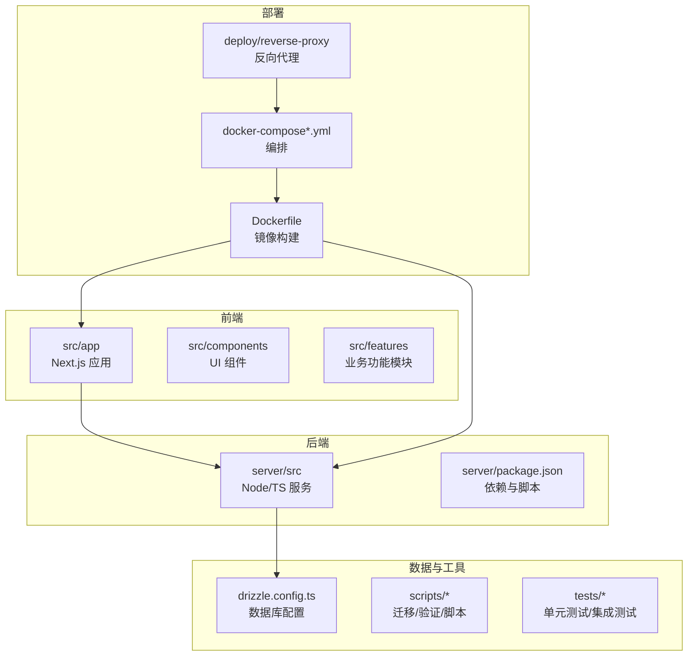
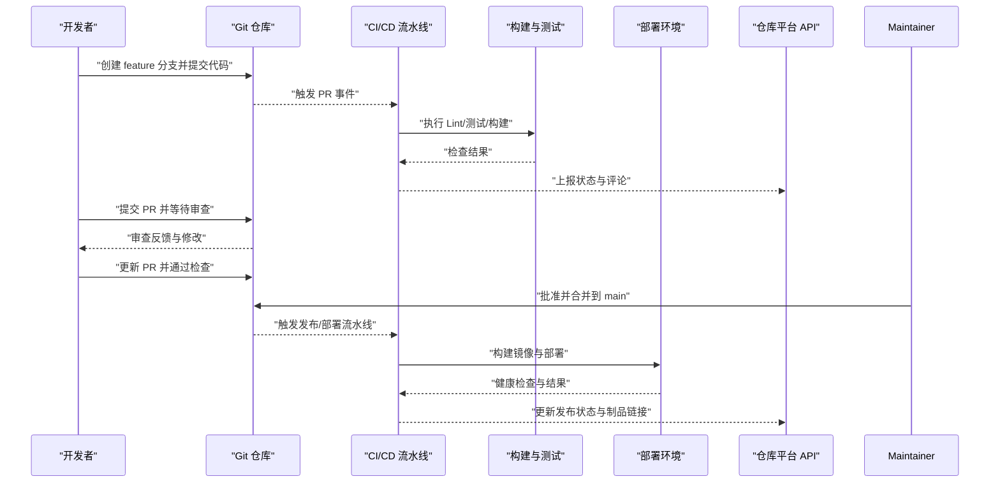
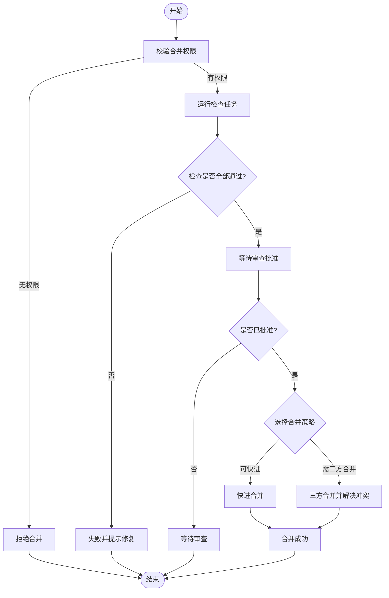
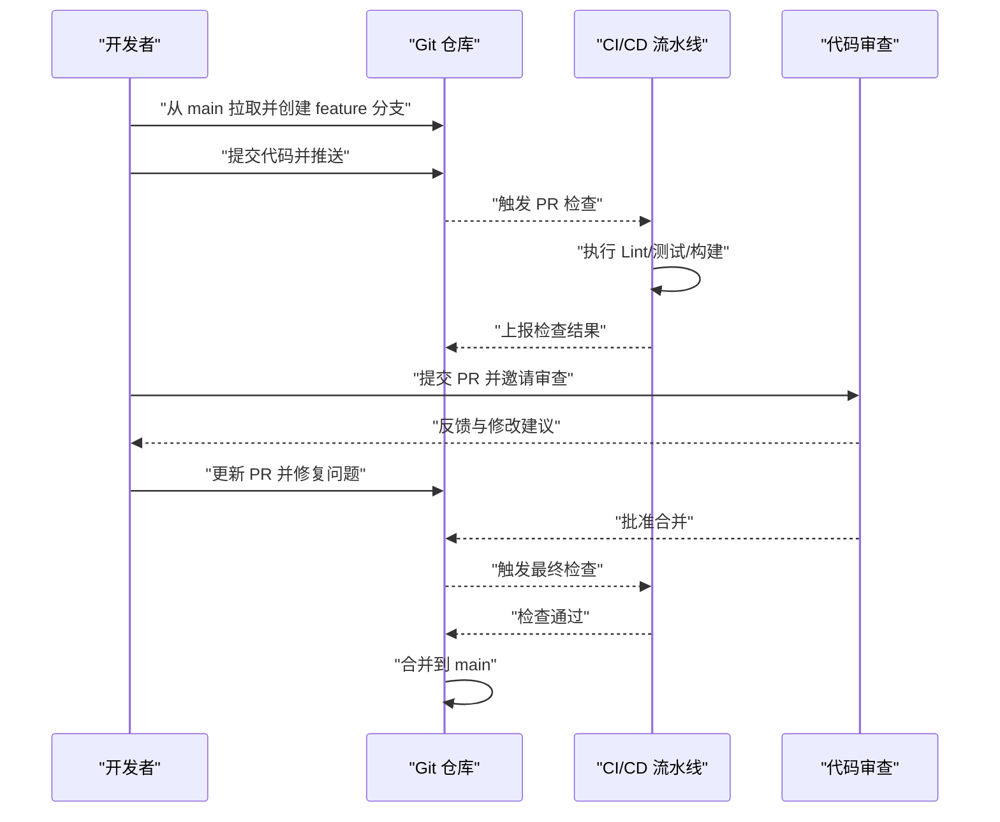
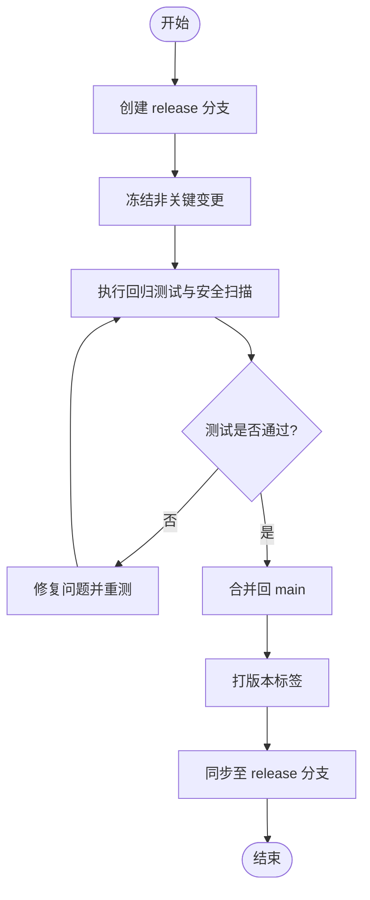
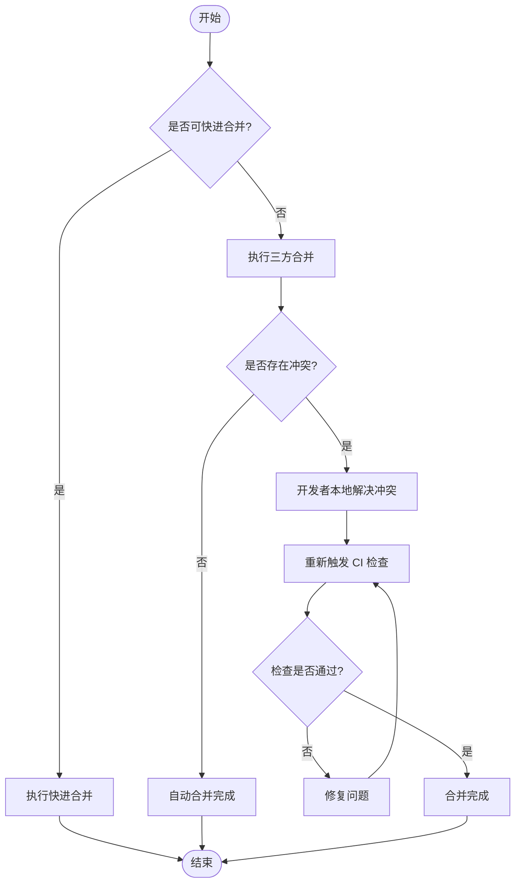
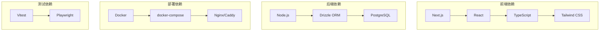

# 分支管理

<cite>
**本文引用的文件**   
- [package.json](file://package.json)
- [.gitignore](file://.gitignore)
- [Dockerfile](file://Dockerfile)
- [docker-compose.dev.yml](file://docker-compose.dev.yml)
- [docker-compose.prod.yml](file://docker-compose.prod.yml)
- [drizzle.config.ts](file://drizzle.config.ts)
- [next.config.ts](file://next.config.ts)
- [vitest.config.ts](file://vitest.config.ts)
- [vitest.pg.config.ts](file://vitest.pg.config.ts)
- [server/package.json](file://server/package.json)
- [server/tsconfig.json](file://server/tsconfig.json)
- [server/Dockerfile](file://server/Dockerfile)
- [deploy/reverse-proxy/Dockerfile](file://deploy/reverse-proxy/Dockerfile)
- [deploy/reverse-proxy/entrypoint.sh](file://deploy/reverse-proxy/entrypoint.sh)
- [scripts/setup/db-migrate.ts](file://scripts/setup/db-migrate.ts)
- [scripts/migration/sqlite-backup.ts](file://scripts/migration/sqlite-backup.ts)
- [scripts/verify/e2e-smoke.ts](file://scripts/verify/e2e-smoke.ts)
- [src/app/api/auth/login/route.ts](file://src/app/api/auth/login/route.ts)
- [src/features/auth/session.ts](file://src/features/auth/session.ts)
- [src/lib/config/index.ts](file://src/lib/config/index.ts)
</cite>

## 目录
1. [简介](#简介)
2. [项目结构](#项目结构)
3. [核心组件](#核心组件)
4. [架构总览](#架构总览)
5. [详细组件分析](#详细组件分析)
6. [依赖分析](#依赖分析)
7. [性能考虑](#性能考虑)
8. [故障排查指南](#故障排查指南)
9. [结论](#结论)
10. [附录](#附录)

## 简介
本文件为 PurpleInk 分支管理系统的权威文档，聚焦以下目标：
- 主分支保护策略：权限控制、提交限制、合并规则与检查门禁。
- 特性分支工作流：分支创建、开发流程、合并策略与评审要求。
- 发布分支管理：版本发布、热修复、分支同步与回滚策略。
- 分支合并策略：快进合并、三方合并、冲突解决与自动化校验。
- 协作与权限：角色模型、访问控制、代码审查与审计。
- API 与 Git 集成：通过仓库平台 API 实现分支保护、CI/CD 流水线与自动化操作示例。

说明：仓库中未发现显式的分支保护配置或 Git Hook 脚本，因此本文基于工程结构与部署配置给出可落地的最佳实践与实施建议，确保在主流 Git 平台（如 GitHub/GitLab）上可执行与可审计。

## 项目结构
PurpleInk 采用前后端分离与多包组织：
- 前端应用位于 src/，Next.js 路由与 API 路由集中在 src/app/ 下。
- 服务端逻辑位于 server/src/，独立构建与运行。
- 部署相关包含 Dockerfile 与 docker-compose 文件，以及反向代理配置。
- 测试与验证脚本位于 scripts/ 与 tests/。
- 数据库迁移与初始化脚本位于 scripts/setup 与 scripts/migration。

**图示来源** 
- [Dockerfile:1-50](file://Dockerfile#L1-L50)
- [docker-compose.dev.yml:1-80](file://docker-compose.dev.yml#L1-L80)
- [docker-compose.prod.yml:1-80](file://docker-compose.prod.yml#L1-L80)
- [server/package.json:1-60](file://server/package.json#L1-L60)
- [drizzle.config.ts:1-40](file://drizzle.config.ts#L1-L40)

**章节来源**
- [package.json:1-120](file://package.json#L1-L120)
- [server/package.json:1-120](file://server/package.json#L1-L120)
- [Dockerfile:1-120](file://Dockerfile#L1-L120)
- [docker-compose.dev.yml:1-120](file://docker-compose.dev.yml#L1-L120)
- [docker-compose.prod.yml:1-120](file://docker-compose.prod.yml#L1-L120)

## 核心组件
- 分支保护策略（建议）
  - 主分支（main/master）仅允许受保护的维护者合并；禁止直接推送。
  - 强制开启“请求前检查”：Lint、类型检查、单元测试、集成测试、安全扫描。
  - 合并策略默认“快进合并”，必要时启用“三方合并”并自动解决简单冲突。
  - 要求至少一名审查者批准，且所有检查必须通过。
- 特性分支工作流
  - 命名规范：feature/<短名>、fix/<短名>、chore/<短名>。
  - 从 main 拉取最新代码，小步提交，频繁 PR，避免长生命周期分支。
  - PR 模板与检查清单：变更范围、影响面、回归测试、文档更新。
- 发布分支管理
  - 版本分支：release/vX.Y.Z，冻结非关键变更，仅允许文档与补丁。
  - 热修复：hotfix/<短名> 从 release 或 main 拉取，快速修复后合并至 main 与 release。
  - 标签与制品：打 tag vX.Y.Z，生成制品并归档，记录变更日志。
- 合并策略与冲突解决
  - 优先快进合并；无法快进时启用三方合并，自动解决无冲突部分。
  - 冲突由开发者本地解决，重新触发 CI 检查。
  - 重大变更需额外回归测试与灰度发布。
- 权限与协作
  - 角色：Owner/Maintainer/Developer/Reporter。
  - Owner/Maintainer 拥有合并权；Developer 只能创建分支与提交 PR。
  - 审计：PR 审批、合并记录、变更追踪与告警。

[本节为通用实践说明，不直接分析具体文件]

## 架构总览
下图展示 PurpleInk 的端到端架构与分支管理在 CI/CD 中的集成点：
- 开发者在特性分支提交代码，触发 CI 检查（Lint、测试、构建）。
- PR 合并到 main 后，触发构建与部署流水线。
- 发布分支与热修复分支遵循严格的合并与标记流程。

**图示来源** 
- [Dockerfile:1-120](file://Dockerfile#L1-L120)
- [docker-compose.dev.yml:1-120](file://docker-compose.dev.yml#L1-L120)
- [docker-compose.prod.yml:1-120](file://docker-compose.prod.yml#L1-L120)
- [server/package.json:1-120](file://server/package.json#L1-L120)

[本节为概念性流程图，未映射到具体代码文件，故不附加“章节来源”]

## 详细组件分析

### 主分支保护策略
- 权限控制
  - 仅维护者可合并 main 分支；普通开发者不可直接推送。
  - 分支保护规则：禁止 force push、禁止删除分支、要求签名提交（可选）。
- 提交限制
  - 强制检查：ESLint、TypeScript 编译、单元测试、集成测试、安全扫描。
  - 提交信息规范：Conventional Commits 格式，便于自动生成变更日志。
- 合并规则
  - 默认快进合并；无法快进时使用三方合并。
  - 至少一名审查者批准；所有检查必须通过。
  - 重要变更需额外回归测试与灰度发布。

[本节为概念性流程图，未映射到具体代码文件，故不附加“图示来源”与“章节来源”]

### 特性分支工作流
- 分支创建
  - 从 main 拉取最新代码，创建 feature/<短名> 分支。
  - 使用分支名称描述变更内容，便于检索与统计。
- 开发流程
  - 小步提交，频繁 PR，避免长生命周期分支。
  - 每次提交触发 CI 检查，确保质量与一致性。
- 合并策略
  - PR 审查通过后，按策略合并到 main。
  - 复杂变更需拆分多个 PR，逐步合并。

**图示来源** 
- [server/package.json:1-120](file://server/package.json#L1-L120)
- [package.json:1-120](file://package.json#L1-L120)

**章节来源**
- [server/package.json:1-120](file://server/package.json#L1-L120)
- [package.json:1-120](file://package.json#L1-L120)

### 发布分支管理
- 版本发布
  - 从 main 创建 release/vX.Y.Z 分支，冻结非关键变更。
  - 执行完整回归测试与安全扫描。
  - 合并回 main 与 release 分支，打标签 vX.Y.Z。
- 热修复
  - 从 release 或 main 创建 hotfix/<短名> 分支。
  - 快速修复后合并至 main 与 release，并打补丁标签。
- 分支同步
  - 定期将 main 变更同步至 release 分支，保持版本一致性。
  - 冲突由维护者手动解决，确保稳定性。

[本节为概念性流程图，未映射到具体代码文件，故不附加“图示来源”与“章节来源”]

### 分支合并策略
- 快进合并
  - 当目标分支无新提交时，直接快进指针，保持线性历史。
- 三方合并
  - 当存在并行提交时，尝试自动合并；冲突由开发者本地解决。
- 冲突解决
  - 冲突文件由开发者手动合并，确保逻辑正确性。
  - 重新触发 CI 检查，确保无回归问题。

[本节为概念性流程图，未映射到具体代码文件，故不附加“图示来源”与“章节来源”]

### 权限控制与协作功能
- 角色模型
  - Owner：完全权限，负责仓库治理与发布。
  - Maintainer：合并权限，负责代码审查与分支保护。
  - Developer：提交与 PR 权限，负责开发与测试。
  - Reporter：只读权限，用于监控与审计。
- 访问控制
  - 分支保护规则：禁止直接推送、强制检查、审查批准。
  - 敏感操作审计：合并、打标签、删除分支等。
- 协作功能
  - PR 模板与检查清单，确保变更质量。
  - 代码审查与讨论，记录决策与依据。
  - 自动化通知与告警，及时响应问题。

[本节为通用实践说明，不直接分析具体文件]

### API 与 Git 集成示例
- 分支保护 API
  - 使用仓库平台 API 设置分支保护规则，如禁止直接推送、强制检查等。
  - 示例：GitHub Branch Protection API、GitLab Protected Branches API。
- CI/CD 集成
  - 通过 Webhook 触发 CI 流水线，执行检查与构建。
  - 示例：GitHub Actions、GitLab CI/CD。
- 自动化操作
  - 使用 API 创建分支、提交代码、创建 PR、合并分支等。
  - 示例：Git CLI、HTTP API 调用。

[本节为通用实践说明，不直接分析具体文件]

## 依赖分析
- 前端依赖
  - Next.js、React、TypeScript、Tailwind CSS 等。
- 后端依赖
  - Node.js、Express/Fastify、Drizzle ORM、PostgreSQL 等。
- 部署依赖
  - Docker、docker-compose、Nginx/Caddy 等。
- 测试依赖
  - Vitest、Jest、Playwright 等。

**图示来源** 
- [package.json:1-120](file://package.json#L1-L120)
- [server/package.json:1-120](file://server/package.json#L1-L120)
- [drizzle.config.ts:1-40](file://drizzle.config.ts#L1-L40)

**章节来源**
- [package.json:1-120](file://package.json#L1-L120)
- [server/package.json:1-120](file://server/package.json#L1-L120)
- [drizzle.config.ts:1-40](file://drizzle.config.ts#L1-L40)

## 性能考虑
- 分支合并频率
  - 小步合并，减少冲突与回归风险。
- CI/CD 优化
  - 并行执行检查任务，缓存依赖与构建产物。
  - 增量测试，仅运行受影响模块的测试。
- 资源管理
  - 合理分配 CI 资源，避免队列拥堵。
  - 监控构建与部署时间，优化瓶颈。

[本节为通用实践说明，不直接分析具体文件]

## 故障排查指南
- 常见问题
  - 分支保护规则错误：检查权限配置与检查任务。
  - CI 检查失败：查看日志并修复问题。
  - 合并冲突：手动解决冲突并重新触发检查。
- 调试工具
  - 使用 Git 日志与差异对比工具。
  - 查看 CI/CD 流水线日志与构建产物。
- 恢复策略
  - 回滚到上一个稳定版本。
  - 使用备份恢复数据与配置。

[本节为通用实践说明，不直接分析具体文件]

## 结论
PurpleInk 的分支管理系统应遵循严格的保护策略与工作流，确保代码质量与发布稳定性。通过权限控制、自动化检查与协作功能，提升团队效率与产品可靠性。建议在主流 Git 平台上实施分支保护规则，并结合 CI/CD 流水线实现自动化操作与审计。

[本节为总结性内容，不直接分析具体文件]

## 附录
- 参考文档
  - Git 官方文档：分支管理与合并策略。
  - 仓库平台 API：分支保护与自动化操作。
  - CI/CD 最佳实践：流水线设计与优化。
- 工具推荐
  - Git CLI、GitHub CLI、GitLab CLI。
  - VS Code、IntelliJ IDEA 等 IDE 插件。
  - 代码审查工具：GitHub Pull Requests、GitLab Merge Requests。

[本节为参考资料，不直接分析具体文件]