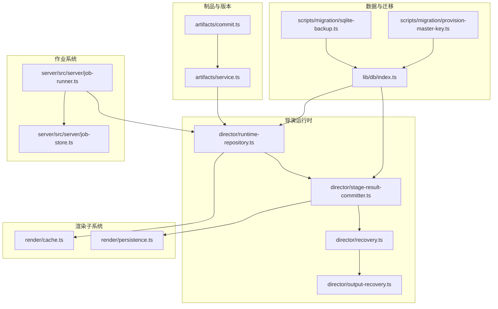
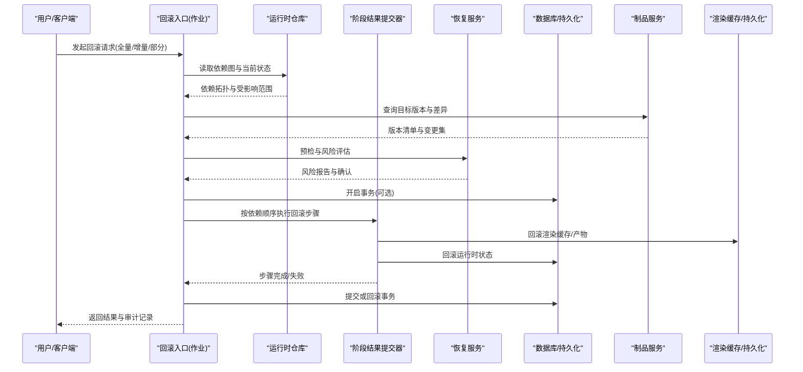
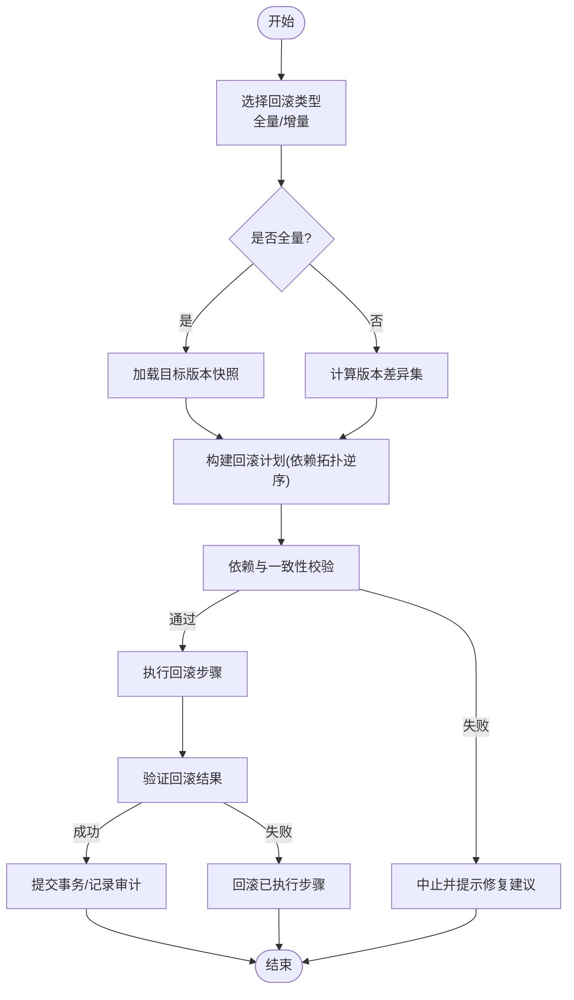
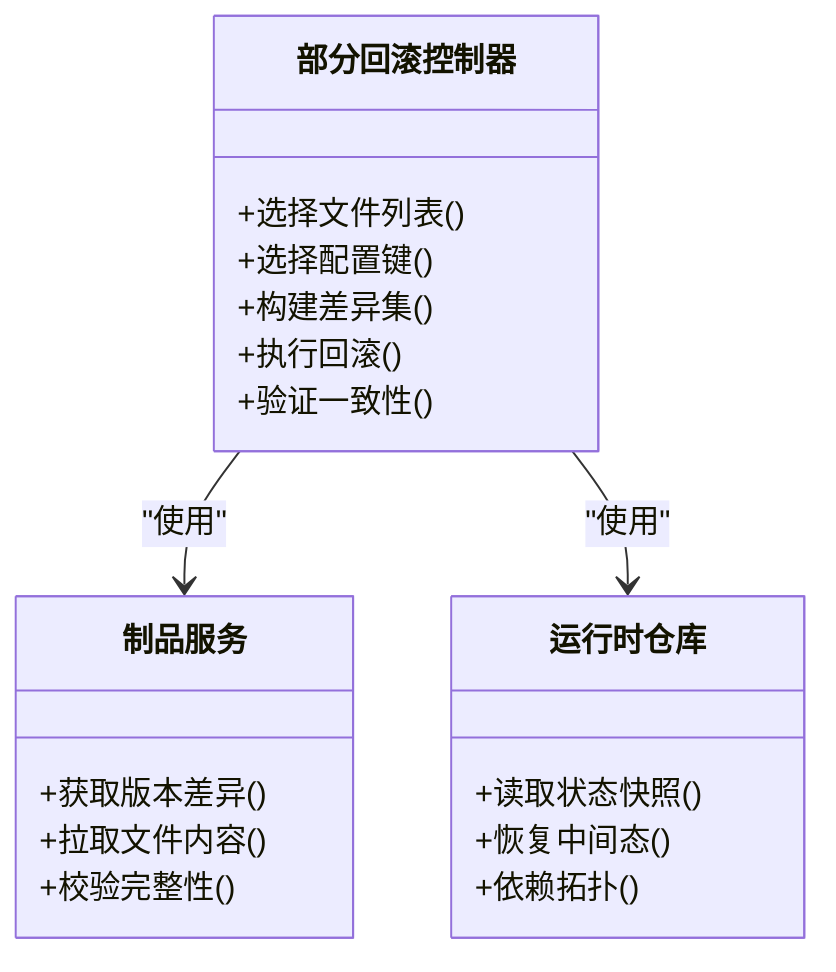
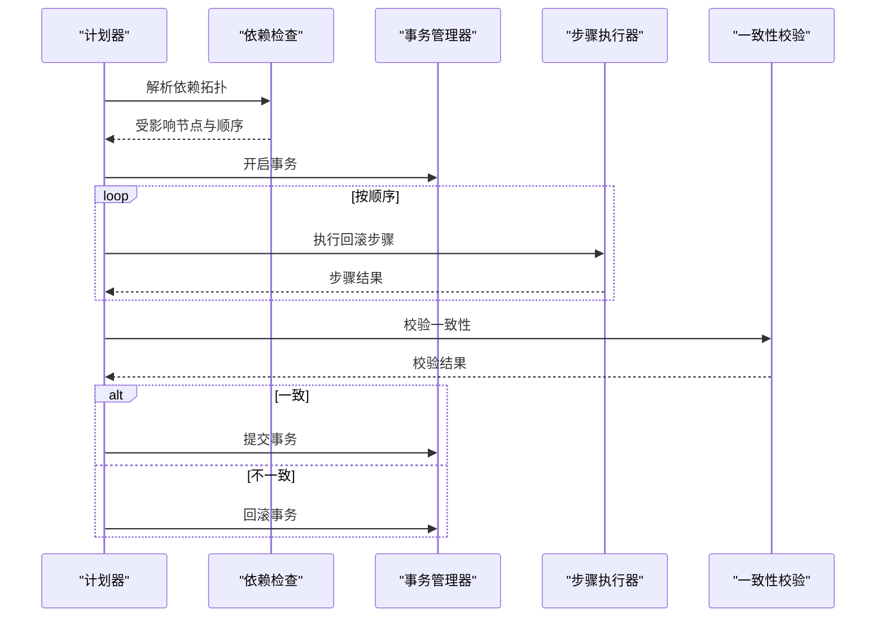
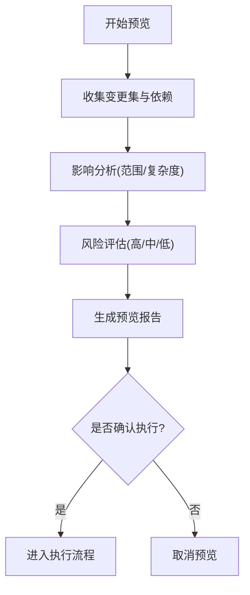
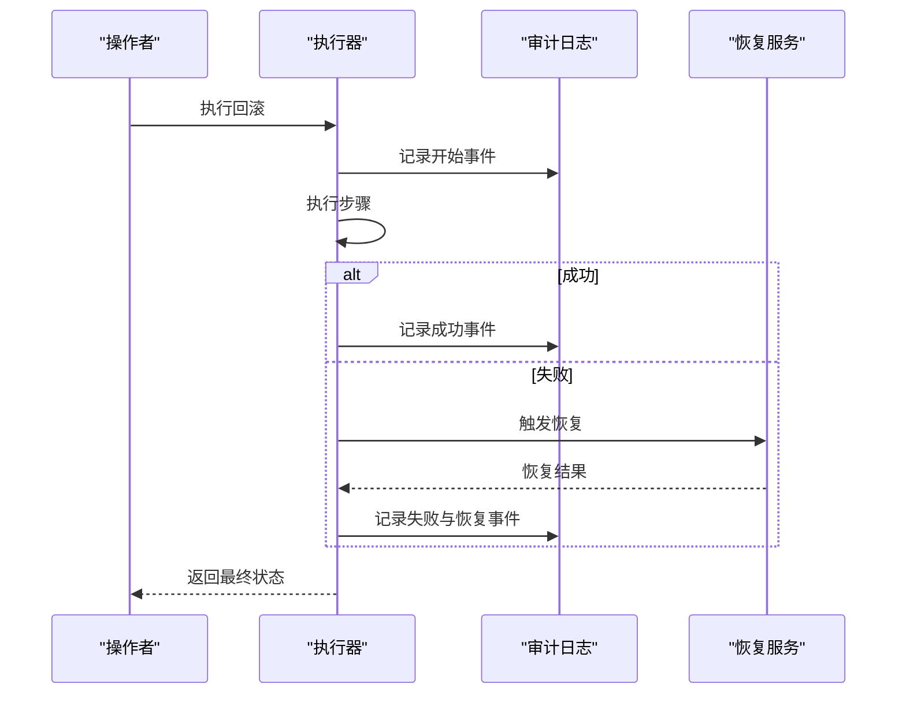
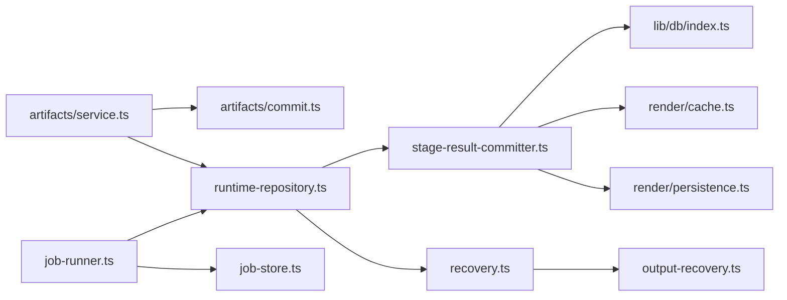

# 回滚机制

<cite>
**本文引用的文件**   
- [src/features/artifacts/commit.ts](file://src/features/artifacts/commit.ts)
- [src/features/artifacts/service.ts](file://src/features/artifacts/service.ts)
- [src/features/director/runtime-repository.ts](file://src/features/director/runtime-repository.ts)
- [src/features/director/stage-result-committer.ts](file://src/features/director/stage-result-committer.ts)
- [src/features/director/recovery.ts](file://src/features/director/recovery.ts)
- [src/features/director/output-recovery.ts](file://src/features/director/output-recovery.ts)
- [src/features/render/cache.ts](file://src/features/render/cache.ts)
- [src/features/render/persistence.ts](file://src/features/render/persistence.ts)
- [src/lib/db/index.ts](file://src/lib/db/index.ts)
- [server/src/server/job-runner.ts](file://server/src/server/job-runner.ts)
- [server/src/server/job-store.ts](file://server/src/server/job-store.ts)
- [scripts/migration/sqlite-backup.ts](file://scripts/migration/sqlite-backup.ts)
- [scripts/migration/provision-master-key.ts](file://scripts/migration/provision-master-key.ts)
</cite>

## 目录
1. [简介](#简介)
2. [项目结构](#项目结构)
3. [核心组件](#核心组件)
4. [架构总览](#架构总览)
5. [详细组件分析](#详细组件分析)
6. [依赖关系分析](#依赖关系分析)
7. [性能考量](#性能考量)
8. [故障排查指南](#故障排查指南)
9. [结论](#结论)
10. [附录](#附录)

## 简介
本文件系统化阐述 PurpleInk 的回滚机制，覆盖版本回退（全量/增量）、依赖处理、部分回滚（选择性文件与配置项）、级联更新策略（依赖检查、事务管理、一致性保证）、回滚预览（影响分析、风险评估、操作确认）、审计日志与错误处理，以及回滚 API 接口与最佳实践。文档面向不同技术背景的读者，提供从概览到代码级的分层说明与可视化图示。

## 项目结构
围绕回滚能力，代码主要分布在以下模块：
- 制品与版本提交：artifacts 子域负责制品的提交、快照与版本化。
- 导演运行时：director 子域负责阶段执行、结果持久化、恢复与输出恢复。
- 渲染子系统：render 子域负责缓存、持久化与媒体产物管理。
- 数据库与迁移：lib/db 与 scripts/migration 提供数据层与备份/主密钥能力。
- 作业运行器：server/src/server 提供作业调度与状态存储。

**图表来源** 
- [src/features/artifacts/commit.ts](file://src/features/artifacts/commit.ts)
- [src/features/artifacts/service.ts](file://src/features/artifacts/service.ts)
- [src/features/director/runtime-repository.ts](file://src/features/director/runtime-repository.ts)
- [src/features/director/stage-result-committer.ts](file://src/features/director/stage-result-committer.ts)
- [src/features/director/recovery.ts](file://src/features/director/recovery.ts)
- [src/features/director/output-recovery.ts](file://src/features/director/output-recovery.ts)
- [src/features/render/cache.ts](file://src/features/render/cache.ts)
- [src/features/render/persistence.ts](file://src/features/render/persistence.ts)
- [src/lib/db/index.ts](file://src/lib/db/index.ts)
- [scripts/migration/sqlite-backup.ts](file://scripts/migration/sqlite-backup.ts)
- [scripts/migration/provision-master-key.ts](file://scripts/migration/provision-master-key.ts)
- [server/src/server/job-runner.ts](file://server/src/server/job-runner.ts)
- [server/src/server/job-store.ts](file://server/src/server/job-store.ts)

**章节来源**
- [src/features/artifacts/commit.ts](file://src/features/artifacts/commit.ts)
- [src/features/artifacts/service.ts](file://src/features/artifacts/service.ts)
- [src/features/director/runtime-repository.ts](file://src/features/director/runtime-repository.ts)
- [src/features/director/stage-result-committer.ts](file://src/features/director/stage-result-committer.ts)
- [src/features/director/recovery.ts](file://src/features/director/recovery.ts)
- [src/features/director/output-recovery.ts](file://src/features/director/output-recovery.ts)
- [src/features/render/cache.ts](file://src/features/render/cache.ts)
- [src/features/render/persistence.ts](file://src/features/render/persistence.ts)
- [src/lib/db/index.ts](file://src/lib/db/index.ts)
- [scripts/migration/sqlite-backup.ts](file://scripts/migration/sqlite-backup.ts)
- [scripts/migration/provision-master-key.ts](file://scripts/migration/provision-master-key.ts)
- [server/src/server/job-runner.ts](file://server/src/server/job-runner.ts)
- [server/src/server/job-store.ts](file://server/src/server/job-store.ts)

## 核心组件
- 制品提交与版本化：通过 artifacts 提交制品并生成可回滚的版本标记，支持按版本选择回退目标。
- 阶段结果提交器：在阶段完成后将结果原子写入持久化层，确保回滚点的一致性。
- 运行时仓库：维护运行时状态与依赖图，支撑依赖检查与级联回滚。
- 恢复与输出恢复：对失败或异常场景进行自动恢复，保障回滚过程的可观测性与可恢复性。
- 渲染缓存与持久化：为回滚提供快速重建与一致性校验能力。
- 作业运行器与存储：以作业为单位组织回滚任务，提供幂等与重试保障。
- 数据备份与主密钥：为全量回滚提供数据快照与加密能力。

**章节来源**
- [src/features/artifacts/commit.ts](file://src/features/artifacts/commit.ts)
- [src/features/artifacts/service.ts](file://src/features/artifacts/service.ts)
- [src/features/director/runtime-repository.ts](file://src/features/director/runtime-repository.ts)
- [src/features/director/stage-result-committer.ts](file://src/features/director/stage-result-committer.ts)
- [src/features/director/recovery.ts](file://src/features/director/recovery.ts)
- [src/features/director/output-recovery.ts](file://src/features/director/output-recovery.ts)
- [src/features/render/cache.ts](file://src/features/render/cache.ts)
- [src/features/render/persistence.ts](file://src/features/render/persistence.ts)
- [server/src/server/job-runner.ts](file://server/src/server/job-runner.ts)
- [server/src/server/job-store.ts](file://server/src/server/job-store.ts)
- [scripts/migration/sqlite-backup.ts](file://scripts/migration/sqlite-backup.ts)
- [scripts/migration/provision-master-key.ts](file://scripts/migration/provision-master-key.ts)

## 架构总览
回滚流程由“触发—评估—执行—验证—审计”五阶段组成，贯穿制品、运行时、渲染与数据层。

**图表来源** 
- [src/features/director/runtime-repository.ts](file://src/features/director/runtime-repository.ts)
- [src/features/director/stage-result-committer.ts](file://src/features/director/stage-result-committer.ts)
- [src/features/director/recovery.ts](file://src/features/director/recovery.ts)
- [src/features/artifacts/service.ts](file://src/features/artifacts/service.ts)
- [src/features/render/cache.ts](file://src/features/render/cache.ts)
- [src/features/render/persistence.ts](file://src/features/render/persistence.ts)
- [server/src/server/job-runner.ts](file://server/src/server/job-runner.ts)
- [server/src/server/job-store.ts](file://server/src/server/job-store.ts)

## 详细组件分析

### 制品与版本回滚（全量/增量）
- 全量回滚：基于制品服务的版本清单，定位目标版本的完整快照，按依赖拓扑逆序应用变更，确保一致性。
- 增量回滚：对比当前版本与目标版本，仅回滚差异路径，减少 IO 与锁竞争。
- 依赖处理：依据运行时仓库的依赖图，计算最小受影响集合，避免不必要回滚。

**图表来源** 
- [src/features/artifacts/service.ts](file://src/features/artifacts/service.ts)
- [src/features/artifacts/commit.ts](file://src/features/artifacts/commit.ts)
- [src/features/director/runtime-repository.ts](file://src/features/director/runtime-repository.ts)

**章节来源**
- [src/features/artifacts/commit.ts](file://src/features/artifacts/commit.ts)
- [src/features/artifacts/service.ts](file://src/features/artifacts/service.ts)
- [src/features/director/runtime-repository.ts](file://src/features/director/runtime-repository.ts)

### 部分回滚（选择性文件与配置项）
- 选择性文件回滚：基于制品路径与元数据过滤，仅回滚指定文件或目录，适用于局部修复。
- 配置项回滚：针对配置键值进行细粒度回滚，避免整配置块回滚带来的副作用。
- 状态恢复：结合运行时仓库的状态快照，恢复关键中间态，确保业务连续性。

**图表来源** 
- [src/features/artifacts/service.ts](file://src/features/artifacts/service.ts)
- [src/features/director/runtime-repository.ts](file://src/features/director/runtime-repository.ts)

**章节来源**
- [src/features/artifacts/service.ts](file://src/features/artifacts/service.ts)
- [src/features/director/runtime-repository.ts](file://src/features/director/runtime-repository.ts)

### 级联更新策略（依赖检查、事务管理、一致性保证）
- 依赖检查：基于运行时仓库的依赖图，计算受影响节点集合，确保回滚顺序正确。
- 事务管理：在数据层开启事务，保证多步回滚的原子性；失败时自动回滚已执行步骤。
- 一致性保证：通过制品完整性校验与运行时状态比对，确保回滚后状态一致。

**图表来源** 
- [src/features/director/runtime-repository.ts](file://src/features/director/runtime-repository.ts)
- [src/features/director/stage-result-committer.ts](file://src/features/director/stage-result-committer.ts)
- [src/lib/db/index.ts](file://src/lib/db/index.ts)

**章节来源**
- [src/features/director/runtime-repository.ts](file://src/features/director/runtime-repository.ts)
- [src/features/director/stage-result-committer.ts](file://src/features/director/stage-result-committer.ts)
- [src/lib/db/index.ts](file://src/lib/db/index.ts)

### 回滚预览（影响分析、风险评估、操作确认）
- 影响分析：基于制品差异与依赖拓扑，生成受影响范围与变更摘要。
- 风险评估：识别高风险步骤（如大文件替换、强依赖变更），给出缓解建议。
- 操作确认：在 UI 或 API 中展示预览结果，要求显式确认后方可执行。

**图表来源** 
- [src/features/artifacts/service.ts](file://src/features/artifacts/service.ts)
- [src/features/director/runtime-repository.ts](file://src/features/director/runtime-repository.ts)

**章节来源**
- [src/features/artifacts/service.ts](file://src/features/artifacts/service.ts)
- [src/features/director/runtime-repository.ts](file://src/features/director/runtime-repository.ts)

### 回滚审计日志与错误处理
- 审计日志：记录每次回滚的请求、步骤、结果与耗时，便于追溯与复盘。
- 错误处理：捕获异常并分类（网络、IO、校验失败），提供重试与降级策略。
- 恢复机制：结合 recovery 与 output-recovery，实现失败后的自动恢复与补偿。

**图表来源** 
- [src/features/director/recovery.ts](file://src/features/director/recovery.ts)
- [src/features/director/output-recovery.ts](file://src/features/director/output-recovery.ts)

**章节来源**
- [src/features/director/recovery.ts](file://src/features/director/recovery.ts)
- [src/features/director/output-recovery.ts](file://src/features/director/output-recovery.ts)

### 回滚 API 接口与最佳实践
- 接口设计：提供统一入口，支持全量/增量/部分回滚参数，返回预览与执行结果。
- 幂等性：同一请求多次调用应产生相同结果，避免重复回滚。
- 最佳实践：
  - 先预览再执行，确保影响可控。
  - 小步快跑，优先增量与部分回滚。
  - 保留最近 N 个版本快照，便于快速回退。
  - 严格依赖检查，避免环依赖导致的死锁。

[本节为通用指导，不直接分析具体文件]

## 依赖关系分析
回滚相关组件之间的依赖关系如下：

**图表来源** 
- [src/features/artifacts/service.ts](file://src/features/artifacts/service.ts)
- [src/features/artifacts/commit.ts](file://src/features/artifacts/commit.ts)
- [src/features/director/runtime-repository.ts](file://src/features/director/runtime-repository.ts)
- [src/features/director/stage-result-committer.ts](file://src/features/director/stage-result-committer.ts)
- [src/lib/db/index.ts](file://src/lib/db/index.ts)
- [src/features/render/cache.ts](file://src/features/render/cache.ts)
- [src/features/render/persistence.ts](file://src/features/render/persistence.ts)
- [src/features/director/recovery.ts](file://src/features/director/recovery.ts)
- [src/features/director/output-recovery.ts](file://src/features/director/output-recovery.ts)
- [server/src/server/job-runner.ts](file://server/src/server/job-runner.ts)
- [server/src/server/job-store.ts](file://server/src/server/job-store.ts)

**章节来源**
- [src/features/artifacts/service.ts](file://src/features/artifacts/service.ts)
- [src/features/artifacts/commit.ts](file://src/features/artifacts/commit.ts)
- [src/features/director/runtime-repository.ts](file://src/features/director/runtime-repository.ts)
- [src/features/director/stage-result-committer.ts](file://src/features/director/stage-result-committer.ts)
- [src/lib/db/index.ts](file://src/lib/db/index.ts)
- [src/features/render/cache.ts](file://src/features/render/cache.ts)
- [src/features/render/persistence.ts](file://src/features/render/persistence.ts)
- [src/features/director/recovery.ts](file://src/features/director/recovery.ts)
- [src/features/director/output-recovery.ts](file://src/features/director/output-recovery.ts)
- [server/src/server/job-runner.ts](file://server/src/server/job-runner.ts)
- [server/src/server/job-store.ts](file://server/src/server/job-store.ts)

## 性能考量
- 增量优先：优先采用增量回滚，减少 IO 与锁竞争。
- 并行与批处理：对无依赖的步骤并行执行，批量写入降低事务开销。
- 缓存预热：回滚前预热常用缓存，提升一致性校验速度。
- 资源限制：限制并发度与内存占用，避免 OOM 与 CPU 抖动。

[本节为通用指导，不直接分析具体文件]

## 故障排查指南
- 常见问题：
  - 依赖冲突：检查依赖拓扑是否存在环或不可达节点。
  - 权限不足：确认文件系统与数据库权限。
  - 版本缺失：确认目标版本快照存在且完整。
- 诊断步骤：
  - 查看审计日志，定位失败步骤与错误码。
  - 检查运行时状态快照与制品完整性。
  - 使用恢复服务进行补偿与重试。

**章节来源**
- [src/features/director/recovery.ts](file://src/features/director/recovery.ts)
- [src/features/director/output-recovery.ts](file://src/features/director/output-recovery.ts)

## 结论
PurpleInk 的回滚机制以制品版本化为核心，结合运行时依赖管理与事务一致性，提供全量/增量/部分回滚能力。通过预览与审计，确保操作安全可追溯；借助恢复与输出恢复，提升鲁棒性。遵循最佳实践与性能优化建议，可在复杂场景中稳定回滚。

[本节为总结，不直接分析具体文件]

## 附录
- 数据备份与主密钥：
  - 使用 sqlite-backup 进行数据快照，配合 provision-master-key 管理加密密钥，为全量回滚提供基础能力。

**章节来源**
- [scripts/migration/sqlite-backup.ts](file://scripts/migration/sqlite-backup.ts)
- [scripts/migration/provision-master-key.ts](file://scripts/migration/provision-master-key.ts)