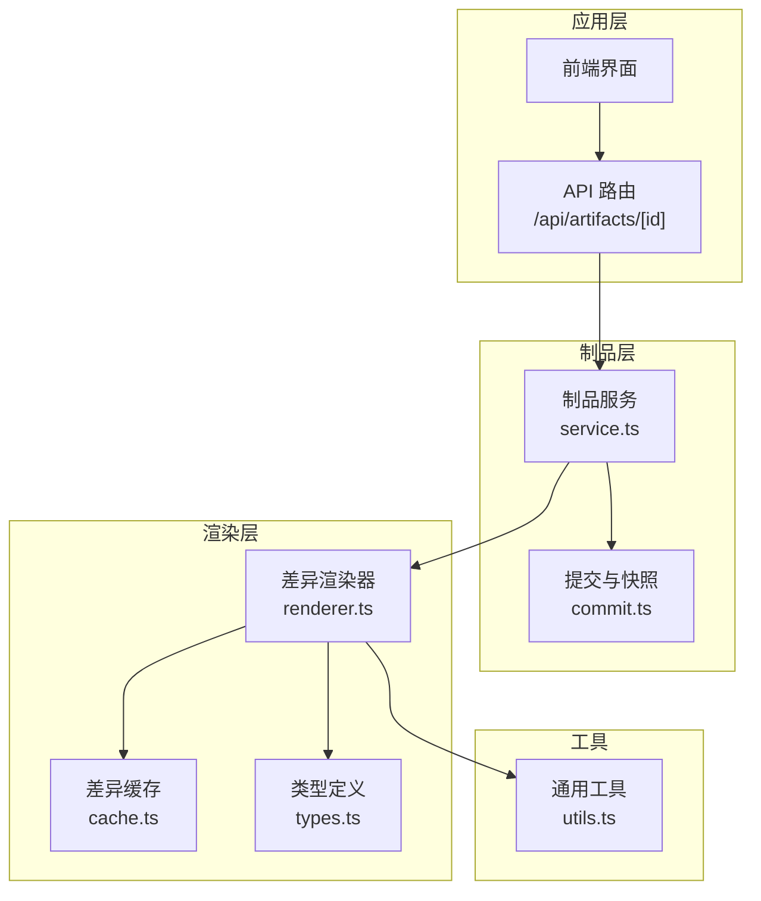
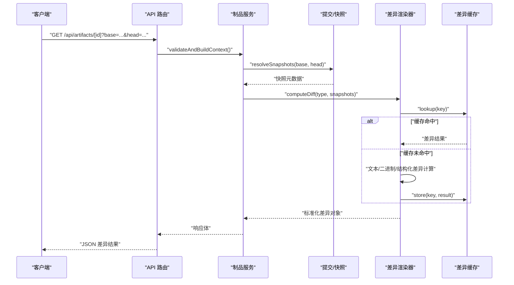
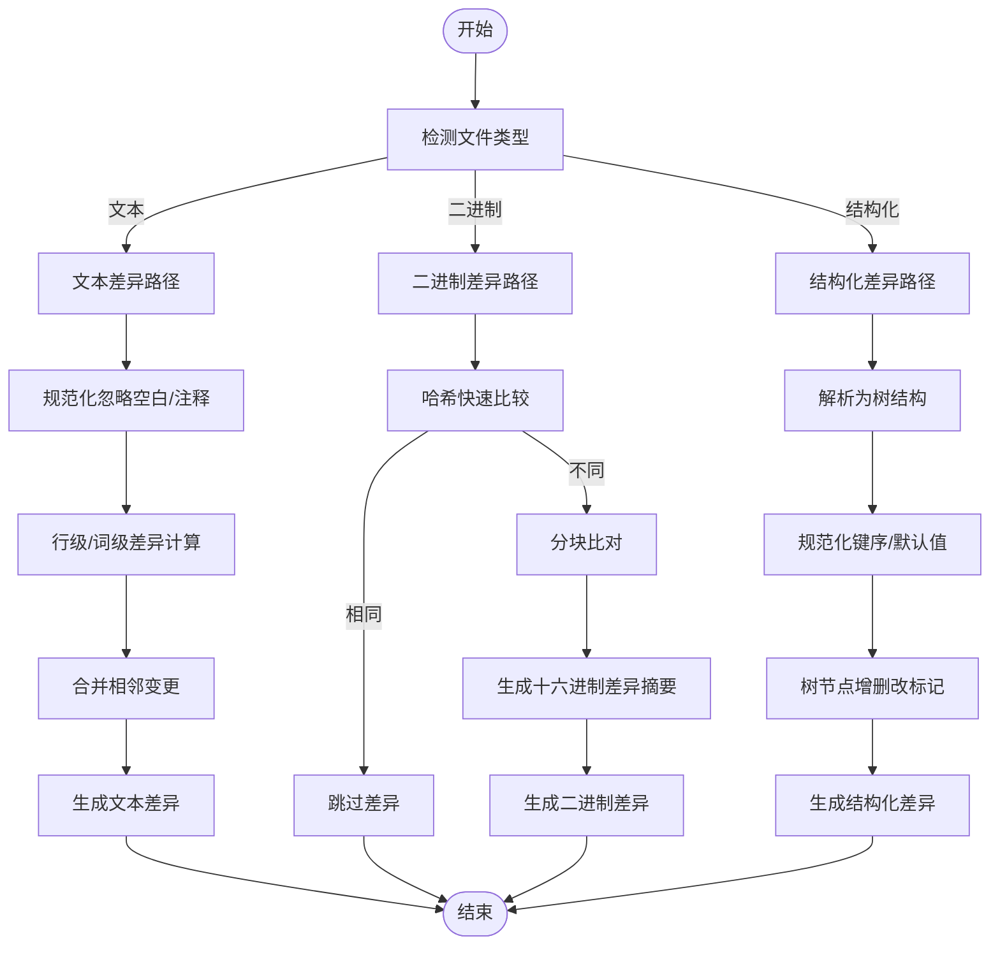
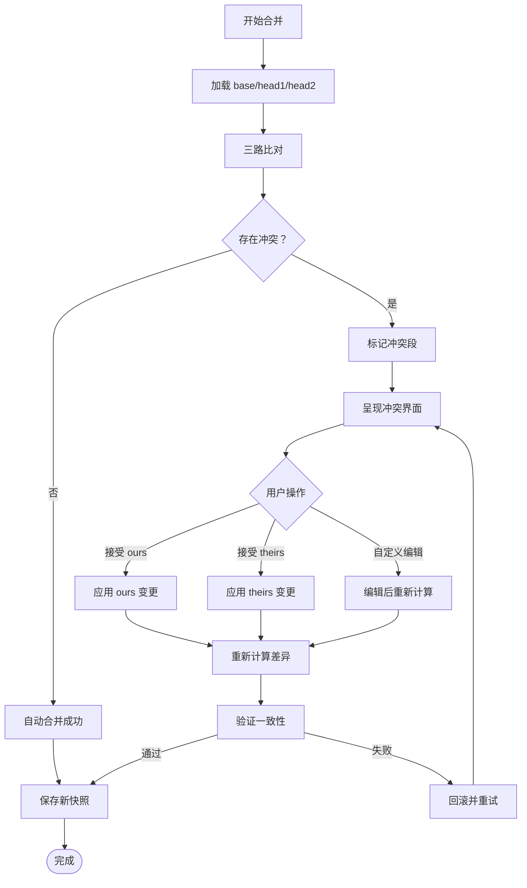
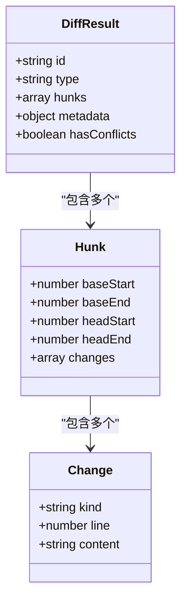
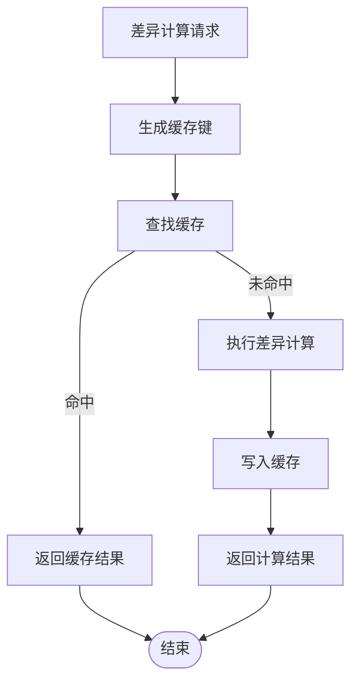
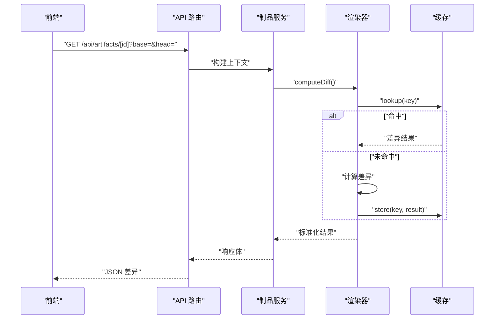
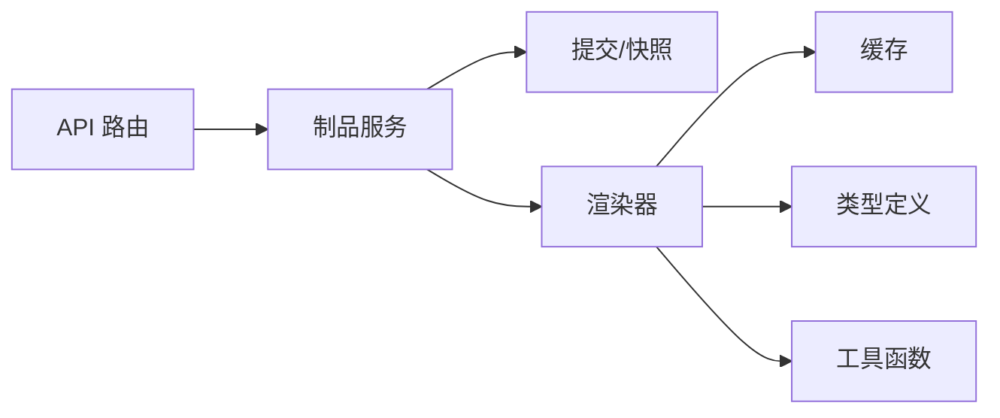

# 差异对比

<cite>
**本文引用的文件**   
- [src/features/artifacts/commit.ts](file://src/features/artifacts/commit.ts)
- [src/features/artifacts/service.ts](file://src/features/artifacts/service.ts)
- [src/features/render/cache.ts](file://src/features/render/cache.ts)
- [src/features/render/renderer.ts](file://src/features/render/renderer.ts)
- [src/features/render/types.ts](file://src/features/render/types.ts)
- [src/app/api/artifacts/[id]/route.ts](file://src/app/api/artifacts/[id]/route.ts)
- [src/lib/utils.ts](file://src/lib/utils.ts)
</cite>

## 目录
1. [简介](#简介)
2. [项目结构](#项目结构)
3. [核心组件](#核心组件)
4. [架构总览](#架构总览)
5. [详细组件分析](#详细组件分析)
6. [依赖分析](#依赖分析)
7. [性能考虑](#性能考虑)
8. [故障排查指南](#故障排查指南)
9. [结论](#结论)
10. [附录](#附录)

## 简介
本文件为 PurpleInk 差异对比系统的技术文档，聚焦于“差异计算、内容对比、合并冲突解决、差异展示、性能优化与缓存策略、API 接口与集成示例”。基于仓库中 artifacts（制品）与 render（渲染）模块的实现，本文梳理了从输入到输出的完整流程，并给出可视化图示与可操作的排障建议。

## 项目结构
PurpleInk 的差异对比能力主要分布在以下位置：
- 制品层（artifacts）：负责版本化提交、快照生成与服务编排
- 渲染层（render）：负责差异计算、缓存、媒体处理与结果输出
- API 层（app/api）：对外暴露差异查询与获取的接口
- 工具库（lib）：通用工具函数

图表来源 
- [src/app/api/artifacts/[id]/route.ts](file://src/app/api/artifacts/[id]/route.ts)
- [src/features/artifacts/service.ts](file://src/features/artifacts/service.ts)
- [src/features/artifacts/commit.ts](file://src/features/artifacts/commit.ts)
- [src/features/render/renderer.ts](file://src/features/render/renderer.ts)
- [src/features/render/cache.ts](file://src/features/render/cache.ts)
- [src/features/render/types.ts](file://src/features/render/types.ts)
- [src/lib/utils.ts](file://src/lib/utils.ts)

章节来源
- [src/app/api/artifacts/[id]/route.ts](file://src/app/api/artifacts/[id]/route.ts)
- [src/features/artifacts/service.ts](file://src/features/artifacts/service.ts)
- [src/features/artifacts/commit.ts](file://src/features/artifacts/commit.ts)
- [src/features/render/renderer.ts](file://src/features/render/renderer.ts)
- [src/features/render/cache.ts](file://src/features/render/cache.ts)
- [src/features/render/types.ts](file://src/features/render/types.ts)
- [src/lib/utils.ts](file://src/lib/utils.ts)

## 核心组件
- 制品提交与快照（commit.ts）
  - 职责：对制品进行版本化提交、生成快照标识、维护变更历史
  - 关键点：幂等提交、快照哈希、增量记录
- 制品服务（service.ts）
  - 职责：协调提交、读取、差异计算与结果组装
  - 关键点：输入校验、上下文构建、调用渲染器、返回标准化结果
- 差异渲染器（renderer.ts）
  - 职责：执行文本/二进制/结构化数据的差异计算，产出行级或块级差异
  - 关键点：算法选择、流式处理、大文件分片、结构化解析
- 差异缓存（cache.ts）
  - 职责：缓存已计算的差异结果，支持按键命中与失效策略
  - 关键点：键设计、TTL、内存/磁盘分层、并发安全
- 类型定义（types.ts）
  - 职责：统一差异数据结构、状态码、错误模型
  - 关键点：可扩展字段、向后兼容、严格类型约束
- API 路由（[id]/route.ts）
  - 职责：接收请求、鉴权与参数校验、调用服务、返回响应
  - 关键点：分页/过滤、错误映射、速率限制

章节来源
- [src/features/artifacts/commit.ts](file://src/features/artifacts/commit.ts)
- [src/features/artifacts/service.ts](file://src/features/artifacts/service.ts)
- [src/features/render/renderer.ts](file://src/features/render/renderer.ts)
- [src/features/render/cache.ts](file://src/features/render/cache.ts)
- [src/features/render/types.ts](file://src/features/render/types.ts)
- [src/app/api/artifacts/[id]/route.ts](file://src/app/api/artifacts/[id]/route.ts)

## 架构总览
差异对比系统采用“制品层 + 渲染层”的分层架构。API 路由作为入口，将请求委派给制品服务；制品服务根据输入类型选择合适的数据源与处理器，交由渲染器执行差异计算；渲染器通过缓存加速重复计算，最终返回标准化的差异结果。

图表来源 
- [src/app/api/artifacts/[id]/route.ts](file://src/app/api/artifacts/[id]/route.ts)
- [src/features/artifacts/service.ts](file://src/features/artifacts/service.ts)
- [src/features/artifacts/commit.ts](file://src/features/artifacts/commit.ts)
- [src/features/render/renderer.ts](file://src/features/render/renderer.ts)
- [src/features/render/cache.ts](file://src/features/render/cache.ts)

## 详细组件分析

### 差异计算与内容对比
- 文本对比
  - 行级差异：基于最长公共子序列（LCS）或 Myers 差分算法，输出插入、删除、修改标记
  - 词级/字符级高亮：在行内进一步定位变更片段，便于前端渲染
  - 忽略空白与注释：提供配置项以忽略无关变更
- 二进制文件处理
  - 快速路径：先比较哈希，相同则直接跳过
  - 分块比对：对大文件按固定大小分块，仅对差异块生成差异摘要
  - 十六进制视图：提供字节级差异预览
- 结构化数据对比（JSON/XML）
  - 规范化：去除键顺序、空白、默认值等噪声
  - 语义对比：按节点树进行增删改标记，保留层级关系
  - 媒体文件差异：对图片/视频提取关键帧或元数据进行对比，避免全量二进制比较
- 大文件优化
  - 流式读取：避免一次性加载至内存
  - 并行分片：多核环境下并行计算分片差异后合并
  - 增量更新：基于上次差异结果进行局部重算

图表来源 
- [src/features/render/renderer.ts](file://src/features/render/renderer.ts)
- [src/features/render/types.ts](file://src/features/render/types.ts)
- [src/lib/utils.ts](file://src/lib/utils.ts)

章节来源
- [src/features/render/renderer.ts](file://src/features/render/renderer.ts)
- [src/features/render/types.ts](file://src/features/render/types.ts)
- [src/lib/utils.ts](file://src/lib/utils.ts)

### 合并冲突解决机制
- 自动合并策略
  - 文本：基于三方合并（ours/theirs/base），优先保留非重叠变更
  - 结构化：按节点路径合并，冲突时标记并保留双方分支
  - 二进制：无法自动合并时回退为提示用户手动选择
- 冲突检测
  - 基于共同祖先（base）与两个头（base/head1/head2）进行三路比对
  - 冲突区域标记为“冲突段”，附带上下文行以便定位
- 用户干预界面
  - 提供冲突列表与上下文预览
  - 支持逐段接受/拒绝、自定义编辑后重新计算差异
  - 保存合并结果并生成新的快照

图表来源 
- [src/features/artifacts/service.ts](file://src/features/artifacts/service.ts)
- [src/features/render/renderer.ts](file://src/features/render/renderer.ts)
- [src/features/render/types.ts](file://src/features/render/types.ts)

章节来源
- [src/features/artifacts/service.ts](file://src/features/artifacts/service.ts)
- [src/features/render/renderer.ts](file://src/features/render/renderer.ts)
- [src/features/render/types.ts](file://src/features/render/types.ts)

### 差异展示功能
- 可视化对比
  - 左右分栏显示 base 与 head 的内容
  - 行号对齐与滚动同步
- 高亮显示
  - 行级：整行背景色区分新增/删除
  - 词级/字符级：内联高亮变更片段
- 行级差异
  - 提供折叠/展开、搜索过滤、跳转定位
  - 支持导出差异报告（HTML/PDF）

图表来源 
- [src/features/render/types.ts](file://src/features/render/types.ts)
- [src/features/render/renderer.ts](file://src/features/render/renderer.ts)

章节来源
- [src/features/render/types.ts](file://src/features/render/types.ts)
- [src/features/render/renderer.ts](file://src/features/render/renderer.ts)

### 性能优化与缓存策略
- 差异计算优化
  - 哈希短路：相同内容直接返回无差异
  - 分片并行：大文件按分片并行计算，减少阻塞
  - 流式处理：避免全量加载，降低内存峰值
- 缓存策略
  - 键设计：基于输入快照 ID、算法参数、忽略规则生成稳定键
  - TTL 与失效：按制品生命周期设置过期时间，变更触发失效
  - 分层存储：热数据内存缓存，冷数据落盘持久化
  - 并发控制：同一键的重复请求去抖与共享结果

图表来源 
- [src/features/render/cache.ts](file://src/features/render/cache.ts)
- [src/features/render/renderer.ts](file://src/features/render/renderer.ts)

章节来源
- [src/features/render/cache.ts](file://src/features/render/cache.ts)
- [src/features/render/renderer.ts](file://src/features/render/renderer.ts)

### API 接口与集成示例
- 接口定义
  - GET /api/artifacts/[id]
    - 查询参数：base、head、type、options（忽略规则、格式化选项）
    - 响应体：标准化差异对象（含 hunks、metadata、hasConflicts）
  - POST /api/artifacts/[id]/merge
    - 请求体：冲突段选择（accept ours/theirs/custom）、编辑后内容
    - 响应体：合并结果与新快照 ID
- 集成示例
  - 前端：发起请求获取差异，渲染左右分栏与高亮
  - 后端：调用制品服务与渲染器，使用缓存提升性能
  - 测试：构造基线与头快照，断言差异结构与冲突标记

图表来源 
- [src/app/api/artifacts/[id]/route.ts](file://src/app/api/artifacts/[id]/route.ts)
- [src/features/artifacts/service.ts](file://src/features/artifacts/service.ts)
- [src/features/render/renderer.ts](file://src/features/render/renderer.ts)
- [src/features/render/cache.ts](file://src/features/render/cache.ts)

章节来源
- [src/app/api/artifacts/[id]/route.ts](file://src/app/api/artifacts/[id]/route.ts)
- [src/features/artifacts/service.ts](file://src/features/artifacts/service.ts)
- [src/features/render/renderer.ts](file://src/features/render/renderer.ts)
- [src/features/render/cache.ts](file://src/features/render/cache.ts)

## 依赖分析
- 组件耦合
  - API 路由依赖制品服务，制品服务依赖提交与渲染器
  - 渲染器依赖缓存与类型定义，工具函数被多处复用
- 外部依赖
  - 文件系统/对象存储用于快照与产物存取
  - 数据库用于快照元数据与差异结果持久化（可选）
- 循环依赖
  - 当前分层清晰，未发现循环导入

图表来源 
- [src/app/api/artifacts/[id]/route.ts](file://src/app/api/artifacts/[id]/route.ts)
- [src/features/artifacts/service.ts](file://src/features/artifacts/service.ts)
- [src/features/artifacts/commit.ts](file://src/features/artifacts/commit.ts)
- [src/features/render/renderer.ts](file://src/features/render/renderer.ts)
- [src/features/render/cache.ts](file://src/features/render/cache.ts)
- [src/features/render/types.ts](file://src/features/render/types.ts)
- [src/lib/utils.ts](file://src/lib/utils.ts)

章节来源
- [src/app/api/artifacts/[id]/route.ts](file://src/app/api/artifacts/[id]/route.ts)
- [src/features/artifacts/service.ts](file://src/features/artifacts/service.ts)
- [src/features/artifacts/commit.ts](file://src/features/artifacts/commit.ts)
- [src/features/render/renderer.ts](file://src/features/render/renderer.ts)
- [src/features/render/cache.ts](file://src/features/render/cache.ts)
- [src/features/render/types.ts](file://src/features/render/types.ts)
- [src/lib/utils.ts](file://src/lib/utils.ts)

## 性能考虑
- 计算复杂度
  - 文本 LCS/Myers：O(mn) 最坏情况，可通过分片与启发式剪枝优化
  - 结构化树对比：按节点数线性增长，注意深度与分支因子
- 内存与 I/O
  - 流式读取与分片并行降低峰值内存
  - 缓存命中率直接影响端到端延迟
- 扩展性
  - 横向扩展：多实例共享缓存（Redis/Memcached）
  - 纵向扩展：增加 CPU/内存以提升分片并行度

## 故障排查指南
- 常见问题
  - 缓存键不一致导致未命中：检查键生成逻辑与参数稳定性
  - 大文件超时：确认分片大小与超时配置，启用流式处理
  - 结构化解析失败：检查输入格式与规范化规则
- 诊断步骤
  - 查看渲染器日志与缓存命中统计
  - 复现实例：使用相同 base/head 与 options 本地重现
  - 降级策略：关闭缓存或切换算法模式验证问题范围

章节来源
- [src/features/render/renderer.ts](file://src/features/render/renderer.ts)
- [src/features/render/cache.ts](file://src/features/render/cache.ts)
- [src/features/render/types.ts](file://src/features/render/types.ts)

## 结论
PurpleInk 的差异对比系统通过清晰的制品/渲染分层、完善的算法选择与缓存策略，实现了高效、可扩展且易用的差异计算与展示能力。结合冲突解决与用户干预界面，能够满足复杂场景下的协作需求。建议在后续迭代中持续优化结构化对比的语义准确性与大文件的并行效率。

## 附录
- 术语表
  - 制品（Artifact）：可版本化的输出产物
  - 快照（Snapshot）：某时刻制品的状态标识
  - 差异（Diff）：两个快照之间的变更描述
- 最佳实践
  - 合理设置忽略规则以减少噪声
  - 使用稳定的键生成策略确保缓存命中
  - 对大文件启用分片与流式处理