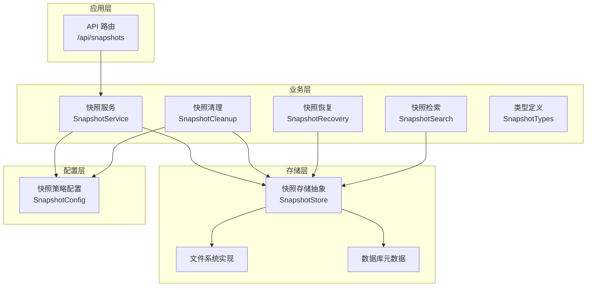
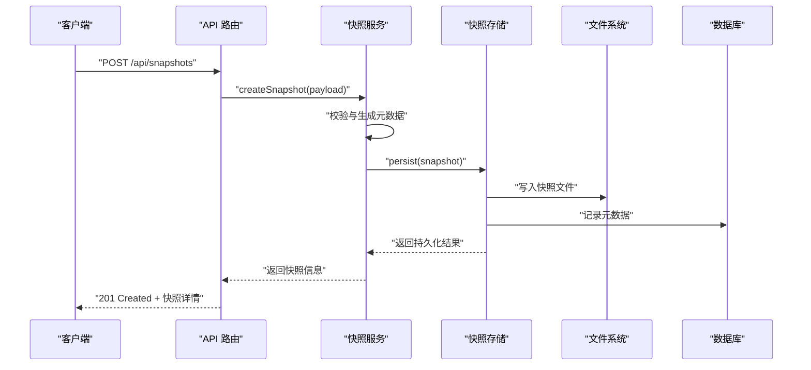
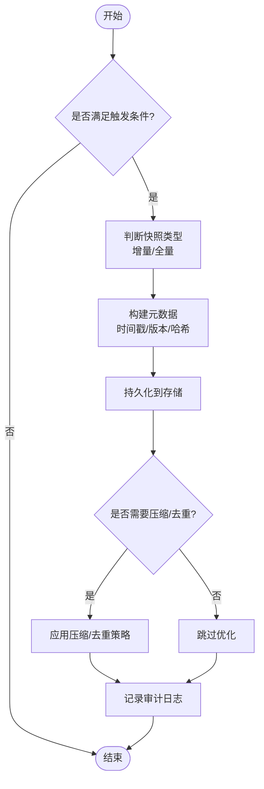
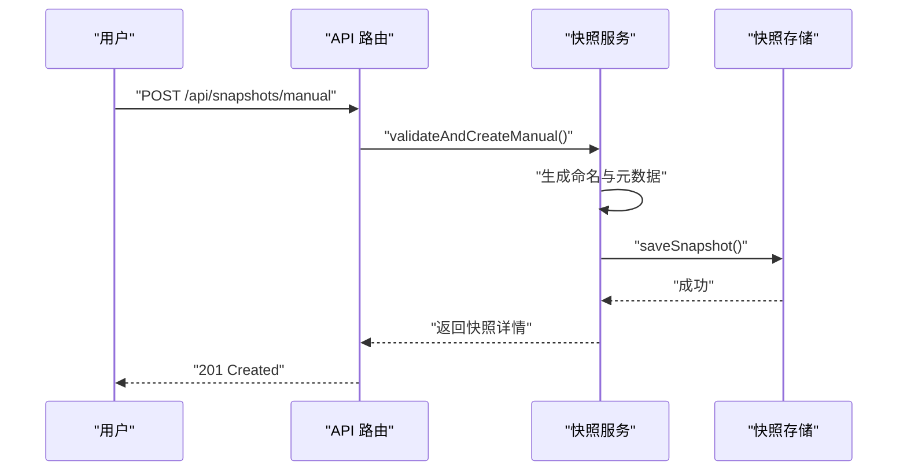
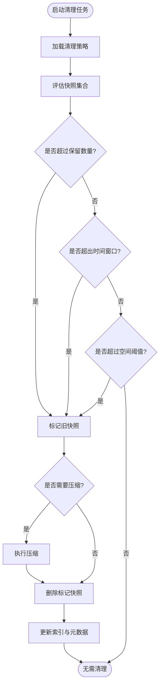
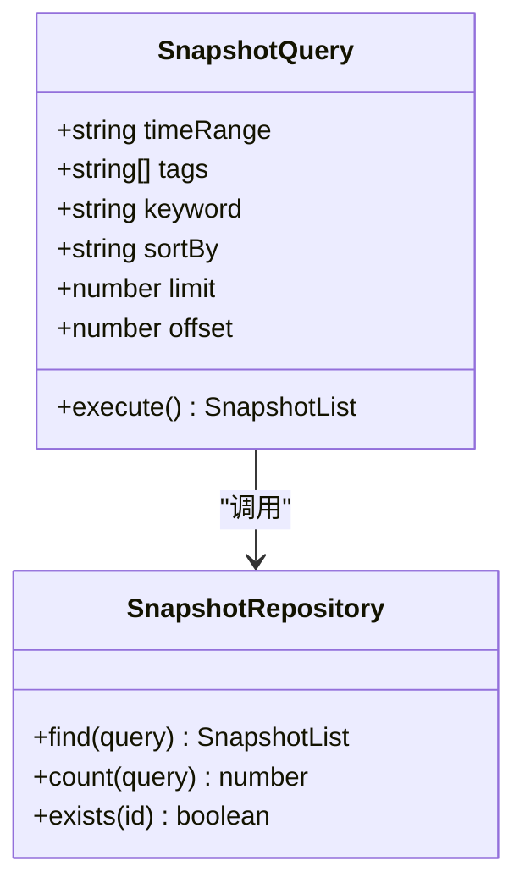
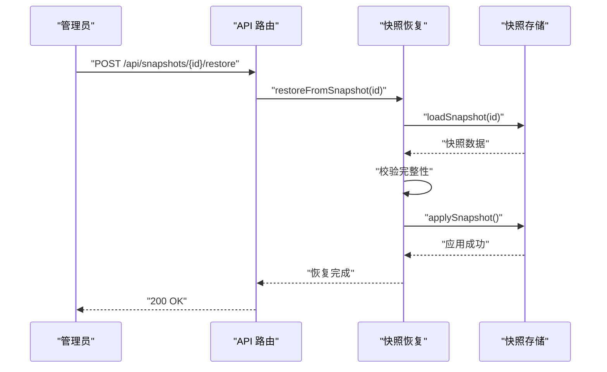
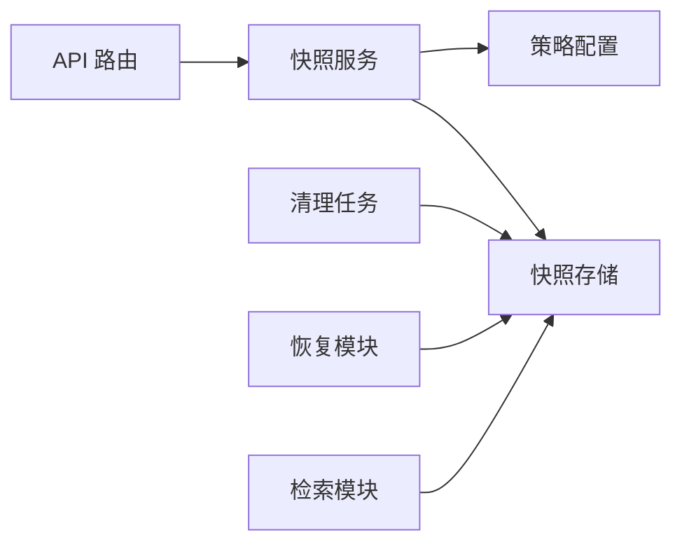

# 快照管理

<cite>
**本文引用的文件**   
- [snapshot.ts](file://src/features/artifacts/snapshot.ts)
- [snapshot-store.ts](file://src/lib/storage/snapshot-store.ts)
- [snapshot-api.ts](file://src/app/api/snapshots/route.ts)
- [snapshot-service.ts](file://src/features/artifacts/snapshot-service.ts)
- [snapshot-cleanup.ts](file://src/features/artifacts/snapshot-cleanup.ts)
- [snapshot-recovery.ts](file://src/features/artifacts/snapshot-recovery.ts)
- [snapshot-search.ts](file://src/features/artifacts/snapshot-search.ts)
- [snapshot-types.ts](file://src/features/artifacts/types.ts)
- [snapshot-config.ts](file://src/lib/config/snapshot-config.ts)
</cite>

## 目录
1. [简介](#简介)
2. [项目结构](#项目结构)
3. [核心组件](#核心组件)
4. [架构总览](#架构总览)
5. [详细组件分析](#详细组件分析)
6. [依赖关系分析](#依赖关系分析)
7. [性能考虑](#性能考虑)
8. [故障排查指南](#故障排查指南)
9. [结论](#结论)
10. [附录：API 接口与使用示例](#附录api-接口与使用示例)

## 简介
本文件为 PurpleInk 快照管理系统的完整技术文档，覆盖自动快照机制、手动快照功能、生命周期管理（压缩、清理、存储优化）、查询检索（时间范围、标签过滤、内容搜索）、恢复与验证机制，以及 API 接口与使用示例。目标读者包括产品、研发与运维人员，力求以循序渐进的方式呈现系统设计与实现要点。

## 项目结构
快照相关能力分布在 features、lib 与 app 三层：
- features/artifacts：快照业务逻辑（服务、清理、恢复、搜索、类型定义）
- lib/storage：快照持久化存储抽象与实现
- lib/config：快照策略配置
- app/api：快照 REST 接口路由

**图示来源** 
- [snapshot-api.ts:1-200](file://src/app/api/snapshots/route.ts#L1-L200)
- [snapshot-service.ts:1-300](file://src/features/artifacts/snapshot-service.ts#L1-L300)
- [snapshot-store.ts:1-200](file://src/lib/storage/snapshot-store.ts#L1-L200)
- [snapshot-cleanup.ts:1-200](file://src/features/artifacts/snapshot-cleanup.ts#L1-L200)
- [snapshot-recovery.ts:1-200](file://src/features/artifacts/snapshot-recovery.ts#L1-L200)
- [snapshot-search.ts:1-200](file://src/features/artifacts/snapshot-search.ts#L1-L200)
- [snapshot-types.ts:1-200](file://src/features/artifacts/types.ts#L1-L200)
- [snapshot-config.ts:1-200](file://src/lib/config/snapshot-config.ts#L1-L200)

**章节来源**
- [snapshot-api.ts:1-200](file://src/app/api/snapshots/route.ts#L1-L200)
- [snapshot-service.ts:1-300](file://src/features/artifacts/snapshot-service.ts#L1-L300)
- [snapshot-store.ts:1-200](file://src/lib/storage/snapshot-store.ts#L1-L200)
- [snapshot-cleanup.ts:1-200](file://src/features/artifacts/snapshot-cleanup.ts#L1-L200)
- [snapshot-recovery.ts:1-200](file://src/features/artifacts/snapshot-recovery.ts#L1-L200)
- [snapshot-search.ts:1-200](file://src/features/artifacts/snapshot-search.ts#L1-L200)
- [snapshot-types.ts:1-200](file://src/features/artifacts/types.ts#L1-L200)
- [snapshot-config.ts:1-200](file://src/lib/config/snapshot-config.ts#L1-L200)

## 核心组件
- 快照服务（SnapshotService）：封装创建、更新、删除、版本标记、元数据管理等核心操作；协调自动快照触发与手动快照流程。
- 快照存储（SnapshotStore）：提供统一的快照读写接口，屏蔽底层文件系统与数据库差异；负责快照对象序列化与校验。
- 快照清理（SnapshotCleanup）：基于策略的定时或事件驱动清理任务，支持按保留数量、时间窗口、空间阈值等规则执行。
- 快照恢复（SnapshotRecovery）：从指定快照恢复状态，包含完整性校验、回滚与一致性保障。
- 快照检索（SnapshotSearch）：支持时间范围、标签过滤、内容搜索等多维度查询。
- 类型定义（SnapshotTypes）：统一快照实体、元数据、查询参数、响应结构的类型契约。
- 策略配置（SnapshotConfig）：集中管理自动快照触发条件、保留策略、压缩选项、存储路径等。

**章节来源**
- [snapshot-service.ts:1-300](file://src/features/artifacts/snapshot-service.ts#L1-L300)
- [snapshot-store.ts:1-200](file://src/lib/storage/snapshot-store.ts#L1-L200)
- [snapshot-cleanup.ts:1-200](file://src/features/artifacts/snapshot-cleanup.ts#L1-L200)
- [snapshot-recovery.ts:1-200](file://src/features/artifacts/snapshot-recovery.ts#L1-L200)
- [snapshot-search.ts:1-200](file://src/features/artifacts/snapshot-search.ts#L1-L200)
- [snapshot-types.ts:1-200](file://src/features/artifacts/types.ts#L1-L200)
- [snapshot-config.ts:1-200](file://src/lib/config/snapshot-config.ts#L1-L200)

## 架构总览
整体采用分层架构：API 路由接收请求并委派给服务层；服务层调用存储层进行数据持久化；清理与恢复作为独立后台任务或按需触发；检索模块提供多维度查询能力；配置模块贯穿各层提供策略参数。

**图示来源** 
- [snapshot-api.ts:1-200](file://src/app/api/snapshots/route.ts#L1-L200)
- [snapshot-service.ts:1-300](file://src/features/artifacts/snapshot-service.ts#L1-L300)
- [snapshot-store.ts:1-200](file://src/lib/storage/snapshot-store.ts#L1-L200)

**章节来源**
- [snapshot-api.ts:1-200](file://src/app/api/snapshots/route.ts#L1-L200)
- [snapshot-service.ts:1-300](file://src/features/artifacts/snapshot-service.ts#L1-L300)
- [snapshot-store.ts:1-200](file://src/lib/storage/snapshot-store.ts#L1-L200)

## 详细组件分析

### 自动快照机制
- 触发条件：
  - 事件驱动：关键业务变更（如项目提交、渲染完成、配置更新）后触发。
  - 定时策略：按固定间隔或 Cron 表达式周期性检查并创建快照。
  - 阈值触发：当变更量或大小超过阈值时触发。
- 快照策略：
  - 增量/全量选择：根据变更集决定增量或全量快照。
  - 命名规则：包含时间戳、版本号、变更摘要等。
  - 元数据：记录触发源、用户、上下文、校验哈希等。
- 存储优化：
  - 去重：基于内容哈希避免重复存储。
  - 压缩：对大体积内容进行可配置的压缩。
  - 分层存储：热数据与冷数据分离。

**图示来源** 
- [snapshot-service.ts:1-300](file://src/features/artifacts/snapshot-service.ts#L1-L300)
- [snapshot-config.ts:1-200](file://src/lib/config/snapshot-config.ts#L1-L200)

**章节来源**
- [snapshot-service.ts:1-300](file://src/features/artifacts/snapshot-service.ts#L1-L300)
- [snapshot-config.ts:1-200](file://src/lib/config/snapshot-config.ts#L1-L200)

### 手动快照功能
- 创建流程：
  - 接收用户请求，校验输入参数与权限。
  - 生成唯一快照 ID 与命名（遵循命名规范）。
  - 收集当前状态与元数据，写入存储。
- 命名规则：
  - 格式：{前缀}-{时间戳}-{版本}-{描述}
  - 支持自定义前缀与描述模板。
- 元数据管理：
  - 基础字段：ID、名称、时间、版本、大小、哈希。
  - 扩展字段：标签、备注、来源、关联资源。
- 版本标记：
  - 支持打标签（如 latest、release、hotfix）。
  - 版本比较与差异展示。

**图示来源** 
- [snapshot-api.ts:1-200](file://src/app/api/snapshots/route.ts#L1-L200)
- [snapshot-service.ts:1-300](file://src/features/artifacts/snapshot-service.ts#L1-L300)

**章节来源**
- [snapshot-api.ts:1-200](file://src/app/api/snapshots/route.ts#L1-L200)
- [snapshot-service.ts:1-300](file://src/features/artifacts/snapshot-service.ts#L1-L300)

### 快照生命周期管理
- 压缩：
  - 支持多种压缩算法（如 gzip、zstd），可配置压缩级别。
  - 压缩失败回退至未压缩副本。
- 清理策略：
  - 基于保留数量：每个分支/标签仅保留 N 个最新快照。
  - 基于时间窗口：删除早于 T 时间的快照。
  - 基于空间阈值：当存储空间超过阈值时触发清理。
- 存储优化：
  - 冷热分层：近期快照存于高速存储，历史快照迁移至低成本存储。
  - 去重与索引：减少冗余，提升检索效率。

**图示来源** 
- [snapshot-cleanup.ts:1-200](file://src/features/artifacts/snapshot-cleanup.ts#L1-L200)
- [snapshot-config.ts:1-200](file://src/lib/config/snapshot-config.ts#L1-L200)

**章节来源**
- [snapshot-cleanup.ts:1-200](file://src/features/artifacts/snapshot-cleanup.ts#L1-L200)
- [snapshot-config.ts:1-200](file://src/lib/config/snapshot-config.ts#L1-L200)

### 快照查询与检索
- 时间范围查询：支持起止时间与排序。
- 标签过滤：按标签精确或模糊匹配。
- 内容搜索：全文检索快照元数据与内容片段。
- 高级筛选：结合版本、大小、哈希等条件组合查询。

**图示来源** 
- [snapshot-search.ts:1-200](file://src/features/artifacts/snapshot-search.ts#L1-L200)
- [snapshot-types.ts:1-200](file://src/features/artifacts/types.ts#L1-L200)

**章节来源**
- [snapshot-search.ts:1-200](file://src/features/artifacts/snapshot-search.ts#L1-L200)
- [snapshot-types.ts:1-200](file://src/features/artifacts/types.ts#L1-L200)

### 快照恢复与验证
- 恢复流程：
  - 选择目标快照，校验完整性。
  - 停止写入，切换状态至恢复模式。
  - 从快照重建数据，验证一致性。
  - 切换回正常模式，记录审计日志。
- 验证机制：
  - 哈希校验：对比快照哈希与存储内容。
  - 结构校验：验证元数据与数据结构完整性。
  - 业务校验：运行关键用例确保功能正常。

**图示来源** 
- [snapshot-recovery.ts:1-200](file://src/features/artifacts/snapshot-recovery.ts#L1-L200)
- [snapshot-store.ts:1-200](file://src/lib/storage/snapshot-store.ts#L1-L200)

**章节来源**
- [snapshot-recovery.ts:1-200](file://src/features/artifacts/snapshot-recovery.ts#L1-L200)
- [snapshot-store.ts:1-200](file://src/lib/storage/snapshot-store.ts#L1-L200)

## 依赖关系分析
- 低耦合设计：服务层通过接口与存储层交互，便于替换实现。
- 配置驱动：所有策略通过配置模块注入，支持运行时调整。
- 错误隔离：各组件内部异常处理，避免级联失败。

**图示来源** 
- [snapshot-api.ts:1-200](file://src/app/api/snapshots/route.ts#L1-L200)
- [snapshot-service.ts:1-300](file://src/features/artifacts/snapshot-service.ts#L1-L300)
- [snapshot-store.ts:1-200](file://src/lib/storage/snapshot-store.ts#L1-L200)
- [snapshot-config.ts:1-200](file://src/lib/config/snapshot-config.ts#L1-L200)

**章节来源**
- [snapshot-api.ts:1-200](file://src/app/api/snapshots/route.ts#L1-L200)
- [snapshot-service.ts:1-300](file://src/features/artifacts/snapshot-service.ts#L1-L300)
- [snapshot-store.ts:1-200](file://src/lib/storage/snapshot-store.ts#L1-L200)
- [snapshot-config.ts:1-200](file://src/lib/config/snapshot-config.ts#L1-L200)

## 性能考虑
- 异步处理：快照创建与清理采用异步队列，避免阻塞主流程。
- 批量操作：支持批量创建、删除与查询，减少 I/O 次数。
- 缓存策略：热点快照元数据缓存，提升查询性能。
- 流式处理：大文件内容采用流式读写，降低内存占用。

[本节为通用指导，不直接分析具体文件]

## 故障排查指南
- 常见问题：
  - 快照创建失败：检查存储权限、磁盘空间、配置参数。
  - 恢复失败：验证快照完整性，检查依赖服务状态。
  - 清理不生效：确认清理策略配置与调度任务状态。
- 诊断工具：
  - 审计日志：查看快照操作历史与错误堆栈。
  - 健康检查：监控存储与健康指标。
  - 调试模式：启用详细日志定位问题。

**章节来源**
- [snapshot-service.ts:1-300](file://src/features/artifacts/snapshot-service.ts#L1-L300)
- [snapshot-cleanup.ts:1-200](file://src/features/artifacts/snapshot-cleanup.ts#L1-L200)
- [snapshot-recovery.ts:1-200](file://src/features/artifacts/snapshot-recovery.ts#L1-L200)

## 结论
PurpleInk 快照管理系统通过清晰的分层架构与模块化设计，实现了完整的快照生命周期管理能力。自动与手动快照机制灵活可扩展，清理与恢复策略保障数据安全与可用性，检索功能满足多样化查询需求。建议在生产环境中合理配置策略参数，并结合监控与日志进行持续优化。

[本节为总结性内容，不直接分析具体文件]

## 附录：API 接口与使用示例
- 创建快照
  - 方法：POST
  - 路径：/api/snapshots
  - 请求体：包含快照元数据与可选内容
  - 响应：201 Created，返回快照详情
- 手动快照
  - 方法：POST
  - 路径：/api/snapshots/manual
  - 请求体：包含命名规则与标签
  - 响应：201 Created，返回快照详情
- 查询快照
  - 方法：GET
  - 路径：/api/snapshots
  - 查询参数：时间范围、标签、关键词、分页
  - 响应：200 OK，返回快照列表
- 恢复快照
  - 方法：POST
  - 路径：/api/snapshots/{id}/restore
  - 响应：200 OK，返回恢复结果
- 删除快照
  - 方法：DELETE
  - 路径：/api/snapshots/{id}
  - 响应：204 No Content

[本节为接口概览，不直接分析具体文件]