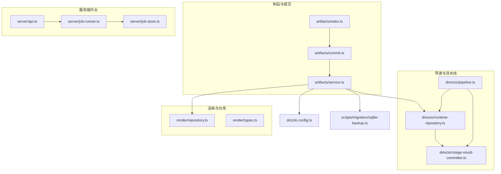
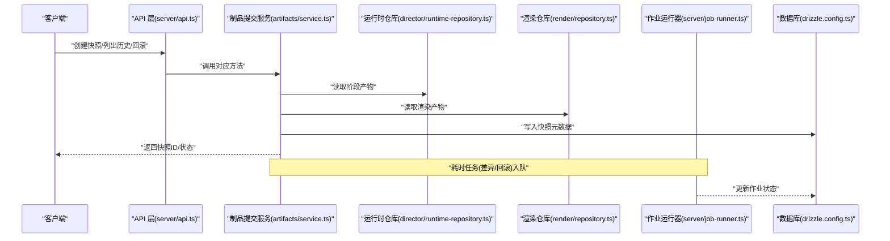
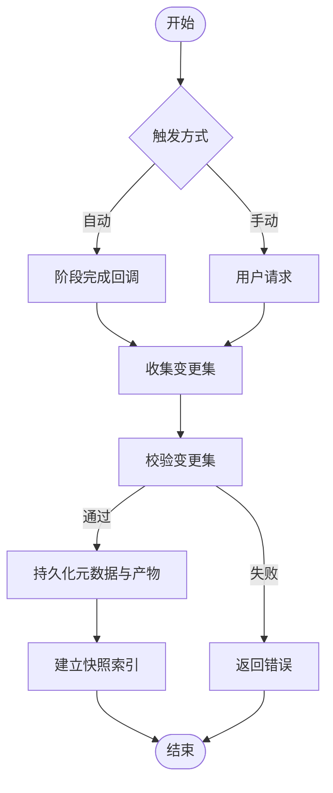
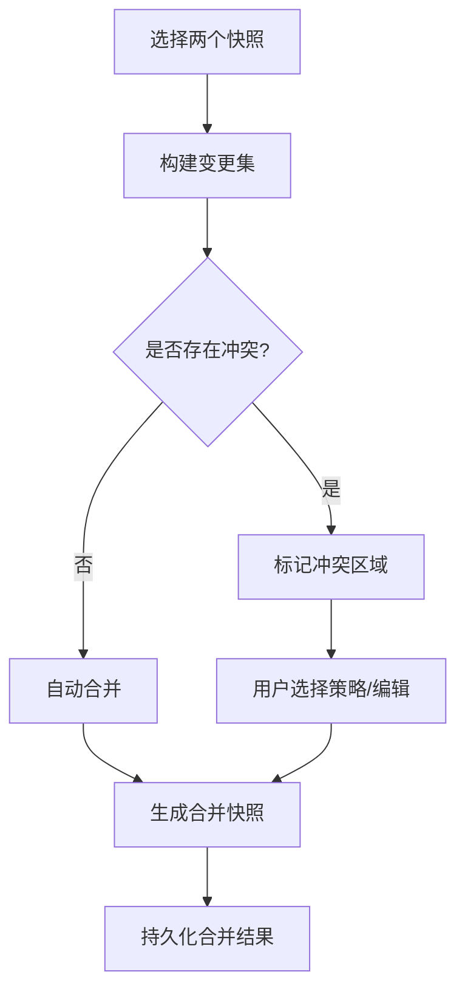
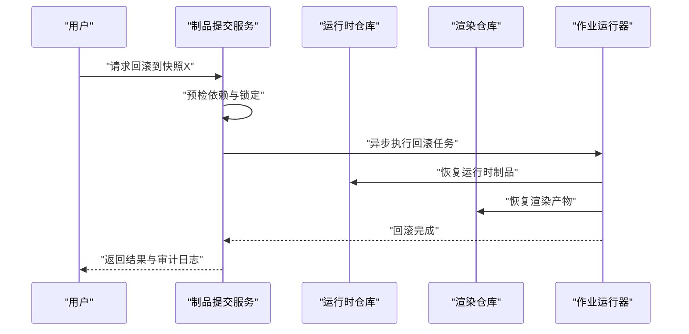
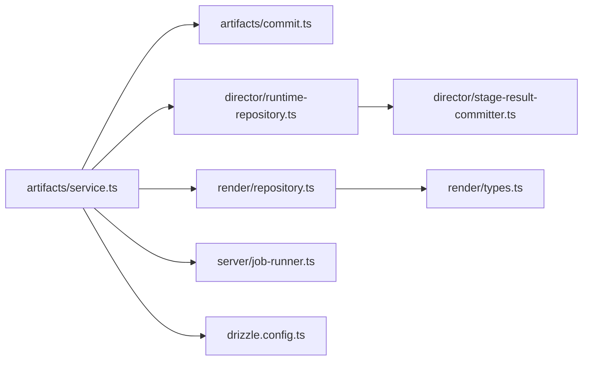

# 版本控制系统

<cite>
**本文档引用的文件**   
- [src/features/artifacts/commit.ts](file://src/features/artifacts/commit.ts)
- [src/features/artifacts/service.ts](file://src/features/artifacts/service.ts)
- [src/features/artifacts/index.ts](file://src/features/artifacts/index.ts)
- [src/features/director/runtime-repository.ts](file://src/features/director/runtime-repository.ts)
- [src/features/director/stage-result-committer.ts](file://src/features/director/stage-result-committer.ts)
- [src/features/director/pipeline.ts](file://src/features/director/pipeline.ts)
- [src/features/render/repository.ts](file://src/features/render/repository.ts)
- [src/features/render/types.ts](file://src/features/render/types.ts)
- [server/src/server/job-store.ts](file://server/src/server/job-store.ts)
- [server/src/server/job-runner.ts](file://server/src/server/job-runner.ts)
- [server/src/server/api.ts](file://server/src/server/api.ts)
- [drizzle.config.ts](file://drizzle.config.ts)
- [scripts/migration/sqlite-backup.ts](file://scripts/migration/sqlite-backup.ts)
</cite>

## 目录
1. [简介](#简介)
2. [项目结构](#项目结构)
3. [核心组件](#核心组件)
4. [架构总览](#架构总览)
5. [详细组件分析](#详细组件分析)
6. [依赖关系分析](#依赖关系分析)
7. [性能考量](#性能考量)
8. [故障排查指南](#故障排查指南)
9. [结论](#结论)
10. [附录](#附录)

## 简介
本文件为 PurpleInk 版本控制系统的技术文档，聚焦以下能力：
- 快照管理机制：自动快照、手动快照、快照命名规则与存储策略
- 差异对比功能：文件差异检测、内容对比、合并冲突解决
- 回滚机制：版本回退、部分回滚、级联更新
- 分支管理策略：主分支保护、特性分支、发布分支
- 版本标签与里程碑管理
- 高级功能：版本历史查询、审计日志、权限控制

说明：当前仓库未包含完整的“版本控制”前端界面与完整后端实现。本文基于现有 artifacts、director、render、job 等模块进行系统化梳理，给出可落地的设计与集成方案，并标注与现有代码的映射关系，便于后续扩展与落地。

## 项目结构
从现有代码看，版本相关能力主要分布在以下位置：
- artifacts：制品与提交（commit）抽象与服务层
- director：运行时工件读写、阶段结果提交、流水线编排
- render：渲染产物持久化与仓库接口
- server：作业运行器与作业存储（用于异步任务与状态）
- drizzle 配置：数据库迁移与连接配置（可用于版本元数据持久化）
- scripts：备份脚本（可用于快照归档）

图表来源
- [src/features/artifacts/index.ts](file://src/features/artifacts/index.ts)
- [src/features/artifacts/commit.ts](file://src/features/artifacts/commit.ts)
- [src/features/artifacts/service.ts](file://src/features/artifacts/service.ts)
- [src/features/director/runtime-repository.ts](file://src/features/director/runtime-repository.ts)
- [src/features/director/stage-result-committer.ts](file://src/features/director/stage-result-committer.ts)
- [src/features/director/pipeline.ts](file://src/features/director/pipeline.ts)
- [src/features/render/repository.ts](file://src/features/render/repository.ts)
- [src/features/render/types.ts](file://src/features/render/types.ts)
- [server/src/server/api.ts](file://server/src/server/api.ts)
- [server/src/server/job-runner.ts](file://server/src/server/job-runner.ts)
- [server/src/server/job-store.ts](file://server/src/server/job-store.ts)
- [drizzle.config.ts](file://drizzle.config.ts)
- [scripts/migration/sqlite-backup.ts](file://scripts/migration/sqlite-backup.ts)

章节来源
- [src/features/artifacts/index.ts](file://src/features/artifacts/index.ts)
- [src/features/artifacts/commit.ts](file://src/features/artifacts/commit.ts)
- [src/features/artifacts/service.ts](file://src/features/artifacts/service.ts)
- [src/features/director/runtime-repository.ts](file://src/features/director/runtime-repository.ts)
- [src/features/director/stage-result-committer.ts](file://src/features/director/stage-result-committer.ts)
- [src/features/director/pipeline.ts](file://src/features/director/pipeline.ts)
- [src/features/render/repository.ts](file://src/features/render/repository.ts)
- [src/features/render/types.ts](file://src/features/render/types.ts)
- [server/src/server/api.ts](file://server/src/server/api.ts)
- [server/src/server/job-runner.ts](file://server/src/server/job-runner.ts)
- [server/src/server/job-store.ts](file://server/src/server/job-store.ts)
- [drizzle.config.ts](file://drizzle.config.ts)
- [scripts/migration/sqlite-backup.ts](file://scripts/migration/sqlite-backup.ts)

## 核心组件
- 制品提交服务（artifacts/service.ts）：封装创建快照、列出历史、读取快照内容等操作，是版本控制的入口服务。
- 提交模型（artifacts/commit.ts）：定义快照元数据、变更集、校验与序列化逻辑。
- 运行时工件仓库（director/runtime-repository.ts）：负责阶段产物的读写，可作为快照的数据源。
- 阶段结果提交器（director/stage-result-committer.ts）：将阶段结果写入持久化，适合在关键阶段触发自动快照。
- 渲染仓库（render/repository.ts）：渲染产物存取，支持快照中引用渲染结果。
- 作业运行器与存储（server/job-runner.ts, server/job-store.ts）：支撑异步快照、差异计算、回滚等耗时操作。

章节来源
- [src/features/artifacts/service.ts](file://src/features/artifacts/service.ts)
- [src/features/artifacts/commit.ts](file://src/features/artifacts/commit.ts)
- [src/features/director/runtime-repository.ts](file://src/features/director/runtime-repository.ts)
- [src/features/director/stage-result-committer.ts](file://src/features/director/stage-result-committer.ts)
- [src/features/render/repository.ts](file://src/features/render/repository.ts)
- [server/src/server/job-runner.ts](file://server/src/server/job-runner.ts)
- [server/src/server/job-store.ts](file://server/src/server/job-store.ts)

## 架构总览
版本控制子系统围绕“制品提交服务”组织，向上暴露 API，向下通过运行时仓库与渲染仓库获取数据，并通过作业系统执行耗时任务（差异、回滚、归档）。

图表来源
- [server/src/server/api.ts](file://server/src/server/api.ts)
- [src/features/artifacts/service.ts](file://src/features/artifacts/service.ts)
- [src/features/director/runtime-repository.ts](file://src/features/director/runtime-repository.ts)
- [src/features/render/repository.ts](file://src/features/render/repository.ts)
- [server/src/server/job-runner.ts](file://server/src/server/job-runner.ts)
- [drizzle.config.ts](file://drizzle.config.ts)

## 详细组件分析

### 快照管理机制
- 自动快照
  - 触发点：关键阶段完成时（如导演阶段产出、渲染完成），由 stage-result-committer 或 pipeline 回调触发。
  - 策略：增量快照（仅记录变更项）、全量快照（按策略周期性生成）。
  - 命名规则：建议采用“时间戳+阶段名+哈希前缀”，保证唯一性与可读性。
  - 存储策略：元数据入库（drizzle），二进制产物走对象存储或本地磁盘；快照索引指向实际路径。
- 手动快照
  - 入口：artifacts/service 提供 createSnapshot 接口，支持指定范围（全部/部分制品）。
  - 校验：commit.ts 对变更集进行完整性校验（哈希、大小、类型）。
- 快照命名与索引
  - 命名：{YYYYMMDD-HHMMSS}-{stage}-{shortHash}
  - 索引：快照ID、父快照ID、作者、时间、变更清单、产物清单、状态。

图表来源
- [src/features/artifacts/service.ts](file://src/features/artifacts/service.ts)
- [src/features/artifacts/commit.ts](file://src/features/artifacts/commit.ts)
- [src/features/director/stage-result-committer.ts](file://src/features/director/stage-result-committer.ts)
- [src/features/director/pipeline.ts](file://src/features/director/pipeline.ts)

章节来源
- [src/features/artifacts/service.ts](file://src/features/artifacts/service.ts)
- [src/features/artifacts/commit.ts](file://src/features/artifacts/commit.ts)
- [src/features/director/stage-result-committer.ts](file://src/features/director/stage-result-committer.ts)
- [src/features/director/pipeline.ts](file://src/features/director/pipeline.ts)

### 差异对比功能
- 文件差异检测
  - 粒度：文件级、目录级、制品级。
  - 算法：文本类使用行级 diff；二进制类使用块级哈希比对。
- 内容对比
  - 展示：统一视图呈现新增、删除、修改片段。
  - 过滤：按类型、大小、路径规则过滤。
- 合并冲突解决
  - 自动合并：无冲突时自动合并。
  - 冲突提示：标记冲突区域，提供三方合并工具或人工选择策略。
  - 回写：合并结果生成新快照作为合并基线。

图表来源
- [src/features/artifacts/service.ts](file://src/features/artifacts/service.ts)
- [src/features/artifacts/commit.ts](file://src/features/artifacts/commit.ts)

章节来源
- [src/features/artifacts/service.ts](file://src/features/artifacts/service.ts)
- [src/features/artifacts/commit.ts](file://src/features/artifacts/commit.ts)

### 回滚机制
- 版本回退
  - 整快照回退：将工作区恢复到指定快照状态。
  - 幂等性：重复回滚不产生副作用。
- 部分回滚
  - 按制品或文件维度回滚，生成新的补丁快照。
- 级联更新
  - 当上游制品变化时，下游依赖自动重新计算或标记失效。
- 安全策略
  - 回滚前预检：检查依赖关系与锁定状态。
  - 审计日志：记录回滚操作人、原因、影响范围。

图表来源
- [src/features/artifacts/service.ts](file://src/features/artifacts/service.ts)
- [src/features/director/runtime-repository.ts](file://src/features/director/runtime-repository.ts)
- [src/features/render/repository.ts](file://src/features/render/repository.ts)
- [server/src/server/job-runner.ts](file://server/src/server/job-runner.ts)

章节来源
- [src/features/artifacts/service.ts](file://src/features/artifacts/service.ts)
- [src/features/director/runtime-repository.ts](file://src/features/director/runtime-repository.ts)
- [src/features/render/repository.ts](file://src/features/render/repository.ts)
- [server/src/server/job-runner.ts](file://server/src/server/job-runner.ts)

### 分支管理策略
- 主分支保护
  - 禁止直接推送，需通过合并请求与审批。
  - 强制快照一致性：合并前必须通过差异与测试。
- 特性分支
  - 短生命周期，频繁合并至主分支，避免长期分裂。
- 发布分支
  - 稳定基线，打标签后进入发布流程，仅允许修复性变更。
- 分支命名规范
  - feature/*、release/*、hotfix/*，配合自动化流水线。

（本节为概念性设计，不直接分析具体文件）

### 版本标签与里程碑管理
- 标签
  - 语义化版本（v1.2.3），关联特定快照与制品清单。
- 里程碑
  - 聚合多个标签与变更记录，用于发布说明与审计。
- 操作
  - 创建标签、查看标签历史、回滚到标签。

（本节为概念性设计，不直接分析具体文件）

### 版本历史查询与审计日志
- 版本历史
  - 按时间、作者、阶段、制品类型筛选。
  - 分页与排序，支持快速定位。
- 审计日志
  - 记录所有版本操作（创建、合并、回滚、打标签）。
  - 不可篡改存储，支持导出与检索。

（本节为概念性设计，不直接分析具体文件）

### 权限控制
- 角色与权限
  - 管理员：全量权限。
  - 开发者：创建快照、发起合并、回滚受限。
  - 访客：只读访问。
- 资源级权限
  - 项目/制品级 ACL，细粒度控制。
- 审计
  - 权限变更与访问日志。

（本节为概念性设计，不直接分析具体文件）

## 依赖关系分析
版本控制子系统依赖运行时仓库与渲染仓库获取数据，依赖作业系统进行异步处理，依赖数据库进行元数据持久化。

图表来源
- [src/features/artifacts/service.ts](file://src/features/artifacts/service.ts)
- [src/features/artifacts/commit.ts](file://src/features/artifacts/commit.ts)
- [src/features/director/runtime-repository.ts](file://src/features/director/runtime-repository.ts)
- [src/features/director/stage-result-committer.ts](file://src/features/director/stage-result-committer.ts)
- [src/features/render/repository.ts](file://src/features/render/repository.ts)
- [src/features/render/types.ts](file://src/features/render/types.ts)
- [server/src/server/job-runner.ts](file://server/src/server/job-runner.ts)
- [drizzle.config.ts](file://drizzle.config.ts)

章节来源
- [src/features/artifacts/service.ts](file://src/features/artifacts/service.ts)
- [src/features/artifacts/commit.ts](file://src/features/artifacts/commit.ts)
- [src/features/director/runtime-repository.ts](file://src/features/director/runtime-repository.ts)
- [src/features/director/stage-result-committer.ts](file://src/features/director/stage-result-committer.ts)
- [src/features/render/repository.ts](file://src/features/render/repository.ts)
- [src/features/render/types.ts](file://src/features/render/types.ts)
- [server/src/server/job-runner.ts](file://server/src/server/job-runner.ts)
- [drizzle.config.ts](file://drizzle.config.ts)

## 性能考量
- 增量快照：仅记录变更，减少存储与传输开销。
- 并行差异计算：按文件/制品并行 diff，提升对比速度。
- 缓存策略：热点快照与差异结果缓存，降低重复计算。
- 异步任务：大对象与长耗时操作通过作业队列处理，避免阻塞。
- 存储分层：热数据内存/SSD，冷数据归档至低成本存储。

（本节为通用指导，不直接分析具体文件）

## 故障排查指南
- 快照创建失败
  - 检查变更集校验与权限。
  - 查看作业运行器日志与数据库事务状态。
- 差异对比超时
  - 确认输入快照大小与并发度。
  - 调整作业队列与超时参数。
- 回滚异常
  - 预检依赖是否被其他任务锁定。
  - 检查制品路径与权限。
- 备份与恢复
  - 使用 sqlite-backup 脚本定期备份。
  - 恢复后验证快照一致性与索引完整性。

章节来源
- [server/src/server/job-runner.ts](file://server/src/server/job-runner.ts)
- [server/src/server/job-store.ts](file://server/src/server/job-store.ts)
- [scripts/migration/sqlite-backup.ts](file://scripts/migration/sqlite-backup.ts)

## 结论
PurpleInk 的版本控制系统以 artifacts 服务为核心，结合 director 与 render 仓库，形成完整的快照、差异、回滚与协作能力。通过作业系统与数据库支撑，可实现高可用与可扩展的版本管理。建议在现有基础上完善前端交互、权限与审计模块，以满足生产环境需求。

## 附录
- 术语
  - 快照：某一时刻的制品与元数据集合。
  - 制品：运行时产物与渲染产物。
  - 差异：两个快照之间的变更集合。
  - 回滚：恢复到历史快照状态的操作。
  - 分支：独立开发线的命名空间。
  - 标签：对快照的语义化标记。
  - 里程碑：一组标签与变更记录的聚合。

（本节为概念性说明，不直接分析具体文件）