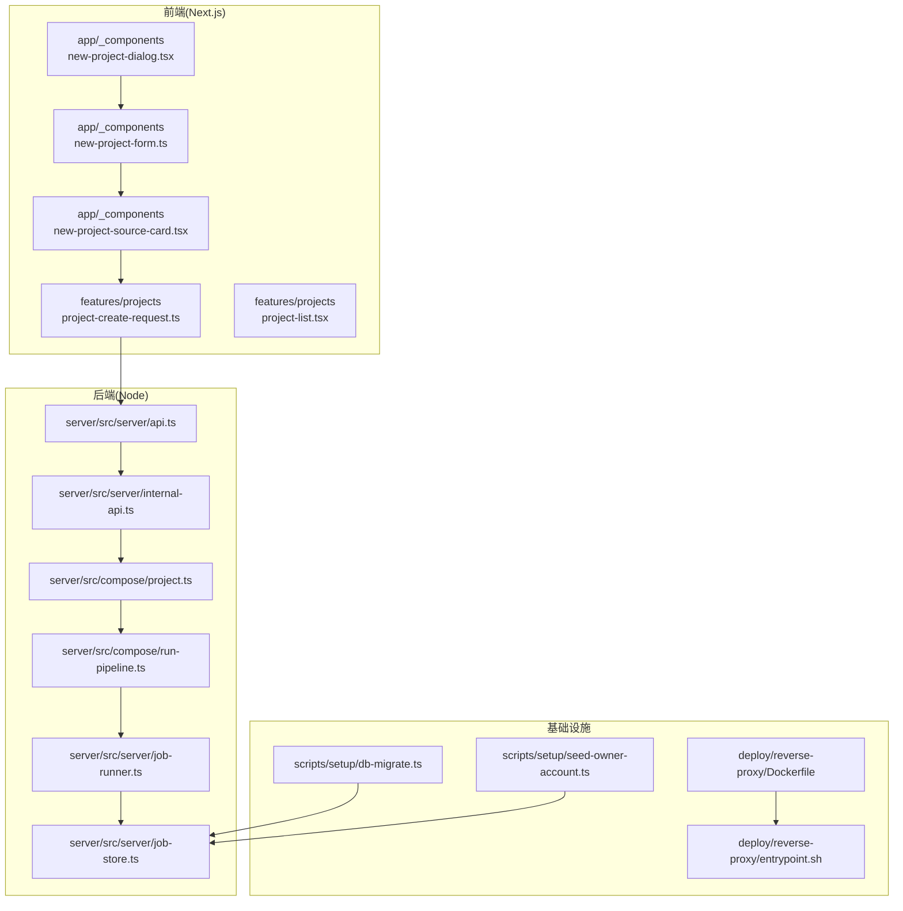
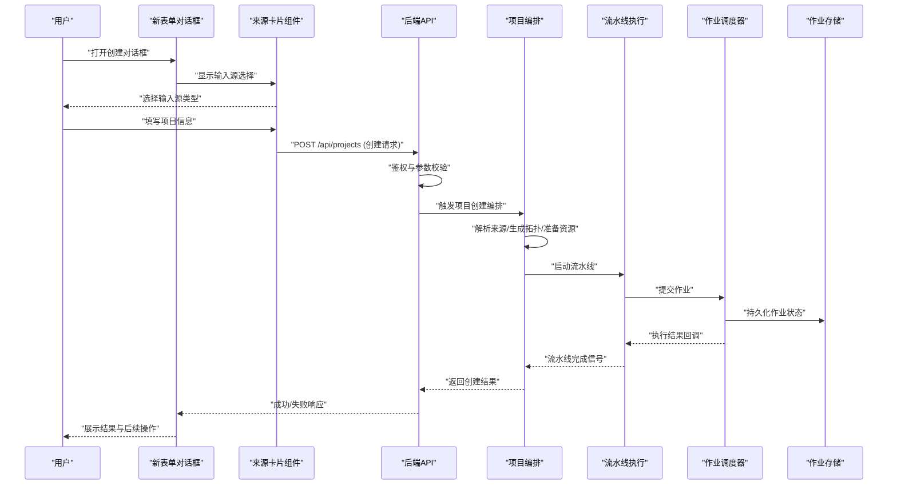
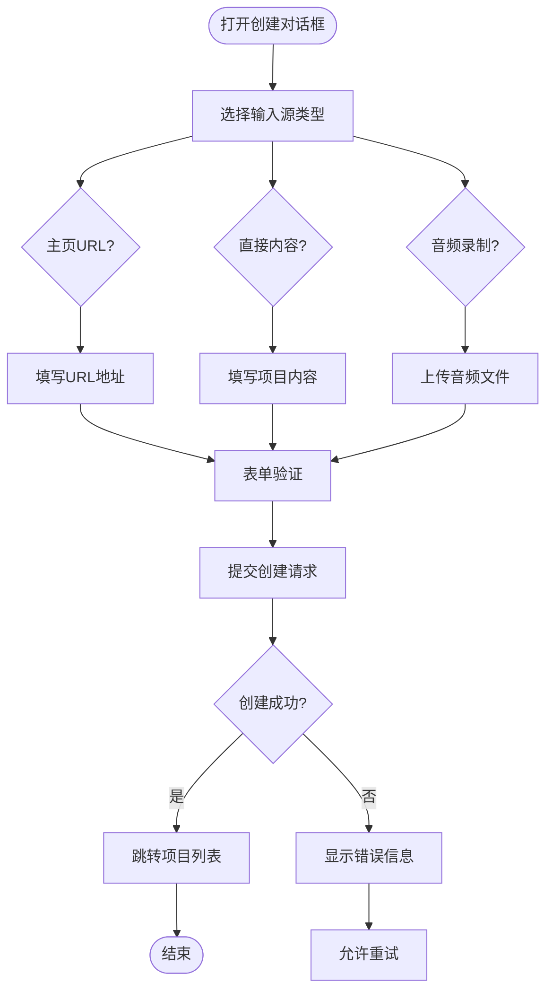
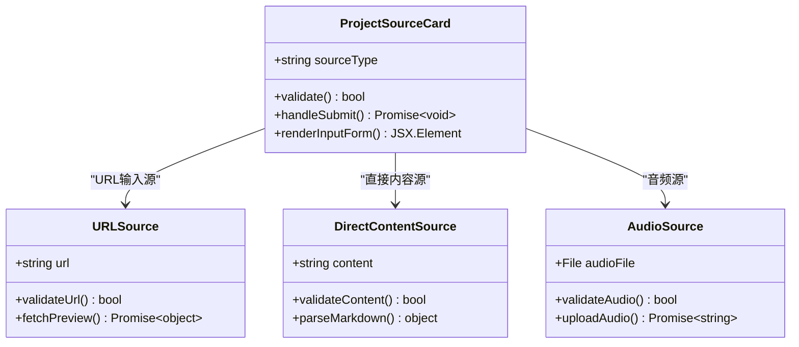
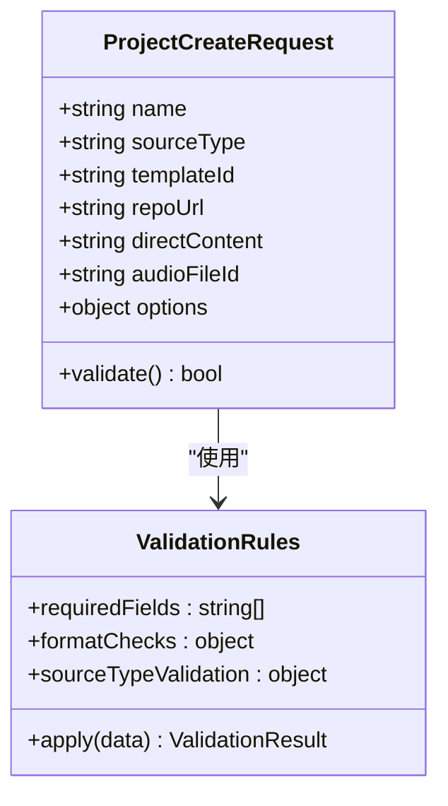
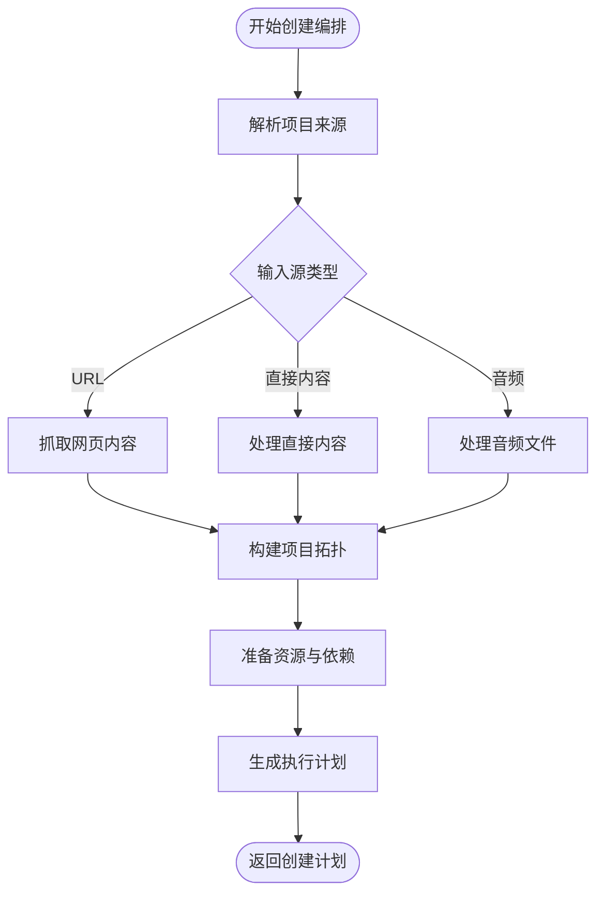
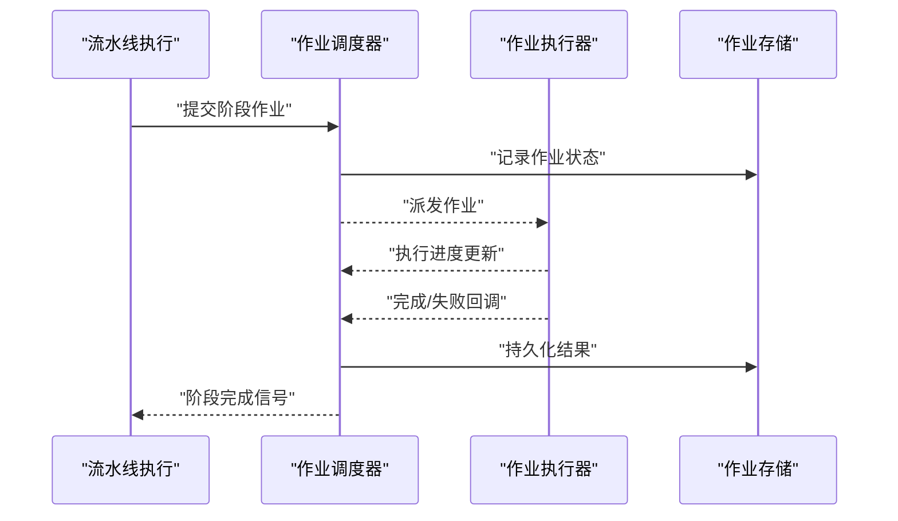
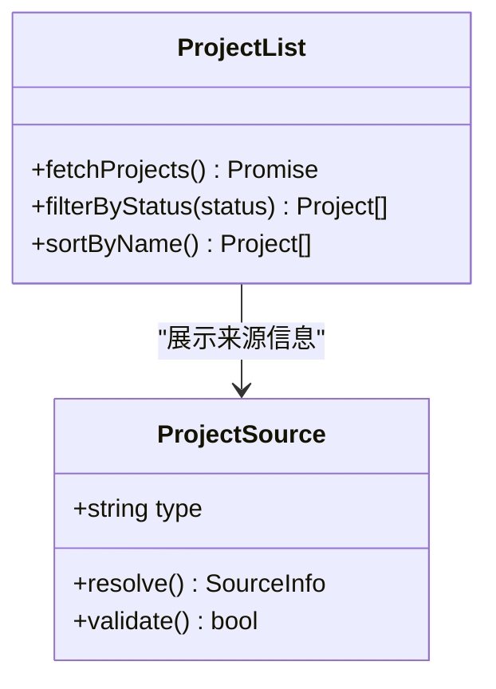
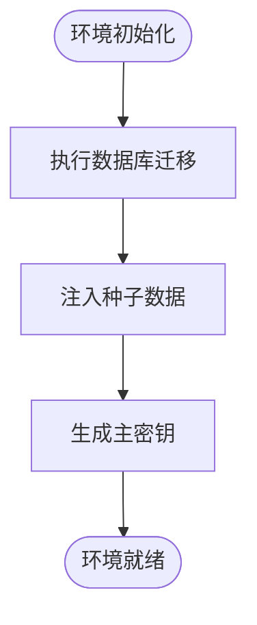
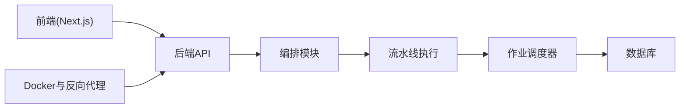

# 统一项目创建系统

<cite>
**本文引用的文件**   
- [package.json](file://package.json)
- [next.config.ts](file://next.config.ts)
- [tsconfig.json](file://tsconfig.json)
- [drizzle.config.ts](file://drizzle.config.ts)
- [vitest.config.ts](file://vitest.config.ts)
- [src/app/_components/new-project-dialog.tsx](file://src/app/_components/new-project-dialog.tsx)
- [src/app/_components/new-project-form.ts](file://src/app/_components/new-project-form.ts)
- [src/app/_components/new-project-source-card.tsx](file://src/app/_components/new-project-source-card.tsx)
- [src/features/projects/project-create-request.ts](file://src/features/projects/project-create-request.ts)
- [src/features/projects/project-creation.ts](file://src/features/projects/project-creation.ts)
- [src/features/projects/project-source.ts](file://src/features/projects/project-source.ts)
- [src/features/projects/project-topology.ts](file://src/features/projects/project-topology.ts)
- [src/features/projects/project-list.tsx](file://src/features/projects/project-list.tsx)
- [src/features/projects/index.ts](file://src/features/projects/index.ts)
- [server/src/server/api.ts](file://server/src/server/api.ts)
- [server/src/server/internal-api.ts](file://server/src/server/internal-api.ts)
- [server/src/compose/project.ts](file://server/src/compose/project.ts)
- [server/src/compose/run-pipeline.ts](file://server/src/compose/run-pipeline.ts)
- [server/src/server/job-runner.ts](file://server/src/server/job-runner.ts)
- [server/src/server/job-store.ts](file://server/src/server/job-store.ts)
- [server/src/lib/load-env.ts](file://server/src/lib/load-env.ts)
- [scripts/setup/db-migrate.ts](file://scripts/setup/db-migrate.ts)
- [scripts/setup/seed-owner-account.ts](file://scripts/setup/seed-owner-account.ts)
- [scripts/migration/provision-master-key.ts](file://scripts/migration/provision-master-key.ts)
- [deploy/reverse-proxy/Dockerfile](file://deploy/reverse-proxy/Dockerfile)
- [deploy/reverse-proxy/entrypoint.sh](file://deploy/reverse-proxy/entrypoint.sh)
</cite>

## 更新摘要
**所做更改**   
- 完全重构了项目创建工作流，从API方式迁移到表单式界面
- 新增了new-project-form.ts组件，提供统一的表单处理逻辑
- 新增了new-project-source-card.tsx组件，支持多种输入源选择
- 移除了旧的new-project-api.ts API封装方式
- 新增对主页URL、直接内容创建和音频录制上传三种输入源的支持

## 目录
1. [简介](#简介)
2. [项目结构](#项目结构)
3. [核心组件](#核心组件)
4. [架构总览](#架构总览)
5. [详细组件分析](#详细组件分析)
6. [依赖关系分析](#依赖关系分析)
7. [性能考量](#性能考量)
8. [故障排查指南](#故障排查指南)
9. [结论](#结论)
10. [附录](#附录)

## 简介
本文件围绕"统一项目创建系统"展开，系统化梳理前端交互、后端 API、编排与执行、持久化与部署等关键链路。该系统的目标是：为不同来源（模板、仓库、合成数据等）提供一致的项目创建体验，并通过统一的请求校验、资源准备、流水线编排与任务调度，确保项目从创建到可运行全链路的稳定性与可观测性。

**最新更新**：项目创建工作流已完全重构为表单式界面，移除了旧的API方式，新增了更直观的表单组件和多输入源支持。

## 项目结构
整体采用前后端分离的 Next.js 应用与独立 Node 服务协同的模式：
- 前端位于 src 目录，包含页面路由、UI 组件与特性模块；项目创建相关的前端入口集中在 app/_components 与 features/projects。
- 服务端位于 server 目录，提供内部 API、作业调度、编排与渲染管线。
- 脚本位于 scripts 目录，涵盖数据库迁移、种子数据与环境初始化。
- 部署配置位于 deploy 目录，包含反向代理容器镜像与启动脚本。

**图示来源** 
- [src/app/_components/new-project-dialog.tsx](file://src/app/_components/new-project-dialog.tsx)
- [src/app/_components/new-project-form.ts](file://src/app/_components/new-project-form.ts)
- [src/app/_components/new-project-source-card.tsx](file://src/app/_components/new-project-source-card.tsx)
- [src/features/projects/project-create-request.ts](file://src/features/projects/project-create-request.ts)
- [server/src/server/api.ts](file://server/src/server/api.ts)
- [server/src/server/internal-api.ts](file://server/src/server/internal-api.ts)
- [server/src/compose/project.ts](file://server/src/compose/project.ts)
- [server/src/compose/run-pipeline.ts](file://server/src/compose/run-pipeline.ts)
- [server/src/server/job-runner.ts](file://server/src/server/job-runner.ts)
- [server/src/server/job-store.ts](file://server/src/server/job-store.ts)
- [scripts/setup/db-migrate.ts](file://scripts/setup/db-migrate.ts)
- [scripts/setup/seed-owner-account.ts](file://scripts/setup/seed-owner-account.ts)
- [deploy/reverse-proxy/Dockerfile](file://deploy/reverse-proxy/Dockerfile)
- [deploy/reverse-proxy/entrypoint.sh](file://deploy/reverse-proxy/entrypoint.sh)

**章节来源**
- [package.json](file://package.json)
- [next.config.ts](file://next.config.ts)
- [tsconfig.json](file://tsconfig.json)

## 核心组件
- **新的表单式项目创建对话框**：负责用户输入收集、参数校验、多输入源处理和调用后端接口并处理响应状态。
- **项目来源卡片组件**：提供可视化的输入源选择界面，支持主页URL、直接内容创建和音频录制上传三种模式。
- **项目创建请求模型与校验**：定义创建项目的必填字段、类型约束与默认值，保证入参一致性。
- **项目创建编排**：将来源解析、资源准备、拓扑生成与流水线启动串联成可靠流程。
- **作业调度与存储**：管理任务的提交、执行、重试与结果持久化。
- **数据库与初始化脚本**：提供迁移、种子数据与密钥初始化能力。

**章节来源**
- [src/app/_components/new-project-dialog.tsx](file://src/app/_components/new-project-dialog.tsx)
- [src/app/_components/new-project-form.ts](file://src/app/_components/new-project-form.ts)
- [src/app/_components/new-project-source-card.tsx](file://src/app/_components/new-project-source-card.tsx)
- [src/features/projects/project-create-request.ts](file://src/features/projects/project-create-request.ts)
- [src/features/projects/project-creation.ts](file://src/features/projects/project-creation.ts)
- [server/src/compose/project.ts](file://server/src/compose/project.ts)
- [server/src/server/job-runner.ts](file://server/src/server/job-runner.ts)
- [server/src/server/job-store.ts](file://server/src/server/job-store.ts)
- [scripts/setup/db-migrate.ts](file://scripts/setup/db-migrate.ts)
- [scripts/setup/seed-owner-account.ts](file://scripts/setup/seed-owner-account.ts)

## 架构总览
统一项目创建系统的关键交互如下：
- 用户在新的表单式对话框中选择输入源类型并填写项目信息。
- 表单组件通过统一的API调用后端接口进行创建。
- 后端对请求进行校验与授权，随后进入编排阶段。
- 编排阶段解析项目来源、生成拓扑、准备资源并启动流水线。
- 流水线以作业形式提交至调度器，由作业执行器拉取并执行，结果写入存储。
- 数据库迁移与种子脚本在部署或本地开发时保障环境就绪。

**图示来源** 
- [src/app/_components/new-project-dialog.tsx](file://src/app/_components/new-project-dialog.tsx)
- [src/app/_components/new-project-form.ts](file://src/app/_components/new-project-form.ts)
- [src/app/_components/new-project-source-card.tsx](file://src/app/_components/new-project-source-card.tsx)
- [server/src/server/api.ts](file://server/src/server/api.ts)
- [server/src/compose/project.ts](file://server/src/compose/project.ts)
- [server/src/compose/run-pipeline.ts](file://server/src/compose/run-pipeline.ts)
- [server/src/server/job-runner.ts](file://server/src/server/job-runner.ts)
- [server/src/server/job-store.ts](file://server/src/server/job-store.ts)

## 详细组件分析

### 新的表单式项目创建对话框
- 对话框现在使用新的表单组件，提供更直观的用户界面。
- 支持动态表单验证和实时反馈。
- 集成来源卡片组件，提供可视化的输入源选择。

**图示来源** 
- [src/app/_components/new-project-dialog.tsx](file://src/app/_components/new-project-dialog.tsx)
- [src/app/_components/new-project-form.ts](file://src/app/_components/new-project-form.ts)

**章节来源**
- [src/app/_components/new-project-dialog.tsx](file://src/app/_components/new-project-dialog.tsx)
- [src/app/_components/new-project-form.ts](file://src/app/_components/new-project-form.ts)

### 项目来源卡片组件
- 提供三种输入源的可视化选择界面：主页URL、直接内容创建、音频录制上传。
- 每种输入源都有专门的表单验证和处理逻辑。
- 支持拖拽上传和实时预览功能。

**图示来源** 
- [src/app/_components/new-project-source-card.tsx](file://src/app/_components/new-project-source-card.tsx)

**章节来源**
- [src/app/_components/new-project-source-card.tsx](file://src/app/_components/new-project-source-card.tsx)

### 项目创建请求模型与校验
- 定义创建请求的结构体与校验规则，包括名称、来源类型、模板标识、仓库地址等字段。
- 使用模式校验确保必填项与格式正确，减少后端压力与错误分支。
- 新增对多种输入源类型的支持，包括URL、直接内容和音频文件。

**图示来源** 
- [src/features/projects/project-create-request.ts](file://src/features/projects/project-create-request.ts)

**章节来源**
- [src/features/projects/project-create-request.ts](file://src/features/projects/project-create-request.ts)

### 项目创建编排与拓扑生成
- 编排层整合来源解析、拓扑构建与资源准备，形成可执行的创建计划。
- 拓扑生成根据来源类型与模板配置输出节点图，指导后续流水线执行。
- 支持多种输入源的统一处理逻辑。

**图示来源** 
- [server/src/compose/project.ts](file://server/src/compose/project.ts)
- [src/features/projects/project-topology.ts](file://src/features/projects/project-topology.ts)

**章节来源**
- [server/src/compose/project.ts](file://server/src/compose/project.ts)
- [src/features/projects/project-topology.ts](file://src/features/projects/project-topology.ts)

### 流水线执行与作业调度
- 流水线执行接收创建计划，按拓扑顺序执行各阶段任务。
- 作业调度器负责任务队列管理、并发控制、重试与状态持久化。

**图示来源** 
- [server/src/compose/run-pipeline.ts](file://server/src/compose/run-pipeline.ts)
- [server/src/server/job-runner.ts](file://server/src/server/job-runner.ts)
- [server/src/server/job-store.ts](file://server/src/server/job-store.ts)

**章节来源**
- [server/src/compose/run-pipeline.ts](file://server/src/compose/run-pipeline.ts)
- [server/src/server/job-runner.ts](file://server/src/server/job-runner.ts)
- [server/src/server/job-store.ts](file://server/src/server/job-store.ts)

### 项目来源与列表展示
- 项目来源抽象支持多种来源类型（模板、仓库、合成数据），并提供统一的适配接口。
- 项目列表组件聚合项目元数据与状态，提供筛选与排序能力。

**图示来源** 
- [src/features/projects/project-source.ts](file://src/features/projects/project-source.ts)
- [src/features/projects/project-list.tsx](file://src/features/projects/project-list.tsx)

**章节来源**
- [src/features/projects/project-source.ts](file://src/features/projects/project-source.ts)
- [src/features/projects/project-list.tsx](file://src/features/projects/project-list.tsx)

### 数据库与初始化脚本
- 数据库迁移脚本确保表结构与索引与代码版本一致。
- 种子脚本用于初始化管理员账户与基础数据，便于开发与演示。
- 密钥初始化脚本用于生成主密钥，保障敏感配置安全。

**图示来源** 
- [scripts/setup/db-migrate.ts](file://scripts/setup/db-migrate.ts)
- [scripts/setup/seed-owner-account.ts](file://scripts/setup/seed-owner-account.ts)
- [scripts/migration/provision-master-key.ts](file://scripts/migration/provision-master-key.ts)

**章节来源**
- [scripts/setup/db-migrate.ts](file://scripts/setup/db-migrate.ts)
- [scripts/setup/seed-owner-account.ts](file://scripts/setup/seed-owner-account.ts)
- [scripts/migration/provision-master-key.ts](file://scripts/migration/provision-master-key.ts)

## 依赖关系分析
- 前端依赖 Next.js 框架与 UI 组件库，项目创建相关逻辑集中在 features/projects 与 app/_components。
- 后端依赖 Node.js 运行时与数据库驱动，通过内部 API 暴露能力，编排与调度模块解耦清晰。
- 部署依赖 Docker 与反向代理，确保服务对外暴露与安全访问。

**图示来源** 
- [package.json](file://package.json)
- [next.config.ts](file://next.config.ts)
- [server/src/server/api.ts](file://server/src/server/api.ts)
- [server/src/compose/project.ts](file://server/src/compose/project.ts)
- [server/src/compose/run-pipeline.ts](file://server/src/compose/run-pipeline.ts)
- [server/src/server/job-runner.ts](file://server/src/server/job-runner.ts)
- [deploy/reverse-proxy/Dockerfile](file://deploy/reverse-proxy/Dockerfile)

**章节来源**
- [package.json](file://package.json)
- [next.config.ts](file://next.config.ts)
- [server/src/server/api.ts](file://server/src/server/api.ts)

## 性能考量
- 前端应尽量减少重复请求与无效校验，利用缓存与乐观更新提升用户体验。
- 后端编排应避免阻塞式操作，采用异步任务与批处理提高吞吐。
- 作业调度器需合理设置并发度与重试策略，避免资源争用与雪崩效应。
- 数据库查询应使用合适的索引与分页，减少大对象传输与锁竞争。
- **新增优化**：表单组件应实现防抖和节流，避免频繁的API调用。

## 故障排查指南
- 创建失败常见原因：参数校验失败、权限不足、来源不可达、模板缺失、流水线阶段异常。
- 定位步骤：检查前端日志与网络请求、查看后端 API 错误码、确认作业状态与执行日志、验证数据库记录与依赖服务健康。
- 恢复措施：修正输入或配置、重试失败阶段、回滚变更、扩容资源或降级服务。
- **新增排查点**：检查表单验证逻辑、输入源连接状态、文件上传权限和网络超时设置。

**章节来源**
- [server/src/server/api.ts](file://server/src/server/api.ts)
- [server/src/server/internal-api.ts](file://server/src/server/internal-api.ts)
- [server/src/server/job-runner.ts](file://server/src/server/job-runner.ts)
- [server/src/server/job-store.ts](file://server/src/server/job-store.ts)

## 结论
统一项目创建系统通过前后端协作、清晰的编排与调度机制，实现了多来源项目的标准化创建流程。借助严格的校验、可靠的作业管理与完善的初始化脚本，系统在易用性与稳定性之间取得平衡。**最新的表单式重构进一步提升了用户体验，提供了更直观的输入方式和更好的错误处理**。未来可进一步引入更细粒度的监控与告警、动态扩缩容与智能重试策略，以提升整体可靠性与效率。

## 附录
- 配置文件说明：Next.js 配置、TypeScript 编译选项、Drizzle ORM 配置、测试框架配置。
- 环境变量与密钥管理：加载环境变量、主密钥生成与轮换策略。
- 部署清单：反向代理镜像构建与启动脚本要点。
- **新增组件文档**：表单组件API、来源卡片组件配置、输入源验证规则。

**章节来源**
- [next.config.ts](file://next.config.ts)
- [tsconfig.json](file://tsconfig.json)
- [drizzle.config.ts](file://drizzle.config.ts)
- [vitest.config.ts](file://vitest.config.ts)
- [server/src/lib/load-env.ts](file://server/src/lib/load-env.ts)
- [deploy/reverse-proxy/Dockerfile](file://deploy/reverse-proxy/Dockerfile)
- [deploy/reverse-proxy/entrypoint.sh](file://deploy/reverse-proxy/entrypoint.sh)