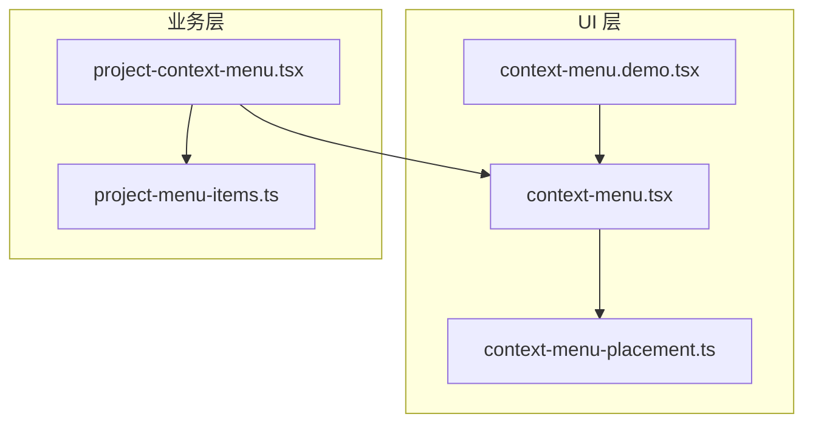
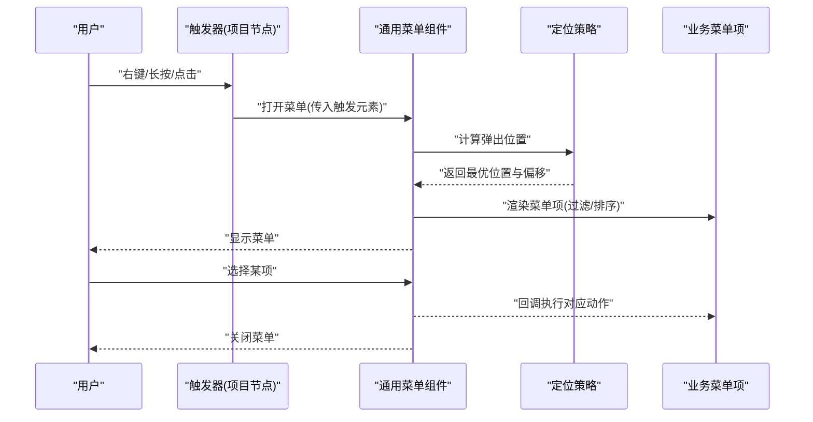
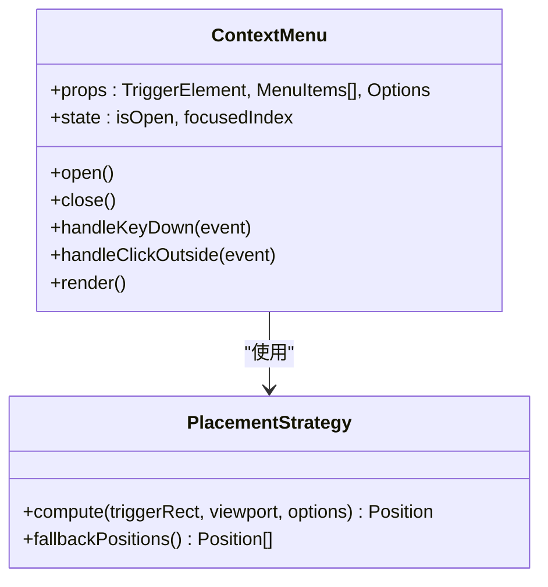
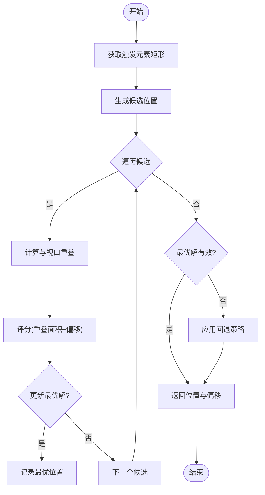
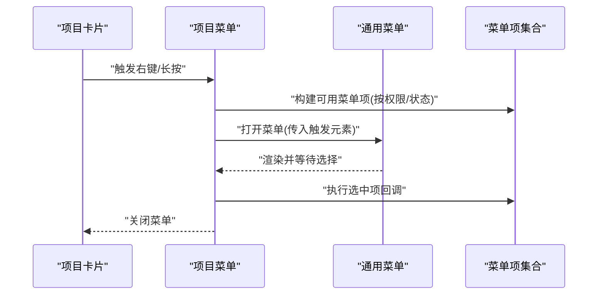
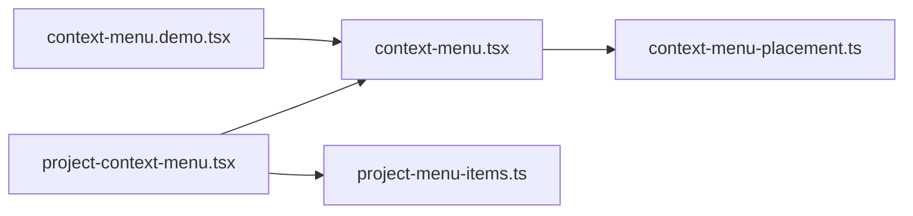

# 项目上下文菜单系统

<cite>
**本文引用的文件**   
- [context-menu.tsx](file://src/components/ui/context-menu.tsx)
- [context-menu-placement.ts](file://src/components/ui/context-menu-placement.ts)
- [context-menu.demo.tsx](file://src/components/ui/context-menu.demo.tsx)
- [project-context-menu.tsx](file://src/features/projects/project-context-menu.tsx)
- [project-menu-items.ts](file://src/features/projects/project-menu-items.ts)
</cite>

## 目录
1. [简介](#简介)
2. [项目结构](#项目结构)
3. [核心组件](#核心组件)
4. [架构总览](#架构总览)
5. [详细组件分析](#详细组件分析)
6. [依赖关系分析](#依赖关系分析)
7. [性能考量](#性能考量)
8. [故障排查指南](#故障排查指南)
9. [结论](#结论)
10. [附录](#附录)

## 简介
本文件系统性梳理“项目上下文菜单系统”的实现与使用，覆盖通用上下文菜单组件、定位策略、以及面向“项目”场景的专用菜单。文档从架构到实现细节逐层展开，帮助读者快速理解并正确扩展该能力。

## 项目结构
上下文菜单系统由两部分组成：
- 通用 UI 层：提供可复用的上下文菜单组件与定位逻辑
- 业务层：基于通用组件封装“项目”相关的菜单项与交互

图表来源
- [context-menu.tsx](file://src/components/ui/context-menu.tsx)
- [context-menu-placement.ts](file://src/components/ui/context-menu-placement.ts)
- [context-menu.demo.tsx](file://src/components/ui/context-menu.demo.tsx)
- [project-context-menu.tsx](file://src/features/projects/project-context-menu.tsx)
- [project-menu-items.ts](file://src/features/projects/project-menu-items.ts)

章节来源
- [context-menu.tsx](file://src/components/ui/context-menu.tsx)
- [context-menu-placement.ts](file://src/components/ui/context-menu-placement.ts)
- [context-menu.demo.tsx](file://src/components/ui/context-menu.demo.tsx)
- [project-context-menu.tsx](file://src/features/projects/project-context-menu.tsx)
- [project-menu-items.ts](file://src/features/projects/project-menu-items.ts)

## 核心组件
- 通用上下文菜单（context-menu.tsx）
  - 职责：渲染触发器、弹出面板、菜单项列表；处理打开/关闭状态、键盘导航、点击外部关闭等
  - 关键特性：受控或无状态显示、位置计算、焦点管理、无障碍支持
- 定位策略（context-menu-placement.ts）
  - 职责：根据触发元素与视口边界计算最佳弹出位置，避免溢出与遮挡
  - 关键特性：多候选位置、自动回退、偏移修正
- 演示入口（context-menu.demo.tsx）
  - 职责：展示基本用法、不同触发方式、自定义样式与行为
- 项目上下文菜单（project-context-menu.tsx）
  - 职责：为“项目卡片/行”提供右键或长按触发的操作菜单
  - 关键特性：组合通用菜单、注入项目相关动作、权限控制
- 项目菜单项（project-menu-items.ts）
  - 职责：定义项目可用的菜单项集合（如重命名、删除、打开等）
  - 关键特性：条件可见性、分组、图标与快捷键提示

章节来源
- [context-menu.tsx](file://src/components/ui/context-menu.tsx)
- [context-menu-placement.ts](file://src/components/ui/context-menu-placement.ts)
- [context-menu.demo.tsx](file://src/components/ui/context-menu.demo.tsx)
- [project-context-menu.tsx](file://src/features/projects/project-context-menu.tsx)
- [project-menu-items.ts](file://src/features/projects/project-menu-items.ts)

## 架构总览
下图展示了从用户交互到菜单渲染与定位的整体流程，以及业务层如何复用通用能力。

图表来源
- [context-menu.tsx](file://src/components/ui/context-menu.tsx)
- [context-menu-placement.ts](file://src/components/ui/context-menu-placement.ts)
- [project-context-menu.tsx](file://src/features/projects/project-context-menu.tsx)
- [project-menu-items.ts](file://src/features/projects/project-menu-items.ts)

## 详细组件分析

### 通用上下文菜单（context-menu.tsx）
- 设计要点
  - 触发器与面板分离：通过 ref 获取触发元素尺寸与位置
  - 状态管理：打开/关闭、当前聚焦项、是否禁用
  - 事件处理：鼠标、键盘、滚动、窗口大小变化
  - 可访问性：角色、标签、Tab 顺序、Esc 关闭
- 数据流
  - 输入：触发元素、菜单项数组、回调函数、可选配置（如最大高度、是否跟随滚动）
  - 输出：渲染结果、事件回调
- 错误边界
  - 触发元素不可用时降级为居中显示
  - 菜单项为空时隐藏面板

图表来源
- [context-menu.tsx](file://src/components/ui/context-menu.tsx)
- [context-menu-placement.ts](file://src/components/ui/context-menu-placement.ts)

章节来源
- [context-menu.tsx](file://src/components/ui/context-menu.tsx)
- [context-menu-placement.ts](file://src/components/ui/context-menu-placement.ts)

### 定位策略（context-menu-placement.ts）
- 算法流程
  - 收集候选位置（上/下/左/右及对齐方式）
  - 计算每个候选的矩形与视口交集
  - 选择交集最大且偏移最小的位置
  - 若全部溢出，应用回退策略（缩小宽度、调整偏移）
- 复杂度
  - 时间：O(n)，n 为候选位置数量
  - 空间：O(1)，仅维护少量中间变量

图表来源
- [context-menu-placement.ts](file://src/components/ui/context-menu-placement.ts)

章节来源
- [context-menu-placement.ts](file://src/components/ui/context-menu-placement.ts)

### 项目上下文菜单（project-context-menu.tsx）
- 职责
  - 将“项目”实体与通用菜单组合
  - 根据权限与状态动态过滤菜单项
  - 统一处理项目级操作（打开、重命名、删除等）
- 交互序列

图表来源
- [project-context-menu.tsx](file://src/features/projects/project-context-menu.tsx)
- [project-menu-items.ts](file://src/features/projects/project-menu-items.ts)
- [context-menu.tsx](file://src/components/ui/context-menu.tsx)

章节来源
- [project-context-menu.tsx](file://src/features/projects/project-context-menu.tsx)
- [project-menu-items.ts](file://src/features/projects/project-menu-items.ts)

### 项目菜单项（project-menu-items.ts）
- 内容组织
  - 分组：基础操作、高级操作、危险操作
  - 字段：标识、标题、图标、快捷键、可见性条件、禁用条件、回调
- 扩展点
  - 新增操作只需在集合中追加条目，无需修改渲染逻辑
  - 权限与状态通过条件函数控制

章节来源
- [project-menu-items.ts](file://src/features/projects/project-menu-items.ts)

### 演示与示例（context-menu.demo.tsx）
- 用途
  - 展示不同触发方式（右键、长按、按钮）
  - 演示自定义样式、禁用项、分组、快捷键提示
- 学习建议
  - 参考其 props 传参与回调绑定方式，迁移至业务组件

章节来源
- [context-menu.demo.tsx](file://src/components/ui/context-menu.demo.tsx)

## 依赖关系分析
- 组件耦合
  - 项目菜单强依赖通用菜单与定位策略，但通过接口隔离，便于替换实现
  - 菜单项与渲染解耦，利于扩展与维护
- 外部依赖
  - DOM API：用于测量与定位
  - 事件系统：鼠标、键盘、触摸
- 潜在循环依赖
  - 通过单向依赖（业务→UI）避免循环

图表来源
- [project-context-menu.tsx](file://src/features/projects/project-context-menu.tsx)
- [context-menu.tsx](file://src/components/ui/context-menu.tsx)
- [context-menu-placement.ts](file://src/components/ui/context-menu-placement.ts)
- [project-menu-items.ts](file://src/features/projects/project-menu-items.ts)
- [context-menu.demo.tsx](file://src/components/ui/context-menu.demo.tsx)

章节来源
- [project-context-menu.tsx](file://src/features/projects/project-context-menu.tsx)
- [context-menu.tsx](file://src/components/ui/context-menu.tsx)
- [context-menu-placement.ts](file://src/components/ui/context-menu-placement.ts)
- [project-menu-items.ts](file://src/features/projects/project-menu-items.ts)
- [context-menu.demo.tsx](file://src/components/ui/context-menu.demo.tsx)

## 性能考量
- 定位计算
  - 缓存触发元素矩形，仅在滚动/缩放/窗口大小变化时重新计算
  - 限制候选位置数量，避免过多几何计算
- 渲染优化
  - 菜单项按需渲染，长列表虚拟化
  - 防抖/节流高频事件（滚动、resize）
- 内存管理
  - 及时移除全局事件监听
  - 释放临时对象引用

## 故障排查指南
- 常见问题
  - 菜单溢出屏幕：检查定位策略的回退逻辑与偏移参数
  - 点击外部不关闭：确认全局点击监听是否正确注册与清理
  - 键盘导航失效：检查 Tab 顺序与焦点管理
  - 移动端长按无效：确认触摸事件与延迟策略
- 调试建议
  - 打印触发元素矩形与最终位置
  - 使用浏览器开发者工具观察事件冒泡
  - 在菜单项回调中增加日志与断点

## 结论
本项目上下文菜单系统以“通用组件 + 业务封装”的模式实现高内聚、低耦合的设计。通用层负责交互与定位，业务层专注菜单内容与权限控制。通过清晰的依赖关系与可扩展的菜单项模型，系统具备良好的可维护性与演进空间。

## 附录
- 最佳实践
  - 始终提供无障碍支持（角色、标签、键盘导航）
  - 对敏感操作（如删除）二次确认
  - 为长列表启用虚拟化
  - 在移动端适配触摸手势与延迟
- 扩展指引
  - 新增菜单项：在业务菜单项集合中添加条目
  - 自定义定位：实现新的定位策略并注入通用菜单
  - 主题定制：通过样式覆盖或主题变量统一外观