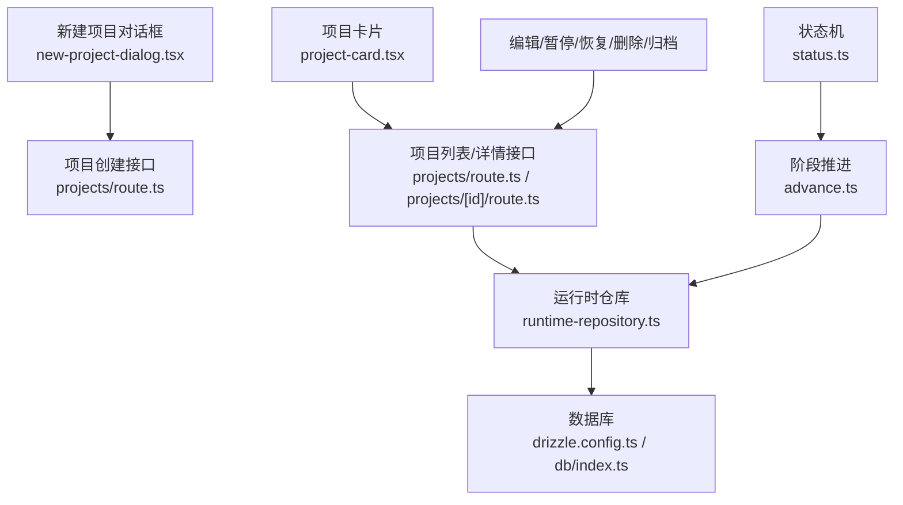
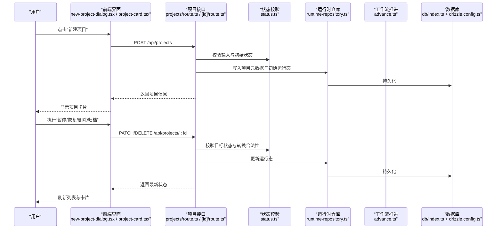
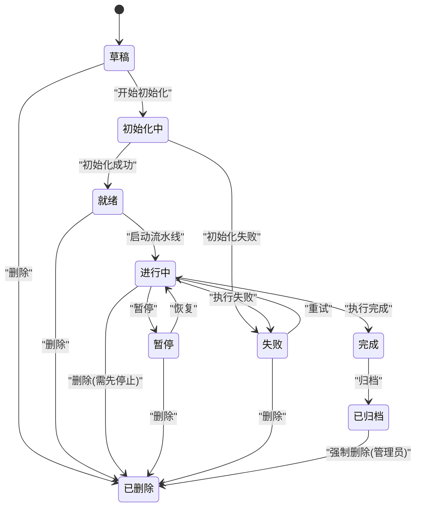
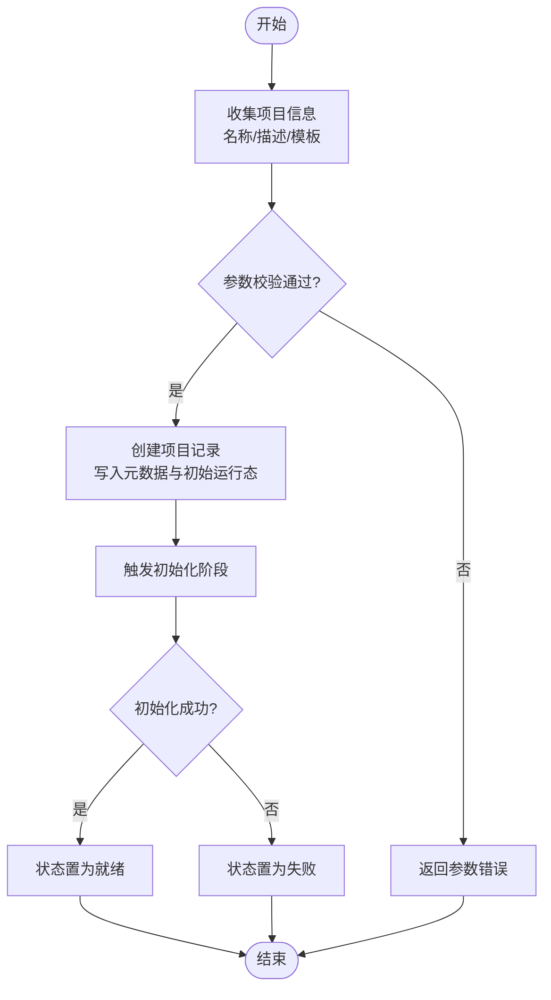
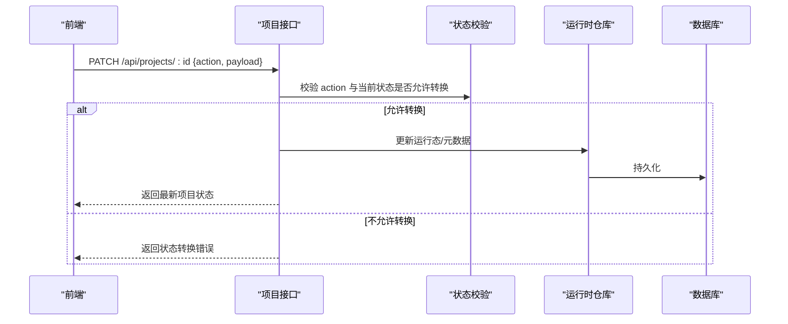
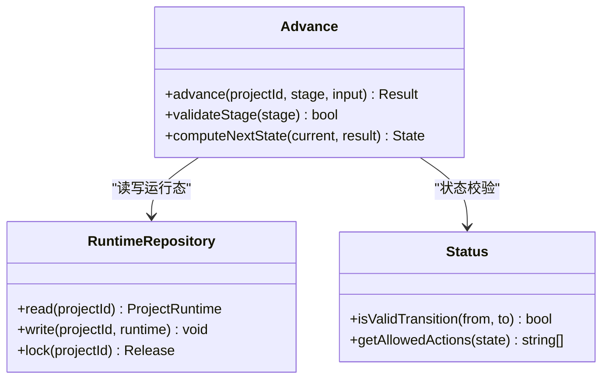
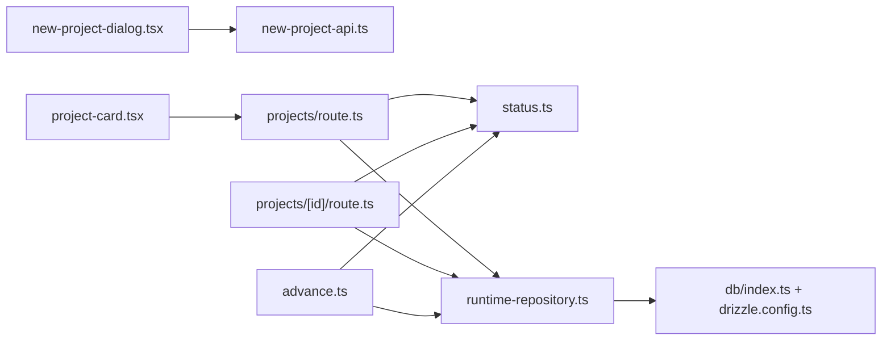

# 项目生命周期管理

<cite>
**本文引用的文件**   
- [src/app/api/projects/route.ts](file://src/app/api/projects/route.ts)
- [src/app/api/projects/[id]/route.ts](file://src/app/api/projects/[id]/route.ts)
- [src/app/_components/new-project-dialog.tsx](file://src/app/_components/new-project-dialog.tsx)
- [src/app/_components/new-project-api.ts](file://src/app/_components/new-project-api.ts)
- [src/components/ui/project-card.tsx](file://src/components/ui/project-card.tsx)
- [src/features/canvas/types.ts](file://src/features/canvas/types.ts)
- [src/features/canvas/status.ts](file://src/features/canvas/status.ts)
- [src/features/director/advance.ts](file://src/features/director/advance.ts)
- [src/features/director/runtime-repository.ts](file://src/features/director/runtime-repository.ts)
- [src/lib/db/index.ts](file://src/lib/db/index.ts)
- [drizzle.config.ts](file://drizzle.config.ts)
</cite>

## 目录
1. [简介](#简介)
2. [项目结构](#项目结构)
3. [核心组件](#核心组件)
4. [架构总览](#架构总览)
5. [详细组件分析](#详细组件分析)
6. [依赖分析](#依赖分析)
7. [性能考虑](#性能考虑)
8. [故障排查指南](#故障排查指南)
9. [结论](#结论)
10. [附录：API 参考](#附录api-参考)

## 简介
本文件面向 PurpleInk 项目的“项目生命周期管理”，系统化阐述从创建、初始化、编辑、暂停、恢复、删除到归档的完整流程，并给出状态管理机制（状态转换规则、状态验证与业务约束）、数据模型设计（元数据、配置、关联关系）以及完整的 CRUD API 文档。同时覆盖批量操作、搜索过滤、排序分页等能力说明，帮助开发者与使用者快速理解并正确使用项目生命周期相关功能。

## 项目结构
围绕项目生命周期，前端与后端的关键位置如下：
- 前端入口与交互
  - 新建项目对话框与调用封装：[src/app/_components/new-project-dialog.tsx](file://src/app/_components/new-project-dialog.tsx)、[src/app/_components/new-project-api.ts](file://src/app/_components/new-project-api.ts)
  - 项目卡片展示与基础操作入口：[src/components/ui/project-card.tsx](file://src/components/ui/project-card.tsx)
- 后端接口
  - 项目列表与创建：[src/app/api/projects/route.ts](file://src/app/api/projects/route.ts)
  - 项目详情与单条更新（含暂停/恢复/删除/归档等）：[src/app/api/projects/[id]/route.ts](file://src/app/api/projects/[id]/route.ts)
- 领域模型与状态
  - 画布/项目类型定义：[src/features/canvas/types.ts](file://src/features/canvas/types.ts)
  - 状态枚举与校验：[src/features/canvas/status.ts](file://src/features/canvas/status.ts)
- 工作流推进与运行时持久化
  - 阶段推进逻辑：[src/features/director/advance.ts](file://src/features/director/advance.ts)
  - 运行时仓库（读写项目运行态）：[src/features/director/runtime-repository.ts](file://src/features/director/runtime-repository.ts)
- 数据库配置
  - Drizzle 配置：[drizzle.config.ts](file://drizzle.config.ts)
  - 数据库连接入口：[src/lib/db/index.ts](file://src/lib/db/index.ts)

**图表来源** 
- [src/app/_components/new-project-dialog.tsx](file://src/app/_components/new-project-dialog.tsx)
- [src/app/_components/new-project-api.ts](file://src/app/_components/new-project-api.ts)
- [src/components/ui/project-card.tsx](file://src/components/ui/project-card.tsx)
- [src/app/api/projects/route.ts](file://src/app/api/projects/route.ts)
- [src/app/api/projects/[id]/route.ts](file://src/app/api/projects/[id]/route.ts)
- [src/features/director/runtime-repository.ts](file://src/features/director/runtime-repository.ts)
- [src/features/canvas/status.ts](file://src/features/canvas/status.ts)
- [src/features/director/advance.ts](file://src/features/director/advance.ts)
- [drizzle.config.ts](file://drizzle.config.ts)
- [src/lib/db/index.ts](file://src/lib/db/index.ts)

**章节来源**
- [src/app/api/projects/route.ts](file://src/app/api/projects/route.ts)
- [src/app/api/projects/[id]/route.ts](file://src/app/api/projects/[id]/route.ts)
- [src/app/_components/new-project-dialog.tsx](file://src/app/_components/new-project-dialog.tsx)
- [src/app/_components/new-project-api.ts](file://src/app/_components/new-project-api.ts)
- [src/components/ui/project-card.tsx](file://src/components/ui/project-card.tsx)
- [src/features/canvas/types.ts](file://src/features/canvas/types.ts)
- [src/features/canvas/status.ts](file://src/features/canvas/status.ts)
- [src/features/director/advance.ts](file://src/features/director/advance.ts)
- [src/features/director/runtime-repository.ts](file://src/features/director/runtime-repository.ts)
- [drizzle.config.ts](file://drizzle.config.ts)
- [src/lib/db/index.ts](file://src/lib/db/index.ts)

## 核心组件
- 新建项目对话框与 API 封装
  - 负责收集用户输入（名称、描述、模板选择等），调用项目创建接口，并在成功后刷新项目列表。
  - 关键路径：[src/app/_components/new-project-dialog.tsx](file://src/app/_components/new-project-dialog.tsx)、[src/app/_components/new-project-api.ts](file://src/app/_components/new-project-api.ts)
- 项目卡片
  - 展示项目基本信息与当前状态，提供进入编辑、暂停/恢复、删除、归档等操作入口。
  - 关键路径：[src/components/ui/project-card.tsx](file://src/components/ui/project-card.tsx)
- 项目接口层
  - 列表与创建：[src/app/api/projects/route.ts](file://src/app/api/projects/route.ts)
  - 单条更新（含状态变更与删除/归档）：[src/app/api/projects/[id]/route.ts](file://src/app/api/projects/[id]/route.ts)
- 状态与工作流
  - 状态枚举与校验：[src/features/canvas/status.ts](file://src/features/canvas/status.ts)
  - 阶段推进（如初始化、生成、渲染等）：[src/features/director/advance.ts](file://src/features/director/advance.ts)
  - 运行时仓库（读写项目运行态）：[src/features/director/runtime-repository.ts](file://src/features/director/runtime-repository.ts)

**章节来源**
- [src/app/_components/new-project-dialog.tsx](file://src/app/_components/new-project-dialog.tsx)
- [src/app/_components/new-project-api.ts](file://src/app/_components/new-project-api.ts)
- [src/components/ui/project-card.tsx](file://src/components/ui/project-card.tsx)
- [src/app/api/projects/route.ts](file://src/app/api/projects/route.ts)
- [src/app/api/projects/[id]/route.ts](file://src/app/api/projects/[id]/route.ts)
- [src/features/canvas/status.ts](file://src/features/canvas/status.ts)
- [src/features/director/advance.ts](file://src/features/director/advance.ts)
- [src/features/director/runtime-repository.ts](file://src/features/director/runtime-repository.ts)

## 架构总览
下图展示了项目生命周期在前后端的整体交互：前端通过对话框或卡片触发接口，后端进行参数校验、权限检查、状态验证与业务约束，再调用运行时仓库持久化，必要时推进工作流阶段。

**图表来源** 
- [src/app/_components/new-project-dialog.tsx](file://src/app/_components/new-project-dialog.tsx)
- [src/components/ui/project-card.tsx](file://src/components/ui/project-card.tsx)
- [src/app/api/projects/route.ts](file://src/app/api/projects/route.ts)
- [src/app/api/projects/[id]/route.ts](file://src/app/api/projects/[id]/route.ts)
- [src/features/canvas/status.ts](file://src/features/canvas/status.ts)
- [src/features/director/runtime-repository.ts](file://src/features/director/runtime-repository.ts)
- [src/features/director/advance.ts](file://src/features/director/advance.ts)
- [src/lib/db/index.ts](file://src/lib/db/index.ts)
- [drizzle.config.ts](file://drizzle.config.ts)

## 详细组件分析

### 项目数据模型与状态机制
- 数据模型要点
  - 项目元数据：标识、名称、描述、创建/更新时间、所有者、版本兼容信息等。
  - 配置信息：模板、渲染参数、媒体源、导出设置等。
  - 关联关系：与画布节点、素材、任务、渲染产物等的关联。
  - 关键类型定义参考：[src/features/canvas/types.ts](file://src/features/canvas/types.ts)
- 状态管理与转换
  - 状态枚举与校验：[src/features/canvas/status.ts](file://src/features/canvas/status.ts)
  - 典型状态包括：草稿、初始化中、就绪、进行中、暂停、失败、完成、已归档、已删除等。
  - 转换规则建议：
    - 草稿 → 初始化中 → 就绪 → 进行中 → 暂停/失败/完成
    - 进行中 ↔ 暂停（可恢复）
    - 失败 → 重试（回到进行中或初始化中）
    - 完成 → 归档（不可逆）
    - 任意非终态 → 删除（软删除标记）
  - 状态验证与业务约束：
    - 仅允许合法转换；非法转换应返回明确的错误码与提示。
    - 删除前需确认无活跃任务；归档后禁止修改。
    - 并发更新需加锁或版本号控制，避免竞态条件。

**图表来源** 
- [src/features/canvas/status.ts](file://src/features/canvas/status.ts)

**章节来源**
- [src/features/canvas/types.ts](file://src/features/canvas/types.ts)
- [src/features/canvas/status.ts](file://src/features/canvas/status.ts)

### 项目创建与初始化流程
- 前端发起创建请求，携带必要元数据与默认配置。
- 后端校验输入、生成唯一标识、写入初始运行态，并触发初始化阶段。
- 初始化完成后状态切换为就绪，前端刷新列表并展示项目卡片。

**图表来源** 
- [src/app/_components/new-project-dialog.tsx](file://src/app/_components/new-project-dialog.tsx)
- [src/app/_components/new-project-api.ts](file://src/app/_components/new-project-api.ts)
- [src/app/api/projects/route.ts](file://src/app/api/projects/route.ts)
- [src/features/director/advance.ts](file://src/features/director/advance.ts)
- [src/features/director/runtime-repository.ts](file://src/features/director/runtime-repository.ts)

**章节来源**
- [src/app/_components/new-project-dialog.tsx](file://src/app/_components/new-project-dialog.tsx)
- [src/app/_components/new-project-api.ts](file://src/app/_components/new-project-api.ts)
- [src/app/api/projects/route.ts](file://src/app/api/projects/route.ts)
- [src/features/director/advance.ts](file://src/features/director/advance.ts)
- [src/features/director/runtime-repository.ts](file://src/features/director/runtime-repository.ts)

### 项目编辑、暂停、恢复、删除与归档
- 编辑：更新元数据与配置，需校验权限与版本冲突。
- 暂停：将进行中状态转为暂停，确保无写冲突。
- 恢复：将暂停状态转回进行中，继续执行流水线。
- 删除：软删除标记，清理或保留历史产物（按策略）。
- 归档：将完成状态归档，禁止后续编辑。

**图表来源** 
- [src/app/api/projects/[id]/route.ts](file://src/app/api/projects/[id]/route.ts)
- [src/features/canvas/status.ts](file://src/features/canvas/status.ts)
- [src/features/director/runtime-repository.ts](file://src/features/director/runtime-repository.ts)

**章节来源**
- [src/app/api/projects/[id]/route.ts](file://src/app/api/projects/[id]/route.ts)
- [src/features/canvas/status.ts](file://src/features/canvas/status.ts)
- [src/features/director/runtime-repository.ts](file://src/features/director/runtime-repository.ts)

### 工作流推进与状态一致性
- 阶段推进由 advance 模块驱动，根据当前阶段与输入产出决定下一状态。
- 运行时仓库负责读取/写入项目运行态，保证状态一致性与幂等性。
- 建议在推进过程中加入重试与补偿机制，处理外部依赖失败。

**图表来源** 
- [src/features/director/advance.ts](file://src/features/director/advance.ts)
- [src/features/director/runtime-repository.ts](file://src/features/director/runtime-repository.ts)
- [src/features/canvas/status.ts](file://src/features/canvas/status.ts)

**章节来源**
- [src/features/director/advance.ts](file://src/features/director/advance.ts)
- [src/features/director/runtime-repository.ts](file://src/features/director/runtime-repository.ts)
- [src/features/canvas/status.ts](file://src/features/canvas/status.ts)

## 依赖分析
- 前端依赖
  - new-project-dialog.tsx 依赖 new-project-api.ts 进行网络请求。
  - project-card.tsx 依赖项目接口获取列表与详情。
- 后端依赖
  - projects/route.ts 与 [id]/route.ts 依赖 status.ts 做状态校验，依赖 runtime-repository.ts 做持久化。
  - advance.ts 依赖 runtime-repository.ts 与 status.ts。
- 数据库依赖
  - drizzle.config.ts 与 db/index.ts 提供数据库连接与迁移配置。

**图表来源** 
- [src/app/_components/new-project-dialog.tsx](file://src/app/_components/new-project-dialog.tsx)
- [src/app/_components/new-project-api.ts](file://src/app/_components/new-project-api.ts)
- [src/components/ui/project-card.tsx](file://src/components/ui/project-card.tsx)
- [src/app/api/projects/route.ts](file://src/app/api/projects/route.ts)
- [src/app/api/projects/[id]/route.ts](file://src/app/api/projects/[id]/route.ts)
- [src/features/canvas/status.ts](file://src/features/canvas/status.ts)
- [src/features/director/advance.ts](file://src/features/director/advance.ts)
- [src/features/director/runtime-repository.ts](file://src/features/director/runtime-repository.ts)
- [src/lib/db/index.ts](file://src/lib/db/index.ts)
- [drizzle.config.ts](file://drizzle.config.ts)

**章节来源**
- [src/app/_components/new-project-dialog.tsx](file://src/app/_components/new-project-dialog.tsx)
- [src/app/_components/new-project-api.ts](file://src/app/_components/new-project-api.ts)
- [src/components/ui/project-card.tsx](file://src/components/ui/project-card.tsx)
- [src/app/api/projects/route.ts](file://src/app/api/projects/route.ts)
- [src/app/api/projects/[id]/route.ts](file://src/app/api/projects/[id]/route.ts)
- [src/features/canvas/status.ts](file://src/features/canvas/status.ts)
- [src/features/director/advance.ts](file://src/features/director/advance.ts)
- [src/features/director/runtime-repository.ts](file://src/features/director/runtime-repository.ts)
- [src/lib/db/index.ts](file://src/lib/db/index.ts)
- [drizzle.config.ts](file://drizzle.config.ts)

## 性能考虑
- 列表查询优化
  - 使用分页与字段投影减少传输体积。
  - 对常用筛选字段建立索引（如状态、创建时间、所有者）。
- 状态更新与并发
  - 采用乐观锁或版本号避免覆盖更新。
  - 对耗时操作（初始化、渲染）异步化，避免阻塞请求。
- 缓存策略
  - 对只读项目列表与详情进行短期缓存，降低数据库压力。
- I/O 与存储
  - 大文件上传/下载使用分片与断点续传。
  - 产物归档至对象存储，数据库仅存引用。

## 故障排查指南
- 常见错误与定位
  - 参数校验失败：检查请求体字段类型与必填项。
  - 状态转换非法：核对当前状态与目标动作是否允许。
  - 并发冲突：检查版本号或锁机制是否生效。
  - 外部依赖失败：查看日志与重试策略。
- 调试步骤
  - 启用详细日志，记录请求/响应与状态变更。
  - 使用测试用例复现问题，逐步缩小范围。
  - 检查数据库事务与索引使用情况。

**章节来源**
- [src/app/api/projects/route.ts](file://src/app/api/projects/route.ts)
- [src/app/api/projects/[id]/route.ts](file://src/app/api/projects/[id]/route.ts)
- [src/features/canvas/status.ts](file://src/features/canvas/status.ts)
- [src/features/director/runtime-repository.ts](file://src/features/director/runtime-repository.ts)

## 结论
PurpleInk 的项目生命周期管理以清晰的状态机为核心，结合前后端协作实现创建、初始化、编辑、暂停、恢复、删除与归档的全流程。通过严格的参数校验、状态验证与业务约束，保障数据一致性与用户体验。配合合理的性能优化与完善的故障排查手段，系统可在高并发与复杂场景下稳定运行。

## 附录：API 参考
以下列出项目生命周期相关的核心接口规范（请求参数、响应格式、错误处理）。具体实现以实际代码为准，本节用于指导集成与测试。

- 项目列表与创建
  - 方法：POST /api/projects
  - 请求体字段：名称、描述、模板、初始配置等（必填项见实现）
  - 响应：项目元数据与初始运行态
  - 错误：参数校验失败、权限不足、重复创建
  - 参考路径：[src/app/api/projects/route.ts](file://src/app/api/projects/route.ts)

- 项目详情与更新（含暂停/恢复/删除/归档）
  - 方法：PATCH /api/projects/:id
  - 请求体字段：action（如 pause/resume/archive/delete/update）、payload（随 action 变化）
  - 响应：更新后的项目元数据与运行态
  - 错误：状态转换非法、资源不存在、并发冲突、权限不足
  - 参考路径：[src/app/api/projects/[id]/route.ts](file://src/app/api/projects/[id]/route.ts)

- 项目删除（硬删/软删）
  - 方法：DELETE /api/projects/:id
  - 行为：软删除标记或物理删除（依策略）
  - 错误：存在活跃任务、权限不足
  - 参考路径：[src/app/api/projects/[id]/route.ts](file://src/app/api/projects/[id]/route.ts)

- 批量操作
  - 方法：POST /api/projects/batch
  - 请求体：actions（数组，每项包含 id 与 action/payload）
  - 响应：各操作的执行结果（成功/失败明细）
  - 错误：部分失败时返回明细错误，事务回滚策略可配置
  - 参考路径：[src/app/api/projects/route.ts](file://src/app/api/projects/route.ts)

- 搜索与过滤
  - 方法：GET /api/projects
  - 查询参数：keyword、status、ownerId、createdAtRange、updatedAtRange 等
  - 响应：分页结果（items、total、page、pageSize）
  - 错误：参数非法、权限不足
  - 参考路径：[src/app/api/projects/route.ts](file://src/app/api/projects/route.ts)

- 排序与分页
  - 查询参数：sortBy（如 createdAt、name）、order（asc/desc）、page、pageSize
  - 响应：分页结构与排序结果
  - 错误：不支持的排序字段、越界页码
  - 参考路径：[src/app/api/projects/route.ts](file://src/app/api/projects/route.ts)

- 错误处理约定
  - 统一错误码与消息结构，便于前端提示与日志追踪。
  - 常见错误码：400（参数错误）、401（未授权）、403（权限不足）、404（资源不存在）、409（冲突）、500（服务器错误）。

**章节来源**
- [src/app/api/projects/route.ts](file://src/app/api/projects/route.ts)
- [src/app/api/projects/[id]/route.ts](file://src/app/api/projects/[id]/route.ts)