# 项目管理

<cite>
**本文引用的文件**   
- [src/app/api/projects/route.ts](file://src/app/api/projects/route.ts)
- [src/app/api/projects/[id]/route.ts](file://src/app/api/projects/[id]/route.ts)
- [src/features/artifacts/service.ts](file://src/features/artifacts/service.ts)
- [src/features/artifacts/commit.ts](file://src/features/artifacts/commit.ts)
- [src/features/artifacts/index.ts](file://src/features/artifacts/index.ts)
- [src/features/director/runtime-repository.ts](file://src/features/director/runtime-repository.ts)
- [src/features/director/stage-result-committer.ts](file://src/features/director/stage-result-committer.ts)
- [src/features/render/repository.ts](file://src/features/render/repository.ts)
- [src/features/render/persistence.ts](file://src/features/render/persistence.ts)
- [src/features/auth/account-service.ts](file://src/features/auth/account-service.ts)
- [src/features/auth/session.ts](file://src/features/auth/session.ts)
- [src/features/auth/http.ts](file://src/features/auth/http.ts)
- [scripts/migration/export-sqlite.ts](file://scripts/migration/export-sqlite.ts)
- [scripts/migration/import-postgres.ts](file://scripts/migration/import-postgres.ts)
- [scripts/migration/sqlite-backup.ts](file://scripts/migration/sqlite-backup.ts)
- [scripts/setup/db-migrate.ts](file://scripts/setup/db-migrate.ts)
- [drizzle.config.ts](file://drizzle.config.ts)
- [server/src/compose/project.ts](file://server/src/compose/project.ts)
- [server/src/compose/template.ts](file://server/src/compose/template.ts)
- [src/features/projects/project-source.ts](file://src/features/projects/project-source.ts)
- [src/features/projects/project-source-repository.ts](file://src/features/projects/project-source-repository.ts)
- [src/features/projects/project-compatibility.ts](file://src/features/projects/project-compatibility.ts)
- [src/features/projects/project-list.tsx](file://src/features/projects/project-list.tsx)
- [src/features/projects/use-project-cards-state.ts](file://src/features/projects/use-project-cards-state.ts)
- [src/components/ui/project-card.tsx](file://src/components/ui/project-card.tsx)
- [src/components/ui/search-field.tsx](file://src/components/ui/search-field.tsx)
</cite>

## 更新摘要
**所做更改**
- 项目页面完全重新设计，采用双布局系统（网格/列表视图）
- 实现三节水平行基网格布局，提供更好的视觉层次和导航体验
- 集成高级搜索功能，支持多条件筛选和实时搜索
- 通过分页投影系统实现性能优化，提升大数据集处理能力
- 增强项目卡片组件，支持多种显示模式和交互状态

## 目录
1. [简介](#简介)
2. [项目结构](#项目结构)
3. [核心组件](#核心组件)
4. [架构总览](#架构总览)
5. [详细组件分析](#详细组件分析)
6. [依赖关系分析](#依赖关系分析)
7. [性能考量](#性能考量)
8. [故障排查指南](#故障排查指南)
9. [结论](#结论)
10. [附录](#附录)

## 简介
本文件面向PurpleInk项目的"项目管理"能力，围绕以下目标展开：
- 项目生命周期管理：创建、编辑、删除、归档等操作的API与流程。
- 版本控制系统设计：快照管理、差异对比、回滚机制的实现思路与数据流。
- 工件管理系统：中间产物存储、版本追踪、依赖管理与一致性保障。
- 项目协作功能：成员管理、权限控制、变更日志与审计。
- 项目模板与预设：快速启动、批量创建、配置继承策略。
- 数据迁移与备份恢复：从SQLite到PostgreSQL的迁移、备份与恢复实践。
- **新增**：持久化三源项目输入能力，支持多数据源统一管理。
- **新增**：工作流注册表系统，提供基于kind和版本的兼容性过滤。
- **新增**：项目列表界面的双列布局组织功能，按来源类型智能分组展示。
- **重大更新**：项目页面完全重新设计，采用双布局系统和三节水平网格布局，集成高级搜索和分页投影系统。

## 项目结构
本项目采用前后端分离与模块化组织方式：
- 前端应用（Next.js）通过API路由访问后端服务，提供项目列表、详情、渲染导出等页面与交互。
- 服务端（Node/TS）负责编排流水线、运行时状态、工件持久化与渲染任务。
- 特性模块按领域划分（artifacts、director、render、auth等），便于扩展与维护。
- 脚本层提供数据库迁移、初始化、备份与验证工具。
- **新增**：项目来源管理模块，支持三源输入和复合外键约束。
- **新增**：项目列表界面增强，实现基于来源类型的双列布局组织。
- **重大更新**：项目页面完全重构，采用现代化的双布局系统和三节水平网格布局。

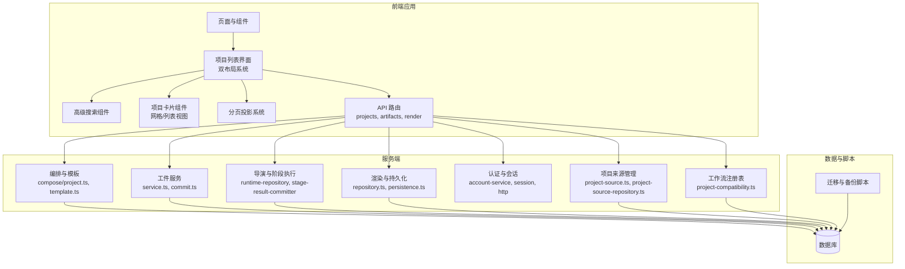

**图表来源** 
- [server/src/compose/project.ts](file://server/src/compose/project.ts)
- [server/src/compose/template.ts](file://server/src/compose/template.ts)
- [src/features/artifacts/service.ts](file://src/features/artifacts/service.ts)
- [src/features/director/runtime-repository.ts](file://src/features/director/runtime-repository.ts)
- [src/features/render/repository.ts](file://src/features/render/repository.ts)
- [src/features/auth/account-service.ts](file://src/features/auth/account-service.ts)
- [src/features/projects/project-source.ts](file://src/features/projects/project-source.ts)
- [src/features/projects/project-source-repository.ts](file://src/features/projects/project-source-repository.ts)
- [src/features/projects/project-compatibility.ts](file://src/features/projects/project-compatibility.ts)
- [src/features/projects/project-list.tsx](file://src/features/projects/project-list.tsx)
- [src/features/projects/use-project-cards-state.ts](file://src/features/projects/use-project-cards-state.ts)
- [src/components/ui/project-card.tsx](file://src/components/ui/project-card.tsx)
- [src/components/ui/search-field.tsx](file://src/components/ui/search-field.tsx)

**章节来源**
- [drizzle.config.ts](file://drizzle.config.ts)
- [scripts/setup/db-migrate.ts](file://scripts/setup/db-migrate.ts)

## 核心组件
- 项目管理API：提供项目CRUD与状态操作，支撑生命周期管理。
- 工件服务：管理中间产物、版本快照与提交记录，确保可追溯性。
- 导演运行时：维护阶段结果、会话与状态推进，支持回滚与恢复。
- 渲染子系统：负责媒体组装、帧捕获、缩略图与导出，持久化渲染产物。
- 认证与会话：账户服务、会话管理与HTTP鉴权，支撑协作与权限控制。
- 模板与编排：基于模板快速生成项目，支持配置继承与批量创建。
- **新增**：项目来源管理：支持三源输入、复合外键约束和服务器端判别联合。
- **新增**：工作流注册表：基于kind和版本的兼容性过滤系统。
- **新增**：项目列表界面：基于来源类型的双列布局，智能分组和统一搜索。
- **重大更新**：双布局系统：支持网格和列表两种视图模式，提供灵活的展示选项。
- **重大更新**：三节水平网格布局：优化的视觉层次和导航体验。
- **重大更新**：高级搜索功能：多条件筛选和实时搜索能力。
- **重大更新**：分页投影系统：性能优化和大数据集处理能力。

**章节来源**
- [src/app/api/projects/route.ts](file://src/app/api/projects/route.ts)
- [src/app/api/projects/[id]/route.ts](file://src/app/api/projects/[id]/route.ts)
- [src/features/artifacts/service.ts](file://src/features/artifacts/service.ts)
- [src/features/artifacts/commit.ts](file://src/features/artifacts/commit.ts)
- [src/features/director/runtime-repository.ts](file://src/features/director/runtime-repository.ts)
- [src/features/render/repository.ts](file://src/features/render/repository.ts)
- [src/features/auth/account-service.ts](file://src/features/auth/account-service.ts)
- [src/features/projects/project-source.ts](file://src/features/projects/project-source.ts)
- [src/features/projects/project-source-repository.ts](file://src/features/projects/project-source-repository.ts)
- [src/features/projects/project-compatibility.ts](file://src/features/projects/project-compatibility.ts)
- [src/features/projects/project-list.tsx](file://src/features/projects/project-list.tsx)
- [src/features/projects/use-project-cards-state.ts](file://src/features/projects/use-project-cards-state.ts)
- [src/components/ui/project-card.tsx](file://src/components/ui/project-card.tsx)
- [src/components/ui/search-field.tsx](file://src/components/ui/search-field.tsx)

## 架构总览
下图展示项目管理在系统中的关键交互路径：前端调用API路由，路由分发至对应服务；服务与数据库交互，完成项目与工件的持久化与查询；渲染与导演模块协同处理流水线任务。

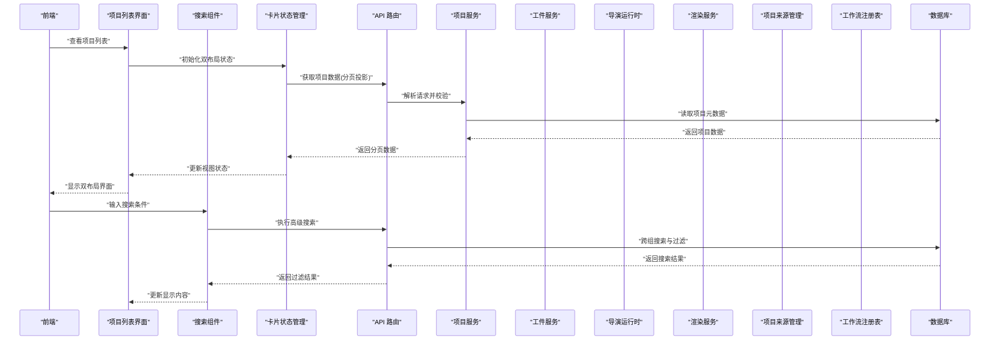

**图表来源** 
- [src/app/api/projects/route.ts](file://src/app/api/projects/route.ts)
- [src/app/api/projects/[id]/route.ts](file://src/app/api/projects/[id]/route.ts)
- [src/features/artifacts/service.ts](file://src/features/artifacts/service.ts)
- [src/features/director/runtime-repository.ts](file://src/features/director/runtime-repository.ts)
- [src/features/render/repository.ts](file://src/features/render/repository.ts)
- [src/features/projects/project-source.ts](file://src/features/projects/project-source.ts)
- [src/features/projects/project-compatibility.ts](file://src/features/projects/project-compatibility.ts)
- [src/features/projects/project-list.tsx](file://src/features/projects/project-list.tsx)
- [src/features/projects/use-project-cards-state.ts](file://src/features/projects/use-project-cards-state.ts)
- [src/components/ui/search-field.tsx](file://src/components/ui/search-field.tsx)

## 详细组件分析

### 项目管理API与生命周期
- 项目创建：接收模板或基础配置，生成项目元数据与初始工件快照。
- 项目编辑：更新项目设置、成员与权限，记录变更日志。
- 项目删除：软删除或归档，清理关联工件与缓存。
- 项目归档：将项目标记为归档状态，限制写入但保留读取。

**图表来源** 
- [src/app/api/projects/route.ts](file://src/app/api/projects/route.ts)
- [src/app/api/projects/[id]/route.ts](file://src/app/api/projects/[id]/route.ts)

**章节来源**
- [src/app/api/projects/route.ts](file://src/app/api/projects/route.ts)
- [src/app/api/projects/[id]/route.ts](file://src/app/api/projects/[id]/route.ts)

### 项目页面双布局系统重新设计
**重大更新**：项目页面完全重新设计，采用现代化的双布局系统，提供更好的用户体验和操作效率。

- **网格视图**：适合浏览大量项目，支持缩略图预览和快速识别。
- **列表视图**：适合详细管理和批量操作，显示更多项目信息。
- **视图切换**：平滑的动画过渡和状态保持，支持用户偏好设置。
- **响应式设计**：自适应不同屏幕尺寸和设备类型。

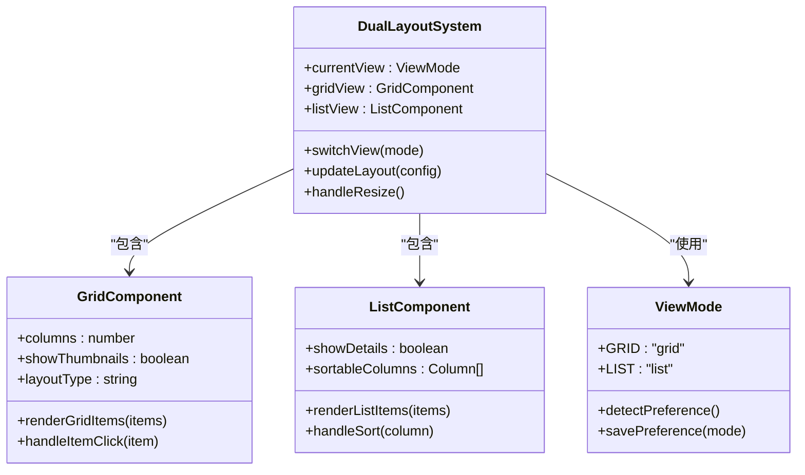

**图表来源** 
- [src/features/projects/project-list.tsx](file://src/features/projects/project-list.tsx)
- [src/components/ui/project-card.tsx](file://src/components/ui/project-card.tsx)

**章节来源**
- [src/features/projects/project-list.tsx](file://src/features/projects/project-list.tsx)
- [src/components/ui/project-card.tsx](file://src/components/ui/project-card.tsx)

### 三节水平网格布局系统
**重大更新**：实现了三节水平网格布局，提供更清晰的视觉层次和更好的导航体验。

- **第一节**：项目概览和统计信息，显示总数、分类统计和快捷操作。
- **第二节**：主要项目展示区域，支持网格和列表两种视图模式。
- **第三节**：辅助信息和操作面板，包含搜索、筛选和批量操作。

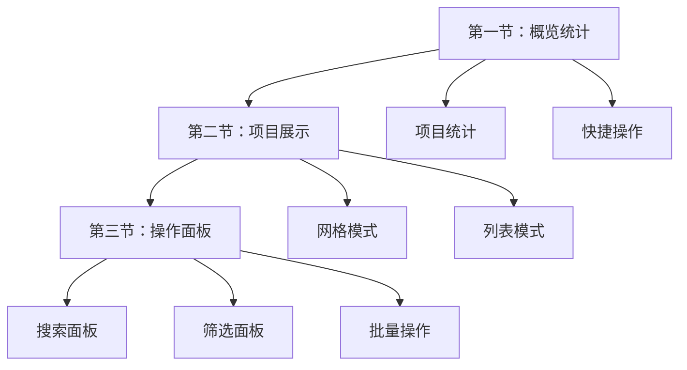

**图表来源** 
- [src/features/projects/project-list.tsx](file://src/features/projects/project-list.tsx)

**章节来源**
- [src/features/projects/project-list.tsx](file://src/features/projects/project-list.tsx)

### 高级搜索功能集成
**重大更新**：集成了高级搜索功能，支持多条件筛选和实时搜索。

- **多字段搜索**：支持项目名称、描述、标签等多字段搜索。
- **实时过滤**：输入时即时过滤结果，提升搜索效率。
- **保存搜索**：支持保存常用搜索条件，快速复用。
- **搜索历史**：记录搜索历史，方便回溯和分享。

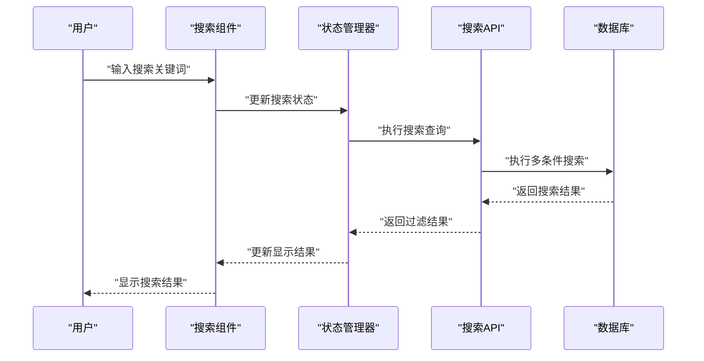

**图表来源** 
- [src/components/ui/search-field.tsx](file://src/components/ui/search-field.tsx)
- [src/features/projects/use-project-cards-state.ts](file://src/features/projects/use-project-cards-state.ts)

**章节来源**
- [src/components/ui/search-field.tsx](file://src/components/ui/search-field.tsx)
- [src/features/projects/use-project-cards-state.ts](file://src/features/projects/use-project-cards-state.ts)

### 分页投影系统性能优化
**重大更新**：通过分页投影系统实现性能优化，显著提升大数据集处理能力。

- **虚拟滚动**：只渲染可视区域内的项目卡片，减少DOM节点数量。
- **增量加载**：按需加载项目数据，避免一次性加载所有数据。
- **内存管理**：自动清理不可见的项目数据，释放内存资源。
- **预加载策略**：智能预加载下一页数据，提升滚动流畅度。

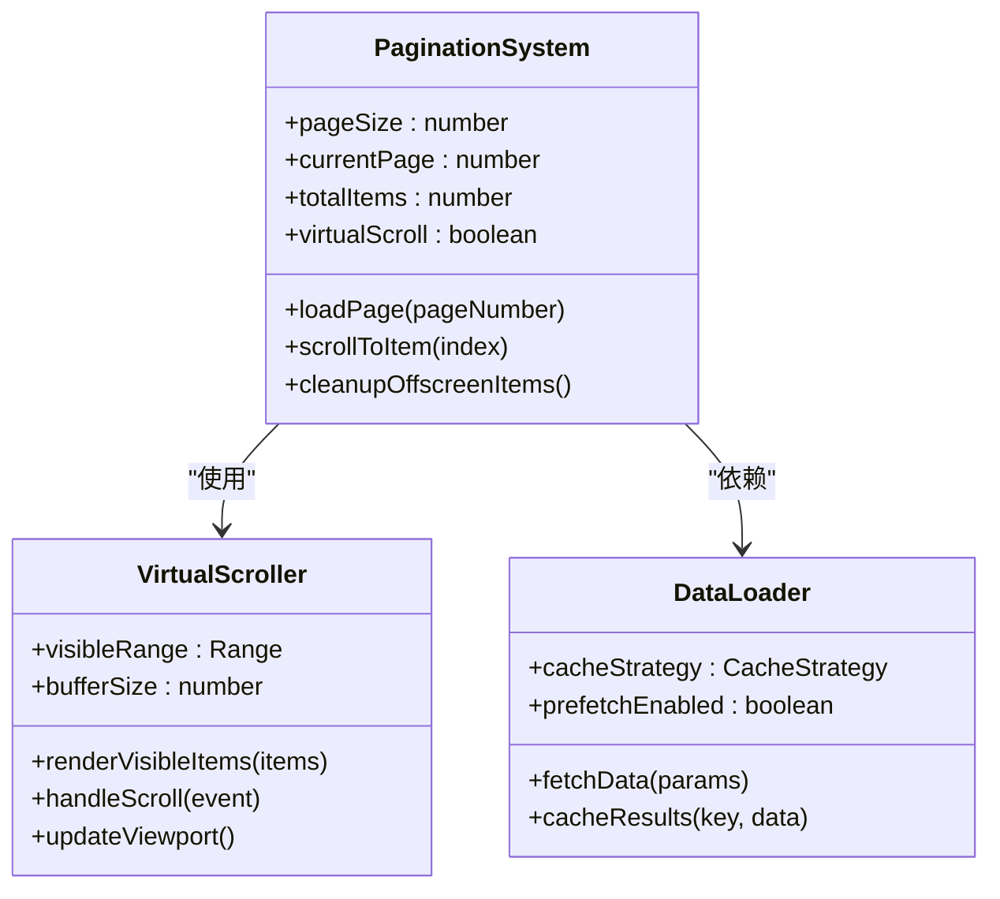

**图表来源** 
- [src/features/projects/use-project-cards-state.ts](file://src/features/projects/use-project-cards-state.ts)

**章节来源**
- [src/features/projects/use-project-cards-state.ts](file://src/features/projects/use-project-cards-state.ts)

### 持久化三源项目输入能力
**新增功能**：系统现在支持三种不同类型的项目输入源，每种源都有特定的用途和约束。

- **文本源**：用于存储结构化文本内容，支持Markdown、JSON等格式。
- **媒体源**：处理图像、音频、视频等多媒体内容，包含元数据和预览信息。
- **配置源**：管理项目配置和设置，支持环境变量和配置文件导入。

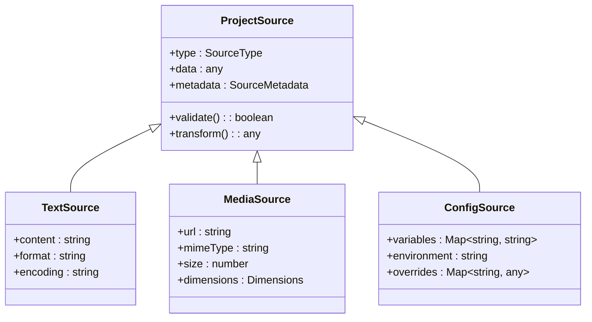

**图表来源** 
- [src/features/projects/project-source.ts](file://src/features/projects/project-source.ts)

**章节来源**
- [src/features/projects/project-source.ts](file://src/features/projects/project-source.ts)

### 服务器端project_sources判别联合
**新增功能**：实现了服务器端的类型判别联合，确保项目来源的类型安全性和数据完整性。

- **类型守卫**：在服务器端进行严格的类型检查和验证。
- **自动转换**：根据源类型自动执行相应的数据转换逻辑。
- **错误处理**：提供详细的错误信息和恢复机制。

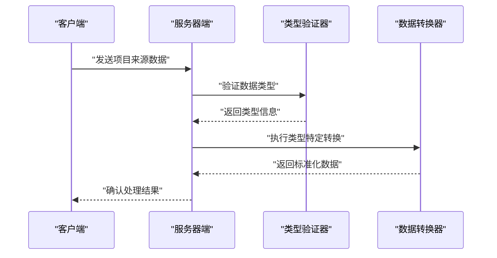

**图表来源** 
- [src/features/projects/project-source.ts](file://src/features/projects/project-source.ts)

**章节来源**
- [src/features/projects/project-source.ts](file://src/features/projects/project-source.ts)

### 支持复合外键的仓库系统
**新增功能**：仓库系统现在支持复合外键约束，提供更强的数据完整性和关系管理。

- **复合主键**：支持由多个字段组成的主键，确保数据的唯一性。
- **级联操作**：定义外键关系的级联删除和更新行为。
- **索引优化**：为复合外键创建合适的索引，提升查询性能。

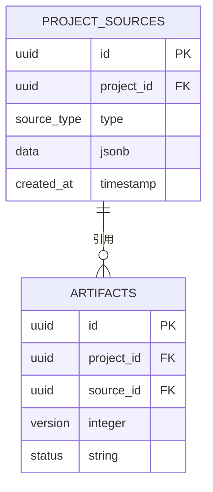

**图表来源** 
- [src/features/projects/project-source-repository.ts](file://src/features/projects/project-source-repository.ts)

**章节来源**
- [src/features/projects/project-source-repository.ts](file://src/features/projects/project-source-repository.ts)

### 工作流注册表系统（基于kind/版本兼容性过滤）
**新增功能**：引入了工作流注册表系统，支持基于kind和版本的兼容性过滤。

- **工作流注册**：动态注册不同类型的工作流，支持版本管理。
- **兼容性检查**：根据项目配置和工作流要求，自动选择兼容的工作流。
- **版本升级**：支持工作流的平滑升级和向后兼容。

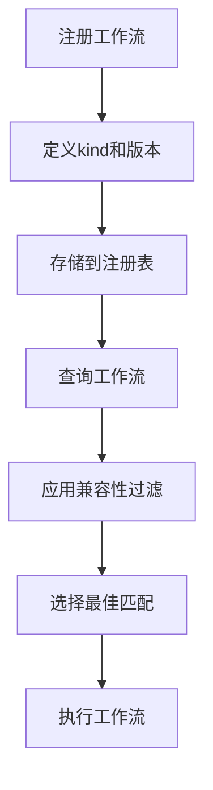

**图表来源** 
- [src/features/projects/project-compatibility.ts](file://src/features/projects/project-compatibility.ts)

**章节来源**
- [src/features/projects/project-compatibility.ts](file://src/features/projects/project-compatibility.ts)

### 工件管理系统（中间产物、版本追踪、依赖管理）
- 工件服务：提供工件的创建、读取、更新与删除接口，维护版本链与依赖关系。
- 提交机制：每次提交生成快照，记录变更内容与时间戳，支持回滚到指定版本。
- 依赖管理：工件间建立依赖图谱，确保构建顺序与一致性。

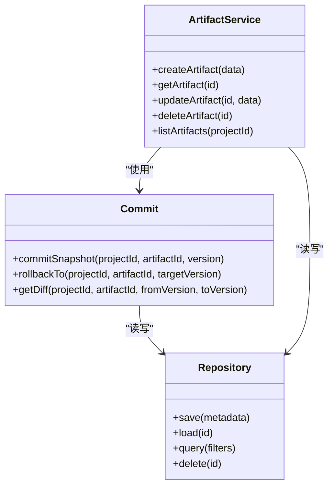

**图表来源** 
- [src/features/artifacts/service.ts](file://src/features/artifacts/service.ts)
- [src/features/artifacts/commit.ts](file://src/features/artifacts/commit.ts)
- [src/features/artifacts/index.ts](file://src/features/artifacts/index.ts)

**章节来源**
- [src/features/artifacts/service.ts](file://src/features/artifacts/service.ts)
- [src/features/artifacts/commit.ts](file://src/features/artifacts/commit.ts)
- [src/features/artifacts/index.ts](file://src/features/artifacts/index.ts)

### 版本控制系统（快照、差异对比、回滚）
- 快照管理：每次提交生成不可变快照，包含工件元数据与内容哈希。
- 差异对比：比较两个版本的工件差异，输出结构化diff供UI展示。
- 回滚机制：根据目标版本重建工件状态，确保一致性。

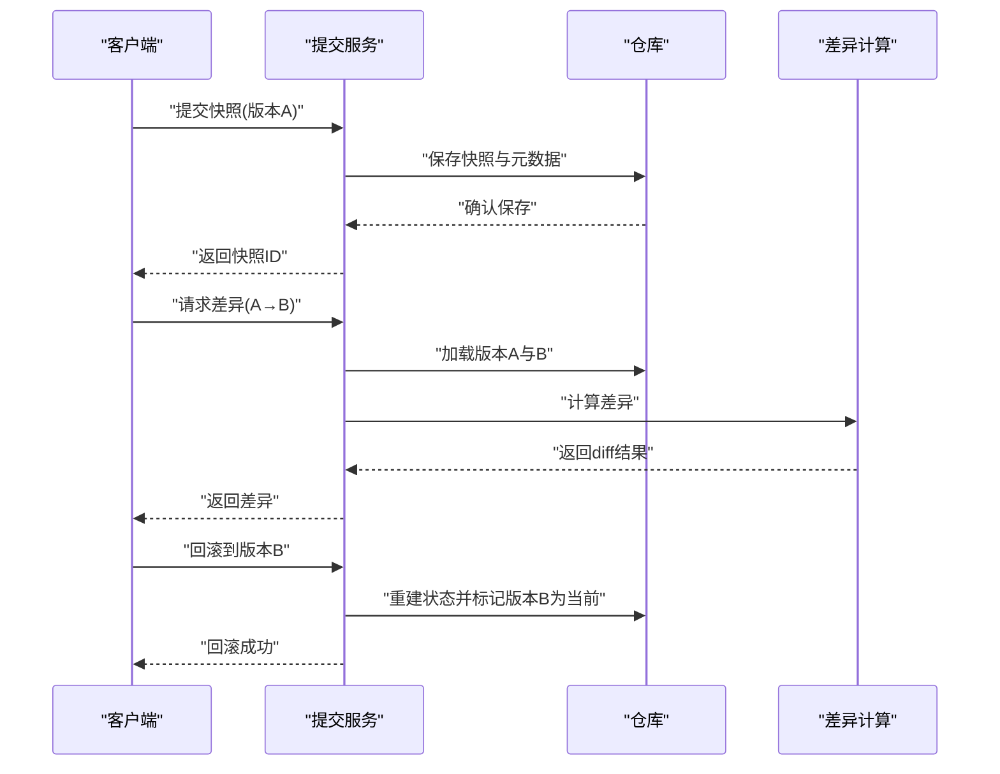

**图表来源** 
- [src/features/artifacts/commit.ts](file://src/features/artifacts/commit.ts)
- [src/features/artifacts/service.ts](file://src/features/artifacts/service.ts)

**章节来源**
- [src/features/artifacts/commit.ts](file://src/features/artifacts/commit.ts)
- [src/features/artifacts/service.ts](file://src/features/artifacts/service.ts)

### 导演运行时与阶段结果（状态推进、恢复）
- 运行时仓库：维护项目运行时的节点状态、阶段结果与会话信息。
- 阶段结果提交：每个阶段完成后提交结果，支持幂等与冲突检测。
- 恢复机制：从持久化状态恢复运行上下文，支持断点续跑。

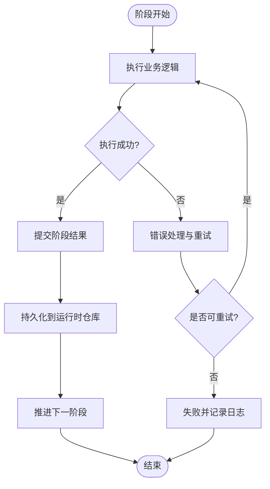

**图表来源** 
- [src/features/director/runtime-repository.ts](file://src/features/director/runtime-repository.ts)
- [src/features/director/stage-result-committer.ts](file://src/features/director/stage-result-committer.ts)

**章节来源**
- [src/features/director/runtime-repository.ts](file://src/features/director/runtime-repository.ts)
- [src/features/director/stage-result-committer.ts](file://src/features/director/stage-result-committer.ts)

### 渲染子系统（产物持久化、导出）
- 渲染仓库：管理渲染任务、帧序列、媒体组装与导出结果。
- 持久化：将渲染产物与元数据保存到数据库或对象存储。
- 缩略图与预览：生成缩略图与预览资源，提升用户体验。

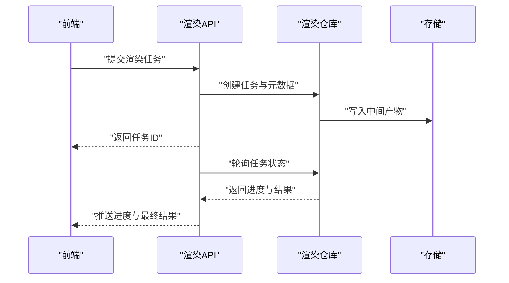

**图表来源** 
- [src/features/render/repository.ts](file://src/features/render/repository.ts)
- [src/features/render/persistence.ts](file://src/features/render/persistence.ts)

**章节来源**
- [src/features/render/repository.ts](file://src/features/render/repository.ts)
- [src/features/render/persistence.ts](file://src/features/render/persistence.ts)

### 认证与会话（成员管理、权限控制、变更日志）
- 账户服务：管理用户账户、角色与权限，支持成员邀请与移除。
- 会话管理：维护登录态与令牌，提供鉴权中间件。
- 变更日志：记录关键操作与权限变更，便于审计与回溯。

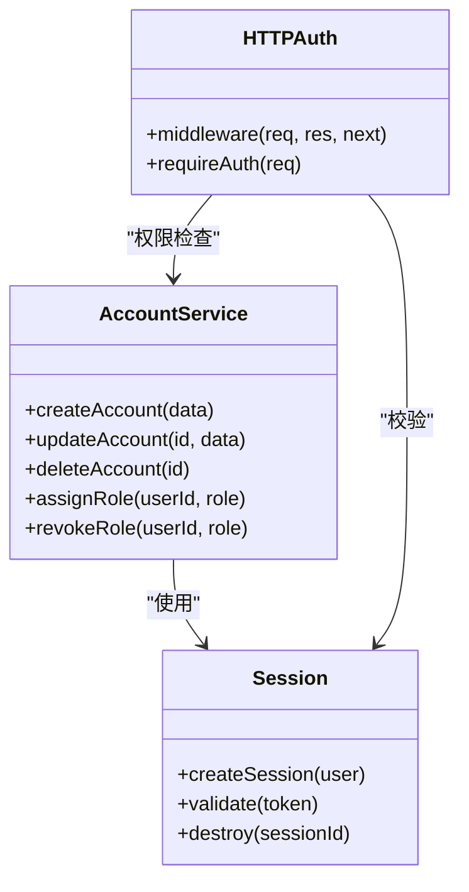

**图表来源** 
- [src/features/auth/account-service.ts](file://src/features/auth/account-service.ts)
- [src/features/auth/session.ts](file://src/features/auth/session.ts)
- [src/features/auth/http.ts](file://src/features/auth/http.ts)

**章节来源**
- [src/features/auth/account-service.ts](file://src/features/auth/account-service.ts)
- [src/features/auth/session.ts](file://src/features/auth/session.ts)
- [src/features/auth/http.ts](file://src/features/auth/http.ts)

### 项目模板与预设（快速启动、批量创建、配置继承）
- 模板引擎：定义项目结构与默认配置，支持变量替换与条件分支。
- 批量创建：基于模板批量生成项目，支持导入外部配置。
- 配置继承：子项目继承父项目配置，局部覆盖以适配特定需求。

**图表来源** 
- [server/src/compose/project.ts](file://server/src/compose/project.ts)
- [server/src/compose/template.ts](file://server/src/compose/template.ts)

**章节来源**
- [server/src/compose/project.ts](file://server/src/compose/project.ts)
- [server/src/compose/template.ts](file://server/src/compose/template.ts)

## 依赖关系分析
- 模块内聚性：各特性模块职责清晰，减少跨域耦合。
- 外部依赖：数据库驱动、对象存储与第三方服务（如AI模型）通过适配器接入。
- 潜在循环依赖：通过接口抽象与服务注册避免循环引用。
- **新增**：项目来源模块与工作流注册表的解耦设计，支持独立扩展。
- **新增**：项目列表界面与后端服务的解耦，支持独立的UI逻辑。
- **重大更新**：双布局系统与搜索功能的解耦设计，支持独立开发和测试。
- **重大更新**：分页投影系统的模块化设计，便于性能监控和优化。

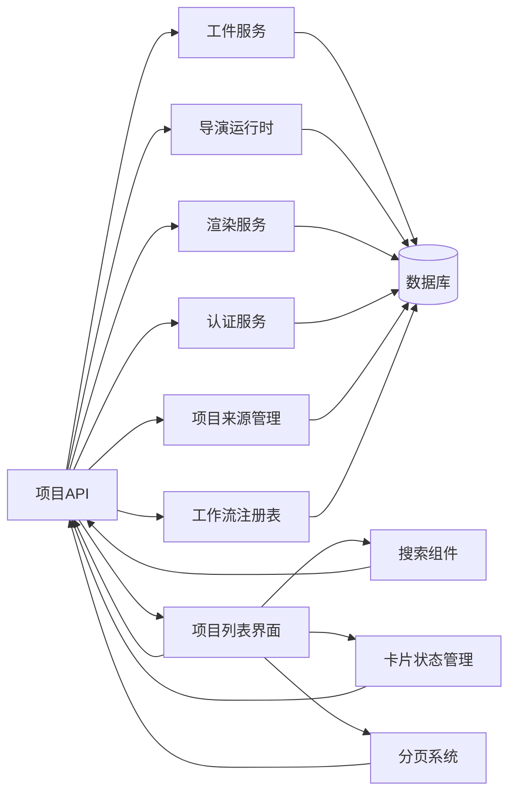

**图表来源** 
- [src/app/api/projects/route.ts](file://src/app/api/projects/route.ts)
- [src/features/artifacts/service.ts](file://src/features/artifacts/service.ts)
- [src/features/director/runtime-repository.ts](file://src/features/director/runtime-repository.ts)
- [src/features/render/repository.ts](file://src/features/render/repository.ts)
- [src/features/auth/account-service.ts](file://src/features/auth/account-service.ts)
- [src/features/projects/project-source.ts](file://src/features/projects/project-source.ts)
- [src/features/projects/project-compatibility.ts](file://src/features/projects/project-compatibility.ts)
- [src/features/projects/project-list.tsx](file://src/features/projects/project-list.tsx)
- [src/features/projects/use-project-cards-state.ts](file://src/features/projects/use-project-cards-state.ts)
- [src/components/ui/search-field.tsx](file://src/components/ui/search-field.tsx)

**章节来源**
- [drizzle.config.ts](file://drizzle.config.ts)

## 性能考量
- 异步任务：渲染与导出任务采用队列与异步处理，避免阻塞主线程。
- 缓存策略：对频繁读取的元数据与配置进行缓存，降低数据库压力。
- 增量更新：工件差异与快照仅存储变更部分，节省存储空间与传输带宽。
- 并发控制：限制并行任务数量，防止资源竞争与过载。
- **新增**：复合外键索引优化，提升关联查询性能。
- **新增**：工作流注册表缓存，减少兼容性检查开销。
- **新增**：项目列表双列布局优化，支持懒加载和虚拟滚动。
- **重大更新**：分页投影系统优化，显著减少内存占用和提升渲染性能。
- **重大更新**：虚拟滚动技术，只渲染可视区域内的项目卡片。
- **重大更新**：智能预加载策略，提升用户滚动体验。
- **重大更新**：搜索功能优化，支持实时过滤和结果缓存。

## 故障排查指南
- 常见问题：
  - 项目创建失败：检查模板有效性、权限与数据库连接。
  - 工件提交错误：验证工件格式、版本冲突与存储可用性。
  - 渲染任务卡住：查看任务队列、依赖解析与中间产物完整性。
  - 认证失败：确认会话状态、令牌有效期与权限配置。
  - **新增**：项目来源配置错误：检查三源输入格式和类型验证。
  - **新增**：工作流兼容性冲突：验证kind和版本匹配规则。
  - **新增**：项目列表显示异常：检查来源类型分类和双列布局配置。
  - **重大更新**：双布局切换问题：检查视图状态管理和本地存储。
  - **重大更新**：搜索功能异常：验证搜索条件和过滤逻辑。
  - **重大更新**：分页性能问题：检查虚拟滚动配置和数据加载策略。
- 调试建议：
  - 启用详细日志，定位错误堆栈与上下文。
  - 使用快照与差异工具对比状态变化。
  - 通过备份与恢复验证数据一致性。
  - **新增**：使用类型检查工具验证项目来源数据结构。
  - **新增**：检查工作流注册表的兼容性过滤规则。
  - **新增**：验证项目列表的分组逻辑和搜索功能。
  - **重大更新**：使用浏览器开发者工具检查虚拟滚动性能。
  - **重大更新**：监控内存使用情况，优化大数据集处理。
  - **重大更新**：测试不同屏幕尺寸的响应式布局。

**章节来源**
- [scripts/migration/export-sqlite.ts](file://scripts/migration/export-sqlite.ts)
- [scripts/migration/import-postgres.ts](file://scripts/migration/import-postgres.ts)
- [scripts/migration/sqlite-backup.ts](file://scripts/migration/sqlite-backup.ts)
- [scripts/setup/db-migrate.ts](file://scripts/setup/db-migrate.ts)

## 结论
PurpleInk的项目管理模块通过清晰的API设计、健壮的工件系统与灵活的模板机制，提供了完整的项目生命周期管理能力。结合版本控制、协作权限与数据迁移工具，能够满足团队协作与生产环境的需求。**新增的持久化三源项目输入能力、服务器端判别联合、复合外键仓库系统和基于kind/版本兼容性过滤的工作流注册表系统**，进一步增强了系统的灵活性、类型安全性和可扩展性。**最新的项目页面完全重新设计**，采用双布局系统、三节水平网格布局、高级搜索功能和分页投影系统，显著提升了用户体验和系统性能。建议在后续迭代中进一步优化性能监控与自动化测试，提升系统的稳定性与可维护性。

## 附录
- 数据迁移与备份恢复：
  - 从SQLite导出到PostgreSQL：使用迁移脚本导出数据并导入目标库。
  - 定期备份：通过备份脚本生成数据库快照，支持灾难恢复。
  - 恢复流程：从备份文件还原数据，验证一致性与完整性。
- **新增**：项目来源配置指南：
  - 三源输入格式规范和使用示例。
  - 类型验证规则和错误处理最佳实践。
- **新增**：工作流注册表配置：
  - kind和版本定义规范。
  - 兼容性过滤规则配置方法。
- **新增**：项目列表界面配置：
  - 双列布局配置选项和自定义分组规则。
  - 搜索功能配置和性能优化建议。
- **重大更新**：双布局系统配置：
  - 网格和列表视图的自定义选项。
  - 响应式布局配置和性能调优。
- **重大更新**：分页投影系统配置：
  - 虚拟滚动参数调优。
  - 预加载策略配置和内存管理。
- **重大更新**：高级搜索功能配置：
  - 搜索字段定义和过滤规则。
  - 实时搜索性能和缓存策略。

**章节来源**
- [scripts/migration/export-sqlite.ts](file://scripts/migration/export-sqlite.ts)
- [scripts/migration/import-postgres.ts](file://scripts/migration/import-postgres.ts)
- [scripts/migration/sqlite-backup.ts](file://scripts/migration/sqlite-backup.ts)
- [scripts/setup/db-migrate.ts](file://scripts/setup/db-migrate.ts)
- [src/features/projects/project-source.ts](file://src/features/projects/project-source.ts)
- [src/features/projects/project-compatibility.ts](file://src/features/projects/project-compatibility.ts)
- [src/features/projects/project-list.tsx](file://src/features/projects/project-list.tsx)
- [src/features/projects/use-project-cards-state.ts](file://src/features/projects/use-project-cards-state.ts)
- [src/components/ui/search-field.tsx](file://src/components/ui/search-field.tsx)