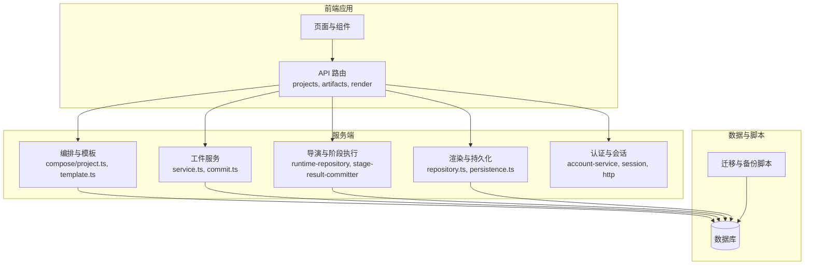
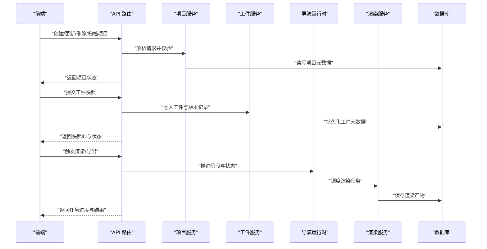
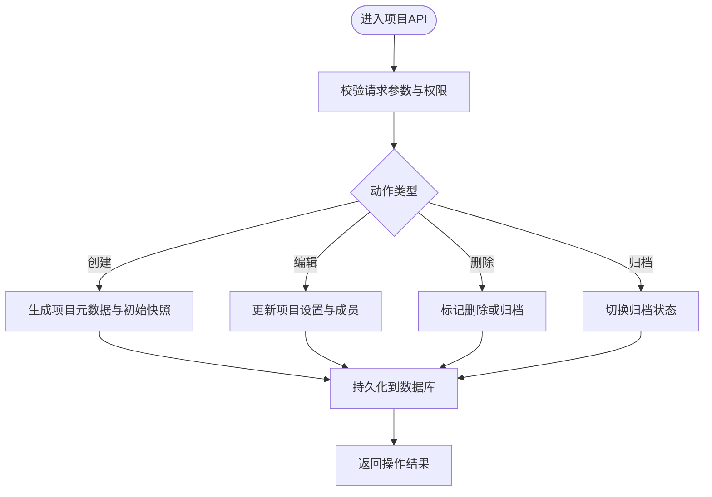
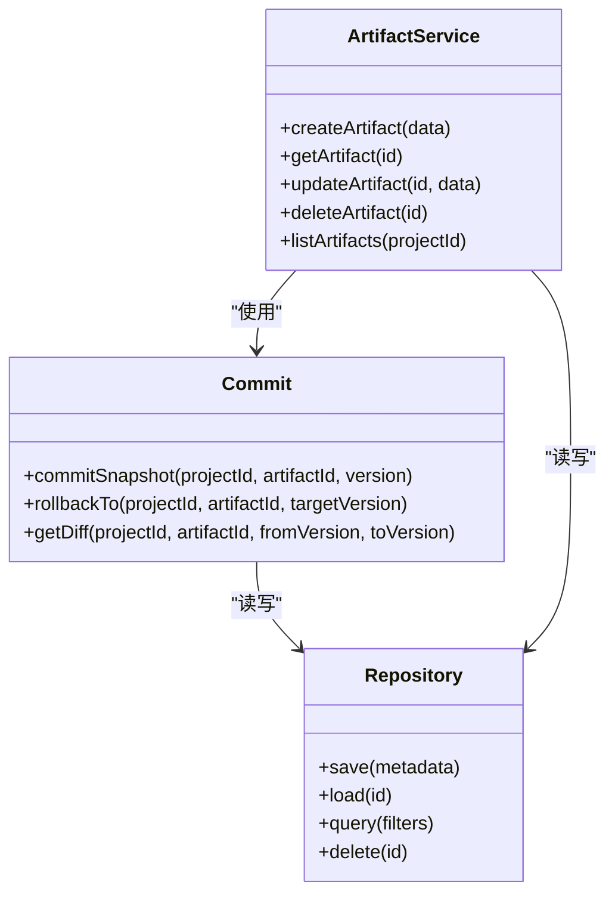
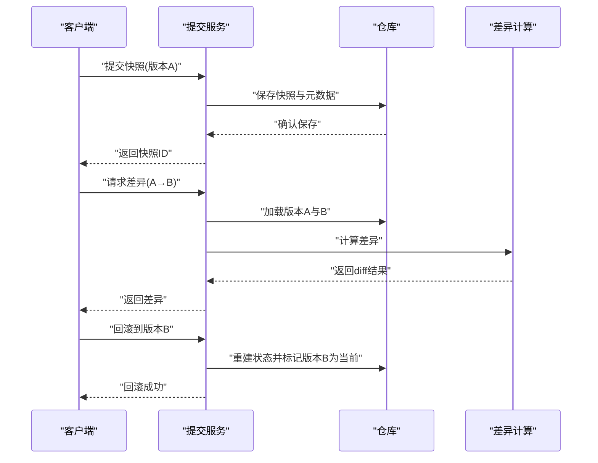
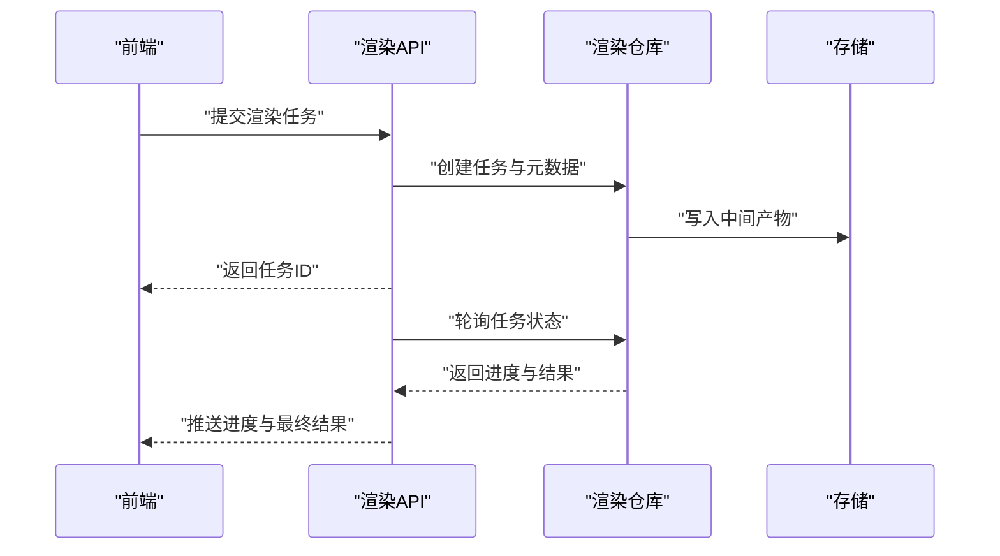
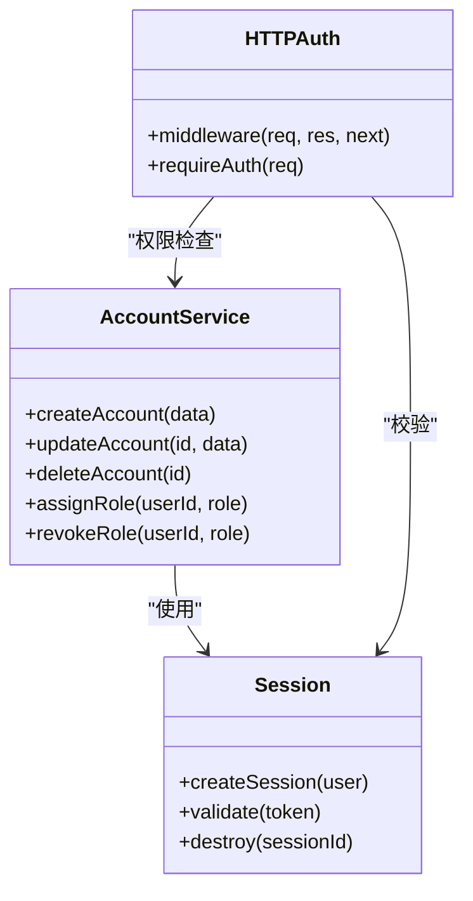
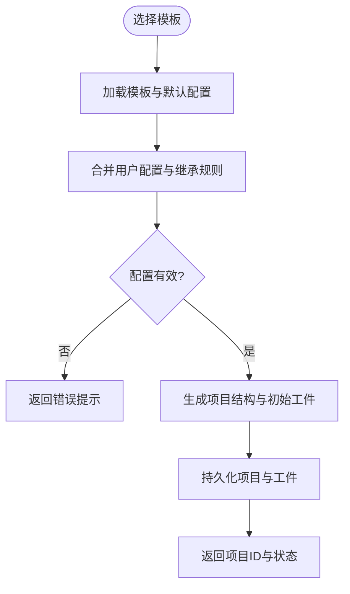
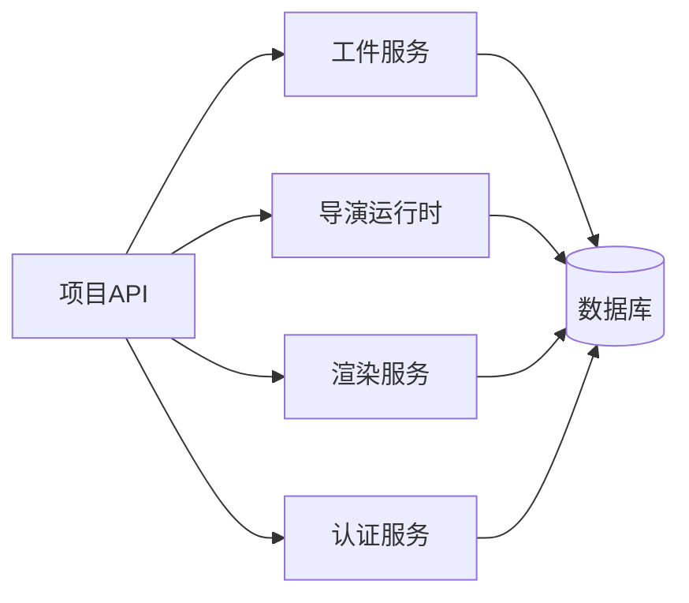

# 项目管理

<cite>
**本文引用的文件**   
- [src/app/api/projects/route.ts](file://src/app/api/projects/route.ts)
- [src/app/api/projects/[id]/route.ts](file://src/app/api/projects/[id]/route.ts)
- [src/features/artifacts/service.ts](file://src/features/artifacts/service.ts)
- [src/features/artifacts/commit.ts](file://src/features/artifacts/commit.ts)
- [src/features/artifacts/index.ts](file://src/features/artifacts/index.ts)
- [src/features/director/runtime-repository.ts](file://src/features/director/runtime-repository.ts)
- [src/features/director/stage-result-committer.ts](file://src/features/director/stage-result-committer.ts)
- [src/features/render/repository.ts](file://src/features/render/repository.ts)
- [src/features/render/persistence.ts](file://src/features/render/persistence.ts)
- [src/features/auth/account-service.ts](file://src/features/auth/account-service.ts)
- [src/features/auth/session.ts](file://src/features/auth/session.ts)
- [src/features/auth/http.ts](file://src/features/auth/http.ts)
- [scripts/migration/export-sqlite.ts](file://scripts/migration/export-sqlite.ts)
- [scripts/migration/import-postgres.ts](file://scripts/migration/import-postgres.ts)
- [scripts/migration/sqlite-backup.ts](file://scripts/migration/sqlite-backup.ts)
- [scripts/setup/db-migrate.ts](file://scripts/setup/db-migrate.ts)
- [drizzle.config.ts](file://drizzle.config.ts)
- [server/src/compose/project.ts](file://server/src/compose/project.ts)
- [server/src/compose/template.ts](file://server/src/compose/template.ts)
</cite>

## 目录
1. [简介](#简介)
2. [项目结构](#项目结构)
3. [核心组件](#核心组件)
4. [架构总览](#架构总览)
5. [详细组件分析](#详细组件分析)
6. [依赖关系分析](#依赖关系分析)
7. [性能考量](#性能考量)
8. [故障排查指南](#故障排查指南)
9. [结论](#结论)
10. [附录](#附录)

## 简介
本文件面向PurpleInk项目的“项目管理”能力，围绕以下目标展开：
- 项目生命周期管理：创建、编辑、删除、归档等操作的API与流程。
- 版本控制系统设计：快照管理、差异对比、回滚机制的实现思路与数据流。
- 工件管理系统：中间产物存储、版本追踪、依赖管理与一致性保障。
- 项目协作功能：成员管理、权限控制、变更日志与审计。
- 项目模板与预设：快速启动、批量创建、配置继承策略。
- 数据迁移与备份恢复：从SQLite到PostgreSQL的迁移、备份与恢复实践。

## 项目结构
本项目采用前后端分离与模块化组织方式：
- 前端应用（Next.js）通过API路由访问后端服务，提供项目列表、详情、渲染导出等页面与交互。
- 服务端（Node/TS）负责编排流水线、运行时状态、工件持久化与渲染任务。
- 特性模块按领域划分（artifacts、director、render、auth等），便于扩展与维护。
- 脚本层提供数据库迁移、初始化、备份与验证工具。

**图表来源** 
- [server/src/compose/project.ts](file://server/src/compose/project.ts)
- [server/src/compose/template.ts](file://server/src/compose/template.ts)
- [src/features/artifacts/service.ts](file://src/features/artifacts/service.ts)
- [src/features/director/runtime-repository.ts](file://src/features/director/runtime-repository.ts)
- [src/features/render/repository.ts](file://src/features/render/repository.ts)
- [src/features/auth/account-service.ts](file://src/features/auth/account-service.ts)

**章节来源**
- [drizzle.config.ts](file://drizzle.config.ts)
- [scripts/setup/db-migrate.ts](file://scripts/setup/db-migrate.ts)

## 核心组件
- 项目管理API：提供项目CRUD与状态操作，支撑生命周期管理。
- 工件服务：管理中间产物、版本快照与提交记录，确保可追溯性。
- 导演运行时：维护阶段结果、会话与状态推进，支持回滚与恢复。
- 渲染子系统：负责媒体组装、帧捕获、缩略图与导出，持久化渲染产物。
- 认证与会话：账户服务、会话管理与HTTP鉴权，支撑协作与权限控制。
- 模板与编排：基于模板快速生成项目，支持配置继承与批量创建。

**章节来源**
- [src/app/api/projects/route.ts](file://src/app/api/projects/route.ts)
- [src/app/api/projects/[id]/route.ts](file://src/app/api/projects/[id]/route.ts)
- [src/features/artifacts/service.ts](file://src/features/artifacts/service.ts)
- [src/features/artifacts/commit.ts](file://src/features/artifacts/commit.ts)
- [src/features/director/runtime-repository.ts](file://src/features/director/runtime-repository.ts)
- [src/features/render/repository.ts](file://src/features/render/repository.ts)
- [src/features/auth/account-service.ts](file://src/features/auth/account-service.ts)

## 架构总览
下图展示项目管理在系统中的关键交互路径：前端调用API路由，路由分发至对应服务；服务与数据库交互，完成项目与工件的持久化与查询；渲染与导演模块协同处理流水线任务。

**图表来源** 
- [src/app/api/projects/route.ts](file://src/app/api/projects/route.ts)
- [src/app/api/projects/[id]/route.ts](file://src/app/api/projects/[id]/route.ts)
- [src/features/artifacts/service.ts](file://src/features/artifacts/service.ts)
- [src/features/director/runtime-repository.ts](file://src/features/director/runtime-repository.ts)
- [src/features/render/repository.ts](file://src/features/render/repository.ts)

## 详细组件分析

### 项目管理API与生命周期
- 项目创建：接收模板或基础配置，生成项目元数据与初始工件快照。
- 项目编辑：更新项目设置、成员与权限，记录变更日志。
- 项目删除：软删除或归档，清理关联工件与缓存。
- 项目归档：将项目标记为归档状态，限制写入但保留读取。

**图表来源** 
- [src/app/api/projects/route.ts](file://src/app/api/projects/route.ts)
- [src/app/api/projects/[id]/route.ts](file://src/app/api/projects/[id]/route.ts)

**章节来源**
- [src/app/api/projects/route.ts](file://src/app/api/projects/route.ts)
- [src/app/api/projects/[id]/route.ts](file://src/app/api/projects/[id]/route.ts)

### 工件管理系统（中间产物、版本追踪、依赖管理）
- 工件服务：提供工件的创建、读取、更新与删除接口，维护版本链与依赖关系。
- 提交机制：每次提交生成快照，记录变更内容与时间戳，支持回滚到指定版本。
- 依赖管理：工件间建立依赖图谱，确保构建顺序与一致性。

**图表来源** 
- [src/features/artifacts/service.ts](file://src/features/artifacts/service.ts)
- [src/features/artifacts/commit.ts](file://src/features/artifacts/commit.ts)
- [src/features/artifacts/index.ts](file://src/features/artifacts/index.ts)

**章节来源**
- [src/features/artifacts/service.ts](file://src/features/artifacts/service.ts)
- [src/features/artifacts/commit.ts](file://src/features/artifacts/commit.ts)
- [src/features/artifacts/index.ts](file://src/features/artifacts/index.ts)

### 版本控制系统（快照、差异对比、回滚）
- 快照管理：每次提交生成不可变快照，包含工件元数据与内容哈希。
- 差异对比：比较两个版本的工件差异，输出结构化diff供UI展示。
- 回滚机制：根据目标版本重建工件状态，确保一致性。

**图表来源** 
- [src/features/artifacts/commit.ts](file://src/features/artifacts/commit.ts)
- [src/features/artifacts/service.ts](file://src/features/artifacts/service.ts)

**章节来源**
- [src/features/artifacts/commit.ts](file://src/features/artifacts/commit.ts)
- [src/features/artifacts/service.ts](file://src/features/artifacts/service.ts)

### 导演运行时与阶段结果（状态推进、恢复）
- 运行时仓库：维护项目运行时的节点状态、阶段结果与会话信息。
- 阶段结果提交：每个阶段完成后提交结果，支持幂等与冲突检测。
- 恢复机制：从持久化状态恢复运行上下文，支持断点续跑。

**图表来源** 
- [src/features/director/runtime-repository.ts](file://src/features/director/runtime-repository.ts)
- [src/features/director/stage-result-committer.ts](file://src/features/director/stage-result-committer.ts)

**章节来源**
- [src/features/director/runtime-repository.ts](file://src/features/director/runtime-repository.ts)
- [src/features/director/stage-result-committer.ts](file://src/features/director/stage-result-committer.ts)

### 渲染子系统（产物持久化、导出）
- 渲染仓库：管理渲染任务、帧序列、媒体组装与导出结果。
- 持久化：将渲染产物与元数据保存到数据库或对象存储。
- 缩略图与预览：生成缩略图与预览资源，提升用户体验。

**图表来源** 
- [src/features/render/repository.ts](file://src/features/render/repository.ts)
- [src/features/render/persistence.ts](file://src/features/render/persistence.ts)

**章节来源**
- [src/features/render/repository.ts](file://src/features/render/repository.ts)
- [src/features/render/persistence.ts](file://src/features/render/persistence.ts)

### 认证与会话（成员管理、权限控制、变更日志）
- 账户服务：管理用户账户、角色与权限，支持成员邀请与移除。
- 会话管理：维护登录态与令牌，提供鉴权中间件。
- 变更日志：记录关键操作与权限变更，便于审计与回溯。

**图表来源** 
- [src/features/auth/account-service.ts](file://src/features/auth/account-service.ts)
- [src/features/auth/session.ts](file://src/features/auth/session.ts)
- [src/features/auth/http.ts](file://src/features/auth/http.ts)

**章节来源**
- [src/features/auth/account-service.ts](file://src/features/auth/account-service.ts)
- [src/features/auth/session.ts](file://src/features/auth/session.ts)
- [src/features/auth/http.ts](file://src/features/auth/http.ts)

### 项目模板与预设（快速启动、批量创建、配置继承）
- 模板引擎：定义项目结构与默认配置，支持变量替换与条件分支。
- 批量创建：基于模板批量生成项目，支持导入外部配置。
- 配置继承：子项目继承父项目配置，局部覆盖以适配特定需求。

**图表来源** 
- [server/src/compose/project.ts](file://server/src/compose/project.ts)
- [server/src/compose/template.ts](file://server/src/compose/template.ts)

**章节来源**
- [server/src/compose/project.ts](file://server/src/compose/project.ts)
- [server/src/compose/template.ts](file://server/src/compose/template.ts)

## 依赖关系分析
- 模块内聚性：各特性模块职责清晰，减少跨域耦合。
- 外部依赖：数据库驱动、对象存储与第三方服务（如AI模型）通过适配器接入。
- 潜在循环依赖：通过接口抽象与服务注册避免循环引用。

**图表来源** 
- [src/app/api/projects/route.ts](file://src/app/api/projects/route.ts)
- [src/features/artifacts/service.ts](file://src/features/artifacts/service.ts)
- [src/features/director/runtime-repository.ts](file://src/features/director/runtime-repository.ts)
- [src/features/render/repository.ts](file://src/features/render/repository.ts)
- [src/features/auth/account-service.ts](file://src/features/auth/account-service.ts)

**章节来源**
- [drizzle.config.ts](file://drizzle.config.ts)

## 性能考量
- 异步任务：渲染与导出任务采用队列与异步处理，避免阻塞主线程。
- 缓存策略：对频繁读取的元数据与配置进行缓存，降低数据库压力。
- 增量更新：工件差异与快照仅存储变更部分，节省存储空间与传输带宽。
- 并发控制：限制并行任务数量，防止资源竞争与过载。

## 故障排查指南
- 常见问题：
  - 项目创建失败：检查模板有效性、权限与数据库连接。
  - 工件提交错误：验证工件格式、版本冲突与存储可用性。
  - 渲染任务卡住：查看任务队列、依赖解析与中间产物完整性。
  - 认证失败：确认会话状态、令牌有效期与权限配置。
- 调试建议：
  - 启用详细日志，定位错误堆栈与上下文。
  - 使用快照与差异工具对比状态变化。
  - 通过备份与恢复验证数据一致性。

**章节来源**
- [scripts/migration/export-sqlite.ts](file://scripts/migration/export-sqlite.ts)
- [scripts/migration/import-postgres.ts](file://scripts/migration/import-postgres.ts)
- [scripts/migration/sqlite-backup.ts](file://scripts/migration/sqlite-backup.ts)
- [scripts/setup/db-migrate.ts](file://scripts/setup/db-migrate.ts)

## 结论
PurpleInk的项目管理模块通过清晰的API设计、健壮的工件系统与灵活的模板机制，提供了完整的项目生命周期管理能力。结合版本控制、协作权限与数据迁移工具，能够满足团队协作与生产环境的需求。建议在后续迭代中进一步优化性能监控与自动化测试，提升系统的稳定性与可维护性。

## 附录
- 数据迁移与备份恢复：
  - 从SQLite导出到PostgreSQL：使用迁移脚本导出数据并导入目标库。
  - 定期备份：通过备份脚本生成数据库快照，支持灾难恢复。
  - 恢复流程：从备份文件还原数据，验证一致性与完整性。

**章节来源**
- [scripts/migration/export-sqlite.ts](file://scripts/migration/export-sqlite.ts)
- [scripts/migration/import-postgres.ts](file://scripts/migration/import-postgres.ts)
- [scripts/migration/sqlite-backup.ts](file://scripts/migration/sqlite-backup.ts)
- [scripts/setup/db-migrate.ts](file://scripts/setup/db-migrate.ts)