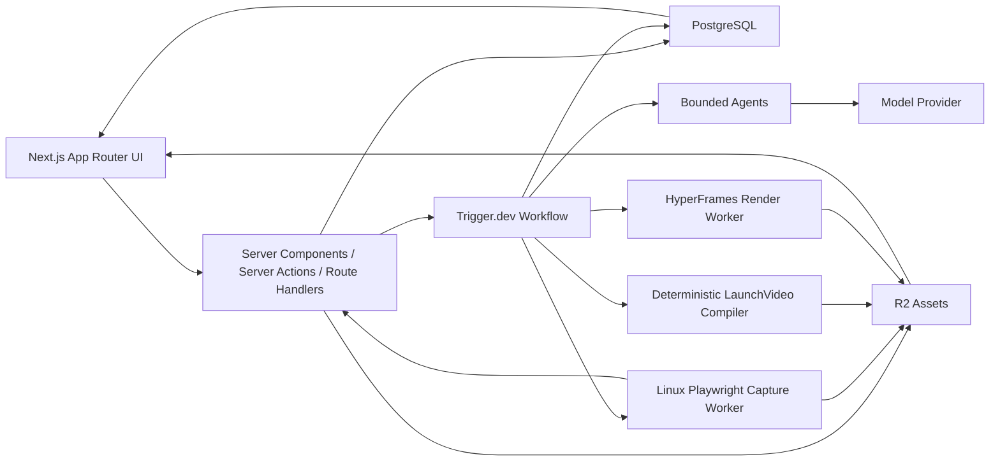

# Verified Product Video SaaS 技术设计

> 状态：Proposed v0.4  
> 日期：2026-07-24  
> 对应 PRD：[Verified Product Video PRD](./2026-07-20-verified-product-video-prd.md)  
> 实现基线：当前 Git repository root  
> 产品框架：Next.js 16.2.11（App Router）  
> 视频引擎：HyperFrames

> **ProductFlow 更新：** 产品行为以 [ProductFlow 与发布视频系统 Spec](./docs/specs/2026-07-23-product-flow-launch-video-system.md) 为准；数据库、Flow DSL、Playwright Capture Worker、状态机和 LaunchVideoRunner 以 [Engineering Contracts](./docs/specs/2026-07-23-engineering-contracts.md) 为唯一工程事实源。

## 1. 结论

第一版采用一个 TypeScript 优先、控制面与重计算分离的架构：

| 层            | 选型                                                                  |
| ------------- | --------------------------------------------------------------------- |
| SaaS Web      | Next.js 16.2.11 App Router、React 19.2.4、TypeScript 5、Tailwind CSS 4 |
| 数据库        | PostgreSQL + Drizzle ORM                                              |
| 身份          | Better Auth；企业 SSO 后置                                            |
| 计费          | Stripe                                                                |
| 对象存储      | Cloudflare R2                                                         |
| 持久任务      | Trigger.dev                                                           |
| Agent Runtime | OpenAI Agents SDK，封装在内部 `AgentProvider` 后面                    |
| Schema        | Zod，关键产物版本化                                                   |
| 产品采集      | Linux Playwright Capture Worker；每 attempt 独立容器与 BrowserContext  |
| 视频渲染      | HyperFrames 独立容器，固定 Chrome、FFmpeg 和字体                      |
| 观测          | OpenTelemetry + Sentry + 结构化审计表                                 |

其中 Next.js、React、TypeScript 和 Tailwind CSS 已存在于根 `package.json`；数据库、身份、计费、对象存储、工作流、Agent 和可观测性依赖仍是待实现选型，不能把本表理解为已经集成。

核心技术原则是：

> **工作流拥有状态，Agent 只产生结构化建议，执行器只消费批准且不可变的合同。**

不使用“一个 Agent 从 URL 一路跑到 MP4”的长循环。该设计无法可靠恢复、审批、重放或归因，也会把 prompt injection、浏览器副作用和视频事实混在一起。

## 2. 设计假设

本设计服务 MVP 至早期规模，默认：

- 团队规模较小，以快速验证产品为优先。
- 首批只支持 Web SaaS。
- 每月数百至数千条预览或成片，而非立即追求海量渲染。
- DiscoveryRun 与 CaptureRun 全部使用 Linux Playwright Capture Worker，不配置其他浏览器执行器或回退。
- 产品使用官方受控模板，不执行用户上传的任意 JavaScript。
- 人工审批是正式状态，不是临时运营补丁。

## 3. 总体架构



系统分为五个清晰边界：

1. **产品控制面**：项目、品牌、brief、分镜、审批、计费和成员权限。
2. **持久工作流面**：任务状态、重试、等待审批、并发和取消。
3. **Agent 推理面**：产品上下文、证据计划和 Storyboard 草稿。
4. **执行面**：隔离 Playwright 浏览器采集、确定性视频编译与 HyperFrames 渲染。
5. **资产面**：输入、检查点、composition bundle、预览和成片。

## 4. Next.js SaaS 控制面

### 4.1 应用边界

Next.js 16.2.11 App Router 同时承担 SSR Web 与轻量 BFF：

- 页面、布局与路由；默认使用 Server Components。
- Session 和 workspace 权限检查。
- 产品内 mutation 使用 Server Actions，并在 action 内重新执行鉴权和输入校验。
- 上传签名、Stripe webhook、内部 callback 和 SSE/轮询使用 Route Handlers。
- 读取任务状态并向前端提供 SSE 或轮询接口。

它不承担：

- LLM 长循环。
- Playwright 浏览器操作、凭据解密或长任务执行。
- HyperFrames、Chrome 或 FFmpeg 渲染。
- 大文件代理上传和下载。

客户端状态坚持简单：读取优先通过 Server Components，mutation 优先使用 Server Actions，交互表单使用 React 表单状态。当前仓库未安装 TanStack Query、Form 或 Table，因此它们不是架构基线；只有在出现高频客户端刷新、复杂离线缓存或大型数据表格等明确需求时，才通过 ADR 引入。不要把 session、workspace 权限或审批事实只保存在客户端状态中。

Web 应用使用 Node.js runtime，不以 Edge runtime 作为默认能力。仓库固定 Node.js `24.6.0` 和 npm `11.5.1`，本地、CI 和生产必须与 `package.json`、`.nvmrc` 和 lockfile 一致。当前 Git repository root 是唯一实现和依赖事实源；父目录不属于项目仓库。

### 4.2 数据与租户

选择 PostgreSQL，不选 D1 作为第一版正式业务库，原因是审批、版本、计费、幂等任务和多租户查询会快速需要成熟事务、约束和调试工具。

每张业务表必须包含 `workspace_id`。权限判断不能只依赖页面、布局或 Proxy；Server Action、Route Handler、后台任务和 worker callback 都必须重新验证租户边界。

核心实体：

```text
workspace / user / membership
product / brand_kit / brand_kit_version
product_capability / release / release_brief_version
source_asset / asset_version
product_flow / product_flow_version
browser_profile / capture_session / capture_worker_job / discovery_run / capture_run
node_execution / node_evidence / evidence_package / evidence_package_version
claim_set
storyboard / storyboard_version
approval
composition_bundle
render_job / render_attempt / artifact
model_run / audit_event
subscription / usage_event
```

大对象不进入 PostgreSQL。数据库只保存 R2 key、hash、媒体元数据、来源和版本关系。

### 4.3 API 风格

MVP 不引入 GraphQL 或 tRPC。Next.js Server Actions 处理产品内 mutation，Server Components 直接调用受鉴权保护的服务层读取数据，少量稳定的 Route Handlers 处理外部边界：

```text
POST /api/uploads/sign
POST /api/webhooks/stripe
POST /api/internal/capture-callback
POST /api/internal/render-callback
GET  /api/jobs/[id]/events
```

所有输入使用 Zod 在服务端边界校验。所有外部 callback 必须签名、幂等，并绑定 `job_id + attempt`；旧 attempt 不能发布结果。Stripe webhook 必须使用原始请求体进行签名校验。上传采用浏览器直传 R2 的短期签名 URL，不经 Next.js 进程中转大文件。

任务进度接口必须同时支持 SSE 和带游标的退避轮询。只有在最终 Next.js 托管平台确认长连接时限、并发和计费模型后，SSE 才能成为默认传输方式。

## 5. Agent 管线选型

### 5.1 最终选择

采用两层组合：

1. **Trigger.dev**：跨分钟、跨审批、可重试的业务工作流。
2. **OpenAI Agents SDK**：单个步骤内部的有界模型与工具循环。

Agents SDK 不持有跨步骤业务状态；Trigger.dev 不理解产品语义。两者职责不能互换。

Agents SDK 通过内部接口隔离：

```ts
interface AgentProvider<I, O> {
  run(input: I, context: AgentRunContext): Promise<O>;
}
```

领域代码只依赖版本化输入输出 Schema，不依赖 Agent、handoff 或 provider session 类型。更换模型或 Agent SDK 时，不改 Storyboard、CaptureRun 和 RenderJob 合同。

### 5.2 为什么不把 LangGraph 或 Mastra作为主工作流

| 方案                     | 判断              | 原因                                                                                 |
| ------------------------ | ----------------- | ------------------------------------------------------------------------------------ |
| Trigger.dev + Agents SDK | 采用              | TypeScript 友好；持久任务与 Agent loop 分层；容易等待人工审批和隔离重计算            |
| LangGraph.js             | 暂不采用          | 图状态、checkpoint 和 Trigger 工作流重叠；MVP 不需要动态 Agent 拓扑                  |
| Mastra                   | 暂不采用          | Agent、workflow、memory、eval 覆盖面广，但会与现有持久任务和领域状态形成第二套控制面 |
| Vercel AI SDK            | 可用于未来交互 UI | 适合流式生成和 provider 适配，但不解决跨小时任务、审批和媒体执行可靠性               |
| Temporal                 | 后置              | 持久性最强，但对早期团队的部署、运维和建模成本过高                                   |
| Cloudflare Workflows     | 规模化备选        | 与 R2/Containers 很合适，但第一版会同时引入多个较新的 Cloudflare 执行原语            |

如果团队已经稳定运营 Cloudflare Workflows 与 Containers，可以用它替换 Trigger.dev；领域事件、Schema 和 worker 接口保持不变。

### 5.3 为什么不用多 Agent 群

本产品的困难是事实约束和状态可靠性，不是角色数量。MVP 使用多个单职责 Agent，但不让它们互相自由 handoff：

| Agent             | 输入                          | 输出                   | 是否可产生副作用 |
| ----------------- | ----------------------------- | ---------------------- | ---------------- |
| Context Curator   | 官网快照、brief、品牌候选     | `ProductContextV1`     | 否               |
| Evidence Planner  | ProductContext、用户声明      | `ClaimSetV1`、证据要求 | 否               |
| Flow Author       | 已批准目标、Product 能力、发现记录 | `ProductFlowVersionV1` 草稿 | 只能创建草稿     |
| Flow Repair       | 失败 trace、NodeEvidence、现有 Flow | 新的 `ProductFlowVersionV1` 草稿 | 不能覆盖已批准版本 |
| Story Director    | 已批准 claims、素材、模板能力 | `StoryboardDraftV1`    | 否               |
| Visual QA Advisor | 抽样帧、Storyboard            | `VisualReviewV1`       | 否，只给建议     |

审批、运行浏览器、写正式 Storyboard、发布产物都由工作流和领域服务完成。

### 5.4 模型策略

不在业务代码中散落具体模型名。配置三个 model profile：

```text
fast_structured  -> 网页抽取、分类、短文案
reasoning        -> claims、证据计划、Storyboard
vision_review    -> 预览帧可读性与画面一致性建议
```

每次 `model_run` 必须记录：

- provider 和实际 model id。
- prompt version、tool version、schema version。
- 输入 hash 与输出 hash。
- token、延迟、成本、重试和失败原因。
- 所属 workspace、release、workflow step。

模型输出必须经过 Zod 校验。Schema 错误最多自动修复一次，仍失败则进入可解释错误，不无限重试。

## 6. 持久业务流程

### 6.1 Release 状态机

Release 使用独立的 `lifecycle` 与 `stage`，规范枚举、transition table、guard、失败恢复和下游失效矩阵见 Engineering Contracts 第 5 节。状态转换只能通过带 `expected_revision` 与 `idempotency_key` 的领域 command 执行。

### 6.2 工作流步骤

```text
1. Approve ReleaseBrief and ProductCapabilities
2. Create fenced Linux Playwright DiscoveryRun
3. Review and approve ProductFlowVersion
4. Execute clean CaptureRun in a new isolated Playwright attempt
5. Review EvidenceRefs and freeze approved EvidencePackageVersion
6. Run Story Director and approve StoryboardVersion
7. Run product-launch-video for one locale to produce LaunchVideoPlanV1
8. Deterministically compile one immutable locale-specific CompositionBundleV1
9. Render its 16:9 preview and run quality gates
10. Wait for preview approval
11. Fan out 16:9/9:16 final renders from the same Bundle; create a new Plan/Bundle for another locale
12. Publish immutable Artifacts and usage events
```

“等待审批”是持久 waitpoint，不允许用轮询进程或保持 HTTP 请求实现。

### 6.3 Agent 工具策略

Agent 只获得完成当前步骤所需的最小工具：

- 读取已清洗的网站快照。
- 读取 release brief 与用户确认信息。
- 查询批准的素材和检查点。
- 查询模板的场景能力与字数限制。
- 创建 Flow 草稿或 patch 草稿。

Agent 不能：

- 直接写数据库正式记录。
- 直接触发最终渲染或发布。
- 读取跨 workspace 数据。
- 获取明文 Demo 凭据。
- 自己批准 claims、capture 或 Storyboard。
- 在渲染阶段调用模型或访问互联网。

每个 Agent run 配置最大轮数、最大工具调用、超时和成本预算。

## 7. 确定性合同

LLM 产物与渲染输入之间必须经过显式合同：

```text
Untrusted Web/Input
  -> ProductContextV1
  -> ClaimSetV1
  -> Approved ProductFlowVersionV1
  -> Approved EvidencePackageVersionV1
  -> StoryboardV1
  -> LaunchVideoPlanV1
  -> CompositionBundleV1
  -> RenderArtifactV1 + QualityReportV1
```

关键规则：

- 每个 Claim 带来源和审批状态。
- 每个事实型 Scene 引用一个 ProductCapability 与 Release 固定 EvidencePackageVersion 中的 approved EvidenceRef；浏览器行为事实只能引用 NodeEvidence，静态素材可以引用 SourceAsset。
- `StoryboardV1` 一旦批准不可原地覆盖，只能创建新版本。
- `LaunchVideoPlanV1` 不包含 prompt、session 或外部 URL；locale、字幕与配音资产进入 Plan hash。
- `render_key` 由 manifest、模板、renderer 和资产 hash 计算。
- 相同 `render_key` 的成功结果直接复用。

## 8. Playwright Capture Worker

MVP 的 DiscoveryRun 与 CaptureRun 只运行在 Linux `PlaywrightCaptureWorker`，其内部浏览器实现为 `PlaywrightBrowserAdapter`。每个 attempt 启动独立的短生命周期容器和 BrowserContext，固定 BrowserProfile revision 与镜像 digest，并以 `job_id + attempt` fencing、lease、heartbeat 和有序事件支持幂等恢复。

Worker workload identity、Session lifecycle、heartbeat、事件幂等、R2 上传、remote handoff 与断线恢复必须实现 Engineering Contracts 第 4 节。正式 CaptureRun 只执行 approved ProductFlowVersion；Locator、BrowserAction、Assertion 与非幂等恢复遵循第 3 节。

DiscoveryRun 必须记录当前 Release、approved ReleaseBriefVersion 与 ProductFlow，可以使用 Playwright 临时 locator、DOM ref 或坐标探索，但保存前必须转换为持久化 LocatorV1，并在生产镜像的新 BrowserContext 中通过一次 clean replay。登录态仅以 KMS envelope-encrypted reference 保存；密码、Cookie、Token、localStorage 和 storage state 明文不得进入数据库、工作流 payload、日志、事件、Evidence、trace 或 Composition。

## 9. HyperFrames 渲染服务

### 9.1 渲染模型

业务层不让 LLM 直接生成完整 HTML。采用：

```text
StoryboardV1 + BrandKitV1 + TemplateVersion + AssetPackageV1
  -> product-launch-video skill -> LaunchVideoPlanV1
  -> deterministic compiler
  -> HyperFrames Composition Bundle
  -> render worker
  -> MP4 + QualityReport
```

模板由团队维护并进入版本控制。LLM 只能选择模板、场景类型和公开参数。

### 9.2 容器要求

Render image 固定：

- Node.js。
- 精确版本 HyperFrames。
- 精确版本 Chromium。
- 精确版本 FFmpeg/FFprobe。
- 已批准字体包。
- 项目模板 bundle。

渲染容器默认无外网。所有图片、视频、字体和音频在运行前从 R2 拉入 attempt 目录；输出先写 attempt 路径，通过质量检查后才能发布到 artifact key。

不 clone HyperFrames 源码作为第一版依赖。先使用精确 npm 版本；只有出现引擎级阻塞并能通过上游贡献解决不了时，才维护 fork。

### 9.3 质量检查

正式发布前至少检查：

- MP4 可解码。
- codec、分辨率、fps 和时长匹配 manifest。
- 首、中、尾与场景边界抽样帧非空白。
- 文本未越界。
- 字体和资产均成功加载。
- 音频响度和峰值在允许范围。
- 关键场景存在对应证据引用。

视觉模型只提供辅助建议，不能替代确定性检查或事实审批。

## 10. 安全边界

### 10.1 多租户

- 所有查询强制 workspace scope。
- R2 key 包含不可猜测的 workspace namespace。
- 下载使用短期签名 URL。
- callback 使用任务级签名和 attempt fencing。
- 增加跨租户访问的自动化负面测试。

### 10.2 Demo 凭据

- BrowserProfile 按 workspace 与 Product 隔离，只保存 KMS envelope-encrypted reference，禁止跨 Product 复用。
- Worker 使用短期 workload identity，在内存或 tmpfs 解密登录态与 local_secret；attempt 结束立即销毁明文。
- 需要人工登录、验证码或敏感确认时，通过一次性短期 URL handoff 到同一个 cloud BrowserContext；用户明确 Resume 后 Agent 才能继续。
- Evidence Manifest 上传前执行 PII/secret redaction；只有 `passed` 资产可以进入 evidence review。`blocked`/`needs_review` 留在 quarantine，人工处理后生成新的 AssetVersion 并重新扫描。

### 10.3 不可信网页与 prompt injection

- 网页内容按不可信数据处理，不能覆盖系统规则。
- 抽取阶段保存原始来源和清洗快照。
- Worker 网络限制为批准 origin，并在 DNS 解析后阻止 `file://`、浏览器内部页、loopback、link-local、私网、ULA、metadata 地址和 DNS rebinding。
- Agent 工具 allowlist 固定，不根据网页文本动态增加权限。

### 10.4 任意代码执行

- 用户不能上传 HyperFrames HTML、脚本或 npm package。
- Composition 只由受控模板编译器生成。
- Capture Worker 与 Render Worker 使用不同容器、service account、网络策略和 R2 写前缀；两者都使用资源、时长和网络限制。

## 11. 可观测性与审计

所有请求共享关联键：

```text
workspace_id
release_id
workflow_run_id
step_id
job_id
attempt
model_run_id
render_key
```

必须观测：

- 每阶段耗时、成功率和重试率。
- Agent token、成本、schema failure 和 tool failure。
- Capture Flow 成功率与失败步骤。
- 预览/最终渲染时长、排队时间和成本。
- 人工审批等待时间与修改类型。
- 每条获批视频的人力介入分钟数。

Prompt、Schema、模板、模型、Flow 和 renderer 都必须有独立版本，才能解释历史产物。

## 12. 测试策略

| 层         | 必须测试的内容                                               |
| ---------- | ------------------------------------------------------------ |
| Domain     | 状态转换、版本不可变、审批权限、render key、attempt fencing  |
| Agent      | 固定输入 golden set、schema 合法性、事实引用、越权工具调用   |
| Capture    | 黄金 Flow 回放、容器隔离、BrowserProfile revision、断线恢复、事件幂等、SSRF 限制、敏感信息遮罩 |
| Compiler   | Storyboard 到 Composition snapshot、模板参数边界、多画幅重排 |
| Renderer   | 固定镜像下的 smoke render、媒体探测、抽帧、非空白检查        |
| End-to-end | Brief 到预览、审批恢复、失败重试、EvidencePackage/locale provenance、最终 artifact 发布 |
| Security   | 跨租户读取、SSRF、伪造 callback、过期签名、恶意网页指令      |

Agent eval 必须进入 CI，但不要求逐次文本完全一致。验收对象是结构、事实引用、禁止行为和质量评分。

## 13. MVP 交付切片

### Slice 1：SaaS 与版本化领域模型

Next.js 16.2.11 App Router、身份、workspace、Product、BrandKit、Release、版本表、R2 与领域 command。

### Slice 2：ProductFlow 与 Capture contracts

ProductFlow DSL、节点图编辑器、CaptureSession/Worker job 合同、Evidence Manifest、EvidencePackageVersion 与审批状态。

### Slice 3：Playwright Capture happy path

Linux Playwright DiscoveryRun、clean replay、CaptureRun、真实 NodeEvidence、remote handoff 和从安全 checkpoint 启动的新 attempt。

### Slice 4：Storyboard 与 HyperFrames 预览

Story Director、按 locale 的 LaunchVideoPlanV1/CompositionBundle、确定性 compiler、一套 Feature Launch 模板、质量报告和 16:9 preview。

### Slice 5：终稿与运营闭环

9:16 重排、新 locale Bundle、final render、Artifact 发布、使用量、失败运营台和人工介入统计。

第一条纵向切片应是：

> **用户提交 Product URL 和 brief，通过 Linux Playwright Worker 批准 ProductFlow 与证据，得到一条可审阅 HyperFrames 视频。**

采用一个 Golden Product、单标签页、线性 3-8 节点和 16:9 preview 的窄链路；Golden E2E 必须使用生产 Playwright 镜像和真实采集产物，不允许用 mock 或上传素材替代成功。

## 14. 关键决策与后续门槛

### 当前锁定

- 当前 Git repository root 是唯一 Web 与 workspace 实现基线，固定使用 Next.js 16.2.11 App Router 和 React 19.2.4。
- Next.js 是产品控制面和轻量 BFF，不承载重计算。
- Web 控制面默认使用 Node.js runtime，不把 Edge compatibility 作为架构前提。
- PostgreSQL 是业务事实源，R2 是资产事实源。
- Trigger.dev 是第一版持久工作流。
- Agents SDK 只处理单步骤有界推理。
- 不采用自由多 Agent handoff。
- 用户不提供可执行模板代码。
- HyperFrames 通过固定镜像和 `RenderProvider` 隔离。
- 所有浏览器自动化只使用 Linux Playwright Capture Worker，没有 Ego、Local Bridge 或其他执行器回退。
- Playwright Golden gate 通过前不开放 Capture；回滚只能停用采集，不能切回旧执行器。上线前删除 Ego package、Bridge routes、device schema、相关环境变量和测试。

### 实施前还需确认

- Next.js 的 Node.js 托管目标，以及 Server Actions、Route Handlers、SSE、执行时限和区域配置。
- Node.js `24.6.0` 与 npm `11.5.1` 的镜像和 CI 锁定方式；版本升级必须作为显式依赖变更验证。
- PostgreSQL 供应商、连接方式、连接池和与 Next.js 部署区域的共置策略。
- R2 与 Next.js 托管区域之间的延迟、出口成本和 S3 兼容签名方案。
- Trigger.dev Cloud 或自托管形态。
- Render Worker 部署在 Trigger worker、Cloud Run、Fly Machines 还是 Cloudflare Containers。
- Better Auth 是否满足首批 workspace/邀请需求，企业 SSO 何时切 WorkOS。
- 首批模型 profile 的具体供应商、模型与预算。
- HyperFrames、Chromium、FFmpeg/FFprobe 和字体镜像的精确版本及升级策略；未锁定前不能宣称可复现渲染。
- 视频配音后置；MVP 可选音乐，不要求 TTS。

这些是部署和成本决策，不改变本文的领域边界与 Agent 管线。
